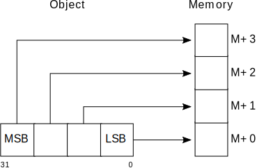

..
   Copyright (c) 2003, 2005-2009, 2012, 2015, 2018, 2020-2025, Arm Limited and its affiliates.  All rights reserved.
   CC-BY-SA-4.0 AND Apache-Patent-License
   See LICENSE file for details

.. |release| replace:: 2025Q1
.. |date-of-issue| replace:: 07\ :sup:`th` April 2025
.. |copyright-date| replace:: 2003, 2005-2009, 2012, 2015, 2018, 2020-2025
.. |footer| replace:: Copyright © |copyright-date|, Arm Limited and its
                      affiliates. All rights reserved.

.. |armarmv5_link| replace:: https://developer.arm.com/docs/ddi0100/latest/armv5-architecture-reference-manual
.. |armarmv7_link| replace:: https://developer.arm.com/docs/ddi0406/c/arm-architecture-reference-manual-armv7-a-and-armv7-r-edition
.. |gcppabi_link| replace:: http://itanium-cxx-abi.github.io/

.. _AAPCS32: https://github.com/ARM-software/abi-aa/releases
.. _RTABI32: https://github.com/ARM-software/abi-aa/releases
.. _CLIBABI32: https://github.com/ARM-software/abi-aa/releases
.. _CPPABI32: https://github.com/ARM-software/abi-aa/releases
.. _BSABI32: https://github.com/ARM-software/abi-aa/releases
.. _AAELF32: https://github.com/ARM-software/abi-aa/releases
.. _ACLE: https://developer.arm.com/products/software-development-tools/compilers/arm-compiler-5/docs/101028/latest/1-preface
.. _ARMARM: https://developer.arm.com/docs/ddi0406/c/arm-architecture-reference-manual-armv7-a-and-armv7-r-edition
.. _GCPPABI: http://itanium-cxx-abi.github.io/cxx-abi/abi.html

Procedure Call Standard for the Arm® Architecture
*************************************************

.. class:: version

|release|

.. class:: issued

Date of Issue: |date-of-issue|

.. class:: logo

.. image:: Arm_logo_blue_RGB.svg
   :scale: 30%

.. section-numbering::

.. raw:: pdf

   PageBreak oneColumn

Preamble
========

Abstract
--------

This document describes the Procedure Call Standard use by the Application
Binary Interface (ABI) for the Arm architecture.

Keywords
--------

Procedure call, function call, calling conventions, data layout

Latest release and defects report
---------------------------------

Please check `Application Binary Interface for the Arm® Architecture
<https://github.com/ARM-software/abi-aa>`_ for the latest
release of this document.

Please report defects in this specification to the `issue tracker page
on GitHub
<https://github.com/ARM-software/abi-aa/issues>`_.

.. raw:: pdf

   PageBreak

Licence
-------

This work is licensed under the Creative Commons
Attribution-ShareAlike 4.0 International License. To view a copy of
this license, visit http://creativecommons.org/licenses/by-sa/4.0/ or
send a letter to Creative Commons, PO Box 1866, Mountain View, CA
94042, USA.

Grant of Patent License. Subject to the terms and conditions of this
license (both the Public License and this Patent License), each
Licensor hereby grants to You a perpetual, worldwide, non-exclusive,
no-charge, royalty-free, irrevocable (except as stated in this
section) patent license to make, have made, use, offer to sell, sell,
import, and otherwise transfer the Licensed Material, where such
license applies only to those patent claims licensable by such
Licensor that are necessarily infringed by their contribution(s) alone
or by combination of their contribution(s) with the Licensed Material
to which such contribution(s) was submitted. If You institute patent
litigation against any entity (including a cross-claim or counterclaim
in a lawsuit) alleging that the Licensed Material or a contribution
incorporated within the Licensed Material constitutes direct or
contributory patent infringement, then any licenses granted to You
under this license for that Licensed Material shall terminate as of
the date such litigation is filed.

About the license
-----------------

As identified more fully in the Licence_ section, this project
is licensed under CC-BY-SA-4.0 along with an additional patent
license.  The language in the additional patent license is largely
identical to that in Apache-2.0 (specifically, Section 3 of Apache-2.0
as reflected at https://www.apache.org/licenses/LICENSE-2.0) with two
exceptions.

First, several changes were made related to the defined terms so as to
reflect the fact that such defined terms need to align with the
terminology in CC-BY-SA-4.0 rather than Apache-2.0 (e.g., changing
“Work” to “Licensed Material”).

Second, the defensive termination clause was changed such that the
scope of defensive termination applies to “any licenses granted to
You” (rather than “any patent licenses granted to You”).  This change
is intended to help maintain a healthy ecosystem by providing
additional protection to the community against patent litigation
claims.

Contributions
-------------

Contributions to this project are licensed under an inbound=outbound
model such that any such contributions are licensed by the contributor
under the same terms as those in the `Licence`_ section.

Trademark notice
----------------

The text of and illustrations in this document are licensed by Arm
under a Creative Commons Attribution–Share Alike 4.0 International
license ("CC-BY-SA-4.0”), with an additional clause on patents.
The Arm trademarks featured here are registered trademarks or
trademarks of Arm Limited (or its subsidiaries) in the US and/or
elsewhere. All rights reserved. Please visit
https://www.arm.com/company/policies/trademarks for more information
about Arm’s trademarks.

Copyright
---------

Copyright (c) |copyright-date|, Arm Limited and its affiliates.  All rights
reserved.

.. raw:: pdf

   PageBreak

.. contents::
   :depth: 3

.. raw:: pdf

   PageBreak

About This Document
===================

Change Control
--------------

Current Status and Anticipated Changes
^^^^^^^^^^^^^^^^^^^^^^^^^^^^^^^^^^^^^^

The following support level definitions are used by the Arm ABI specifications:

**Release**
   Arm considers this specification to have enough implementations, which have
   received sufficient testing, to verify that it is correct. The details of these
   criteria are dependent on the scale and complexity of the change over previous
   versions: small, simple changes might only require one implementation, but more
   complex changes require multiple independent implementations, which have been
   rigorously tested for cross-compatibility. Arm anticipates that future changes
   to this specification will be limited to typographical corrections,
   clarifications and compatible extensions.

**Beta**
   Arm considers this specification to be complete, but existing
   implementations do not meet the requirements for confidence in its release
   quality. Arm may need to make incompatible changes if issues emerge from its
   implementation.

**Alpha**
   The content of this specification is a draft, and Arm considers the
   likelihood of future incompatible changes to be significant.

All content in this document is at the **Release** quality level.

Change History
^^^^^^^^^^^^^^

If there is no entry in the change history table for a release, there are no
changes to the content of the document for that release.

.. class:: aapcs32-refs

.. table::

  +-------+-------------------------------------+-------------------------------------------------------------------+
  | Issue | Date                                | Change                                                            |
  +=======+=====================================+===================================================================+
  | 1.0   | 30\ :superscript:`th` October 2003  | First public release.                                             |
  +-------+-------------------------------------+-------------------------------------------------------------------+
  | 2.0   | 24\ :superscript:`th` March 2005    | Second public release.                                            |
  +-------+-------------------------------------+-------------------------------------------------------------------+
  | 2.01  | 5\ :superscript:`th` July 2005      | Added clarifying remark following `Additional data types`_        |
  |       |                                     | – word-sized enumeration contains are ``int`` if possible         |
  |       |                                     | (`Enumerated Types`_)                                             |
  +-------+-------------------------------------+-------------------------------------------------------------------+
  | 2.02  | 4\ :superscript:`th` August 2005    | Clarify that a callee may modify stack space used for incoming    |
  |       |                                     | parameters.                                                       |
  +-------+-------------------------------------+-------------------------------------------------------------------+
  | 2.03  | 7\ :superscript:`th` October 2005   | Added notes concerning VFPv3 D16-D31 (`VFP register usage         |
  |       |                                     | conventions`_); retracted requirement that plain bit-fields be    |
  |       |                                     | unsigned by default (`Bit-fields (C mappings)`_)                  |
  +-------+-------------------------------------+-------------------------------------------------------------------+
  | 2.04  | 4\ :superscript:`th` May 2006       | Clarified when linking may insert veneers that corrupt r12 and    |
  |       |                                     | the condition codes (`Use of IP by the linker`_).                 |
  +-------+-------------------------------------+-------------------------------------------------------------------+
  | 2.05  | 19\ :superscript:`th` January 2007  | Update for the Advanced SIMD Extension.                           |
  +-------+-------------------------------------+-------------------------------------------------------------------+
  | 2.06  | 2\ :superscript:`nd` October 2007   | Add support for half-precision floating point.                    |
  +-------+-------------------------------------+-------------------------------------------------------------------+
  | A     | 25\ :superscript:`th` October 2007  | Document renumbered (formerly GENC-003534 v2.06).                 |
  +-------+-------------------------------------+-------------------------------------------------------------------+
  | B     | 2\ :superscript:`nd` April 2008     | Simplify duplicated text relating to VFP calling and clarify that |
  |       |                                     | homogeneous aggregates of containerized vectors are limited to    |
  |       |                                     | four members in calling convention                                |
  |       |                                     | (`VFP co-processor register candidates`_).                        |
  +-------+-------------------------------------+-------------------------------------------------------------------+
  | C     | 10\ :superscript:`th` October 2008  | Clarify that __va_list is in namespace std. Specify containers    |
  |       |                                     | for oversized enums. State truth values for _Bool/bool.  Clarify  |
  |       |                                     | some wording with respect to homogeneous aggregates and argument  |
  |       |                                     | marshalling of VFP CPRCs.                                         |
  +-------+-------------------------------------+-------------------------------------------------------------------+
  | D     | 16\ :superscript:`th` October 2009  | Re-wrote `Enumerated Types`_ to better reflect the                |
  |       |                                     | intentions for  enumerated types in ABI-complying  interfaces.    |
  +-------+-------------------------------------+-------------------------------------------------------------------+
  | E     | 30\ :superscript:`th` November 2012 | Clarify that memory passed for a function result may be modified  |
  | 2.09  |                                     | at any  point during the function call (`Result Return            |
  |       |                                     | (base PCS)`_). Changed the illustrative source name               |
  |       |                                     | of the half-precision float type from __f16 to __fp16 to match    |
  |       |                                     | [ACLE_] (`Arithmetic Types`_). Re-wrote                           |
  |       |                                     | `APPENDIX: Support for Advanced SIMD Extensions and MVE`_ to      |
  |       |                                     | clarify requirements on Advanced SIMD types.                      |
  +-------+-------------------------------------+-------------------------------------------------------------------+
  | F     | 24\ :superscript:`th` October 2015  | `SIMD vector data types`_, corrected the element counts of        |
  |       |                                     | poly16x4_t and poly16x8_t. Added [u]int64x1_t, [u]int64x2_t,      |
  |       |                                     | poly64x2_t. Allow half-precision floating point types as function |
  |       |                                     | parameter and return types, by specifying how half-precision      |
  |       |                                     | floating point types are passed and returned in registers         |
  |       |                                     | `Result Return (base PCS)`_, `Parameter Passing (base PCS)`_,     |
  |       |                                     | `Mapping between registers and memory format`_, `VFP co-processor |
  |       |                                     | register candidates`_). Added parameter passing rules for         |
  |       |                                     | over-aligned types (`Composite Types`_, `Parameter Passing        |
  |       |                                     | (base PCS)`_).                                                    |
  +-------+-------------------------------------+-------------------------------------------------------------------+
  | 2018Q4| 21\ :superscript:`st` December 2018 | In `Volatile bit-fields – preserving number and width of          |
  |       |                                     | container accesses`_, relaxed the rules regarding                 |
  |       |                                     | accesses to volatile bitfield members to be compatible with the   |
  |       |                                     | C/C++ memory model.                                               |
  |       |                                     |                                                                   |
  |       |                                     | In `Stack probing`_, relaxed the rules regarding                  |
  |       |                                     | stack accesses to permit stack probing.                           |
  |       |                                     |                                                                   |
  |       |                                     | In `VFP register usage conventions`_, corrected the rules         |
  |       |                                     | regarding the values of the IDC and IDE bits of the FPSCR         |
  |       |                                     | register on a public interface.                                   |
  +-------+-------------------------------------+-------------------------------------------------------------------+
  | 2019Q4| 28\ :superscript:`th` January 2020  | Be more specific on the use of frame pointers and frame records.  |
  |       |                                     | (`The Frame Pointer`_,                                            |
  |       |                                     | `Machine Registers`_).                                            |
  |       |                                     |                                                                   |
  |       |                                     | Add description of half-precision Brain floating-point format     |
  |       |                                     | (`Half-precision Floating Point`_, `Arm Alternative Format        |
  |       |                                     | Half-precision Floating Point values`_, `Arithmetic Types`_).     |
  |       |                                     |                                                                   |
  |       |                                     | For clarity, renamed half-precision format 'Alternative' to 'Arm  |
  |       |                                     | Alternative' (`Half-precision Floating Point`_,  `Arm Alternative |
  |       |                                     | Format Half-precision Floating Point values`_, `Half-precision    |
  |       |                                     | Format Compatibility`_, `Mapping of C & C++ built-in data         |
  |       |                                     | types`_).                                                         |
  +-------+-------------------------------------+-------------------------------------------------------------------+
  | 2020Q2| 1\ :superscript:`st` July 2020      | Correct minus signs not rendering in sections                     |
  |       |                                     | `Bit-field extraction expressions`_ and `Over-sized bit-fields`_. |
  |       |                                     |                                                                   |
  |       |                                     | Clarify the AAPCS rules for volatile zero length bit-fields in    |
  |       |                                     | section `Volatile bit-fields – preserving number and width of     |
  |       |                                     | container accesses`_.                                             |
  +-------+-------------------------------------+-------------------------------------------------------------------+
  | 2020Q4| 21\ :sup:`st` December 2020         | - document released on Github                                     |
  |       |                                     | - new Licence_: CC-BY-SA-4.0                                      |
  |       |                                     | - new sections on Contributions_,                                 |
  |       |                                     |   `Trademark notice`_, and Copyright_                             |
  +-------+-------------------------------------+-------------------------------------------------------------------+
  | 2021Q1| 12\ :sup:`th` April 2021            | Clarify what it means for a VFP CPRC argument to be correctly     |
  |       |                                     | aligned.                                                          |
  +-------+-------------------------------------+-------------------------------------------------------------------+
  | 2023Q1| 6\ :sup:`th` April 2023             | Fix formatting of v6 cell in core registers table.                |
  +-------+-------------------------------------+-------------------------------------------------------------------+
  | 2023Q3| 6\ :sup:`th` October 2023           | In `Data Types`_  include _BitInt(N) in language mapping.         |
  +-------+-------------------------------------+-------------------------------------------------------------------+

References
----------

This document refers to, or is referred to by, the following documents.

.. table::

  +--------------------------+------------------------------------------------+-----------------------------------------------------+
  | Ref                      | External URL                                   | Title                                               |
  +==========================+================================================+=====================================================+
  | AAPCS32_                 | This document                                  | Procedure Call Standard for the Arm Architecture    |
  +--------------------------+------------------------------------------------+-----------------------------------------------------+
  | AAELF32_                 |                                                | ELF for the Arm Architecture                        |
  +--------------------------+------------------------------------------------+-----------------------------------------------------+
  | BSABI32_                 |                                                | ABI for the Arm Architecture (Base Standard)        |
  +--------------------------+------------------------------------------------+-----------------------------------------------------+
  | CPPABI32_                |                                                | C++ ABI for the Arm Architecture                    |
  +--------------------------+------------------------------------------------+-----------------------------------------------------+
  | ARMARM_                  | Arm DDI 0100E, ISBN 0 201 737191               | The Arm Architecture Reference Manual               |
  |                          |                                                | 2\ :superscript:`nd` edition, edited by David Seal, |
  |                          | |armarmv5_link|                                | published by Addison-Wessley.                       |
  +                          +------------------------------------------------+-----------------------------------------------------+
  |                          | Arm DDI 0406                                   | Arm Architecture Reference Manual Arm v7-A and      |
  |                          |                                                | Arm v7-R edition                                    |
  |                          | |armarmv7_link|                                |                                                     |
  +--------------------------+------------------------------------------------+-----------------------------------------------------+
  | ACLE_                    | IHI 0053A                                      | Arm C Language Extensions                           |
  +--------------------------+------------------------------------------------+-----------------------------------------------------+
  | GCPPABI_                 | |gcppabi_link|                                 | Generic C++ ABI                                     |
  +--------------------------+------------------------------------------------+-----------------------------------------------------+

Terms and Abbreviations
-----------------------

This document uses the following terms and abbreviations.

ABI
   Application Binary Interface:

   1. The specifications to which an executable must conform in order to
      execute in a specific execution environment. For example, the
      :title-reference:`Linux ABI for the Arm Architecture`.

   2. A particular aspect of the specifications to which independently
      produced relocatable files must conform in order to be statically
      linkable and executable. For example, the C++ ABI for the Arm
      Architecture [CPPABI32_], the Run-time ABI for the Arm Architecture
      [RTABI32_], the C Library ABI for the Arm Architecture [CLIBABI32_].

Arm-based
   based on the Arm architecture

EABI
   An ABI suited to the needs of embedded (sometimes called
   **free standing**) applications.

PCS
   Procedure Call Standard.

AAPCS
   Procedure Call Standard for the Arm Architecture (this standard).

APCS
   Arm Procedure Call Standard (obsolete).

TPCS
   Thumb Procedure Call Standard (obsolete).

ATPCS
   Arm-Thumb Procedure Call Standard (precursor to this standard).

PIC / PID
   Position-independent code, position-independent data.

Routine / subroutine
   A fragment of program to which control can be transferred that, on
   completing its task, returns control to its caller at an instruction
   following the call.  **Routine** is used for clarity where
   there are nested calls: a routine is the **caller** and a
   subroutine is the **callee**.

Procedure
   A routine that returns no result value.

Function
   A routine that returns a result value.

Activation stack / call-frame stack
   The stack of routine activation records (call frames).

Activation record / call frame
   The memory used by a routine for saving registers and holding local
   variables (usually allocated on a stack, once per activation of the
   routine).

Argument / Parameter
   The terms **argument** and **parameter** are used
   interchangeably. They may denote a formal parameter of a routine given
   the value of the actual parameter when the routine is called, or an
   actual parameter, according to context.

Externally visible [interface]
   [An interface] between separately compiled or separately assembled
   routines.

Variadic routine
   A routine is variadic if the number of arguments it takes, and their
   type, is determined by the caller instead of the callee.

Global register
   A register whose value is neither saved nor destroyed by a subroutine.
   The value may be updated, but only in a manner defined by the
   execution environment.

Program state
   The state of the program’s memory, including values in machine
   registers.

Scratch register / temporary register
   A register used to hold an intermediate value during a calculation
   (usually, such values are not named in the program source and have a
   limited lifetime).

Thumb-1
   The variant of the Thumb instruction set introduced in Arm v4T
   and used in Arm v6-M and the Arm v8-M.Baseline variants of the
   architecture.  It consists of instructions that are
   predominantly encoded with 16-bit opcodes.

Thumb-2
   The variant of the Thumb instruction set introduced in Arm v6T2.
   It consists of a mix of instructions encoded with 16- and 32-bit
   opcodes.

Variable register / v-register
   A register used to hold the value of a variable, usually one local to
   a routine, and often named in the source code.

More specific terminology is defined when it is first used.

Acknowledgements
----------------

This specification has been developed with the active support of the
following organizations. In alphabetical order: Arm, CodeSourcery, Intel,
Metrowerks, Montavista, Nexus Electronics, PalmSource, Symbian, Texas
Instruments, and Wind River.

.. raw:: pdf

   PageBreak

Scope
=====

The AAPCS defines how subroutines can be separately written, separately
compiled, and separately assembled to work together. It describes a contract
between a calling routine and a called routine that defines:

*  Obligations on the caller to create a program state in which the called
   routine may start to execute.

*  Obligations on the called routine to preserve the program state of the
   caller across the call.

*  The rights of the called routine to alter the program state of its
   caller.

This standard specifies the base for a family of **Procedure Call
Standard (PCS)** variants generated by choices that reflect alternative
priorities among:

*  Code size.

*  Performance.

*  Functionality (for example, ease of debugging, run-time checking, support
   for shared libraries).

Some aspects of each variant – for example the allowable use of R9 – are
determined by the execution environment. Thus:

*  It is possible for code complying strictly with the base standard to be
   PCS compatible with each of the variants.

*  It is unusual for code complying with a variant to be compatible with
   code complying with any other variant.

*  Code complying with a variant, or with the base standard, is not
   guaranteed to be compatible with an execution environment that requires
   those standards.  An execution environment may make further demands
   beyond the scope of the procedure call standard.

This standard is presented in four sections that, after an introduction,
specify:

*  The layout of data.

*  Layout of the stack and calling between functions with public interfaces.

*  Variations available for processor extensions, or when the execution
   environment restricts the addressing model.

*  The C and C++ language bindings for plain data types.

This specification does :emphasis:`not` standardize the representation of
publicly visible C++-language entities that are not also C language entities
(these are described in CPPABI32_) and it places no requirements on the
representation of language entities that are not visible across public
interfaces.

.. raw:: pdf

   PageBreak

Introduction
============

The AAPCS embodies the fifth major revision of the APCS and third major
revision of the TPCS. It forms part of the complete ABI specification for
the Arm Architecture.

Design Goals
------------

The goals of the AAPCS are to:

*  Support Thumb-state and Arm-state equally.

*  Support inter-working between Thumb-state and Arm-state.

*  Support efficient execution on high-performance implementations of the
   Arm Architecture.

*  Clearly distinguish between mandatory requirements and implementation
   discretion.

*  Minimize the binary incompatibility with the ATPCS.

Conformance
-----------

The AAPCS defines how separately compiled and separately assembled routines
can work together. There is an **externally visible interface**
between such routines.  It is common that not all the externally visible
interfaces to software are intended to be **publicly visible** or
open to arbitrary use. In effect, there is a mismatch between the
machine-level concept of external visibility—defined rigorously by an object
code format—and a **higher level**, application-oriented concept of
external visibility—which is system-specific or application-specific.

Conformance to the AAPCS requires that\ [#aapcs32-f1]_:

*  At all times, stack limits and basic stack alignment are observed
   (`Universal stack constraints`_).

*  At each call where the control transfer instruction is subject to a
   BL-type relocation at static link time, rules on the use of IP are
   observed (`Use of IP by the linker`_).

*  The routines of each publicly visible interface conform to the relevant
   procedure call standard variant.

*  The data elements\ [#aapcs32-f2]_ of each publicly visible interface
   conform to the data layout rules.

.. raw:: pdf

   PageBreak

Data Types and Alignment
========================

Fundamental Data Types
----------------------

The following table shows the fundamental data types (Machine Types) of
the machine.  A NULL pointer is always represented by all-bits-zero.

.. class:: aapcs32-fundamendal-data-types

.. table:: Byte size and byte alignment of fundamental data types

   +----------------+----------------------+-----------+----------------+------------------------------------------------------------+
   | Type Class     | Machine Type         | Byte size | Byte alignment | Note                                                       |
   +================+======================+===========+================+============================================================+
   | Integral       | Unsigned byte        | 1         | 1              | Character                                                  |
   |                +----------------------+-----------+----------------+                                                            |
   |                | Signed byte          | 1         | 1              |                                                            |
   |                +----------------------+-----------+----------------+------------------------------------------------------------+
   |                | Unsigned half-word   | 2         | 2              |                                                            |
   |                +----------------------+-----------+----------------+                                                            |
   |                | Signed half-word     | 2         | 2              |                                                            |
   |                +----------------------+-----------+----------------+------------------------------------------------------------+
   |                | Unsigned word        | 4         | 4              |                                                            |
   |                +----------------------+-----------+----------------+                                                            |
   |                | Signed word          | 4         | 4              |                                                            |
   |                +----------------------+-----------+----------------+------------------------------------------------------------+
   |                | Unsigned double-word | 8         | 8              |                                                            |
   |                +----------------------+-----------+----------------+                                                            |
   |                | Signed double-word   | 8         | 8              |                                                            |
   +----------------+----------------------+-----------+----------------+------------------------------------------------------------+
   | Floating       | Half precision       | 2         | 2              | See `Half-precision Floating Point`_.                      |
   | Point          +----------------------+-----------+----------------+------------------------------------------------------------+
   |                | Single precision     | 4         | 4              | The encoding of floating point numbers is described in     |
   |                | (IEEE 754)           |           |                | [ARMARM_] chapter C2, :title-reference:`VFP Programmer's   |
   |                +----------------------+-----------+----------------+ Model`, §2.1.1                                             |
   |                | Double precision     | 8         | 8              | :title-reference:`Single-precision format`, and            |
   |                | (IEEE 754)           |           |                | §2.1.2  :title-reference:`Double-precision format`.        |
   +----------------+----------------------+-----------+----------------+------------------------------------------------------------+
   | Containerized  | 64-bit vector        | 8         | 8              | See `Containerized Vectors`_.                              |
   | vector         +----------------------+-----------+----------------+                                                            |
   |                | 128-bit vector       | 16        | 8              |                                                            |
   +----------------+----------------------+-----------+----------------+------------------------------------------------------------+
   | Pointer        | Data pointer         | 4         | 4              | Pointer arithmetic should be unsigned.                     |
   |                +----------------------+-----------+----------------+                                                            |
   |                | Code pointer         | 4         | 4              | Bit 0 of a code pointer indicates the target instruction   |
   |                |                      |           |                | set type (0 Arm, 1 Thumb).                                 |
   +----------------+----------------------+-----------+----------------+------------------------------------------------------------+

Half-precision Floating Point
^^^^^^^^^^^^^^^^^^^^^^^^^^^^^

Optional extensions to the Arm architecture provide hardware support
for half-precision values. Three formats are currently supported:

1 - half-precision format specified in IEEE754-2008

2 - Arm Alternative format, which provides additional range but has no NaNs or
Infinities.

3 - Brain floating-point format, which provides a dynamic range similar to the
32-bit floating-point format, but with less precision.

The first two formats are mutually exclusive. The base standard of the AAPCS
specifies use of the IEEE754-2008 variant, and a procedure call variant that
uses the Arm Alternative format is permitted.

Containerized Vectors
^^^^^^^^^^^^^^^^^^^^^

The content of a containerized vector is opaque to most of the procedure
call standard: the only defined aspect of its layout is the mapping between
the memory format (the way a fundamental type is stored in memory) and
different classes of register at a procedure call interface. If a language
binding defines data types that map directly onto the containerized vectors
it will define how this mapping is performed.

Endianness and Byte Ordering
----------------------------

From a software perspective, memory is an array of bytes, each of which is
addressable.

This ABI supports two views of memory implemented by the underlying
hardware.

*  In a little-endian view of memory the least significant byte of a data
   object is at the lowest byte address the data object occupies in memory.

*  In a big-endian view of memory the least significant byte of a data
   object is at the highest byte address the data object occupies in memory.

The least significant bit in an object is always designated as **bit 0**.

The mapping of a word-sized data object to memory is shown in
the diagrams below. All objects are pure-endian, so
the mappings may be scaled accordingly for larger or smaller objects
[#aapcs32-f3]_.

.. rubric:: Memory layout of big-endian data object

.. rubric:: Memory layout of little-endian data object

Composite Types
---------------

A **Composite Type** is a collection of one or more Fundamental Data
Types that are handled as a single entity at the procedure call level. A
Composite Type can be any of:

*  An **aggregate**, where the members are laid out sequentially in
   memory

*  A **union**, where each of the members has the same address

*  An **array**, which is a repeated sequence of some other type (its
   base type).

The definitions are recursive; that is, each of the types may contain a
Composite Type as a member.

*  The **member alignment** of an element of a composite type is the
   alignment of that member after the application of any language alignment
   modifiers to that member

*  The **natural alignment** of a composite type is the maximum of
   each of the member alignments of the 'top-level' members of the composite
   type i.e. before any alignment adjustment of the entire composite is
   applied

Aggregates
^^^^^^^^^^

*  The alignment of an aggregate shall be the alignment of its most-aligned
   component.

*  The size of an aggregate shall be the smallest multiple of its alignment
   that is sufficient to hold all of its members when they are laid out
   according to these rules.

Unions
^^^^^^

*  The alignment of a union shall be the alignment of its most-aligned
   component.

*  The size of a union shall be the smallest multiple of its alignment that
   is sufficient to hold its largest member.

Arrays
^^^^^^

*  The alignment of an array shall be the alignment of its base type.

*  The size of an array shall be the size of the base type multiplied by the
   number of elements in the array.

.. _Bit-fields (data types):

Bit-fields
^^^^^^^^^^

A member of an aggregate that is a Fundamental Data Type may be subdivided
into bit-fields; if there are unused portions of such a member that are
sufficient to start the following member at its natural alignment then the
following member may use the unallocated portion.  For the purposes of
calculating the alignment of the aggregate the type of the member shall be
the Fundamental Data Type upon which the bit-field is based. [#aapcs32-f4]_
The layout of bit-fields within an aggregate is defined by the appropriate
language binding (see `Arm C and C++ Language Mappings`_).

Homogeneous Aggregates
^^^^^^^^^^^^^^^^^^^^^^

A Homogeneous Aggregate is a Composite Type where all of the Fundamental
Data Types that compose the type are the same.  The test for homogeneity is
applied after data layout is completed and without regard to access control
or other source language restrictions.

An aggregate consisting of containerized vector types is treated as
homogeneous if all the members are of the same size, even if the internal
format of the containerized members are different.  For example, a structure
containing a vector of 8 bytes and a vector of 4 half-words satisfies the
requirements for a homogeneous aggregate.

A Homogeneous Aggregate has a Base Type, which is the Fundamental Data Type
of each **Element**.  The overall size is the size of the Base Type
multiplied by the number of Elements; its alignment will be the alignment of
the Base Type.

.. raw:: pdf

   PageBreak

The Base Procedure Call Standard
================================

The base standard defines a machine-level, core-registers-only calling
standard common to the Arm and Thumb instruction sets.  It should be used
for systems where there is no floating-point hardware, or where a high
degree of inter-working with Thumb code is required.

Machine Registers
-----------------

The Arm architecture defines a core instruction set plus a number of
additional instructions implemented by co-processors.  The core instruction
set can access the core registers and co-processors can provide additional
registers which are available for specific operations.

Core registers
^^^^^^^^^^^^^^

There are 16, 32-bit core (integer) registers visible to the Arm and Thumb
instruction sets. These are labeled r0-r15 or R0-R15. Register names may
appear in assembly language in either upper case or lower case. In this
specification upper case is used when the register has a fixed role in the
procedure call standard. The following table summarizes the uses of the
core registers in this standard.  In addition to the core registers there is
one status register (CPSR) that is available for use in conforming code.

.. table:: Core registers and AAPCS usage

   +----------+---------+---------+-----------------------------------------+
   | Register | Synonym | Special | Role in the procedure call standard     |
   +==========+=========+=========+=========================================+
   | r15      |         | PC      | The Program Counter.                    |
   +----------+---------+---------+-----------------------------------------+
   | r14      |         | LR      | The Link Register.                      |
   +----------+---------+---------+-----------------------------------------+
   | r13      |         | SP      | The Stack Pointer.                      |
   +----------+---------+---------+-----------------------------------------+
   | r12      |         | IP      | The Intra-Procedure-call scratch        |
   |          |         |         | register.                               |
   +----------+---------+---------+-----------------------------------------+
   | r11      | v8      | FP      | Frame Pointer or Variable-register 8.   |
   +----------+---------+---------+-----------------------------------------+
   | r10      | v7      |         | Variable-register 7.                    |
   +----------+---------+---------+-----------------------------------------+
   | r9       | v6      | SB      | Platform register or Variable-register  |
   |          |         |         | 6.                                      |
   |          |         | TR      |                                         |
   |          |         |         | The meaning of this register is defined |
   |          |         |         | by the platform standard.               |
   +----------+---------+---------+-----------------------------------------+
   | r8       | v5      |         | Variable-register 5.                    |
   +----------+---------+---------+-----------------------------------------+
   | r7       | v4      |         | Variable-register 4.                    |
   +----------+---------+---------+-----------------------------------------+
   | r6       | v3      |         | Variable-register 3.                    |
   +----------+---------+---------+-----------------------------------------+
   | r5       | v2      |         | Variable-register 2.                    |
   +----------+---------+---------+-----------------------------------------+
   | r4       | v1      |         | Variable-register 1.                    |
   +----------+---------+---------+-----------------------------------------+
   | r3       | a4      |         | Argument / scratch register 4.          |
   +----------+---------+---------+-----------------------------------------+
   | r2       | a3      |         | Argument / scratch register 3.          |
   +----------+---------+---------+-----------------------------------------+
   | r1       | a2      |         | Argument / result / scratch register 2. |
   +----------+---------+---------+-----------------------------------------+
   | r0       | a1      |         | Argument / result / scratch register 1. |
   +----------+---------+---------+-----------------------------------------+

The first four registers r0-r3 (a1-a4) are used to pass argument values into
a subroutine and to return a result value from a function. They may also be
used to hold intermediate values within a routine (but, in general, only
:emphasis:`between` subroutine calls).

Register r12 (IP) may be used by a linker as a scratch register between a
routine and any subroutine it calls (for details, see
`Use of IP by the linker`_). It can also be used within a routine to hold
intermediate values between subroutine calls.

In some variants r11 (FP) may be used as a frame pointer in order to
chain frame activation records into a linked list.

The role of register r9 is platform specific. A virtual platform may assign
any role to this register and must document this usage. For example, it may
designate it as the static base (SB) in a position-independent data model,
or it may designate it as the thread register (TR) in an environment with
thread-local storage.  The usage of this register may require that the value
held is persistent across all calls. A virtual platform that has no need for
such a special register may designate r9 as an additional callee-saved
variable register, v6.

Typically, the registers r4-r8, r10 and r11 (v1-v5, v7 and v8) are used to
hold the values of a routine’s local variables. Of these, only v1-v4 can be
used uniformly by the whole Thumb instruction set, but the AAPCS does not
require that Thumb code only use those registers.

A subroutine must preserve the contents of the registers r4-r8, r10, r11 and
SP (and r9 in PCS variants that designate r9 as v6).

In all variants of the procedure call standard, registers r12-r15 have
special roles. In these roles they are labeled IP, SP, LR and PC.

The CPSR is a global register with the following properties:

*  The N, Z, C, V and Q bits (bits 27-31) and the GE[3:0] bits (bits 16-19)
   are undefined on entry to or return from a public interface.  The Q and
   GE[3:0] bits may only be modified when executing on a processor where
   these features are present.

*  On Arm Architecture 6, the E bit (bit 8) can be used in applications
   executing in little-endian mode, or in big-endian-8 mode to temporarily
   change the endianness of data accesses to memory.  An application must
   have a designated endianness and at entry to and return from any public
   interface the setting of the E bit must match the designated endianness
   of the application.

*  The T bit (bit 5) and the J bit (bit 24) are the execution state bits.
   Only instructions designated for modifying these bits may change them.

*  The A, I, F and M[4:0] bits (bits 0-7) are the privileged bits and may
   only be modified by applications designed to operate explicitly in a
   privileged mode.

*  All other bits are reserved and must not be modified.  It is not defined
   whether the bits read as zero or one, or whether they are preserved across
   a public interface.

Handling values larger than 32 bits
~~~~~~~~~~~~~~~~~~~~~~~~~~~~~~~~~~~

Fundamental types larger than 32 bits may be passed as parameters to, or
returned as the result of, function calls.  When these types are in core
registers the following rules apply:

*  A double-word sized type is passed in two consecutive registers (e.g., r0
   and r1, or r2 and r3).  The content of the registers is as if the value
   had been loaded from memory representation with a single ``LDM``
   instruction.

*  A 128-bit containerized vector is passed in four consecutive registers.
   The content of the registers is as if the value had been loaded from
   memory with a single ``LDM`` instruction.

Co-processor Registers
^^^^^^^^^^^^^^^^^^^^^^

A machine’s register set may be extended with additional registers that are
accessed via instructions in the co-processor instruction space.  To the
extent that such registers are not used for passing arguments to and from
subroutine calls the use of co-processor registers is compatible with the
base standard.  Each co-processor may provide an additional set of rules
that govern the usage of its registers.

.. note::
   Even though co-processor registers are not used for passing arguments,
   some elements of the run-time support for a language may require
   knowledge of all co-processors in use in an application in order to
   function correctly (for example, ``setjmp()`` in C and exceptions in
   C++).

VFP register usage conventions
~~~~~~~~~~~~~~~~~~~~~~~~~~~~~~

The VFP-v2 co-processor has 32 single-precision registers, s0-s31, which may
also be accessed as 16 double-precision registers, d0-d15 (with d0
overlapping s0, s1; d1 overlapping s2, s3; etc). In addition there are 3 or
more system registers, depending on the implementation. VFP-v3 adds 16 more
double-precision registers d16-d31, but there are no additional
single-precision counterparts. The Advanced SIMD Extension and the M-profile
vector Extension (MVE) use the VFP register set. The Advanced SIMD Extension
uses the double-precision registers for 64-bit vectors and further defines
quad-word registers (with q0 overlapping d0, d1; and q1 overlapping d2, d3;
etc) for 128-bit vectors. MVE uses 128-bit vectors in the same quad-word
registers.

Registers s16-s31 (d8-d15, q4-q7) must be preserved across subroutine calls;
registers s0-s15 (d0-d7, q0-q3) do not need to be preserved (and can be used
for passing arguments or returning results in standard procedure-call
variants). Registers d16-d31 (q8-q15), if present, do not need to be
preserved.

The FPSCR and VPR registers are the only status registers that may be accessed
by conforming code. FPSCR is a global register with the following properties:

*  The condition code bits (28-31), the cumulative saturation (QC) bit (27)
   and the cumulative exception-status bits (0-4 and 7) are not preserved
   across a public interface.

*  The exception-control bits (8-12 and 15), rounding mode bits (22-23) and
   flush-to-zero bits (24) may be modified by calls to specific support
   functions that affect the global state of the application.

*  The length bits (16-18) must be 0b100 when using M-profile Vector Extension,
   0b000 when using VFP vector mode and otherwise preserved across a public
   interface.

*  The stride bits (20-21) must be zero on entry to and return from a public
   interface.

*  All other bits are reserved and must not be modified.  It is not defined
   whether the bits read as zero or one, or whether they are preserved
   across a public interface.

VPR is a global register with the following properties:

*  The VPT mask bits (16-23) must be zero on entry to and return from a public
   interface.

*  The predication bits (0-15) are not preserved across a public interface.

*  All other bits are reserved and must not be modified. It is not defined
   whether the bits read as zero or one, or whether they are preserved across
   a public interface.

Processes, Memory and the Stack
-------------------------------

The AAPCS applies to a **single thread of execution** or
**process** (hereafter referred to as a process). A process has a
**program state** defined by the underlying machine registers and the
contents of the memory it can access. The memory a process can access,
without causing a run-time fault, may vary during the execution of the
process.

The memory of a process can normally be classified into five categories:

*  code (the program being executed), which must be readable, but need not
   be writable, by the process.

*  read-only static data.

*  writable static data.

*  the heap.

*  the stack.

Writable static data may be further sub-divided into initialized,
zero-initialized and uninitialized data. Except for the stack there is no
requirement for each class of memory to occupy a single contiguous region of
memory. A process must always have some code and a stack, but need not have
any of the other categories of memory.

The heap is an area (or areas) of memory that are managed by the process
itself (for example, with the C ``malloc`` function). It is typically used
for the creation of dynamic data objects.

A conforming program must only execute instructions that are in areas of
memory designated to contain code.

The Stack
^^^^^^^^^

The stack is a contiguous area of memory that may be used for storage of
local variables and for passing additional arguments to subroutines when
there are insufficient argument registers available.

The stack implementation is **full-descending**, with the current
extent of the stack held in the register SP (r13). The stack will, in
general, have both a **base** and a **limit** though in
practice an application may not be able to determine the value of either.

The stack may have a fixed size or be dynamically extendable (by adjusting
the stack-limit downwards).

The rules for maintenance of the stack are divided into two parts: a set of
constraints that must be observed at all times, and an additional constraint
that must be observed at a public interface.

Universal stack constraints
~~~~~~~~~~~~~~~~~~~~~~~~~~~

At all times the following basic constraints must hold:

*  Stack-limit ≤ SP ≤ stack-base. The stack pointer must lie within the
   extent of the stack.

*  SP mod 4 = 0. The stack must at all times be aligned to a word boundary.

*  A process may only store data in the closed interval of the entire stack
   delimited by [SP, stack base - 1] (where SP is the value of register r13).

.. note::
   This implies that instructions of the following form can fail to satisfy
   the stack discipline constraints, even when ``reg`` points within the
   extent of the stack.

   .. code-block:: text

      ldmxx    reg, {..., sp, ...}             // reg != sp

   If execution of the instruction is interrupted after sp has been loaded,
   the stack extent will not be restored, so restarting the instruction
   might violate the third constraint.

Stack constraints at a public interface
~~~~~~~~~~~~~~~~~~~~~~~~~~~~~~~~~~~~~~~

The stack must also conform to the following constraint at a public
interface:

* SP mod 8 = 0. The stack must be double-word aligned.

Stack probing
~~~~~~~~~~~~~

In order to ensure stack integrity a process may emit stack probes immediately
prior to allocating additional stack space (moving SP from SP_old to SP_new).
Stack probes must be in the region of [SP_new, SP_old - 1] and may be either
read or write operations. The minimum interval for stack probing is defined by
the target platform but must be a minimum of 4KBytes. No recoverable data can
be saved below the currently allocated stack region.

The Frame Pointer
~~~~~~~~~~~~~~~~~

A platform may require the construction of a list of stack frames
describing the current call hierarchy in a program.

Each frame shall link to the frame of its caller by means of a Frame
Record of two 32-bit values on the stack.  The frame record for the
innermost frame (belonging to the most recent routine invocation)
shall be pointed to by the Frame Pointer register (FP).  The lowest
addressed word shall point to the previous frame record and the
highest addressed word shall contain the value passed in LR on entry
to the current function.  The end of the frame record chain is
indicated by the address zero in the address for the previous frame.
The location of the frame record within a stack frame is not
specified.  The frame pointer register must not be updated until the
new frame record has been fully constructed.

.. note::
   There will always be a short period during construction or
   destruction of each frame record during which the frame pointer
   will point to the caller’s record.

A platform shall mandate the minimum level of conformance with respect
to the maintenance of frame records.  The options are, in decreasing
level of functionality:

- It may require the frame pointer to address a valid frame record at
  all times, except that small subroutines which do not modify the
  link register may elect not to create a frame record

- It may require the frame pointer to address a valid frame record at
  all times, except that any subroutine may elect not to create a
  frame record

- It may permit the frame pointer register to be used as a
  general-purpose callee-saved register, but provide a
  platform-specific mechanism for external agents to reliably locate
  the chain of frame records

- It may elect not to maintain a frame chain and to use the frame
  pointer register as a general-purpose callee-saved register.

.. note::
   Unlike the APCS and its variants, the same frame pointer register
   is used for both the Arm and Thumb ISAs (including the Thumb-1
   variant), this ensures that the frame chain can be 
   constructed even when generating code that interworks between both
   the Arm and Thumb instruction sets.  It is expected that Thumb-1
   code will rarely, if ever, want to create stack frames - the choice
   of a high register therefore ensures that such code can conform
   minimally to the requirements of having a valid value stored in the
   frame pointer register without noticably reducing the number of
   registers available to normal code.

   The AAPCS does not specify where, within a function's stack frame
   record, the frame chain data structure resides.  This permits
   implementors the freedom to use whatever location will result in
   the most efficient code needed to establish the frame chain record.
   As a result, even in Thumb-1, the overhead for establishing the
   frame will rarely exceed three additional instructions in the
   function entry sequence and two additional instructions in the
   return sequence.

Subroutine Calls
----------------

Both the Arm and Thumb instruction sets contain a primitive subroutine call
instruction, BL, which performs a branch-with-link operation.  The effect of
executing BL is to transfer the sequentially next value of the program
counter – the **return** address – into the link register (LR) and the
destination address into the program counter (PC). Bit 0 of the link
register will be set to 1 if the BL instruction was executed from Thumb
state, and to 0 if executed from Arm state. The result is to transfer
control to the destination address, passing the return address in LR as an
additional parameter to the called subroutine.

Control is returned to the instruction following the BL when the return
address is loaded back into the PC (see `Interworking`_).

A subroutine call can be synthesized by any instruction sequence that has
the effect:

.. code-block::

      LR[31:1] ← return address
      LR[0]    ← code type at return address (0 Arm, 1 Thumb)
      PC       ← subroutine address
      ...
   return address:

For example, in Arm-state, to call a subroutine addressed by r4 with control
returning to the following instruction, do

.. code-block:: asm

   MOV  LR, PC
   BX   r4
   ...

.. note::
   The equivalent sequence will not work from Thumb state because the
   instruction that sets LR does not copy the Thumb-state bit to LR[0].

In Arm Architecture v5 both Arm and Thumb state provide a BLX instruction
that will call a subroutine addressed by a register and correctly sets the
return address to the sequentially next value of the program counter.

Use of IP by the linker
^^^^^^^^^^^^^^^^^^^^^^^

Both the Arm- and Thumb-state BL instructions are unable to address the full
32-bit address space, so it may be necessary for the linker to insert a
veneer between the calling routine and the called subroutine.  Veneers may
also be needed to support Arm-Thumb inter-working or dynamic linking.  Any
veneer inserted must preserve the contents of all registers except IP (r12)
and the condition code flags; a conforming program must assume that a veneer
that alters IP may be inserted at any branch instruction that is exposed to
a relocation that supports inter-working or long branches.

.. note::
   ``R_ARM_CALL``, ``R_ARM_JUMP24``, ``R_ARM_PC24``,
   ``R_ARM_THM_CALL``, ``R_ARM_THM_JUMP24`` and
   ``R_ARM_THM_JUMP19`` are examples of the ELF relocation types with
   this property.  See AAELF32_ for full details.

.. _Result Return (base PCS): 

Result Return
-------------

The manner in which a result is returned from a function is determined by the
type of that result.

For the base standard:

*  A Half-precision Floating Point Type is returned in the least significant
   16 bits of r0.

*  A Fundamental Data Type that is smaller than 4 bytes is zero- or
   sign-extended to a word and returned in r0.

*  A word-sized Fundamental Data Type (e.g., ``int``, ``float``) is
   returned in r0.

*  A double-word sized Fundamental Data Type (e.g., ``long long``,
   ``double`` and 64-bit containerized vectors) is returned in r0 and r1.

*  A 128-bit containerized vector is returned in r0-r3.

*  A Composite Type not larger than 4 bytes is returned in r0.  The format
   is as if the result had been stored in memory at a word-aligned address
   and then loaded into r0 with an LDR instruction.  Any bits in r0 that lie
   outside the bounds of the result have unspecified values.

*  A Composite Type larger than 4 bytes, or whose size cannot be determined
   statically by both caller and callee, is stored in memory at an address
   passed as an extra argument when the function was called
   (`Parameter Passing (base PCS)`_, `Rule A.4`_). The
   memory to be used for the result may be modified at any point during the
   function call.

.. _Parameter Passing (base PCS):

Parameter Passing
-----------------

The base standard provides for passing arguments in core registers (r0-r3)
and on the stack.  For subroutines that take a small number of parameters,
only registers are used, greatly reducing the overhead of a call.

Parameter passing is defined as a two-level conceptual model

*  A mapping from a source language argument onto a machine type

*  The marshalling of machine types to produce the final parameter list

The mapping from the source language onto the machine type is specific for
each language and is described separately (the C and C++ language bindings
are described in `Arm C and C++ Language Mappings`_). The result is an ordered list of
arguments that are to be passed to the subroutine.

In the following description there are assumed to be a number of
co-processors available for passing and receiving arguments.  The
co-processor registers are divided into different classes.  An argument may
be a candidate for at most one co-processor register class.  An argument
that is suitable for allocation to a co-processor register is known as a
Co-processor Register Candidate (CPRC).

In the base standard there are no arguments that are candidates for a
co-processor register class.

A variadic function is always marshaled as for the base standard.

For a caller, sufficient stack space to hold stacked arguments is assumed to
have been allocated prior to marshaling: in practice the amount of stack
space required cannot be known until after the argument marshalling has been
completed.  A callee can modify any stack space used for receiving parameter
values from the caller.

When a Composite Type argument is assigned to core registers (either fully
or partially), the behavior is as if the argument had been stored to memory
at a word-aligned (4-byte) address and then loaded into consecutive
registers using a suitable load-multiple instruction.

.. rubric:: Stage A -– Initialization

This stage is performed exactly once, before processing of the arguments
commences.

.. table::

  +-------------------------+-------------------------------------------------------------------------+
  | .. _Rule A.1:           | The Next Core Register Number (NCRN) is set to r0.                      |
  |                         |                                                                         |
  | A.1                     |                                                                         |
  +-------------------------+-------------------------------------------------------------------------+
  | .. _Rule A.2.cp:        | :emphasis:`Co-processor argument register initialization is performed.` |
  |                         |                                                                         |
  | :emphasis:`A.2.cp`      |                                                                         |
  +-------------------------+-------------------------------------------------------------------------+
  | .. _Rule A.3:           | The next stacked argument address (NSAA) is set to the current          |
  |                         | stack-pointer value (SP).                                               |
  | A.3                     |                                                                         |
  +-------------------------+-------------------------------------------------------------------------+
  | .. _Rule A.4:           | If the subroutine is a function that returns a result in                |
  |                         | memory, then the address for the result is placed in r0 and             |
  | A.4                     | the NCRN is set to r1.                                                  |
  +-------------------------+-------------------------------------------------------------------------+

.. rubric:: Stage B – Pre-padding and extension of arguments

For each argument in the list the first matching rule from the following
list is applied.

.. table::

  +-------------------------+--------------------------------------------------------------------------+
  | .. _Rule B.1:           | If the argument is a Composite Type whose size cannot be                 |
  |                         | statically determined by both the caller and callee, the                 |
  | B.1                     | argument is copied to memory and the argument is replaced by a           |
  |                         | pointer to the copy.                                                     |
  +-------------------------+--------------------------------------------------------------------------+
  | .. _Rule B.2:           | If the argument is an integral Fundamental Data Type that is             |
  |                         | smaller than a word, then it is zero- or sign-extended to a              |
  | B.2                     | full word and its size is set to 4 bytes. If the argument is a           |
  |                         | Half-precision Floating Point Type its size is set to 4 bytes            |
  |                         | as if it had been copied to the least significant bits of a              |
  |                         | 32-bit register and the remaining bits filled with unspecified           |
  |                         | values.                                                                  |
  +-------------------------+--------------------------------------------------------------------------+
  | .. _Rule B.3.cp:        | :emphasis:`If the argument is a CPRC then any preparation rules for that |
  |                         | co-processor register class are applied.`                                |
  | :emphasis:`B.3.cp`      |                                                                          |
  +-------------------------+--------------------------------------------------------------------------+
  | .. _Rule B.4:           | If the argument is a Composite Type whose size is not a                  |
  |                         | multiple of 4 bytes, then its size is rounded up to the                  |
  | B.4                     | nearest multiple of 4.                                                   |
  +-------------------------+--------------------------------------------------------------------------+
  | .. _Rule B.5:           | If the argument is an alignment adjusted type its value is               |
  |                         | passed as a copy of the actual value. The copy will have an              |
  | B.5                     | alignment defined as follows.                                            |
  |                         |                                                                          |
  |                         | *  For a Fundamental Data Type, the alignment is the natural             |
  |                         |    alignment of that type, after any promotions.                         |
  |                         |                                                                          |
  |                         | *  For a Composite Type, the alignment of the copy will have             |
  |                         |    4-byte alignment if its natural alignment is ≤ 4 and 8-byte           |
  |                         |    alignment if its natural alignment is ≥ 8                             |
  |                         |                                                                          |
  |                         | The alignment of the copy is used for applying marshaling                |
  |                         | rules.                                                                   |
  +-------------------------+--------------------------------------------------------------------------+

.. rubric:: Stage C – Assignment of arguments to registers and stack

For each argument in the list the following rules are applied in turn until the
argument has been allocated.

.. table::

  +-------------------------+-------------------------------------------------------------------------+
  | .. _Rule C.1.cp:        | :emphasis:`If the argument is a CPRC and there are sufficient           |
  |                         | unallocated co-processor registers of the appropriate class,            |
  | :emphasis:`C.1.cp`      | the argument is allocated to co-processor registers.`                   |
  +-------------------------+-------------------------------------------------------------------------+
  | .. _Rule C.2.cp:        | :emphasis:`If the argument is a CPRC then any co-processor registers in |
  |                         | that class that are unallocated are marked as unavailable.              |
  | :emphasis:`C.2.cp`      | The NSAA is adjusted upwards until it is correctly aligned for          |
  |                         | the argument and the argument is copied to the memory at the            |
  |                         | adjusted NSAA.  The NSAA is further incremented by the size of          |
  |                         | the argument.  The argument has now been allocated.`                    |
  +-------------------------+-------------------------------------------------------------------------+
  | .. _Rule C.3:           | If the argument requires double-word alignment (8-byte), the            |
  |                         | NCRN is rounded up to the next even register number.                    |
  | C.3                     |                                                                         |
  +-------------------------+-------------------------------------------------------------------------+
  | .. _Rule C.4:           | If the size in words of the argument is not more than r4 minus          |
  |                         | NCRN, the argument is copied into core registers, starting at           |
  | C.4                     | the NCRN. The NCRN is incremented by the number of registers            |
  |                         | used.  Successive registers hold the parts of the argument              |
  |                         | they would hold if its value were loaded into those registers           |
  |                         | from memory using an LDM instruction. The argument has now              |
  |                         | been allocated.                                                         |
  +-------------------------+-------------------------------------------------------------------------+
  | .. _Rule C.5:           | If the NCRN is less than r4 and the NSAA is equal to the SP,            |
  |                         | the argument is split between core registers and the stack.             |
  | C.5                     | The first part of the argument is copied into the core                  |
  |                         | registers starting at the NCRN up to and including r3.  The             |
  |                         | remainder of the argument is copied onto the stack, starting            |
  |                         | at the NSAA.  The NCRN is set to r4 and the NSAA is                     |
  |                         | incremented by the size of the argument minus the amount                |
  |                         | passed in registers.  The argument has now been allocated.              |
  +-------------------------+-------------------------------------------------------------------------+
  | .. _Rule C.6:           | The NCRN is set to r4.                                                  |
  |                         |                                                                         |
  | C.6                     |                                                                         |
  +-------------------------+-------------------------------------------------------------------------+
  | .. _Rule C.7:           | If the argument required double-word alignment (8-byte), then           |
  |                         | the NSAA is rounded up to the next double-word address.                 |
  | C.7                     |                                                                         |
  +-------------------------+-------------------------------------------------------------------------+
  | .. _Rule C.8:           | The argument is copied to memory at the NSAA.  The NSAA is              |
  |                         | incremented by the size of the argument.                                |
  | C.8                     |                                                                         |
  +-------------------------+-------------------------------------------------------------------------+

It should be noted that the above algorithm makes provision for languages
other than C and C++ in that it provides for passing arrays by value and for
passing arguments of dynamic size.  The rules are defined in a way that
allows the caller to be always able to statically determine the amount of
stack space that must be allocated for arguments that are not passed in
registers, even if the function is variadic.

Several further observations can also be made:

*  The initial stack slot address is the value of the stack pointer that
   will be passed to the subroutine. It may therefore be necessary to run
   through the above algorithm twice during compilation, once to determine
   the amount of stack space required for arguments and a second time to
   assign final stack slot addresses.

*  A double-word aligned type will always start in an even-numbered core
   register, or at a double-word aligned address on the stack even if it is
   not the first member of an aggregate.

*  Arguments are allocated first to registers and only excess arguments are
   placed on the stack.

*  Arguments that are Fundamental Data Types can either be entirely in
   registers or entirely on the stack.

*  At most one argument can be split between registers and memory according
   to `Rule C.5`.

*  CPRCs may be allocated to co-processor registers or the stack – they may
   never be allocated to core registers.

*  Since an argument may be a candidate for at most one class of
   co-processor register, then the rules for multiple co-processors (should
   they be present) may be applied in any order without affecting the
   behavior.

*  An argument may only be split between core registers and the stack if all
   preceding CPRCs have been allocated to co-processor registers.

Interworking
------------

The AAPCS requires that all sub-routine call and return sequences support
inter-working between Arm and Thumb states.  The implications on compiling
for various Arm Architectures are as follows.

.. rubric:: Arm v5 and Arm v6

Calls via function pointers should use one of the following, as appropriate:

.. code-block:: asm

   blx   Rm    ; For normal sub-routine calls

.. code-block:: asm

   bx    Rm    ; For tail calls

Calls to functions that use ``bl<cond>``, ``b``, or ``b<cond>``
will need a linker-generated veneer if a state change is required, so it may
sometimes be more efficient to use a sequence that permits use of an
unconditional ``bl`` instruction.

Return sequences may use load-multiple operations that directly load the PC
or a suitable ``bx`` instruction.

The following traditional return must not be used if inter-working might be
required.

.. code-block:: asm

   mov   pc, Rm

.. rubric:: Arm v4T

In addition to the constraints for Arm v5, the following additional
restrictions apply to Arm v4T.

Calls using ``bl`` that involve a state change also require a
linker-generated stub.

Calls via function pointers must use a sequence equivalent to the Arm-state
code

.. code-block:: asm

   mov   lr, pc
   bx    Rm

However, this sequence does not work for Thumb state, so usually a
``bl`` to a veneer that does the ``bx`` instruction must be used.

Return sequences must restore any saved registers and then use a ``bx``
instruction to return to the caller.

.. rubric:: Arm v4

The Arm v4 Architecture supports neither Thumb state nor the ``bx``
instruction, therefore it is not strictly compatible with the AAPCS.

It is recommended that code for Arm v4 be compiled using Arm v4T
inter-working sequences but with all ``bx`` instructions subject to
relocation by an ``R_ARM_V4BX`` relocation [AAELF32_]. A
linker linking for Arm V4 can then change all instances of:

.. code-block:: asm

   bx    Rm

Into:

.. code-block:: asm

   mov   pc, Rm

But relocatable files remain compatible with this standard.

.. raw:: pdf

   PageBreak

The Standard Variants
=====================

This section applies only to non-variadic functions.  For a variadic
function the base standard is always used both for argument passing and
result return.

VFP and SIMD vector Register Arguments
--------------------------------------

This variant alters the manner in which floating-point values are passed
between a subroutine and its caller and allows significantly better
performance when a VFP co-processor, the Advanced SIMD Extension or the
M-profile Vector Extension is present.

Mapping between registers and memory format
^^^^^^^^^^^^^^^^^^^^^^^^^^^^^^^^^^^^^^^^^^^

Values passed across a procedure call interface in VFP registers are laid
out as follows:

*  A half precision floating point type is passed as if it were loaded from
   its memory format into the least significant 16 bits of a single
   precision register.

*  A single precision floating point type is passed as if it were loaded
   from its memory format into a single precision register with ``VLDR``.

*  A double precision floating point type is passed as if it were loaded
   from its memory format into a double precision register with ``VLDR``.

*  A 64-bit containerized vector type is passed as if it were loaded from
   its memory format into a 64-bit vector register (D\ :emphasis:`n`) with
   ``VLDR``.

*  A 128-bit containerized vector type is passed as if it were loaded from
   its memory format into a 128-bit vector register (Q\ :emphasis:`n`) with
   a single ``VLDM`` of the two component 64-bit vector registers (for
   example, ``VLDM r0,{d2,d3}`` would load q1).

Procedure Calling
^^^^^^^^^^^^^^^^^

The set of call saved registers is the same as for the base standard
(`VFP register usage conventions`_).

VFP co-processor register candidates
~~~~~~~~~~~~~~~~~~~~~~~~~~~~~~~~~~~~

For the VFP the following argument types are VFP CPRCs.

*  A half-precision floating-point type.

*  A single-precision floating-point type.

*  A double-precision floating-point type.

*  A 64-bit or 128-bit containerized vector type.

*  A Homogeneous Aggregate with a Base Type of a single- or double-precision
   floating-point type with one to four Elements.

*  A Homogeneous Aggregate with a Base Type of 64-bit containerized vectors
   with one to four Elements.

*  A Homogeneous Aggregate with a Base Type of 128-bit containerized vectors
   with one to four Elements.

.. note::
   There are no VFP CPRCs in a variadic procedure.

.. _Result return (VFP variant):

Result return
~~~~~~~~~~~~~

Any result whose type would satisfy the conditions for a VFP CPRC is
returned in the appropriate number of consecutive VFP registers starting
with the lowest numbered register (s0, d0, q0).

All other types are returned as for the base standard.

.. _Parameter passing (VFP variant):

Parameter passing
~~~~~~~~~~~~~~~~~

There is one VFP co-processor register class using registers s0-s15 (d0-d7) for
passing arguments.

The following co-processor rules are defined for the VFP:

.. table::

  +---------+-------------------------------------------------------------+
  | A.2.vfp | The floating point argument registers are marked as         |
  |         | unallocated.                                                |
  +---------+-------------------------------------------------------------+
  | B.3.vfp | Nothing to do.                                              |
  +---------+-------------------------------------------------------------+
  | C.1.vfp | If the argument is a VFP CPRC and there are sufficient      |
  |         | consecutive VFP registers of the appropriate type           |
  |         | unallocated then the argument is allocated to the           |
  |         | lowest-numbered sequence of such registers.                 |
  +---------+-------------------------------------------------------------+
  | C.2.vfp |  If the argument is a VFP CPRC then any VFP registers that  |
  |         |  are unallocated are marked as unavailable.  The NSAA is    |
  |         |  rounded up to the next multiple of 4 if the natural        |
  |         |  alignment of the argument is ≤ 4 or the next multiple of 8 |
  |         |  if its natural alignment is ≥ 8 and the argument is copied |
  |         |  to the stack at the adjusted NSAA.  The NSAA is further    |
  |         |  incremented by the size of the argument.  The argument has |
  |         |  now been allocated.                                        |
  +---------+-------------------------------------------------------------+

Note that the rules require the ‘back-filling’ of unused co-processor
registers that are skipped by the alignment constraints of earlier
arguments.  The back-filling continues only so long as no VFP CPRC has been
allocated to a slot on the stack.

Arm Alternative Format Half-precision Floating Point values
-----------------------------------------------------------

Code may be compiled to use the Arm Alternative format Half-precision values.
The rules for passing and returning values will either use the Base Standard
rules or the VFP and SIMD vector register rules.

Read-Write Position Independence (RWPI)
---------------------------------------

Code compiled or assembled for execution environments that require
read-write position independence (for example, the single address-space
DLL-like model) use a static base to address writable data.  Core register
r9 is renamed as SB and used to hold the static base address: consequently
this register may not be used for holding other values at any time
[#aapcs32-f5]_.

Variant Compatibility
---------------------

The variants described in `The Standard Variants`_ can produce code that is
incompatible with the base standard.  Nevertheless, there still exist
subsets of code that may be compatible across more than one variant.  This
section describes the theoretical levels of compatibility between the
variants; however, whether a toolchain must accept compatible objects
compiled to different base standards, or correctly reject incompatible
objects, is implementation defined.

VFP and Base Standard Compatibility
^^^^^^^^^^^^^^^^^^^^^^^^^^^^^^^^^^^

Code compiled for the VFP calling standard is compatible with the base
standard (and vice-versa) if no floating-point or containerized vector
arguments or results are used, or if the only routines that pass or return
such values are variadic routines.

RWPI and Base Standard Compatibility
^^^^^^^^^^^^^^^^^^^^^^^^^^^^^^^^^^^^

Code compiled for the base standard is compatible with the RWPI calling
standard if it makes no use of register r9.  However, a platform ABI may
restrict further the subset of code that is usefully compatible.

VFP and RWPI Standard Compatibility
^^^^^^^^^^^^^^^^^^^^^^^^^^^^^^^^^^^

The VFP calling variant and RWPI addressing variant may be combined to
create a third major variant.  The appropriate combination of the rules
described above will determine whether code is compatible.

Half-precision Format Compatibility
^^^^^^^^^^^^^^^^^^^^^^^^^^^^^^^^^^^

The set of values that can be represented in Arm Alternative format differs from
the set that can be represented in IEEE754-2008 format rendering code built to
use either format incompatible with code that uses the other.
However, most code will make no use of either format and will
therefore be compatible with both variants.

.. raw:: pdf

   PageBreak

Arm C and C++ Language Mappings
===============================

This section describes how Arm compilers map C language features onto the
machine-level standard. To the extent that C++ is a superset of the C
language it also describes the mapping of C++ language features.

Data Types
----------

Arithmetic Types
^^^^^^^^^^^^^^^^

The mapping of C arithmetic types to Fundamental Data Types is shown in
the following table.

.. _Mapping of C & C++ built-in data types:

.. table:: Mapping of C & C++ built-in data types

  +--------------------------------+-----------------------------------------+------------------------------------------------------------------------+
  | C/C++ Type                     | Machine Type                            | Notes                                                                  |
  +================================+=========================================+========================================================================+
  | ``char``                       | unsigned byte                           | ``LDRB`` is unsigned                                                   |
  +--------------------------------+-----------------------------------------+------------------------------------------------------------------------+
  | ``unsigned char``              | unsigned byte                           |                                                                        |
  +--------------------------------+-----------------------------------------+------------------------------------------------------------------------+
  | ``signed char``                | signed byte                             |                                                                        |
  +--------------------------------+-----------------------------------------+------------------------------------------------------------------------+
  | ``[signed] short``             | signed halfword                         |                                                                        |
  +--------------------------------+-----------------------------------------+------------------------------------------------------------------------+
  | ``unsigned short``             | unsigned halfword                       |                                                                        |
  +--------------------------------+-----------------------------------------+------------------------------------------------------------------------+
  | ``[signed] int``               | signed word                             |                                                                        |
  +--------------------------------+-----------------------------------------+------------------------------------------------------------------------+
  | ``unsigned int``               | unsigned word                           |                                                                        |
  +--------------------------------+-----------------------------------------+------------------------------------------------------------------------+
  | ``[signed] long``              | signed word                             |                                                                        |
  +--------------------------------+-----------------------------------------+------------------------------------------------------------------------+
  | ``unsigned long``              | unsigned word                           |                                                                        |
  +--------------------------------+-----------------------------------------+------------------------------------------------------------------------+
  | ``[signed] long long``         | signed double-word                      | C99 Only                                                               |
  +--------------------------------+-----------------------------------------+------------------------------------------------------------------------+
  | ``unsigned long long``         | unsigned double-word                    | C99 Only                                                               |
  +--------------------------------+-----------------------------------------+------------------------------------------------------------------------+
  | ``__fp16``                     | half precision (IEEE754-2008 or Arm     | Arm extension documented in [ACLE_].                                   |
  |                                | Alternative)                            | In a variadic function call this will be passed as a double-precision  |
  |                                |                                         | value.                                                                 |
  +--------------------------------+-----------------------------------------+------------------------------------------------------------------------+
  | ``__bf16``                     | half precision Brain floating-point     | Arm extension documented in [ACLE_].                                   |
  |                                | format                                  |                                                                        |
  +--------------------------------+-----------------------------------------+------------------------------------------------------------------------+
  | ``float``                      | single precision (IEEE 754)             |                                                                        |
  +--------------------------------+-----------------------------------------+------------------------------------------------------------------------+
  | ``double``                     | double precision (IEEE 754)             |                                                                        |
  +--------------------------------+-----------------------------------------+------------------------------------------------------------------------+
  | ``long double``                | double precision (IEEE 754)             |                                                                        |
  +--------------------------------+-----------------------------------------+------------------------------------------------------------------------+
  | ``float _Imaginary``           | single precision (IEEE 754)             | C99 Only                                                               |
  +--------------------------------+-----------------------------------------+------------------------------------------------------------------------+
  | ``double _Imaginary``          | double precision (IEEE 754)             | C99 Only                                                               |
  +--------------------------------+-----------------------------------------+------------------------------------------------------------------------+
  |   ``long double _Imaginary``   | double precision (IEEE 754)             | C99 Only                                                               |
  +--------------------------------+-----------------------------------------+------------------------------------------------------------------------+
  | ``float _Complex``             |      2 single precision (IEEE 754)      | C99 Only.  Layout is                                                   |
  |                                |                                         |                                                                        |
  |                                |                                         | .. code-block:: c                                                      |
  |                                |                                         |                                                                        |
  |                                |                                         |    struct { float re;                                                  |
  |                                |                                         |             float im; };                                               |
  +--------------------------------+-----------------------------------------+------------------------------------------------------------------------+
  | ``double _Complex``            |      2 double precision (IEEE 754)      | C99 Only.  Layout is                                                   |
  |                                |                                         |                                                                        |
  |                                |                                         | .. code-block:: c                                                      |
  |                                |                                         |                                                                        |
  |                                |                                         |    struct { double re;                                                 |
  |                                |                                         |             double im; };                                              |
  +--------------------------------+-----------------------------------------+------------------------------------------------------------------------+
  | ``long double _Complex``       |      2 double precision (IEEE 754)      | C99 Only.  Layout is                                                   |
  |                                |                                         |                                                                        |
  |                                |                                         | .. code-block:: c                                                      |
  |                                |                                         |                                                                        |
  |                                |                                         |    struct { long double re;                                            |
  |                                |                                         |             long double im; };                                         |
  +--------------------------------+-----------------------------------------+------------------------------------------------------------------------+
  | ``_Bool/bool``                 | unsigned byte                           | C99/C++ Only.  False has value 0 and True has value 1.                 |
  |                                |                                         |                                                                        |
  +--------------------------------+-----------------------------------------+------------------------------------------------------------------------+
  | ``wchar_t``                    | see text                                | built-in in C++, typedef in C, type is platform specific               |
  +--------------------------------+-----------------------------------------+------------------------------------------------------------------------+
  | ``_BitInt(N <= 64)``           | Smallest of the signed Fundamental      | C2x Only.  Significant bits are allocated from least significant end of|
  |                                | Integral Data Types where               | the Machine Type.  Non-significant bits within the Machine Type are    |
  |                                | byte-size*8 >= N.                       | sign-extended.                                                         |
  +--------------------------------+-----------------------------------------+------------------------------------------------------------------------+
  | ``unsigned _BitInt(N <= 64)``  | Smallest of the unsigned Fundamental    | C2x Only.  Significant bits are allocated from least significant end of|
  |                                | Integral Data Types where               | the Machine Type.  Non-significant bits within the Machine Type are    |
  |                                | byte-size*8 >= N.                       | zero-extended.                                                         |
  +--------------------------------+-----------------------------------------+------------------------------------------------------------------------+
  | ``_BitInt(N > 64)``            | Allocated as if ``unsigned int64_t[M]`` | C2x Only.  Significant bits are allocated from least significant end of|
  |                                | array where M*64 >= N.                  | the Machine Type.  The lower addressed double-word contains the least  |
  |                                | Last element contains sign bit.         | significant bits of the type on a little-endian view and the most      |
  |                                |                                         | significant bits of the type in a big-endian view.  Non-significant    |
  |                                |                                         | bits within the last double-word are sign-extended.                    |
  +--------------------------------+-----------------------------------------+------------------------------------------------------------------------+
  | ``unsigned _Bitint(N > 64)``   | Allocated as if ``unsigned int64_t[M]`` | C2x Only.  Significant bits are allocated from least significant end of|
  |                                | where M*64 >= N.                        | the Machine Type.  The lower addressed double-word contains the least  |
  |                                |                                         | significant bits of the type on a little-endian view and the most      |
  |                                |                                         | significant bits of the type in a big-endian view.  Non-significant    |
  |                                |                                         | bits within the last double-word are zero-extended.                    |
  +--------------------------------+-----------------------------------------+------------------------------------------------------------------------+

The preferred type of ``wchar_t`` is ``unsigned int``.  However, a virtual
platform may elect to use ``unsigned short`` instead.  A platform standard
must document its choice.

Pointer Types
^^^^^^^^^^^^^

The container types for pointer types are shown in the following table.  A
C++ reference type is implemented as a pointer to the type.

.. table:: Pointer and reference types

   +---------------+--------------+----------------------------+
   | Pointer Type  | Machine Type | Notes                      |
   +===============+==============+============================+
   | ``T*``        | data pointer | any data type ``T``        |
   +---------------+--------------+----------------------------+
   | ``T (*F)()``  | code pointer | any function type ``F``    |
   +---------------+--------------+----------------------------+
   | ``T&``        | data pointer | C++ reference              |
   +---------------+--------------+----------------------------+

Enumerated Types
^^^^^^^^^^^^^^^^

This ABI delegates a choice of representation of enumerated types to a
platform ABI (whether defined by a standard or by custom and practice) or to
an interface contract if there is no defined platform ABI.

The two permitted ABI variants are:

*  An enumerated type normally occupies a word (``int`` or ``unsigned
   int``). If a word cannot represent all of its enumerated values the type
   occupies a double word (``long long`` or ``unsigned long long``).

*  The type of the storage container for an enumerated type is the smallest
   integer type that can contain all of its enumerated values.

When both the signed and unsigned versions of an integer type can represent
all values, this ABI recommends that the unsigned type should be preferred
(in line with common practice).

.. rubric:: Discussion

The definition of enumerated types in the C and C++ language standards does
not define a binary interface and leaves open the following questions.

*  Does the container for an enumerated type have a fixed size (as expected
   in most OS environments) or is the size no larger than needed to hold the
   values of the enumeration (as expected by most embedded users)?

*  What happens when a (strictly, non-conforming) enumerated value (e.g.
   MAXINT+1) overflows a fixed-size (e.g. ``int``) container?

*  Is a value of enumerated type (after any conversion required by C/C++)
   signed or unsigned?

In relation to the last question the C and C++ language standards state:

*  :strong:`[C]` Each enumerated type shall be compatible with an integer
   type. The choice of type is implementation-defined, but :emphasis:`shall
   be capable of representing the values of all the members of the
   enumeration`.

*  :strong:`[C++]` An enumerated type is :strong:`not` an integral type but
   ... An rvalue of...  enumeration type (7.2) can be converted to an rvalue
   of the first of the following types that can represent all the values of
   its underlying type: ``int``, ``unsigned int``, ``long``, or
   ``unsigned long``.

Under this ABI, these statements allow a header file that describes the
interface to a portable binary package to force its clients, in a portable,
strictly-conforming manner, to adopt a 32-bit signed (``int``/``long``)
representation of values of enumerated type (by defining a negative
enumerator, a positive one, and ensuring the range of enumerators spans more
than 16 bits but not more than 32).

Otherwise, a common interpretation of the binary representation must be
established by appealing to a platform ABI or a separate interface contract.

Additional Types
^^^^^^^^^^^^^^^^

Both C and C++ require that a system provide additional type definitions
that are defined in terms of the base types.  Normally these types are
defined by inclusion of the appropriate header file.  However, in C++ the
underlying type of ``size_t`` can be exposed without the use of any header
files simply by using ``::operator new()``, and the definition of
``va_list`` has implications for the internal implementation in the compiler.
An AAPCS conforming object must use the definitions shown in the following table.

.. _Additional data types:

.. table:: Additional data types

   +-------------------+-----------------------+---------------------------------------------------------+
   | Typedef           | Base type             | Notes                                                   |
   +-------------------+-----------------------+---------------------------------------------------------+
   | ``size_t``        | ``unsigned int``      | For consistent C++ mangling of ``::operator new()``     |
   +-------------------+-----------------------+---------------------------------------------------------+
   | ``va_list``       | .. code-block:: c     | A ``va_list`` may address any object in a parameter     |
   |                   |                       | list.  Consequently, the first object addressed may     |
   |                   |    struct __va_list { | only have word alignment (all objects are at least word |
   |                   |      void *__ap;      | aligned), but any double-word aligned object will       |
   |                   |    }                  | appear at the correct double-word alignment in memory.  |
   |                   |                       | In C++, ``__va_list`` is in namespace ``std``.          |
   +-------------------+-----------------------+---------------------------------------------------------+

Volatile Data Types
^^^^^^^^^^^^^^^^^^^

A data type declaration may be qualified with the ``volatile`` type
qualifier.  The compiler may not remove any access to a volatile data type
unless it can prove that the code containing the access will never be
executed; however, a compiler may ignore a volatile qualification of an
automatic variable whose address is never taken unless the function calls
``setjmp()``.  A volatile qualification on a structure or union shall be
interpreted as applying the qualification recursively to each of the
fundamental data types of which it is composed.  Access to a
volatile-qualified fundamental data type must always be made by accessing
the whole type.

The behavior of assigning to or from an entire structure or union that
contains volatile-qualified members is undefined.  Likewise, the behavior is
undefined if a cast is used to change either the qualification or the size
of the type.

Not all Arm architectures provide for access to types of all widths; for
example, prior to Arm Architecture 4 there were no instructions to access a
16-bit quantity, and similar issues apply to accessing 64-bit quantities.
Further, the memory system underlying the processor may have a restricted
bus width to some or all of memory.  The only guarantee applying to volatile
types in these circumstances are that each byte of the type shall be
accessed exactly once for each access mandated above, and that any bytes
containing volatile data that lie outside the type shall not be accessed.
Nevertheless, if the compiler has an instruction available that will access
the type exactly it should use it in preference to smaller or larger
accesses.

Structure, Union and Class Layout
^^^^^^^^^^^^^^^^^^^^^^^^^^^^^^^^^

Structures and unions are laid out according to the Fundamental Data Types
of which they are composed (see `Composite Types`_).  All members are
laid out in declaration order.  Additional rules applying to C++ non-POD
class layout are described in CPPABI32_ and GCPPABI_.

.. _Bit-fields (C mappings):

Bit-fields
^^^^^^^^^^

A bit-field may have any integral type (including enumerated and bool
types).

A sequence of bit-fields is laid out in the order declared using the rules
below.

For each bit-field, the type of its container is:

*  Its declared type if its size is no larger than the size of its declared
   type.

*  The largest integral type no larger than its size if its size is larger
   than the size of its declared type (see `Over-sized bit-fields`_).

The container type contributes to the alignment of the containing aggregate
in the same way a plain (not bit-field) member of that type would, without
exception for zero-sized or anonymous bit-fields.

.. note::
   The C++ standard states that an anonymous bit-field is not a member, so
   it is unclear whether or not an anonymous bit-field of non-zero size
   should contribute to an aggregate’s alignment. Under this ABI it does.

The content of each bit-field is contained by exactly one instance of its
container type.

Initially, we define the layout of fields that are no bigger than their
container types.

Bit-fields no larger than their container
~~~~~~~~~~~~~~~~~~~~~~~~~~~~~~~~~~~~~~~~~

Let ``F`` be a bit-field whose address we wish to determine. We define
the container address, ``CA(F)``, to be the byte address

.. parsed-literal::

   CA(F) = &(container(F));

This address will always be at the natural alignment of the container type,
that is

.. parsed-literal::

   CA(F) % sizeof(container(F)) == 0.

The bit-offset of ``F`` within the container, ``K(F)``, is defined in
an endian-dependent manner:

*  For big-endian data types ``K(F)`` is the offset from the most
   significant bit of the container to the most significant bit of the
   bit-field.

*  For little-endian data types ``K(F)`` is the offset from the least
   significant bit of the container to the least significant bit of the
   bit-field.

A bit-field can be extracted by loading its container, shifting and masking
by amounts that depend on the byte order, ``K(F)``, the container size,
and the field width, then sign extending if needed.

The bit-address of ``F``, ``BA(F)``, can now be defined as

.. parsed-literal::

   BA(F) = CA(F) * 8 + K(F)

For a bit address ``BA`` falling in a container of width ``C`` and
alignment ``A`` (≤ ``C``) (both expressed in bits), define the
unallocated container bits (``UCB``) to be

.. parsed-literal::

   UCB(BA, C, A) = C - (BA % A)

We further define the truncation function

.. parsed-literal::

  TRUNCATE(X,Y) = Y * floor(X/Y)

That is, the largest integral multiple of ``Y`` that is no larger than
``X``.

We can now define the next container bit address (``NCBA``) which will be
used when there is insufficient space in the current container to hold the next
bit-field as

.. parsed-literal::

   NCBA(BA, A) = TRUNCATE(BA + A - 1, A)

At each stage in the laying out of a sequence of bit-fields there is:

*  A current bit address (``CBA``)

*  A container size, ``C``, and alignment, ``A``, determined by the
   type of the field about to be laid out (8, 16, 32, ...)

*  A field width, ``W`` (≤ ``C``).

For each bit-field, ``F``, in declaration order the layout is determined
by

1. If the field width, ``W``, is zero, set ``CBA = NCBA(CBA, A)``

2. If ``W > UCB(CBA, C, A)``, set ``CBA = NCBA(CBA, A)``

3. Assign ``BA(F) = CBA``

4. Set ``CBA = CBA + W``.

.. note::
   The AAPCS does not allow exported interfaces to contain packed structures
   or bit-fields.  However a scheme for laying out packed bit-fields can be
   achieved by reducing the alignment, ``A``, in the above rules to below
   that of the natural container type.  ARMCC uses an alignment of
   ``A=8`` in these cases, but GCC uses an alignment of ``A=1``.

Bit-field extraction expressions
~~~~~~~~~~~~~~~~~~~~~~~~~~~~~~~~

To access a field, ``F``, of width ``W`` and container width ``C``
at the bit-address ``BA(F)``:

*  Load the (naturally aligned) container at byte address
   ``TRUNCATE(BA(F), C) / 8`` into a register ``R`` (or two registers if
   the container is 64-bits)

*  Set ``Q = MAX(32, C)``

*  Little-endian, set ``R = (R << ((Q - W) - (BA MOD C))) >> (Q - W)``.

*  Big-endian, set ``R = (R << (BA MOD C)) >> (Q - W)``.

The long long bit-fields use shifting operations on 64-bit quantities; it may
often be the case that these expressions can be simplified to use operations on
a single 32-bit quantity (but see `Volatile bit-fields – preserving number and
width of container accesses`_).

Over-sized bit-fields
~~~~~~~~~~~~~~~~~~~~~

C++ permits the width specification of a bit-field to exceed the container
size and the rules for allocation are given in [GCPPABI_].  Using the
notation described above, the allocation of an over-sized bit-field of width
``W``, for a container of width ``C`` and alignment ``A`` is
achieved by:

*  Selecting a new container width ``C'`` which is the width of the
   fundamental integer data type with the largest size less than or equal to
   ``W``.  The alignment of this container will be ``A'``.  Note that
   ``C' ≥ C`` and ``A' ≥ A``.

*  If ``C' > UCB(CBA, C', A')`` setting ``CBA = NCBA(CBA, A')``.
   This ensures that the bit-field will be placed at the start of the next
   container type.

*  Allocating a normal (undersized) bit-field using the values (``C``,
   ``C'``, ``A'``)  for (``W``, ``C``, ``A``).

*  Setting ``CBA = CBA + W - C``.

.. note::
   Although standard C++ does not have a ``long long`` data type, this is a
   common extension to the language.  To avoid the presence of this type
   changing the layout of oversized bit-fields the above rules are described
   in terms of the fundamental machine types (`Fundamental Data Types`_)
   where a 64-bit integer data type always exists.

An oversized bit-field can be accessed simply by accessing its container
type.

Combining bit-field and non-bit-field members
~~~~~~~~~~~~~~~~~~~~~~~~~~~~~~~~~~~~~~~~~~~~~

A bit-field container may overlap a non-bit-field member.  For the purposes
of determining the layout of bit-field members the ``CBA`` will be the
address of the first unallocated bit after the preceding non-bit-field type.

.. note::
   Any tail-padding added to a structure that immediately precedes a
   bit-field member is part of the structure and must be taken into account
   when determining the ``CBA``.

When a non-bit-field member follows a bit-field it is placed at the lowest
acceptable address following the allocated bit-field.

.. note::
   When laying out fundamental data types it is possible to consider them
   all to be bit-fields with a width equal to the container size.  The rules
   in `Bit-fields no larger than their container`_ can then be applied to determine the
   precise address within a structure.

Volatile bit-fields – preserving number and width of container accesses
~~~~~~~~~~~~~~~~~~~~~~~~~~~~~~~~~~~~~~~~~~~~~~~~~~~~~~~~~~~~~~~~~~~~~~~

When a volatile bit-field is read, and its container does not overlap with any
non-bit-field member or any zero length bit-field member, its container must be
read exactly once using the access width appropriate to the type of the
container.

When a volatile bit-field is written, and its container does not overlap with
any non-bit-field member or any zero length bit-field member, its container
must be read exactly once and written exactly once using the access width
appropriate to the type of the container. The two accesses are not atomic.

.. note::
  This ABI does not place any restrictions on the access widths of bit-fields
  where the container overlaps with a non-bit-field member or where the container
  overlaps with any zero length bit-field placed between two other bit-fields. This
  is because the C/C++ memory model defines these as being separate memory locations,
  which can be accessed by two threads simultaneously. For this reason, compilers
  must be permitted to use a narrower memory access width (including splitting
  the access into multiple instructions) to avoid writing to a different memory
  location. For example, in ``struct S { int a:24; char b; };`` a write to
  ``a`` must not also write to the location occupied by ``b``, this
  requires at least two memory accesses in all current Arm architectures.
  In the same way, in ``struct S { int a:24; int:0; int b:8; };``, writes to
  ``a`` or ``b`` must not overwrite each other.

Multiple accesses to the same volatile bit-field, or to additional volatile
bit-fields within the same container may not be merged.  For example, an
increment of a volatile bit-field must always be implemented as two reads
and a write.

.. note::
   Note the volatile access rules apply even when the width and alignment of
   the bit-field imply that the access could be achieved more efficiently
   using a narrower type.  For a write operation the read must always occur
   even if the entire contents of the container will be replaced.

If the containers of two volatile bit-fields overlap then access to one
bit-field will cause an access to the other.  For example, in ``struct S
{volatile int a:8; volatile char b:2};`` an access to ``a`` will also
cause an access to ``b``, but not vice-versa.

If the container of a non-volatile bit-field overlaps a volatile bit-field
then it is undefined whether access to the non-volatile field will cause the
volatile field to be accessed.

Argument Passing Conventions
----------------------------

The argument list for a subroutine call is formed by taking the user
arguments in the order in which they are specified.

*  For C, each argument is formed from the value specified in the source
   code, except that an array is passed by passing the address of its first
   element.

*  For C++, an implicit ``this`` parameter is passed as an extra argument
   that immediately precedes the first user argument. Other rules for
   marshalling C++ arguments are described in CPPABI32_.

*  For variadic functions, ``float`` arguments that match the ellipsis
   (...) are converted to type ``double``.

The argument list is then processed according to the standard rules for
procedure calls (see `Parameter Passing (base PCS)`_) or the appropriate
variant.

.. raw:: pdf

   PageBreak

APPENDIX: Support for Advanced SIMD Extensions and MVE
======================================================

Introduction
------------

The Advanced SIMD and M-profile Vector Extension to the Arm architecture add
support for processing short vectors. Because the C and C++ languages do not
provide standard types to represent these vectors, access to them is provided
by a vendor extension. The status of this appendix is normative in respect of
public binary interfaces, i.e. the calling convention and name mangling of
functions which use these types. In other respects it is informative.

SIMD vector data types
------------------------

Access to the SIMD vector data types is obtained by including either of the two
following header files: ``arm_neon.h``, ``arm_mve.h``. These headers
provide the following features:

*  They provide a set of user-level type names that map onto short vector
   types

*  They provide prototypes for intrinsic functions that map onto the Advanced
   SIMD and M-profile Vector Extension(MVE) intruction sets respectively.

.. note::
   The intrinsic functions are beyond the scope of this specification.
   Details of the usage of the user-level types (e.g. initialization, and
   automatic conversions) are also beyond the scope of this specification.
   For further details see [ACLE_].

.. note::
   The user-level types are listed in `Advanced SIMD Extension only vector data
   types using 64-bit containerized vectors`_ and `SIMD vector data types using
   128-bit containerized vectors`_. The types have 64-bit alignment and map
   directly onto the containerized vector fundamental data types. The memory
   format of the containerized vector is defined as loading the specified
   registers from an array of the Base Type using the Fill Operation and then
   storing that value to memory using a single ``VSTM`` of the loaded
   64-bit (D) registers.

   MVE only allows 128-bit vector types and it uses unsigned integer vectors
   to represent polynomials.

   The tables also list equivalent structure types to be used for name
   mangling. Whether these types are actually defined by an implementation
   is unspecified.

.. _Advanced SIMD Extension only vector data types using 64-bit containerized vectors:

.. class:: aapcs32-simd-types

.. table:: Advanced SIMD Extension only vector data types using 64-bit containerized vectors

 +------------------+-----------------------------------+----------+-------------------+---------------------------+
 | User type name   | Equivalent type name for mangling | Elements | Base type         | Fill operation            |
 +==================+===================================+==========+===================+===========================+
 | ``int8x8_t``     | ``struct __simd64_int8_t``        | 8        | signed byte       | ``VLD1.8  {Dn}, [Rn]``    |
 +------------------+-----------------------------------+----------+-------------------+---------------------------+
 | ``int16x4_t``    | ``struct __simd64_int16_t``       | 4        | signed half word  | ``VLD1.16 {Dn}, [Rn]``    |
 +------------------+-----------------------------------+----------+-------------------+---------------------------+
 | ``int32x2_t``    | ``struct __simd64_int32_t``       | 2        | signed word       | ``VLD1.32 {Dn}, [Rn]``    |
 +------------------+-----------------------------------+----------+-------------------+---------------------------+
 | ``int64x1_t``    | ``struct __simd64_int64_t``       | 1        | signed            | ``VLD1.64 {Dn}, [Rn]``    |
 |                  |                                   |          | double word       |                           |
 +------------------+-----------------------------------+----------+-------------------+---------------------------+
 | ``uint8x8_t``    | ``struct __simd64_uint8_t``       | 8        | unsigned byte     | ``VLD1.8  {Dn}, [Rn]``    |
 +------------------+-----------------------------------+----------+-------------------+---------------------------+
 | ``uint16x4_t``   | ``struct __simd64_uint16_t``      | 4        | unsigned          | ``VLD1.16 {Dn}, [Rn]``    |
 |                  |                                   |          | half word         |                           |
 +------------------+-----------------------------------+----------+-------------------+---------------------------+
 | ``uint32x2_t``   | ``struct __simd64_uint32_t``      | 2        | unsigned word     | ``VLD1.32 {Dn}, [Rn]``    |
 +------------------+-----------------------------------+----------+-------------------+---------------------------+
 | ``uint64x1_t``   | ``struct __simd64_uint64_t``      | 1        | unsigned          | ``VLD1.64 {Dn}, [Rn]``    |
 |                  |                                   |          | double word       |                           |
 +------------------+-----------------------------------+----------+-------------------+---------------------------+
 | ``float16x4_t``  | ``struct __simd64_float16_t``     | 4        | half precision    | ``VLD1.16 {Dn}, [Rn]``    |
 |                  |                                   |          | float             |                           |
 +------------------+-----------------------------------+----------+-------------------+---------------------------+
 | ``float32x2_t``  | ``struct __simd64_float32_t``     | 2        | single precision  | ``VLD1.32 {Dn}, [Rn]``    |
 |                  |                                   |          | float             |                           |
 +------------------+-----------------------------------+----------+-------------------+---------------------------+
 | ``poly8x8_t``    | ``struct __simd64_poly8_t``       | 8        | 8-bit polynomial  | ``VLD1.8  {Dn}, [Rn]``    |
 |                  |                                   |          | over GF(2)        |                           |
 +------------------+-----------------------------------+----------+-------------------+---------------------------+
 | ``poly16x4_t``   | ``struct __simd64_poly16_t``      | 4        | 16-bit polynomial | ``VLD1.16 {Dn}, [Rn]``    |
 |                  |                                   |          | over GF(2)        |                           |
 +------------------+-----------------------------------+----------+-------------------+---------------------------+

.. _SIMD vector data types using 128-bit containerized vectors:

.. class:: aapcs32-simd-types

.. table:: SIMD vector data types using 128-bit containerized vectors

   +------------------+-----------------------------------+----------+-------------------+---------------------------+
   | User type name   | Equivalent type name for mangling | Elements | Base type         | Fill operation            |
   +==================+===================================+==========+===================+===========================+
   | ``int8x16_t``    | ``struct __simd128_int8_t``       | 16       | signed byte       | ``VLD1.8  {Qn}, [Rn]``    |
   +------------------+-----------------------------------+----------+-------------------+---------------------------+
   | ``int16x8_t``    | ``struct __simd128_int16_t``      | 8        | signed half word  | ``VLD1.16 {Qn}, [Rn]``    |
   +------------------+-----------------------------------+----------+-------------------+---------------------------+
   | ``int32x4_t``    | ``struct __simd128_int32_t``      | 4        | signed word       | ``VLD1.32 {Qn}, [Rn]``    |
   +------------------+-----------------------------------+----------+-------------------+---------------------------+
   | ``int64x2_t``    | ``struct __simd128_int64_t``      | 2        | signed            | ``VLD1.64 {Qn}, [Rn]``    |
   |                  |                                   |          | double word       |                           |
   +------------------+-----------------------------------+----------+-------------------+---------------------------+
   | ``uint8x16_t``   | ``struct __simd128_uint8_t``      | 16       | unsigned byte     | ``VLD1.8  {Qn}, [Rn]``    |
   +------------------+-----------------------------------+----------+-------------------+---------------------------+
   | ``uint16x8_t``   | ``struct __simd128_uint16_t``     | 8        | unsigned          | ``VLD1.16 {Qn}, [Rn]``    |
   |                  |                                   |          | half word         |                           |
   +------------------+-----------------------------------+----------+-------------------+---------------------------+
   | ``uint32x4_t``   | ``struct __simd128_uint32_t``     | 4        | unsigned word     | ``VLD1.32 {Qn}, [Rn]``    |
   +------------------+-----------------------------------+----------+-------------------+---------------------------+
   | ``uint64x2_t``   | ``struct __simd128_uint64_t``     | 2        | unsigned          | ``VLD1.64 {Qn}, [Rn]``    |
   |                  |                                   |          | double word       |                           |
   +------------------+-----------------------------------+----------+-------------------+---------------------------+
   | ``float32x4_t``  | ``struct __simd128_float32_t``    | 4        | single precision  | ``VLD1.32 {Qn}, [Rn]``    |
   |                  |                                   |          | float             |                           |
   +------------------+-----------------------------------+----------+-------------------+---------------------------+
   | ``poly8x16_t``   | ``struct __simd128_poly8_t``      | 16       | 8-bit polynomial  | ``VLD1.8  {Qn}, [Rn]``    |
   |                  |                                   |          | over GF(2)        |                           |
   +------------------+-----------------------------------+----------+-------------------+---------------------------+
   | ``poly16x8_t``   | ``struct __simd128_poly16_t``     | 8        | 16-bit polynomial | ``VLD1.16 {Qn}, [Rn]``    |
   |                  |                                   |          | over GF(2)        |                           |
   +------------------+-----------------------------------+----------+-------------------+---------------------------+
   | ``poly64x2_t``   | ``struct __simd128_poly64_t``     | 2        | 64-bit polynomial | ``VLD1.64 {Qn}, [Rn]``    |
   |                  |                                   |          | over GF(2)        |                           |
   +------------------+-----------------------------------+----------+-------------------+---------------------------+

C++ Mangling
^^^^^^^^^^^^

For C++ the mangled name for parameters is as though the equivalent type name
was used.  For example,

.. code-block:: C++

   void f(int8x8_t)

is mangled as

.. parsed-literal::

   _Z1f15__simd64_int8_t

.. raw:: pdf

   PageBreak

.. rubric:: Footnotes

.. [#aapcs32-f1]
   This definition of conformance gives maximum freedom to implementers. For
   example, if it is known that both sides of an externally visible
   interface will be compiled by the same compiler, and that the interface
   will not be publicly visible, the AAPCS permits the use of private
   arrangements across the interface such as using additional argument
   registers or passing data in non-standard formats. Stack invariants must,
   nevertheless, be preserved because an AAPCS-conforming routine elsewhere
   in the call chain might otherwise fail. Rules for use of IP must be
   obeyed or a static linker might generate a non-functioning executable
   program.

   Conformance at a publicly visible interface does not depend on what
   happens behind that interface. Thus, for example, a tree of non-public,
   non-conforming calls can conform because the root of the tree offers a
   publicly visible, conforming interface and the other constraints are
   satisfied.

.. [#aapcs32-f2]
   **Data elements** include: parameters to routines named in the
   interface, static data named in the interface, and all data addressed by
   pointer values passed across the interface.

.. [#aapcs32-f3]
   The underlying hardware may not directly support a pure-endian view of data
   objects that are not naturally aligned.

.. [#aapcs32-f4]
   The intent is to permit the C construct ``struct {int a:8; char b[7];}``
   to have size 8 and alignment 4.

.. [#aapcs32-f5]
   Although not mandated by this standard, compilers usually formulate the
   address of a static datum by loading the offset of the datum from SB, and
   adding SB to it. Usually, the offset is a 32-bit value loaded PC-relative
   from a literal pool. Usually, the literal value is subject to
   R_ARM_SBREL32-type relocation at static link time. The offset of a datum
   from SB is clearly a property of the layout of an executable, which is fixed
   at static link time. It does not depend on where the data is loaded, which
   is captured by the value of SB at run time.
