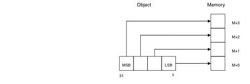
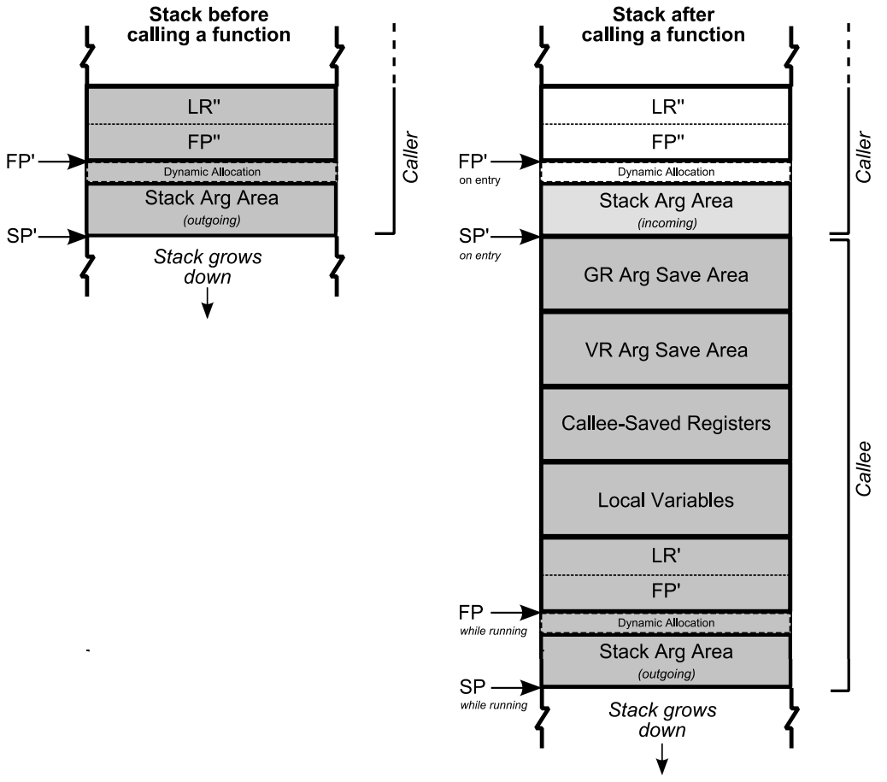
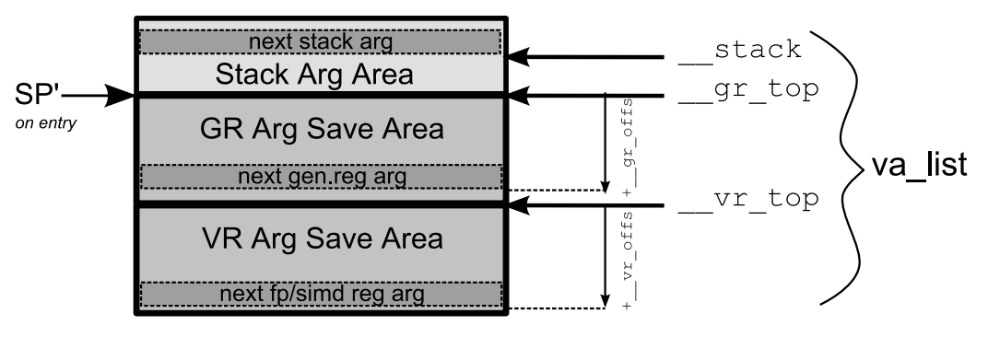

..
   Copyright (c) 2011-2020, Arm Limited and its affiliates.  All rights reserved.
   CC-BY-SA-4.0 AND Apache-Patent-License
   See LICENSE file for details

Procedure Call Standard for the Arm® 64-bit Architecture (AArch64)
******************************************************************

.. class:: version

2020Q2

.. class:: issued

Date of Issue: 1\ :sup:`st` July 2020

.. class:: logo

.. image:: ../Arm_logo_blue_150MN.png

.. section-numbering::

.. raw:: pdf

   PageBreak oneColumn

Preamble
========

Abstract
--------

This document describes the Procedure Call Standard use by the Application Binary Interface (ABI) for the Arm 64-bit architecture.

Keywords
--------

Procedure call, function call, calling conventions, data layout

Latest release and defects report
---------------------------------

Please check `Application Binary Interface for the Arm® Architecture
<https://github.com/ARM-software/abi-aa>`_ for the latest
release of this document.

Please report defects in this specification to the `issue tracker page
on GitHub
<https://github.com/ARM-software/abi-aa/issues>`_.

.. raw:: pdf

   PageBreak

Licence
-------

This work is licensed under the Creative Commons
Attribution-ShareAlike 4.0 International License. To view a copy of
this license, visit http://creativecommons.org/licenses/by-sa/4.0/ or
send a letter to Creative Commons, PO Box 1866, Mountain View, CA
94042, USA.

Grant of Patent License. Subject to the terms and conditions of this
license (both the Public License and this Patent License), each
Licensor hereby grants to You a perpetual, worldwide, non-exclusive,
no-charge, royalty-free, irrevocable (except as stated in this
section) patent license to make, have made, use, offer to sell, sell,
import, and otherwise transfer the Licensed Material, where such
license applies only to those patent claims licensable by such
Licensor that are necessarily infringed by their contribution(s) alone
or by combination of their contribution(s) with the Licensed Material
to which such contribution(s) was submitted. If You institute patent
litigation against any entity (including a cross-claim or counterclaim
in a lawsuit) alleging that the Licensed Material or a contribution
incorporated within the Licensed Material constitutes direct or
contributory patent infringement, then any licenses granted to You
under this license for that Licensed Material shall terminate as of
the date such litigation is filed.

About the license
-----------------

As identified more fully in the Licence_ section, this project
is licensed under CC-BY-SA-4.0 along with an additional patent
license.  The language in the additional patent license is largely
identical to that in Apache-2.0 (specifically, Section 3 of Apache-2.0
as reflected at https://www.apache.org/licenses/LICENSE-2.0) with two
exceptions.

First, several changes were made related to the defined terms so as to
reflect the fact that such defined terms need to align with the
terminology in CC-BY-SA-4.0 rather than Apache-2.0 (e.g., changing
“Work” to “Licensed Material”).

Second, the defensive termination clause was changed such that the
scope of defensive termination applies to “any licenses granted to
You” (rather than “any patent licenses granted to You”).  This change
is intended to help maintain a healthy ecosystem by providing
additional protection to the community against patent litigation
claims.

Contributions
-------------

Contributions to this project are licensed under an inbound=outbound
model such that any such contributions are licensed by the contributor
under the same terms as those in the `Licence`_ section.

Trademark notice
----------------

The text of and illustrations in this document are licensed by Arm
under a Creative Commons Attribution–Share Alike 4.0 International
license ("CC-BY-SA-4.0”), with an additional clause on patents.
The Arm trademarks featured here are registered trademarks or
trademarks of Arm Limited (or its subsidiaries) in the US and/or
elsewhere. All rights reserved. Please visit
https://www.arm.com/company/policies/trademarks for more information
about Arm’s trademarks.

Copyright
---------

Copyright (c) 2018-2020, Arm Limited and its affiliates.  All rights reserved.

.. raw:: pdf

   PageBreak

.. contents::
   :depth: 3

.. raw:: pdf

   PageBreak

About this document
===================

Change Control
--------------

Current Status and Anticipated Changes
^^^^^^^^^^^^^^^^^^^^^^^^^^^^^^^^^^^^^^

The following support level definitions are used by the Arm ABI specifications:

**Release**
   Arm considers this specification to have enough implementations, which have
   received sufficient testing, to verify that it is correct. The details of these
   criteria are dependent on the scale and complexity of the change over previous
   versions: small, simple changes might only require one implementation, but more
   complex changes require multiple independent implementations, which have been
   rigorously tested for cross-compatibility. Arm anticipates that future changes
   to this specification will be limited to typographical corrections,
   clarifications and compatible extensions.

**Beta**
   Arm considers this specification to be complete, but existing
   implementations do not meet the requirements for confidence in its release
   quality. Arm may need to make incompatible changes if issues emerge from its
   implementation.

**Alpha**
   The content of this specification is a draft, and Arm considers the
   likelihood of future incompatible changes to be significant.

The ILP32 variant is at **Beta** release quality.

All other content in this document is at the **Release** quality level.

Change History
^^^^^^^^^^^^^^

.. class:: aapcs64-change-history

+------------+--------------------+------------------------------------------------------------------+
| Issue      | Date               | Change                                                           |
+============+====================+==================================================================+
| 00Bet3     | 25th November 2011 | Beta release                                                     |
+------------+--------------------+------------------------------------------------------------------+
| 1.0        | 22nd May 2013      | First public release                                             |
+------------+--------------------+------------------------------------------------------------------+
| 1.1-beta   | 6th November 2013  | ILP32 Beta                                                       |
+------------+--------------------+------------------------------------------------------------------+
| 2018Q4     | 31st December 2018 | Added rules for over-aligned types                               |
+------------+--------------------+------------------------------------------------------------------+
| 2019Q4     | 30th January 2020  | Github release with an open source license.                      |
|            |                    |                                                                  |
|            |                    | Major changes:                                                   |
|            |                    |                                                                  |
|            |                    | 1. New Licence_, with relative explanation in                    |
|            |                    |    `About the license`_.                                         |
|            |                    |                                                                  |
|            |                    | 2. New sections on Contributions_, `Trademark notice`_, and      |
|            |                    |    Copyright_.                                                   |
|            |                    |                                                                  |
|            |                    | 3. Specify that the frame chain should use the signed return     |
|            |                    |    address (`The Frame Pointer`_)                                |
|            |                    |                                                                  |
|            |                    | 4. Add description of half-precision Brain floating-point format |
|            |                    |    (`Half-precision Floating Point`_, `Half-precision Format     |
|            |                    |    Compatibility`_, `Arithmetic Types`_, `Types Varying by Data  |
|            |                    |    Model`_, `APPENDIX Support for Advanced SIMD Extensions`_)    |
|            |                    |                                                                  |
|            |                    | 5. Update C++ mangling to reflect existing practice              |
|            |                    |    (`APPENDIX C++ Mangling`_).                                   |
|            |                    |                                                                  |
|            |                    | Minor changes:                                                   |
|            |                    |                                                                  |
|            |                    | 1. The section `Bit-fields subdivision`_ has been renamed to make|
|            |                    |    the associated implicit link target unique and avoid clashing |
|            |                    |    with the one of `Bit-fields`_.                                |
|            |                    |                                                                  |
|            |                    | 2. Several formatting changes have been applied to the sources to|
|            |                    |    fix the rendered page produced by github.                     |
+------------+--------------------+------------------------------------------------------------------+
| 2020Q2     | 1st July 2020      | Add requirements for stack space with MTE tags.                  |
|            |                    | Extend the AAPCS64 to support SVE types and registers.           |
|            |                    | Conform aapcs64 volatile bit-fields rules to C/C++.              |
+------------+--------------------+------------------------------------------------------------------+

References
^^^^^^^^^^

This document refers to, or is referred to by, the following documents:

.. class:: refs

+-------------------------------------------------------------------------+----------------------------------------------------+----------------------------------------------------------+
| Ref                                                                     | URL or other reference                             | Title                                                    |
+=========================================================================+====================================================+==========================================================+
| `AAPCS <https://github.com/ARM-software/abi-aa/tree/master/aapcs64>`_   | Source for this document                           | Procedure Call Standard for the Arm 64-bit Architecture  |
+-------------------------------------------------------------------------+----------------------------------------------------+----------------------------------------------------------+
| `CPPABI64 <https://developer.arm.com/docs/ihi0059/latest>`_             | IHI 0059                                           | C++ ABI for the Arm 64-bit Architecture                  |
+-------------------------------------------------------------------------+----------------------------------------------------+----------------------------------------------------------+
| GC++ABI                                                                 | https://itanium-cxx-abi.github.io/cxx-abi/abi.html | Generic C++ ABI                                          |
+-------------------------------------------------------------------------+----------------------------------------------------+----------------------------------------------------------+

Terms and Abbreviations
-----------------------

This document uses the following abbreviations.
^^^^^^^^^^^^^^^^^^^^^^^^^^^^^^^^^^^^^^^^^^^^^^^

A32
   The instruction set named Arm in the Armv7 architecture; A32 uses 32-bit
   fixed-length instructions.

A64
   The instruction set available when in AArch64 state.

AAPCS64
   Procedure Call Standard for the Arm 64-bit Architecture (AArch64)

AArch32
   The 32-bit general-purpose register width state of the Armv8 architecture,
   broadly compatible with the Armv7-A architecture.

AArch64
   The 64-bit general-purpose register width state of the Armv8 architecture.

ABI
   Application Binary Interface:

   1. The specifications to which an executable must conform in order to
      execute in a specific execution environment. For example, the
      *Linux ABI for the Arm Architecture*.

   2. A particular aspect of the specifications to which independently
      produced relocatable files must conform in order to be
      statically linkable and executable.  For example, the `CPPABI64`_, `ELF for
      the Arm Architecture <https://developer.arm.com/docs/ihi0056/latest>`_, ...

Arm-based
   ... based on the Arm architecture ...

Floating point
   Depending on context floating point means or qualifies: (a) floating-point
   arithmetic conforming to IEEE 754 2008; (b) the Armv8 floating point
   instruction set; (c) the register set shared by (b) and the Armv8 SIMD
   instruction set.

Q-o-I
   Quality of Implementation – a quality, behavior, functionality, or
   mechanism not required by this standard, but which might be provided
   by systems conforming to it.  Q-o-I is often used to describe the
   tool-chain-specific means by which a standard requirement is met.

MTE
   The Arm architecture's Memory Tagging Extension.

SIMD
   Single Instruction Multiple Data – A term denoting or qualifying:
   (a) processing several data items in parallel under the control of one
   instruction; (b) the Arm v8 SIMD instruction set: (c) the register set
   shared by (b) and the Armv8 floating point instruction set.

SIMD and floating point
   The Arm architecture’s SIMD and Floating Point architecture comprising
   the floating point instruction set, the SIMD instruction set and the
   register set shared by them.

SVE
   The Arm architecture's Scalable Vector Extension.

T32
   The instruction set named Thumb in the Armv7 architecture; T32 uses
   16-bit and 32-bit instructions.

VG
   The number of 64-bit “vector granules” in an SVE vector; in other words,
   the number of bits in an SVE vector register divided by 64.

ILP32
   SysV-like data model where int, long int and pointer are 32-bit

LP64
   SysV-like data model where int is 32-bit, but long int and pointer are 64-bit.

LLP64
   Windows-like data model where int and long int are 32-bit, but long long int and pointer are 64-bit.

This document uses the following terms.
^^^^^^^^^^^^^^^^^^^^^^^^^^^^^^^^^^^^^^^

Routine, subroutine
   A fragment of program to which control can be transferred that, on completing its task, returns control to its caller at an instruction following the call. Routine is used for clarity where there are nested calls: a routine is the caller and a subroutine is the callee.

Procedure
   A routine that returns no result value.

Function
   A routine that returns a result value.

Activation stack, call-frame stack
   The stack of routine activation records (call frames).

Activation record, call frame
   The memory used by a routine for saving registers and holding local variables (usually allocated on a stack, once per activation of the routine).

PIC, PID
   Position-independent code, position-independent data.

Argument, Parameter
   The terms argument and parameter are used interchangeably. They may denote a formal parameter of a routine given the value of the actual parameter when the routine is called, or an actual parameter, according to context.

Externally visible [interface]
   [An interface] between separately compiled or separately assembled routines.

Variadic routine
   A routine is variadic if the number of arguments it takes, and their type, is determined by the caller instead of the callee.

Global register
   A register whose value is neither saved nor destroyed by a subroutine. The value may be updated, but only in a manner defined by the execution environment.

Program state
   The state of the program’s memory, including values in machine registers.

Scratch register, temporary register, caller-saved register
   A register used to hold an intermediate value during a calculation (usually, such values are not named in the program source and have a limited lifetime). If a function needs to preserve the value held in such a register over a call to another function, then the calling function must save and restore the value.

Callee-saved register
   A register whose value must be preserved over a function call. If the function being called (the callee) needs to use the register, then it is responsible for saving and restoring the old value.

SysV
   Unix System V. A variant of the Unix Operating System. Although this specification refers to SysV, many other operating systems, such as Linux or BSD use similar conventions.

Platform
   A program execution environment such as that defined by an operating system or run- time environment. A platform defines the specific variant of the ABI and may impose additional constraints. Linux is a platform in this sense.

More specific terminology is defined when it is first used.

.. raw:: pdf

   PageBreak

Scope
=====

The AAPCS64 defines how subroutines can be separately written, separately compiled, and separately assembled to work together. It describes a contract between a calling routine and a called routine, or between a routine and its execution environment, that defines:

- Obligations on the caller to create a program state in which the called routine may start to execute.

- Obligations on the called routine to preserve the program state of the caller across the call.

- The rights of the called routine to alter the program state of its caller.

- Obligations on all routines to preserve certain global invariants.

This standard specifies the base for a family of *Procedure Call Standard* (PCS) variants generated by choices that reflect arbitrary, but historically important, choice among:

- Byte order.

- Size and format of data types: pointer, long int and wchar\_t and the format of half-precision floating-point values. Here we define three data models (see `The Standard Variants`_ and `Arm C AND C++ Language Mappings`_ for details):

    - ILP32: **(Beta)** SysV-like variant where int, long int and pointer are 32-bit

    - LP64: SysV-like variant where int is 32-bit, but long int and pointer are 64-bit.

    - LLP64: Windows-like variant where int and long int are 32-bit, but long long int and pointer are 64- bit.

- Whether floating-point operations use floating-point hardware resources or are implemented by calls to integer-only  routines [#aapcs64-f1]_.

This standard is presented in four sections that, after an introduction, specify:

- The layout of data.

- Layout of the stack and calling between functions with public interfaces.

- Variations available for processor extensions, or when the execution environment restricts the addressing model.

- The C and C++ language bindings for plain data types.

This specification does not standardize the representation of publicly visible C++-language entities that are not also C language entities (these are described in `CPPABI64`_) and it places no requirements on the representation of language entities that are not visible across public interfaces.

.. raw:: pdf

   PageBreak

Introduction
============

The AAPCS64 is the first revision of Procedure Call standard for the Arm 64-bit Architecture. It forms part of the complete ABI specification for the Arm 64-bit Architecture.

Design Goals
------------

The goals of the AAPCS64 are to:

- Support efficient execution on high-performance implementations of the Arm 64-bit Architecture.

- Clearly distinguish between mandatory requirements and implementation discretion.

Conformance
-----------

The AAPCS64 defines how separately compiled and separately assembled routines can work together. There is an externally visible interface between such routines. It is common that not all the externally visible interfaces to software are intended to be publicly visible or open to arbitrary use. In effect, there is a mismatch between the machine-level concept of external visibility—defined rigorously by an object code format—and a higher level, application-oriented concept of external visibility—which is system-specific or application-specific.

Conformance to the AAPCS64 requires that [#aapcs64-f2]_:

- At all times, stack limits and basic stack alignment are observed (`Universal stack constraints`_).

- At each call where the control transfer instruction is subject to a BL-type relocation at static link time, rules on the use of IP0 and IP1 are observed (`Use of IP0 and IP1 by the linker`_).

- The routines of each publicly visible interface conform to the relevant procedure call standard variant.

- The data elements [#aapcs64-f3]_ of each publicly visible interface conform to the data layout rules.

.. raw:: pdf

   PageBreak

Data Types and Alignment
========================

Fundamental Data Types
----------------------

Table 1, Byte size and byte alignment of fundamental data types shows the fundamental data types (Machine Types) of the machine.

.. class:: table-title

Table 1, Byte size and byte alignment of fundamental data types

+------------------------+---------------------------------------+------------+---------------------------+-----------------------------------------------+
| Type Class             | Machine Type                          | Byte size  | Natural Alignment (bytes) | Note                                          |
+========================+=======================================+============+===========================+===============================================+
| Integral               | Unsigned byte                         | 1          | 1                         | Character                                     |
|                        +---------------------------------------+------------+---------------------------+                                               |
|                        | Signed byte                           | 1          | 1                         |                                               |
|                        +---------------------------------------+------------+---------------------------+-----------------------------------------------+
|                        | Unsigned half-word                    | 2          | 2                         |                                               |
|                        +---------------------------------------+------------+---------------------------+                                               |
|                        | Signed half-word                      | 2          | 2                         |                                               |
|                        +---------------------------------------+------------+---------------------------+-----------------------------------------------+
|                        | Unsigned word                         | 4          | 4                         |                                               |
|                        +---------------------------------------+------------+---------------------------+                                               |
|                        | Signed word                           | 4          | 4                         |                                               |
|                        +---------------------------------------+------------+---------------------------+-----------------------------------------------+
|                        | Unsigned double- word                 | 8          | 8                         |                                               |
|                        +---------------------------------------+------------+---------------------------+                                               |
|                        | Signed double-word                    | 8          | 8                         |                                               |
|                        +---------------------------------------+------------+---------------------------+-----------------------------------------------+
|                        | Unsigned quad-word                    | 16         | 16                        |                                               |
|                        +---------------------------------------+------------+---------------------------+                                               |
|                        | Signed quad-word                      | 16         | 16                        |                                               |
+------------------------+---------------------------------------+------------+---------------------------+-----------------------------------------------+
| Floating Point         | Half precision                        | 2          | 2                         | See `Half-precision Floating Point`_.         |
|                        +---------------------------------------+------------+---------------------------+-----------------------------------------------+
|                        | Single precision                      | 4          | 4                         | IEEE 754-2008                                 |
|                        +---------------------------------------+------------+---------------------------+                                               |
|                        | Double precision                      | 8          | 8                         |                                               |
|                        +---------------------------------------+------------+---------------------------+                                               |
|                        | Quad precision                        | 16         | 16                        |                                               |
+------------------------+---------------------------------------+------------+---------------------------+-----------------------------------------------+
| Short vector           | 64-bit vector                         | 8          | 8                         | See `Short Vectors`_                          |
|                        +---------------------------------------+------------+---------------------------+                                               |
|                        | 128-bit vector                        | 16         | 16                        |                                               |
+------------------------+---------------------------------------+------------+---------------------------+-----------------------------------------------+
| Scalable Vector        | VG×64-bit vector of 8-bit elements    | VG×8       | 16                        | See `Scalable Vectors`_                       |
|                        +---------------------------------------+            |                           |                                               |
|                        | VG×64-bit vector of 16-bit elements   |            |                           |                                               |
|                        +---------------------------------------+            |                           |                                               |
|                        | VG×64-bit vector of 32-bit elements   |            |                           |                                               |
|                        +---------------------------------------+            |                           |                                               |
|                        | VG×64-bit vector of 64-bit elements   |            |                           |                                               |
+------------------------+---------------------------------------+------------+---------------------------+-----------------------------------------------+
| Scalable Predicate     | VG×8-bit predicate                    | VG         | 2                         | See `Scalable Predicates`_                    |
+------------------------+---------------------------------------+------------+---------------------------+-----------------------------------------------+
| Pointer                | 32-bit data pointer **(Beta)**        | 4          | 4                         | See `Pointers`_                               |
|                        +---------------------------------------+------------+---------------------------+                                               |
|                        | 32-bit code pointer **(Beta)**        | 4          | 4                         |                                               |
|                        +---------------------------------------+------------+---------------------------+                                               |
|                        | 64-bit data pointer                   | 8          | 8                         |                                               |
|                        +---------------------------------------+------------+---------------------------+                                               |
|                        | 64-bit code pointer                   | 8          | 8                         |                                               |
+------------------------+---------------------------------------+------------+---------------------------+-----------------------------------------------+

Half-precision Floating Point
-----------------------------

The architecture provides hardware support for half-precision values. Three formats are currently supported:

1. half-precision format specified in IEEE754-2008

2. Arm Alternative format, which provides additional range but has no NaNs or Infinities.

3. Brain floating-point format, which provides a dynamic range similar to the 32-bit floating-point format, but with less precision.

The first two formats are mutually exclusive. The base standard of the AAPCS specifies use of the IEEE754-2008 variant, and a procedure call variant that uses the Arm Alternative format is permitted.

Short Vectors
-------------

A short vector is a machine type that is composed of repeated instances of one fundamental integral or floating- point type. It may be 8 or 16 bytes in total size. A short vector has a base type that is the fundamental integral or floating-point type from which it is composed, but its alignment is always the same as its total size. The number of elements in the short vector is always such that the type is fully packed. For example, an 8-byte short vector may contain 8 unsigned byte elements, 4 unsigned half-word elements, 2 single-precision floating-point elements, or any other combination where the product of the number of elements and the size of an individual element is equal to 8. Similarly, for 16-byte short vectors the product of the number of elements and the size of the individual elements must be 16.

Elements in a short vector are numbered such that the lowest numbered element (element 0) occupies the lowest numbered bit (bit zero) in the vector and successive elements take on progressively increasing bit positions in the vector. When a short vector transferred between registers and memory it is treated as an opaque object. That is a short vector is stored in memory as if it were stored with a single STR of the entire register; a short vector is loaded from memory using the corresponding LDR instruction. On a little-endian system this means that element 0         will always contain the lowest addressed element of a short vector; on a big-endian system element 0 will contain the highest-addressed element of a short vector.

A language binding may define extended types that map directly onto short vectors. Short vectors are not otherwise created spontaneously (for example because a user has declared an aggregate consisting of eight consecutive byte-sized objects).

Scalable Vectors
----------------

Like a short vector (see `Short Vectors`_), a scalable vector is a
machine type that is composed of repeated instances of one fundamental
integral or floating-point type. The number of bytes in the vector is
always VG×8, where VG is a runtime value determined by the execution
environment. VG is an even integer greater than or equal to 2; the ABI
does not define an upper bound. VG is the same for all scalable vector
types and scalable predicate types.

Each element of a scalable vector has a zero-based index. When stored
in memory, the elements are placed in index order, so that element *N*
comes before element *N*\ +1. The layout of each individual element
is the same as if it were scalar. When stored in a scalable vector
register, the least significant bit of element 0 occupies bit 0
of the corresponding short vector register. Note that the layout of the
vector in a scalable vector register does not depend on whether the
system is big- or little-endian.

Scalable Predicates
-------------------

A scalable predicate is a machine type that is composed of individual bits.
The number of bits in the predicate is always VG×8, where VG is the same
value as for scalable vector types (see `Scalable Vectors`_). The number
of bits in a scalable predicate is therefore equal to the number of bytes
in a scalable vector.

Each bit of a scalable predicate has a zero-based index. When stored in
memory, index 0 is placed in the least significant bit of the first byte,
index 1 is stored in the next significant bit, and so on.

Pointers
--------

Code and data pointers are either 64-bit or 32-bit unsigned types [#aapcs64-f4]_. A NULL pointer is always represented by all-bits-zero.

All 64 bits in a 64-bit pointer are always significant. When tagged addressing is enabled, a tag is part of a pointer’s value for the purposes of pointer arithmetic. The result of subtracting or comparing two pointers with different tags is unspecified. See also `Memory Addresses`_, below. A 32-bit pointer does not support tagged addressing.

.. note::

    **(Beta)**

    The A64 load and store instructions always use the full 64-bit base register and perform a 64-bit address calculation. Care must be taken within ILP32 to ensure that the upper 32 bits of a base register are zero and 32-bit register offsets are sign-extended to 64 bits (immediate offsets are implicitly extended).

Byte Order ("Endianness")
-------------------------

From a software perspective, memory is an array of bytes, each of which is addressable. This ABI supports two views of memory implemented by the underlying hardware.

- In a little-endian view of memory the least significant byte of a data object is at the lowest byte address the data object occupies in memory.

- In a big-endian view of memory the least significant byte of a data object is at the highest byte address the data object occupies in memory.

The least significant bit in an object is always designated as bit 0.

The mapping of a word-sized data object to memory is shown in the following figures. All objects are pure-endian, so the mappings may be scaled accordingly for larger or smaller objects [#aapcs64-f5]_.

    Memory layout of big-endian data object

    Memory layout of little-endian data object

Composite Types
---------------

A Composite Type is a collection of one or more Fundamental Data Types that are handled as a single entity at the procedure call level. A Composite Type can be any of:

- An aggregate, where the members are laid out sequentially in memory (possibly with inter-member padding)

- A union, where each of the members has the same address

- An array, which is a repeated sequence of some other type (its base type).

The definitions are recursive; that is, each of the types may contain a Composite Type as a member.

*  The *member alignment* of an element of a composite type is the
   alignment of that member after the application of any language alignment
   modifiers to that member

*  The *natural alignment* of a composite type is the maximum of
   each of the member alignments of the 'top-level' members of the composite
   type i.e. before any alignment adjustment of the entire composite is
   applied

Aggregates
^^^^^^^^^^

- The alignment of an aggregate shall be the alignment of its most-aligned member.

- The size of an aggregate shall be the smallest multiple of its alignment that is sufficient to hold all of its members.

Unions
^^^^^^

- The alignment of a union shall be the alignment of its most-aligned member.

- The size of a union shall be the smallest multiple of its alignment that is sufficient to hold its largest member.

Arrays
^^^^^^

- The alignment of an array shall be the alignment of its base type.

- The size of an array shall be the size of the base type multiplied by the number of elements in the array.

Bit-fields subdivision
^^^^^^^^^^^^^^^^^^^^^^

A member of an aggregate that is a Fundamental Data Type may be subdivided into bit-fields; if there are unused portions of such a member that are sufficient to start the following member at its Natural Alignment then the following member may use the unallocated portion. For the purposes of calculating the alignment of the aggregate the type of the member shall be the Fundamental Data Type upon which the bit-field is based. [#aapcs64-f6]_ The layout of bit-fields within an aggregate is defined by the appropriate language binding.

Homogeneous Aggregates
^^^^^^^^^^^^^^^^^^^^^^

An Homogeneous Aggregate is a Composite Type where all of the Fundamental Data Types of the members that compose the type are the same. The test for homogeneity is applied after data layout is completed and without regard to access control or other source language restrictions. Note that for short-vector types the fundamental types are 64-bit vector and 128-bit vector; the type of the elements in the short vector does not form part of the test for homogeneity.

An Homogeneous Aggregate has a Base Type, which is the Fundamental Data Type of each Member. The overall size is the size of the Base Type multiplied by the number uniquely addressable Members; its alignment will be the alignment of the Base Type.

Homogeneous Floating-point Aggregates (HFA)
~~~~~~~~~~~~~~~~~~~~~~~~~~~~~~~~~~~~~~~~~~~

An Homogeneous Floating-point Aggregate (HFA) is an Homogeneous Aggregate with a Fundamental Data Type that is a Floating-Point type and at most four uniquely addressable members.

Homogeneous Short-Vector Aggregates (HVA)
~~~~~~~~~~~~~~~~~~~~~~~~~~~~~~~~~~~~~~~~~

An Homogeneous Short-Vector Aggregate (HVA) is an Homogeneous Aggregate with a Fundamental Data Type that is a Short-Vector type and at most four uniquely addressable members.

Pure Scalable Types (PSTs)
--------------------------

A type is a Pure Scalable Type if (recursively) it is:

* a Scalable Vector Type;

* a Scalable Predicate Type;

* an array that contains a constant (nonzero) number of elements and whose
  Base Type is a Pure Scalable Type; or

* an aggregate in which every member is a Pure Scalable Type.

As with Homogeneous Aggregates, these rules apply after data layout is
completed and without regard to access control or other source language
restrictions. However, there are several notable differences from
Homogeneous Aggregates:

* A Pure Scalable Type may contain a mixture of different Fundamental
  Data Types. For example, an aggregate that contains a scalable vector
  of 8-bit elements, a scalable predicate, and a scalable vector of
  16-bit elements is a Pure Scalable Type.

* Alignment and padding do not play a role when determining whether
  something is a Pure Scalable Type. (In fact, a Pure Scalable Type
  that contains both predicate types and vector types will often contain
  padding.)

* Pure Scalable Types are never unions and never contain unions.

.. note:: Composite Types have at least one member and the type of each
          member is either a Fundamental Data Type or another Composite Type.
          Since all Fundamental Data Types have nonzero size, it follows
          that all members of a Composite Type have nonzero size.

          Any language-level members that have zero size must therefore
          disappear in the language-to-ABI mapping and do not affect
          whether the containing type is a Pure Scalable Type.

.. raw:: pdf

   PageBreak

The Base Procedure Call Standard
================================

The base standard defines a machine-level calling standard for the A64 instruction set. It assumes the availability of the vector registers for passing floating-point and SIMD arguments. Application code is expected to conform to one of three data models defined in this standard; ILP32, LP64 or LLP64.

Machine Registers
-----------------

The Arm 64-bit architecture defines two mandatory register banks: a general-purpose register bank which can be used for scalar integer processing and pointer arithmetic; and a SIMD and Floating-Point register bank. In addition, the architecture defines an optional set of scalable vector registers that overlap the SIMD and Floating-Point register bank, accompanied by a set of scalable predicate registers.

General-purpose Registers
^^^^^^^^^^^^^^^^^^^^^^^^^

There are thirty-one, 64-bit, general-purpose (integer) registers visible to the A64 instruction set; these are labeled r0-r30. In a 64-bit context these registers are normally referred to using the names x0-x30; in a 32-bit context the registers are specified by using w0-w30. Additionally, a stack-pointer register, SP, can be used with a restricted number of instructions. Register names may appear in assembly language in either upper case or lower case. In this specification upper case is used when the register has a fixed role in this procedure call standard. Table 2, General purpose registers and AAPCS64 usage summarizes the uses of the general-purpose registers in this standard. In addition to the general-purpose registers there is one status register (NZCV) that may be set and  read by conforming code.

.. class:: table-title

Table 2, General purpose registers and AAPCS64 usage

.. class:: table-2

   +-----------+----------+-----------------------------------------------------------------------------------------------------------------------------------------------------+
   | Register  | Special  | Role in the procedure call standard                                                                                                                 |
   +===========+==========+=====================================================================================================================================================+
   | SP        |          | The Stack Pointer.                                                                                                                                  |
   +-----------+----------+-----------------------------------------------------------------------------------------------------------------------------------------------------+
   | r30       | LR       | The Link Register.                                                                                                                                  |
   +-----------+----------+-----------------------------------------------------------------------------------------------------------------------------------------------------+
   | r29       | FP       | The Frame Pointer                                                                                                                                   |
   +-----------+----------+-----------------------------------------------------------------------------------------------------------------------------------------------------+
   | r19…r28   |          | Callee-saved registers                                                                                                                              |
   +-----------+----------+-----------------------------------------------------------------------------------------------------------------------------------------------------+
   | r18       |          | The Platform Register, if needed; otherwise a temporary register. See notes.                                                                        |
   +-----------+----------+-----------------------------------------------------------------------------------------------------------------------------------------------------+
   | r17       | IP1      | The second intra-procedure-call temporary register (can be used by call veneers and PLT code); at other times may be used as a temporary register.  |
   +-----------+----------+-----------------------------------------------------------------------------------------------------------------------------------------------------+
   | r16       | IP0      | The first intra-procedure-call scratch register (can be used by call veneers and PLT code); at other times may be used as a temporary register.     |
   +-----------+----------+-----------------------------------------------------------------------------------------------------------------------------------------------------+
   | r9…r15    |          | Temporary registers                                                                                                                                 |
   +-----------+----------+-----------------------------------------------------------------------------------------------------------------------------------------------------+
   | r8        |          | Indirect result location register                                                                                                                   |
   +-----------+----------+-----------------------------------------------------------------------------------------------------------------------------------------------------+
   | r0…r7     |          | Parameter/result registers                                                                                                                          |
   +-----------+----------+-----------------------------------------------------------------------------------------------------------------------------------------------------+

The first eight registers, r0-r7, are used to pass argument values into a subroutine and to return result values from a function. They may also be used to hold intermediate values within a routine (but, in general, only between subroutine calls).

Registers r16 (IP0) and r17 (IP1) may be used by a linker as a scratch register between a routine and any subroutine it calls (for details, see `Use of IP0 and IP1 by the linker`_). They can also be used within a routine to hold intermediate values between subroutine calls.

The role of register r18 is platform specific. If a platform ABI has need of a dedicated general purpose register to carry inter-procedural state (for example, the thread context) then it should use this register for that purpose. If the platform ABI has no such requirements, then it should use r18 as an additional temporary register. The platform ABI specification must document the usage for this register.

.. note::

    Software developers creating platform-independent code are advised to avoid using r18 if at all possible. Most compilers provide a mechanism to prevent specific registers from being used for general allocation; portable hand-coded assembler should avoid it entirely. It should not be assumed that treating the register as callee-saved will be sufficient to satisfy the requirements of the platform. Virtualization code must, of course, treat the register as they would any other resource provided to the virtual machine.

A subroutine invocation must preserve the contents of the registers r19-r29 and SP. All 64 bits of each value stored in r19-r29 must be preserved, even when using the ILP32 data model **(Beta)**.

In all variants of the procedure call standard, registers r16, r17, r29 and r30 have special roles. In these roles they are labeled IP0, IP1, FP and LR when being used for holding addresses (that is, the special name implies accessing the register as a 64-bit entity).

.. note::

    The special register names (IP0, IP1, FP and LR) should be used only in the context in which they are special. It is recommended that disassemblers always use the architectural names for the registers.

The NZCV register is a global condition flag register with the following properties:

- The N, Z, C and V flags are undefined on entry to and return from a public interface.

SIMD and Floating-Point Registers
^^^^^^^^^^^^^^^^^^^^^^^^^^^^^^^^^

The Arm 64-bit architecture also has a further thirty-two registers, v0-v31, which can be used by SIMD and Floating-Point operations. The precise name of the register will change indicating the size of the access.

.. note::

    Unlike in AArch32, in AArch64 the 128-bit and 64-bit views of a SIMD and Floating-Point register do not overlap multiple registers in a narrower view, so q1, d1 and s1 all refer to the same entry in the register bank.

The first eight registers, v0-v7, are used to pass argument values into a subroutine and to return result values from a function. They may also be used to hold intermediate values within a routine (but, in general, only between subroutine calls).

Registers v8-v15 must be preserved by a callee across subroutine calls; the remaining registers (v0-v7, v16-v31) do not need to be preserved (or should be preserved by the caller). Additionally, only the bottom 64 bits of each value stored in v8-v15 need to be preserved [#aapcs64-f7]_; it is the responsibility of the caller to preserve larger values.

The FPSR is a status register that holds the cumulative exception bits of the floating-point unit. It contains the fields IDC, IXC, UFC, OFC, DZC, IOC and QC. These fields are not preserved across a public interface and may have any value on entry to a subroutine.

The FPCR is used to control the behavior of the floating-point unit. It is a global register with the following properties.

- The exception-control bits (8-12), rounding mode bits (22-23) and flush-to-zero bits (24) may be modified by calls to specific support functions that affect the global state of the application.

- All other bits are reserved and must not be modified. It is not defined whether the bits read as zero or one, or whether they are preserved across a public interface.

Scalable Vector Registers
^^^^^^^^^^^^^^^^^^^^^^^^^

The Arm 64-bit architecture also defines an optional set of thirty-two
scalable vector registers, z0-z31. Each register extends the
corresponding SIMD and Floating-Point register so that it can hold the
contents of a single Scalable Vector Type (see `Scalable Vectors`_).
That is, scalable vector register z0 is an extension of SIMD and
Floating-Point register v0.

z0-z7 are used to pass scalable vector arguments to a subroutine, and to
return scalable vector results from a function. If a subroutine takes
at least one argument in scalable vector registers or scalable predicate
registers, or if it is a function that returns results in such registers,
it must ensure that the entire contents of z8-z23 are preserved across
the call. In other cases it need only preserve the low 64 bits of z8-z15,
as described in `SIMD and Floating-Point Registers`_.

Scalable Predicate Registers
^^^^^^^^^^^^^^^^^^^^^^^^^^^^

The Arm 64-bit architecture defines an optional set of sixteen scalable
predicate registers p0-p15. These registers are available if and only if
the scalable vector registers are available (see `Scalable Vector Registers`_).
Each register can store the contents of a Scalable Predicate Type
(see `Scalable Predicates`_).

p0-p3 are used to pass scalable predicate arguments to a subroutine and
to return scalable predicate results from a function. If a subroutine takes
at least one argument in scalable vector registers or scalable predicate
registers, or if it is a function that returns results in such registers,
it must ensure that p4-p15 are preserved across the call. In other cases
it need not preserve any scalable predicate register contents.

Processes, Memory and the Stack
-------------------------------

The AAPCS64 applies to a single thread of execution or process (hereafter referred to as a process). A process has a program state defined by the underlying machine registers and the contents of the memory it can access. The memory a process can access, without causing a run-time fault, may vary during the execution of the process.

The memory of a process can normally be classified into five categories:

- code (the program being executed), which must be readable, but need not be writable, by the process.

- read-only static data.

- writable static data.

- the heap.

- the stack.

Writable static data may be further sub-divided into initialized, zero-initialized and uninitialized data. Except for the stack there is no requirement for each class of memory to occupy a single contiguous region of memory. A process must always have some code and a stack, but need not have any of the other categories of memory.

The heap is an area (or areas) of memory that are managed by the process itself (for example, with the C malloc function). It is typically used for the creation of dynamic data objects.

A conforming program must only execute instructions that are in areas of memory designated to contain code.

Memory Addresses
^^^^^^^^^^^^^^^^

The address space may consist of one or more disjoint regions. No region may span address zero (although one region may start at zero).

The use of tagged addressing is platform specific and does not apply to 32-bit pointers. When tagged addressing is disabled all 64 bits of an address are passed to the translation system. When tagged addressing is enabled, the top eight bits of an address are ignored for the purposes of address translation. See also `Pointers`_, above.

The Stack
^^^^^^^^^

The stack is a contiguous area of memory that may be used for storage of local variables and for passing additional arguments to subroutines when there are insufficient argument registers available.

The stack implementation is full-descending, with the current extent of the stack held in the special-purpose register SP. The stack will, in general, have both a base and a limit though in practice an application may not be able to determine the value of either.

The stack may have a fixed size or be dynamically extendable (by adjusting the stack-limit downwards).

The rules for maintenance of the stack are divided into two parts: a set of constraints that must be observed at all times, and an additional constraint that must be observed at a public interface.

Universal stack constraints
~~~~~~~~~~~~~~~~~~~~~~~~~~~

At all times the following basic constraints must hold:

- Stack-limit < SP <= stack-base. The stack pointer must lie within the extent of the stack.

- A process may only access (for reading or writing) the closed interval of the entire stack delimited by [SP, stack-base – 1].

- If MTE is enabled, then the tag stored in the stack pointer must match the tag set on the range SP - Stack-limit (i.e. the unallocated portion of the stack).

Additionally, at any point at which memory is accessed via SP, the hardware requires that

- SP mod 16 = 0.  The stack must be quad-word aligned.

Stack constraints at a public interface
~~~~~~~~~~~~~~~~~~~~~~~~~~~~~~~~~~~~~~~

The stack must also conform to the following constraint at a public interface:

- SP mod 16 = 0. The stack must be quad-word aligned.

The Frame Pointer
^^^^^^^^^^^^^^^^^

Conforming code shall construct a linked list of stack-frames. Each frame shall link to the frame of its caller by means of a frame record of two 64-bit values on the stack (independent of the data model). The frame record for the innermost frame (belonging to the most recent routine invocation) shall be pointed to by the Frame Pointer register (FP). The lowest addressed double-word shall point to the previous frame record and the highest addressed double-word shall contain the value passed in LR on entry to the current function. If code uses the pointer signing extension to sign return addresses, the value in LR must be signed before storing it in the frame record. The end of the frame record chain is indicated by the address zero in the address for the previous frame. The location of the frame record within a stack frame is not specified.

.. note:: There will always be a short period during construction or destruction of each frame record during which the frame pointer will point to the caller’s record.

A platform shall mandate the minimum level of conformance with respect to the maintenance of frame records. The options are, in decreasing level of functionality:

- It may require the frame pointer to address a valid frame record at all times, except that small subroutines which do not modify the link register may elect not to create a frame record

- It may require the frame pointer to address a valid frame record at all times, except that any subroutine may elect not to create a frame record

- It may permit the frame pointer register to be used as a general-purpose callee-saved register, but provide a platform-specific mechanism for external agents to reliably detect this condition

- It may elect not to maintain a frame chain and to use the frame pointer register as a general-purpose callee-saved register.

Subroutine Calls
----------------

The A64 instruction set contains primitive subroutine call instructions, BL and BLR, which performs a branch-with- link operation. The effect of executing BL is to transfer the sequentially next value of the program counter—the return address—into the link register (LR) and the destination address into the program counter.  The effect of executing BLR is similar except that the new PC value is read from the specified register.

Use of IP0 and IP1 by the linker
^^^^^^^^^^^^^^^^^^^^^^^^^^^^^^^^

The A64 branch instructions are unable to reach every destination in the address space, so it may be necessary for the linker to insert a veneer between a calling routine and a called subroutine. Veneers may also be needed to support dynamic linking. Any veneer inserted must preserve the contents of all registers except IP0, IP1 (r16, r17) and the condition code flags; a conforming program must assume that a veneer that alters IP0 and/or IP1 may be inserted at any branch instruction that is exposed to a relocation that supports long branches.

.. note::

    R\_AARCH64\_CALL26, and R\_AARCH64\_JUMP26 are the ELF relocation types with this property.

Parameter Passing
-----------------

The base standard provides for passing arguments in general-purpose registers (r0-r7), SIMD/floating-point registers (v0-v7), scalable vector registers (z0-z7, overlaid on v0-v7), scalable predicate registers (p0-p3), and on the stack. For subroutines that take a small number of small parameters, only registers are used.

Variadic Subroutines
^^^^^^^^^^^^^^^^^^^^

A Variadic subroutine is a routine that takes a variable number of parameters. The full parameter list is known by the caller, but the callee only knows a minimum number of arguments will be passed and will determine the additional arguments based on the values passed in other arguments. The two classes of arguments are known as Named arguments (these form the minimum set) and Anonymous arguments (these are the optional additional arguments).

In this standard a non-variadic subroutine can be considered to be identical to a variadic subroutine that takes no optional arguments.

Parameter Passing Rules
^^^^^^^^^^^^^^^^^^^^^^^

Parameter passing is defined as a two-level conceptual model

- A mapping from the type of a source language argument onto a machine type

- The marshaling of machine types to produce the final parameter list

The mapping from a source language type onto a machine type is specific for each language and is described separately (the C and C++ language bindings are described in `Arm C AND C++ Language Mappings`_). The result is an ordered list of arguments that are to be passed to the subroutine.

For a caller, sufficient stack space to hold stacked argument values is assumed to have been allocated prior to marshaling: in practice the amount of stack space required cannot be known until after the argument marshaling has been completed. A callee is permitted to modify any stack space used for receiving parameter values from the caller.

.. class:: stage

  +-----------------------------------------------------------------------------------------------------------------+
  | Stage A - Initialization                                                                                        |
  +======================+==========================================================================================+
  |                      | The Next General-purpose Register Number (NGRN) is set to zero.                          |
  |                      |                                                                                          |
  | A.1                  |                                                                                          |
  +----------------------+------------------------------------------------------------------------------------------+
  |                      | The Next SIMD and Floating-point Register Number (NSRN) is set to zero.                  |
  |                      |                                                                                          |
  | A.2                  |                                                                                          |
  +----------------------+------------------------------------------------------------------------------------------+
  |                      | The Next Scalable Predicate Register Number (NPRN) is set to zero.                       |
  |                      |                                                                                          |
  | A.3                  |                                                                                          |
  +----------------------+------------------------------------------------------------------------------------------+
  |                      | The next stacked argument address (NSAA) is set to the current stack-pointer value (SP). |
  |                      |                                                                                          |
  | A.4                  |                                                                                          |
  +----------------------+------------------------------------------------------------------------------------------+

.. class:: stage

  +---------------------------------------------------------------------------------------------------------------+
  | Stage B – Pre-padding and extension of arguments                                                              |
  +======================+========================================================================================+
  |                      | If the argument type is a Pure Scalable Type, no change is made at this stage.         |
  |                      |                                                                                        |
  | B.1                  |                                                                                        |
  +----------------------+----------------------------------------------------------------------------------------+
  |                      | If the argument type is a Composite Type whose size cannot be statically determined by |
  |                      | both the caller and the callee, the argument is copied to memory and the argument is   |
  | B.2                  | replaced by a pointer to the copy. (There are no such types in C/C++ but they exist in |
  |                      | other languages or in language extensions).                                            |
  +----------------------+----------------------------------------------------------------------------------------+
  |                      | If the argument type is an HFA or an HVA, then the argument is used unmodified.        |
  |                      |                                                                                        |
  | B.3                  |                                                                                        |
  +----------------------+----------------------------------------------------------------------------------------+
  |                      | If the argument type is a Composite Type that is larger than 16 bytes, then the        |
  |                      | argument is copied to memory allocated by the caller and the argument is replaced by a |
  | B.4                  | pointer to the copy.                                                                   |
  +----------------------+----------------------------------------------------------------------------------------+
  |                      | If the argument type is a Composite Type then the size of the argument is rounded up   |
  |                      | to the nearest multiple of 8 bytes.                                                    |
  | B.5                  |                                                                                        |
  +----------------------+----------------------------------------------------------------------------------------+
  |                      | If the argument is an alignment adjusted type its value is passed as a copy of the     |
  |                      | actual value. The copy will have an alignment defined as follows.                      |
  | B.6                  |                                                                                        |
  |                      | - For a Fundamental Data Type, the alignment is the natural alignment of that type,    |
  |                      |   after any promotions.                                                                |
  |                      |                                                                                        |
  |                      | - For a Composite Type, the alignment of the copy will have 8-byte alignment if its    |
  |                      |   natural alignment is <= 8 and 16-byte alignment if its natural alignment is >= 16.   |
  |                      |                                                                                        |
  |                      | The alignment of the copy is used for applying marshaling rules.                       |
  +----------------------+----------------------------------------------------------------------------------------+

.. class:: stage

  +-----------------------+----------------------------------------------------------------------------------------+
  | Stage C – Assignment of arguments to registers and stack                                                       |
  +=======================+========================================================================================+
  |                       | If the argument is a Half-, Single-, Double- or Quad- precision Floating-point or      |
  |                       | Short Vector Type and the NSRN is less than 8, then the argument is allocated to the   |
  | C.1                   | least significant bits of register v[NSRN]. The NSRN is incremented by one. The        |
  |                       | argument has now been allocated.                                                       |
  +-----------------------+----------------------------------------------------------------------------------------+
  |                       | If the argument is an HFA or an HVA and there are sufficient unallocated SIMD and      |
  |                       | Floating-point registers (NSRN + number of members <= 8), then the argument is         |
  | C.2                   | allocated to SIMD and Floating-point Registers (with one register per member of the    |
  |                       | HFA or HVA). The NSRN is incremented by the number of registers used. The argument has |
  |                       | now been allocated.                                                                    |
  +-----------------------+----------------------------------------------------------------------------------------+
  |                       | If the argument is an HFA or an HVA then the NSRN is set to 8 and the size of the      |
  |                       | argument is rounded up to the nearest multiple of 8 bytes.                             |
  | C.3                   |                                                                                        |
  +-----------------------+----------------------------------------------------------------------------------------+
  |                       | If the argument is an HFA, an HVA, a Quad-precision Floating-point or Short Vector     |
  |                       | Type then the NSAA is rounded up to the larger of 8 or the Natural Alignment of the    |
  | C.4                   | argument’s type.                                                                       |
  +-----------------------+----------------------------------------------------------------------------------------+
  |                       | If the argument is a Half- or Single- precision Floating Point type, then the size of  |
  |                       | the argument is set to 8 bytes. The effect is as if the argument had been copied to    |
  | C.5                   | the least significant bits of a 64-bit register and the remaining bits filled with     |
  |                       | unspecified values.                                                                    |
  +-----------------------+----------------------------------------------------------------------------------------+
  |                       | If the argument is an HFA, an HVA, a Half-, Single-, Double- or Quad- precision        |
  |                       | Floating-point or Short Vector Type, then the argument is copied to memory at the      |
  | C.6                   | adjusted NSAA. The NSAA is incremented by the size of the argument. The argument has   |
  |                       | now been allocated.                                                                    |
  +-----------------------+----------------------------------------------------------------------------------------+
  |                       | If the argument is a Pure Scalable Type that consists of *NV* Scalable Vector Types    |
  |                       | and *NP* Scalable Predicate Types, if the argument is named, if NSRN+NV ≤ 8, and if    |
  |                       | NPRN+NP ≤ 4, then the Scalable Vector Types are allocated in order to                  |
  | C.7                   | z[NSRN]…z[NSRN+NV-1] inclusive and the Scalable Predicate Types are allocated in order |
  |                       | to p[NPRN]…p[NPRN+NP-1] inclusive. The NSRN is incremented by NV and the NPRN is       |
  |                       | incremented by NP. The argument has now been allocated.                                |
  +-----------------------+----------------------------------------------------------------------------------------+
  |                       | If the argument is a Pure Scalable Type that has not been allocated by the rules       |
  |                       | above, then the argument is copied to memory allocated by the caller and the argument  |
  | C.8                   | is replaced by a pointer to the copy (as for B.4 above). The argument is then          |
  |                       | allocated according to the rules below.                                                |
  +-----------------------+----------------------------------------------------------------------------------------+
  |                       | If the argument is an Integral or Pointer Type, the size of the argument is less than  |
  |                       | or equal to 8 bytes and the NGRN is less than 8, the argument is copied to the least   |
  | C.9                   | significant bits in x[NGRN]. The NGRN is incremented by one. The argument has now been |
  |                       | allocated.                                                                             |
  +-----------------------+----------------------------------------------------------------------------------------+
  |                       | If the argument has an alignment of 16 then the NGRN is rounded up to the next even    |
  |                       | number.                                                                                |
  | C.10                  |                                                                                        |
  +-----------------------+----------------------------------------------------------------------------------------+
  |                       | If the argument is an Integral Type, the size of the argument is equal to 16 and the   |
  |                       | NGRN is less than 7, the argument is copied to x[NGRN] and x[NGRN+1]. x[NGRN] shall    |
  | C.11                  | contain the lower addressed double-word of the memory representation of the argument.  |
  |                       | The NGRN is incremented by two. The argument has now been allocated.                   |
  +-----------------------+----------------------------------------------------------------------------------------+
  |                       | If the argument is a Composite Type and the size in double-words of the argument is    |
  |                       | not more than 8 minus NGRN, then the argument is copied into consecutive general-      |
  | C.12                  | purpose registers, starting at x[NGRN]. The argument is passed as though it had been   |
  |                       | loaded into the registers from a double-word- aligned address with an appropriate      |
  |                       | sequence of LDR instructions loading consecutive registers from memory (the contents   |
  |                       | of any unused parts of the registers are unspecified by this standard). The NGRN is    |
  |                       | incremented by the number of registers used. The argument has now been allocated.      |
  +-----------------------+----------------------------------------------------------------------------------------+
  |                       | The NGRN is set to 8.                                                                  |
  |                       |                                                                                        |
  | C.13                  |                                                                                        |
  +-----------------------+----------------------------------------------------------------------------------------+
  |                       | The NSAA is rounded up to the larger of 8 or the Natural Alignment of the argument’s   |
  |                       | type.                                                                                  |
  | C.14                  |                                                                                        |
  +-----------------------+----------------------------------------------------------------------------------------+
  |                       | If the argument is a composite type then the argument is copied to memory at the       |
  |                       | adjusted NSAA. The NSAA is incremented by the size of the argument. The argument has   |
  | C.15                  | now been allocated.                                                                    |
  +-----------------------+----------------------------------------------------------------------------------------+
  |                       | If the size of the argument is less than 8 bytes then the size of the argument is set  |
  |                       | to 8 bytes. The effect is as if the argument was copied to the least significant bits  |
  | C.16                  | of a 64-bit register and the remaining bits filled with unspecified values.            |
  +-----------------------+----------------------------------------------------------------------------------------+
  |                       | The argument is copied to memory at the adjusted NSAA.  The NSAA is incremented by the |
  |                       | size of the argument. The argument has now been allocated.                             |
  | C.17                  |                                                                                        |
  +-----------------------+----------------------------------------------------------------------------------------+

It should be noted that the above algorithm makes provision for languages other than C and C++ in that it provides for passing arrays by value and for passing arguments of dynamic size. The rules are defined in a way that allows the caller to be always able to statically determine the amount of stack space that must be allocated for arguments that are not passed in registers, even if the routine is variadic.

Several further observations can also be made:

- The address of the first stacked argument is defined to be the initial value of SP. Therefore, the total amount of stack space needed by the caller for argument passing cannot be determined until all the arguments in the list have been processed.

- Floating-point and short vector types are passed in SIMD and Floating-point registers or on the stack; never in general-purpose registers (except when they form part of a small structure that is neither an HFA nor an HVA).

- Unlike in the 32-bit AAPCS, named integral values must be narrowed by the callee rather than the caller.

- Unlike in the 32-bit AAPCS, half-precision floating-point values can be passed directly (and HFAs of half- precision floats are also permitted).

- Any part of a register or a stack slot that is not used for an argument (padding bits) has unspecified content at the callee entry point.

- The rules here do not require narrow arguments to subroutines to be widened. However a language may require widening in some or all circumstances (for example, in C, unprototyped and variadic functions require single-precision values to be converted to double-precision and char and short values to be converted to int.

- HFAs and HVAs are special cases of a composite type. If they are passed as parameters in registers then each uniquely addressable element goes in its own register. However, if they are not allocated to registers then they are always passed on the stack (never in general-purpose registers) and they are laid out in exactly the same way as any other composite.

- Both before and after the layout of each argument, then NSAA will have a minimum alignment of 8.

Result Return
-------------

The manner in which a result is returned from a function is determined by the type of that result:

- If the type, T, of the result of a function is such that

  .. code:: c

     void func(T arg)

  would require that arg be passed as a value in a register (or set of registers) according to the rules in `Parameter Passing`_, then the result is returned in the same registers as would be used for such an argument.

- Otherwise, the caller shall reserve a block of memory of sufficient size and alignment to hold the result. The address of the memory block shall be passed as an additional argument to the function in x8. The callee may modify the result memory block at any point during the execution of the subroutine (there is no requirement for the callee to preserve the value stored in x8).

Interworking
------------

Interworking between the 32-bit AAPCS and the AAPCS64 is not supported within a single process. (In AArch64, all inter-operation between 32-bit and 64-bit machine states takes place across a change of exception level).

Interworking between data model variants of AAPCS64 (although technically possible) is not defined within a single process.

.. raw:: pdf

   PageBreak

The Standard Variants
=====================

Half-precision Format Compatibility
-----------------------------------

The set of values that can be represented in Arm Alternative format differs from the set that can be represented in IEEE754-2008 format rendering code built to use either format incompatible with code that uses the other. Nevertheless, most code will make no use of either format and will therefore be compatible with both variants.

Sizeof(long), sizeof(wchar\_t), pointers
----------------------------------------

See `Types Varying by Data Model`_.

Size\_t, ptrdiff\_t
-------------------

See `Arm C AND C++ Language Mappings`_.

.. raw:: pdf

   PageBreak

Arm C AND C++ Language Mappings
===============================

This section describes how Arm compilers map C language features onto the machine-level standard. To the extent that C++ is a superset of the C language it also describes the mapping of C++ language features.

Data Types
----------

Arithmetic Types
^^^^^^^^^^^^^^^^

The mapping of C arithmetic types to Fundamental Data Types is shown in Table 3, Mapping of C & C++ built-in data types.

.. class:: table-title

Table 3, Mapping of C & C++ built-in data types

.. class:: table-3

+------------------------------+-----------------------------------------+------------------------------------------------------------------------+
| C/C++ Type                   | Machine Type                            | Notes                                                                  |
+==============================+=========================================+========================================================================+
| ``char``                     | unsigned byte                           |                                                                        |
+------------------------------+-----------------------------------------+------------------------------------------------------------------------+
| ``unsigned char``            | unsigned byte                           |                                                                        |
+------------------------------+-----------------------------------------+------------------------------------------------------------------------+
| ``signed char``              | signed byte                             |                                                                        |
+------------------------------+-----------------------------------------+------------------------------------------------------------------------+
| ``[signed] short``           | signed halfword                         |                                                                        |
+------------------------------+-----------------------------------------+------------------------------------------------------------------------+
| ``unsigned short``           | unsigned halfword                       |                                                                        |
+------------------------------+-----------------------------------------+------------------------------------------------------------------------+
| ``[signed] int``             | signed word                             |                                                                        |
+------------------------------+-----------------------------------------+------------------------------------------------------------------------+
| ``unsigned int``             | unsigned word                           |                                                                        |
+------------------------------+-----------------------------------------+------------------------------------------------------------------------+
| ``[signed] long``            | signed word or signed double- word      | See `Types Varying by Data Model`_                                     |
+------------------------------+-----------------------------------------+------------------------------------------------------------------------+
| ``unsigned long``            | unsigned word or unsigned double-word   | See `Types Varying by Data Model`_                                     |
+------------------------------+-----------------------------------------+------------------------------------------------------------------------+
| ``[signed] long long``       | signed double-word                      | C99 Only                                                               |
+------------------------------+-----------------------------------------+------------------------------------------------------------------------+
| ``unsigned long long``       | unsigned double-word                    | C99 Only                                                               |
+------------------------------+-----------------------------------------+------------------------------------------------------------------------+
| ``__int128``                 | signed quad-word                        | Arm extension (used for LDXP/STXP)                                     |
+------------------------------+-----------------------------------------+------------------------------------------------------------------------+
| ``__uint128``                | unsigned quad-word                      | Arm extension (used for LDXP/STXP)                                     |
+------------------------------+-----------------------------------------+------------------------------------------------------------------------+
| ``__fp16``                   | half precision (IEEE754-2008 format or  | Arm extension. See `Types Varying by Data Model`_                      |
|                              | Arm Alternative Format)                 |                                                                        |
+------------------------------+-----------------------------------------+------------------------------------------------------------------------+
| ``__bf16``                   | half precision Brain floating-point     | Arm extension.                                                         |
|                              | format                                  |                                                                        |
+------------------------------+-----------------------------------------+------------------------------------------------------------------------+
| ``float``                    | single precision (IEEE 754)             |                                                                        |
+------------------------------+-----------------------------------------+------------------------------------------------------------------------+
| ``double``                   | double precision (IEEE 754)             |                                                                        |
+------------------------------+-----------------------------------------+------------------------------------------------------------------------+
| ``long double``              | quad precision (IEEE 754- 2008)         |                                                                        |
+------------------------------+-----------------------------------------+------------------------------------------------------------------------+
| ``float _Imaginary``         | single precision (IEEE 754)             | C99 Only                                                               |
+------------------------------+-----------------------------------------+------------------------------------------------------------------------+
| ``double _Imaginary``        | double precision (IEEE 754)             | C99 Only                                                               |
+------------------------------+-----------------------------------------+------------------------------------------------------------------------+
| ``long double _Imaginary``   | quad precision (IEEE 754- 2008)         | C99 Only                                                               |
+------------------------------+-----------------------------------------+------------------------------------------------------------------------+
| ``float _Complex``           | 2 single precision (IEEE 754)           | C99 Only. Layout is                                                    |
|                              |                                         |                                                                        |
|                              |                                         | .. code-block:: c                                                      |
|                              |                                         |                                                                        |
|                              |                                         |    struct {float re;                                                   |
|                              |                                         |            float im;};                                                 |
+------------------------------+-----------------------------------------+------------------------------------------------------------------------+
| ``double _Complex``          | 2 double precision (IEEE 754)           | C99 Only. Layout is                                                    |
|                              |                                         |                                                                        |
|                              |                                         | .. code-block:: c                                                      |
|                              |                                         |                                                                        |
|                              |                                         |    struct {double re;                                                  |
|                              |                                         |            double im;};                                                |
+------------------------------+-----------------------------------------+------------------------------------------------------------------------+
| ``long double _Complex``     | 2 quad precision (IEEE 754-2008)        | C99 Only. Layout is                                                    |
|                              |                                         |                                                                        |
|                              |                                         | .. code-block:: c                                                      |
|                              |                                         |                                                                        |
|                              |                                         |    struct {long double re;                                             |
|                              |                                         |            long double im;};                                           |
+------------------------------+-----------------------------------------+------------------------------------------------------------------------+
| ``_Bool/bool``               | unsigned byte                           | C99/C++ Only. False has value 0 and True has value 1.                  |
+------------------------------+-----------------------------------------+------------------------------------------------------------------------+
| ``wchar_t``                  | unsigned halfword or unsigned word      | built-in in C++, typedef in C, type is platform specific;              |
|                              |                                         | See `Types Varying by Data Model`_                                     |
+------------------------------+-----------------------------------------+------------------------------------------------------------------------+

A platform ABI may specify a different combination of primitive variants but we discourage this.

Types Varying by Data Model
^^^^^^^^^^^^^^^^^^^^^^^^^^^

The C/C++ arithmetic and pointer types whose machine type depends on the data model are shown in Table 4, C/C++ type variants by data model.

A C++ reference type is implemented as a data pointer to the type.

.. class:: table-title

Table 4, C/C++ type variants by data model

.. class:: table-4

+---------------------+----------------------------------------------------------------------------------------------------+------------------------------+
| C/C++ Type          | Machine Type                                                                                       | Notes                        |
+---------------------+-------------------------------------+-------------------------------------+------------------------+------------------------------+
|                     | ILP32 **(Beta)**                    | LP64                                | LLP64                  |                              |
+=====================+=====================================+=====================================+========================+==============================+
| ``[signed] long``   | signed word                         | signed double-word                  | signed word            |                              |
+---------------------+-------------------------------------+-------------------------------------+------------------------+------------------------------+
| ``unsigned long``   | unsigned word                       | unsigned double-word                | unsigned word          |                              |
+---------------------+-------------------------------------+-------------------------------------+------------------------+------------------------------+
| ``__fp16``          | IEEE754-2008 half-precision format  | IEEE754-2008 half-precision format  | Arm Alternative Format | TBC: LLP64 Alternate format? |
+---------------------+-------------------------------------+-------------------------------------+------------------------+------------------------------+
| ``wchar_t``         | unsigned word                       | unsigned word                       | unsigned halfword      |                              |
+---------------------+-------------------------------------+-------------------------------------+------------------------+------------------------------+
| ``T *``             | 32-bit data pointer                 | 64-bit data pointer                 | 64-bit data pointer    | Any data type ``T``          |
+---------------------+-------------------------------------+-------------------------------------+------------------------+------------------------------+
| ``T (*F)()``        | 32-bit code pointer                 | 64-bit code pointer                 | 64-bit code pointer    | Any function type ``F``      |
+---------------------+-------------------------------------+-------------------------------------+------------------------+------------------------------+
| ``T&``              | 32-bit data pointer                 | 64-bit data pointer                 | 64-bit data pointer    | C++ reference                |
+---------------------+-------------------------------------+-------------------------------------+------------------------+------------------------------+

Enumerated Types
^^^^^^^^^^^^^^^^

The type of the storage container for an enumerated type is a word (int or unsigned int) for all enumeration types. The container type shall be unsigned int unless that is unable to represent all the declared values in the enumerated type.

If the set of values in an enumerated type cannot be represented using either int or unsigned int as a container type, and the language permits extended enumeration sets, then a long long or unsigned long long container may be used. If all values in the enumeration are in the range of unsigned long long, then the container type is unsigned long long, otherwise the container type is long long.

The size and alignment of an enumeration type shall be the size and alignment of the container type. If a negative number is assigned to an unsigned container the behavior is undefined.

Additional Types
^^^^^^^^^^^^^^^^

Both C and C++ require that a system provide additional type definitions that are defined in terms of the base types as shown in Table 5, Additional data types. Normally these types are defined by inclusion of the appropriate header file. However, in C++ the underlying type of size\_t can be exposed without the use of any header files simply by using ::operator new().

.. class:: table-title

Table 5, Additional data types

+-----------------+------------------+----------------+---------------------+
| Typedef         | ILP32 **(Beta)** | LP64           | LLP64               |
+=================+==================+================+=====================+
| ``size_t``      | unsigned long    | unsigned long  | unsigned long long  |
+-----------------+------------------+----------------+---------------------+
| ``ptrdiff_t``   | signed long      | signed long    | signed long long    |
+-----------------+------------------+----------------+---------------------+

Definition of va\_list
^^^^^^^^^^^^^^^^^^^^^^

The definition of va\_list has implications for the internal implementation in the compiler. An AAPCS64 conforming object must use the definitions shown in Table 6, Definition of va\_list.

.. class:: table-title

Table 6, Definition of va\_list

+-------------------+------------------------+------------------------------------------------------------+
| Typedef           | Base type              | Notes                                                      |
+===================+========================+============================================================+
| .. code-block:: c | .. code-block:: c      |                                                            |
|                   |                        |                                                            |
|    va_list        |    struct __va_list {  | A ``va_list`` may address any object in a parameter list.  |
|                   |      void *__stack;    | In C++, ``__va_list`` is in namespace std.                 |
|                   |       void *__gr_top;  | See `APPENDIX Variable argument Lists`_.                   |
|                   |       void *__vr_top;  | Variable Argument Lists.                                   |
|                   |       int   __gr_offs; |                                                            |
|                   |       int   __vr_offs; |                                                            |
|                   |     }                  |                                                            |
|                   |                        |                                                            |
+-------------------+------------------------+------------------------------------------------------------+

Volatile Data Types
^^^^^^^^^^^^^^^^^^^

A data type declaration may be qualified with the volatile type qualifier. The compiler may not remove any access to a volatile data type unless it can prove that the code containing the access will never be executed; however, a compiler may ignore a volatile qualification of an automatic variable whose address is never taken unless the function calls setjmp(). A volatile qualification on a structure or union shall be interpreted as applying the qualification recursively to each of the fundamental data types of which it is composed. Access to a volatile- qualified fundamental data type must always be made by accessing the whole type.

The behavior of assigning to or from an entire structure or union that contains volatile-qualified members is undefined. Likewise, the behavior is undefined if a cast is used to change either the qualification or the size of the type.

The memory system underlying the processor may have a restricted bus width to some or all of memory. The only guarantee applying to volatile types in these circumstances are that each byte of the type shall be accessed  exactly once for each access mandated above, and that any bytes containing volatile data that lie outside the type shall not be accessed. Nevertheless, a compiler shall use an instruction that will access the type exactly.

Structure, Union and Class Layout
^^^^^^^^^^^^^^^^^^^^^^^^^^^^^^^^^

Structures and unions are laid out according to the Fundamental Data Types of which they are composed (see `Composite Types`_). All members are laid out in declaration order. Additional rules applying to C++ non-POD class layout are described in `CPPABI64`_.

Bit-fields
^^^^^^^^^^

A bit-field may have any integral type (including enumerated and bool types). A sequence of bit-fields is laid out in the order declared using the rules below. For each bit-field, the type of its container is:

- Its declared type if its size is no larger than the size of its declared type.

- The largest integral type no larger than its size if its size is larger than the size of its declared type (see `Over-sized bit-fields`_).

The container type contributes to the alignment of the containing aggregate in the same way a plain (not bit-field) member of that type would, without exception for zero-sized or anonymous bit-fields.

.. note::

    The C++ standard states that an anonymous bit-field is not a member, so it is unclear whether or not an anonymous bit-field of non-zero size should contribute to an aggregate’s alignment. Under this ABI it does.

The content of each bit-field is contained by exactly one instance of its container type. Initially, we define the layout of fields that are no bigger than their container types.

Bit-fields no larger than their container
~~~~~~~~~~~~~~~~~~~~~~~~~~~~~~~~~~~~~~~~~

Let F be a bit-field whose address we wish to determine. We define the container address, ``CA(F)``, to be the byte address

.. parsed-literal::

    CA(F) = &(container(F));

This address will always be at the Natural Alignment of the container type, that is

.. parsed-literal::

    CA(F) % sizeof(container(F)) == 0.

The bit-offset of F within the container, ``K(F)``, is defined in an endian-dependent manner:

- For big-endian data types ``K(F)`` is the offset from the most significant bit of the container to the most significant bit of the bit-field.

- For little-endian data types ``K(F)`` is the offset from the least significant bit of the container to the least significant bit of the bit-field.

A bit-field can be extracted by loading its container, shifting and masking by amounts that depend on the byte order, ``K(F)``, the container size, and the field width, then sign extending if needed.

The bit-address of ``F``, ``BA(F)``, can now be defined as:

.. parsed-literal::

    BA(F) = CA(F) * 8 + K(F)

For a bit address ``BA`` falling in a container of width ``C`` and alignment ``A (<=  C)`` (both expressed in bits), define the unallocated container bits (UCB) to be:

.. parsed-literal::

    UCB(BA, C, A) = C - (BA % A)

We further define the truncation function

.. parsed-literal::

    TRUNCATE(X,Y) = Y * :math:`\lfloor`\ X/Y\ :math:`\rfloor`

That is, the largest integral multiple of ``Y`` that is no larger than ``X``.

We can now define the next container bit address (``NCBA``) which will be used when there is insufficient space in the current container to hold the next bit-field as

.. parsed-literal::

    NCBA(BA, A) = TRUNCATE(BA + A – 1, A)

At each stage in the laying out of a sequence of bit-fields there is:

- A current bit address (CBA)

- A container size, ``C``, and alignment, ``A``, determined by the type of the field about to be laid out (8, 16, 32, …)

- A field width, ``W (<=  C)``.

For each bit-field, ``F``, in declaration order the layout is determined by:

1 If the field width, ``W``, is zero, set ``CBA = NCBA(CBA, A)``

2 If ``W > UCB(CBA, C, A)``, set ``CBA = NCBA(CBA, A)``

3 Assign ``BA(F) = CBA``

4 Set ``CBA = CBA + W``.

.. note::

    The AAPCS64 does not allow exported interfaces to contain packed structures or bit-fields. However a scheme for laying out packed bit-fields can be achieved by reducing the alignment, A, in the above rules to below that of the natural container type. ARMCC uses an alignment of A=8 in these cases, but GCC uses an alignment of A=1.

Bit-field extraction expressions
~~~~~~~~~~~~~~~~~~~~~~~~~~~~~~~~

To access a field, ``F``, of width ``W`` and container width ``C`` at the bit-address ``BA(F)``:

- Load the (naturally aligned) container at byte address ``TRUNCATE(BA(F), C) / 8`` into a 64-bit register ``R``

- Set ``Q = MAX(64, C)``

- Little-endian, set ``R = (R << ((Q – W) – (BA MOD C))) >> (Q – W)``.

- Big-endian, set ``R = (R << (Q – C +(BA MOD C))) >> (Q – W)``.

See `Volatile bit-fields -- preserving number and width of container accesses`_ for volatile bit-fields.

Over-sized bit-fields
~~~~~~~~~~~~~~~~~~~~~

C++ permits the width specification of a bit-field to exceed the container size and the rules for allocation are given in [GC++ABI]. Using the notation described above, the allocation of an over-sized bit-field of width ``W``, for a container of width ``C`` and alignment ``A`` is achieved by:

- Selecting a new container width ``C’`` which is the width of the fundamental integer data type with the largest size less than or equal to ``W``. The alignment of this container will be ``A’``. Note that ``C’ >= C and A’ >= A``.

- If ``C’ > UCB(CBA, C’, A’)`` setting ``CBA = NCBA(CBA, A’)``. This ensures that the bit-field will be placed at the start of the next container type.

- Allocating a normal (undersized) bit-field using the values ``(C, C’, A’)`` for ``(W, C, A)``.

- Setting ``CBA = CBA + W – C``.

Each segment of an oversized bit-field can be accessed simply by accessing its container type.

Combining bit-field and non-bit-field members
~~~~~~~~~~~~~~~~~~~~~~~~~~~~~~~~~~~~~~~~~~~~~

A bit-field container may overlap a non-bit-field member. For the purposes of determining the layout of bit-field members the ``CBA`` will be the address of the first unallocated bit after the preceding non-bit-field type.

.. note::

    Any tail-padding added to a structure that immediately precedes a bit-field member is part of the structure and must be taken into account when determining the ``CBA``.

When a non-bit-field member follows a bit-field it is placed at the lowest acceptable address following the allocated bit-field.

.. note::

    When laying out fundamental data types it is possible to consider them all to be bit-fields with a width equal to the container size. The rules in `Bit-fields no larger than their container`_ can then be applied to determine the precise address within a structure.

Volatile bit-fields -- preserving number and width of container accesses
~~~~~~~~~~~~~~~~~~~~~~~~~~~~~~~~~~~~~~~~~~~~~~~~~~~~~~~~~~~~~~~~~~~~~~~~

When a volatile bit-field is read, and its container does not overlap with any non-bit-field member or any zero length bit-field member, its container must be read exactly once using the access width appropriate to the type of the container.

When a volatile bit-field is written, and its container does not overlap with any non-bit-field member or any zero length bit-field member, its container must be read exactly once and written exactly once using the access width appropriate to the type of the container. The two accesses are not atomic.

.. note::

    This ABI does not place any restrictions on the access widths of bit-fields where the container overlaps with a non-bit-field member or where the container overlaps with any zero length bit-field placed between two other bit-fields. This is because the C/C++ memory model defines these as being separate memory locations, which can be accessed by two threads simultaneously. For this reason, compilers must be permitted to use a narrower memory access width (including splitting the access into multiple instructions) to avoid writing to a different memory location. For example, in ``struct S { int a:24; char b; };`` a write to ``a`` must not also write to the location occupied by ``b``, this requires at least two memory accesses in all current Arm architectures. In the same way, in ``struct S { int a:24; int:0; int b:8; };``, writes to ``a`` or ``b`` must not overwrite each other.

Multiple accesses to the same volatile bit-field, or to additional volatile bit-fields within the same container may not be merged. For example, an increment of a volatile bit-field must always be implemented as two reads and a write.

.. note::

    Note the volatile access rules apply even when the width and alignment of the bit-field imply that the access could be achieved more efficiently using a narrower type. For a write operation the read must always occur even if the entire contents of the container will be replaced.

If the containers of two volatile bit-fields overlap then access to one bit-field will cause an access to the other. For example, in ``struct S {volatile int a:8; volatile char b:2};`` an access to ``a`` will also cause an access to ``b``, but not vice-versa.

If the container of a non-volatile bit-field overlaps a volatile bit-field then it is undefined whether access to the non-volatile field will cause the volatile field to be accessed.

Argument Passing Conventions
----------------------------

The argument list for a subroutine call is formed by taking the user arguments in the order in which they are specified.

- For C++, an implicit ``this`` parameter is passed as an extra argument that immediately precedes the first user argument. Other rules for marshaling C++ arguments are described in `CPPABI64`_.

- For unprototyped (i.e. pre-ANSI or K&R C) and variadic functions, in addition to the normal conversions and promotions, arguments of type ``__fp16`` are converted to type ``double``.

- The rules for passing Pure Scalable Types depend on whether the arguments are named. It is an error to pass such types to an unprototyped function.

The argument list is then processed according to the standard rules for procedure calls (see `Parameter Passing`_) or the appropriate variant.

.. raw:: pdf

   PageBreak

APPENDIX Support for Advanced SIMD Extensions
=============================================

The AARCH64 architecture supports a number of short-vector operations. To facilitate accessing these types from C and C++ a number of extended types need to be added to the language.

Following the conventions used for adding types to C99 a number of additional types (internal types) are defined unconditionally. To facilitate use in applications a header file is also defined (``arm_neon.h``) that maps these internal types onto more user-friendly names. These types are listed in Table 7: Short vector extended types.

The header file ``arm_neon.h`` also defines a number of intrinsic functions that can be used with the types defined below. The list of intrinsic functions and their specification is beyond the scope of this document.

.. class:: table-title

Table 7: Short vector extended types

+-----------------+-------------------+--------------------------+-----------+
| Internal type   | arm\_neon.h type  | Base Type                | Elements  |
+=================+===================+==========================+===========+
| __Int8x8\_t     | int8x8\_t         | signed byte              | 8         |
+-----------------+-------------------+--------------------------+-----------+
| __Int16x4\_t    | int16x4\_t        | signed half-word         | 4         |
+-----------------+-------------------+--------------------------+-----------+
| __Int32x2\_t    | int32x2\_t        | signed word              | 2         |
+-----------------+-------------------+--------------------------+-----------+
| __Uint8x8\_t    | uint8x8\_t        | unsigned byte            | 8         |
+-----------------+-------------------+--------------------------+-----------+
| __Uint16x4\_t   | uint16x4\_t       | unsigned half-word       | 4         |
+-----------------+-------------------+--------------------------+-----------+
| __Uint32x2\_t   | uint32x2\_t       | unsigned word            | 2         |
+-----------------+-------------------+--------------------------+-----------+
| __Float16x4\_t  | float16x4\_t      | half-precision float     | 4         |
+-----------------+-------------------+--------------------------+-----------+
| __Float32x2\_t  | float32x2\_t      | single-precision float   | 2         |
+-----------------+-------------------+--------------------------+-----------+
| __Poly8x8\_t    | poly8x8\_t        | unsigned byte            | 8         |
+-----------------+-------------------+--------------------------+-----------+
| __Poly16x4\_t   | poly16x4\_t       | unsigned half-word       | 4         |
+-----------------+-------------------+--------------------------+-----------+
| __Int8x16\_t    | int8x16\_t        | signed byte              | 16        |
+-----------------+-------------------+--------------------------+-----------+
| __Int16x8\_t    | int16x8\_t        | signed half-word         | 8         |
+-----------------+-------------------+--------------------------+-----------+
| __Int32x4\_t    | int32x4\_t        | signed word              | 4         |
+-----------------+-------------------+--------------------------+-----------+
| __Int64x2\_t    | int64x2\_t        | signed double-word       | 2         |
+-----------------+-------------------+--------------------------+-----------+
| __Uint8x16\_t   | uint8x16\_t       | unsigned byte            | 16        |
+-----------------+-------------------+--------------------------+-----------+
| __Uint16x8\_t   | uint16x8\_t       | unsigned half-word       | 8         |
+-----------------+-------------------+--------------------------+-----------+
| __Uint32x4\_t   | uint32x4\_t       | unsigned word            | 4         |
+-----------------+-------------------+--------------------------+-----------+
| __Uint64x2\_t   | uint64x2\_t       | unsigned double-word     | 2         |
+-----------------+-------------------+--------------------------+-----------+
| __Float16x8\_t  | float16x8\_t      | half-precision float     | 8         |
+-----------------+-------------------+--------------------------+-----------+
| __Float32x4\_t  | float32x4\_t      | single-precision float   | 4         |
+-----------------+-------------------+--------------------------+-----------+
| __Float64x2\_t  | float64x2\_t      | double-precision float   | 2         |
+-----------------+-------------------+--------------------------+-----------+
| __Poly8x16\_t   | poly8x16\_t       | unsigned byte            | 16        |
+-----------------+-------------------+--------------------------+-----------+
| __Poly16x8\_t   | poly16x8\_t       | unsigned half-word       | 8         |
+-----------------+-------------------+--------------------------+-----------+
| __Poly64x2\_t   | poly64x2\_t       | unsigned double-word     | 2         |
+-----------------+-------------------+--------------------------+-----------+
| __Bfloat16x4\_t | bfloat16x4\_t     | half-precison Brain float| 4         |
+-----------------+-------------------+--------------------------+-----------+
| __Bfloat16x8\_t | bfloat16x8\_t     | half-precison Brain float| 8         |
+-----------------+-------------------+--------------------------+-----------+

APPENDIX Support for Scalable Vectors
=====================================

As an optional extension, the AArch64 architecture supports a number of
scalable-vector operations. To facilitate accessing these operations
from C and C++, a number of extended types need to be added to the
language.

Following the conventions used for adding types to C99, and the
conventions established in `APPENDIX Support for Advanced SIMD Extensions`_,
a number of additional types (internal types) are defined
unconditionally. To facilitate use in applications a header file
``arm_sve.h`` is defined that maps these internal types onto more
user-friendly names. These types are listed in Table 8: Scalable
Vector Types and Scalable Predicate Types. ``__SVBool_t`` is a Scalable
Predicate Type; the rest are Scalable Vector Types.

For each Scalable Vector Type ``svBASE_t``, ``arm_sve.h`` also defines
tuples of 2, 3 and 4 Scalable Vector Types called ``svBASEx2_t``,
``svBASEx3_t`` and ``svBASEx4_t`` respectively. The exact definition
of these types depends on the implementation, but each ``svBASExN_t``
must be a Pure Scalable Type that contains *N* members of the same
Scalable Vector Type as ``svBASE_t``.

The header file ``arm_sve.h`` also defines a number of intrinsic functions
that can be used with these vector and predicate types. The list of
intrinsic functions and their specification is beyond the scope of this
document.

.. class:: table-title

Table 8: Scalable Vector Types and Scalable Predicate Types

+---------------------+-----------------------+-------------------------------------------+----------------+
| Internal type       | ``arm_sve.h`` type    | Base type                                 | Elements       |
+=====================+=======================+===========================================+================+
| ``__SVInt8_t``      | ``svint8_t``          | signed byte                               | VG×8           |
+---------------------+-----------------------+-------------------------------------------+----------------+
| ``__SVUint8_t``     | ``svuint8_t``         | unsigned byte                             | VG×8           |
+---------------------+-----------------------+-------------------------------------------+----------------+
| ``__SVInt16_t``     | ``svint16_t``         | signed half-word                          | VG×4           |
+---------------------+-----------------------+-------------------------------------------+----------------+
| ``__SVUint16_t``    | ``svuint16_t``        | unsigned half-word                        | VG×4           |
+---------------------+-----------------------+-------------------------------------------+----------------+
| ``__SVFloat16_t``   | ``svfloat16_t``       | half-precision float                      | VG×4           |
+---------------------+-----------------------+-------------------------------------------+----------------+
| ``__SVBfloat16_t``  | ``svbfloat16_t``      | half-precision brain float                | VG×4           |
+---------------------+-----------------------+-------------------------------------------+----------------+
| ``__SVInt32_t``     | ``svint32_t``         | signed word                               | VG×2           |
+---------------------+-----------------------+-------------------------------------------+----------------+
| ``__SVUint32_t``    | ``svuint32_t``        | unsigned word                             | VG×2           |
+---------------------+-----------------------+-------------------------------------------+----------------+
| ``__SVFloat32_t``   | ``svfloat32_t``       | single-precision float                    | VG×2           |
+---------------------+-----------------------+-------------------------------------------+----------------+
| ``__SVInt64_t``     | ``svint64_t``         | signed double-word                        | VG             |
+---------------------+-----------------------+-------------------------------------------+----------------+
| ``__SVUint64_t``    | ``svuint64_t``        | unsigned double-word                      | VG             |
+---------------------+-----------------------+-------------------------------------------+----------------+
| ``__SVFloat64_t``   | ``svfloat64_t``       | double-precision float                    | VG             |
+---------------------+-----------------------+-------------------------------------------+----------------+
| ``__SVBool_t``      | ``svbool_t``          | single bit (fully packed into VG bytes)   | VG×8           |
+---------------------+-----------------------+-------------------------------------------+----------------+

APPENDIX C++ Mangling
=====================

For C++ mangling purposes the user-friendly names defined in `APPENDIX Support for Advanced SIMD Extensions`_ and `APPENDIX Support for Scalable Vectors`_ are treated as though the equivalent internal name was specified. Unless the platform ABI specifies otherwise, the types are treated as *vendor extended types*, prefixed by ``u``. For example:

.. code:: c

   void f(int8x8_t)

is mangled as

.. code:: c

   _Z1fu10__Int8x8_t

A platform ABI may instead choose to treat the types as normal structure types, without a ``u`` prefix. For example, a platform ABI may choose to mangle the function above as:

.. code:: c

   _Z1f10__Int8x8_t

instead.

The SVE tuple types are mangled using their ``arm_sve.h`` names
(``svBASExN_t``).

.. raw:: pdf

   PageBreak

APPENDIX Variable argument Lists
================================
Languages such as C and C++ permit routines that take a variable number of arguments (that is, the number of parameters is controlled by the caller rather than the callee). Furthermore, they may then pass some or even all   of these parameters as a block to further subroutines to process the list. If a routine shares any of its optional arguments with other routines then a parameter control block needs to be created as specified in `Arm C AND C++ Language Mappings`_. The remainder of this appendix is informative.

Register Save Areas
-------------------

The prologue of a function which accepts a variable argument list and which invokes the va\_start macro is expected to save the incoming argument registers to two register save areas within its own stack frame: one area to hold the 64-bit general registers xn-x7, the other to hold the 128-bit FP/SIMD registers vn-v7. Only parameter registers beyond those which hold the named parameters need be saved, and if a function is known never to accept parameters in registers of that class, then that register save area may be omitted altogether. In each area the registers are saved in ascending order. The memory format of FP/SIMD registers save area must be as if each register were saved using the integer str instruction for the entire (ie Q) register.

The va\_list type
-----------------

The va\_list type may refer to any parameter in a parameter list, which depending on its type and position in the argument list may be in one of three memory locations: the current function’s general register argument save area, its FP/SIMD register argument save area, or the calling function’s outgoing stack argument area.

.. code-block:: c

    typedef struct  va_list {
        void * stack; // next stack param
        void * gr_top; // end of GP arg reg save area
        void * vr_top; // end of FP/SIMD arg reg save area
        int gr_offs; // offset from  gr_top to next GP register arg
        int vr_offs; // offset from  vr_top to next FP/SIMD register arg
    } va_list;

The va\_start() macro
---------------------

The ``va_start`` macro shall initialize the fields of its va\_list argument as follows, where named\_gr represents the number of general registers known to hold named incoming arguments and named\_vr the number of FP/SIMD registers known to hold named incoming arguments.

- ``__stack``: set to the address following the last (highest addressed) named incoming argument on the stack, rounded upwards to a multiple of 8 bytes, or if there are no named arguments on the stack, then the value of the stack pointer when the function was entered.

- ``__gr_top``: set to the address of the byte immediately following the general register argument save area, the end of the save area being aligned to a 16 byte boundary.

- ``__vr_top``: set to the address of the byte immediately following the FP/SIMD register argument save area, the end of the save area being aligned to a 16 byte boundary.

- ``__gr_offs``: set to ``0 – ((8 – named_gr) * 8)``.

- ``__vr_offs``: set to ``0 – ((8 – named_vr) * 16)``.

If it is known that a ``va_list`` structure is never used to access arguments that could be passed in the FP/SIMD argument registers, then no FP/SIMD argument registers need to be saved, and the ``__vr_top`` and ``__vr_offs`` fields initialised to zero. Furthermore, if in this case the general register argument save area is located immediately below the value of the stack pointer on entry, then the ``__stack`` field may be set to the address of the anonymous argument in the general register argument save area and the ``__gr_top`` and ``__gr_offs`` fields also
set to zero, permitting a simplified implementation of ``va_arg`` which simply advances the ``__stack`` pointer through the argument save area and into the incoming stacked arguments. This simplification may not be used in the reverse case where anonymous arguments are known to be in FP/SIMD registers but not in general registers.

Although this standard does not mandate a particular stack frame organisation beyond what is required to meet the stack constraints described in `The Stack`_, the following figure illustrates one possible stack layout for a variadic routine which invokes the ``va_start`` macro.

    Example stack frame layout

Focussing on just the top of callee’s stack frame, the following figure illustrates graphically how the ``__va_list`` structure might be initialised by ``va_start`` to identify the three potential locations of the next anonymous argument.

    The va\_list

The va\_arg() macro
-------------------

The algorithm to implement the generic ``va_arg(ap,type)`` macro is then most easily described using a C-like "pseudocode", as follows:

.. code-block:: c

    type va_arg (va_list ap, type)
    {
        int nreg, offs;
        if (type passed in general registers) {
            offs = ap.__gr_offs;
            if (offs >= 0)
                goto on_stack;              // reg save area empty
            if (alignof(type) > 8)
                offs = (offs + 15) & -16;   // round up
            nreg = (sizeof(type) + 7) / 8;
            ap.__gr_offs = offs + (nreg * 8);
            if (ap.__gr_offs > 0)
                goto on_stack;              // overflowed reg save area
    #ifdef BIG_ENDIAN
            if (classof(type) != "aggregate" && sizeof(type) < 8)
                offs += 8 - sizeof(type);
    #endif
            return *(type *)(ap.__gr_top + offs);
        } else if (type is an HFA or an HVA) {
            type ha;       // treat as "struct {ftype field[n];}"
            offs = ap.__vr_offs;
            if (offs >= 0)
                goto on_stack;              // reg save area empty
            nreg = sizeof(type) / sizeof(ftype);
            ap.__vr_offs = offs + (nreg * 16);
            if (ap.__vr_offs > 0)
                goto on_stack;              // overflowed reg save area
    #ifdef BIG_ENDIAN
            if (sizeof(ftype) < 16)
                offs += 16 - sizeof(ftype);
    #endif
            for (i = 0; i < nreg; i++, offs += 16)
                ha.field[i] = *((ftype *)(ap.__vr_top + offs));
            return ha;
        } else if (type passed in fp/simd registers) {
            offs = ap.__vr_offs;
            if (offs >= 0)
                goto on_stack;              // reg save area empty
            nreg = (sizeof(type) + 15) / 16;
            ap.__vr_offs = offs + (nreg * 16);
            if (ap.__vr_offs > 0)
                goto on_stack;              // overflowed reg save area
    #ifdef BIG_ENDIAN
            if (classof(type) != "aggregate" && sizeof(type) < 16)
                offs += 16 - sizeof(type);
    #endif
            return *(type *)(ap.__vr_top + offs);
        }
    on_stack:
        intptr_t arg = ap.__stack;
        if (alignof(type) > 8)
            arg = (arg + 15) & -16;
        ap.__stack = (void *)((arg + sizeof(type) + 7) & -8);
    #ifdef BIG_ENDIAN
        if (classof(type) != "aggregate" && sizeof(type) < 8)
            arg += 8 - sizeof(type);
    #endif
        return *(type *)arg;
    }

..

    *Review note: The above pseudo code does not currently handle composite types that are passed by value, and where a copy is made and reference created to the copy. This will be corrected in a future revision of this standard.*

If ``type`` is a Pure Scalable Type, the pseudo-code above should be used to
obtain a ``type*``, which should then be dereferenced to get the
required value.

It is expected that the implementation of the ``va_arg`` macro will be specialized by the compiler for the type, size and alignment of the type. By way of example the following sample code illustrates one possible expansion of ``va_arg(ap,int)`` for the LP64 data model, where register ``x0`` holds a pointer to ``va_list ap``, and the argument is returned in register ``w1``. Further optimizations are possible.

.. code-block:: text

            ldr   w1, [x0, #__gr_offs]  // get register offset
            tbz   w1, #31, stack        // reg save area empty?
            adds  w2, w1, #8            // advance to next register offset
            str   w2, [x0, #__gr_offs]  // save next register offset
            bgt   on_stack              // just overflowed reg save area?
            ldr   x2, [x0, #__gr_top]   // get top of save area
    #ifdef BIG_ENDIAN
            add w1, w1, #4              // adjust offset to low 32 bits
    #endif
            ldr w1, [x2, w1, sxtw]      // load arg
            b done
    on_stack:
            ldr x2, [x0, #__stack]      // get stack slot pointer
    #ifdef BIG_ENDIAN
            ldr w1, [x2, #4]            // load low 32 bits
            add x2, #8                  // advance to next stack slot
    #else
            ldr w1, [x2], #8            // load low 32 bits and advance stack slot
    #endif
            str x2, [x0, #__stack]      // save next stack slot pointer
    done:

.. raw:: pdf

   PageBreak

Footnotes
=========

.. [#aapcs64-f1]
   This base standard requires that AArch64 floating-point resources be used by floating-point operations and floating-point parameter passing. However, it is acknowledged that operating system code often prefers not to perturb the floating-point state of the machine and to implement its own limited use of floating-point in integer-only code: such code is permitted, but not conforming.

.. [#aapcs64-f2]
   This definition of conformance gives maximum freedom to implementers. For example, if it is known that both sides of an externally visible interface will be compiled by the same compiler, and that the interface will not be publicly visible, the AAPCS64 permits the use of private arrangements across the interface such as using additional argument registers or passing data in non-standard formats. Stack invariants must, nevertheless, be preserved because an AAPCS64-conforming routine elsewhere in the call chain might otherwise fail. Rules for use of IP0 and IP1 must be obeyed or a static linker might generate a non- functioning executable program.

   Conformance at a publicly visible interface does not depend on what happens behind that interface. Thus, for example, a tree of non-public, non-conforming calls can conform because the root of the tree offers a publicly visible, conforming interface and the other constraints are satisfied.

.. [#aapcs64-f3]
   Data elements include: parameters to routines named in the interface, static data named in the interface, and all data addressed by pointers passed across the interface.

.. [#aapcs64-f4]
   The distinction between code and data pointers is carried forward from the AArch32 PCS where bit[0] of a code pointer determines the target instruction set state, A32 or T32. The presence of an ISA selection bit within a code pointer can require distinct handling within a tool chain, compared to data pointer.

   ISA selection does not exist within AArch64 state, where bits[1:0] of a code pointer must be zero.

.. [#aapcs64-f5]
   The underlying hardware may not directly support a pure-endian view of data objects that are not naturally aligned.

.. [#aapcs64-f6]
   The intent is to permit the C construct ``struct {int a:8; char b[7];}`` to have size 8 and alignment 4.

.. [#aapcs64-f7]
   This includes double-precision or smaller floating-point values and 64-bit short vector values.
