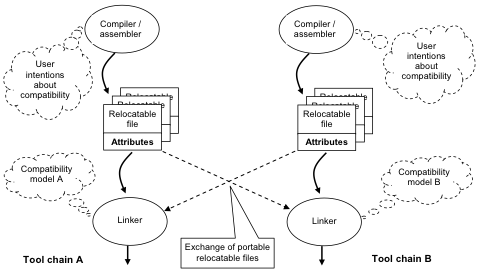
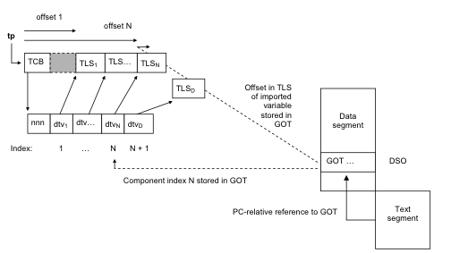

..
   Copyright (c) 2005-2020, Arm Limited and its affiliates.  All rights reserved.
   CC-BY-SA-4.0 AND Apache-Patent-License
   See LICENSE file for details

.. |release| replace:: 2020Q4
.. |date-of-issue| replace:: 21\ :sup:`st` December 2020
.. |copyright-date| replace:: 2005-2020
.. |footer| replace:: Copyright © |copyright-date|, Arm Limited and its
                      affiliates. All rights reserved.

.. _AAELF32: https://github.com/ARM-software/abi-aa/releases
.. _AAPCS32: https://github.com/ARM-software/abi-aa/releases
.. _BSABI32: https://developer.arm.com/documentation/ihi0045/latest
.. _EHABI32: https://github.com/ARM-software/abi-aa/releases
.. _RTABI32: https://github.com/ARM-software/abi-aa/releases
.. _GDWARF: http://dwarfstd.org/Dwarf3Std.php
.. _GELF: http://www.sco.com/developers/gabi/
.. _LSB: http://refspecs.linuxfoundation.org/lsb.shtml
.. _ARM Architecture Reference Manual ARMv7-A and ARMv7-R edition:
.. _ARMARM: https://developer.arm.com/documentation/ddi0406/latest
.. _ARMv7-M Architecture Reference Manual: https://developer.arm.com/documentation/ddi0403/latest
.. _ACLE: https://developer.arm.com/products/software-development-tools/compilers/arm-compiler-5/docs/101028/latest/1-preface

.. role:: c(code)
   :language: c

.. role:: cpp(code)
   :language: cpp

Addenda to, and Errata in, the ABI for the Arm® Architecture
************************************************************

.. class:: version

|release|

.. class:: issued

Date of Issue: |date-of-issue|

.. class:: logo

.. image:: Arm_logo_blue_150MN.png

.. section-numbering::

.. raw:: pdf

   PageBreak oneColumn

Preamble
========

Abstract
--------

This document describes late additions (addenda) to the ABI for the Arm
Architecture version 2.0, and errors (errata) discovered in it after
publication.

Keywords
--------

Addenda to the ABI for the Arm Architecture, errata in the ABI for the Arm
Architecture

Latest release and defects report
---------------------------------

Please check `Application Binary Interface for the Arm® Architecture
<https://github.com/ARM-software/abi-aa>`_ for the latest
release of this document.

Please report defects in this specification to the `issue tracker page
on GitHub
<https://github.com/ARM-software/abi-aa/issues>`_.

.. raw:: pdf

   PageBreak

Licence
-------

This work is licensed under the Creative Commons
Attribution-ShareAlike 4.0 International License. To view a copy of
this license, visit http://creativecommons.org/licenses/by-sa/4.0/ or
send a letter to Creative Commons, PO Box 1866, Mountain View, CA
94042, USA.

Grant of Patent License. Subject to the terms and conditions of this
license (both the Public License and this Patent License), each
Licensor hereby grants to You a perpetual, worldwide, non-exclusive,
no-charge, royalty-free, irrevocable (except as stated in this
section) patent license to make, have made, use, offer to sell, sell,
import, and otherwise transfer the Licensed Material, where such
license applies only to those patent claims licensable by such
Licensor that are necessarily infringed by their contribution(s) alone
or by combination of their contribution(s) with the Licensed Material
to which such contribution(s) was submitted. If You institute patent
litigation against any entity (including a cross-claim or counterclaim
in a lawsuit) alleging that the Licensed Material or a contribution
incorporated within the Licensed Material constitutes direct or
contributory patent infringement, then any licenses granted to You
under this license for that Licensed Material shall terminate as of
the date such litigation is filed.

About the license
-----------------

As identified more fully in the Licence_ section, this project
is licensed under CC-BY-SA-4.0 along with an additional patent
license.  The language in the additional patent license is largely
identical to that in Apache-2.0 (specifically, Section 3 of Apache-2.0
as reflected at https://www.apache.org/licenses/LICENSE-2.0) with two
exceptions.

First, several changes were made related to the defined terms so as to
reflect the fact that such defined terms need to align with the
terminology in CC-BY-SA-4.0 rather than Apache-2.0 (e.g., changing
“Work” to “Licensed Material”).

Second, the defensive termination clause was changed such that the
scope of defensive termination applies to “any licenses granted to
You” (rather than “any patent licenses granted to You”).  This change
is intended to help maintain a healthy ecosystem by providing
additional protection to the community against patent litigation
claims.

Contributions
-------------

Contributions to this project are licensed under an inbound=outbound
model such that any such contributions are licensed by the contributor
under the same terms as those in the `Licence`_ section.

Trademark notice
----------------

The text of and illustrations in this document are licensed by Arm
under a Creative Commons Attribution–Share Alike 4.0 International
license ("CC-BY-SA-4.0”), with an additional clause on patents.
The Arm trademarks featured here are registered trademarks or
trademarks of Arm Limited (or its subsidiaries) in the US and/or
elsewhere. All rights reserved. Please visit
https://www.arm.com/company/policies/trademarks for more information
about Arm’s trademarks.

Copyright
---------

Copyright (c) |copyright-date|, Arm Limited and its affiliates.  All rights reserved.

.. raw:: pdf

   PageBreak

.. contents::
   :depth: 3

.. raw:: pdf

   PageBreak

About this document
===================

Change Control
--------------

Current Status and Anticipated Changes
^^^^^^^^^^^^^^^^^^^^^^^^^^^^^^^^^^^^^^

The following support level definitions are used by the Arm ABI specifications:

**Release**
   Arm considers this specification to have enough implementations, which have
   received sufficient testing, to verify that it is correct. The details of these
   criteria are dependent on the scale and complexity of the change over previous
   versions: small, simple changes might only require one implementation, but more
   complex changes require multiple independent implementations, which have been
   rigorously tested for cross-compatibility. Arm anticipates that future changes
   to this specification will be limited to typographical corrections,
   clarifications and compatible extensions.

**Beta**
   Arm considers this specification to be complete, but existing
   implementations do not meet the requirements for confidence in its release
   quality. Arm may need to make incompatible changes if issues emerge from its
   implementation.

**Alpha**
   The content of this specification is a draft, and Arm considers the
   likelihood of future incompatible changes to be significant.

All content in this document is at the **Release** quality level.

Change history
^^^^^^^^^^^^^^

.. class:: addenda32-change-history

+-------+-------+-------------------------------------+-----------------------------------------------------------------------------+
| Issue |       | Date                                | Change                                                                      |
+=======+=======+=====================================+=============================================================================+
| v1.0  | r2.0  | 24\ :superscript:`th` March 2005    | First public release.                                                       |
+-------+-------+-------------------------------------+-----------------------------------------------------------------------------+
| v1.01 | r2.01 | 4\ :superscript:`th` July 2005      | Added new `Coding extensibility and compatibility`_. Noted component errata |
|       |       |                                     | omissions (`ELF for the Arm Architecture`_,                                 |
|       |       |                                     | `C Library ABI for the Arm Architecture`_, and                              |
|       |       |                                     | `C++ ABI for the Arm Architecture`_).                                       |
+-------+-------+-------------------------------------+-----------------------------------------------------------------------------+
| v1.02 |       | 7\ :superscript:`th` October 2005   | Added WMMX v2 architecture, TAG_CPU_unaligned_access                        |
|       |       |                                     | (`Public ("aeabi") attribute tags`_); changed R_ARM_PC24 to R_ARM_CALL      |
|       |       |                                     | (`Linux for Arm general dynamic model`_); added list of reserved name-space |
|       |       |                                     | prefixes (`Reserved Names`_); noted errata and omissions                    |
|       |       |                                     | (`DWARF for the Arm Architecture`_,                                         |
|       |       |                                     | `Procedure Call Standard for the Arm Architecture`_,                        |
|       |       |                                     | `C Library ABI for the Arm Architecture`_,                                  |
|       |       |                                     | `Exception Handling ABI for the Arm Architecture`_, and                     |
|       |       |                                     | `Run-time ABI for the Arm Architecture`_)                                   |
+-------+-------+-------------------------------------+-----------------------------------------------------------------------------+
| v1.03 | r2.02 | 13\ :superscript:`th` October 2005  | Minor typographical fixes.                                                  |
+-------+-------+-------------------------------------+-----------------------------------------------------------------------------+
| v1.04 | r2.03 | 6\ :superscript:`th` January 2006   | Noted errata and omissions (`aaelf32-clarifications`_,                      |
|       |       |                                     | `aaelf32-additions-omissions`_, and `cppabi32-clarifications`_).            |
+-------+-------+-------------------------------------+-----------------------------------------------------------------------------+
| v1.05 | r2.04 | 8\ :superscript:`th` May 2006       | Added missing Tag_FP_arch value for VFPv3                                   |
|       |       |                                     | (`Target-related attributes`_). Noted errata and omissions                  |
|       |       |                                     | (`aadwarf32-errors-fixed`_, `aaelf32-additions-omissions`_,                 |
|       |       |                                     | `aapcs32-clarifications`_, `clibabi32-errors-fixed`_,                       |
|       |       |                                     | and `cppabi32-clarifications`_).                                            |
+-------+-------+-------------------------------------+-----------------------------------------------------------------------------+
| v1.06 | r2.05 | 18\ :superscript:`th` January 2007  | Major clarification of, and some compatible extension to,                   |
|       |       |                                     | `ADDENDUM: Build Attributes`_.                                              |
+-------+-------+-------------------------------------+-----------------------------------------------------------------------------+
| v1.07 | r2.06 | 23\ :superscript:`rd` October 2007  | Added: CPU_arch values for v6S-M and v6-M; and VFP_arch value for           |
|       |       |                                     | VFPv3-D16; added Tag_nodefaults, Tag_ABI_FP_16bit_format, and               |
|       |       |                                     | Tag_FP_HP_extension. Rewrote `ADDENDUM: Build Attributes`_. Noted errata    |
|       |       |                                     | and omissions.                                                              |
+-------+-------+-------------------------------------+-----------------------------------------------------------------------------+
| A     |       | 25\ :superscript:`th` October 2007  | Document renumbered (formerly GENC-005895 v1.07).                           |
+-------+-------+-------------------------------------+-----------------------------------------------------------------------------+
| A     |       | 13\ :superscript:`th` November 2007 | Minor corrections to `Errata and Minor Addenda`_                            |
+-------+-------+-------------------------------------+-----------------------------------------------------------------------------+
| B     | r2.07 | 10\ :superscript:`th` October 2008  | Added architecture tags Tag_T2EE_use, Tag_Virtualization_use, and           |
|       |       |                                     | Tag_MPextension_use; clarified definitions of Tag_CPU_name and              |
|       |       |                                     | Tag_CPU_raw_name (`The target-related attributes`_); clarified tag          |
|       |       |                                     | value inheritance and Tag_Nodefaults (`Default values for public tags`_,    |
|       |       |                                     | `Inheritance of public tag values`_, `No defaults tag`_).                   |
+-------+-------+-------------------------------------+-----------------------------------------------------------------------------+
| C     | r2.08 | 4\ :superscript:`th` November 2009  | (`The target-related attributes`_): added Tag_CPU_arch enum value           |
|       |       |                                     | V7E-M =13; renamed Tag_VFP_arch to Tag_FP_arch, added values for            |
|       |       |                                     | VFPv4; renamed Tag_VFP_HP_extension to Tag_FP_HP_extension; added           |
|       |       |                                     | value to Tag_Advanced_SIMD_arch for Neon with fused MAC; added values       |
|       |       |                                     | to Tag_Virtualization_use describing use of the virtualization              |
|       |       |                                     | extensions; recoded Tag_MPextension use to catch potential user-mode        |
|       |       |                                     | faults; added Tag_DIV_use to describe use of UDIV/SDIV in code for          |
|       |       |                                     | v7A. (`The procedure call-related attributes`_) clarified the role of R9    |
|       |       |                                     | when used as a TLS (Tag_ABI_PCS_R9_use = 2). Renamed and extended           |
|       |       |                                     | Tag_ABI_align8_needed, Tag_ABI_align8_preserved to data with extended       |
|       |       |                                     | 2n-byte alignment (for n in 4-12).                                          |
+-------+-------+-------------------------------------+-----------------------------------------------------------------------------+
| D     | r2.09 | 30\ :superscript:`th` November 2012 | Made section and symbol attributes deprecated and optional                  |
|       |       |                                     | (`The kinds of compatibility modeled by build attributes`_,                 |
|       |       |                                     | `Formal syntax of a public (“aeabi”) attributes subsection`_,               |
|       |       |                                     | `Inheritance of public tag values`_, `No defaults tag`_).                   |
|       |       |                                     | (`Formal syntax of a public (“aeabi”) attributes subsection`_)              |
|       |       |                                     | clarified section and symbol numbers are                                    |
|       |       |                                     | ULEB128.  (`The target-related attributes`_) added architecture v8 values   |
|       |       |                                     | to Tag_CPU_arch, Tag_FP_arch, Tag_Advanced_SIMD_arch; clarified use of      |
|       |       |                                     | existing Tag_Advanced_SIMD_arch and Tag_FP_HP_extension values; clarified   |
|       |       |                                     | the meaning of Tag_DIV_use; deprecated Tag_T2EE_use.                        |
|       |       |                                     | (`The procedure call-related attributes`_) fixed typo in                    |
|       |       |                                     | Tag_ABI_FP_exceptions;                                                      |
|       |       |                                     | clarified use of Tag_ABI_HardFP_use values and removed pointless DP-only    |
|       |       |                                     | option; added enum value to Tag_ABI_VFP_args for code compatible with both  |
|       |       |                                     | the base and VFP variants. (`Secondary compatibility tag`_ clarified the    |
|       |       |                                     | format of Tag_also_compatible_with data.                                    |
|       |       |                                     | `Arm CPU names recognized by Arm Compiler 5.01 \(armcc\)`_) updated list of |
|       |       |                                     | recognised CPU names.                                                       |
+-------+-------+-------------------------------------+-----------------------------------------------------------------------------+
| E     | r2.10 | 24\ :superscript:`th` November 2015 | (`The target-related attributes`_) added architecture v8.1 values to        |
|       |       |                                     | Tag_Advanced_SIMD_arch.                                                     |
+-------+-------+-------------------------------------+-----------------------------------------------------------------------------+
| F     | 2018Q4| 21\ :sup:`st` December 2018         | In `The target-related attributes`_, deprecated values 1 and 2 of           |
|       |       |                                     | Tag_THUMB_ISA_use, added value 3.                                           |
|       |       |                                     |                                                                             |
|       |       |                                     | In `The target-related attributes`_, deprecated Tag_CPU_arch_profile for    |
|       |       |                                     | architecture version 8 onwards.                                             |
|       |       |                                     |                                                                             |
|       |       |                                     | In `The target-related attributes`_, defined build attributes for Armv8-M,  |
|       |       |                                     | Armv8-R, Armv8.1-A, Armv8.2-A and Armv8.3-A.                                |
+-------+-------+-------------------------------------+-----------------------------------------------------------------------------+
| G     |2019Q4 | 30\ :sup:`th` January 2020          | Added Tag_FramePointer_use: `The procedure call-related attributes`_,       |
|       |       |                                     | `Table 1`_.                                                                 |
+-------+-------+-------------------------------------+-----------------------------------------------------------------------------+
|       |2020Q3 | 1\ :sup:`st` October 2020           | - document released on Github                                               |
|       |       |                                     | - new Licence_: CC-BY-SA-4.0                                                |
|       |       |                                     | - new sections on Contributions_, `Trademark notice`_, and Copyright_       |
|       |       |                                     | - `Table 1`_: added a missing table entry for Tag_DSP_extension             |
+-------+-------+-------------------------------------+-----------------------------------------------------------------------------+

References
----------

This document refers to the following documents.

+-------------------------+------------------------------------------------------+--------------------------------------------------+
| Ref                     | Status / External URL                                | Title                                            |
+=========================+======================================================+==================================================+
| AAELF32_                |                                                      | ELF for the Arm Architecture                     |
+-------------------------+------------------------------------------------------+--------------------------------------------------+
| AAPCS32_                |                                                      | Procedure Call Standard for the Arm Architecture |
+-------------------------+------------------------------------------------------+--------------------------------------------------+
| BSABI32_                |                                                      | ABI for the Arm Architecture (Base Standard).    |
+-------------------------+------------------------------------------------------+--------------------------------------------------+
| EHABI32_                |                                                      | Exception Handling ABI for the Arm Architecture  |
+-------------------------+------------------------------------------------------+--------------------------------------------------+
| RTABI32_                |                                                      | Run-time ABI for the Arm Architecture            |
+-------------------------+------------------------------------------------------+--------------------------------------------------+
| ARMARM_                 |`ARM Architecture Reference Manual ARMv7-A and ARMv7-R| Arm DDI 0406: Arm Architecture Reference Manual  |
|                         |edition`_                                             | Arm v7-A and Arm v7-R edition                    |
+                         +------------------------------------------------------+--------------------------------------------------+
|                         |`ARMv7-M Architecture Reference Manual`_              | Arm DDI 0403: Armv7-M Architecture Reference     |
|                         |                                                      | Manual                                           |
+-------------------------+------------------------------------------------------+--------------------------------------------------+
| ACLE_                   | IHI 0053A                                            | Arm C Language Extensions                        |
+-------------------------+------------------------------------------------------+--------------------------------------------------+
| GDWARF_                 | http://dwarfstd.org/Dwarf3Std.php                    | DWARF 3.0, the generic debug table format.       |
+-------------------------+------------------------------------------------------+--------------------------------------------------+
| GELF_                   | http://www.sco.com/developers/gabi/ ...              | Generic ELF, 17\ :superscript:`th` December 2003 |
|                         |                                                      | draft.                                           |
+-------------------------+------------------------------------------------------+--------------------------------------------------+

Terms and abbreviations
-----------------------

The ABI for the Arm Architecture uses the following terms and abbreviations:

AAPCS
   Procedure Call Standard for the Arm Architecture

ABI
   Application Binary Interface:

   1. The specifications to which an executable must conform in order to
      execute in a specific execution environment. For example, the
      *Linux ABI for the Arm Architecture*.

   2. A particular aspect of the specifications to which independently produced
      relocatable files must conform in order to be statically linkable and
      executable.  For example, the `AAELF32`_, `RTABI32`_, ...

AEABI
   (Embedded) ABI for the Arm architecture (this ABI...)

Arm-based
   ... based on the Arm architecture ...

core registers
   The general purpose registers visible in the Arm architecture’s
   programmer’s model, typically r0-r12, SP, LR, PC, and CPSR.

EABI
   An ABI suited to the needs of embedded, and deeply embedded (sometimes
   called *free standing*), applications.

Q-o-I
   Quality of Implementation – a quality, behavior, functionality, or
   mechanism not required by this standard, but which might be provided
   by systems conforming to it. Q-o-I is often used to describe the
   tool-chain-specific means by which a standard requirement is met.

VFP
   The Arm architecture’s Floating Point architecture and instruction
   set. In this ABI, this abbreviation includes all floating point
   variants regardless of whether or not vector (V) mode is supported.

.. raw:: pdf

   PageBreak

ADDENDUM: Build Attributes
==========================

Introduction to build attributes
--------------------------------

About build attributes and compatibility
^^^^^^^^^^^^^^^^^^^^^^^^^^^^^^^^^^^^^^^^

Build attributes record data that a linker needs to reason mechanically
about the compatibility, or incompatibility, of a set of relocatable files.
Other tools that consume relocatable files may find the data useful.

Build attributes are designed to have long-term invariant meaning. They
record choices to which there is long term public commitment through the Arm
Architecture Reference Manual [ARMARM_], the ABI for the Arm Architecture
(of which this document is a component), vendor data sheets, and similar
long lived publications.

Build attributes approximate the intentions the user of a compiler or
assembler has for the compatibility of the relocatable file produced by the
compiler or assembler (`Attribute values are based on user intentions`_).

The figure below depicts the software development flows in which build
attributes are important.

   Software development flows supported by build attributes

In this depiction there are two principal uses of build attributes.

*  Within a tool chain, build attributes generate rich opportunities for a
   linker to diagnose incompatibility, enforce compatibility, and select
   library members intelligently according to its compatibility model.

*  Between tool chains, build attributes describe the intended compatibility
   of a relocatable file and the entities it defines in terms independent of
   either tool chain, promoting safe exchange of portable code in binary
   form.

Attribute values are based on user intentions
~~~~~~~~~~~~~~~~~~~~~~~~~~~~~~~~~~~~~~~~~~~~~

We base attribute values on user intentions to avoid the values being an
unpredictable (effectively random) function of a compiler’s code generation
algorithms and to support using attributes with assembly language without
overburdening programmers. Where attributes support exchanging portable
relocatable files among tool chains, predictability is worth more than
precision.

Capturing a user’s compile-time intentions about compatibility is also
important at link time.  For example:

*  A user might permit a compiler to use both the Arm ISA and the Thumb ISA.

   (The user intends the code to be usable on any processor that has both
   the Arm ISA and the Thumb ISA).

*  The compiler might choose to use only the Thumb ISA in a specific build
   of a source file.

   Nonetheless, the relocatable file should be tagged as having been
   permitted to use the Arm ISA so that a linker can later link it with
   Arm-state library code and generate Arm-state intra-call veneers if that
   gives benefit to the executable file.

On the other hand, if the user intends code to be executed by both Arm7TDMI
and Cortex-M3, the compiler must be constrained to generate only Thumb v1
instructions and the relocatable file should be tagged as not permitted to
use the Arm ISA.

Capturing user intentions about compatibility
~~~~~~~~~~~~~~~~~~~~~~~~~~~~~~~~~~~~~~~~~~~~~

This standard does not specify how a tool should capture and approximate the
intentions of its users.

As far as possible, ABI-defined compatibility tags
(`Public ("aeabi") attribute tags`_) model the long-term compatibility commitments
implicit in architectural specifications, product data sheets, and the ABI for
the Arm Architecture.

In general, tools have invocation options – command-line options and GUI
configuration options – that present choices similar to those revealed in
such documentation and modeled by ABI-defined compatibility tags.

The challenge for a tool that generates relocatable files is to select the
set of build attributes – giving a value to each compatibility tag – that
best approximates the user’s intentions implicit in its invocation options.

This part of the problem of managing compatibility does not have a perfect
solution. A user’s intentions are imperfectly approximated by invocation
options that are then sometimes imperfectly mapped to build attributes.

No standard compatibility model
~~~~~~~~~~~~~~~~~~~~~~~~~~~~~~~

This specification standardizes the meaning of build attributes, not the
compatibility models within which they will be interpreted.

For the majority of build attributes there is only one reasonable
interpretation of compatibility among their values, and it is an obvious
one.

For a minority – mostly associated with procedure-call compatibility between
functions – this is not the case and it is reasonable for different tool
chains to take different positions according to the markets they serve.

Thus it is entirely reasonable that a relocatable file produced by tool
chain A and accepted by tool chain B’s linker might be rejected by tool
chain C’s linker when targeting exactly the same environment as tool chain
B.

Our hope and intention for attributes is that they might prevent C’s linker
from accepting the output of A and silently generating a non functioning
executable file or failing in a mysterious and difficult to explain manner.

The kinds of compatibility modeled by build attributes
^^^^^^^^^^^^^^^^^^^^^^^^^^^^^^^^^^^^^^^^^^^^^^^^^^^^^^^^

Build attributes primarily model two kinds of compatibility.

*  The compatibility of binary code with target hardware conforming to a
   revision of the Arm Architecture.

*  The procedure-call compatibility between functions conforming to variants
   of this ABI.

The intuitive notion of compatibility can be given a mathematically precise
definition using sets of demands placed on an execution environment.

For example, a program could be defined to be compatible with a processor if
(and only if) the set of instructions the program might try to execute is a
subset of the set of instructions implemented by the processor.

Target-related attributes (`Target-related attributes`_) describe the
hardware-related demands a relocatable file will place on an execution
environment through being included in an executable file for that environment.

For example, target-related attributes record whether use of the Thumb ISA
is permitted, and at what architectural revision use is permitted. A pair of
values for these attributes describes the set of Thumb instructions that
code is permitted to execute and that the target processor must implement.

Procedure call-related attributes (`Procedure call-related attributes`_)
describe features of the ABI contract that the ABI allows to vary, such as
whether floating point parameters are passed in floating point registers, the
size of :c:`wchar_t`, whether enumerated values are containerized according to
their size, and so on.

We can also understand procedure call-related compatibility in terms of sets
of demands placed on an execution environment, but the modeling is more
difficult. In this case the environment is less obvious, more abstract, and
elements of it can depend on an operating system or the tool chain itself.

Mathematically, A *compatible with* B can be understood as: {demands
made by A} ⊆ {demands made by B}.

Making this concrete sometimes requires combining information from several
tags. Writing {T16\@v4T} to denote the set of 16-bit Thumb instructions a
processor must execute to conform to architecture version v4T, we can
understand T16\@v4T compatible with T16\@v5TE as {T16\@v4T} ⊂
{T16\@v5TE}.

The scope of build attributes
^^^^^^^^^^^^^^^^^^^^^^^^^^^^^

Unless :c:`#pragma` or other mechanisms specific to a tool chain are used, it is
usual for all parts of a relocatable file to be built the same way with the
same compatibility intentions. So, usually, build attributes are given file
scope and apply to all entities defined in the file to which they can apply.
For example:

*  File-scope attributes that model the compatibility of binary instructions
   with processors naturally apply to each instruction in every
   code-containing section in the file.

   (They obviously do not apply to sections that contain no code, nor to the
   data – such as literal pools – embedded in code sections).

*  Attributes that describe the procedure call-compatibility of functions
   naturally apply to every function symbol defined in the code sections
   contained within the file.

Build attributes can be given to individual entities defined in a
relocatable file.

*  To an individual ELF section.

   These attributes also apply to every (relevant) symbol defined in the
   section.

*  To an individual function or data object identified by an ELF symbol
   definition.

For the public build attributes defined by this ABI (`Public ("aeabi") attribute tags`_) a compiler for
C/C++ can only need to use section and symbol attributes in the presence of
#pragmas, language extensions, or other mechanisms that affect the
compatibility of individual entities within a binary file.

Linkers that support relocatable file merging – termed partial linking by
RealView linkers – will, in general, need to transfer the file scope
attributes of an input file to the individual sections that file contributes
to the output file.

This standard places no requirements on the presence or absence of build
attributes in executable files.

.. note::

   From the 2.09 release, section and symbol attributes are deprecated and
   optional. Primary object producers are discouraged from generating them
   and consumers are permitted to ignore them.

Build attributes and conformance to the ABI
^^^^^^^^^^^^^^^^^^^^^^^^^^^^^^^^^^^^^^^^^^^

In revision 2.05 and later revisions of this ABI specification, the presence
of a build attributes section containing an “aeabi” subsection containing a
conformance tag (`Conformance tag`_) denotes an explicit claim
by the producer that the relocatable file conforms to:

*  The version of the ABI described by tag’s string parameter.

*  The variant of that version described by the public (“aeabi”) build
   attributes.

A claim to conform to ABI version “0” denotes that no unconditional claim to
conform is being made. Generic compatibility tags
(`Generic compatibility tag`_) may then describe limited or conditional
claims to conform.

In revisions of this specification before r2.05 any claim to conform to this
ABI was implicit, and the version to which conformance was (possibly)
claimed was implicitly “2”.

Combining attribute values
^^^^^^^^^^^^^^^^^^^^^^^^^^

Suppose E1 and E2 are entities (for example, relocatable files) with
attribute values a1 and a2 for an attribute tag T. This section discusses
how to generate the correct value of T for the entity formed by combining E1
and E2 (for example, the executable file formed by linking E1 with E2)

In each case, the values of a tag can be partially ordered according to the
sets of demands they represent. We shall write a1 ≤ a2 if an entity
tagged with <T, a1> makes no more demands on its environment than an entity
tagged with <T, a2>.

Writing {T:a1} to denote the set of demands made by an entity tagged with
<T, a1>,  we can define a1 ≤ a2 if {T:a1} ⊆ {T:a2}.
(A set of demands might be the set of instructions a processor must execute, for
example).

Informally we say that a1 is compatible with a2 or a1 is more compatible
than a2 when a1 ≤ a2.

Using ``Tag_CPU_arch`` (`The target-related attributes`_) as an example, v4T
≤ v5TE, because the set of instructions conforming to architecture v4T
is a subset of the set conforming to architecture v5TE. Stated more precisely,
for both the Arm ISA and the 16-bit Thumb ISA, it is the case that {ISA\@v4T}
⊆ {ISA\@v5TE}.

This partial order often differs from the arithmetic order of the enumerated
values though in many cases it

*  Is identical (as with ``Tag_THUMB_ISA_use`` in
   `The target-related attributes`_).

*  Is reversed (as with ``Tag_ABI_align_preserved`` in
   `The procedure call-related attributes`_).

*  Represents mutually incompatible choices with which only the identical
   choice, or no use at all, is compatible (as with ``Tag_ABI_PCS_wchar_t`` in
   `The procedure call-related attributes`_).

Note that the appropriate partial order to use can evolve over time as the
underlying specifications evolve.

Combining two values of the same tag
~~~~~~~~~~~~~~~~~~~~~~~~~~~~~~~~~~~~

We shall write a1 <> a2 if a1 and a2 are unordered in the partial order of
demands/compatibility and a1 + a2 to denote the combination of a1 and a2.
There are the following combination rules.

*  If a1 ≤ a2, a1 + a2 = a2. Similarly, if a2 ≤ a1,
   a1 + a2 = a1. (‘+’ behaves like the *maximum* function).

*  If a1 <> a2 there are two mutually exclusive sub-cases.

   *  There is a least a3 such that a1 ≤ a3 and a2 ≤ a3.
      Then a1 + a2 = a3.

      Example: ``Tag_CPU_arch`` when a1 = v6KZ, a2 = v6T2, and a3 = v7.

   *  There is no such a3, so a1 + a2 denotes the attempted combination of
      incompatible values.

      Example: ``Tag_ABI_PCS_wchar_t`` when a1 = 2 and a2 = 4.

In this second sub-case it is a matter of notational taste whether a1 + a2
is defined to have a value such as error or Top, or defined to have no
value. Either way, in practice we expect an attempted combination to fail in
a way specific to a tool chain’s compatibility model (for example by
provoking a link-time diagnostic).

Representing build attributes in ELF files
------------------------------------------

Encoding
^^^^^^^^

Encoding build attributes needs more than a few bits, so we encode them in
an vendor-specific section of type SHT_ARM_ATTRIBUTES and name
.ARM.attributes (for further details see [AAELF32_]).

An attribute is encoded in a <tag, value> pair.

Both tags and numerical values are encoded using unsigned LEB128 encoding
(ULEB128), DWARF-3 style (for details see [GDWARF_]).

The public tags and values specified by this version of the ABI encode
identically as ULEB128 numbers and single byte numbers (all values are in
the range 0-127).

String values are encoded using NUL-terminated byte strings (NTBS).

Structure of an ELF attributes section
^^^^^^^^^^^^^^^^^^^^^^^^^^^^^^^^^^^^^^

An attributes section contains a sequence of subsections. Each one is either

*  Defined by this ABI and public to all tools that process the file.

*  Private to a tool vendor’s tools.

The type of each subsection is given by a short textual (NTBS) name.

This ABI requires a vendor to register a short vendor name to use as a
prefix to the names of private helper functions (for details see
[RTABI32_] or [AAELF32_]). The same vendor name
identifies attribute subsections private to that vendor’s tools.

A public attributes subsection is named aeabi. Names beginning *Anon*
and *anon* are reserved to unregistered private use.

Formal syntax of an ELF attributes section
^^^^^^^^^^^^^^^^^^^^^^^^^^^^^^^^^^^^^^^^^^

The syntactic structure of an attributes section is::

   <format-version: ‘A’>
   [ <uint32: subsection-length> NTBS: vendor-name
     <bytes: vendor-data>
   ]*

*Format-version* describes the format of the following data. It is a
single byte. This is version 'A' (0x41). This field exists to allow future
changes in format. We do not intend that there will be many versions.

*Subsection-length* is a 4-byte integer in the byte order of the ELF
file. It encodes the length of the subsection, including the length field
itself, the vendor name string and its terminating NUL byte, and the following
vendor data. It gives the offset from the start of this subsection to the start
of the next one.

*Vendor-name* is a NUL-terminated byte string (NTBS) like a C-language
literal string.

No requirements are placed on the format of private vendor data. The format
of a public attributes subsection (“aeabi” pseudo-vendor data) is described
in `Formal syntax of a public (“aeabi”) attributes subsection`_.

We expect a dot-ARM-dot-attributes section in a relocatable file will most
typically contain one vendor subsection from the "aeabi" pseudo-vendor and
possibly one from the generating tool chain (e.g. "ARM", "gnu", "WRS", etc).

Formally, there are no constraints on the order or number of vendor
subsections. A consumer can collect the public ("aeabi") attributes in a
single pass over the section, then all of its private data in a second pass.

.. _addenda32-section2-2-4:

Formal syntax of a public (“aeabi”) attributes subsection
^^^^^^^^^^^^^^^^^^^^^^^^^^^^^^^^^^^^^^^^^^^^^^^^^^^^^^^^^

The syntactic structure of a public attributes subsection is::

   [   Tag_File    (=1) <uint32: byte-size> <attribute>*
     | Tag_Section (=2) <uint32: byte-size> <section number>* 0 <attribute>*
     | Tag_Symbol  (=3) <unit32: byte-size> <symbol number>*  0 <attribute>*
   ]+

A public subsection contains any number of sub-subsections. Each records
attributes relating to:

*  The whole relocatable file.

   These sub-subsections contain just a list of attributes. They are
   identified by a leading ``Tag_File`` (=1) byte.

*  A set of sections within the relocatable file.

   These sub-subsections contain a list of ULEB128 section numbers followed
   by a list of attributes. They are identified by a leading ``Tag_Section``
   (=2) byte.

*  A set of (defined) symbols in the relocatable file.

   These sub-subsections contain a list of ULEB128 symbol numbers followed
   by a list of attributes. They are identified by a leading ``Tag_Symbol`` (=3)
   byte.

In each case, byte-size is a 4-byte unsigned integer in the byte order of
the ELF file. Byte-size includes the initial tag byte, the size field
itself, and the sub-subsection content. That is, it is the byte offset from
the start of this sub-subsection to the start of the next sub-subsection.

Both section indexes and defined symbol indexes are non-zero, so a NUL byte
ends a string and a list of indexes without ambiguity.

There are no constraints on the order or number of sub-subsections in a
public attributes subsection (but see remarks in
`Conformance tag`_ concerning ``Tag_conformance`` and
`No defaults tag`_ concerning ``Tag_nodefaults``).

A consumer that needs the data in scope nesting order can obtain the file
attributes, the section-related attributes, and the symbol-related
attributes, by making three passes over the subsection.

.. note::

   From the 2.09 release, section and symbol attributes are deprecated and
   optional. Primary object producers are discouraged from generating them
   and consumers are permitted to ignore them.

.. _addenda32-section2-2-5:

Conformance constraints
^^^^^^^^^^^^^^^^^^^^^^^

This ABI requires the following of files that claim to conform
(`Build attributes and conformance to the ABI`_) to the ABI.

*  Attributes that record data about the compatibility of this file with
   other files must be recorded in a public "aeabi" subsection.

*  Attributes meaningful only to the producer must be recorded in a private
   vendor subsection. These must not affect compatibility between
   relocatable files.

When a producer does not explicitly claim compatibility to the ABI, it may
nonetheless publicly describe the effect on compatibility of its private
attributes by using generic compatibility tags
(`Generic compatibility tag`_). These must record a safe approximation.
The producer can record precise information that only its own tool chain
comprehends in a private vendor subsection.

*  We intend that another tool chain should not mistakenly link incompatible
   files. The price of safety is that a tool chain might sometimes diagnose
   incompatibility between files that could be safely linked, because their
   compatibility has been approximated.

*  We do not expect that a tool chain should be able to comprehend the
   private data of a different tool chain (other than through private
   agreement among tool chains).

Coding extensibility and compatibility
^^^^^^^^^^^^^^^^^^^^^^^^^^^^^^^^^^^^^^

As a specification like this evolves, legacy binary files and the tools that
process them get out of step. This will cause difficulties when a tool must
consume a public attributes subsection containing tags it does not
comprehend (that is, when the tool follows an earlier version of the
specification than the binary file).

The attributes defined in `Public ("aeabi") attribute tags`_, below, carry a mix of
information that consumers can safely ignore and information about
incompatibility that must not be ignored. In the absence of further
conventions, the only safe course for a tool to take on encountering an
unknown tag would be to stop processing.

To support more graceful behavior in the face of an evolving set of public
tags, we adopt these conventions.

*  Tags 0-63 convey information that a consuming tool must comprehend. This
   includes all the tags (1-32) defined by the first release (v1.0) of this
   addendum. A tool encountering an unknown tag in this range should stop
   processing or take similar defensive action (Q-o-I).

*  Tags 64-127 convey information a consumer can ignore safely (though maybe
   with degraded functionality).

*  For N ≥ 128, tag N has the same properties as tag N modulo 128.

To allow an ignored tag and its parameter value to be skipped easily, we
adopt this convention.

*  For N > 32, even numbered tags have a ULEB128 parameter and odd numbered
   ones have a null-terminated byte string (NTBS) parameter.

*  A consumer must comprehend tags 1-32 individually.

Public ("aeabi") attribute tags
-------------------------------

About public tags
^^^^^^^^^^^^^^^^^

A consumer must recognize the tags described in this section (`Public ("aeabi") attribute tags`_) in
vendor subsections named "aeabi".

Other vendor sections may re-use these tags, define their own tags, or use a
completely different encoding of their private attribute data. In each case
the meaning of the data is private to the defining vendor.

While public tags and their numerical parameters are specified as
ULEB128-encoded, the values defined by this version, and all earlier
versions, of the ABI encode identically as ULEB128 numbers and single byte
numbers.

Default values for public tags
^^^^^^^^^^^^^^^^^^^^^^^^^^^^^^

The effect of omitting a public tag in file scope is identical to including
it with a value of 0 or “”, depending on its parameter type.

A producer must consider what value it intends to give to each public tag.
In the absence of ``Tag_nodefaults`` (`No defaults tag`_) a
consumer should conclude that the producer intended to give the value 0 to
each omitted public tag.

Inheritance of public tag values
^^^^^^^^^^^^^^^^^^^^^^^^^^^^^^^^

An attribute can be given to a symbol, a section, or a relocatable file.
Normally, each section in a file inherits the attributes defined at file
level and each symbol defined in a section inherits the attributes of that
section.

A tag value given explicitly in a scope overrides a value that would
otherwise be inherited. If ``Tag_nodefaults`` (`No defaults tag`_)
appears in a scope, enclosed empty scopes have undefined attribute values value
rather than default zero values.

Semi formally we define the value of a public tag T in a scope S (one of
Symbol, Section, or File) as follows.

.. parsed-literal::

   value(T, S) ≡ S.empty() & S.parent.has(Tag_nodefaults) ? undefined :
                 S.has(T) ? T.value :
                 value(T, S.parent)
   value(T, File.parent) ≡ 0

   Where S.empty() ≡ not (S.has(T) for some T ≠ Tag_nodefaults)
         S.has(T)  ≡ T and its value are given explicitly in scope S
         Symbol.parent ≡ Section; Section.parent ≡ File

In any scope it is erroneous to give two different values to the same
attribute, though the same value may be given more than once.

.. note::

   From the 2.09 release, section and symbol attributes are deprecated and
   optional. Primary object producers are discouraged from generating them
   and consumers are permitted to ignore them.

How this specification describes public attributes
^^^^^^^^^^^^^^^^^^^^^^^^^^^^^^^^^^^^^^^^^^^^^^^^^^

In the following sections we describe each attribute in a uniform style, as
follows. ::

   Tag_tag_name (=tag value), parameter type (=uleb128 or NTBS)
      value  Comment
      value  Comment
      ...

   Block commentary about the tag and its possible values.

*Tag value* gives the numerical representation of the tag. It is a
small integer less than 128.

*Parameter type* gives the type of the parameter that immediately
follows the tag in the attributes section. It is either a ULEB128-encoded
integer or a NUL-terminated byte string (NTBS).

Following lines enumerate the currently defined parameter values, giving a
short comment about each one.

A block of explanatory text follows in some cases.

Target-related attributes
^^^^^^^^^^^^^^^^^^^^^^^^^

About target-related attributes
~~~~~~~~~~~~~~~~~~~~~~~~~~~~~~~

Target-related attributes describe the demands a user permitted a producer
to place on the target system (`Capturing user intentions about compatibility`_).

These attributes summarize the target features and facilities needed to
execute the instructions contained in the code sections of this relocatable
file. A file may make fewer demands than its attributes describe, but not
more.

The target-related attributes
~~~~~~~~~~~~~~~~~~~~~~~~~~~~~

::

   Tag_CPU_raw_name, (=4), NTBS

The raw name is the name a user gave to a tool or selected from a menu. It can
be:

*  The name of a specific manufacturer’s part (such as ML692000).

*  The name of a generic part (such as Arm946E-S) or architecture (such as
   v5TE).

*  Any other name acceptable to the tool chain.

The value "" denotes that the raw name is identical to the CPU name
(described immediately below) and records that the user built for a generic
implementation (such as Arm946E-S) rather than any manufacturer-specific
part (such as ML692000) based on it.

It is always safe to use "" as a dummy value for this tag, or to omit this
tag.

::

   Tag_CPU_name, (=5), NTBS

A CPU name is defined by Arm or the architecture licensee responsible for
designing the part. It is the official product name, with no extension and
no abbreviation.

An Arm-defined architecture name may be used instead of a CPU name, and
denotes that the user had more generic intentions. Arm-defined names of CPUs
and architectures recognized by Arm Compiler 5.01 are listed in
`Arm CPU names recognized by Arm Compiler 5.01 (armcc)`_.

The following tags describe the processor architecture version and
architecture profile for which the user intended the producer to produce
code.

::

   Tag_CPU_arch, (=6), uleb128
       0  Pre-v4
       1  Arm v4     // e.g. SA110
       2  Arm v4T    // e.g. Arm7TDMI
       3  Arm v5T    // e.g. Arm9TDMI
       4  Arm v5TE   // e.g. Arm946E-S
       5  Arm v5TEJ  // e.g. Arm926EJ-S
       6  Arm v6     // e.g. Arm1136J-S
       7  Arm v6KZ   // e.g. Arm1176JZ-S
       8  Arm v6T2   // e.g. Arm1156T2F-S
       9  Arm v6K    // e.g. Arm1136J-S
      10  Arm v7     // e.g. Cortex-A8, Cortex-M3
      11  Arm v6-M   // e.g. Cortex-M1
      12  Arm v6S-M  // v6-M with the System extensions
      13  Arm v7E-M  // v7-M with DSP extensions
      14  Arm v8-A
      15  Arm v8-R
      16  Arm v8-M.baseline
      17  Arm v8-M.mainline
      18  Arm v8.1-A
      19  Arm v8.2-A
      20  Arm v8.3-A
      21  Arm v8.1-M.mainline

   Tag_CPU_arch_profile (=7), uleb128
       0  Architecture profile is not applicable (e.g. pre v7, or cross-profile code),
          or is indicated by Tag_CPU_arch
      'A' (0x41) The application profile (e.g. for Cortex-A8)
      'R' (0x52) The real-time profile (e.g. for Cortex-R4)
      'M' (0x4D) The microcontroller profile (e.g. for Cortex-M3)
      ’S’ (0x53) Application or real-time profile (i.e. the ‘classic’ programmer’s model)

``Tag_CPU_arch_profile`` states that the attributed entity requires the noted
architecture profile.

The value 0 states that there is no requirement for any specific
architecture profile. The value ‘S’ denotes that the attributed entity
requires the classic programmer’s model rather than the microcontroller
programmer’s model.

Starting with architecture versions v8-A, v8-R and v8-M, the profile is
represented by Tag_CPU_arch. For these architecture versions and any later
versions, a value of 0 should be used for ``Tag_CPU_arch_profile``.

The following tags track the permitted use of instruction sets. The
architecture revision (``Tag_CPU_arch``) implies the permitted subset of
instructions from the permitted ISA.

::

   Tag_ARM_ISA_use, (=8), uleb128
      0  The user did not permit this entity to use Arm instructions
      1  The user intended that this entity could use Arm instructions

   Tag_THUMB_ISA_use, (=9), uleb128
      0  The user did not permit this entity to use Thumb instructions
      1  (deprecated) The user permitted this entity to use 16-bit Thumb instructions (including BL)
      2  (deprecated) 32-bit Thumb instructions were permitted (implies 16-bit instructions permitted)
      3  The user permitted this entity to use Thumb code. The set of permitted instructions can be
         determined by the setting of Tag_CPU_arch and Tag_CPU_arch_profile

      Note: The historical use of values 1 and 2 date to a time when there was
      a clear separation between implementations using 16-bit only Thumb
      instructions and those using the extended set of instructions. The
      introduction of Armv8-M.baseline has blurred this distinction to the
      point where it is no-longer useful. Arm recommends that in future all
      toolchains emit a value of 3 when use of Thumb was intended by the user
      and 0 (or omitting the tag entirely) when use of Thumb was not intended.

   Tag_FP_arch, (=10), uleb128 (formerly Tag_VFP_arch = 10)
      0  The user did not permit this entity to use instructions requiring FP hardware
      1  The user permitted use of instructions from v1 of the floating point (FP) ISA
      2  Use of the v2 FP ISA was permitted (implies use of the v1 FP ISA)
      3  Use of the v3 FP ISA was permitted (implies use of the v2 FP ISA)
      4  Use of the v3 FP ISA was permitted, but only citing registers D0-D15, S0-S31
      5  Use of the v4 FP ISA was permitted (implies use of the non-vector v3 FP ISA)
      6  Use of the v4 FP ISA was permitted, but only citing registers D0-D15, S0-S31
      7  Use of the Arm v8-A FP ISA was permitted
      8  Use of the Arm v8-A FP ISA was permitted, but only citing registers D0-D15, S0-S31

   Tag_WMMX_arch, (=11), uleb128
      0  The user did not permit this entity to use WMMX
      1  The user permitted this entity to use WMMX v1
      2  The user permitted this entity to use WMMX v2

   Tag_Advanced_SIMD_arch, (=12), uleb128
      0  The user did not permit this entity to use the Advanced SIMD Architecture (Neon)
      1  Use of the Advanced SIMDv1 Architecture (Neon) was permitted
      2  Use of Advanced SIMDv2 Architecture (Neon) (with half-precision floating-point and
         fused MAC operations) was permitted
      3  Use of the Arm v8-A Advanced SIMD Architecture (Neon) was permitted
      4  Use of the Arm v8.1-A Advanced SIMD Architecture (Neon) was permitted

   Tag_MVE_arch, (=48), uleb128
      0  The user did not permit this entity to use the M-profile Vector Extension
      1  Use of the Integer M-profile Vector Extension was permitted
      2  Use of the Integer and Floating Point M-profile Vector Extension was
      permitted

   Tag_FP_HP_extension (=36), uleb128 (formerly Tag_VFP_HP_extension = 36)
      0  The user intended half-precision floating point instructions may be used if they
         exist in the available FP and ASIMD instruction sets as indicated by Tag_FP_arch
         and Tag_ASIMD_arch
      1  Use of the half-precision instructions first added as an optional extension to
         VFPv3/Advanced SIMDv1 was permitted, in addition to those indicated by Tag_FP_arch
         and Tag_ASIMD_arch
      2  Use of the half-precision instructions first added as an optional extension to
         Armv8.2-A Floating-Point and Advanced SIMD was permitted, in addition to those
         indicated by Tag_FP_arch and Tag_ASIMD_arch

The following tag describes the unaligned data accesses the user permitted
the producer to make.

::

   Tag_CPU_unaligned_access, (=34), uleb128
      0  The user did not intend this entity to make unaligned data accesses
      1  The user intended that this entity might make v6-style unaligned data accesses

The following tags describe intended use of optional architectural extensions.

::

   Tag_T2EE_use, (=66), uleb128
       0  No use of T2EE extension was permitted, or no information is available
       1  Use of the T2EE extension was permitted

In effect, ``Tag_T2EE_use`` describes the intended use of ENTERX and LEAVEX
instructions. ``Tag_T2EE_use`` is deprecated from r2.09.

::

   Tag_Virtualization_use, (=68), uleb128
       0  No use of any virtualization extension was permitted, or no information available
       1  Use of the TrustZone extension was permitted
       2  Use of the virtualization extensions (HVC, ERET) were permitted
       3  Use of TrustZone and virtualization extensions were permitted

In effect, ``Tag_Virtualization_use`` describes the intended use of the SMC
instruction in bit 0 of the tag value and the intended use of HVC and ERET
instructions in bit 1.

::

   Tag_MPextension_use, (=42), uleb128
       0  No use of Arm v7 MP extension was permitted, or no information available.
       1  Use of the Arm v7 MP extension was permitted.

In effect, ``Tag_MPextension_use`` describes the intended use of the PLDW
(preload write hint) instruction.

::

   Tag_DIV_use, (=44), uleb128
       0  The user intended divide instructions may be used if they exist, or no explicit
          information recorded. This code was permitted to use SDIV and UDIV if the
          instructions are guaranteed present in the architecture,
          as indicated by Tag_CPU_arch and Tag_CPU_arch_profile.
       1  This code was explicitly not permitted to use SDIV or UDIV.
       2  This code was permitted to use SDIV and UDIV in the Arm and Thumb ISAs; the
          instructions are present as an optional architectural extension above the base
          architecture implied by Tag_CPU_arch and Tag_CPU_arch_profile.

.. note::

   Value 1 records an explicit intention to not use divide instructions in
   this code, on targets where they would otherwise be permitted. This
   intention could be conveyed to the object producer by citing a "no
   divide" command-line option, or by other means. How a linker interprets
   this intention is QoI.

.. note::

   Producers must emit value 2 if and only if the permission to use SDIV and
   UDIV cannot be conveyed using values 0 and 1.

::

   Tag_DSP_extension, (=46), uleb128
       0  The user intended DSP instructions may be used if they exist. This
          entity is permitted to use DSP instructions if they are guaranteed
          present in the architecuture as indicated by Tag_CPU_arch.
       1  This code was permitted to use Thumb DSP functions as an optional
          architecture extension above the base architecture as indicated by
          Tag_CPU_arch.

Procedure call-related attributes
^^^^^^^^^^^^^^^^^^^^^^^^^^^^^^^^^

About procedure call-related attributes
~~~~~~~~~~~~~~~~~~~~~~~~~~~~~~~~~~~~~~~

Procedure call-related attributes describe compatibility with the ABI. They
summarize the features and facilities that must be agreed in an interface
contract between functions defined in this relocatable file and elsewhere.
We call the functions subject to such interface contracts *public
functions*.

.. admonition:: Aside
   :class: note

   In C/C++ terminology, all public functions have extern linkage but
   not all extern functions are public. In ELF terminology, all public symbols
   are global, but not all global symbols are public.

For a public function defined in this relocatable file, attributes describe
what the user intended the producer to guarantee about the function.

For a public function used by code in this relocatable file, attributes
describe what the user intended the producer to assume about the function.

The procedure call-related attributes
~~~~~~~~~~~~~~~~~~~~~~~~~~~~~~~~~~~~~

::

   Tag_PCS_config, (=13), uleb128
       0  No standard configuration used, or no information recorded
       1  Bare platform configuration
       2  Linux application configuration
       3  Linux DSO configuration
       4  Palm OS 2004 configuration
       5  Reserved to future Palm OS configuration
       6  Symbian OS 2004 configuration
       7  Reserved to future Symbian OS configuration

``Tag_PCS_config`` summarizes the user intention behind the procedure-call
standard configuration used. Its value must be consistent with the values
given to the tags below, and must not be used as a macro in place of them.

The following four tags summarize how the user intended the attributed
entity to address static data.

::

   Tag_ABI_PCS_R9_use, (=14), uleb128
       0  R9 used as V6 (just another callee-saved register, implied by omitting the tag)
       1  R9 used as SB, a global Static Base register
       2  R9 used as a Thread Local Storage (TLS) pointer
       3  R9 not used at all by code associated with the attributed entity

R9 has a role in some variants of the PCS. ``Tag_ABI_PCS_R9_use`` describes the
user’s chosen PCS variant.

When R9 is used as a Thread Local Storage (TLS) pointer (``Tag_ABI_PCS_R9_use``
= 2), R9 plays the role that would otherwise be played by one of the three
Software Thread ID Registers ``TPIDRURW``, ``TPIDRURO``, ``TPIDRPRW`` defined in section
B3.12.46, CP15 c13 Software Thread ID registers, of the Arm Architecture
Reference Manual Arm v7-A and Arm v7-R edition [Arm DDI 0406].

The role played by that ``TPID*`` register is defined by the software platform’s
ABI.

::

   Tag_ABI_PCS_RW_data, (=15), uleb128
       0  RW static data was permitted to be addressed absolutely
       1  RW static data was only permitted to be addressed PC-relative
       2  RW static data was only permitted to be addressed SB-relative
       3  The user did not permit this entity to use RW static data

   Tag_ABI_PCS_RO_data, (=16), uleb128
       0  RO static data was permitted to be addressed absolutely
       1  RO static data was only permitted to be addressed PC-relative
       2  The user did not permit this entity to use RO static data

   Tag_ABI_PCS_GOT_use, (=17), uleb128
       0  The user did not permit this entity to import static data
       1  The user permitted this entity to address imported data directly
       2  The user permitted this entity to address imported data indirectly (e.g. via a GOT)

Compatibility among shared objects and their clients is affected by whether
imported data are addressed directly or indirectly. Linux imported data must
be addressed indirectly (via the Global Object Table, or GOT). Symbian OS
(2004) imported data must be addressed directly.

The following two tags describe the permitted sizes of a wide character and
an enumerated data item.

::

   Tag_ABI_PCS_wchar_t, (=18), uleb128
       0  The user prohibited the use of wchar_t when building this entity
       2  The user intended the size of wchar_t to be 2
       4  The user intended the size of wchar_t to be 4

   Tag_ABI_enum_size, (=26), uleb128
       0  The user prohibited the use of enums when building this entity
       1  Enum values occupy the smallest container big enough to hold all their values
       2  The user intended Enum containers to be 32-bit
       3  The user intended that every enumeration visible across an ABI-complying interface
          contains a value needing 32 bits to encode it; other enums can be containerized

The following pair of tags summarizes the alignment contract across an interface.

::

   Tag_ABI_align_needed, (=24), uleb128
       0  The user did not permit code to depend the alignment of 8-byte data or data with
          extended (> 8-byte) alignment
       1  Code was permitted to depend on the 8-byte alignment of 8-byte data items
       2  Code was permitted to depend on the 4-byte alignment of 8-byte data items
       3  Reserved
       n  (in 4..12) Code was permitted to depend on the 8-byte alignment of 8-byte data items
          and the alignment of data items having up to 2n-byte extended alignment

   Tag_ABI_align_preserved, (=25), uleb128
       0  The user did not require code to preserve 8-byte alignment of 8-byte data objects
       1  Code was required to preserve 8-byte alignment of 8-byte data objects
       2  Code was required to preserve 8-byte alignment of 8-byte data objects and to
          ensure (SP MOD 8) = 0 at all instruction boundaries (not just at function calls)
       3  Reserved
       n (in 4..12) Code was required to preserve the alignments of case 2 and the alignment
         of data items having up to 2n-byte extended alignment.

The following five tags summarize the requirements code associated with this
attributed entity was permitted to place on floating-point arithmetic.

::

   Tag_ABI_FP_rounding, (=19), uleb128
       0  The user intended this code to use the IEEE 754 round to nearest rounding mode
       1  The user permitted this code to choose the IEEE 754 rounding mode at run time

   Tag_ABI_FP_denormal, (=20), uleb128
       0  The user built this code knowing that denormal numbers might be flushed to (+) zero
       1  The user permitted this code to depend on IEEE 754 denormal numbers
       2  The user permitted this code to depend on the sign of a flushed-to-zero number being
          preserved in the sign of 0

   Tag_ABI_FP_exceptions, (=21), uleb128
       0  The user intended that this code should not check for inexact results
       1  The user permitted this code to check the IEEE 754 inexact exception

   Tag_ABI_FP_user_exceptions, (=22), uleb128
       0  The user intended that this code should not enable or use IEEE user exceptions
       1  The user permitted this code to enables and use IEEE 754 user exceptions

   Tag_ABI_FP_number_model, (=23), uleb128
       0  The user intended that this code should not use floating point numbers
       1  The user permitted this code to use IEEE 754 format normal numbers only
       2  The user permitted numbers, infinities, and one quiet NaN (see [RTABI32_])
       3  The user permitted this code to use all the IEEE 754-defined FP encodings

FP model hierarchies are difficult to specify. In practice, there is a large
lattice of potentially useful models, depending on whether FP arithmetic is
done by software or by hardware, and on the properties of that hardware. The
tags above allow requirements to be specified using independent features.
For example, code following the Java numerical model should record
``Tag_ABI_FP_denormal = 1`` and ``Tag_ABI_FP_number_model = 2``, while graphics
code concerned with speed above all other considerations might record
``Tag_ABI_FP_number_model = 1`` and ``Tag_ABI_FP_optimization_goals = 2`` (see
below).

The following tag summarizes use of 16-bit floating point numbers by the
attributed entities.

::

   Tag_ABI_FP_16bit_format (=38), uleb128
       0  The user intended that this entity should not use 16-bit floating point numbers
       1  Use of IEEE 754 (draft, November 2006) format 16-bit FP numbers was permitted
       2  Use of VFPv3/Advanced SIMD “alternative format” 16-bit FP numbers was permitted

Options 1 and 2 are mutually incompatible.

The next three tags record permitted use of the VFP extension and WMMX
co-processor.  Note that:

*  Under the base variant of the procedure call standard [AAPCS32_], FP
   parameters and results are passed the soft FP way, in core registers or on
   the stack. WMMX parameters and results are passed the same way.

*  The VFP variant of [AAPCS32_] uses VFP registers D0-D7
   (s0-s15) to pass parameters and results.

*  The Intel WMMX convention is to use wR0-wR9 to pass parameters and
   results.

::

   Tag_ABI_HardFP_use, (=27), uleb128
       0  The user intended that FP use should be implied by Tag_FP_arch
       1  The user intended this code to execute on the single-precision variant
          derived from Tag_FP_arch
       2  Reserved
       3  The user intended that FP use should be implied by Tag_FP_arch
          (Note: This is a deprecated duplicate of the default encoded by 0)

   Tag_ABI_VFP_args, (=28), uleb128
       0  The user intended FP parameter/result passing to conform to AAPCS, base variant
       1  The user intended FP parameter/result passing to conform to AAPCS, VFP variant
       2  The user intended FP parameter/result passing to conform to tool chain-specific
          conventions
       3  Code is compatible with both the base and VFP variants; the user did not permit
          non-variadic functions to pass FP parameters/results

   Tag_ABI_WMMX_args, (=29), uleb128
       0  The user intended WMMX parameter/result passing conform to the AAPCS, base variant
       1  The user intended WMMX parameter/result passing conform to Intel’s WMMX conventions
       2  The user intended WMMX parameter/result passing conforms to tool chain-specific
          conventions

The following tag summarizes the level of conformance to the rules for
creating and maintaining a chain of frame records on the stack.

::

   Tag_FramePointer_use, (=72), uleb128
       0  This code makes no claims to conformance with the rules for use of a frame pointer
       1  This code creates a frame record for all functions that may modify the value stored
          in the link register (LR)
       2  This code does not create frame records, but preserves the value stored in the
          frame pointer register (FP)

It is recommended that code that uses a private convention for
maintaining a frame chain should leave this tag unset (=0) and then
use a vendor-specific attribute to record this property.

Generally this tag can be ignored for the purposes of diagnosing
object file compatibility, unless a program explictly needs to depend
on being able to walk the frame chain.

Miscellaneous attributes
^^^^^^^^^^^^^^^^^^^^^^^^

Optimization attributes
~~~~~~~~~~~~~~~~~~~~~~~

The final pair of ABI-related tags record optimization goals. These are not
required for reasoning about incompatibility, but assist with selecting
appropriate variants of library members.

::

   Tag_ABI_optimization_goals, (=30), uleb128
       0  No particular optimization goals, or no information recorded
       1  Optimized for speed, but small size and good debug illusion preserved
       2  Optimized aggressively for speed, small size and debug illusion sacrificed
       3  Optimized for small size, but speed and debugging illusion preserved
       4  Optimized aggressively for small size, speed and debug illusion sacrificed
       5  Optimized for good debugging, but speed and small size preserved
       6  Optimized for best debugging illusion, speed and small size sacrificed

With ``Tag_ABI_optimization_goals`` we capture one of three potentially
conflicting intentions – high performance, small size, and easy debugging –
at one of two levels.

At the first level the goal is unambiguous, but pursuit of it is
constrained. The conflicting goals still matter, but less than the primary
goal.

At the second level, the conflicting goals are insignificant in comparison
to the primary goal. It is difficult to capture optimization intentions
precisely, but to a significant degree what matters to a tool chain is the
user’s goal (speed, small size, or debug-ability), and whether or not the
user is willing to sacrifice all other considerations to achieving that
goal.

::

   Tag_ABI_FP_optimization_goals, (=31), uleb128
       0  No particular FP optimization goals, or no information recorded
       1  Optimized for speed, but small size and good accuracy preserved
       2  Optimized aggressively for speed, small size and accuracy sacrificed
       3  Optimized for small size, but speed and accuracy preserved
       4  Optimized aggressively for small size, speed and accuracy sacrificed
       5  Optimized for accuracy, but speed and small size preserved
       6  Optimized for best accuracy, speed and small size sacrificed

With ``Tag_ABI_FP_optimization_goals`` we also capture one of three potentially
conflicting goals at one of the same two levels as
``Tag_ABI_optimization_goals`` captures.

Some accuracy sacrificed is intended to allow, for example, re-association
of expressions in generated code. In library code it is intended to permit
the assumption that value ranges will be reasonable. In particular, binary
to decimal and decimal to binary conversion may meet only the minimum
standards specified by IEEE 754, and range reduction for trigonometric
functions should be assumed to be naive.

Generic compatibility tag
~~~~~~~~~~~~~~~~~~~~~~~~~

The generic compatibility tag describes the limited compatibility this file
might offer when no strong claim to conform to the ABI
(`Build attributes and conformance to the ABI`_) has been made using ``Tag_conformance``
(`Conformance tag`_).

::

   Tag_compatibility (=32), uleb128: flag, NTBS: vendor-name

An omitted tag implies flag = 0, vendor-name = “”. An explicit flag value is
not 0 and can be considered to be the first byte(s) of the vendor name for
the purpose of skipping the entry. The default value of 0 describes the
implicit claim made by files generated prior to v1.06 of this specification.

The defined flag values and their meanings are as follows.

::

   0   The tagged entity has no toolchain-specific requirements
       (and no vendor tag hides an ABI incompatibility)
   1   This entity can conform to the ABI if processed by the named tool chain.
       The ABI variant to which it conforms is described solely by public “aeabi” tags
   >1  The tagged entity does not conform to the ABI but it can be processed by other
       tools under a private arrangement described by flag and vendor-name

A flag value >1 identifies an arrangement, beyond the scope of the ABI,
defined by the named vendor. A tool chain that recognizes the arrangement
might successfully process this file. Note that a producer must use the name
of the vendor defining the arrangement, not the name of the producing tool
chain.

(Versions of this specification through v1.05 stated:

.. parsed-literal ::

   >1  The tagged entity is compatible only with identically tagged entities,
       *and entities not tagged by this tool chain*

The underlined part of that definition was a mistake that makes the
definition useless. With the underlined part removed, the old definition is
effectively compatible with, but more restrictive than, the new one).

Secondary compatibility tag
~~~~~~~~~~~~~~~~~~~~~~~~~~~

``Tag_CPU_arch`` conceals a difficulty in relation to the 16-bit Thumb ISA:
there is no way to tag an entity as compatible with both Arm7TDMI
(architecture v4T) and Cortex-M1 (architecture v6-M variant).The set of
instructions compatible with both targets excludes the 16-bit Thumb SVC
(formerly SWI) instruction. In effect we need a pseudo architecture
v4T-no-SVC to describe such code, but no such architecture exists so it
cannot simply be added to the ``Tag_CPU_arch`` enumeration.

We have chosen to deal with this problem describing such code as v4T also
compatible with v6-M (or as v6-M also compatible with v4T) using the
following safely ignorable (`Coding extensibility and compatibility`_) tag.

::

   Tag_also_compatible_with (=65), NTBS: data

The data string must be further interpreted as a ULEB128-encoded tag
followed by a value of that tag. If that value is numerical (i.e. ULEB128),
there is an additional NUL byte following it. Thus, the data string value of
the ``Tag_also_compatible_with`` tag must be in one of the following two
formats:

*  ULEB128: tag, ULEB128: value, 0.

*  ULEB128: tag, NBTS: data.

The following byte sequence records the intention to also be compatible with
architecture version v6-M.

::

   Tag_also_compatible_with (=65) Tag_CPU_arch (=6) v6-M (=11) 0

At this release of the ABI (|release|) there are only two defined uses of
``Tag_also_compatible_with``:

* To express v4T also compatible with v6-M and v6-M also compatible with v4T.

* To express v8-A also compatible with v8-R and v8-R also compatible with v8-A.

All other uses are RESERVED to the ABI.  Future releases of the ABI may relax
this constraint.

Conformance tag
~~~~~~~~~~~~~~~

The conformance tag describes the version of the ABI to which conformity is
claimed by an entity.

::

   Tag_conformance (=67), string: ABI-version

This version of the ABI is “\ |release|\ ”. The minor version (dot-xy) is
for information and does not affect the claim. Version “0” denotes no claim
to conform and is the default if the tag is omitted.

To simplify recognition by consumers in the common case of claiming
conformity for the whole file, this tag should be emitted first in a
file-scope sub-subsection of the first public subsection of the attributes
section.

In this case, the dot-ARM-dot-attributes section would begin
“A~~~~aeabi\0\1~~~~C\ |release|\ ”, where ‘~’ denotes an unknown byte value.

No defaults tag
~~~~~~~~~~~~~~~

The occurrence of a no defaults tag in an attributes sub-subsection
indicates that the tag values inherited (`Default values for public tags`_,
`Inheritance of public tag values`_) by entities in enclosed scopes with no
explicitly given tags are UNDEFINED rather than 0.

::

   Tag_nodefaults (=64), uleb128: ignored (write as 0)

A consuming tool may take IMPLEMENTATION DEFINED action if any tag has an
UNDEFINED value after a dot-ARM-dot-attributes section has been fully
processed.

Consumers that do not recognize this tag will default UNDEFINED values to 0.

To make processing easy for consumers, this tag should be emitted before any
other tag in an attributes sub-subsection other than the conformance tag
(`Conformance tag`_).

We expect the no defaults tag to be used only by linkers that merge
attributed and un-attributed (legacy) relocatable files.

.. note::

   From the 2.09 release, section and symbol attributes are deprecated and
   optional. Primary object producers are discouraged from generating them
   and consumers are permitted to ignore them. Hence from the 2.09 release
   use of this tag is deprecated.

.. raw:: pdf

   PageBreak

Arm CPU names recognized by Arm Compiler 5.01 (armcc)
-----------------------------------------------------

Arm Compiler 5.01 armcc recognizes the following Arm processor product
names:

.. class:: clear-table

+----------+----------+-------------+-------------+-----------+
|ARM7EJ-S  | ARM9TDMI | ARM1020E    | Cortex-M0   | Cortex-R7 |
+----------+----------+-------------+-------------+-----------+
|ARM7TM    |ARM920T   |ARM1022E     |Cortex-M0plus|Cortex-A5  |
+----------+----------+-------------+-------------+-----------+
|ARM7TDM   |ARM922T   |ARM1026EJ-S  |Cortex-M1    |Cortex-A7  |
+----------+----------+-------------+-------------+-----------+
|ARM7TDMI  |ARM940T   |ARM1136J-S   |Cortex-M3    |Cortex-A8  |
+----------+----------+-------------+-------------+-----------+
|ARM710T   |ARM9E-S   |ARM1136JF-S  |Cortex-M4    |Cortex-A9  |
+----------+----------+-------------+-------------+-----------+
|ARM720T   |ARM9EJ-S  |ARM1156T2-S  |SC000        |Cortex-A15 |
+----------+----------+-------------+-------------+-----------+
|ARM740T   |ARM926EJ-S|ARM1156T2F-S |SC300        |           |
+----------+----------+-------------+-------------+-----------+
|ARM7TM-S  |ARM946E-S |ARM1176JZ-S  |Cortex-R4    |           |
+----------+----------+-------------+-------------+-----------+
|ARM7TDMI-S| ARM966E-S| ARM1176JZF-S|Cortex-R4F   |           |
+----------+----------+-------------+-------------+-----------+
|ARM810    |ARM968E-S |MPCore       |Cortex-R5    |           |
+----------+----------+-------------+-------------+-----------+

(Many of these names are trademarks of Arm Limited. For details see
http://www.arm.com/legal.html).

The following pseudo processor names are recognized as architecture version
names:

.. class:: clear-table

+----------+----------+----------+----------+
|4         |5T        |6         |7         |
+----------+----------+----------+----------+
|4T        |5TE       |6K        |7-A       |
+----------+----------+----------+----------+
|          |5TEJ      |6T2       |7-R       |
+----------+----------+----------+----------+
|          |          |6Z        |7-M       |
+----------+----------+----------+----------+
|          |          |6-M       |7E-M      |
+----------+----------+----------+----------+
|          |          |6S-M      |          |
+----------+----------+----------+----------+

(Other Arm product version names and non-Arm product names are also
recognized).

Attributes summary and history
------------------------------

`Table 1`_ lists the public
attribute tag names and for each tag its numerical value, its parameter type,
the ABI revision in which it was introduced, and the revisions in which its
parameter values or meaning were amended.

A program claiming conformance to revision r2.x of this ABI must comprehend tags
with values less than 64 (`Coding extensibility and compatibility`_) defined in
revisions r2.x and earlier, and all parameter values defined for those tags by
those revisions.

`Table 2`_ summarizes amendments to the specification of build attributes ABI
revision by ABI revision.

.. _Table 1:

.. class:: addenda32-table-1

.. table:: Table 1, Summary and history of individual attributes

   +-------------------------------+-------+----------------+--------------+--------------------------------------------------------+
   | Tag                           | Value | Parameter type | ABI revision | Amendments                                             |
   +===============================+=======+================+==============+========================================================+
   | Tag_File                      | 1     | uint32         | r2.0         |                                                        |
   +-------------------------------+-------+----------------+--------------+--------------------------------------------------------+
   | Tag_Section                   | 2     | uint32         | r2.0         | r2.09: Use deprecated.                                 |
   +-------------------------------+-------+----------------+--------------+--------------------------------------------------------+
   | Tag_Symbol                    | 3     | uint32         | r2.0         | r2.09: Use deprecated.                                 |
   +-------------------------------+-------+----------------+--------------+--------------------------------------------------------+
   | Tag_CPU_raw_name              | 4     | NTBS           | r2.0         |                                                        |
   +-------------------------------+-------+----------------+--------------+--------------------------------------------------------+
   | Tag_CPU_name                  | 5     | NTBS           | r2.0         |                                                        |
   +-------------------------------+-------+----------------+--------------+--------------------------------------------------------+
   | Tag_CPU_arch                  | 6     | uleb128        | r2.0         | r2.06: Added enum values for v6-M, v6S-M;              |
   |                               |       |                |              +--------------------------------------------------------+
   |                               |       |                |              | r2.08: Added enum value for v7E-M.                     |
   |                               |       |                |              +--------------------------------------------------------+
   |                               |       |                |              | r2.09: Added enum value for v8.                        |
   +-------------------------------+-------+----------------+--------------+--------------------------------------------------------+
   | Tag_CPU_arch_profile          | 7     | uleb128        | r2.0         | r2.05: Added ‘S’ denoting ‘A’ or ‘R’ (don’t care)      |
   +-------------------------------+-------+----------------+--------------+--------------------------------------------------------+
   | Tag_ARM_ISA_use               | 8     | uleb128        | r2.0         |                                                        |
   +-------------------------------+-------+----------------+--------------+--------------------------------------------------------+
   | Tag_THUMB_ISA_use             | 9     | uleb128        | r2.0         |                                                        |
   +-------------------------------+-------+----------------+--------------+--------------------------------------------------------+
   | Tag_FP_arch                   | 10    | uleb128        | r2.0         | r2.04: Added enum value for VFPv3                      |
   |                               |       |                |              +--------------------------------------------------------+
   | (formerly Tag_VFP_arch)       |       |                |              | r2.06: Added enum value for VFPv3 restricted to D0-D15 |
   |                               |       |                |              +--------------------------------------------------------+
   |                               |       |                |              | r2.08: Renamed; added enum value for VFPv4 (adds fused |
   |                               |       |                |              | MAC + 16-bit FP data in memory).                       |
   |                               |       |                |              +--------------------------------------------------------+
   |                               |       |                |              | r2.09: Added enum value for v8-A FP                    |
   +-------------------------------+-------+----------------+--------------+--------------------------------------------------------+
   | Tag_WMMX_arch                 | 11    | uleb128        | r2.0         | r2.02: Added enum value for wireless MMX v2.           |
   +-------------------------------+-------+----------------+--------------+--------------------------------------------------------+
   | Tag_Advanced_SIMD_arch        | 12    | uleb128        | r2.0         | r2.08: Added enum value for Neon with fused MAC        |
   |                               |       |                |              +--------------------------------------------------------+
   |                               |       |                |              | r2.09: Clarified existing usages and added enum        |
   |                               |       |                |              | value for v8-A ASIMD                                   |
   +-------------------------------+-------+----------------+--------------+--------------------------------------------------------+
   | Tag_PCS_config                | 13    | uleb128        | r2.0         |                                                        |
   +-------------------------------+-------+----------------+--------------+--------------------------------------------------------+
   | Tag_ABI_PCS_R9_use            | 14    | uleb128        | r2.0         | r2.08: Clarified that value = 2 denotes using R9 to    |
   |                               |       |                |              | emulate one of the architecturally defined thread ID   |
   |                               |       |                |              | registers in CP15 c13.                                 |
   +-------------------------------+-------+----------------+--------------+--------------------------------------------------------+
   | Tag_ABI_PCS_RW_data           | 15    | uleb128        | r2.0         |                                                        |
   +-------------------------------+-------+----------------+--------------+--------------------------------------------------------+
   | Tag_ABI_PCS_RO_data           | 16    | uleb128        | r2.0         |                                                        |
   +-------------------------------+-------+----------------+--------------+--------------------------------------------------------+
   | Tag_ABI_PCS_GOT_use           | 17    | uleb128        | r2.0         |                                                        |
   +-------------------------------+-------+----------------+--------------+--------------------------------------------------------+
   | Tag_ABI_PCS_wchar_t           | 18    | uleb128        | r2.0         |                                                        |
   +-------------------------------+-------+----------------+--------------+--------------------------------------------------------+
   | Tag_ABI_FP_rounding           | 19    | uleb128        | r2.0         |                                                        |
   +-------------------------------+-------+----------------+--------------+--------------------------------------------------------+
   | Tag_ABI_FP_denormal           | 20    | uleb128        | r2.0         |                                                        |
   +-------------------------------+-------+----------------+--------------+--------------------------------------------------------+
   | Tag_ABI_FP_exceptions         | 21    | uleb128        | r2.0         | r2.09: fixed typo (missing ‘permitted’)                |
   +-------------------------------+-------+----------------+--------------+--------------------------------------------------------+
   | Tag_ABI_FP_user_exceptions    | 22    | uleb128        | r2.0         |                                                        |
   +-------------------------------+-------+----------------+--------------+--------------------------------------------------------+
   | Tag_ABI_FP_number_model       | 23    | uleb128        | r2.0         |                                                        |
   +-------------------------------+-------+----------------+--------------+--------------------------------------------------------+
   | Tag_ABI_align_needed          | 24    | uleb128        | r2.0         | r2.08: Generalized to extended alignment of            |
   |                               |       |                |              | 2\ :superscript:`n` bytes for n in 4..12               |
   | (formerly ..._align8_needed)  |       |                |              |                                                        |
   +-------------------------------+-------+----------------+--------------+--------------------------------------------------------+
   | Tag_ABI_align8_preserved      | 25    | uleb128        | r2.0         | r2.08: Generalized to extended alignment of            |
   |                               |       |                |              | 2\ :superscript:`n` bytes for n in 4..12               |
   | (formerly ..align8_preserved) |       |                |              |                                                        |
   +-------------------------------+-------+----------------+--------------+--------------------------------------------------------+
   | Tag_ABI_enum_size             | 26    | uleb128        | r2.0         |                                                        |
   +-------------------------------+-------+----------------+--------------+--------------------------------------------------------+
   | Tag_ABI_HardFP_use            | 27    | uleb128        | r2.0         | r2.09: Clarified use of existing values and removed    |
   |                               |       |                |              | DP-only option                                         |
   +-------------------------------+-------+----------------+--------------+--------------------------------------------------------+
   | Tag_ABI_VFP_args              | 28    | uleb128        | r2.0         | r2.09: Added enum value for code compatible with       |
   |                               |       |                |              | both the base and VFP variants                         |
   +-------------------------------+-------+----------------+--------------+--------------------------------------------------------+
   | Tag_ABI_WMMX_args             | 29    | uleb128        | r2.0         |                                                        |
   +-------------------------------+-------+----------------+--------------+--------------------------------------------------------+
   | Tag_ABI_optimization_goals    | 30    | uleb128        | r2.0         |                                                        |
   +-------------------------------+-------+----------------+--------------+--------------------------------------------------------+
   | Tag_ABI_FP_optimization_goals | 31    | uleb128        | r2.0         |                                                        |
   +-------------------------------+-------+----------------+--------------+--------------------------------------------------------+
   | Tag_compatibility             | 32    | NTBS           | r2.0         | r2.05: Revised the ineffective definition. The new     |
   |                               |       |                |              | one is compatible with the old one if a nonsensical    |
   |                               |       |                |              | clause in the old one is ignored.                      |
   +-------------------------------+-------+----------------+--------------+--------------------------------------------------------+
   | Tag_CPU_unaligned_access      | 34    | uleb128        | r2.02        |                                                        |
   +-------------------------------+-------+----------------+--------------+--------------------------------------------------------+
   | Tag_FP_HP_extension           | 36    | uleb128        | r2.06        | r2.08: Renamed (VFP → FP)                              |
   |                               |       |                |              +--------------------------------------------------------+
   | (was Tag_VFP_HP_extension)    |       |                |              | r2.09: Clarified use of existing values.               |
   +-------------------------------+-------+----------------+--------------+--------------------------------------------------------+
   | Tag_ABI_FP_16bit_format       | 38    | uleb128        | r2.06        |                                                        |
   +-------------------------------+-------+----------------+--------------+--------------------------------------------------------+
   | Tag_MPextension_use           | 42    | uleb128        | r2.08        |                                                        |
   +-------------------------------+-------+----------------+--------------+--------------------------------------------------------+
   | Tag_DIV_use                   | 44    | uleb128        | r2.08        | r2.09: Changed wording to clarify meaning.             |
   +-------------------------------+-------+----------------+--------------+--------------------------------------------------------+
   | Tag_DSP_extension             | 46    | uleb128        | 2018q4       |                                                        |
   +-------------------------------+-------+----------------+--------------+--------------------------------------------------------+
   | Tag_nodefaults                | 64    | uleb128        | r2.06        | r2.07: Re-specified tag value inheritance more         |
   |                               |       |                |              | precisely (`Inheritance of public tag values`_ and     |
   |                               |       |                |              | `No defaults tag`_). In the absence                    |
   |                               |       |                |              | of Tag_nodefaults the specification reduces to that    |
   |                               |       |                |              | used before its introduction. We believe that only     |
   |                               |       |                |              | Arm tools are affected.                                |
   |                               |       |                |              +--------------------------------------------------------+
   |                               |       |                |              | r2.09: Use deprecated as Tag_Section and Tag_Symbol    |
   |                               |       |                |              | are deprecated.                                        |
   +-------------------------------+-------+----------------+--------------+--------------------------------------------------------+
   | Tag_also_compatible_with      | 65    | NTBS           | r2.05        | r2.06: Restricted usage as noted in                    |
   |                               |       |                |              | `Secondary compatibility tag`_.                        |
   |                               |       |                |              +--------------------------------------------------------+
   |                               |       |                |              | r2.09: Clarified data format.                          |
   +-------------------------------+-------+----------------+--------------+--------------------------------------------------------+
   | Tag_conformance               | 67    | NTBS           | r2.05        |                                                        |
   +-------------------------------+-------+----------------+--------------+--------------------------------------------------------+
   | Tag_T2EE_use                  | 66    | uleb128        | r2.07        | r2.09: Deprecated as not useful                        |
   +-------------------------------+-------+----------------+--------------+--------------------------------------------------------+
   | Tag_Virtualization_use        | 68    | uleb128        | r2.07        | r2.08: Added two enumeration values to support the     |
   |                               |       |                |              | 2009 virtualization extensions.                        |
   +-------------------------------+-------+----------------+--------------+--------------------------------------------------------+
   | Tag_MPextension_use           | 70    | uleb128        | r2.07        | r2.08: Recoded to 42 (must be recognized by            |
   |                               |       |                |              | tool chains). PLDW is a user-mode instruction,         |
   |                               |       |                |              | undefined in architecture v7 w/o MP extensions.        |
   +-------------------------------+-------+----------------+--------------+--------------------------------------------------------+
   | Tag_FramePointer_use          | 72    | uleb128        | 2019q2       |                                                        |
   +-------------------------------+-------+----------------+--------------+--------------------------------------------------------+

.. _Table 2:

.. class:: addenda32-table-2

.. table:: Table 2, History of attributes in ABI revisions and ABI-Addenda document versions

   +--------------+---------+------------------------------------+----------------------------------------------------------------------------------+
   | ABI Revision | Doc vsn | Date                               | Amendments                                                                       |
   +==============+=========+====================================+==================================================================================+
   | r2.0         | v1.0    | March 2005                         | Initial release of the build attributes specification.                           |
   +--------------+---------+------------------------------------+----------------------------------------------------------------------------------+
   | r2.01        | v1.01   | 5\ :superscript:`th` July 2005     | Added extensibility and compatibility rules (now                                 |
   |              |         |                                    | `Coding extensibility and compatibility`_).                                      |
   +--------------+---------+------------------------------------+----------------------------------------------------------------------------------+
   | r2.02        | v1.03   | 13\ :superscript:`th` October 2005 | Added wMMX v2 to ``Tag_WMMX_arch`` enumeration.                                  |
   |              |         |                                    |                                                                                  |
   |              |         |                                    | Added ``Tag_CPU_unaligned_access``.                                              |
   +--------------+---------+------------------------------------+----------------------------------------------------------------------------------+
   | r2.03        | v1.04   | 6\ :superscript:`th` January 2006  | No changes to the specification of build attributes.                             |
   +--------------+---------+------------------------------------+----------------------------------------------------------------------------------+
   | r2.04        | v1.05   | 8\ :superscript:`th` May 2006      | Added VFPv3 to Tag_FP_arch enumeration.                                          |
   +--------------+---------+------------------------------------+----------------------------------------------------------------------------------+
   | r2.05        | v1.06   | 25\ :superscript:`th` January 2007 | Added introductory `Introduction to build attributes`_.                          |
   |              |         |                                    |                                                                                  |
   |              |         |                                    | Clarified that all current uleb128 values are also plain byte values.            |
   |              |         |                                    |                                                                                  |
   |              |         |                                    | Clarified inheritance of default values through nested scopes.                   |
   |              |         |                                    |                                                                                  |
   |              |         |                                    | Clarified the definitionof conformance.                                          |
   |              |         |                                    |                                                                                  |
   |              |         |                                    | Added ‘S’ to the ``Tag_CPU_arch_profile`` enumeration.                           |
   |              |         |                                    |                                                                                  |
   |              |         |                                    | Corrected the previously useless definition of ``Tag_compatibility``.            |
   |              |         |                                    |                                                                                  |
   |              |         |                                    | Added ``Tag_also_compatible_with`` and ``Tag_conformance``.                      |
   |              |         |                                    |                                                                                  |
   |              |         |                                    | Added `Procedure call-related attributes`_ about combining attribute values.     |
   |              |         |                                    |                                                                                  |
   |              |         |                                    | Many minor editorial improvements.                                               |
   +--------------+---------+------------------------------------+----------------------------------------------------------------------------------+
   | r2.06        | A       | October 2007                       | Major re-write of material with emphasis on clear presentation.                  |
   |              |         |                                    |                                                                                  |
   |              |         |                                    | Added v6-M and v6S-M to ``Tag_CPU_arch`` enumeration.                            |
   |              |         |                                    |                                                                                  |
   |              |         |                                    | Added VFPv3 restricted to D0-D15 to ``Tag_FP_arch`` enumeration.                 |
   |              |         |                                    |                                                                                  |
   |              |         |                                    | Added Tag_FP_HP_extension, ``Tag_ABI_FP_16bit_format``, and                      |
   |              |         |                                    |                                                                                  |
   |              |         |                                    | Tag_nodefaults. Restricted the use of ``Tag_also_compatible_with``               |
   |              |         |                                    | in the face of persistent difficulties with its formal                           |
   |              |         |                                    | definition.                                                                      |
   +--------------+---------+------------------------------------+----------------------------------------------------------------------------------+
   | r2.07        | B       | October 2008                       | Added ``Tag_T2EE_use``, ``Tag_Virtualization_use`` and                           |
   |              |         |                                    | ``Tag_MPextension_use``. Clarified tag value inheritance and the                 |
   |              |         |                                    | use of ``Tag_Nodefaults``; clarified the meaning of ``Tag_CPU_name``             |
   |              |         |                                    | and ``Tag_CPU_raw_name``.                                                        |
   +--------------+---------+------------------------------------+----------------------------------------------------------------------------------+
   | r2.08        | C       | October 2009                       | Added Tag_CPU_arch enum value V7E-M =13; renamed ``Tag_VFP_arch``                |
   |              |         |                                    | to ``Tag_FP_arch``, added values for VFPv4; renamed                              |
   |              |         |                                    | ``Tag_VFP_HP_extension`` to ``Tag_FP_HP_extension``; added value to              |
   |              |         |                                    | ``Tag_Advanced_SIMD_arch`` for Neon with fused MAC; added values                 |
   |              |         |                                    | to ``Tag_Virtualization_use`` describing use of the virtualization               |
   |              |         |                                    | extensions; recoded ``Tag_MPextension`` use to catch potential                   |
   |              |         |                                    | user-mode faults; added ``Tag_DIV_use`` to describe use of                       |
   |              |         |                                    | UDIV/SDIV in code for v7A. Clarified the role of R9 when used                    |
   |              |         |                                    | as a TLS (``Tag_ABI_PCS_R9_use = 2``). Renamed                                   |
   |              |         |                                    | Tag_ABI_align8_needed, ``Tag_ABI_align8_preserved`` and extended                 |
   |              |         |                                    | them to extended 2\ :superscript:`n`-byte alignment (for                         |
   |              |         |                                    | n in 4-12).                                                                      |
   +--------------+---------+------------------------------------+----------------------------------------------------------------------------------+
   | r2.09        | D       | November 2012                      | Changed ``Tag_DIV_use wording`` to clarify meaning. Clarified                    |
   |              |         |                                    | ``Tag_also_compatible_with`` data format. Deprecated ``Tag_Section``,            |
   |              |         |                                    | ``Tag_Symbol`` and ``Tag_nodefaults``. Added architecture v8 values to           |
   |              |         |                                    | ``Tag_CPU_arch``, ``Tag_FP_arch``, ``Tag_Advanced_SIMD_arch``. Clarified         |
   |              |         |                                    | use of existing ``Tag_Advanced_SIMD_arch`` and ``Tag_FP_HP_extension``           |
   |              |         |                                    | values. Deprecated ``Tag_T2EE_use``. Clarified use of                            |
   |              |         |                                    | ``Tag_ABI_HardFP_use`` values and removed DP-only option. Fixed                  |
   |              |         |                                    | typo (missing ‘permitted’) in ``Tag_ABI_FP_exceptions``. Added                   |
   |              |         |                                    | enum value to ``Tag_ABI_VFP_args`` for code compatible with both                 |
   |              |         |                                    | the base and VFP variants.                                                       |
   +--------------+---------+------------------------------------+----------------------------------------------------------------------------------+

.. raw:: pdf

   PageBreak

ADDENDUM: Thread Local Storage
==============================

Introduction to thread local storage
------------------------------------

Thread Local Storage (TLS) is a class of own data (static storage) that –
like the stack – is instanced once for each thread of execution. It fits
into the abstract storage hierarchy as follows.

*  (Most global) Program-own data (static and extern variables, instanced
   once per program/process).

*  Thread local storage (variables instanced once per thread, shared between
   all accessing function activations).

*  (Most local) Automatic data (stack variables, instanced once per function
   activation, per thread).

Thread local storage generates a number of issues at a number of levels, not
all of which affect an ABI.

*  How to denote TLS in source programs.

   Gcc uses :c:`__tls T t...`; Microsoft use :c:`__declspec(thread) T t...`;
   this is Q-o-I.

*  How to represent the initializing images of TLS in object files, and how
   to define symbols in TLS.

   The rules for ELF are well established (see ``SHF_TLS``, ``STT_TLS`` in
   [GELF_])

*  How a loader or run-time system creates instances of TLS per-thread at
   execution time.

   This is part of ABI for the platform or execution environment.

*  How to relocate, statically and dynamically, with respect to symbols
   defined in TLS (for details of relocations relevant to Arm Linux see
   [AAELF32_]).

*  How code must address variables allocated in TLS (the subject of the
   notes below).

It is the last two bullet points that are the subject of this ABI.

Introduction to TLS addressing
------------------------------

In the most general form supported by Linux, Windows, and similar platforms,
a program is constructed dynamically from an application and a number of
shared libraries (called, respectively, DSOs or DLLs).  Each component
(application or shared library) can be mapped into multiple processes.
Additionally, a DSO or DLL can be loaded dynamically by a program, rather
than being part of the initial process image constructed when the program is
first loaded.

For the purpose of addressing TLS, both Linux and Windows identify the
components of an application using indexes. On both platforms, indexes are
allocated dynamically when a process is created, or when a DSO or DLL is
loaded dynamically. The details of how indexes are allocated are specific to
a platform and differ significantly between Linux and Windows.

A component can have a different TLS index in two different processes, so
its thread index must be part of its program-own state (or be queried
dynamically). The run-time system is responsible for maintaining a
per-thread vector of pointers to allocated TLS regions indexed by these
component indexes. Under both Linux and the Win32 API, access to the vector
is hidden behind run-time functions.

There is a system resource (such as a dedicated register) called the
*thread pointer* that, typically, points to a control block for the
currently executing thread which, in turn, points to the TLS vector for that
thread.

At this stage, the details of TLS addressing become quite platform specific.
In the next subsection we describe the concepts appropriate to Linux for
Arm, which is all that this revision of the ABI supports.

Linux for Arm TLS addressing
----------------------------

The below figure depicts the fundamental components of the TLS
addressing architecture used by Linux for Arm.

.. _Linux for Arm TLS addressing architecture:

   Linux for Arm TLS addressing architecture

In the most general case, the location of an imported thread local datum –
or an exported datum that might be pre-empted – is represented by a pair of
GOT entries that give:

*  The index in the dynamic thread vector of the pointer to the TLS block
   containing the datum (the application itself has index 1 and index 0 is
   reserved to the run-time system).

*  The offset of the datum in the pointed-to TLS block.

In the most general case the expression to address a thread local symbol S
is:

   (tp[0])[GOT\ :subscript:`S`\ [0]] + GOT\ :subscript:`S`\ [1]

Linux for Arm general dynamic model
^^^^^^^^^^^^^^^^^^^^^^^^^^^^^^^^^^^

In the *general dynamic model*, the addressing expression is packaged by a
call to :c:`__tls_get_addr` that takes a single parameter, the address of
GOT\ :subscript:`S`\ . The code sequence and required relocations are shown in
`Table 3`_.

A space-optimized version of the general dynamic model that calls
:c:`___tls_get_addr` (triple-underscore) is shown in
`Table 4`_. The parameter passed to :c:`___tls_get_addr`
is the offset of GOT\ :subscript:`S`\  from lr.

The Linux for Arm TLS model has two local dynamic variants. These are used
to address component-local thread-local variables more efficiently, but it
can still be used in a dynamically loaded DSO. (A variable is local if its
symbol S has ``STB_LOCAL`` binding or non-\ ``STV_DEFAULT`` visibility). In these
variants the offset of variable in the component’s TLS segment in known at
link time and only the component index must be loaded from the GOT. Specimen
code sequences and relocations are given in `Table 5`_.
This model is advantageous whenever a function accesses more than one
variable (the address of the TLS block can be a common sub-expression).

.. _Table 3:

.. table:: Table 3, General dynamic model (time optimized)

   +-----------------+------------------------------------------------------------------------------------+
   | Location        | General dynamic model code sequence                                                |
   +=================+====================================================================================+
   | ::              | ::                                                                                 |
   |                 |                                                                                    |
   |    .text        |         ldr r0, .Lt0                                                               |
   |                 |    .L1  add r0, pc, r0                                                             |
   |                 |         bl  __tls_get_addr              ; R_ARM_CALL(__tls_get_addr)               |
   |                 |         ldr rS, [r0]                    ; Load S...                                |
   +-----------------+------------------------------------------------------------------------------------+
   | ::              | ::                                                                                 |
   |                 |                                                                                    |
   |    literal_pool |    .Lt0 .word S(tlsgd) + [. – .L1 – 8]  ; R_ARM_TLS_GD32(S)                        |
   +-----------------+------------------------------------------------------------------------------------+
   | ::              | ::                                                                                 |
   |                 |                                                                                    |
   |    GOT[S]       |         .word                           ;  R_ARM_TLS_DTPMOD32(S)                   |
   |                 |         .word                           ;  R_ARM_TLS_DTPOFF32(S)                   |
   +-----------------+------------------------------------------------------------------------------------+

.. _Table 4:

.. table:: Table 4, General dynamic model (space optimized)

   +-----------------+-------------------------------------------------------------------------------------+
   | Location        | General dynamic model (space optimized)                                             |
   +=================+=====================================================================================+
   | ::              | ::                                                                                  |
   |                 |                                                                                     |
   |    .text        |         ldr r0, .Lt0                                                                |
   |                 |    .L1  bl  __tls_get_addr                 ; R_ARM_CALL(__tls_get_addr)             |
   |                 |         ldr rS, [r0]                       ; Load S...                              |
   +-----------------+-------------------------------------------------------------------------------------+
   | ::              | ::                                                                                  |
   |                 |                                                                                     |
   |    literal pool |    .Lt0 .word S(tlsgd) + [. – .L1 – 4]     ; R_ARM_TLS_GD32(S)                      |
   +-----------------+-------------------------------------------------------------------------------------+
   | ::              | ::                                                                                  |
   |                 |                                                                                     |
   |    GOT[S]       |         .word                              ; R_ARM_TLS_DTPMOD32(S)                  |
   |                 |         .word                              ; R_ARM_TLS_DTPOFF32(S)                  |
   +-----------------+-------------------------------------------------------------------------------------+

.. _Table 5:

.. table:: Table 5, Local dynamic models

   +-----------------+-----------------------------------------------------------------------------------------+
   | Location        | Local dynamic model                           Relocation              Symbol            |
   +=================+=========================================================================================+
   | ::              | ::                                                                                      |
   |                 |                                                                                         |
   |    .text        |         ldr r0, .Lt0                                                                    |
   |                 |    .L1  add r0, pc, r0                                                                  |
   |                 |         bl  __tls_get_addr                     ; R_ARM_CALL(__tls_get_addr)             |
   |                 |                                                                                         |
   |                 |          ... r0 points to my TLS, a CSE ...                                             |
   |                 |                                                                                         |
   |                 |         ldr r1, .Lt1                                                                    |
   |                 |         ldr rX, [r0, r1] ; long offset to X                                             |
   |                 |                                                                                         |
   |                 |         ...       ; but a short offset to Y                                             |
   |                 |                                                                                         |
   |                 |         ldr rY, [r0, #Y(tlsldo)]               ; R_ARM_TLS_LDO12(Y)                     |
   +-----------------+-----------------------------------------------------------------------------------------+
   | ::              | ::                                                                                      |
   |                 |                                                                                         |
   |    literal pool |    .Lt0 .word X(tlsldm) + [. – .L1 – 8]        ; R_ARM_TLS_LDM32(X)                     |
   |                 |    .Lt1 .word Y(tlsldo)                        ; R_ARM_TLS_LDO32(Y)                     |
   +-----------------+-----------------------------------------------------------------------------------------+
   | ::              | ::                                                                                      |
   |                 |                                                                                         |
   |    GOT[X]       |         .word                                  ; R_ARM_TLS_DTPMOD32(X)                  |
   |                 |         .word 0                                                                         |
   +-----------------+-----------------------------------------------------------------------------------------+

*R_ARM_TLS_LDM32* sets the first element of the GOT pair to the
symbol’s dynamic TLS vector index, as does *R_ARM_TLS_GD32*, but sets
the second element to 0 (as shown in `Table 5`_).

TLS-related relocations for Linux for Arm are described further in
[AAELF32_].

Linux for Arm static (initial exec) model
^^^^^^^^^^^^^^^^^^^^^^^^^^^^^^^^^^^^^^^^^

If DSOs need not be loaded dynamically, more efficient addressing modes can be
constructed if the run-time system allocates TLS at process creation time. As
depicted in `Linux for Arm TLS addressing architecture`_, the offset from the
thread pointer tp to a component’s TLS is then known at process creation time
(dynamic link time), so a component can address its thread local variables
relative to tp, without indexing the dynamic thread vector.

Below, $tp denotes a general purpose register containing the result of
reading tp.

`Table 6`_ shows the general model. It works for DSOs
and the root application, in Arm and Thumb state.

`Table 7`_ shows an optimized model for DSOs If the
compiler uses a GOT pointer (denoted by $gp) and small PIC (12-bit
PC-relative) addressing. This model works only in Arm state.

Finally, `Table 8`_ shows the code to access an application’s
local thread-local variables. Because an application’s TLS is allocated
first in the initial TLS vector for the process, the offsets of its
variables from tp are known at static link time and do not need to be read
from the GOT. The 12-bit model works only in Arm state.

.. _Table 6:

.. table:: Table 6, General initial exec model

   +-----------------+------------------------------------------------------------------------+
   | Location        | Initial exec model code sequence                                       |
   +=================+========================================================================+
   | ::              | ::                                                                     |
   |                 |                                                                        |
   |    .text        |         ldr r0, .Lt0                                                   |
   |                 |    .L1  ldr r0, [pc, r0]                                               |
   |                 |         ...                                                            |
   |                 |         ldr rS, [$tp, r0] ; Load S...                                  |
   +-----------------+------------------------------------------------------------------------+
   | ::              | ::                                                                     |
   |                 |                                                                        |
   |    literal pool |    .Lt0 .word S(tpoff) + [. – .L1 – 8]    ; R_ARM_TLS_IE32(S)          |
   +-----------------+------------------------------------------------------------------------+
   | ::              | ::                                                                     |
   |                 |                                                                        |
   |    GOT[S]       |         .word                             ; R_ARM_TLS_TPOFF32(S)       |
   +-----------------+------------------------------------------------------------------------+

.. _Table 7:

.. table:: Table 7, Initial exec model, DSO with GOT pointer and small FPIC addressing (DSO only)

   +-----------------+------------------------------------------------------------------------+
   | Location        | Initial exec model code sequence                                       |
   +=================+========================================================================+
   | ::              | ::                                                                     |
   |                 |                                                                        |
   |    .text        |         ldr r0, [$gp, #S(gottpoff)]       ; R_ARM_TLS_IE12GP(S)        |
   |                 |         ...                                                            |
   |                 |         ldr rS, [$tp, r0]  ; Load S...                                 |
   +-----------------+------------------------------------------------------------------------+
   | ::              | ::                                                                     |
   |                 |                                                                        |
   |    GOT[S]       |         .word                             ; R_ARM_TLS_TPOFF32(S)       |
   +-----------------+------------------------------------------------------------------------+

.. _Table 8:

.. raw:: pdf

   PageBreak

.. table:: Table 8, Initial exec model, access to an application’s local thread-local variables

   +-----------------+---------------------------------------------------------------------------+
   | Location        | Initial exec model code sequence                                          |
   +=================+===========================================================================+
   | ::              | ::                                                                        |
   |                 |                                                                           |
   |    .text        |         ldr r0, .Lt0                                                      |
   |                 |         ...                                                               |
   |                 |         ldr rX, [$tp, r0]        ; Load X                                 |
   |                 |         ...                                                               |
   |                 |         ldr rY, [$tp, #Y(tpoff)] ; Load Y     ; R_ARM_TLS_LE12(Y)         |
   +-----------------+---------------------------------------------------------------------------+
   | ::              | ::                                                                        |
   |                 |                                                                           |
   |    literal pool |    .Lt0 .word S(tpoff)                        ; R_ARM_TLS_LE32(X)         |
   +-----------------+---------------------------------------------------------------------------+

TLS-related relocations for Linux for Arm are described further in
[AAELF32_].

.. raw:: pdf

   PageBreak

Reserved Names
==============

For external symbols defined/required by the C++ ABI there are already agreed
names – either the standard mangling of C++ names or names like
:cpp:`__cxa_acquire_guard`.

The ABI for the Arm Architecture also needs a space of global symbol names
private to each compiler vendor – external names guaranteed not to clash with
other vendors – and a C++ name space private to each vendor.

Many of these names have C or assembly language linkage, so we propose to
reserve names of the form :c:`__vendor-name_name`, for example:

.. code-block:: c++

   __ARM_foo
   __gnu_foobar
   __cxa_foobaz

In each case, namespace :cpp:`__vendor-name[vn]` is also reserved in C++, for
example:

.. code-block:: c++

   namespace __ARM {...}		namespace __ARMv2 {...}
   namespace __gnuv1 {...}		namespace __aeabi {...}

We also reserve the corresponding upper case vendor name with a single leading
underscore to use by the vendor for C macro names, for example:

.. code-block:: c

   #if _AEABI_... != 0
   #if _ARM_... == 2

Prefix names themselves must not contain underscore ('_') or dollar ('$'). The
following prefixes are registered.

.. include:: vendor-table.txt

To register a vendor prefix with Arm, please E-mail your request to arm.eabi
at arm.com.

.. raw:: pdf

   PageBreak

Errata and Minor Addenda
========================

This section details errors found in the ABI for the Arm Architecture after
publication of version 2.0 and minor additions made since then.

DWARF for the Arm Architecture
------------------------------

Clarifications
^^^^^^^^^^^^^^

(v2.01, r2.02) The ABI-v2.0 DWARF register numbering scheme for VFP
registers (S0-S31 → 64-95) has been declared obsolescent. It will become
obsolete in the next major release of the ABI for the Arm Architecture.

(B, r2.09) aadwarf32-section3-5: Clarify CIE descriptions of
registers that are unused by intention of the user, for example as a
consequence of the chosen procedure call standard.

.. _aadwarf32-errors-fixed:

Errors fixed
^^^^^^^^^^^^

(v2.02, r2.04) aadwarf32-section3-3, suggested that DW_AT_endianness,
coded as 0x5b, might be approved by the DWARF3.0 standardization committee.  In fact, 0x5b was used for another purpose and
DW_AT_endianity, coded as 0x65, has been approved. The parametric values of this
attribute have also changed their names and encodings.

Additions and omissions fixed
^^^^^^^^^^^^^^^^^^^^^^^^^^^^^

(v2.01, r2.02) aadwarf32-section3-1-1, specifies how to describe the
VFP-v3/Neon SIMD register file. There is a new range of DWARF register
numbers allocated to D0-D31 and new schemes for describing Neon Q registers
and VFP S registers. The new numbering should also be used for VFP-v2.

ELF for the Arm Architecture
----------------------------

.. _aaelf32-clarifications:

Clarifications
^^^^^^^^^^^^^^

(v1.02, r2.03) aaelf32-section4-2: Corrected the wording of the
description of e_entry.

(v1.03, r2.04) aaelf32-section4-2: Clarified that bit[0] of [e_entry]
controls the instruction set selection on entry.

(v1.02, r2.03) aaelf32-section4-5-4: Clarified the necessary
restrictions on local symbol removal in relocatable files.

(v1.04, r2.05) aaelf32-section4-6-1-2: Clarified that ‘Pa’ is the
adjusted address of the place being relocated, with the Thumb-bit stripped
(defined as P & 0xFFFFFFFE), for Thumb state LDR- and ADR-type relocations.

(v1.04, r2.05) aaelf32-section4-6-1-4: Clarified that R_ARM_LDR_PC_G0
applies equally to LDRB, STRB.

(v1.04, r2.05) aaelf32-section4-6-1-6: Added this section explicitly
tabulating the relocations specific to 32-bit Thumb instructions.

(v1.05, r2.06) aaelf32-section4-1-1: Inserted the complete table of
registered vendor names, now shared among AAELF, CLIBABI, and RTABI.

(vC, r2.07) aaelf32-section5-1, aaelf32-section5-3: Added
small remarks to previously empty sections to remove any doubt that the
sections might be accidentally empty.

(vC, r2.07) aaelf32-section4-6-1-4, subsection Call and Jump
relocations: Listed R_ARM_PC24, R_ARM_CALL, R_ARM_JUMP24,
R_ARM_THM_CALL, R_ARM_THM_JUMP24, and R_ARM_THM_JUMP19 as the only
relocations that might cause an intra procedure call veneer to be generated.

(vC, r2.07) aaelf32-section4-6-1-7: Clarified the definition of the
R_ARM_V4BX relocation and use of the null symbol (index 0) by it.

(vC, r2.07) aaelf32-section4-6-1-10: Added additional text to table
4-16 for R_ARM_TLS_DTPMOD32 and R_ARM_TLS_TPOFF32 clarifying the meaning of
relocating with respect to the null symbol (index = 0).

(vD, r2.08) aaelf32-section1-2: Updated references to the Arm ARM to
refer to the latest version published on http://infocenter.arm.com.

(vD, r2.08) aaelf32-section4-6-1-6: Referenced the text in
aaelf32-section4-6-1-4 (under the subheading Call and Jump
relocations) that describes the conditions under which a
relocation is permitted to generate an ip-corrupting intra-call or long jump
veneer.

(vE, r2.09) aaelf32-section4-6-1-6: Clarified/extended note on what
the aaelf32-section4-6-1-4 text deals with.

(vE, r2.09) aaelf32-section4-6: Standardized instruction descriptions
to use Arm ARM terminology.

(vE, r2.09) aaelf32-section4-6-1-1: Clarified initial addend
formulation for MOVW/MOVT and R_ARM_THM_PC8.

(vE, r2.09) aaelf32-section4-6-1-10: In aaelf32-table4-16,
clarified the wording for R_ARM_RELATIVE.

(vF, r2.10) aaelf32-section4-6-1-2: Clarified relocation expression
values are computed mod 2^32.

Errors fixed
^^^^^^^^^^^^

(v1.01, r2.01) aaelf32-section4-3-2, aaelf32-table4-4: The
definition of SHT_ARM_ATTRIBUTES was given the value 0x70000002, already
allocated to SHT_ARM_PREEMPTMAP (used by RVCT 2.2 and others). The correct
value of SHT_ARM_ATTRIBUTES is 0x70000003.

(v1.04, r2.05) aaelf32-section4-6-1-2: Corrected the relocation
formulae for the R_ARM_ALU_{PC|SB}_GN_NC relocations so that they uniformly
include the obligation to set the T bit when this is required.

(v1.05, r2.06) aaelf32-section4-6-1-2: Corrected the definition of Pa
(introduced in r2.05) which had the wrong mask.

(v1.05, r2.06) aaelf32-section4-6-1-9: Corrected the text following
aaelf32-table4-15, which misspelled R_ARM_TLS_LE32 (relocation #108)
and R_ARM_TLS_LE12 (relocation #110).

(vB, r2.06) aaelf32-section4-6-1-6: Corrected an error in
aaelf32-table4-13 where the instructions to which R_ARM_THM_PC12 and
R_ARM_THM_ALU_PREL_11_0 apply had been transposed.

(vE, r2.09) aaelf32-section4-6-1-4: Changed the behaviour of jump
relocations to unresolved weak references to be implementation-defined
rather than undefined.

(vE, r2.09) aaelf32-section4-6-1-6, aaelf32-table4-13:
Corrected Result Mask for R_ARM_THM_PC12.

(vE, r2.09) aaelf32-section5-2-1-1: Corrected off-by-one error in
size of array.

(vF, r2.10) aaelf32-section4-6-1-2: aaelf32-table4-9:
Renumbered R_ARM_IRELATIVE from 140 to 160 (the number agreed with
stakeholders; publication as 140 was incorrect). aaelf32-table4-11:
Removed incorrect overflow check on R_ARM_MOVT_ABS, R_ARM_MOVT_PREL and
R_ARM_MOVT_BREL.

.. _aaelf32-additions-omissions:

Additions and omissions fixed
^^^^^^^^^^^^^^^^^^^^^^^^^^^^^

(v1.01, r2.01) aaelf32-section4-3-2, aaelf32-table4-4: The
definition of SHT_ARM_PREEMPTMAP was omitted. The correct value is
0x70000002.

(v1.03, r2.04) aaelf32-section4-3-3-1, Merging of objects in sections
with SHF_MERGE: Rules governing SHF_MERGE optimizations are needed to
support inter-operation between tool chains (omitted from release 1.02 and
earlier).

(v1.01, r2.01) aaelf32-section4-3-4, aaelf32-table4-5: The
definition and explanation of .ARM.preemptmap were omitted.

(v1.03, r2.04) aaelf32-section4-6-1-1, Addends and PC-bias
compensation: Release 1.03 makes explicit the rules describing the required
initial addends for REL-type relocations.

(v1.04, r2.05) aaelf32-section4-6-1-2: Added additional relocations
to support a new, experimental Linux TLS addressing model described in
aaelf32-section4-6-1-9, Relocations for thread-local storage.

(v1.02, r2.03) aaelf32-section4-6-1-9: Added a definition of
R_ARM_RELATIVE when S = 0; described the new, experimental, Linux TLS
addressing model.

(v1.02, r2.03) aaelf32-section5-2-1: Added a specification of
architecture compatibility information for executable files.

(vC, r2.07) aaelf32-section4-3-2: Added SHT_ARM_DEBUGOVERLAY and
SHT_ARM_OVERLAYSECTION to aaelf32-table4-4. These are new section
types to support debugging overlaid programs.

(vC, r2.07) aaelf32-section4-3-4: Added .ARM.debug_overlay and
.ARM.overlay_table to aaelf32-table4-5. These are new special section
names to support debugging overlaid programs.

(vD, r2.08) aaelf32-section4-6-1-5, aaelf32-table4-12:
extended the range of R_ARM_THM_PC8 to ADR as well as LDR(literal)
instructions.

(vD, r2.08) aaelf32-section5-2-1: Updated and tidied the text and
added aaelf32-section5-2-1-1, as an informative proposal for
recording executable file attributes.

(vE, r2.09) aaelf32-section4-3: Added e_flags EF_ARM_ABI_FLOAT_HARD
and EF_ARM_ABI_FLOAT_SOFT to indicate floating point PCS conformance, and
EF_ARM_GCCMASK as a mask for legacy bits.

(vE, r2.09) aaelf32-section4-6-1-2, aaelf32-section4-6-1-6,
aaelf32-section4-6-1-8: added R_ARM_THM_GOT_BREL12.

(vE, r2.09) aaelf32-section4-6-1-2, aaelf32-table4-9: Reserved
relocation 140 for a specific future use.

(vE, r2.09) aaelf32-section4-6-1-4, aaelf32-table4-12: Added
entries for MOVW and MOVT.

(vE, r2.09) aaelf32-section4-6-1-5, aaelf32-table4-13: Added
Overflow column.

(vE, r2.09) aaelf32-section4-6-1-6: Added aaelf32-table4-15.

(vF, r2.10) aaelf32-section4-6-1-2, aaelf32-table4-9: Changed
the subdivisions within the reserved/unallocated relocation space.

(vF, r2.10) aaelf32-section4-6, aaelf32-table4-9,
aaelf32-table4-13, aaelf32-table4-15: Added
R_ARM_THM_ALU_ABS_Gn[_NC] relocations.

(vF, r2.10) aaelf32-section4-3-3, aaelf32-table4-5: Added
SHF_ARM_NOREAD processor specific section attribute flag.

Procedure Call Standard for the Arm Architecture
------------------------------------------------

.. _aapcs32-clarifications:

Clarifications
^^^^^^^^^^^^^^

(v2.05, r2.04) Added aapcs32-section5-1, clarifying the roles of core
registers and co-processor registers in the AAPCS.

(v2.03, r2.02) aapcs32-section5-5, clarified that a callee may
overwrite an incoming parameter area on the stack.

(v2.03, r2.02) aapcs32-section5-1-1-1, described how VFP-v3 d16-d31
are used.

(v2.04, r2.04) aapcs32-section5-3-1-1, clarified when linking may
insert intra-call veneers that may corrupt r12 and the condition flags.

(v2.01, r2.01) aapcs32-section7-1-3, following aapcs32-table5:
Clarified that if a platform chooses that all container types should be word
sized, the type of the container is int unless the upper bound of the
enumerator exceeds 2147483647.

(vB, r2.07) aapcs32-section6-1-2-1: Simplified duplicated text and
clarified that homogeneous aggregates of containerized vectors are limited
to four members.

(vC, r2.07) aapcs32-section4-3-5: Minor clarifications and
improvements to the terminology. Added a remark that source language access
control does not affect the test for homogeneity.

(vC, r2.07) aapcs32-section6-1-2-3: Added a remark clarifying the
requirement to ‘back fill’ unused coprocessor register candidates when
passing floating-point parameters using the VFP variant of AAPCS.

(vD, r2.08) aapcs32-section7-1-3: Re-wrote the specification to
better reflect the intentions for enumerated types in ABI-complying
interfaces.

(vE, r2.09) aapcs32-appendixa: Re-written to clarify requirements on
Advanced SIMD types.

Errors fixed
^^^^^^^^^^^^

(v2.03, r2.02) aapcs32-section7-1-7, retracted the requirement that
the type of a plain bit-field be unsigned by default.

(vF, r2.10) aapcs32-appendixa-2, corrected the element counts of
poly16x4_t and poly16x8_t.

Additions and omissions fixed
^^^^^^^^^^^^^^^^^^^^^^^^^^^^^

(v2.05, r2.05) aapcs32-section5-1-1-1, added in support of the
Advanced SIMD Architecture.

(v2.05, r2.05) aapcs32-section5-1-2-1, extended in support of the
Advanced SIMD Architecture.

(v2.05, r2.05) aapcs32-section5-4, extended in support of the
Advanced SIMD Architecture.

(v2.05, r2.05) aapcs32-section6-1-1, added in support of the Advanced
SIMD Architecture.

(v2.05, r2.05) aapcs32-section6-1-2-1 and
aapcs32-section6-1-2-2, extended in support of the Advanced SIMD
Architecture.

(v2.05, r2.05) aapcs32-appendixa, added in support of the Advanced
SIMD Architecture.

(v2.06, r2.06) aapcs32-section4-1: Added half-precision floating
point to the data type table.

(v2.06, r2.06) Added aapcs32-section4-1-1.

(v2.06, r2.06) aapcs32-section5-4, aapcs32-section6-1-2-1:
Extended the rules to half-precision floating point.

(v2.06, r2.06) Added aapcs32-section6-4-4.

(v2.06, r2.06) aapcs32-section7-1-1: Added __f16 (as an Arm
extension) to aapcs32-table3.

(v2.06, r2.06) aapcs32-appendixa-2: Added float16x4_t to
aapcs32-table7.

(vC, r2.07) aapcs32-section7-1-1: Specified in aapcs32-table3
that the only values of _Bool/bool are 0 and 1.

(vC, r2.07) aapcs32-section7-1-3: Specified container types for
enumerated values larger than 32 bits.

(vC, r2.07) aapcs32-section7-1-4: Clarified that in C++ __va_list is
in namespace std.

(vE, r2.09) aapcs32-section5-4: Clarified that memory passed for a
function result may be modified at any point during the function call.

(vE, r2.09) aapcs32-section7-1-1: Changed the illustrative source
name of the half-precision float type from __f16 to __fp16 to match [ACLE_].

(vF, r2.10) aapcs32-appendixa-2, added [u]int64x1_t, [u]int64x2_t,
poly64x2_t. aapcs32-section5-4, aapcs32-section5-5,
aapcs32-section6-1-1, aapcs32-section6-1-2-1: Allow
half-precision floating point types as function parameter and return types,
by specifying how half-precision floating point types are passed and
returned in registers.

(vF, r2.10) aapcs32-section4-3: Added definitions of member alignment
and natural alignment.

(vF, r2.10) aapcs32-section5-5: Added parameter passing rules for
over-aligned types.

Base Platform ABI for the Arm Architecture
------------------------------------------

Clarifications
^^^^^^^^^^^^^^

(vC, r2.09) bpabi32-section2-6-2-4: Clarify STB_WEAK definitions are
treated as equivalent to STB_GLOBAL when generating a Windows-style export
table.

(vC, r2.09) bpabi32-section5-2: Give more details on export rules.

Errors fixed
^^^^^^^^^^^^

(vB, r2.07) bpabi32-section2-4-3-7: Made a minor correction to the
dllimport example (does not affect the specification).

(vB, r2.07) bpabi32-section3-6-2: (In the final bullet point of the
section) Changed depth-first traversal to the intended breadth-first
traversal.

C Library ABI for the Arm Architecture
--------------------------------------

Clarifications
^^^^^^^^^^^^^^

(v2.01, r2.01) General: When a library function is added to a header (e.g.
following additions to the C standard), any inline (e.g. macro-implemented)
version should be hidden when _AEABI_PORTABILITY_LEVEL != 0.

(v2.01, r2.01) clibabi32-section5-3-1-1: Names of macros (__A, __X,
etc) are for illustration only and are not mandated by the specification.

(v2.04, r2.06) clibabi32-section3-4: Inserted the complete table of
registered vendor names, now shared among AAELF, CLIBABI, and RTABI.

(v2.04, r2.06) clibabi32-section4-2-4: Added
clibabi32-section4-2-4-2, explaining why, when generating portable
binary from C++, standard library functions should be used via extern “C”
linkage.

(vC, r2.09) clibabi32-section5-2: Clarified the intended method of
customizing assert().

.. _clibabi32-errors-fixed:

Errors fixed
^^^^^^^^^^^^

(v2.01, r2.01) clibabi32-section5-9, clibabi32-table6: struct
lconv should be struct __aeabi_lconv.

(v2.01, r2.01) clibabi32-section5-11, clibabi32-table10: The
text “((__aeabi_JMP_BUF_SIZE))” at the end of the table is left over from a
previous version and should be deleted.

(v2.02, r2.02) clibabi32-section5-3-1-1: The C99 isblank() function
cannot be implemented as a macro within this framework because __B is
required to exclude tab when used by the C89 function isprint() and to
include it when used by isblank(). To fix this, we define isblank() out of
line, but allow compilers to inline the obvious implementation that is
excluded from being a macro because it evaluates its parameter twice.

(v2.03, r2.04) clibabi32-section5-12: Corrected misinformation
suggesting that it might be possible to access 8-byte types using LDRD/STRD
and LDM/STM.

(vC, r2.09) clibabi32-section5-11: Corrected calculation of minimum
jmp_buf size (previously given as 24 double-words).

Additions and omissions fixed
^^^^^^^^^^^^^^^^^^^^^^^^^^^^^

(v2.01, r2.01) clibabi32-section4-1, clibabi32-table1: The C99
header stdbool.h is missing. There are no portability implications of
providing it. A new §5.14, describes stdbool.h, and Table 19, Summary of
conformance requirements when _AEABI_PORTABILITY_LEVEL != 0 in §6 has a new
entry for stdbool.h.

(v2.01, r2.01) clibabi32-section5-3-1: The same character
translations and locale bindings should be used for the implementations of
the toxxxx macros and functions as are used for the isxxxx macros and
functions.

(vD, r2.10) clibabi32-section5-21: Permit wint_t to be unsigned int.

C++ ABI for the Arm Architecture
--------------------------------

.. _cppabi32-clarifications:

Clarifications
^^^^^^^^^^^^^^

(v2.02, r2.03) cppabi32-section3-2-5-5: Clarify that entities defined
in unnamed namespaces must not be exported (because unnamed namespaces do
not have globally defined names).

(v2.03, r2.04) In cppabi32-section3-2-2-3,
cppabi32-section3-2-2-5, cppabi32-section3-2-4-2: Clarified
the use of __aeabi_atexit for registering atexit functions.

(v2.04, r2.06) In cppabi32-section1-2, Updated the base standard for
C++ to ISO/IEC 14882:2003.

(vD, r2.09) cppabi32-section3-1: Clarified handling of empty classes.

(vE, r2.10) cppabi32-section3-1: Again clarified handling of empty
classes.

Errors fixed
^^^^^^^^^^^^

(v2.01, r2.01) cppabi32-section3-2-4: The global constructor vector
section (.init_array) of ELF type SHT_INITARRAY, was erroneously specified
to be read-only. The generic ELF specification requires these sections to
have the SHF_WRITE flag set. The C++ ABI for the Arm Architecture requires
producers to generate these sections as if they were read-only. (Some
execution environments require .init_array sections to be read-only and
linkers targeting these environments may drop the SHF_WRITE flag. Doing so
must not cause run-time failures).

(vB, r2.07) In cppabi32-section3-1, removed the Arm-specified
mangling of the 16-bit FP type name added in r2.06 (Dh has been specified by
the generic C++ ABI). Noted the mangling of std::va_list now that [AAPCS32_] affirms that __va_list is in namespace std.

(vC, r2.08) In cppabi32-section3-2-2-3: corrected typos in and the
wording of the justification for defining __aeabi_vec_delete3 but not
__aeabi_vec_delete2.

(vC, r2.08) cppabi32-section3-2-2-3: In the definition of
__aeabi_vec_ctor_nocookie_nodtor, corrected the order of size and count
parameters to __aeabi_vec_ctor_cookie_nodtor().

(vC, r2.08) In cppabi32-section3-2-5-5: corrected broken class export
syntax and corrected comments about entities declared in unnamed namespaces
and those derived from them.

Additions and omissions fixed
^^^^^^^^^^^^^^^^^^^^^^^^^^^^^

(v2.04, r2.06) In cppabi32-section3-1, specified the name mangling
(GC++ABI § 5.1.5) for the 16-bit FP type added to
[AAPCS32_].

(v2.04, r2.06) In cppabi32-section3-2-6, added an Arm-specific rule
for the ELF binding of guard variable symbols.

Exception Handling ABI for the Arm Architecture
-----------------------------------------------

Clarifications
^^^^^^^^^^^^^^

(v2.04, r2.05) In paragraph 5 in ehabi32-section7-4, clarified that
an unwinder must in general restore all the machine registers listed in the
VRS.

(v2.02, r2.02) In ehabi32-section7-7, and
ehabi32-section8-4-1, we clarify that _Unwind_Complete may overwrite
UCB fields specific to the exception propagation that has just completed,
and make clear the consequences of this. In ehabi32-section8-4-1 we
are less prescriptive about which of__cxa_allocate_exception and __cxa_throw
initialize the UCB and LEO fields.

(vB, r2.10) Throughout, use UAL instruction mnemonics where possible.

Errors fixed
^^^^^^^^^^^^

(v2.02, r2.02) In ehabi32-section8-4-1, we have added the
specification of __cxa_get_exception_ptr.  Adding this function and having
compilers generate calls to it, corrects a non-conformance with the C++
Standard. This function was recently added to the Itanium ABI, from which
the Arm EHABI is derived. There are consequential changes to
ehabi32-section8-2, bullet 1 to mandate that
barrier_cache.bitpattern[0] is valid on catch handler entry and to
ehabi32-section8-4-1 in the definition of __cxa_begin_catch,
regarding initialisation of barrier_cache.bitpattern[0].
ehabi32-section8-5-4 adds an example of using __cxa_get_exception_ptr
in a handler entry sequence.

Detailed rationale: The C++ Standard states that std::uncaught_exception()
should return true after completing evaluation of the object to be thrown
until completing the initialization of the exception-declaration in the
matching catch handler. Thus for example:

.. code:: c++

   try {
     // .......
     throw S();
     // ........
   } catch (S s) {
     // ......
  }

uncaught_exception() should return true between the end of the S() call and
the end of the initialization of s. This has not been the case in several
implementations, such as g++ and RVCT 2.2, where uncaught_exception() was
incorrectly false during any copy construction of s. Version 2.0 of the
EHABI cannot handle this case correctly.

The original Itanium spec declared void __cxa_begin_catch(void
\*exceptionObject) and required it be called on entry to a catch handler,
and in some other circumstances, to perform some housekeeping including
updating the uncaught_exception count. The void \*exceptionObject is really
intended to be a pointer to (IA_64 terminology) an _Unwind_Exception object,
the language-independent sub-object within a propagated exception object.
The handler code itself (as Arm understands it) was supposed to obtain a
pointer to the matched C++ object by being passed such a pointer in a
machine register, or by some other unspecified means. In EHABI terminology,
_Unwind_Exception is _Unwind_Control_Block.

The g++ community, HP, and Arm all changed __cxa_begin_catch to return the
pointer to the matched C++ object, thus avoiding the need to save the
register containing the matched object pointer over the call to
__cxa_begin_catch.  On return from __cxa_begin_catch, initialization of the
catch parameter then proceeds. In other words, the code sequence is BL
__cxa_begin_catch, initialize catch parameter if there is one.

Unfortunately, because __cxa_begin_catch has updated the uncaught_exception
count, uncaught_exception() will return the wrong value if it is called
during the initialization – as is possible if the catch parameter is a class
type with non-trivial copy constructor. This is corrected by using the new
routine, when the code sequence for catches with a parameter of class type
with a non-trivial copy constructor becomes:

::

   save r0 somewhere
   BL __cxa_get_exception_ptr
   initialize catch parameter
   recover r0
   BL __cxa_begin_catch

The wording change in ehabi32-section8-4-1 precludes the unlikely
(and undesirable) possibility that handler code received the matched object
pointer in some other place, then copied it to barrier_cache.bitpattern[0],
without overly constraining the implementation.

Additions and omissions fixed
^^^^^^^^^^^^^^^^^^^^^^^^^^^^^

(v2.02, r2.02) In ehabi32-section7-2, we have added
_Unwind_DeleteException whose behaviour is described in
ehabi32-section7-6. This function is present in the Itanium ABI and
is a convenience function with no cost if not used by an implementation.
Some vendors have requested Arm add this to remove a need for conditional
compilation when targeting the Arm ABI verses other ABIs. The Arm definition
is compatible with the Itanium requirements.

(v2.02, r2.02) In ehabi32-section7-5-2, ehabi32-section7-5-3,
ehabi32-section7-5-4, and ehabi32-section9-3, we have added
support for VFPv3. The Arm VFP v3 adds 16 double precision registers,
D16-D31. It should be possible to restore these during unwinding but because
the registers are intended for scratch use, this is expected to be uncommon.
Specifically:

*  In ehabi32-section7-5-2, we extend the register range for
   _UVRSC_VFP/_UVRSD_DOUBLE to 0-31.

*  In ehabi32-section7-5-3, we extend the register range for
   _UVRSC_VFP/_UVRSD_DOUBLE to 0-31.

*  In ehabi32-section7-5-4, we clarify that _UVRSC_VFP/_UVRSD_DOUBLE
   undoes the effect or one or more FSTMD instructions.

*  In ehabi32-section9-3 we allocate unwinding instruction "11001000
   sssscccc" to popping D[16+ssss]-D[16+ssss+cccc], to permit recovery of a
   range of the new registers (including any range containing just one
   register).

*  In ehabi32-section9-3 Update the remarks (split remark d and add
   extra words) to clarify the limitations of VFP unwinding instructions (No
   incompatible change)

Run-time ABI for the Arm Architecture
-------------------------------------

Clarifications
^^^^^^^^^^^^^^

(v2.03, r2.06) rtabi32-section3-8: Inserted the complete table of
registered vendor names, now shared among AAELF, CLIBABI, and RTABI.

(v2.03, r2.06) rtabi32-section4-3-1: Clarified the meaning of signed
integer division when the result cannot be represented (MIN_INT/-1).

(vB, r2.07) rtabi32-section4-4-3-2: Add return value comments to each
of the __aeabi_* helper functions.

(vC, r2.08) rtabi32-section3: added rtabi32-section3-10, to
explain legacy, deprecated __hardfp_ name mangling implemented by some
compilers, notably armcc.

(vC, r2.08) rtabi32-section4-1-2: improved text specifying the
registers maybe affected by a call to an FP helper.

Errors fixed and features withdrawn or deprecated
^^^^^^^^^^^^^^^^^^^^^^^^^^^^^^^^^^^^^^^^^^^^^^^^^

(v2.02, r2.05) rtabi32-section4-1-2, deprecated use of fneg and dneg
because inlining these functions is always more efficient, even with the
Thumb-1 ISA. Conforming library implementations must still provide
implementations.

(vC, r2.08) rtabi32-section4-1-2: declared fneg/dneg obsolete
(withdrawn).

Additions and omissions fixed
^^^^^^^^^^^^^^^^^^^^^^^^^^^^^

(v2.01, r2.02) In (new) rtabi32-section4-3-5, we define
__aeabi_read_tp() that returns the thread pointer denoted by $tp in
`Linux for Arm static (initial exec) model`_, of this specification.

(v2.01, r2.02) In rtabi32-section4-4-7, brought the list of __cxa_
functions up to date and in line with [EHABI32_].

(vC, r2.08) rtabi32-section4-1-2: added to rtabi32-table7,
conversion helpers between VFPv3 half-precision memory format and float.

(vD, r2.09) rtabi32-section4-1-2: added to rtabi32-table7,
conversion helpers from double to VFPv3 half-precision memory format.

ABI for the Arm Architecture - The Base Standard
------------------------------------------------

Clarifications
^^^^^^^^^^^^^^

(vB, r2.07) bsabi32-section3-9, A note about ar format: Fixed one
minor typographical error and added a newly found Wikipedia reference to ar
format.
