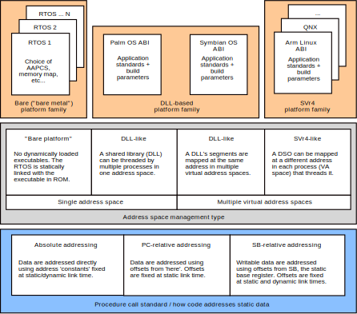
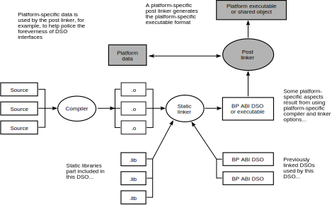
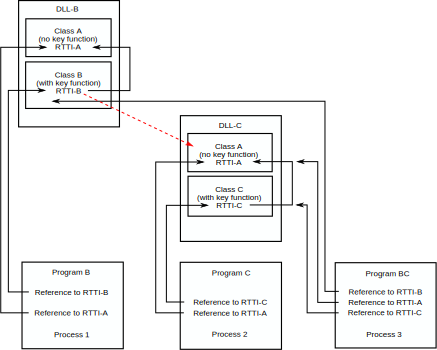
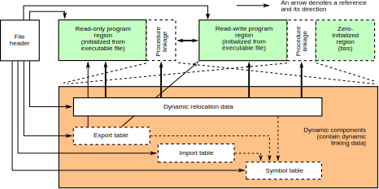
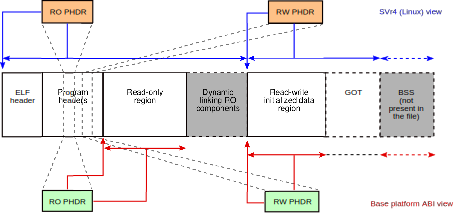
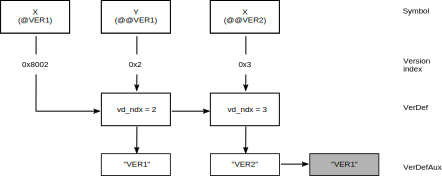

..
   Copyright (c) 2005, 2007, 2008, 2012, 2018, 2021-2023, Arm Limited and its affiliates.  All rights reserved.
   CC-BY-SA-4.0 AND Apache-Patent-License
   See LICENSE file for details

.. |release| replace:: 2023Q1
.. |date-of-issue| replace:: 06\ :sup:`th` April 2023
.. |copyright-date| replace:: 2005, 2007, 2008, 2012, 2018, 2021-2023
.. |footer| replace:: Copyright © |copyright-date|, Arm Limited and its
                      affiliates. All rights reserved.

.. |gcppabi-link| replace:: https://itanium-cxx-abi.github.io/cxx-abi/abi.html
.. |gelf-link| replace:: http://www.sco.com/developers/gabi/2001-04-24/contents.html
.. |lsb-elf-link| replace:: https://refspecs.linuxfoundation.org/LSB_4.0.0/LSB-Core-generic/LSB-Core-generic/elf-generic.html
.. |lsb-abinote-link| replace:: https://refspecs.linuxfoundation.org/LSB_2.0.1/LSB-Core/LSB-Core/noteabitag.html

.. _AAELF32: https://github.com/ARM-software/abi-aa/releases
.. _AAPCS32: https://github.com/ARM-software/abi-aa/releases
.. _BPABI32: https://github.com/ARM-software/abi-aa/releases
.. _BSABI32: https://github.com/ARM-software/abi-aa/releases
.. _CPPABI32: https://github.com/ARM-software/abi-aa/releases
.. _RTABI32: https://github.com/ARM-software/abi-aa/releases
.. _ELF: http://www.sco.com/developers/gabi/2001-04-24/contents.html
.. _GCPPABI: https://itanium-cxx-abi.github.io/cxx-abi/abi.html
.. _ABInote: https://refspecs.linuxfoundation.org/LSB_2.0.1/LSB-Core/LSB-Core/noteabitag.html

*******************************************
Base Platform ABI for the Arm® Architecture
*******************************************

.. class:: version

|release|

.. class:: issued

Date of Issue: |date-of-issue|

.. class:: logo

.. image:: Arm_logo_blue_RGB.svg
   :scale: 30%

.. section-numbering::

.. raw:: pdf

   PageBreak oneColumn

Preamble
========

Abstract
--------

This document describes the Base Platform Application Binary Interface for
the Arm architecture. This is the base standard for the interface between
executable files (including dynamic shared objects, DLLs, etc) and the
systems that execute them.

Keywords
--------

Executable file format and contents, dynamic shared object (DSO), dynamic
link library (DLL), executable file loading, dynamic linking.

Latest release and defects report
---------------------------------

Please check `Application Binary Interface for the Arm® Architecture
<https://github.com/ARM-software/abi-aa>`_ for the latest
release of this document.

Please report defects in this specification to the `issue tracker page
on GitHub
<https://github.com/ARM-software/abi-aa/issues>`_.

.. raw:: pdf

   PageBreak

Licence
-------

This work is licensed under the Creative Commons
Attribution-ShareAlike 4.0 International License. To view a copy of
this license, visit http://creativecommons.org/licenses/by-sa/4.0/ or
send a letter to Creative Commons, PO Box 1866, Mountain View, CA
94042, USA.

Grant of Patent License. Subject to the terms and conditions of this
license (both the Public License and this Patent License), each
Licensor hereby grants to You a perpetual, worldwide, non-exclusive,
no-charge, royalty-free, irrevocable (except as stated in this
section) patent license to make, have made, use, offer to sell, sell,
import, and otherwise transfer the Licensed Material, where such
license applies only to those patent claims licensable by such
Licensor that are necessarily infringed by their contribution(s) alone
or by combination of their contribution(s) with the Licensed Material
to which such contribution(s) was submitted. If You institute patent
litigation against any entity (including a cross-claim or counterclaim
in a lawsuit) alleging that the Licensed Material or a contribution
incorporated within the Licensed Material constitutes direct or
contributory patent infringement, then any licenses granted to You
under this license for that Licensed Material shall terminate as of
the date such litigation is filed.

About the license
-----------------

As identified more fully in the Licence_ section, this project
is licensed under CC-BY-SA-4.0 along with an additional patent
license.  The language in the additional patent license is largely
identical to that in Apache-2.0 (specifically, Section 3 of Apache-2.0
as reflected at https://www.apache.org/licenses/LICENSE-2.0) with two
exceptions.

First, several changes were made related to the defined terms so as to
reflect the fact that such defined terms need to align with the
terminology in CC-BY-SA-4.0 rather than Apache-2.0 (e.g., changing
“Work” to “Licensed Material”).

Second, the defensive termination clause was changed such that the
scope of defensive termination applies to “any licenses granted to
You” (rather than “any patent licenses granted to You”).  This change
is intended to help maintain a healthy ecosystem by providing
additional protection to the community against patent litigation
claims.

Contributions
-------------

Contributions to this project are licensed under an inbound=outbound
model such that any such contributions are licensed by the contributor
under the same terms as those in the `Licence`_ section.

Trademark notice
----------------

The text of and illustrations in this document are licensed by Arm
under a Creative Commons Attribution–Share Alike 4.0 International
license ("CC-BY-SA-4.0”), with an additional clause on patents.
The Arm trademarks featured here are registered trademarks or
trademarks of Arm Limited (or its subsidiaries) in the US and/or
elsewhere. All rights reserved. Please visit
https://www.arm.com/company/policies/trademarks for more information
about Arm’s trademarks.

Copyright
---------

Copyright (c) |copyright-date|, Arm Limited and its affiliates.  All rights
reserved.

.. raw:: pdf

   PageBreak

.. contents::
   :depth: 3

.. raw:: pdf

   PageBreak

About This Document
===================

Change control
--------------

Current status and anticipated changes
^^^^^^^^^^^^^^^^^^^^^^^^^^^^^^^^^^^^^^

The following support level definitions are used by the Arm ABI specifications:

**Release**
   Arm considers this specification to have enough implementations, which have
   received sufficient testing, to verify that it is correct. The details of these
   criteria are dependent on the scale and complexity of the change over previous
   versions: small, simple changes might only require one implementation, but more
   complex changes require multiple independent implementations, which have been
   rigorously tested for cross-compatibility. Arm anticipates that future changes
   to this specification will be limited to typographical corrections,
   clarifications and compatible extensions.

**Beta**
   Arm considers this specification to be complete, but existing
   implementations do not meet the requirements for confidence in its release
   quality. Arm may need to make incompatible changes if issues emerge from its
   implementation.

**Alpha**
   The content of this specification is a draft, and Arm considers the
   likelihood of future incompatible changes to be significant.

All content in this document is at the **Release** quality level.

Change history
^^^^^^^^^^^^^^

If there is no entry in the change history table for a release, there are no
changes to the content of the document for that release.

.. class:: bpabi32-change-history

.. table::

  +-------+-------------------------------------+----------------------------------------------------------------------------+
  | Issue | Date                                | Change                                                                     |
  +=======+=====================================+============================================================================+
  | 2.0   | 24\ :superscript:`th` March 2005    | First public release.                                                      |
  +-------+-------------------------------------+----------------------------------------------------------------------------+
  | A     | 25\ :superscript:`th` October 2007  | Document renumbered (formerly GENC-005700 v2.0).                           |
  +-------+-------------------------------------+----------------------------------------------------------------------------+
  | B     | 10\ :superscript:`th` October 2008  | Changed depth-first to the intended breadth-first in                       |
  |       |                                     | `Obligations on static linkers generating pre-emption maps`_; made a minor |
  |       |                                     | correction to the dllimport example at the end of `The DLL model and       |
  |       |                                     | indirect addressing of imported entities`_.                                |
  +-------+-------------------------------------+----------------------------------------------------------------------------+
  | C     | 30\ :superscript:`th` November 2012 | `Adding export and import tables (if required)`_: Clarify STB_WEAK         |
  |       |                                     | definitions are treated as equivalent to STB_GLOBAL when generating a      |
  |       |                                     | Windows-style export table.                                                |
  |       |                                     | `Post linking for DLL-like linkage`_: Give more details on export rules.   |
  +-------+-------------------------------------+----------------------------------------------------------------------------+
  | 2018Q4| 21\ :sup:`st` December 2018         | Minor typographical fixes, updated links.                                  |
  +-------+-------------------------------------+----------------------------------------------------------------------------+
  | 2021Q1| 12\ :sup:`th` April 2021            | - document released on Github                                              |
  |       |                                     | - new Licence_: CC-BY-SA-4.0                                               |
  |       |                                     | - new sections on Contributions_,                                          |
  |       |                                     |   `Trademark notice`_, and Copyright_                                      |
  +-------+-------------------------------------+----------------------------------------------------------------------------+

References
----------

This document refers to, or is referred to by, the following documents.

.. class:: bpabi32-refs

.. table::

  +--------------+--------------------------+-------------------------------------------------------------------------+
  | Ref          | URL or other reference   | Title                                                                   |
  +==============+==========================+=========================================================================+
  | AAELF32_     |                          | ELF for the Arm Architecture                                            |
  +--------------+--------------------------+-------------------------------------------------------------------------+
  | AAPCS32_     |                          | Procedure Call Standard for the Arm Architecture                        |
  +--------------+--------------------------+-------------------------------------------------------------------------+
  | BSABI32_     |                          | ABI for the Arm Architecture (base standard)                            |
  +--------------+--------------------------+-------------------------------------------------------------------------+
  | CPPABI32_    |                          | C++ ABI for the Arm Architecture                                        |
  +--------------+--------------------------+-------------------------------------------------------------------------+
  | RTABI32_     |                          | Run-time ABI for the Arm Architecture                                   |
  +--------------+--------------------------+-------------------------------------------------------------------------+
  | BPABI32_     | *This document*          | Base Platform ABI for the Arm Architecture                              |
  +--------------+--------------------------+-------------------------------------------------------------------------+
  | GCPPABI_     | |gcppabi-link|           | Itanium C++ ABI ($Revision: 1.71 $)                                     |
  |              |                          | (Although called *Itanium C++ ABI*, it is very generic).                |
  +--------------+--------------------------+-------------------------------------------------------------------------+
  | ELF_         | |gelf-link|              | Generic ELF, 17th December 2003 draft.                                  |
  |              |                          |                                                                         |
  |              | |lsb-elf-link|           |                                                                         |
  +--------------+--------------------------+-------------------------------------------------------------------------+
  | ABInote_     | |lsb-abinote-link|       | Linux Standard Base Specification 2.0.1, Chapter 9. ABI note tag        |
  +--------------+--------------------------+-------------------------------------------------------------------------+

Terms and abbreviations
-----------------------

The ABI for the Arm Architecture uses the following terms and abbreviations.

AAPCS
   Procedure Call Standard for the Arm Architecture

ABI
   Application Binary Interface:

   1. The specifications to which an executable must conform in order to
      execute in a specific execution environment. For example, the
      Linux ABI for the Arm Architecture.

   2. A particular aspect of the specifications to which independently
      produced relocatable files must conform in order to be statically
      linkable and executable.  For example, the C++ ABI for the Arm
      Architecture, the Run-time ABI for the Arm Architecture, the C
      Library ABI for the Arm Architecture.

AEABI
   (Embedded) ABI for the Arm architecture (this ABI...)

Arm-based
   ... based on the Arm architecture ...

core registers
   The general purpose registers visible in the Arm architecture’s
   programmer’s model, typically r0-r12, SP, LR, PC, and CPSR.

EABI
   An ABI suited to the needs of embedded, and deeply embedded (sometimes
   called free standing), applications.

Q-o-I
   Quality of Implementation – a quality, behavior, functionality, or
   mechanism not required by this standard, but which might be provided
   by systems conforming to it. Q-o-I is often used to describe the
   toolchain-specific means by which a standard requirement is met.

VFP
   The Arm architecture’s Floating Point architecture and instruction
   set. In this ABI, this abbreviation includes all floating point
   variants regardless of whether or not vector (V) mode is supported.

Acknowledgements
----------------

This specification has been developed with the active support of the
following organizations. In alphabetical order: Arm, CodeSourcery, Intel,
Metrowerks, Montavista, Nexus Electronics, PalmSource, Symbian, Texas
Instruments, and Wind River.

.. raw:: pdf

   PageBreak

Introduction and Rationale
==========================

The role of this standard in the ABI for the Arm Architecture
-------------------------------------------------------------

This Base Platform ABI standardizes the interface between executable files
(including dynamic shared objects, dynamic link libraries, and the like) and
their execution environments (or platforms). The Base Platform ABI completes
version 2.0 of the ABI for the Arm Architecture (base standard) by setting
standards for tools producing executable files usable in a wide range of
execution environments.

The ABI for the Arm Architecture [BSABI32_] defines four broad families of
execution environment categorized by how they manage the address space and
how they handle dynamically loaded binaries. This is summarized pictorially
in the central area of the figure below.

.. _Execution environment traits determining the structure of the Base Platform ABI:

.. rubric:: Execution environment traits determining the structure of the
            Base Platform ABI

The three platform categories that support dynamically loaded shared
libraries use two fundamentally different shared library models. Two
categories share some aspects of the Windows dynamic link library (DLL)
model while one uses the Linux-like dynamic shared object (DSO) model. This
is summarized in the upper area of the diagram above.

Relationship to v1.0 of the ABI for the Arm Architecture
^^^^^^^^^^^^^^^^^^^^^^^^^^^^^^^^^^^^^^^^^^^^^^^^^^^^^^^^

Version 1.0 of the ABI for the Arm Architecture (base standard) governs the
interface between producers of relocatable files and static linking. It
guarantees little about the form or utility of any executable file
produced. Some aspects of target execution environments show through
version 1.0 in the procedure call standard [AAPCS32_] and the run-time ABI
[RTABI32_] because they affect code generation and, hence, the interface to
relocatable code. However, version 1.0 does not regulate the interface to
those execution environments.

Underpinning the variations between platform families are three
fundamentally different ways to address static data, depicted in the lower
region of [`Execution environment traits determining the structure of the
Base Platform ABI`_] as procedure call standard or build option variants.
In fact there is a further dimension to this variation not depicted there
that doubles the number of ways to address imported static data (discussed
in `Making sense of ABI-supported addressing modes`_).

Base platform categories
------------------------

We categorize execution environments according to how they organize the
address space and whether they can dynamically load shared objects. We then
define a parameterized standard that works across the categories.

In order of increasing conceptual complexity the four platform categories
are:

* Single address space, no dynamic shared objects (often known as “bare
  metal” or the “bare platform”).

  Typically, a program is committed to read-only memory (or FLASH memory).
  Loading and dynamic linking are performed off line before creating a ROM
  image. If there is an operating system (often termed an RTOS,
  micro-kernel or nano-kernel) it is statically linked into the ROM image.
  An RTOS may, nonetheless, be able to load executable files.

* Single address space with DLL-like shared objects (example: Palm OS).

  The OS and some applications are committed to read-only memory, but other
  modules can be loaded dynamically into RAM. At the user level, loadable
  modules provide functionality similar to that of Windows DLLs and
  executable files. The system and all its applications exist in a single
  virtual address space.

* Multiple address spaces with Windows-like organization and DLL-like
  shared objects (example: Symbian OS).

  A DLL can be shared among several processes, each of which has its own
  virtual address space. A segment of a DLL is mapped at the same virtual
  address in each process that maps it. DLLs behave similarly (but not
  identically) to Windows DLLs.

* Multiple address spaces with SVr4-like organization and SVr4-like DSOs
  (example: Arm Linux).

  A DSO can be shared among several processes, each of which has its own
  virtual address space. A segment of a DSO can be mapped at a different
  virtual address in each process that maps it.

(:strong:`Aside`: DSOs, DLLs, and executable files structure systems at the
highest level. Shared objects are useful for structuring large systems for
bare platforms if dynamic linking and loading operations can be performed
off line – in effect in a second phase of static linking. Some bare
platforms may also be able to load executable files dynamically.
:strong:`End aside`).

The base platform ABI tool flow
-------------------------------

This base platform ABI sets a standard for executable and shared object
files – in effect, a standard for the toolchains that produce them. This
ABI is based on the tool flow depicted below.

A simple post-linker (see `Simple post linking`_ for our definition of
simple) converts a BPABI-conforming executable or shared object file into a
platform-specific format. The post linker is simple enough to be supplied by
a platform vendor.

A conversion done this way can easily be built into a static linker, at low
cost. We expect that tool vendors serious about a specific platform will do
this.

Either way, the cost supporting a specific platform ABI derived from this
base platform ABI (under the simple post-linking constraint) will be
moderate.

.. _Base platform ABI tool flow and its relationship to concrete platforms:

.. rubric:: Base platform ABI tool flow and its relationship to concrete
            platforms

Platform-specific elements are shown grayed. Others are generic to all ABIs
derived from this base platform ABI.

Simple post linking
^^^^^^^^^^^^^^^^^^^

A BPABI post linker is a simple tool compared to a static linker. Some
bounds on its complexity are:

* Post linking must be at least as complex as navigating a generic (ELF)
  executable file (or similar).

  (This mirrors the structural complexity of utilities such as the ADS/RVCT
  fromelf, the SUN/Solaris elfdump, the Linux objdump, and the Windows
  dumpbin).

* In general, post linking should not be more complex than the most general
  form of dynamic linking (platform specific aspects can increase the
  complexity arbitrarily, but ABI-specific aspects do not).

  (Among the concrete platforms under consideration, Linux has the most
  complex behavior when an executable or shared object file is loaded and
  linked dynamically. For platforms that do less dynamically, the post
  linker must perform some of these dynamic linking tasks off line. There
  is no more to do to prepare an executable file for execution than SVr4
  does dynamically).

Making sense of ABI-supported addressing modes
----------------------------------------------

Basic concepts and terminology
^^^^^^^^^^^^^^^^^^^^^^^^^^^^^^

Own data
~~~~~~~~

Programming languages such as C and C++ typically recognize three
fundamentally different classes of data.

* Local, automatic, or stack data (terminology varies) are usually
  allocated to registers or the run-time stack. If any datum is in memory
  and needs to be addressed it is addressed SP-relative (or, depending on
  the language and compiler, frame pointer-relative). These data are of no
  further concern to this specification.

* Dynamically allocated data are created with malloc or new (or whatever
  the language supports) and thereafter addressed indirectly via pointers
  that may themselves be local, dynamically allocated, or static. These
  data are of no further concern to this specification.

* Own, static, or extern data (terminology varies) are statically allocated
  to memory. The allocation is done partly at compile time and partly at
  static link time. It does not change during the execution of the program.
  We shall use the term own data to encompass C/C++ static, function-local
  static, and extern data that the compiler does not allocate to a
  register.  (Advanced compilers can sometimes allocate C/C++ static data
  to registers).

The rest of this section about ABI-supported addressing modes is about
addressing own data and functions.

Static, extern, imported, and exported
~~~~~~~~~~~~~~~~~~~~~~~~~~~~~~~~~~~~~~

Among own data, languages and execution environments distinguish between
static, extern, imported, and exported. These categories are not entirely
independent, and the meaning of imported and exported depends on the
execution environment.

* Static data are local to a compilation unit (or to a function within a
  compilation unit). A (2-pass) compiler can always see the definition of a
  static datum.

* Extern data are visible between compilation units. In general, one
  compilation unit defines a datum and others refer to it. In general, a
  reference to an extern datum cannot be bound until static link time (or
  later). The compiler making the reference cannot know where the data will
  be allocated.

* Some extern data definitions and some function definitions may be
  exported. That is, they may be visible to, and referenced from, another
  static link unit (another executable, DLL, DSO, or shared library).

* Some extern references may be imported. That is, they refer to
  definitions from another static link unit

Import affects addressing because the location of an imported entity is
unknown to the static linker. In some cases, a compiler must generate
different code to address imported entities (`ABI supported indirect
addressing`_).

Import and export can be explicitly described (as is typical in DLL-based
environments) or implicit, implied by extern, (as, by default, in SVr4-based
environments).

Explicit export and import are usually mutually exclusive. Nevertheless, an
exported entity may need to be treated as if it were imported into the
exporting link unit. See `Absolute addressing and SVr4 (Linux) application
code`_ and `Dynamic resolution of vague linkage`_ for justification.

Shared libraries and applications
~~~~~~~~~~~~~~~~~~~~~~~~~~~~~~~~~

At its simplest, a program consists of some application code written by a
user, statically linked with some library code provided with the development
tools and/or the execution environment. In this model a program might
interact with the execution environment in a limited way – for example by
executing trap instructions or calling OS entry points at fixed addresses –
but it is essentially self sufficient.

A more sophisticated model makes some or all of the library code into
dynamically loadable binaries (shared libraries), and the application code
into an application binary or executable.

Each executable and shared library file is built from some translation
units. Some extern references between translation units which in the simple,
single-binary program model were resolved statically can no longer be fixed
by the static linker. A dynamic linking phase is needed before the program
starts executing, to resolve those references.

Note that this model can still be used to construct a standalone (self
sufficient) program by performing the dynamic linking off line (in effect in
a second, later phase of static linking). This is necessary to create the
ROM image of a system that can dynamically load components but that carries
some of them in ROM.

Comparing the DSO and DLL library models
~~~~~~~~~~~~~~~~~~~~~~~~~~~~~~~~~~~~~~~~

The SVr4 model attempts to maintain precisely the same environment for
application relocatable objects whether they are linked statically with
their libraries or dynamically with DSOs containing library code. By
default, all extern entities are imported and exported unless the producing
toolchain is told otherwise (by Q-o-I means). In general, programmers do
not need to be aware of import and export issues.

In contrast, DLL models usually make import and export explicit and
partition the set of extern entities into imported references, exported
definitions, and hidden definitions (local to the DLL or application, but
not local to a translation unit). Depending on the design of the execution
environment, a programmer might need to be aware of import and export.

ABI supported direct addressing modes
^^^^^^^^^^^^^^^^^^^^^^^^^^^^^^^^^^^^^

Absolute addressing
~~~~~~~~~~~~~~~~~~~

The simplest way to address an extern entity is absolutely, via an address
constant. For example:

+------------------+--------------------------------+
| .. code:: c      | .. code:: asm                  |
|                  |                                |
|    extern int X; |        LDR   r0, LX       ; &X |
|    int f(void)   |        LDR   r0, [r0, #0] ; X  |
|    {             |        BX    lr                |
|      return X;   |     LX DCD   X                 |
|    }             |                                |
+------------------+--------------------------------+

The address constant at LX points to the extern entity X. It is given its
value by a static linker. The address constant itself is addressed
PC-relative but a compiler will ensure that it is generated close enough to
the load.

(If we wanted to be pedantic we might describe this as short PC-relative
RO-indirect).

In general, this is the most efficient form of static data addressing
supported by the Arm architecture, but there are difficulties with it.

* If X is imported rather than extern – so the address constant cannot be
  relocated at static link time – this mode of addressing will require the
  read-only segment to be relocated on being loaded.

* If several processes map the same instance of this code, each process
  must allocate its copy of X at the same address (because they all share
  the same pointer to X at LX).

Note that absolute references work uniformly for both writable data and
read-only data.

Absolute addressing and SVr4 (Linux) application code
~~~~~~~~~~~~~~~~~~~~~~~~~~~~~~~~~~~~~~~~~~~~~~~~~~~~~

SVr4 application code uses absolute addressing and a trick to avoid the need
to relocate the RO segment.

When an application is linked against a shared library that defines a datum
used by the application (X, say), the linker allocates space for X in the
application’s zero-initialized (dot-bss) memory and resolves the
application’s references to extern X to the application’s definition of X.
It then subjects this definition to a dynamic, copy relocation. At dynamic
link time, the value of X will be copied from the DSO that defined it into
the application, and the DSO’s reference to X will be linked to the
application’s definition (the DSO’s definition will be pre-empted).

From the perspective of a DSO, an exported datum (X) must be addressed as if
it were imported, because if a definition is provided by an application,
that is exactly what will happen.

Absolute addressing, Windows-like (Symbian OS) code, and standalone code
~~~~~~~~~~~~~~~~~~~~~~~~~~~~~~~~~~~~~~~~~~~~~~~~~~~~~~~~~~~~~~~~~~~~~~~~

Windows-like DLL models – in particular, Symbian OS – use absolute
addressing in both applications and DLLs (but see also `How DLLs and their
applications address imported data`_).

Absolute addressing is the preferred choice for standalone (RTOS-based)
applications.

SB-relative addressing (Palm OS-like)
~~~~~~~~~~~~~~~~~~~~~~~~~~~~~~~~~~~~~

SB-relative addressing supports shared libraries in a single address space.
The simple version of it is structurally similar to absolute addressing.
The writable static data associated with a shared library is addressed
using an offset from a dedicated static base register (see [AAPCS32_]). For
example:

+------------------+----------------------------------+
| .. code:: c      | .. code:: asm                    |
|                  |                                  |
|    extern int X; |       LDR   r0,LX      ; &X - SB |
|    int f(void)   |       ADD   r0,r0,sb   ; &X      |
|    {             |       LDR   r0,[r0,#0] ; X       |
|      return X;   |       BX    lr                   |
|    }             |   LX  DCDO  X                    |
+------------------+----------------------------------+

Here, the offset of X from SB is loaded short PC-relative from the literal
pool. The offset of data defined by the application or shared library can be
fixed at static link time, though, in general, it needs to be re-based when
the executable file is first loaded.

References to imported data can be handled the same way if the operating
system preserves the invariant that the offset of a library’s static data
from SB is the same in every process that threads the library. This is
effectively the same constraint that Windows DLLs have, but on the offsets
of data from SB rather than on the addresses of data.

More complex versions of SB-relative addressing are possible that formulate
an offset from SB in a sequence of instructions. For example, for offsets
smaller than 20 bits, the above code could be re-written as:

+------------------+------------------------------------------+
| .. code:: c      | .. code:: asm                            |
|                  |                                          |
|    extern int X; |                                          |
|    int f(void)   |       ADD   r0, sb, #:SB_OFFSET_19_12: X |
|    {             |       LDR   r0, [r0, #:SB_OFFSET_11_0: X |
|      return X;   |       BX    lr                           |
|    }             |                                          |
+------------------+------------------------------------------+

However, this complicates relocation of the read-only segment at load time.
In general, systems prefer to use only simple dynamic relocations (for
example, relocations of 32-bit data locations).

An offset from SB implicitly addresses a writable location and it will need
to be relocated dynamically if it is used to address a read-only place.
(Recall, the DLL model gives independently chosen base addresses to the
read-only and read-write segments of the executable file). In practice that
encourages references to be made as follows.

.. rubric:: Inter-segment addressing in DLLs using SB-relative addressing

.. class:: bpabi32-interseg-table

.. table::

   +------------+---------------------------------------------------------+------------------------------------------+
   | **From**   | **Read-only**                                           | **Read-write**                           |
   |            |                                                         |                                          |
   | To         |                                                         |                                          |
   +------------+---------------------------------------------------------+------------------------------------------+
   | Read-only  | PC-relative (`PC-relative addressing (SVr4 DSOs)`_)     | Absolute (`Absolute addressing`_)        |
   |            | or Absolute                                             |                                          |
   +------------+---------------------------------------------------------+------------------------------------------+
   | Read-write | SB-relative (this section)                              | Absolute                                 |
   +------------+---------------------------------------------------------+------------------------------------------+

Of course, the absolute addresses here require dynamic relocation.

PC-relative addressing (SVr4 DSOs)
~~~~~~~~~~~~~~~~~~~~~~~~~~~~~~~~~~

An SVr4 (Linux) DSO can be mapped at a different virtual address in each
process that uses it. Writable data is at a fixed offset from the code (a
DSO has only one independent base address) so it can be addressed relative
to the current place. For example:

+------------------+---------------------------------------+
| .. code:: c      | .. code:: asm                         |
|                  |                                       |
|    static int X; |       LDR   r0, LX     ; &X – (P + 8) |
|    int f(void)   |    P  ADD   r0,pc,r0   ; &X           |
|    {             |       LDR   r0,[r0,#0] ; X            |
|      return X;   |       BX    lr                        |
|    }             |    LX DCD   |X + (LX – P - 8) - .|    |
+------------------+---------------------------------------+

In general, an imported datum X will be at a different address in each
process, and it can be at a different relative address (see `Own data
addressing by SVr4 (Linux) DSOs and applications`_), so there is no
sharable offset to it. Because of this, each potentially imported datum
must be addressed PC-relative indirect, via a writable location that can be
relocated when the DSO is loaded.

The SVr4 ABI calls the set of such locations the Global Offset Table (GOT),
and we call this addressing style GOT-relative.

As we noted above, every extern datum defined by a DSO is also potentially
imported  because of potential pre-emption at dynamic link time.

ABI supported indirect addressing
^^^^^^^^^^^^^^^^^^^^^^^^^^^^^^^^^

The indirect addressing modes use one of the direct addressing modes to
address a pointer that can be initialized at dynamic link time. The effect
is as if the code on the left had been written as the code on the right:

+---------------------------+-------------------------------+
| .. code:: c               | .. code:: c                   |
|                           |                               |
|    extern Thing theThing; |    extern Thing theThing;     |
|    // ...                 |    Thing* pThing = &theThing; |
|    // ...                 |    // ...                     |
|    Thing t = theThing;    |    Thing T = *pThing;         |
+---------------------------+-------------------------------+

Whatever the primary addressing mode, the indirection is always absolute via
an address (using an offset would always be less efficient at run time and
would eliminate no dynamic relocations).

Own data addressing by SVr4 (Linux) DSOs and applications
~~~~~~~~~~~~~~~~~~~~~~~~~~~~~~~~~~~~~~~~~~~~~~~~~~~~~~~~~

As noted above, use of PC-relative indirect (SVr4 GOT-relative) addressing
modes follows from two choices.

* An SVr4 DSO has a single base address (its RW segment is at an offset
  from its RO segment that was fixed when the DSO was statically linked).

* An SVr4 DSO can be loaded at a different virtual address in each process
  that loads it.

So although there is an invariant offset from any place in the RO segment to
own data that is not imported, there is no invariant offset to any imported
data.

As noted earlier, SVr4 does not make export and import explicit, and chooses
that application code should be oblivious to whether it is linked statically
or dynamically to its library code. These decisions make all extern data
used by a DSO potentially imported and, therefore, to be addressed
PC-relative indirect.

For SVr4, we can make some clear statements independent of further
considerations.

* Application code addresses its own data absolutely and calls non-imported
  functions PC-relative.

* Application code calls imported functions via a procedure linkage stub
  generated by the static linker.

 (An imported function is simply one not defined by the application).

* A DSO addresses static and restricted visibility data PC-relative and
  extern data PC-relative indirect.

* A DSO calls static functions PC-relative and extern functions via a
  procedure linkage stub generated by the static linker. The stub calls
  indirectly through a writable function pointer (the PLTGOT entry).

How DLLs and their corresponding applications address not-imported data
~~~~~~~~~~~~~~~~~~~~~~~~~~~~~~~~~~~~~~~~~~~~~~~~~~~~~~~~~~~~~~~~~~~~~~~

The DLL model preserves the invariant that each process threading an
instance of a DLL’s RO segment maps its RW segment at the same virtual
address (or the same offset from SB if there is only one address space). If
this cannot be maintained when another process P threads the DLL, P must
load a new instance of the RO segment.

A significant difference between a DLL and an application that uses it is
that when there are multiple virtual address spaces, the execution addresses
of the segments of an application can be known at static link time, whereas
a DLL (and a single address space application) might need to be relocated
dynamically.

* Multiple address space DLLs and application code address local own data
  absolutely.

  Address constants embedded in a DLL’s RO segment must be relocated when
  the segment is first loaded.

* Single address space DLLs and application code address local own data
  SB-relative.

  The offsets from SB embedded in a DLL’s RO segment must be relocated when
  the segment is first loaded.

* DLL and application code calls DLL-local functions PC-relative.

.. note::

  To avoid relocating the RO segment of a single address space application
  on first loading, some offset from SB must be reserved to applications –
  analogous to reserving fixed base addresses for multiple VA applications.

How DLLs and their applications address imported data
~~~~~~~~~~~~~~~~~~~~~~~~~~~~~~~~~~~~~~~~~~~~~~~~~~~~~

The DLL model per se – whether deployed in a single address space Palm
OS-style, or multiple address spaces in the style of Symbian OS or Windows –
neither requires nor forbids indirect addressing of imported data. Three
factors influence a platform’s choice.

* The management of multiple processes (an OS consideration).

* Whether or not a DLL loaded into RAM can patch a collection of DLLs in ROM
  (a platform consideration).

* Whether or not the system can resolve vague linkage at dynamic link time.

Imported data and the management of multiple processes
~~~~~~~~~~~~~~~~~~~~~~~~~~~~~~~~~~~~~~~~~~~~~~~~~~~~~~

Depending on how the operating system manages the address space of a
process, it might be possible for process P1 to have mapped DLL-1’s RW
segment at A1, and for process P2 to be unable to map it there. P2 will
subsequently create a copy of DLL-1’s RO segment and map a copy of the data
of DLL-1 at A2.

Now consider the case that P1 and P2 both load DLL-2 that imports X from
DLL-1.

If X is addressed directly via a (dynamically relocated) literal L in the
read-only segment, L must be relocated to two different values, A1 and A2
(which is impossible).

There are three ways a DLL-based OS can deal with this problem.

* It can ensure that a DLL’s address space slots are reserved in all
  (future) processes. This enforces the data address invariant globally and
  ensures that there is only one copy of the RO segment of a DLL in the
  system.

* It can accept that when more than one instance of a DLL has been created,
  separate instances of all referring DLLs must be created.

* It can insist that imported data be addressed indirectly (as MS Windows
  does), allowing one instance of DLL2 to refer via its P1 and P2 data
  instances to P1’s DLL-1 or P2’s DLL-1.

Real DLL-based systems employ a combination of these strategies. For
example, Symbian OS currently uses the first two, but not the third, while
Palm OS currently uses the first and third, but not the second.

Imported entity addressing and ROM patching
~~~~~~~~~~~~~~~~~~~~~~~~~~~~~~~~~~~~~~~~~~~

Suppose that DLL-2 imports a function F and data X from DLL-1, and suppose
that both DLLs have been committed to ROM. Now suppose that DLL-1 must be
patched by loading a new version into Flash or RAM.

For this to be effective, DLL-2 must be made to refer to the new version of
DLL-1 without changing any part of DLL-2. This can only be done if the
linkage between DLL-2 and DLL-1 is via writable RAM locations. In effect all
imported entities must be addressed indirectly via RAM.

An SVr4 DSO already does this. Every extern entity with normal visibility is
addressed via a (writable) GOT entry. Even a procedure linkage stub (PLT
entry) must do this (via its PLTGOT entry).

A DLL might be required do this, or it might not (`How DLLs and their
applications address imported data`_). However, to support being patched, a
DLL too must address imported entities indirectly.

Because the DLL model does not import and export extern entities by default,
indirect addressing forces import of data to be made explicit at translation
time (because different code must be generated to access imported data), or
it restricts import to import by address (effectively making the indirection
explicit in the source code).

(Aside: The effect on the import of functions is less visible because a
procedure linkage stub is usually generated by the linker. As far as a
compiler is concerned, every extern function is potentially imported. If a
linkage stub must be hand written it is also easy to arrange that import is
by address initializing a writable location – in effect, the PLTGOT model.
End aside).

Dynamic resolution of vague linkage
~~~~~~~~~~~~~~~~~~~~~~~~~~~~~~~~~~~

RTTI, v-tables, and other entities generated by translating C++ pose a
potential problem because, in general, there is no unique locus of
definition. For example, if a class has no key function, RTTI and v-tables
must be generated everywhere they are used (according the C++ ABI for the
Arm Architecture [CPPABI32_], which, in this respect, follows the Generic
C++ ABI for Itanium [GCPPABI_]). These entities have vague linkage.

After translation, each such definition is wrapped in GRP_COMDAT section
group. A static linker retains only one copy, but a dynamic linker can
encounter multiple definitions, one from each shared object. This is
harmless if:

* All participants in the dynamic link step end up using the same
  definition of each entity.

* Or, the implementation of the One Definition Rule (ODR) does not require
  a unique address for each entity.

To guarantee a unique address, an entity with vague linkage must be treated
as both exported by, and imported into, each executable file that defines
it. Each defining file must be able to defer to (be preempted by) another’s
definition at dynamic link time.

The problem of resolving dynamic vague linkage is depicted in Figure 3,
below. The illustrative scenario is based on C++ run-time type information
(RTTI). It arises naturally and frequently in programs written in C++ but
the problem is by no means restricted to programs written in C++, or to
RTTI.

* DLL-B contains the definitions relevant to class B (which has a key
  function) and class A (which does not).

* DLL-C similarly contain class C's definitions (and, again, class C has a
  key function), and class A's.

Both DLL-B and DLL-C export RTTI for class A. In a relocatable file, RTTI
for class A is emitted into a COMDAT group, and in a static link step
involving classes B and C, only one copy of the RTTI for class A would be
retained.

There are three possible use cases for DLL-B and DLL-C in relation to
RTTI-A.

Process 1
   Link program B (that uses classes A, B) with DLL-B.

Process 2
   Link program C (that uses classes A, C) with DLL-C.

Process 3
   Link program BC (that uses classes A, B, C) with DLL-B and DLL-C.

Processes 1, 2, and 3 can execute simultaneously as depicted below.

.. rubric:: The dynamic vague linkage problem

The One Definition Rule (ODR) for process 3 requires that all users of the
RTTI-A should use the same copy of it. In the static link step generating
program BC, the linker knows that references to RTTI-A must resolve to
DLL-C::RTTI-A, say. (It could choose DLL-B::RTTI-A, but the argument is
symmetrical).

Now there is a problem in process 1. References to RTTI-A from DLL-B must
resolve to DLL-B::RTTI-A (process 1 does not load DLL-C so resolution to
DLL-C::RTTI-A is impossible). Unless the reference is private to the
process, it must point to two different places in two different processes
(the dashed red pointer from DLL-B to DLL-C::RTTI-A in process 3, and the
solid black pointer from DLL-B to DLL-B::RTTI-A in process 1).

If we want to resolve vague linkage dynamically, we must address imported
data indirectly via private-to-the-process locations.

The DLL model and indirect addressing of imported entities
~~~~~~~~~~~~~~~~~~~~~~~~~~~~~~~~~~~~~~~~~~~~~~~~~~~~~~~~~~

Under the DLL model, indirect addressing goes hand in hand with explicit
data import. If imported data must be addressed indirectly, a compiler must
know what is imported so that it can compile an extra indirection into the
access code. A pseudo storage class like ``__declspec(dllimport)`` is often
used to tell a compiler that an extern datum is imported.

Alternatively, and equivalently, import must be limited to import by address
used to initialize a writable pointer.

The following examples illustrate these points.

.. code-block:: c

   extern Thing* pThing;                 // (*pThing) can always be imported because pThing
                                         // is a writable pointer initialized by an address
   extern Thing theThing;                // theThing cannot be imported if imported data
                                         // must be addressed indirectly
   __declspec(dllimport) extern Thing T; // T is imported, and will be addressed
                                         // indirectly if this is required

In general, imported functions do not need to be identified to a compiler. A
reference to an imported function will be made via a procedure linkage stub
created by a linker, so a compiler can generate the same code for an
imported call as for an extern call. Under this ABI – and especially in
Thumb state – it is not generally beneficial to inline linkage stubs.

Summary of ABI addressing modes
^^^^^^^^^^^^^^^^^^^^^^^^^^^^^^^

The following tables list the addressing modes used by the execution
environments serving as exemplars for the platform categories encompassed by
this ABI.

.. rubric:: Not imported (e.g. static) own data

.. table::

   +--------+------------------------------------------+--------------------------------+
   |        | Single address space                     | Multiple virtual address space |
   |        +----------------+-------------------------+----------------+---------------+
   | Ref to | Bare platform  | Palm OS DLL             | Symbian OS DLL | Arm Linux DSO |
   +========+================+=========================+================+===============+
   | RW     | Absolute       | SB-relative             | Absolute       | PC-relative   |
   +--------+----------------+-------------------------+----------------+---------------+
   | RO     | Absolute       | PC-relative or Absolute | Absolute       | PC-relative   |
   +--------+----------------+-------------------------+----------------+---------------+

.. rubric:: Imported data referred to by not patchable executable files

.. table::

   +--------+-----------------------------------------+----------------------------------------------+
   |        | Single address space                    | Multiple virtual address space               |
   |        +---------------+-------------------------+----------------+-----------------------------+
   | Ref to | Bare platform | Palm OS DLL             | Symbian OS DLL | Arm Linux application       |
   +========+===============+=========================+================+=============================+
   | RW     | Absolute      | SB-relative             | Absolute       | Absolute                    |
   |        |               |                         |                | (copy relocated, patchable) |
   |        |               | *(non-standard)*        |                |                             |
   +--------+---------------+-------------------------+----------------+                             |
   | RO     | Absolute      | Absolute or PC-relative | Absolute       |                             |
   |        |               |                         |                |                             |
   |        |               | *(non-standard)*        |                |                             |
   +--------+---------------+-------------------------+----------------+-----------------------------+

.. rubric:: Imported own data referred to by patchable executable files

.. table::

   +----------+---------------------------------------------------------+------------------------------------------+
   |          | Single address space                                    | Multiple virtual address space           |
   |          +----------------------------------+----------------------+-------------------+----------------------+
   | Ref to   | Bare platform with DLL structure | Palm OS              | Symbian OS DLL    | Arm Linux DSO        |
   +==========+==================================+======================+===================+======================+
   | RO or RW | Absolute indirect                | SB-relative indirect | Absolute indirect | PC-relative indirect |
   |          |                                  |                      |                   |                      |
   |          | *(non-standard)*                 |                      | *(non-standard)*  |                      |
   +----------+----------------------------------+----------------------+-------------------+----------------------+

Implications of the one definition rule for execution environments
^^^^^^^^^^^^^^^^^^^^^^^^^^^^^^^^^^^^^^^^^^^^^^^^^^^^^^^^^^^^^^^^^^

C and C++ require that each data object and each function in a program has a
single definition. This is the One Definition Rule (ODR). The ODR guarantees
to a programmer that each addressable object and function defined in the
source program has a unique address.

A static linker usually enforces the ODR by faulting multiple definitions of
the same symbol, or by discarding all but one definition. This section
examines the effect of the ODR on DLL and DSO dynamic linkage.

SVr4 and the ODR
~~~~~~~~~~~~~~~~

SVr4 application code need not be aware of whether it will be linked
statically or dynamically with the libraries it uses. In effect, the dynamic
linker must maintain the ODR the same way a static linker does for entities
local to an executable file.

It is easy to specify the treatment of data and clear that a dynamic linker
can easily enforce the ODR for data.

* A data definition exported by an application pre-empts an identically
  named definition by a DSO. Consequently:

  * Application code can always use an absolute address for an imported or
    exported datum.

    (It is as if the imported datum is defined by the application).

  * DSO code must always address imported/exported data PC-relative
    indirect.

It is harder to specify the treatment of functions.

* All code must address imported functions PC-relative indirect (via the
  [PLT]GOT).

* DSO code formulating the address of an extern function can simply load
  the corresponding [PLT]GOT entry. The dynamic linker looks after its
  value.

Application code can address an extern function F directly. If F turns out
to be imported, the only possible resolution of F at static link time is to
the PLT entry for F, generating two ugly alternatives.

* The read-only segment of the application can be dynamically relocated.

  This is considered by SVr4 systems to be highly undesirable (in any
  system in which applications might be shared between processes there is a
  serious cost to the loss of sharing).

* The dynamic linker can pre-empt the definition of F with the
  application’s PLT entry for F.

  This is the standard Linux solution, but there are problems with it.

  * Calls through a function pointer initialized to F must now indirect
    through a PLT entry.

  * To avoid calling via two PLT entries, the dynamic linker must ensure
    that a PLTGOT entry for F points directly to F, not to the
    application’s PLT entry, and in any DSO that both calls F and takes
    F’s address there must be a separate GOT entry for F that points to
    the application’s PLT entry.

All calls to F (whether direct or indirect) traverse exactly one PLT entry.

Alternatively, application code could take the address of a function using
absolute indirect (GOT-relative) addressing (reducing import to import by
address initializing a writable location).

Of the two alternatives, the second is cleaner and has higher performance,
and taking the address of a function other than to initialize an own-data
function pointer is so rare that there is no issue with the extra GOT entry.

DLLs and the ODR
~~~~~~~~~~~~~~~~

The DLL model presents essentially the same difficulties as the SVr4 model,
but with some variations according to the taste of the target platform.

* It is routine to relocate read-only segments on first loading.

  So, in the absence of resolving vague linkage dynamically, a DLL can take
  the address of an exported entity or an imported entity as if it were
  local to the DLL, and obtain the same address as any other observer.

* Usually, import and export are expressed explicitly rather than being by
  default for all extern entities.

  So, if imported entities must be addressed indirectly, a compiler can
  always know exactly to formulate the address of an extern entity (for
  example, absolute-indirect if imported, absolute otherwise).

Under the usual explicit import and export model, preservation of the ODR
would follow from the discipline that only one DLL, or the application, may
define (export) an entity, and all others must refer to (import) it.

As we discussed in `Dynamic resolution of vague linkage`_, this is not possible for
entities with vague linkage. They have multiple definitions from which a
dynamic linker must choose one to impose program wide.

SVr4-based systems solve the resulting dynamic linking problem
straightforwardly because the dynamic linker looks up symbol names while
relocating an executable file. Pre-emption follows naturally from the way
the symbol table for a process is constructed.

In general, a DLL-based system must perform the required symbol table
juggling at static link time when the application that will generate a
process is created. This is the only point at which all the DLLs to be
linked into the process are known and symbol tables are still available. By
dynamic link time, otherwise global symbol names will have been translated
into DLL-local ordinal numbers, and no process-wide symbol table will be
built by the loader.

So, dynamic vague linkage must be resolved when an application is created,
and recorded in the resulting BPABI executable file in a form that
post-linkers can translate into platform-specific dynamic relocation
directives. This observation motivates the specification given in
`Encoding symbol pre-emption in BPABI executable files`_.

Relating executables and shared objects to executable files
-----------------------------------------------------------

Terminology
^^^^^^^^^^^

[ELF_] already gives precise definitions to the words segment and section.
Section is not relevant to the executable view of an ELF file, so it is not
available for more general usage here. We use (program) segment with its
strict ELF meaning to denote a contiguous part of an executable file read by
a loader or dynamic linker. Where segment explicitly or implicitly has type
PT_LOAD, it refers a contiguous part of an executable file loaded into
memory to initialize an executable image.

We also need a word to describe part of an executable image loaded into
virtual memory. We use the word region, familiar to users of Arm development
tools. An (execution) region contains the minimum needed to support
execution of the program on a bare platform.  A (program) segment usually
contains one (execution) region. On some platforms it also contains other
platform-specific data associated with loading or dynamic linking.

Finally, we need a term for part of an executable file that serves a
distinct, coherent purpose. We use the word component. A segment is also a
component. So is the content of a region when it is stored in an executable
file. On some platforms there are components that are not part of any region
or segment. Clearly, a component can have sub-components.

Logical content of an executable file
^^^^^^^^^^^^^^^^^^^^^^^^^^^^^^^^^^^^^

The figure below depicts a typical set of components present in an
executable file. Not all components are present in all platform-specific
formats, and the encoding of dynamic linking data varies greatly between
platforms. (The dynamic components shown in the figure are a mélange of DLL
and SVr4 components).

.. rubric:: Components of a typical executable file and the relationships between them

Other than bare execution environments that do not load executable files
dynamically, the platforms of immediate interest to this ABI base their
executable file models directly or loosely on the SVr4 executable file model
or the Windows DLL/executable file model.

Salient features of SVr4 executable files
~~~~~~~~~~~~~~~~~~~~~~~~~~~~~~~~~~~~~~~~~

An SVr4 executable file has a dynamic symbol table to which dynamic
relocations refer. Imports and exports are neither segregated nor tabulated
separately from the symbol table.

A procedure linkage table (PLT) – usually in the RO segment – implements
inter-file procedure linkage via function addresses stored in a subsection
of the global object table (GOT) called the PLTGOT. The GOT is in the RW
segment. It contains addresses of global data and functions. It is
initialized during dynamic linking. In effect, the GOT is the import table,
although it also contains exported addresses and some addresses internal to
the DSO (depending on the details of how global symbol visibility was
controlled, if at all).

The RO segment includes RO regions from the dynamic components. The RW
segment includes all RW regions.

All file components required for dynamic linking and execution are included
in one of the (two) loaded segments.

Salient features of Windows executable files
~~~~~~~~~~~~~~~~~~~~~~~~~~~~~~~~~~~~~~~~~~~~

A Windows executable file has no dynamic symbol table as such. Imports and
exports are separately tabulated and symbolic linkage information is
(optionally) attached to the export table and the import table.

The RO segment usually includes all sharable, RO components. The RW segment
includes all RW regions.

All file components required for dynamic linking and execution are included
in one of the (two) loaded segments.

Executable file structure, static linking, and post linking
^^^^^^^^^^^^^^^^^^^^^^^^^^^^^^^^^^^^^^^^^^^^^^^^^^^^^^^^^^^

Linker and post linker roles
~~~~~~~~~~~~~~~~~~~~~~~~~~~~

This base platform ABI defines a clear division of responsibility for static
linking between:

* A generic static linker of relatively high functionality and complexity.

* A platform-specific post linker of low complexity and relatively low
  functionality.

This division of responsibility is possible because we can find standards
that work across the platforms and executable file models of interest to
this ABI for at least the following.

* Required executable file components.

* Name binding during linking.

The primary role of a generic static linker is to create:

* The RO and RW execution regions.

* Maximally symbolic (least bound to target platform) dynamic components.

Although conforming static linkers are generic to all execution environments
derived from this base platform ABI, and can generate the same file
components in the same order independent of the target platform, some
target-specific attributes must be built into an executable file during the
static linking step. Some parameters and steering commands given to a
generic static linker must, inevitably, be specific to the target platform.

(Aside: This ABI only loosely constrains the order of components in an
executable file. ELF gives considerable freedom to place content in almost
any order [other than the ELF header, which must be first]. End aside).

A post linker creates a platform-specific executable file if the generic
linker does not do so directly. A post linker is specific to a target
platform.

* It may not alter the RO or RW regions other than as described by dynamic
  relocations (which it may process).

* It may extend execution regions at their ends only, and then only if a
  suitable address-space gap exists, or can be created, between the
  regions.

Executable file structure
~~~~~~~~~~~~~~~~~~~~~~~~~

We observed in `Simple post linking`_ that of the concrete platforms
this standard attempts to encompass, Linux has the most symbolic executable
file format.

[`SVr4 and base platform views of the same executable file components`_],
below, depicts an SVr4 view and a BPABI view of the most important
components of an executable file.

* Both views start with a fixed size header (shown as the ELF header) from
  which other sub-components of the file can be found.

* Both views contain a read-only executable segment followed by a
  read-write data segment.

In the SVr4 view, the RO segment contains in some order (the order is
conventional rather than essential):

* The ELF file header.

* Directories of contents (shown as an array of ELF program headers) that
  describe each component of the file, both in the file and in virtual
  memory.

* The read-only region of the program (the essence of what a generic static
  linker producers).

* The shareable dynamic linking components (dynamic linking RO components).

In the BPABI view of the same components the RO segment contains only the RO
execution region.

In the SVr4 view, the read-write component contains:

* The initialized read-write data region (the essence of what a generic
  static linker produces).

* Process-specific dynamic linking components (for Linux, at least the
  GOT).

In the BPABI view of the same components the RW segment contains only the RW
execution region.

.. _SVr4 and base platform views of the same executable file components:

.. rubric:: SVr4 and base platform views of the same executable file components

In the execution environments abstracted by this ABI, the read-write
directory entry (RW program header) also describes the zero-initialized (ZI
or bss) execution region. It must immediately follow the initialized RW
region in virtual memory. This precludes extension of the RW region by a
post linker unless all references from RO and RW to ZI are exposed via
dynamic relocations.

Because an SVr4 DSO executable region must address its RW and ZI regions
pc-relative, a Linux executable is both rigid and compact in virtual memory.
This precludes extension of the RO segment by a post linker unless all
references from the RO region to RW and ZI are exposed via dynamic
relocations.

Interpretation of addresses in SVr4 executable files
~~~~~~~~~~~~~~~~~~~~~~~~~~~~~~~~~~~~~~~~~~~~~~~~~~~~

Virtual addresses are used to locate all structures in an SVr4 executable
file.

A SVr4 executable file is rigid and compact. It is designed to be mapped
into virtual memory, as described by its two PT_LOAD-type program headers,
and processed after mapping. There is one base address for the executable
file. If the file is a DSO, the base address is unknown to the static linker
and assumed by it to be 0.

All dynamic linkage data are included in one or other of the loadable
segments.

Because of the minimum granularity at which access to virtual memory (VM)
can be controlled (often 4, 8, or 64KB), there can be a gap in VM between a
file’s loadable segments. Most SVr4 systems do not represent the gap
explicitly in the executable file (it would be filled with zeroes).
Consequently, an offset from the base address in VM is not the same as an
offset in the file (but the PT_LOAD-type program headers describe how to
convert between memory offsets and file offsets).

A Dynamic Array address value is the address in virtual memory after mapping
at the assumed base address.

Interpretation of addresses in BPABI executable files
~~~~~~~~~~~~~~~~~~~~~~~~~~~~~~~~~~~~~~~~~~~~~~~~~~~~~

Virtual addresses are used to locate structures in the loadable segments of
an executable file. File offsets are used to locate structures (such as
dynamic linkage data) that are not part of any loadable segment.

A base platform executable file has two (or more) loadable segments and
separate dynamic linkage data. It is designed to be post processed to
produce a file that can be loaded, linked dynamically, and executed.

An address value that refers to a location in one of the loadable segments
is the virtual address of the location after loading the segment into memory
at its given base address. The two PT_LOAD-type program segment headers
describe how to translate such virtual addresses to file offsets.

For the convenience of post linkers, an address that refers to dynamic
linkage data is the offset in the executable file of that data. A post
linker may later translate this to an address in memory.

Consequently, some Dynamic Array address values are addresses in virtual
memory after mapping at the segment base addresses and some are file
offsets.

Base platform static linking and post linking
---------------------------------------------

This section gives an overview of the division of responsibility between
generic static linking and post linking for the specific platform operating
systems of greatest influence on this standard.

Arm Linux and similar
^^^^^^^^^^^^^^^^^^^^^

We expect that there will be no post linking to do.

If post linking were used, its only purpose would be to generate the GOT
from extended dynamic relocations. This functionality can be more
conveniently integrated into, and provided as an option by, a static linker
that otherwise targets the base platform ABI.

In summary, when given appropriate steering options, a generic static linker
must generate the following.

* The file components and an ELF view of them similar to that depicted in
  blue in the upper half of [`SVr4 and base platform views of the same
  executable file components`_].

* PLT (and other intra-call veneer) entries, position independent if the
  executable file is a DSO.

* All GOT entries (only these would be created by post linking if a post
  linker were used).

* Dynamic relocations (as defined by [AAELF32_]), a full dynamic symbol
  table, and symbol version data.

Symbian OS and Palm OS DLLs
^^^^^^^^^^^^^^^^^^^^^^^^^^^

Generic static linker
~~~~~~~~~~~~~~~~~~~~~

Appropriate steering options must be specified to the generic static linker.
That linker must generate:

* The same file components as for an SVr4 executable file, and an ELF view
  of them, describing the RO region and the RW + ZI region, similar to that
  depicted in red in the lower half of [`SVr4 and base platform views of
  the same executable file components`_].

* Appropriate procedure linkage veneers ([not] PI, and direct, or
  PLTGOT-indirect, as specified by linker option).

* An extended set of dynamic relocations, a full dynamic symbol table, and
  symbol version data.

The type of the procedure linkage veneers depends on the target platform.

* If a DLL is to be ROM-resident and its imported references are to be
  patchable, or the target system wishes to resolve vague linkage
  dynamically, the static linker must generate procedure linkage veneers
  that are relocated by GOT-generating relocation directives.

  (Aside: Imported data references must be relocated by GOT-generating
  relocation directives, but this must have been done by the compiler
  because different code must be generated to address imported data
  indirectly. End aside).

* Otherwise, the generic static linker should generate procedure linkage
  veneers that are relocated directly with respect to their imported
  symbols.

  (Aside: References to imported data are then no different to references
  to extern data. End aside).

Platform-specific post linker
~~~~~~~~~~~~~~~~~~~~~~~~~~~~~

The platform-specific post linker is responsible for:

* Translating symbolic references to ordinal-based (or other
  platform-specific) references, and ensuring the integrity and long-term
  validity of this translation.

* Adding an export table and, if required, import tables.

* Translating ELF relocation directives into the platform-specific
  relocation format.

* Reformatting the executable file and discarding symbolic components
  unused by the platform.

Translating symbolic references to ordinals (or similar)
~~~~~~~~~~~~~~~~~~~~~~~~~~~~~~~~~~~~~~~~~~~~~~~~~~~~~~~~

Somewhere the post linker must maintain a map must between symbols and
their platform-specific equivalents (as depicted in [`Base platform ABI
tool flow and its relationship to concrete platforms`_]).

For Windows, the equivalent of a symbol is the ordinal number of its entry
in a DLL’s export table, and this map has, traditionally, been maintained in
dot-def files, one per DLL.

It is logically equivalent to store this data in a section, with OS- or
processor-specific type ([ELF_] chapter 4, Sections) in the executable file
itself, or to hold it in a database specific to the platform.

If no corresponding map exists when a DLL is first post linked, the post
linker must create one.

The post linker must ensure consistency between the map and the symbol table
of the generic executable. For example, once an entry point has been
numbered, it cannot, in general, be renumbered.

Adding export and import tables (if required)
~~~~~~~~~~~~~~~~~~~~~~~~~~~~~~~~~~~~~~~~~~~~~

A Windows-style export table can be generated by post-processing the dynamic
symbol table. All defined STB_GLOBAL symbols whose visibility is not
restricted by STV_HIDDEN should be exported. STB_WEAK is treated as
equivalent to STB_GLOBAL for this purpose.

Windows-style import tables can be generated by processing the dynamic
relocation section. Each [PLT]GOT-generating directive generates an import
table entry for the corresponding symbol. The symbol’s version data contains
the identity of the DLL the symbol is being imported from.

A single pass through the dynamic relocations can collate the import data by
DLL. It is then necessary to process each referenced DLL’s map entries (for
example, its dot-def file) to convert each imported symbol into an ordinal
(its index in its import address table) or similar.

Translating ELF relocation directives to platform-specific form
~~~~~~~~~~~~~~~~~~~~~~~~~~~~~~~~~~~~~~~~~~~~~~~~~~~~~~~~~~~~~~~

A 32-bit-ELF relocation directive uses 8 bits to denote the relocation type,
32 bits to denote the place being relocated, and 24 bits to select a 16-byte
symbol with respect to which the relocation is performed (which then points
to a string value, the name of the symbol).

Many space-saving optimizations are possible because, in general, only
32-bit places can be relocated dynamically. Three example schemes are listed
below, in increasing order of sophistication.

* If a naive indirect import table is used, no optimization is necessary –
  the corresponding export table is simply copied during dynamic linking.
  Such an import table can be placed at the end of the ZI region.

* Entries in an indirect import table can be initialized to the indexes
  (ordinals) of the entries in the corresponding export table. Such an
  import table must be placed at the end of the RW region, and, In turn,
  this requires all references to ZI to be relocated (as the ZI data will
  have been displaced).

* If no import table is used dynamically, a relocation table can list the
  places in this DLL to be patched by the dynamic loader. The list can be
  compressed by, for example, storing only the difference between
  consecutive offsets. Each place can be initialized to, for example, the
  index in X’s export table of the required address value. The compact list
  of places can be placed after the shared (RO) segment.

Reformatting the executable file
~~~~~~~~~~~~~~~~~~~~~~~~~~~~~~~~

A post linker must do the following.

* Create a platform-specific file header and directory structure.

* Copy the RO region, and add generated RO components such as the export
  table and direct import tables. In general, there will be gap in the
  virtual address space between the RO and RW segments, allowing the former
  to be extended at its end without needing to relocate the latter.

* Copy the RW region, and add generated RW components such as initialized,
  indirect import tables.

* Relocate references to ZI data by the amount it extended the RW region.
  This can be done by processing the dynamic relocation directives.

  (Aside: In the RWPI procedure call standard variant [AAPCS32_] – used by
  Palm OS – this requires a static linker option to retain appropriate
  static relocation directives in the dynamic relocation section. End
  aside).

* Adjust the ZI description and append any ZI import tables to it.

.. raw:: pdf

   PageBreak

The Base Platform ABI Specification
===================================

Scope and terminology
---------------------

The subject matter of this specification is the following.

* The common, cross platform, static linker functionality needed to make
  executable and shared object files for a wide variety of specific
  platforms.

* A common, cross platform, file format from which simpler
  platform-specific formats can be derived using simple post-linking
  (discussed in `Simple post linking`_).

This specification is a necessarily compromise between maximizing the
utility of Base Platform executable files, and minimizing the burden on
their producers and consumers.

For a discussion of our use of the words segment, section, region, and
component, please see `Terminology`_.

Executable file format
----------------------

The carrier file format is ELF with type ET_EXEC (for application executable
files) and ET_DYN (for DSO/DLL executable files).

For information about ELF see [ELF_]. Chapter 5 gives details relating to
program loading and dynamic linking referred to in the following
subsections of this section. Chapter 4 gives general details of ELF and its
linking view. ELF for the Arm Architecture [AAELF32_] specifies the
processor-specific values used by Arm.

Only the executable (program segment) view features in this ABI.

A platform executable or dynamic shared object (DSO, DLL, or shared library)
file contains two loadable segments (described by ELF program headers of
type PT_LOAD).

* A read-only segment contains executable code and read-only data. Its
  program header describes the segment as readable and executable (PF_R +
  PF_X set).

* A read-write segment contains initialized data and data initialized to
  zero by the execution environment. Its program header describes the
  segment as readable and writable (PF_R + PF_W set).

An executable file (of ELF type ET_EXEC) that cannot be loaded dynamically
(for example, that might execute from ROM) may contain any number of
executable segments described by ELF program headers of type PT_LOAD.

No read-write segment shall contain executable code.

Each segment shall be contiguous in the address space and in the ELF file.

Other ELF segment headers (of type PT_DYNAMIC, PT_INTERP, PT_PHDR, etc) may
be present or required by the target platform. These describe components of
the executable file of interest to loaders and dynamic linkers. In general
these segments are not separately loadable.

* Under the SVr4 ABI, the corresponding file components are included in the
  loadable segments and the program headers serve only as directory entries
  to locate them in virtual memory.

* Under this base platform ABI, the corresponding file components are not
  included in any loadable segment. Their program headers serve as
  directory entries to locate them in the executable file.

[`SVr4 and base platform views of the same executable file components`_]
shows how a static linker can describe the same file components in two
different ways.

ELF header
^^^^^^^^^^

The ELF file header shall be mapped by a program header of type PT_PHDR. The
ELF file header shall be the first component of the executable file at file
offset 0.

Segment base addresses and alignments are target-specific. How they are
specified to a static linker is Q-o-I.

Loadable segments must be at least 8-byte aligned in order to preserve
alignment guarantees assumed by compilers complying with the [AAPCS32_].

The dynamic segment and its related sections
^^^^^^^^^^^^^^^^^^^^^^^^^^^^^^^^^^^^^^^^^^^^

The dynamic section shall be described by a program header of type
PT_DYNAMIC.

`Interpretation of addresses in SVr4 executable files`_ and `Interpretation
of addresses in BPABI executable files`_ explain the term address,
mentioned repeatedly in sub-sections of this section.

The dynamic section
~~~~~~~~~~~~~~~~~~~

The dynamic section contains an array of <key, value> pairs that describe
structures of interest to a dynamic linker. ([ELF_], Chapter 5, sub-section
Dynamic Section. Table 5-10, Dynamic Array Tags, lists mandatory entries).

The key in a <key, value> pair is an integer identifying the purpose of the
pair. ELF-defined keys have symbolic names beginning ``DT_``.
Processor-specific keys defined by Arm have symbolic names beginning
``DT_ARM_``.

The value in a <key, value> pair may be an address or a number such as a
count or size.

All other sections related to dynamic linking shall be locatable from the
dynamic section.

* In an SVr4-style executable file these sections and the dynamic section
  itself are included in one of the two loadable segments, and addresses
  must be interpreted as described in `Interpretation of addresses in SVr4
  executable files`_.

* In a BPABI executable file these sections are excluded from the two
  loadable segments, and addresses must be interpreted as described in
  `Interpretation of addresses in BPABI executable files`_.

The dynamic section locates the dynamic symbol table, the hash table and the
dynamic relocation sections.

Dynamic symbol table
~~~~~~~~~~~~~~~~~~~~

The dynamic symbol table is an ELF symbol table with the following
restrictions.

* It includes copies of just those symbols relevant to dynamic linking
  (those with STB_GLOBAL binding, and any STB_LOCAL symbols cited by a
  dynamic relocation [described below]).

* The st_value field of each symbol is the presumed target address set by
  the static linker (the linker must assume some target address, even if
  the executable’s loadable segments will be dynamically relocated).

The dynamic symbol table is located by the DT_SYMTAB entry in the dynamic
section.

No standard ELF dynamic section entry directly gives the size of the symbol
table, but its size is the same as that of the hash table [described in the
next sub-section] located by the DT_HASH entry.

In a BPABI executable file, the Arm-specific tag DT_ARM_SYMTABSZ gives the
number of entries.

Hash table
~~~~~~~~~~

The hash table is located by the DT_HASH entry in the dynamic array. It has
a bucket and chain organization, with one chain entry for each entry in the
dynamic symbol table.

The size of the dynamic symbol table is, therefore, given by the hash
table’s nchain field. In a BPABI executable file, the value of the
Arm-specific tag DT_ARM_SYMTABSZ is also nchain.

Dynamic relocation section(s)
~~~~~~~~~~~~~~~~~~~~~~~~~~~~~

The dynamic section of an executable file (`The dynamic section`_)
can independently describe two relocation sections, one containing
relocations to be performed when a file is first loaded into a process, and
one containing procedure linkage relocations that can be performed lazily,
if the execution environment has that capability.

In spite of this, it appears that the original intent of the SVr4 ABI
([ELF_]) was that the lazy procedure linkage relocations should be in a
subsection of the relocation section. Indeed, some ports of SVr4 appear to
rely on the lazy relocations being a subsection at the end of the relocation
section.

This ABI strongly recommends that:

* Producers should produce a single, homogeneous (all REL-type or all
  RELA-type), consolidated dynamic relocation section, with procedure
  linkage (typically PLTGOT) relocations collated after all others. This
  procedure linkage subsection should be described as overlapping the
  relocation section.

* Consumers should defensively analyze the descriptions given in the
  dynamic section and be prepared to work with disjoint or arbitrarily
  overlapping subsections, and with subsections that have different
  REL/RELA-types.

The dynamic relocation section is described by one of the following triples
of <key, value> pairs, depending of whether REL-type or all RELA-type
relocations are being used.

+-----------------+----------------------+-------------------------+
| DT_REL address  | DT_RELSZ table-size  | DT_RELENT element-size  |
+-----------------+----------------------+-------------------------+
| DT_RELA address | DT_RELASZ table-size | DT_RELAENT element-size |
+-----------------+----------------------+-------------------------+

<Key, value> pairs may occur in any order in the dynamic array.

A (dynamic) relocation directive identifies a place to be relocated via the
address given in its r_offset field, and the index of a symbol in the
dynamic symbol table via its r_info field.

Relocation sections in an SVr4 executable file shall only use dynamic
relocations (as defined in [AAELF32_]).

Because it will be processed off line by a post linker, a relocation section
in a BPABI executable file may use any valid relocation (and, in general,
may need to use [PLT]GOT-generating relocations).

A subsection at the end of the relocation section should contain the
relocations relating to procedure linkage (typically PLTGOT relocations). A
platform ABI may specify its position in the relocation section, and it may
be processed lazily by a dynamic linker. In a BPABI executable file this
subsection is very important to post linkers.

The procedure linkage subsection must be described by the following triple
of <key, value> pairs.

+-------------------+------------------------+--------------------------------------+
| DT_JMPREL address | DT_PLTRELSZ table-size | DT_PLTREL type (= DT_REL or DT_RELA) |
+-------------------+------------------------+--------------------------------------+

In the format strongly recommended by this ABI, address + table-size gives
the same end point for both the relocation section and the procedure linkage
subsection.

Shared object (DLL) name
~~~~~~~~~~~~~~~~~~~~~~~~

The dynamic section entry keyed by DT_SONAME gives the offset in the dynamic
string table of the name of a shared object (SVr4 DSO or BPABI DLL). These
names are cited by DT_NEEDED entries in other executable files.

A shared object name is required for shared object executable files (ELF
type ET_DYN) that might be post-processed by a platform-specific post
linker.

The value of the shared object name is platform-specific. Generic static
linkers must provide an option (Q-o-I) to set it. If not set by this Q-o-I
means, a static linker must default the name to the basename of the file
name. For example, if the filename is \somewhere\MyDLL.dll, the default
shared object name should be MyDLL.dll.

Symbol binding and versioning
-----------------------------

Overview of common static linking models
^^^^^^^^^^^^^^^^^^^^^^^^^^^^^^^^^^^^^^^^

Each executable or shared object file is generated by a static linking step
in which a collection of relocatable files – including, perhaps, some
extracted from static libraries – are linked to form the executable file.

In place of linking against a static library, you may instead link against a
previously linked executable file.

* Under Linux you can link against a previously linked dynamic shared
  object (DSO).

* Under Windows you can link against an import library corresponding to a
  previously linked DLL.

Historically, a Windows import library contained the import data sections
and linkage stubs – PLT entries in SVr4-terminology – matching the export
data section generated when the DLL was created. It was a real library of
relocatable object files. Today these are called long format import
libraries, and, in contrast, short format import libraries contain only a
few bits of information about each exported symbol, its name, and the name
of the DLL exporting it. A linker can construct import data tables from this
summary, a synopsis of the data in the DLL it corresponds to, but it could
just as easily be extracted directly from the exporting DLL, SVr4 style.

The advantage of a long format import library is that its use requires no
additional inbuilt linker functionality. It can be generated independently
of the linker, using simple tools (e.g. using an assembler), and then the
link step that generates a DLL is then no different to any other link step.
This tool flow also inherently solves the problem of creating two DLLs that
refer to one another. One of them need to be linked first, but in the modern
flow neither can be! In the old flow, an import library for one of the DLLs
can be manufactured before the DLL is linked.

The SVr4 DSO-creating tool flow is structurally similar to the Windows
DLL-creating tool flow using short format import libraries.

The relationship between binding and linking
^^^^^^^^^^^^^^^^^^^^^^^^^^^^^^^^^^^^^^^^^^^^

Executable and shared object files can contain references to symbols defined
elsewhere (imported symbols) and can export symbol definitions to be used
elsewhere. Dynamic linking matches the symbols imported by an executable
file to those exported by previously loaded executable files.

Static binding
~~~~~~~~~~~~~~

Under the static binding model, when a static linker creates an executable
or shared object file it knows which DSO/DLL will resolve each imported
symbol at dynamic link time. The binding of references to definitions is
fixed at static link time, even though linking (converting symbolic
references to addresses) is done dynamically.

Static binding is used by:

* SUN Solaris and Linux in the presence of versioned symbols.

* Microsoft Windows, Palm OS , Symbian OS.

Static binding is required to support non-symbolic dynamic linking (such as
DLL linking by ordinal).

Dynamic binding
~~~~~~~~~~~~~~~

Under the dynamic binding model, a static linker cannot know which DSO/DLL
will resolve an imported symbol at dynamic link time. The binding of
references to definitions is delayed until the link is made.

Dynamic binding is used by SUN Solaris and Linux in the absence of versioned
symbols, and by older SVr4-based and other Unix systems.

This ABI requires and supports static binding
~~~~~~~~~~~~~~~~~~~~~~~~~~~~~~~~~~~~~~~~~~~~~

The symbols relevant to this specification are contained in the dynamic
symbol table of an executable file. Conventionally, the dynamic symbol table
is an ELF section of type SHT_DYNSYM and name .dynsym.

Each symbol in the dynamic symbol table that has global binding (STB_GLOBAL)
is either imported or exported. Undefined symbols – defined in the section
with index SHN_UNDEF – are imported. Defined symbols are exported.

Local symbols (with binding STB_LOCAL) can participate in load-time
relocation but play no part in binding.

As required generically by the ELF specification, the static linker must
ensure that symbols that have restricted visibility (STV_HIDDEN, for
example) in relocatable files are removed from the dynamic symbol table, or
converted to dynamic symbols with local binding.

Symbol versioning
^^^^^^^^^^^^^^^^^

This ABI adopts the GNU-extended Solaris symbol versioning mechanism
described in [AAELF32_].

The processing of symbols and versions by complying static linkers
^^^^^^^^^^^^^^^^^^^^^^^^^^^^^^^^^^^^^^^^^^^^^^^^^^^^^^^^^^^^^^^^^^

This section describes how a static linker must process symbols and versions
when creating a base platform executable file, DLL, or DSO from a collection
of relocatable files and previously linked executable file.

Creating version definitions for symbols exported by a shared library (DSO or DLL)
~~~~~~~~~~~~~~~~~~~~~~~~~~~~~~~~~~~~~~~~~~~~~~~~~~~~~~~~~~~~~~~~~~~~~~~~~~~~~~~~~~

Version definitions are created when a shared object executable file (ELF
type ET_DYN) is statically linked. Plain executable files (ELF type ET_EXEC)
do not require version definitions.

The list of version definitions in an executable file conventionally
includes a first element with index 1 and flags VER_FLG_BASE that gives the
version of the shared object rather than the version of any symbol within
it.

A typical Linux value of the base version might be “libm.so.6” whereas the
versions of the symbols defined in this library might be “GLIB_2.0” or
“GLIBC_2.1”.

Version data for symbols exported from this executable file can be provided
in three ways.

* By linker steering file (Q-o-I).

* Using the GNU mechanism to associate versions with symbol definitions.

* By default, perhaps further controlled by linker option, as described in
  `Option to support forced static binding`_.

The essence of the GNU mechanism is that a symbol defined with a particular
version has the textual name ``name@[@]version``.

* The form using ‘``@@``’ denotes a default, or latest, version. There must be
  exactly one such definition of name in a link step, and this defines the
  version seen by subsequent static links against this executable file.

* The form using ‘``@``’ defines a previous version of name. There can be any
  number of previous versions, but these will only be seen during dynamic
  linking. (These symbols will refer to their corresponding versions via
  indexes with bit 15 set).

There is no need to export any other STB_GLOBAL symbol defined at the same
location as an ``@``-containing one.

The export of an STB_GLOBAL symbol from a relocatable file may be restricted
by using the STV_HIDDEN attribute. Hidden symbols are not exported. If they
need to be in the dynamic symbol table because, for example, there are
dynamic relocations that refer to them, their binding must be changed to
STB_LOCAL.

(Aside: In general, the use of STV_HIDDEN requires use of additional build
options and source level mechanism such as ``__ATTRIBUTE__("STV_HIDDEN")``
or ``__declspec(dllexport)`` not specified by this ABI. End aside).

Export may be further restricted, and import further extended, through
commands to the static linker (Q-o-I).

If a symbol X exported by this executable file has a version – that is, its
name is ``X@[@]version``) – the linker must:

* Ensure that version is described by a version definition structure in the
  version definition section.

* Allocate an index in the virtual table of versions to each new version
  definition.

* Set the symbol version section entry corresponding to X to this index of
  version.

Indexes denoting ``X@version`` must have bit 15 set. The index denoting
``X@@version`` must have bit 15 clear.

Creating versions needed for symbols undefined in an executable file
~~~~~~~~~~~~~~~~~~~~~~~~~~~~~~~~~~~~~~~~~~~~~~~~~~~~~~~~~~~~~~~~~~~~

Versions needed are created when an executable file (ELF type ET_EXEC or
ET_DYN) is created in a static link step to which a shared object executable
file (ELF type ET_DYN) with versioned symbols is an input.

A versions needed structure must be created when this link step uses a
previously linked executable file, L say. The versions needed structure
names L (using L’s SONAME) and links to auxiliary structures. Each auxiliary
structure describes the binding of a set of symbols otherwise undefined in
this link step to a corresponding set of symbols defined by L which share a
common version defined by L.

If X is undefined in this link step and an input executable file L exports a
versioned definition of symbol X, the linker must:

* Ensure that this link step’s versions needed section contains a versions
  needed structure associated with the SONAME of L.

  (A needed executable file must also be named by a DT_NEEDED entry in the
  dynamic section. A DT_NEEDED entry names the SONAME of the executable
  file it refers to).

* Ensure that the name of the version associated with X is recorded in a
  version needed auxiliary structure linked to the versions needed
  structure.

* Allocate an index in the virtual table of versions to each new versions
  needed auxiliary structure.

* Set the symbol version section entry corresponding to X to this index of
  version.

If there are multiple versions of X defined, all but one of them will refer
to their versions via indexes with bit 15 set. In effect, all but one of the
definitions of X will be hidden from static binding.

(Aside: In general it is only possible to bind statically to the latest
version of a symbol X exported by an executable file. Any other toolchain
behavior is Q-o-I. If the executable file exporting X is subsequently
updated creating a new version of X and preserving the old version, this
executable will nonetheless be linked dynamically to the old version X. An
attempt to link this executable dynamically to a version of the DSO that
does not export the required version of X will fail. End aside).

Hence, via the symbol version section, each undefined symbol in this link
step simultaneously acquires a required version and an executable file from
which it is being imported.

(Aside: This representation gives an indirect encoding of the information
given by a DLL's import data section, namely where each undefined symbol is
imported from. End aside).

When linking for an SVr4-like platform it is acceptable for a DSO not to
export versioned symbols. In this case the index of the corresponding
version needed is 1, signifying that dynamic binding must be used.

When linking for a DLL-based platform, a static linker must force static
binding as described below.

Option to support forced static binding
~~~~~~~~~~~~~~~~~~~~~~~~~~~~~~~~~~~~~~~

An ABI complying static linker must provide an option to force static
binding.

* In a DLL-creating link step in which some exported symbols have no
  version, a linker must create a default version. The name of that version
  shall be the SONAME of the exporting DLL.

  In the common case that no exported symbol has a version, the linker
  shall create a version definition with index 1 and flags VER_FLG_BASE
  giving a version to the shared object itself, and a clone of it with
  index 2 and flags 0 that shares the same auxiliary structure. Each
  exported symbol definition shall be given version index 2 in the versions
  section.

* Optionally, a linker can create a default version needed for each
  undefined symbol that binds to an imported definition with no version.
  The name of the needed version shall be the SONAME of the shared object
  imported from (that is, the default version name for the symbol’s
  definition).

  This behavior supports creating mutually dependent shared objects, should
  that be required.

A linker should fault non-weak symbols that remain unbound at the end of a
DLL-creating link step. (If binding is static, there can be no STB_GLOBAL
symbol with no version).

Relationships among versions of an exported symbol
~~~~~~~~~~~~~~~~~~~~~~~~~~~~~~~~~~~~~~~~~~~~~~~~~~

For the purpose of binding statically to an executable file, there is one
distinguished (default) version of each exported symbol with a given name.
Among all the exported symbols called X exactly one refers to its version
via an index with bit 15 clear. All others refer to their versions via
indexes with bit 15 set.

For the purpose of dynamically linking executable files, relationships among
versions of a symbol X, say, are immaterial. A dynamic linker must link to
the definition of X whose version matches the needed version.

A Linux DSO represents the historical relationship among versions using
second and subsequent members of the vd_aux list to record older versions,
but this appears to be unused by both static binding and dynamic linking.

This ABI imposes no requirement to represent a version history, shown grayed
in the figure below, in a base platform shared object.

.. rubric:: How two versions of the same symbol are represented in a Linux DSO

Procedure linkage and other intra-call veneers
----------------------------------------------

This section states the requirement on static linkers to generate the
intra-call veneers needed to implement calls between separately loaded
static link units (typically executable files, and DSOs or DLLs).

Calls between sufficiently separated regions within a bare platform
executable generate similar requirements.

The ELF processor supplement [AAELF32_] gives examples of procedure linkage
code sequences, and discusses [PLT]GOT-generating relocation.

Overview and terminology
^^^^^^^^^^^^^^^^^^^^^^^^

In general, an Arm-Thumb call (BL/BLX) instruction cannot reach an arbitrary
destination. The reach of BL is from 2\ :superscript:`22` to
2\ :superscript:`26` bytes, while the address space spans
2\ :superscript:`32` bytes.

An imported destination is certainly at an unknown range, so a long-branch
veneer (with 32-bit span) must be inserted between a call site and an
imported destination.

A veneer may be needed if the instruction set state might change between the
site of a call and its destination. Sometimes this can be accommodated by
changing BL to BLX, but if the branch span is large or there is no BLX
instruction (Arm Architecture V4T), a veneer (also called a PLT entry) will
be required.

In linkage models in which the target address may be different in each
process threading the executable (SVr4 DSO), or the linkage between
ROM-resident executable files must be later patchable (e.g. Palm OS), a
veneer must call indirectly through a run-time writable location private to
the process.

Usually there is one veneer for each distinct destination code symbol,
shared between all callers within the same executable region. In particular,
there is one procedure linkage veneer (PLT entry) for each imported code
symbol shared by all callers from the same executable file.

(Aside: Support for executable files containing larger than 4MB Thumb-1 code
regions is Q-o-I. End aside).

In SVr4-style toolchains there is a clear convention that a static linker
must generate veneers – called procedure linkage table (PLT) entries – on
calls to imported code symbols. The writable location corresponding to an
SVr4 PLT entry is called a PLTGOT entry.

A similar convention of tools for the Arm-Thumb bare platform is that a
static linker must generate whatever veneer is needed between the site of a
call and its destination. The type of veneer required depends on the Arm
architecture version, the branch span, and whether there is a change of
instruction-set state.

The SVr4 convention combined with the Arm-Thumb bare platform convention
strongly suggests that static linkers must generate intra-call veneers
whenever they are needed (`Code generation for intra-call veneers (PLT
entries)`_).

In the SVr4 DSO linkage model the PLTGOT must be an array of equal sized
elements, and there is a hidden relationship between the order of the
entries in it and the order of relocation entries referring to it.

In the Windows DLL linkage model, PLTGOT entries must be collated by DLL
imported from and they are not necessarily contiguous, being potentially
interspersed with other (data) addresses imported from the same DLL.

This ABI deals with the difference between DSO behavior and DLL behavior via
relocation directives. In both cases, a location in the PLT is relocated by
one of a family of GOT-generating relocation directives. A static linker can
choose (Q-o-I):

* To process such directives in a target-specific manner, thereby
  generating a target-specific executable file.

* To leave such directives as dynamic relocations to be processed by a
  target-specific post-linker.

Code generation for intra-call veneers (PLT entries)
^^^^^^^^^^^^^^^^^^^^^^^^^^^^^^^^^^^^^^^^^^^^^^^^^^^^

General remarks
~~~~~~~~~~~~~~~

This ABI does not specify code sequences to be used for intra-call veneers.
Any code sequence that meets the constraints of the ABI and achieves the
required effect may be used. The ELF processor supplement [AAELF32_] gives
some specimen sequences, all of which are usable.

The following are explicitly quality of implementation (Q-o-I) concerns.

* The generation of optimal veneers. (This is a complex, target-specific,
  business).

* The generation of veneers to extend the (usually Thumb-state) BL span
  within a single execution region. (There is no obvious place – such as at
  the end of the region – for a linker to place such veneers).

The following observations might be useful to authors of intra-call veneers.

* Under the Procedure Call Standard for the Arm Architecture [AAPCS32_],
  register ip (r12) is the only scratch register available to a veneer or
  PLT entry.

* Under Arm architecture version 5 and later, an unconditional BL and a BLX
  can be inter-converted (removing the need for a state-changing veneer).

* Under Arm architecture version 5 and later, any kind of load to the pc
  sets the instruction set state to the least significant bit of the loaded
  address (1 → Thumb state, 0 → Arm state).

* Under Arm architecture version 4T, only BX changes the instruction set
  state. In effect, a V4T state-changing veneer must end with ``LDR ip,
  [...]; BX ip``.

* In Thumb state, ``ALIGN 4; BX pc; NOP``, causes entry into Arm state.

* A linker may be required to generate position-independent veneers and/or
  veneers whose read-only sections are free of dynamic relocations (SVr4
  DSO, at least).

* When the platform supports lazy function binding (as Arm Linux does) this
  ABI requires ip to address the corresponding PLTGOT entry at the point
  where the PLT calls through it.

  (The PLT is required to behave as if it ended with ``LDR pc, [ip]``).

PLT relocation
~~~~~~~~~~~~~~

A post linker may need to distinguish PLTGOT-generating relocations from
GOT-generating ones.

If a static linker were generating a relocatable ELF file it would naturally
generate the PLT into its own section (.plt, say), subject to relocations
from a corresponding relocation section (.rel.plt say). No other
GOT-generating relocations can occur in .rel.plt, so that section would
contain all the PLTGOT-generating relocations.

This ABI requires that the GOT-generating relocations of the PLT are emitted
into a contiguous subsection of the dynamic relocation section described by
dynamic tags DT_JMPREL, DT_PLTRELSZ, and DT_PLTREL (see
`Dynamic relocation section(s)`_).

Data linkage and [PLT]GOT generation by complying linkers
---------------------------------------------------------

For a discussion of terminology and an overview of issues please refer to
`Making sense of ABI-supported addressing modes`_, and especially to `ABI
supported indirect addressing`_.

In general, an extra level of indirection via a writable location is
required to address imported data. The writable location corresponding to an
imported symbol X is called the GOT entry for X. If X is a function imported
via a PLT entry, the corresponding writable location is called the PLTGOT
entry for X.

GOT generation is platform-specific, because there is no GOT layout that can
work across platform families. For example, SVr4 and Windows DLL linkage
models disagree about the required collation order of GOT entries.

Under this ABI, GOT entries are generated by a platform-specific post linker
that processes GOT-generating dynamic relocation directives [AAELF32_].

(Aside: Because GOT-generation is the only SVr4-specific post-linking
operation, we expect that most static linkers will offer an option to
generate an SVr4 executable file directly. End aside).

If an ABI-complying executable file is to be post-linked:

* Each GOT-generating static relocation directive must be copied to the
  dynamic relocation section.

* PLT entries must be generated and their associated relocation directives
  emitted into a contiguous subsection of the dynamic relocation section
  (see `Procedure linkage and other intra-call veneers`_). These
  relocation directives will cause a platform-specific post linker to
  generate the PLTGOT when this is required by the platform.

A post linker only generates [PLT]GOT entries from [PLT]GOT-generating
relocation directives.

Encoding symbol pre-emption in BPABI executable files
-----------------------------------------------------

Under the SVr4 ABI, the dynamic linker implements symbol pre-emption using a
form of dynamic binding. The dynamic symbol tables it loads contain all the
information it needs.

Under the base platform ABI [BPABI32_], symbol binding is strictly static
(`Dynamic binding`_), and using the tool flow depicted in [`Base platform
ABI tool flow and its relationship to concrete platforms`_], symbol
pre-emption happens off line. Consequently, pre-emption must be recorded in
a BPABI executable file in a format that a post linker can process and
convert to platform-specific relocation data.

Overview of pre-emption maps
^^^^^^^^^^^^^^^^^^^^^^^^^^^^

If there is to be any pre-emption when a process is created, what to do must
be recorded in the platform executable file generated by the post linker
from the corresponding BPABI executable file.

The details of how symbol pre-emption might be implemented on a particular
platform are beyond the scope of this standard. No platform is required to
implement pre-emption, but conforming linkers must generate the base
platform ABI-defined structures that allow a platform to implement
pre-emption.

This base platform ABI specifies a dynamic segment structure – the
pre-emption map – that conforming static linkers can use to record static
binding pre-emption in a BPABI executable file. Each entry in such a map
records that the definition of some symbol X, say, made by some BPABI DLL
used as an input to the link step was pre-empted by a definition of X made
by the output executable file or by another input DLL.

The ELF processor supplement [AAELF32_] specifies the content
and encoding of pre-emption maps.

Obligations on static linkers generating pre-emption maps
^^^^^^^^^^^^^^^^^^^^^^^^^^^^^^^^^^^^^^^^^^^^^^^^^^^^^^^^^

During a BPABI executable file-generating link step a static linker must
generate pre-emption map entries recording that one definition of X
pre-empts all others whenever it notices that a symbol X is:

* Defined with vague linkage (defined in a GRP_COMDAT section) in a
  relocatable file input to the link step and defined by at least one BPABI
  DLL input to the link step.

* Or, defined by more than one BPABI DLL input to the link step.

The pre-empting definition of a symbol X is the one closest to the root of
the needs graph rooted in the output executable file. All other definitions
of X visible in this link step are pre-empted.

We define closest to the root of the needs graph as follows.

* The root node of the needs graph corresponds to the output executable
  file. The other nodes correspond to the DLLs input to the link step.

* At each node, outgoing directed edges are defined by the DT_NEEDED
  entries in the dynamic section of the corresponding executable file that
  name a DLL in the graph (a DLL used directly in the current link step).
  At each node the order of outgoing edges is the same as the order of the
  corresponding DT_NEEDED entries in their dynamic section.

* The definition closest to the root is the one first encountered in a
  breadth-first traversal of the needs graph in which each node is visited
  at most once.

How a post linker might use a pre-emption map
^^^^^^^^^^^^^^^^^^^^^^^^^^^^^^^^^^^^^^^^^^^^^

This section hints at the obligations a post linker and its associated
platform might have to accept in order to implement symbol pre-emption. It
places no obligations on platforms using this ABI.

When a leaf BPABI DLL (one that depends on no other DLL) is linked,
references to entities with vague linkage must, nonetheless, be relocated as
if they were imported. At this stage there is nowhere to import them from,
so they had better be imported from self. In turn, that requires them to be
exported from self.

At this stage, a post linker might create a platform-specific relocation
directive that causes a derived platform DLL to use its own definitions.

When any other kind of BPABI executable file is created, there can be
pre-emption of a symbol with vague linkage. This is not necessarily the
final pre-emption that will occur when a process is created. For example,
suppose that:

* BPABI DLLs B, C, and application A define X with vague linkage.

* BPABI DLL B is created in a link step that refers (only) to DLL C.

* Application A is created in a link step that refers to DLL B and DLL C is
  not available to this link step.

The BPABI DLL B must record in a pre-emption map entry that B::X pre-empts
C::X.

The post linker must translate this pre-emption map entry to, for example, a
special kind of dynamic relocation that a loader of the platform DLL B will
apply to platform DLL C (or, more plausibly, to its dynamic relocations).

Similarly, the BPABI description of application A must record in a
pre-emption map entry that A::X pre-empts B::X. The post linker must
translate this pre-emption map entry to, for example, special dynamic
relocations that:

* A loader of the platform application A will apply to platform DLL B (or,
  more plausible, to platform DLL B’s relocations, exactly as in the case
  of platform DLL C).

* A loader of the platform application A will apply to platform DLL B’s
  special relocations.

  (Thus changing platform DLL B’s relocation of platform DLL C’s reference
  to X from B::X to A::X).

Obligations on static linkers in support of post linking
--------------------------------------------------------

Static linkers must accept certain obligations to support post linking.
These can be derived by considering the BPABI view of an executable ELF
file (depicted in red in [`SVr4 and base platform views of the same
executable file components`_]) and how a post linker would translate it.

* The loadable program headers (PT_LOAD) in a BPABI executable file must
  describe the bare program RO, RW, and ZI regions excluding the file
  header, directories, and other SVr4-specific dynamic linking structures.

* Nonetheless, a static linker must include all generated linkage veneers
  (PLT entries) in the RO region.

* The base addresses of the program segments must be set to
  platform-specific values by unspecified Q-o-I means (such as linker
  command-line options beyond the scope of this ABI).

* GOT-generating relocation directives may need to be passed to the post
  linker as dynamic relocations.

* The address of a dynamic linking structure not included in any loadable
  segment must be set to its offset in the file. (There are no such
  structures in an SVr4 executable file – all are included in the loadable
  segments).

Post linking translation concerns
^^^^^^^^^^^^^^^^^^^^^^^^^^^^^^^^^

A post linker must:

* Translate the file header and directory structure.

* Copy (and perhaps relocate) the read-only and read-write regions of the
  program.

* Create platform-specific dynamic linking data derived from the SVr4/BPABI
  symbolic dynamic linking data.

This can be accommodated within an SVr4-like format if:

* The program header for the read-only segment describes only the RO region
  and the PLT, and excludes the ELF header, directory, and other read-only
  dynamic linkage structures.

* The program header for the writable segment describes only the RW region
  and excludes any writable dynamic linkage structures.

* If needed, the GOT is described by GOT-generating relocation directives
  in the executable file’s dynamic relocation section.

If the base addresses of the program regions have not been set to
appropriate platform-specific values the post linker must relocate them by
processing the dynamic relocations created by the static linker.

In a scheme using Windows DLL-like linkage, the equivalent of the GOT is the
collection of import address tables. These have a different shape and size
but, crucially, contain the same program-specific data as a GOT. A post
linker can certainly create them – or a structure like them – from
GOT-creating dynamic relocation directives.

In the DLL-like models of Palm OS and Symbian OS, if an import structure is
needed, a post-linker can create it:

* At the end of the RO program segment (if it can be shared between
  processes).

* At the end of the RW program segment (if it must be private to a
  process).

(Aside: These details are platform-specific and depend on whether the DSO
will be ROM-resident, ROM-resident and patchable, or only loaded into RAM.
End aside).

.. raw:: pdf

   PageBreak

Summary of Platform-Specific Considerations
===========================================

Refer to the earlier [`SVr4 and base platform views of the same executable
file components`_] for a depiction of executable file content and to
`Terminology`_ for overview and terminology.

Differences between SVr4 and BPABI executable files
---------------------------------------------------

The table below lists the differences between the executable file
components required in a Linux (SVr4-style) executable file and the
components required in a base platform executable file.

Where the differences are significant, we tabulate the difference between
producing a Linux DSO directly, and producing a BPABI executable file that
will be post linked to create a platform-specific executable file.

.. 
   In order for the table below to be properly converted, the links in the
   "ABI note section", "Dynamic section", and "Hash table" cells are no longer
   in separate paragraphs. The owner of this document should check that the new
   formatting is acceptable (see https://jira.arm.com/browse/ABI-136).

.. _bpabi32-table-exe:

.. rubric:: Significant differences between SVr4 and base platform executable files

.. table:: 

   +---------------------------------+----------------------------------------------------------------------------------+-------------------------------------------------------------------+
   |Executable file component        |SVr4/Linux (DSO) requirement                                                      |Base platform (DLL) requirement                                    |
   +=================================+==================================================================================+===================================================================+
   |ELF header                       |Must be present and first in the file.                                            |Must be present and first in file.                                 |
   |                                 |                                                                                  |                                                                   |
   |[ELF_, §4]                       |Must be mapped by the RO segment program header.                                  |Must not be mapped by the RO segment program header.               |
   +---------------------------------+----------------------------------------------------------------------------------+-------------------------------------------------------------------+
   |Program header table             |Must be present in the part of the file mapped by the RO segment program header.  |Must be present in the file.                                       |
   |                                 |                                                                                  |                                                                   |
   |[ELF_, §4]                       |Mapped by a PT_PHDR-type program header which must precede any PT_LOAD-type one.  |Must not be included in the RO segment.                            |
   |                                 |                                                                                  |                                                                   |
   |                                 |                                                                                  |Mapping by a PT_PHDR-type program header is optional.              |
   +---------------------------------+----------------------------------------------------------------------------------+-------------------------------------------------------------------+
   |Name of program interpreter      |Must be present in the part of the file mapped by the RO segment program header.  |If present, must not be mapped by the RO segment program header.   |
   |                                 |                                                                                  |                                                                   |
   |[ELF_, §5]                       |Mapped by a PT_INTERP-type p-header which must precede any PT_LOAD-type one.      |                                                                   |
   +---------------------------------+----------------------------------------------------------------------------------+-------------------------------------------------------------------+
   |ABI note section [ELF_, §5]      |No generic SVr4 requirement.                                                      |If present, must not be mapped by the RO segment program header.   |
   |                                 |                                                                                  |                                                                   |
   |[ABInote_, §7]                   |The Linux Base Standard requires 0 and the needed kernel version as 4 32-bit      |                                                                   |
   |                                 |integers in the data portion of the note (e.g. 0, 2, 6, 0).                       |                                                                   |
   |                                 |                                                                                  |                                                                   |
   |                                 |Mapped by a PT_NOTE-type p-header.                                                |                                                                   |
   +---------------------------------+----------------------------------------------------------------------------------+-------------------------------------------------------------------+
   |RO program region                |Must be present in the part of the file mapped by the RO segment program header.  |Mapped by a PT_LOAD-type p-header which maps this component and the|
   |                                 |                                                                                  |PLT only.                                                          |
   |                                 |Mapped by a PT_LOAD-type p-header which maps all read-only, sharable components.  |                                                                   |
   |                                 |                                                                                  |[`SVr4 and base platform views of the same executable file         |
   |                                 |[`SVr4 and base platform views of the same executable file components`_, upper,   |components`_, lower, red, view]                                    |
   |                                 |blue, view]                                                                       |                                                                   |
   +---------------------------------+----------------------------------------------------------------------------------+-------------------------------------------------------------------+
   |RW program region                |Initialized data must be present in the part of the file mapped by the RW segment |Mapped by a PT_LOAD-type p-header which maps this component only.  |
   |                                 |p-header. ZI data (.bss) follows directly in memory.                              |                                                                   |
   |                                 |                                                                                  |[`SVr4 and base platform views of the same executable file         |
   |                                 |Mapped by a PT_LOAD-type p-header which maps all writable components.             |components`_, lower, red, view]                                    |
   +---------------------------------+----------------------------------------------------------------------------------+-------------------------------------------------------------------+
   |Dynamic section [ELF_, §5]       |Must be present in the part of the file mapped by a PT_LOAD program header        |Must be present.                                                   |
   |                                 |(usually the RO segment).                                                         |                                                                   |
   |[`The dynamic segment and its    |                                                                                  |Mapped by a PT_DYNAMIC-type program header.                        |
   |related sections`_]              |Mapped by a PT_DYNAMIC-type p-heade.                                              |                                                                   |
   |                                 |                                                                                  |                                                                   |
   +---------------------------------+----------------------------------------------------------------------------------+-------------------------------------------------------------------+
   |Shared object name               |Ignored in executable files, optional in shared objects.                          |Must be present in a DLL, set by Q-o-I means. Defaults to          |
   |                                 |                                                                                  |basename(file-name).                                               |
   |[`Shared object (DLL) name`_]    |                                                                                  |                                                                   |
   +---------------------------------+----------------------------------------------------------------------------------+-------------------------------------------------------------------+
   |Dynamic symbol table             |Must be present in the part of the file mapped by the RO segment program header.  |Must be present in the file.                                       |
   |                                 |                                                                                  |                                                                   |
   |[`Dynamic symbol table`_]        |                                                                                  |Must not be mapped by the RO segment.                              |
   +---------------------------------+----------------------------------------------------------------------------------+-------------------------------------------------------------------+
   |Version data                     |Must be present in the part of the file mapped by the RO segment program header.  |Must be present in the file.                                       |
   |                                 |                                                                                  |                                                                   |
   |[`Symbol versioning`_]           |                                                                                  |Must not be mapped by the RO segment.                              |
   +---------------------------------+----------------------------------------------------------------------------------+-------------------------------------------------------------------+
   |Hash table [ELF_, §5],           |Must be present in the part of the file mapped by the RO segment program header.  |Must be present in the file.                                       |
   |                                 |                                                                                  |                                                                   |
   |[`Hash table`_]                  |                                                                                  |Must not be mapped by the RO segment.                              |
   |                                 |                                                                                  |                                                                   |
   |                                 |                                                                                  |                                                                   |
   +---------------------------------+----------------------------------------------------------------------------------+-------------------------------------------------------------------+
   |Dynamic relocation section       |Must be present in the part of the file mapped by the RO segment program header.  |Must be present in the file.                                       |
   |                                 |                                                                                  |                                                                   |
   |[`Dynamic relocation             |                                                                                  |Must not be mapped by the RO segment.                              |
   |section(s)`_]                    |                                                                                  |                                                                   |
   +---------------------------------+----------------------------------------------------------------------------------+-------------------------------------------------------------------+
   |PLT                              |Must be present in the part of the file mapped by the RO segment program header.  |Must be present in the part of the file mapped by the RO segment   |
   |                                 |                                                                                  |program header.                                                    |
   |[`Code generation for intra-call |                                                                                  |                                                                   |
   |veneers (PLT entries)`_]         |                                                                                  |                                                                   |
   +---------------------------------+----------------------------------------------------------------------------------+-------------------------------------------------------------------+
   |GOT, PLTGOT                      |Must be present in the part of the file mapped by the RW segment program header.  |Must not be present.                                               |
   |                                 |                                                                                  |                                                                   |
   |[`Data linkage and [PLT]GOT      |                                                                                  |Implicit in [PLT]GOT-generating relocations.                       |
   |generation by complying          |                                                                                  |                                                                   |
   |linkers`_]                       |                                                                                  |                                                                   |
   +---------------------------------+----------------------------------------------------------------------------------+-------------------------------------------------------------------+
   |PLTGOT / GOT relocations         |Must be present in the dynamic relocation section.                                |Must not be present.                                               |
   |                                 |                                                                                  |                                                                   |
   |                                 |                                                                                  |Implicit in [PLT]GOT-generating relocations.                       |
   +---------------------------------+----------------------------------------------------------------------------------+-------------------------------------------------------------------+

Differences between linking for SVr4 and the BPABI
--------------------------------------------------

The table below lists the differences between the static linker controlling
options, behaviors, and interpretations required to generate an Arm Linux
executable file, and those required to generate a base platform executable
file that can be post linked into a platform-specific executable file.

Platform specific values of options are listed as platform-specific (that
is, no specific value is given here). The list includes options that might
be set by default or by linker script.

.. _bpabi32-table-linkopts:

.. rubric:: Differences between SVr4 and base platform static linking options and behavior

.. table::

   +---------------------------------+------------------------------------------------+---------------------------------------------------------------+
   | Aspect                          | SVr4/Arm Linux requirement                     | Base platform (not SVr4) requirement                          |
   +=================================+================================================+===============================================================+
   | Base address                    | One platform-specific, read-only segment base  | Separate, platform-specific, RO and RW segment base addresses |
   |                                 | address.                                       |                                                               |
   +---------------------------------+------------------------------------------------+---------------------------------------------------------------+
   | Segment alignment               | Page aligned (usually 4, 8, or 64KB).          | Platform-specific alignment ≥ 8 bytes.                        |
   |                                 |                                                |                                                               |
   |                                 |                                                | Program regions are sometimes offset with respect to segment  |
   |                                 |                                                | origins.                                                      |
   +---------------------------------+------------------------------------------------+---------------------------------------------------------------+
   | Value of a dynamic symbol       | Target virtual address of the symbol prior to  | Target address of the symbol prior to any dynamic rebasing    |
   |                                 | any dynamic rebasing of the executable file.   | of the loadable segments.                                     |
   +---------------------------------+------------------------------------------------+---------------------------------------------------------------+
   | Other intra-file address values | Target virtual address prior to any dynamic    | File offset within the executable file.                       |
   |                                 | rebasing of the file (as if the file were      |                                                               |
   | [`Interpretation of addresses in| mapped at its linker-assumed base address).    |                                                               |
   | SVr4 executable files`_]        |                                                |                                                               |
   +---------------------------------+------------------------------------------------+---------------------------------------------------------------+
   | PLT generation                  | Generated by the static linker.                | Generated by the static linker.                               |
   |                                 |                                                |                                                               |
   | [`Code generation for intra-call| No useful code generation options.             | Option to generate direct or PLTGOT-using PLT entries for     |
   | veneers (PLT entries)`_]        |                                                | each of 3 PCS variants.                                       |
   |                                 | (A PLTGOT must always be generated).           |                                                               |
   +---------------------------------+------------------------------------------------+---------------------------------------------------------------+
   | GOT generation                  | Generated by the static linker.                | Not generated by the static linker.                           |
   |                                 |                                                |                                                               |
   | [`Data linkage and [PLT]GOT     | No useful code generation options.             | Implicit in [PLT]GOT-generating dynamic relocations           |
   | generation by complying         |                                                |                                                               |
   | linkers`_]                      | (A GOT must always be generated).              |                                                               |
   +---------------------------------+------------------------------------------------+---------------------------------------------------------------+
   | WEAK undefined symbols          | Treated as any other undefined symbol.         | WEAK undefined symbols must be eliminated during static       |
   |                                 |                                                | linking. The relocated value is the ABI-defined NULL          |
   |                                 | The corresponding dynamic symbol inherits      | value of the relocation.                                      |
   |                                 | STB_WEAK binding.                              |                                                               |
   +---------------------------------+------------------------------------------------+---------------------------------------------------------------+
   | Relocation reduction            | Static relocations must be reduced to dynamic  | PLTGOT- and GOT-generating relocations must be preserved in   |
   |                                 | relocations by the static linker.              | the dynamic relocation section.                               |
   | [AAELF32_]                      |                                                |                                                               |
   +---------------------------------+------------------------------------------------+---------------------------------------------------------------+
   | References                      | References from RO → RO are fully resolved,    | Each not PC-relative reference RO → RO must be relocated      |
   |                                 | PC-relative [DSO] or absolute, during linking. | by a dynamic relocation [bpabi32-note1_].                     |
   | RO → RO                         |                                                |                                                               |
   +---------------------------------+------------------------------------------------+---------------------------------------------------------------+
   | References                      | References from RO → RW/ZI are resolved,       | Each not SB-relative reference RO → RW/ZI must be relocated   |
   |                                 | PC-relative [DSO] or absolute, during linking. | by a dynamic relocation [bpabi32-note2_].                     |
   | RO → RW/ZI                      | (Dynamically relocated GOT entries remain).    |                                                               |
   +---------------------------------+------------------------------------------------+---------------------------------------------------------------+
   | References                      | Each reference RW → RO must be                 | Each reference RW → RO must be relocated w.r.t the base of    |
   |                                 | relocated w.r.t the base of the RO segment.    | the RO segment [bpabi32-note1_].                              |
   | RW → RO                         |                                                |                                                               |
   +---------------------------------+------------------------------------------------+---------------------------------------------------------------+
   | References                      | Each reference RW → RW/ZI must be relocated    | Each reference RW → RW/ZI must be relocated w.r.t the RW      |
   |                                 | w.r.t the base of the RO segment (there is     | segment base [bpabi32-note3_].                                |
   | RW → RW/ZI                      | only one base address).                        |                                                               |
   +---------------------------------+------------------------------------------------+---------------------------------------------------------------+
   | References to ZI                | References to BSS are fully resolved,          | Each reference to ZI must by relocated by a ZI-relative       |
   |                                 | PC-relative DSO] or absolute, by the static    | dynamic relocation [bpabi32-note4_].                          |
   |                                 | linker.                                        |                                                               |
   +---------------------------------+------------------------------------------------+---------------------------------------------------------------+

..
   Page break before the notes from this table just to work around a
   rendering issue: if the 'Note' box overlaps a page boundary then
   sometimes a line of text on the first page can be set low enough
   that the lower border of the box bisects it.

.. raw:: pdf

   PageBreak

.. note::

   .. _bpabi32-note1:

   1. The RO segment need not, in general, be loaded at its nominal base
      address.

   .. _bpabi32-note2:

   2. The RW segment can be loaded independently, not necessarily at its
      nominal base address.

   .. _bpabi32-note3:

   3. The RO and RW segments of a DLL are independently loadable. An SVr4
      DSO has a single base address.

   .. _bpabi32-note4:

   4. This is so that a post linker can place generated RW data between the
      RW region and the ZI region.

.. raw:: pdf

   PageBreak

Some Post Linking Sketches
==========================

Post linking for Linux
----------------------

Post linking for Linux should never be needed. In practice it is no more
difficult for a static linker to generate a Linux executable file directly
in place of a BPABI executable file.

If post linking were required, the grayed entries in [bpabi32-table-exe_]
show what would have to be generated.

* Name of program interpreter (read-only).

  Typically this causes an insertion into the RO segment. The RO region of
  a DSO is position independent, but the RW region will be displaced and
  may need to be relocated as a result. The RO region of an application may
  also need to be relocated.

* ABI note section (read-only).

  This is not strictly required, but inserting it generates the same issues
  as above.

* GOT and PLTGOT (read-write).

  These are required, and inserting them displaces the ZI (bss) region.
  References to ZI must be relocated.

* GOT relocation section and PLTGOT relocation section (read-only).

  These are required, and inserting them displaces the RW region which may
  then need to be relocated.

In addition, there is some required remapping of content by the two
program headers of type PT_LOAD and some changes of interpretation of
address values, as noted in [bpabi32-table-linkopts_].

All of this remapping and rebasing is straightforward. Constructing the GOT,
PLTGOT, and their corresponding dynamic relocations is trickier and we
sketch that here.

.. code-block:: none

   for each PLTGOT-generating relocation Type[Place](Symbol) in increasing place order
       if (not exists GOT(Symbol)) {
           create GOT(Symbol) labeled by GOTSYM(Symbol)
           emit the dynamic relocation R_ARM_JUMP_SLOT[GOTSYM(Symbol)](Symbol)
       }
       perform the relocation Type[Place](GOTSYM(Symbol))
   for each GOT-generating relocation Type[Place](Symbol)
       if (not exists GOT(Symbol)) {
           create GOT(Symbol) labeled by GOTSYM(Symbol)
           emit the dynamic relocation R_ARM_GLOB_DAT[GOTSYM(Symbol)](Symbol)
       }
       perform the relocation Type[Place](GOTSYM(Symbol))

The symbol GOTSYM(Symbol) exists only transiently during post linking. It
does not appear in the executable file.

The PLTGOT-generating relocation directives are those from the subsection of
the dynamic relocation section described by these dynamic array entries:

+-------------------+------------------------+--------------------------------------+
| DT_JMPREL address | DT_PLTRELSZ table-size | DT_PLTREL type (= DT_REL or DT_RELA) |
+-------------------+------------------------+--------------------------------------+

The GOT-generating relocation directives are those from the dynamic
relocation section described by the following dynamic array entries,
excluding the PLTGOT-generating entries described above.

+-------------------+------------------------+---------------------------+
| DT_REL[A] address | DT_REL[A]SZ table-size | DT_REL[A]ENT element-size |
+-------------------+------------------------+---------------------------+

Post linking for DLL-like linkage
---------------------------------

In this section, we describe post linking for Windows DLL-style linkage in
general terms.

The details for Palm OS and Symbian OS are specific to those platforms.
Major structural differences from the Windows linkage model – such as
whether import is indirect through an import address table or direct via
dynamic relocations – are controlled through options to the compiler and
static linker that determine whether or not the post linker will see
GOT-generating dynamic relocations.

The post linker has re-writing, re-basing, and relocating chores similar to
those described in `Post linking for Linux`_.

The executable file needs a new file header and a new directory structure,
and this alone could force relocation. To implement Windows DLL-style
linkage, it must also append import and export data tables to the RO segment
(so they can be shared among all processes threading the DLL).

It is straightforward to construct an export data table.

* The name of this DLL is in the dynamic section (identified by DT_SONAME).

* Each exported symbol is identified in the dynamic symbol table. Defined
  symbols with binding STB_GLOBAL or STB_WEAK should be exported according
  to their visibility, as follows:

  STV_DEFAULT 0
     Exported.

  STV_INTERNAL 1
     Not exported; this symbol was fully bound at static link time.

  STV_HIDDEN 2
     Not exported; this symbol was fully bound at static link time
     [bpabi32-note5_].          

  STV_PROTECTED 3
     Exported; this symbol is visible but cannot be pre-empted
     [bpabi32-note6_].          

  .. note::

     .. _bpabi32-note5:

     1. An STV_HIDDEN object can be exported indirectly if its address is
        exported. In the case of a code object there must be a single
        address for all users. Under some ABIs a call from outside the
        shared object must be made through the code object's PLT entry and
        so the address of the object must be the address of its PLT entry.
        Under this ABI, STV_HIDDEN and STV_INTERNAL are equivalent.

     .. _bpabi32-note6:

     2. A platform ABI need not support "Exported but cannot be
        pre-empted". Indeed, a platform ABI need not support symbol
        pre-emption.

Values of symbols (target address) may need to be adjusted.

Import data tables are a little trickier to construct.

* First, generate the array of import data table headers. Each one
  corresponds to a DLL imported from.

  * The names of DLLs imported from can be obtained from the version
    needed structures (`Creating versions needed for symbols
    undefined in an executable file`_) associated with each
    undefined symbol in the dynamic symbol table.

* Second, generate an import lookup table, hint/name table, and import
  address table corresponding to each import header. Import address table
  entries are GOT entries, in the terminology of previous sections.

  * Each import address table entry is generated by a GOT-generating
    relocation that cites undefined STB_GLOBAL symbol. Each of these
    symbols is associated with a version needed structure that names the
    DLL being imported from.

  * The processing of dynamic relocations now reduces to something like
    the following.

.. code-block:: none

   for each DLL imported from
       for each GOT-generating relocation Type[Place](Symbol)
           if (Symbol is undefined and Version(Symbol).DLL is DLL) {
               if (not exists GOT(Symbol)) {
                   create Import_Address_Table[DLL][Symbol] labeled by GOTSYM(Symbol)
                   add Symbol’s name to the corresponding hint/name table entry
               }
               perform the relocation Type[Place](GOTSYM(Symbol))
           }

Finally, the remaining (not GOT-generating) dynamic relocations must be
encoded in a platform-specific way.
