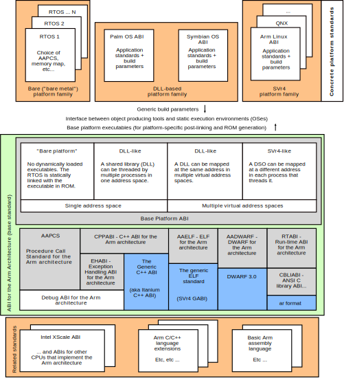

..
   Copyright (c) 2003, 2005, 2007, 2008 2018, 2020-2023, Arm Limited and its affiliates.  All rights reserved.
   CC-BY-SA-4.0 AND Apache-Patent-License
   See LICENSE file for details

.. |release| replace:: 2023Q1
.. |date-of-issue| replace:: 06\ :sup:`th` April 2023
.. |copyright-date| replace:: 2003, 2005, 2007, 2008 2018, 2020-2023
.. |footer| replace:: Copyright © |copyright-date|, Arm Limited and its
                      affiliates. All rights reserved.

.. |gcppabi-link| replace:: https:/itanium-cxx-abi.github.io/cxx-abi/abi.html
.. |gdwarf-link| replace:: http://dwarfstd.org/Dwarf3Std.php
.. |gabi-link| replace:: http://www.sco.com/developers/gabi/
.. |glsb-link| replace:: https://refspecs.linuxfoundation.org/lsb.shtml
.. |openbsd-link| replace:: https://www.openbsd.org/

.. _AADWARF32: https://github.com/ARM-software/abi-aa/releases
.. _AAELF32: https://github.com/ARM-software/abi-aa/releases
.. _AAPCS32: https://github.com/ARM-software/abi-aa/releases
.. _ADDENDA32: https://github.com/ARM-software/abi-aa/releases
.. _BPABI32: https://github.com/ARM-software/abi-aa/releases
.. _BSABI32: https://github.com/ARM-software/abi-aa/releases
.. _CLIBABI32: https://github.com/ARM-software/abi-aa/releases
.. _CPPABI32: https://github.com/ARM-software/abi-aa/releases
.. _EHABI32: https://github.com/ARM-software/abi-aa/releases
.. _RTABI32: https://github.com/ARM-software/abi-aa/releases
.. _GCPPABI: http:/itanium-cxx-abi.github.io/cxx-abi/abi.html
.. _GDWARF: http://dwarfstd.org/Dwarf3Std.php
.. _GABI: http://www.sco.com/developers/gabi/
.. _GLSB: http://refspecs.linuxfoundation.org/lsb.shtml
.. _OpenBSD: http://www.openbsd.org/

***********************************************************************************
Application Binary Interface for the Arm\ :sup:`®` Architecture – The Base Standard
***********************************************************************************

.. class:: version

|release|

.. class:: issued

Date of Issue: |date-of-issue|

.. class:: logo

.. image:: Arm_logo_blue_RGB.svg
   :scale: 30%

.. section-numbering::

.. raw:: pdf

   PageBreak oneColumn

Preamble
========

Abstract
--------

This document describes the structure of the Application Binary Interface
(ABI) for the Arm architecture, and links to the documents that define the
base standard for the ABI for the Arm Architecture. The base standard
governs inter-operation between independently generated binary files and
sets standards common to Arm-based execution environments.

Keywords
--------

ABI for the Arm architecture, ABI base standard, embedded ABI

Latest release and defects report
---------------------------------

Please check `Application Binary Interface for the Arm® Architecture
<https://github.com/ARM-software/abi-aa>`_ for the latest
release of this document.

Please report defects in this specification to the `issue tracker page
on GitHub
<https://github.com/ARM-software/abi-aa/issues>`_.

.. raw:: pdf

   PageBreak

Licence
-------

This work is licensed under the Creative Commons
Attribution-ShareAlike 4.0 International License. To view a copy of
this license, visit http://creativecommons.org/licenses/by-sa/4.0/ or
send a letter to Creative Commons, PO Box 1866, Mountain View, CA
94042, USA.

Grant of Patent License. Subject to the terms and conditions of this
license (both the Public License and this Patent License), each
Licensor hereby grants to You a perpetual, worldwide, non-exclusive,
no-charge, royalty-free, irrevocable (except as stated in this
section) patent license to make, have made, use, offer to sell, sell,
import, and otherwise transfer the Licensed Material, where such
license applies only to those patent claims licensable by such
Licensor that are necessarily infringed by their contribution(s) alone
or by combination of their contribution(s) with the Licensed Material
to which such contribution(s) was submitted. If You institute patent
litigation against any entity (including a cross-claim or counterclaim
in a lawsuit) alleging that the Licensed Material or a contribution
incorporated within the Licensed Material constitutes direct or
contributory patent infringement, then any licenses granted to You
under this license for that Licensed Material shall terminate as of
the date such litigation is filed.

About the license
-----------------

As identified more fully in the Licence_ section, this project
is licensed under CC-BY-SA-4.0 along with an additional patent
license.  The language in the additional patent license is largely
identical to that in Apache-2.0 (specifically, Section 3 of Apache-2.0
as reflected at https://www.apache.org/licenses/LICENSE-2.0) with two
exceptions.

First, several changes were made related to the defined terms so as to
reflect the fact that such defined terms need to align with the
terminology in CC-BY-SA-4.0 rather than Apache-2.0 (e.g., changing
“Work” to “Licensed Material”).

Second, the defensive termination clause was changed such that the
scope of defensive termination applies to “any licenses granted to
You” (rather than “any patent licenses granted to You”).  This change
is intended to help maintain a healthy ecosystem by providing
additional protection to the community against patent litigation
claims.

Contributions
-------------

Contributions to this project are licensed under an inbound=outbound
model such that any such contributions are licensed by the contributor
under the same terms as those in the `Licence`_ section.

Trademark notice
----------------

The text of and illustrations in this document are licensed by Arm
under a Creative Commons Attribution–Share Alike 4.0 International
license ("CC-BY-SA-4.0”), with an additional clause on patents.
The Arm trademarks featured here are registered trademarks or
trademarks of Arm Limited (or its subsidiaries) in the US and/or
elsewhere. All rights reserved. Please visit
https://www.arm.com/company/policies/trademarks for more information
about Arm’s trademarks.

Copyright
---------

Copyright (c) |copyright-date|, Arm Limited and its affiliates.  All rights
reserved.

.. raw:: pdf

   PageBreak

.. contents::
   :depth: 3

.. raw:: pdf

   PageBreak

About this document
===================

Change control
--------------

Current status and anticipated changes
^^^^^^^^^^^^^^^^^^^^^^^^^^^^^^^^^^^^^^

The following support level definitions are used by the Arm ABI specifications:

**Release**
   Arm considers this specification to have enough implementations, which have
   received sufficient testing, to verify that it is correct. The details of these
   criteria are dependent on the scale and complexity of the change over previous
   versions: small, simple changes might only require one implementation, but more
   complex changes require multiple independent implementations, which have been
   rigorously tested for cross-compatibility. Arm anticipates that future changes
   to this specification will be limited to typographical corrections,
   clarifications and compatible extensions.

**Beta**
   Arm considers this specification to be complete, but existing
   implementations do not meet the requirements for confidence in its release
   quality. Arm may need to make incompatible changes if issues emerge from its
   implementation.

**Alpha**
   The content of this specification is a draft, and Arm considers the
   likelihood of future incompatible changes to be significant.

All content in this document is at the **Release** quality level.

Change history
^^^^^^^^^^^^^^

If there is no entry in the change history table for a release, there are no
changes to the content of the document for that release.

.. table::

  +-------+------------------------------------+--------------------------------------------+
  | Issue | Date                               | Change                                     |
  +=======+====================================+============================================+
  | 1.0   | 30\ :superscript:`th` October 2003 | First public release.                      |
  +-------+------------------------------------+--------------------------------------------+
  | 2.0   | 24\ :superscript:`th` March 2005   | Second public release.                     |
  +-------+------------------------------------+--------------------------------------------+
  | A     | 24\ :superscript:`th` October 2007 | Document renumbered (formerly              |
  |       |                                    | GEN-003535 v2.0).                          |
  +-------+------------------------------------+--------------------------------------------+
  | B     | 10\ :superscript:`th` October 2008 | `A note about ar format`_ fixed a typo     |
  |       |                                    | and updated the reference to ``ar``        |
  |       |                                    | format.                                    |
  +-------+------------------------------------+--------------------------------------------+
  | 2018Q4| 21\ :superscript:`st` December 2018| Minor typographical fixes, updated links.  |
  +-------+------------------------------------+--------------------------------------------+
  | 2019Q4| 30\ :superscript:`th` January 2020 | Minor layout changes.                      |
  +-------+------------------------------------+--------------------------------------------+
  | 2021Q1| 12\ :sup:`th` April 2021           | - document released on Github              |
  |       |                                    | - new Licence_: CC-BY-SA-4.0               |
  |       |                                    | - new sections on Contributions_,          |
  |       |                                    |   `Trademark notice`_, and Copyright_      |
  +-------+------------------------------------+--------------------------------------------+

References
----------

This document refers to the following documents.

.. table::

  +-------------+-----------------+-------------------------------------------------------------+
  | Ref         | External URL    | Title                                                       |
  +=============+=================+=============================================================+
  | AADWARF32_  |                 | DWARF for the Arm Architecture                              |
  +-------------+-----------------+-------------------------------------------------------------+
  | AAELF32_    |                 | ELF for the Arm Architecture                                |
  +-------------+-----------------+-------------------------------------------------------------+
  | AAPCS32_    |                 | Procedure Call  Standard for the Arm Architecture           |
  +-------------+-----------------+-------------------------------------------------------------+
  | ADDENDA32_  |                 | Addenda to, and errata in, the ABI for the Arm Architecture |
  +-------------+-----------------+-------------------------------------------------------------+
  | BPABI32_    |                 | Base Platform ABI for the Arm Architecture                  |
  +-------------+-----------------+-------------------------------------------------------------+
  | BSABI32_    | This standard   | ABI for the Arm Architecture (Base Standard)                |
  +-------------+-----------------+-------------------------------------------------------------+
  | CLIBABI32_  |                 | C Library ABI for the Arm Architecture                      |
  +-------------+-----------------+-------------------------------------------------------------+
  | CPPABI32_   |                 | C++ ABI for the Arm Architecture                            |
  +-------------+-----------------+-------------------------------------------------------------+
  | EHABI32_    |                 | Exception Handling ABI for the Arm Architecture             |
  +-------------+-----------------+-------------------------------------------------------------+
  | EHEGI       |                 | Exception handling, components, example implementations     |
  +-------------+-----------------+-------------------------------------------------------------+
  | RTABI32_    |                 | Run-time ABI for the Arm Architecture                       |
  +-------------+-----------------+-------------------------------------------------------------+
  | GCPPABI_    | |gcppabi-link|  | Generic C++ ABI                                             |
  +-------------+-----------------+-------------------------------------------------------------+
  | GDWARF_     | |gdwarf-link|   | DWARF 3.0, the generic debug table format.                  |
  +-------------+-----------------+-------------------------------------------------------------+
  | GABI_       | |gabi-link|     | Generic ELF, 17\ :superscript:`th` December 2003 draft.     |
  +-------------+-----------------+-------------------------------------------------------------+
  | GLSB_       | |glsb-link|     | gLSB v1.2 Linux Standard Base                               |
  +-------------+-----------------+-------------------------------------------------------------+
  | OpenBSD_    | |openbsd-link|  | Open BSD Standard                                           |
  +-------------+-----------------+-------------------------------------------------------------+

Terms and abbreviations
-----------------------

The :title-reference:`ABI for the Arm Architecture` uses the following terms
and abbreviations.

AAPCS
   Procedure Call Standard for the Arm Architecture.

ABI
   Application Binary Interface:

   1. The specifications to which an executable must conform in order to
      execute in a specific execution environment. For example, the
      :title-reference:`Linux ABI for the Arm Architecture`.

   2. A particular aspect of the specifications to which independently
      produced relocatable files must conform in order to be
      statically linkable and executable. For example, the
      [CPPABI32_], the [RTABI32_], the [CLIBABI32_].

AEABI
   (Embedded) ABI for the Arm architecture (this ABI...)

Arm-based
   ... based on the Arm architecture ...

core registers
   The general purpose registers visible in the Arm architecture’s
   programmer’s model, typically r0-r12, SP, LR, PC, and CPSR.

EABI
   An ABI suited to the needs of embedded, and deeply embedded (sometimes
   called free standing), applications.

Q-o-I
   Quality of Implementation – a quality, behavior, functionality, or
   mechanism not required by this standard, but which might be provided
   by systems conforming to it.  Q-o-I is often used to describe the
   tool-chain-specific means by which a standard requirement is met.

VFP
   The Arm architecture’s Floating Point architecture and instruction
   set.  In this ABI, this abbreviation includes all floating point
   variants regardless of whether or not vector (V) mode is supported.

Acknowledgements
----------------

This specification has been developed with the active support of the
following organizations. In alphabetical order: Arm, CodeSourcery, Intel,
Metrowerks, Montavista, Nexus Electronics, PalmSource, Symbian, Texas
Instruments, and Wind River.

.. raw:: pdf

   PageBreak

Schematic map of the ABI for the Arm Architecture
=================================================

.. rubric:: A schematic map of the ABI for the Arm Architecture and
            some related standards

Notes about the schematic map
-----------------------------

Pale gray boxes depict the most important components of the base standard
for the :title-reference:`ABI for the Arm Architecture`.

Pastel blue (or darker gray on a gray-scale printed copy) boxes depict the
most important external standards we refer to. We do not show them all – for
example, we also refer to the ANSI standards for programming languages C and
C++ and to the IEEE 754 standard for floating-point arithmetic.

The tan (also darker gray on a gray-scale printed copy) annotation boxes
label groups of related standards that might be developed in the future, and
a pastel green box (pale gray on a gray-scale printed copy) encloses all
components (direct and referenced) of the :title-reference:`ABI for the Arm
Architecture` (base standard).

The size of each box is unrelated to the size or significance of the
component depicted.

Sections depicted with white boxes on a tan background are beyond the
scope of *this* base standard. In each case the section involves
either or both of the following.

* A third party on whom there is no obligation to contribute.

* Future intentions to which there is no current commitment.

The sections depicted with white boxes on a tan background show the
position of *this base standard* in a larger context. They depict some
of the ways in which those affected by this ABI standard might like to
grow it, and how the base standard would relate to other plausible
pieces of a larger jigsaw of Arm architecture-related standards. In no
case shall this depiction be interpreted as an intention or commitment
by Arm or any third party to create the component standard depicted.

`The ABI for the Arm Architecture (base standard)`_, below, describes
the base standard in detail and refers to each of its components.

.. raw:: pdf

   PageBreak

The ABI for the Arm Architecture (base standard)
================================================

Overview and documentation map
------------------------------

The :title-reference:`ABI for the Arm Architecture` is a collection of
standards, some open and some specific to the Arm architecture, that
regulate the inter-operation of binary files and development tools in a
spectrum of Arm-based execution environments from bare metal to major
operating systems such as Arm Linux. We expect that ABIs for specific
execution environments will build on, and extend, the slices of this ABI
that apply to them.

Standardizing the inter-operation of binary files requires standardizing
certain aspects of code generation itself, so this base standard is aimed
principally at the authors and vendors of C and C++ compilers, linkers, and
run-time libraries. In general, there can be no complying executable files
until there are complying relocatable files.

.. _Documentation map of the ABI for the Arm architecture base standard:

.. rubric:: Documentation map of the ABI for the Arm architecture base standard

.. table::

   +-----------------------------------------------------------+----------------------------------------------------------------+
   | Component standard                                        | Base standard                                                  |
   +===========================================================+================================================================+
   | The :title-reference:`Procedure Call Standard for the the | None.                                                          |
   | Arm Architecture` [AAPCS32_] is summarized                |                                                                |
   | in `Procedure call standard for the Arm architecture`_.   |                                                                |
   +------------------------++---------------------------------+--------------++-----------------------------++-----------------+
   | The :title-reference:`C++ ABI for the Arm Architecture`   | The Generic C++ ABI (:title-reference:`aka C++ ABI for         |
   | [CPPABI32_] is summarized in                              | Itanium`\ ).                                                   |
   | `C++ ABI for the Arm architecture`_.  It details where the|                                                                |
   | C++ ABI for the ABI deviates from the base standard.      | |gcppabi-link|                                                 |
   +-----------------------------------------------------------+                                                                |
   | The :title-reference:`Exception Handling ABI for the      |                                                                |
   | Arm Architecture` [EHABI32_] is summarized                |                                                                |
   | in `The Exception handling ABI for the Arm architecture`_.|                                                                |
   | It describes C++-specific and language-independent        |                                                                |
   | exception processing.                                     |                                                                |
   +-----------------------------------------------------------+----------------------------------------------------------------+
   | :title-reference:`ELF for the Arm Architecture`           | The generic ELF standard (SVr4 GABI), 17\ :superscript:`th`    |
   | [AAELF32_] is summarized in `ELF for the                  | December 2003 draft.                                           |
   | Arm architecture`_. It gives processor-specific           |                                                                |
   | and platform-specific details not given in the generic    | |gabi-link|                                                    |
   | ELF specification.                                        |                                                                |
   +-----------------------------------------------------------+----------------------------------------------------------------+
   | :title-reference:`DWARF for the Arm Architecture`         | DWARF 3.0.                                                     |
   | [AADWARF32_] is summarized in `DWARF for                  |                                                                |
   | the Arm architecture`_. It describes how DWARF should     | |gdwarf-link|                                                  |
   | be used to promote inter-operation between independent    |                                                                |
   | producers and consumers.                                  |                                                                |
   +-----------------------------------------------------------+----------------------------------------------------------------+
   | The :title-reference:`Run-time ABI for the Arm            | The unix ``ar`` format is the base standard for                |
   | Architecture` [RTABI32_] is summarized in                 | libraries of relocatable ELF files (see                        |
   | `Run-time ABI for the Arm architecture`_. It specified a  | `A note about ar format`_).                                    |
   | helper-function ABI to support C, C++, and arithmetic     |                                                                |
   | (floating-point, integer division, and non-trivial long   |                                                                |
   | long arithmetic).                                         |                                                                |
   +-----------------------------------------------------------+----------------------------------------------------------------+
   | The :title-reference:`C Library ABI for the Arm           | ISO/IEC 9899:1990 Programming languages - C, with some         |
   | Architecture` [CLIBABI32_] is summarized                  | reference to ISO/IEC 9899:1999. See also                       |
   | in `The C library ABI for the Arm architecture`_. It      | `A note about ar format`_ re ``ar`` format                     |
   | describes an ANSI C library ABI that can easily be        |                                                                |
   | supported by existing libraries.                          |                                                                |
   +-----------------------------------------------------------+----------------------------------------------------------------+
   | The :title-reference:`Base Platform ABI for the Arm       | The generic ELF standard (SVr4 GABI), 17\ :superscript:`th`    |
   | Architecture` [BPABI32_] is summarized in                 | December 2003 draft.                                           |
   | `The base platform ABI for the Arm architecture`_. It     |                                                                |
   | specified executable and shared object files suited to the| |gabi-link|                                                    |
   | execution environments supported by this ABI, and the     |                                                                |
   | static linker functionality required to create them.      | Linux Standard Base v1.2 specification [GLSB_]                 |
   +-----------------------------------------------------------+----------------------------------------------------------------+
   | :title-reference:`Addenda to, and errata in, the ABI for  | None.                                                          |
   | the Arm Architecture` [ADDENDA32_]                        |                                                                |
   | contains late additions to this version of the ABI        |                                                                |
   | specification, summarized in `Addenda to and errata in the|                                                                |
   | ABI for the Arm Architecture`_.                           |                                                                |
   +-----------------------------------------------------------+----------------------------------------------------------------+

The ABI for the Arm architecture base standard comprises the component
standards listed in `Documentation map of the ABI for the Arm
architecture base standard`_. The scope and purpose of each component
is explained in following subsections referred to from the table.

Procedure call standard for the Arm architecture
------------------------------------------------

The Procedure Call Standard for the Arm architecture [AAPCS32_]
specifies:

* The size, alignment, and layout of C and C++ **Plain Old Data**
  (POD) types including

   * Primitive data types.

   * Structures.

   * Enumerated types.

   * Bit field types.

* Primitive types specific to C++ (references and pointers to members).

* How to pass control and data between publicly visible functions. A
  function is publicly visible if its callers are translated separately
  from it, and some callers might have no knowledge of how it was
  translated, other than that it conforms to the AAPCS.

  (When the public visibility of F is made explicit – for example by using
  a :code:`#pragma` or annotation such as :code:`__export` or
  :code:`__declspec(dllexport)` – we also describe F as :emphasis:`exported`).

* Use of the run-time stack, and the stack invariants that must be
  preserved.

C++ ABI for the Arm architecture
--------------------------------

The C++ ABI for the Arm architecture comprises four sub-components.

* The generic C++ ABI, summarized in `The Generic C++ ABI`_, is the
  referenced base standard for this component.

* The C++ ABI supplement for the Arm architecture, summarized in
  `The C++ ABI supplement for the Arm architecture`_, details Arm-specific deviations from the
  generic standard and records Arm-specific interpretations of it.

* The separately documented :title-reference:`Exception Handling ABI for
  the Arm Architecture`, summarized in `The Exception handling ABI for the Arm architecture`_,
  describes the language-independent and C++-specific aspects of exception
  handling.

* The specimen implementations of the exception handling components,
  summarized in `The exception handling components specimen implementation`_, include:

  * A language independent unwinder.

  * A C++ semantics module.

  * Arm-specific C++ personality routines.

The Generic C++ ABI
^^^^^^^^^^^^^^^^^^^

The generic C++ ABI (originally developed for Itanium, [GCPPABI_])
specifies:

* The layout of C++ non-POD class types in terms of the layout of POD types
  (specified for :emphasis:`this` ABI by the :title-reference:`Procedure Call Standard
  for the Arm Architecture`, summarized in `Procedure call standard for the Arm architecture`_).

* How class types requiring copy construction are passed as parameters and
  results.

* The content of run-time type information (RTTI).

* Necessary APIs for object construction and destruction.

* How names with linkage are represented as ELF symbols (name mangling).

The generic C++ ABI refers to a separate Itanium-specific specification of
exception handling. When the generic C++ ABI is used as a component of :emphasis:`this`
ABI, corresponding reference must be made to the :title-reference:`Exception
Handling ABI for the Arm Architecture` (`The Exception handling ABI for the Arm architecture`_).

The C++ ABI supplement for the Arm architecture
^^^^^^^^^^^^^^^^^^^^^^^^^^^^^^^^^^^^^^^^^^^^^^^

The Arm C++ ABI supplement is a major section in the document
:title-reference:`C++ ABI for the Arm Architecture` [CPPABI32_].

The Arm C++ ABI supplement describes where the C++ ABI for the Arm
architecture necessarily diverges from the generic C++ ABI, because
Itanium-specifics that cannot work (efficiently) for the Arm architecture
show through an otherwise generic specification. For example, the generic
encoding of a pointer to member function uses the least significant bit of a
word to distinguish a code address from a v-table offset.  The Arm
architecture uses the same bit to distinguish Arm-code from Thumb-code, so
the Arm ABI must deviate.

The Exception handling ABI for the Arm architecture
^^^^^^^^^^^^^^^^^^^^^^^^^^^^^^^^^^^^^^^^^^^^^^^^^^^

In common with the Itanium exception handling ABI, the :title-reference:`Exception Handling ABI
for the Arm architecture` [EHABI32_] specifies table-based stack
unwinding that separates language-independent unwinding from language specific
concerns. The Arm specification describes:

* The **base class** understood by the language-independent
  exception handling system, and its representation in object files. The
  language-independent exception handler only uses fields from this base
  class.

* A **derived class** used by Arm tools that efficiently encodes
  stack-unwinding instructions and compactly represents the data tables
  needed for handling C++ exceptions.

* The interface between the language-independent exception handling system
  and the **personality routines** specific to a particular
  implementation for a particular language. Personality routines interpret
  the language specific, derived class tables. Conceptually (though not
  literally, for reasons of implementation convenience and run-time
  efficiency), personality routines are member functions of the derived
  class.

* The interfaces between the (C++) language exception handling semantics
  module and

  * The language independent exception handling system.

  * The personality routines.

  * The (C++) application code (effectively the interface underlying
    throw).

The :title-reference:`Exception Handling ABI for the Arm Architecture`
contains a significant amount of commentary to aid and support independent
implementation of:

* Personality routines.

* The language-specific exception handling semantics module.

* Language independent exception handling.

This commentary does not provide, and is not intended to provide, a complete
guide to independent implementation, but it does give a rationale for the
interfaces to, and among, these components.

The exception handling components specimen implementation
^^^^^^^^^^^^^^^^^^^^^^^^^^^^^^^^^^^^^^^^^^^^^^^^^^^^^^^^^

.. rubric:: Licence to use the exception handling components specimen
            implementation

The licence to use the specimen implementation of the exception handling
components is included in the zip file containing them (as the file
``LICENCE.txt``\ ) and referred to from each source file.

.. rubric:: Contents of the exception handling components example
            implementation

The exception handling components example implementation [EHEGI] comprises
the following files.

* ``cppsemantics.cpp`` is a module that implements the semantics of C++
  exception handling. It uses the language-independent unwinder
  (``unwinder.c``), and is used by the Arm-specific personality
  routines (``unwind_pr.[ch]``).

* ``cxxabi.h`` describes the generic C++ ABI
  (`The Generic C++ ABI`_).

* ``LICENCE.txt`` contains your licence to use, copy, modify, and
  sublicense the specimen implementation.

* ``unwind_env.h`` is a header that describes the build and execution
  environments of the exception handling components. This header must be
  edited if the exception handling components are to be built with non-Arm
  compilers. This header #includes :code:`cxxabi.h`.

* ``unwind_pr.c`` implements the three Arm-specific personality
  routines described in the :title-reference:`Exception Handling ABI for
  the Arm Architecture`.

* ``unwinder.c`` is an implementation of the language-independent
  unwinder.

* ``unwinder.h`` describes the interface to the language-independent
  unwinder, as described in the :title-reference:`Exception Handling ABI
  for the Arm Architecture`.

ELF for the Arm architecture
----------------------------

ELF for the Arm architecture comprises two components.

* The generic ELF specification, summarized in `The generic ELF specification`_.

* The ELF processor supplement for the Arm architecture, summarized in
  `ELF for the Arm architecture (processor supplement)`_.

The generic ELF specification
^^^^^^^^^^^^^^^^^^^^^^^^^^^^^

The generic :title-reference:`Executable and Linking Format` specification
was originally developed for Unix System V by AT&T. The latest version and
the most recent stable drafts are published by :title-reference:`The SCO
Group` at [GABI_]. They specify:

* The format and meaning of statically linkable object files.

* The format and meaning of executable and shared-object files.

In each case, a supplement specifies processor-specific and
platform-specific aspects.

* The enumeration of relocation directives is specific to a processor.
  Often, this is the only processor-specific facet of statically linkable
  (relocatable) ELF files.

* For executable files a platform-specific supplement specifies the
  interface to loading and dynamic linking.

ELF for the Arm architecture (processor supplement)
^^^^^^^^^^^^^^^^^^^^^^^^^^^^^^^^^^^^^^^^^^^^^^^^^^^

:title-reference:`ELF for the Arm Architecture` [AAELF32_]
describes the following:

* The representation in ELF and generation of cross-platform
  executable file information required by the :title-reference:`Base
  Platform ABI for the Arm Architecture` (`The base platform ABI for
  the Arm architecture`_ and [BPABI32_]).

  * Symbol versioning information.

  * Symbol pre-emption information.

  * Procedure linkage table (PLT) entries, also known to users of the Arm
    architecture as intra-call veneers.

* The enumeration of static and dynamic relocation directives.

* Processor-specific flags and conventions (for example, the
  **mapping symbols** described in section 'Mapping symbols' of
  [AAELF32_], used to accommodate the use of the Arm and
  Thumb instruction sets in the same code section).

* Two kinds of big-endian executable file (corresponding to the two flavors
  of big-endian code defined by Arm architecture v6 – in a BE8 big-endian
  executable file, code is nonetheless encoded little-endian).

* Miscellaneous Arm-specific executable and shared-object flags and section
  types used by the :title-reference:`ABI for the Arm Architecture`.

The Base Platform ABI for the Arm Architecture (`The base platform ABI
for the Arm architecture`_ and [BPABI32_]) specifies how ELF is used
to support the executable file organizations and execution
environments depicted in `Schematic map of the ABI for the Arm
Architecture`_.

DWARF for the Arm architecture
------------------------------

DWARF for the Arm architecture comprises two components.

* The generic DWARF specification, DWARF 3.0, summarized in
  `DWARF 3.0`_.

* The Arm DWARF usage conventions, summarized in
  `ABI DWARF usage conventions`_.

DWARF 3.0
^^^^^^^^^

DWARF 3.0 [GDWARF_] makes precise many ambiguous and ill-defined aspects of the
DWARF 2.0 specification, and extends that specification with:

* Additional constructs for describing optimized code and stack unwinding.

* Additional constructs for describing C++, Java, and Fortran 90.

ABI DWARF usage conventions
^^^^^^^^^^^^^^^^^^^^^^^^^^^

The ABI DWARF usage conventions are described in section 'Arm-specific
DWARF definitions' of the document :title-reference:`DWARF for the Arm
Architecture` [AADWARF32_]. This section defines:

* An Arm-specific allocation of DWARF register numbers (in .debug_frame
  unwind descriptions).

* How Arm-state and Thumb-state are encoded in DWARF line number tables.

* How to describe data known to be in the other byte order (Arm
  architecture v6 access to other-endian data).

* The Canonical Frame Address (CFA).

* The default interpretation of debug frame Common Information Entries
  (CIEs).

Run-time ABI for the Arm architecture
-------------------------------------

The run-time helper-function ABI is described in the document
:title-reference:`Run-time ABI for the Arm Architecture` [RTABI32_].

The run-time helper-function ABI specifies how relocatable files produced by
one tool chain must inter-operate with the run-time library from a different
tool chain or execution environment. It gives a simple model of what a
producer may assume of its output’s eventual static linking and execution
environments.  It defines the following.

* A minimum model of floating-point arithmetic, based on the IEEE 754
  floating-point arithmetic standard:

  * To which producers of relocatable files must conform.

  * Which producers of relocatable files can assume of the eventual
    execution environment.

  (The model sets a minimum standard. Implementers may implement the full
  IEEE 754 specification).

* The type signatures, meaning, and allowable names of the helper functions
  that all conforming static linking environments must support. The set of
  helper functions is divided into those required by C and assembly
  language, and those required only by C++.

* The provision, as part of the relocatable object itself or in separately
  delivered libraries, of all other helper functions used by a translation
  unit.

Libraries of relocatable ELF files must be formatted as Unix-style
``ar`` format linkable libraries (see `A note about ar format`_,
below).

The C library ABI for the Arm architecture
------------------------------------------

The C library ABI is described in the document :title-reference:`C Library
ABI for the Arm Architecture` [CLIBABI32_].

The C library ABI specifies:

* A binary interface to the C89 run-time library that allows a
  C-library-using function built by one tool chain to use the C library
  implementation provided by another.

* Constraints on language library headers necessary to allow tool chain X to
  use its own headers, or tool chain Y’s headers, when building an object
  that must interface to tool chain Y's run-time library.

Compliance with this specification is a header-by-header **quality
of implementation** issue. Compliance is not required in order to claim
compliance to this base standard ABI for the Arm architecture.

Libraries of relocatable ELF files must be formatted as Unix-style
``ar`` format linkable libraries (see `A note about ar format`_,
below).

The base platform ABI for the Arm architecture
----------------------------------------------

The base platform ABI is described in the document :title-reference:`Base
Platform ABI for the Arm Architecture` [BPABI32_].

The base platform ABI specifies:

* The content and format of ELF-based executable files suitable for
  post-processing to platform-specific binary formats appropriate to the
  families of execution environment supported by this ABI
  (`Schematic map of the ABI for the Arm Architecture`_).

* The division of responsibility between static linkers generating fully
  symbolic executable ELF files and post-linkers generating less symbolic,
  platform-specific executable files.

* The static linking functionality needed to generate a generic executable
  file – the functionality needed to encompass the platform families
  supported by this ABI.

In most cases, some platform-specific post-processing is required to produce
a platform executable file, but the complexity of the post processor is
limited:

* For the SVr4 platform family, the required post-processing is a tiny
  increment on the static linking needed to generate a BPABI executable
  file.  We expect most static linkers will offer an option to directly
  generate an executable file for Linux.

* For the DLL-based platform families platform-specific post-linking is
  significant, but little more complicated than an off-line version of SVr4
  dynamic linking followed by a file format conversion.

* The bare metal platform family may demand additional static linking
  functionality to manage separate load and execution addresses and
  multiple image segments. Extracting such segments from an ELF executable
  file to drive ROM generating tools is trivial in comparison with the
  above tasks.

We expect post linking to be used primary in support of DLL-based platforms
and specialized execution environments that feature dynamically loaded
executable files.

A note about ``ar`` format
--------------------------

This ABI specifies that libraries of relocatable ELF files must be formatted
as Unix-style ``ar`` format linkable libraries. This section
specifies the ``ar`` variant used by Arm tools.

Unfortunately, ``ar`` format is not well standardized, and good
public references to the format are hard to find. The ``ar`` command
is deprecated from the Linux base standard [GLSB_] which states that it is
“...  expected to disappear from a future version of the LSB”.

A good general introduction to ``ar`` format, including a brief
history and a warning about the incompatibility of its variants, is given in
the :title-reference:`Manuals` section of [OpenBSD_]. Search there for
``ar`` in section 5 – :title-reference:`File Formats`.  However,
please be aware of the following concerning the name field in archive
headers:

* Different ``ar`` variants manage long file names (> 14 characters), and file
  names containing spaces, differently.

* :title-reference:`RealView` tools from Arm do :emphasis:`not` use the BSD
  file name conventions described at [OpenBSD_].

Recently, we have found a :title-reference:`Wikipedia` article about
``ar`` format [http://en.wikipedia.org/wiki/Ar_(Unix)]. The
:title-reference:`GNU variant` it describes is similar to the
:title-reference:`RealView` variant summarized immediately below with this
difference.

* As of early October 2008, this :title-reference:`Wikipedia` article
  claims that the 32-bit binary integers in the symbol table member (called
  ‘/’) are encoded **big endian**.

* Arm targeted GNU tools and :title-reference:`RealView` tools always
  encode binary data using the byte order of the target system – little
  endian for little endian targets and big endian for big endian targets.

.. rubric:: ``ar`` format conventions used by RealView tools and
            Arm-targeted GNU tools

File names recorded in archive member headers are terminated with a ‘/’. This
allows short (≤ 14 characters) names to contain spaces.

The symbol table member (always present if an archive contains relocatable
files) has the header name ‘/’. The symbol table member contains, in order:

* A 32-bit count of the number of symbols in the table. The byte order is
  that of the target system.

* For each symbol, the 32-bit offset within the archive of the header of
  the member defining it. The byte order is that of the target system.

* The NUL-terminated name of each symbol, listed in the same order as the
  offsets.

There is always a file names member with the header name ‘//’. It contains
the names of all the files in the archive. Each name is terminated by ‘/’
followed by ‘\\n’ (so the member contains only printable text).

If the file name of an archive member is longer than 14 characters, its
header name is ‘/’ followed by the decimal offset of its name in the file
names member. Otherwise the header name is the file name of the member.

Ordinary members follow the symbol table member and the file names member.

Addenda to and errata in the ABI for the Arm Architecture
---------------------------------------------------------

:title-reference:`Addenda to, and errata in, the ABI for the Arm
Architecture` [ADDENDA32_] contains late additions to
version 2.0 (:emphasis:`this` version) and will contain any significant
additions made during future maintenance of v2.0.

As of the publication of v2.0 of the :title-reference:`ABI for the Arm
Architecture` (date shown at the top of this document), there are two
addenda, in sections 'Build Attributes' and 'Thread Local Storage' of
[ADDENDA32_].

As of this publication date (shown at the top of this document) there
are no errata.

Build attributes
^^^^^^^^^^^^^^^^

Build attributes record:

* The use of architectural features and ABI variants by the code and data
  in a relocatable file.

* To a limited extent, the intentions of the builder of the file.

Attributes allow linkers to determine whether separately built relocatable
files are inter-operable or incompatible, and to select the variant of a
required library member that best matches the intentions of their builders.

Thread local storage
^^^^^^^^^^^^^^^^^^^^

Thread Local Storage (TLS) is a class of **own data** (static
storage) that – like the stack – is instanced once for each thread of
execution.

This addendum defines the thread local storage (TLS) model for Linux for the
Arm architecture. It covers:

* An introduction to the ABI issues raised by thread local storage.

* An introduction to addressing thread local variables.

* How Linux for the Arm architecture addresses thread local variables:

   * How thread local variables must be addressed from dynamically loadable
     DSOs.

   * How thread local variables may be addressed more efficiently from
     applications and DSOs loaded only when a process is created.

The Linux-specific TLS relocations are described in [AAELF32_]
(`ELF for the Arm architecture`_).
