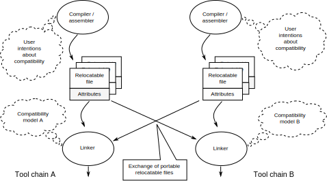

..
   Copyright (c) 2023, Arm Limited and its affiliates.  All rights reserved.
   CC-BY-SA-4.0 AND Apache-Patent-License
   See LICENSE file for details

.. |release| replace:: 2023Q4
.. |date-of-issue| replace:: 18\ :sup:`th` October 2023
.. |copyright-date| replace:: 2023

.. _ADDENDA32: https://github.com/ARM-software/abi-aa/releases
.. _AAELF64: https://github.com/ARM-software/abi-aa/releases
.. _ARMARM: https://developer.arm.com/documentation/ddi0487/latest
.. _BUILDATTR64RATIONALE: https://github.com/ARM-software/abi-aa/tree/main/design-documents
.. _CPPABI64: https://github.com/ARM-software/abi-aa/releases
.. _GDWARF: https://dwarfstd.org
.. _LINUX_ABI: https://github.com/hjl-tools/linux-abi/wiki/Linux-Extensions-to-gABI
.. _PAUTHABI64: https://github.com/ARM-software/abi-aa/releases
.. _SYSVABI64: https://github.com/ARM-software/abi-aa/releases

.. footer::

   ###Page###

   |

   Copyright © |copyright-date|, Arm Limited and its affiliates. All rights
   reserved.

Build Attributes for the Arm® 64-bit Architecture (AArch64)
***********************************************************

.. class:: version

|release|

.. class:: issued

Date of Issue: |date-of-issue|

.. class:: logo

.. image:: Arm_logo_blue_RGB.svg
   :scale: 30%

.. section-numbering::

.. raw:: pdf

   PageBreak oneColumn

Preamble
========

Abstract
--------

This document describes the implementation of build attributes for
the 64-bit Arm Architecture.

Keywords
--------

ELF, AArch64 ELF, Build Attributes

Latest release and defects report
---------------------------------

Please check `Application Binary Interface for the Arm® Architecture
<https://github.com/ARM-software/abi-aa>`_ for the latest
release of this document.

Please report defects in this specification to the `issue tracker page
on GitHub
<https://github.com/ARM-software/abi-aa/issues>`_.

.. raw:: pdf

   PageBreak

Licence
-------

This work is licensed under the Creative Commons
Attribution-ShareAlike 4.0 International License. To view a copy of
this license, visit http://creativecommons.org/licenses/by-sa/4.0/ or
send a letter to Creative Commons, PO Box 1866, Mountain View, CA
94042, USA.

Grant of Patent License. Subject to the terms and conditions of this
license (both the Public License and this Patent License), each
Licensor hereby grants to You a perpetual, worldwide, non-exclusive,
no-charge, royalty-free, irrevocable (except as stated in this
section) patent license to make, have made, use, offer to sell, sell,
import, and otherwise transfer the Licensed Material, where such
license applies only to those patent claims licensable by such
Licensor that are necessarily infringed by their contribution(s) alone
or by combination of their contribution(s) with the Licensed Material
to which such contribution(s) was submitted. If You institute patent
litigation against any entity (including a cross-claim or counterclaim
in a lawsuit) alleging that the Licensed Material or a contribution
incorporated within the Licensed Material constitutes direct or
contributory patent infringement, then any licenses granted to You
under this license for that Licensed Material shall terminate as of
the date such litigation is filed.

About the license
-----------------

As identified more fully in the Licence_ section, this project
is licensed under CC-BY-SA-4.0 along with an additional patent
license.  The language in the additional patent license is largely
identical to that in Apache-2.0 (specifically, Section 3 of Apache-2.0
as reflected at https://www.apache.org/licenses/LICENSE-2.0) with two
exceptions.

First, several changes were made related to the defined terms so as to
reflect the fact that such defined terms need to align with the
terminology in CC-BY-SA-4.0 rather than Apache-2.0 (e.g., changing
“Work” to “Licensed Material”).

Second, the defensive termination clause was changed such that the
scope of defensive termination applies to “any licenses granted to
You” (rather than “any patent licenses granted to You”).  This change
is intended to help maintain a healthy ecosystem by providing
additional protection to the community against patent litigation
claims.

Contributions
-------------

Contributions to this project are licensed under an inbound=outbound
model such that any such contributions are licensed by the contributor
under the same terms as those in the `Licence`_ section.

Trademark notice
----------------

The text of and illustrations in this document are licensed by Arm
under a Creative Commons Attribution–Share Alike 4.0 International
license ("CC-BY-SA-4.0”), with an additional clause on patents.
The Arm trademarks featured here are registered trademarks or
trademarks of Arm Limited (or its subsidiaries) in the US and/or
elsewhere. All rights reserved. Please visit
https://www.arm.com/company/policies/trademarks for more information
about Arm’s trademarks.

Copyright
---------

Copyright (c) |copyright-date|, Arm Limited and its affiliates.  All rights reserved.

.. raw:: pdf

   PageBreak

.. contents::
   :depth: 3

.. raw:: pdf

   PageBreak

About this document
===================

Change Control
--------------

Current Status and Anticipated Changes
^^^^^^^^^^^^^^^^^^^^^^^^^^^^^^^^^^^^^^

The following support level definitions are used by the Arm ABI specifications:

**Release**
   Arm considers this specification to have enough
   implementations, which have received sufficient testing, to verify
   that it is correct. The details of these criteria are dependent on
   the scale and complexity of the change over previous versions:
   small, simple changes might only require one implementation, but
   more complex changes require multiple independent implementations,
   which have been rigorously tested for cross-compatibility. Arm
   anticipates that future changes to this specification will be
   limited to typographical corrections, clarifications and compatible
   extensions.

**Beta**
   Arm considers this specification to be complete, but existing
   implementations do not meet the requirements for confidence in its release
   quality. Arm may need to make incompatible changes if issues emerge from its
   implementation.

**Alpha**
   The content of this specification is a draft, and Arm considers the
   likelihood of future incompatible changes to be significant.

This document is at **Alpha** release quality.

Change history
^^^^^^^^^^^^^^

If there is no entry in the change history table for a release, there are no
changes to the content of the document for that release.

.. table::

  +------------+---------------------+------------------------------------------------------------------+
  | Issue      | Date                | Change                                                           |
  +============+=====================+==================================================================+
  | 0.1        | 18th October 2023   | Alpha draft release for public comment                           |
  +------------+---------------------+------------------------------------------------------------------+

References
----------

This document refers to, or is referred to by, the following documents.

.. table::

  +-----------------------------------------------------------------------------------------+-------------------------------------------------------------+-----------------------------------------------------------------------------+
  | Ref                                                                                     | URL or other reference                                      | Title                                                                       |
  +=========================================================================================+=============================================================+=============================================================================+
  | ADDENDA32_                                                                              | IHI 0045                                                    | Addenda to, and errata in, the ABI for the Arm Architecture                 |
  +-----------------------------------------------------------------------------------------+-------------------------------------------------------------+-----------------------------------------------------------------------------+
  | ARMARM_                                                                                 | DDI 0487                                                    | Arm Architecture Reference Manual Armv8 for Armv8-A architecture profile    |
  +-----------------------------------------------------------------------------------------+-------------------------------------------------------------+-----------------------------------------------------------------------------+
  | AAELF64_                                                                                | IHI 0056                                                    | ELF for the Arm 64-bit Architecture                                         |
  +-----------------------------------------------------------------------------------------+-------------------------------------------------------------+-----------------------------------------------------------------------------+
  | BUILDATTR64RATIONALE_                                                                   |                                                             | Design Rationale for Build Attributes                                       |
  +-----------------------------------------------------------------------------------------+-------------------------------------------------------------+-----------------------------------------------------------------------------+
  | CPPABI64_                                                                               | IHI 0059                                                    | C++ ABI for the Arm 64-bit Architecture                                     |
  +-----------------------------------------------------------------------------------------+-------------------------------------------------------------+-----------------------------------------------------------------------------+
  | LINUX_ABI_                                                                              |                                                             | Linux extensions to GABI                                                    |
  +-----------------------------------------------------------------------------------------+-------------------------------------------------------------+-----------------------------------------------------------------------------+
  | SYSVABI64_                                                                              |                                                             | System V Application Binary Interface (ABI) for the Arm 64-bit Architecture |
  +-----------------------------------------------------------------------------------------+-------------------------------------------------------------+-----------------------------------------------------------------------------+
  | GDWARF_                                                                                 | https://dwarfstd.org/index.html                             | DWARF, the generic debug table format                                       |
  +-----------------------------------------------------------------------------------------+-------------------------------------------------------------+-----------------------------------------------------------------------------+
  | LINUX_ABI_                                                                              | https://github.com/hjl-tools/linux-abi/wiki                 | Linux Extensions to gABI                                                    |
  +-----------------------------------------------------------------------------------------+-------------------------------------------------------------+-----------------------------------------------------------------------------+
  | PAUTHABI64_                                                                             | DDI 0487                                                    | PAuth ABI Extension to ELF for the 64-bit Architecture                      |
  +-----------------------------------------------------------------------------------------+-------------------------------------------------------------+-----------------------------------------------------------------------------+

Terms and Abbreviations
-----------------------

The ABI for the Arm 64-bit Architecture uses the following terms and abbreviations.

A32
   The instruction set named Arm in the Armv7 architecture; A32 uses 32-bit
   fixed-length instructions.

A64
   The instruction set available when in AArch64 state.

AAPCS64
   Procedure Call Standard for the Arm 64-bit Architecture (AArch64)

AArch32
   The 32-bit general-purpose register width state of the Armv8 architecture,
   broadly compatible with the Armv7-A architecture.

AArch64
   The 64-bit general-purpose register width state of the Armv8 architecture.

ABI
   Application Binary Interface:

   1. The specifications to which an executable must conform in order to
      execute in a specific execution environment. For example, the
      *Linux ABI for the Arm Architecture*.

   2. A particular aspect of the specifications to which independently produced
      relocatable files must conform in order to be statically linkable and
      executable.  For example, the CPPABI64_, AAELF64_, ...

Arm-based
   ... based on the Arm architecture ...

Floating point
   Depending on context floating point means or qualifies: (a) floating-point
   arithmetic conforming to IEEE 754 2008; (b) the Armv8 floating point
   instruction set; (c) the register set shared by (b) and the Armv8 SIMD
   instruction set.

Q-o-I
   Quality of Implementation – a quality, behavior, functionality, or
   mechanism not required by this standard, but which might be provided
   by systems conforming to it.  Q-o-I is often used to describe the
   toolchain-specific means by which a standard requirement is met.

SIMD
   Single Instruction Multiple Data – A term denoting or qualifying:
   (a) processing several data items in parallel under the control of one
   instruction; (b) the Arm v8 SIMD instruction set: (c) the register set
   shared by (b) and the Armv8 floating point instruction set.

SIMD and floating point
   The Arm architecture’s SIMD and Floating Point architecture comprising
   the floating point instruction set, the SIMD instruction set and the
   register set shared by them.

SVE
   The Arm architecture's Scalable Vector Extension.

T32
   The instruction set named Thumb in the Armv7 architecture; T32 uses
   16-bit and 32-bit instructions.

VG
   The number of 64-bit “vector granules” in an SVE vector; in other words,
   the number of bits in an SVE vector register divided by 64.

ILP32
   SysV-like data model where int, long int and pointer are 32-bit

LP64
   SysV-like data model where int is 32-bit, but long int and
   pointer are 64-bit.

LLP64
   Windows-like data model where int and long int are 32-bit, but
   long long int and pointer are 64-bit.

This document uses the following terms and abbreviations.

Link-unit
   An executable or shared library. Also known as loadable-unit in
   this document.

Loadable-unit
   An executable or shared library. Also known as link-unit in
   other ABI documents.

Whole-program
   A combination of an executable and all its shared library dependencies.

.. raw:: pdf

   PageBreak

Scope
=====

This document contains the specification of build attributes for
64-bit ELF files defined in (AAELF64_). The AArch64 specification
builds upon the AArch32 specification described in (ADDENDA32_). This
document reuses much of the concepts from (ADDENDA32_), concentrating
on the AArch64 specific information.

A design rationale for build attributes containing an explanation of
the design decisions is available in (BUILDATTR64RATIONALE_)

.. raw:: pdf

   PageBreak

Introduction
============

About build attributes and compatibility
----------------------------------------

Build attributes record data that a linker needs to reason
mechanically about the compatibility, or incompatibility, of a set of
relocatable object files.  Other tools that consume relocatable object
files may find the data useful.

Build attributes are designed to have long-term invariant
meaning. They record choices to which there is long term public
commitment through the Arm Architecture Reference Manual [ARMARM_],
the ABI for the Arm Architecture (of which this document is a
component), vendor data sheets, and similar long lived publications.

Build attributes approximate the intentions the user of a compiler or
assembler has for the compatibility of the relocatable object file
produced by the compiler or assembler (`Attribute values are based on
user intentions`_).

The figure below depicts the software development flows in which build
attributes are important.

   Software development flows supported by build attributes

In this depiction there are two principal uses of build attributes.

* Within a tool chain, build attributes generate rich opportunities
  for a linker to diagnose incompatibility, enforce compatibility,
  and select library members intelligently according to its
  compatibility model.

* Between tool chains, build attributes describe the intended
  compatibility of a relocatable object file and the entities it
  defines in terms independent of either tool chain, promoting safe
  exchange of portable code in binary form.

Attribute values are based on user intentions
---------------------------------------------

We base attribute values on user intentions to avoid the values being
an unpredictable (effectively random) function of a compiler’s code
generation algorithms and to support using attributes with assembly
language without overburdening programmers. Where attributes support
exchanging portable relocatable object files among tool chains,
predictability is worth more than precision.

Capturing user intentions about compatibility
---------------------------------------------

This standard does not specify how a tool should capture and
approximate the intentions of its users.

As far as possible, ABI-defined compatibility tags (`Public aeabi
prefixed subsections`_) model the long-term compatibility commitments
implicit in architectural specifications, product data sheets, and the
ABI for the Arm Architecture.

In general, tools have invocation options – command-line options and
GUI configuration options – that present choices similar to those
revealed in such documentation and modeled by ABI-defined
compatibility tags.

The challenge for a tool that generates relocatable object files is to
select the set of build attributes – giving a value to each
compatibility tag – that best approximates the user’s intentions
implicit in its invocation options.

This part of the problem of managing compatibility does not have a
perfect solution. A user’s intentions are imperfectly approximated by
invocation options that are then sometimes imperfectly mapped to build
attributes.

No required compatibility model
-------------------------------

This specification standardizes the meaning of build attributes, not
the compatibility models within which they will be interpreted.

For the majority of build attributes there is only one reasonable
interpretation of compatibility among their values, and it is an
obvious one.

For a minority – mostly associated with ABI compatibility
between functions – this is not the case and it is reasonable for
different tool chains to take different positions according to the
markets they serve.

Thus it is entirely reasonable that a relocatable object file produced
by tool chain A and accepted by tool chain B’s linker might be
rejected by tool chain C’s linker when targeting exactly the same
environment as tool chain
B.

The kinds of compatibility modeled by build attributes
------------------------------------------------------

Build attributes primarily model two kinds of compatibility.

* The compatibility of binary code with target hardware conforming to
  a revision of the Arm Architecture.

* The ABI compatibility between functions conforming to
  variants of this ABI.

The intuitive notion of compatibility can be given a mathematically
precise definition using sets of demands placed on an execution
environment.

For example, a program could be defined to be compatible with a
processor if (and only if) the set of instructions the program might
unconditionally try to execute is a subset of the set of instructions
implemented by the processor.

Target-related attributes describe the hardware-related demands a
relocatable object file will place on an execution environment through
being included in an executable file for that environment.

For example, target-related attributes could record whether use of the
``FEAT_MEMTAG`` extension is permitted, and at what architectural
revision use is permitted.

ABI related attributes such as (`aeabi-feature-and-bits subsection`_)
describe features of the ABI contract that the ABI
allows to vary, such as whether executable sections are compatible
with the branch target identification mechanism.

ABI related compatibility can be understood in terms of
sets of demands placed on an execution environment, but the modeling
is more difficult. In this case the environment is less obvious, more
abstract, and elements of it can depend on an operating system or the
tool chain itself.

Mathematically, A *compatible with* B can be understood as: {demands
made by A} ⊆ {demands made by B}.

Making this concrete sometimes requires combining information from
several tags.

The scope of build attributes
-----------------------------

Conceptually the smallest entity that build attributes can be
practically assigned to is an ELF symbol, representing a single
function or data object.

Build attributes are recorded at file scope to model the user
intentions when building the ELF file. They apply to all entities
within the file.

Tools may permit individual entities to be built with different
attributes from the file scope build attributes. For example a file
containing a function requiring an optional target feature such as
``FEAT_SVE`` may have a runtime test for ``FEAT_SVE`` before calling
the function, using an alternative baseline function if ``FEAT_SVE``
is not present. The file scope build attributes should not have a
requirement for ``FEAT_SVE`` to be present.

Combining attribute values
--------------------------

Suppose E1 and E2 are entities (for example, relocatable object files)
with attribute values a1 and a2 for an attribute tag T. This section
discusses how to generate the correct value of T for the entity formed
by combining E1 and E2 (for example, the executable file formed by
linking E1 with E2)

In each case, the values of a tag can be partially ordered according
to the sets of demands they represent. We shall write a1 ≤ a2 if an
entity tagged with <T, a1> makes no more demands on its environment
than an entity tagged with <T, a2>.

Writing {T:a1} to denote the set of demands made by an entity tagged
with <T, a1>, we can define a1 ≤ a2 if {T:a1} ⊆ {T:a2}.  (A set of
demands might be the set of instructions a processor must execute, for
example).

Informally we say that a1 is compatible with a2 or a1 is more
compatible than a2 when a1 ≤ a2.

Using Arm architecture versions as an example, Armv8.0-A ≤ Armv9.0-A,
because the set of instructions conforming to architecture Armv8.0-A is
a subset of the set conforming to architecture Armv9.0-A. Stated more
precisely, it is the case that {ISA\@Armv8.0-A} ⊆ {ISA\@Armv9.0-A}.

This partial order of the attributes often differs from the arithmetic
order of the enumerated values of the tag. In many cases the partial
order is:

*  Identical to the arithmetic order  (as with ``Tag_THUMB_ISA_use`` in
   (ADDENDA32_)).

*  Reversed from the arithmetic order (as with ``Tag_Feature_GCS`` in
   `aeabi-feature-and-bits subsection`_).

*  Represents mutually incompatible choices with which only the identical
   choice, or no use at all, is compatible (as with ``Tag_ABI_PCS_wchar_t`` in
   (ADDENDA32_).

Note that the appropriate partial order to use can evolve over time as
the underlying specifications evolve.

Combining two values of the same tag
^^^^^^^^^^^^^^^^^^^^^^^^^^^^^^^^^^^^

Using a1 <> a2 to denote if a1 and a2 are unordered in the partial
order of demands/compatibility and a1 + a2 to denote the combination
of a1 and a2. The following combination rules apply:

*  If a1 ≤ a2, a1 + a2 = a2, else if a2 ≤ a1,
   a1 + a2 = a1. (‘+’ behaves like the *maximum* function).

*  If a1 <> a2 there are two mutually exclusive sub-cases.

   *  There is a least a3 such that a1 ≤ a3 and a2 ≤ a3.
      Then a1 + a2 = a3.

      Example: ``Tag_CPU_arch`` from (ADDENDA32_) when a1 = v6KZ, a2 = v6T2, and a3 = v7.

   *  There is no such a3, so a1 + a2 denotes the attempted combination of
      incompatible values.

      Example: ``Tag_ABI_PCS_wchar_t`` from (ADDENDA32_) when a1 = 2 and a2 = 4.

In this second sub-case it is a matter of notational taste whether
a1 + a2 is defined to have a value such as error or Top, or defined to
have no value. Either way, in practice an attempted combination is
expected to fail in a way specific to a tool chain’s compatibility
model (for example by provoking a link-time diagnostic).

Forcing Functions
^^^^^^^^^^^^^^^^^

In many cases the value of an attribute is independent of the value
of all other attributes. There can be cases where attribute values
are linked. For example to describe the signing schema in (PAuthABI64_)
which is described as a tuple (vendor, version) two attributes are
required. Incompatibilites also exist, such as in (ADDENDA32_)
``Tag_Advanced_SIMD_arch`` cannot be set if ``Tag_CPU_arch_profile``
is set to 'M'.

The specification will note known forcing functions. Implementation of
forcing functions is Q-o-I.

Representing build attributes in a relocatable ELF Object file
==============================================================

Encoding
--------

Encoding build attributes are encoded in a vendor-specific section of
type ``SHT_AARCH64_ATTRIBUTES`` and name ``.ARM.attributes`` (for
further details see [AAELF64_]).

An attribute is encoded in a <tag, value> pair.

Both tags and numerical values are encoded using unsigned LEB128
encoding (ULEB128), DWARF style (for details see [GDWARF_]).

String values are encoded using NUL-terminated byte strings (NTBS).

Encoding of meta data in a loadable-unit
----------------------------------------

Build attributes are only defined for relocatable object files.  The
encoding of metadata in a loadable-unit (executable or shared-library)
is platform specific.  For example a platform may choose to use GNU
program properties as defined in (LINUX_ABI_). This document specifies
the meaning of build attributes for relocatable object files only.  The
presence of ``.ARM.attributes`` sections in a loadable-unit is
permitted, but the interpretation of the contents of the section is
outside the scope of this document. The use of ``.note.gnu.property``
sections for loadable-units is recommended for SysVr4 platforms,
see (SYSVABI64_) for details.

.. raw:: pdf

   PageBreak

Formal syntax of an ELF Attributes Section
==========================================

An ELF Attributes section uses a processor specific section with details

.. table:: Attributes Section

    +---------------------+----------------------------+-------+-----------+------+------------+
    | Name                | Type                       | Flags | Alignment | Info | Entry Size |
    +=====================+============================+=======+===========+======+============+
    | ``.ARM.attributes`` | ``SHT_AARCH64_ATTRIBUTES`` | 0x0   | 1         | 0    | 0          |
    +---------------------+----------------------------+-------+-----------+------+------------+

A consumer may not assume the natural alignment of a data type such as ``uint32``.

The syntactic structure of an attributes section is::

   <format-version: <version-letter>>
   [ <uint32: subsection-length> NTBS: vendor-name
     <bytes: vendor-data>
   ]*

*Format-version* describes the format of the following data. It is a
single byte. Only version 'A' (0x41) is defined. This field exists to
allow future changes in format.

*Subsection-length* is a 4-byte integer in the byte order of the ELF
file. It encodes the length of the subsection, including the length
field itself, the vendor name string and its terminating NUL byte, and
the following vendor data. It gives the offset from the start of this
subsection to the start of the next one.

*Vendor-name* is a NUL-terminated byte string (NTBS) like a C-language
literal string.

No requirements are placed on the format of private vendor data. The
format of the public attributes subsections (which will have a
pseudo-vendor name with a prefix of “aeabi”) are described below.

Attributes that record data about the compatibility of this
relocatable object file with other relocatable object files must be
recorded in a public "aeabi" prefixed subsection.

Attributes meaningful only to the producer must be recorded in a
private vendor subsection. These must not affect compatibility between
relocatable object files. A producer that does not recognize the
private vendor may skip over the private vendor subsection.

Formally, there are no constraints on the order or number of vendor
subsections. A consumer can collect the public ("aeabi" prefixed)
attributes in a single pass over the section, then all of its private
data in a second pass.

Public aeabi prefixed subsections
=================================

About public tags
-----------------

Subsections containing a vendor name with a prefix of "aeabi" are
public attributes defined by this specification. All public aeabi
sections have the same format, which includes a header. The header
will indicate whether the section is required or optional.

A consumer must be able to parse the header of all subsections that
have a prefix of "aeabi". If the header is optional then a consumer
may skip the subsection if they do not recognize the full vendor-name.

Default values for public tags
^^^^^^^^^^^^^^^^^^^^^^^^^^^^^^

The effect of omitting a public tag in file scope is identical to
including it with a value of 0 or “”, depending on its parameter type.

Formal Syntax of aeabi prefixed subsections
-------------------------------------------

<uint8: optional> <uint8: parameter type>
<attribute>*

aeabi prefixed subsections consist of a header and 0 or more
attributes.

*optional* is a 1-byte integer. It encodes whether the subsection
contents can be safely skipped if the consumer does not recognize the
vendor-name, or if any subset of the subsection can be skipped over.
The permitted values are::

   *0* not optional. The consumer must understand the subsection
   and all of its contents for the program to be correct.

   *1* optional. The consumer may skip the subsection in full or in part
   and the program will still be correct.

*parameter type* is a 1-byte integer. It encodes whether the values in
the subsection are ULEB128 values or NTBS. The permitted values are::

   *0* the values are ULEB128 encoded.

   *1* the values are NTBS.

*<attribute>* is *<tag, value>* pair. Where tag is encoded using
unsigned LEB128 encoding (ULEB128), and value is encoded as described
by *parameter type*.

How this specification describes public attributes
--------------------------------------------------

In the following sections we describe each attribute in a uniform style, as
follows. ::

   Tag_tag_name (=tag value)
      value  Comment
      value  Comment
      ...

   Block commentary about the tag and its possible values.

*Tag value* gives the numerical representation of the tag. It is a
small integer less than 128.

Following lines enumerate the currently defined parameter values,
giving a short comment about each one.

A block of explanatory text follows in some cases.

aeabi-feature-and-bits subsection
---------------------------------

The full vendor name is "aeabi-feature-and-bits"

This subsection contains tags that describe the same optional feature
bits as the ``GNU_PROPERTY_AARCH64_FEATURE_1_AND`` as described in
(AAELF64_).

header contents
^^^^^^^^^^^^^^^

*optional* is 1 (optional)

*parameter type* is 0 (ULEB128)

Combining attribute values of aeabi-feature-and-bits
^^^^^^^^^^^^^^^^^^^^^^^^^^^^^^^^^^^^^^^^^^^^^^^^^^^^

With reference to Combining attribute values. The partial order for
all of the tags in this subsection is reversed.

+-------+---------------+
+ Value + Partial Order |
+=======+===============+
+ 0     | 1             |
+-------+---------------+
+ 1     | 0             |
+-------+---------------+

This has the effect that all attributes must have value 1 for the
combination of the attributes to have value 1.

attributes
^^^^^^^^^^

::
   Tag_Feature_BTI, (= 1)
      0  Not all executable sections are compatible with the Branch Target Identification mechanism or no information available.
      1  All executable sections are compatible with the Branch Target Identification mechanism

::
   Tag_Feature_PAC, (= 2)
      0  Not all executable sections have been protected with Return Address Signing or no information available.
      1  All executable sections have been protected with Return Address Signing.

::
   Tag_Feature_GCS, (= 3)
      0  Not all executable sections are compatible with the guarded control stack extension or no information available.
      1  All executable sections are compatible with the guarded control stack extension.

Pointer Authentication Signing Schema
-------------------------------------

The full vendor name is "aeabi-pauthabi"

The (PAUTHABI64_) defines an extension to ELF in which code pointers
are signed using instructions in the FEAT_PAuth extension. The
pointers that are signed as well as the modifiers and key used for
each type of pointer are known as the signing schema. To make use of
(PAuthABI64_) all relocatable object files and shared-library dependencies
must use the same signing schema.

While the requirement for the ``FEAT_PAuth`` extension is recorded in
the architectural features.  The signing schema is software defined
with more complex compatibility requirements.

::
   Tag_PAuth_Platform (=1)
     0  The user did not permit this entity to use the PAuthABI, or no information available.
     <id> The platform vendor id.

Where the *<id>* is one of a number of registered platforms.

::
   Tag_PAuth_Schema (=2)
     0 The user did not permit this entity to use the PAuthABI, or no information available.
     <id> The version number of the Schema.

Where the *<id>* is the version number in the context of
``Tag_PAuth_Platform``.

The signing schema is not optional.

The parameter type is ULEB128.

The partial order is custom. Two entities are compabitible if both
``Tag_PAuth_Platform`` and ``Tag_PAuth_Schema`` are identical.

The compatibility between an entity with ``Tag_PAuth_Platform`` = 0,
``Tag_PAuth_Schema`` = 0, and ``Tag_Pauth_Platform`` != 0, ``Tag_PAuth_Schema`` !=
0 is implementation defined.

aeabi-feature-and-bits and GNU Program Properties
^^^^^^^^^^^^^^^^^^^^^^^^^^^^^^^^^^^^^^^^^^^^^^^^^

GNU Program Properties as defined by [LINUX_ABI_] are a similar
concept to Build Attributes. Program properties are encoded in
``.note.gnu.property`` sections. A static linker combines the program
properties according to the rules for each program property type. The
combined ``.note.gnu.property`` section is written to the loadable-unit.

Build attributes replace the use of GNU program properties for
relocatable object files.  A platform may choose to use GNU program
properties to represent properties in loadable-units with static
linkers translating from a merged build attribute value to a GNU
program property.

Many existing relocatable object files have a ``.note.gnu.property``
section with the ``GNU_PROPERTY_AARCH64_FEATURE_1_AND`` program
property.

A relocatable object file may have a ``.note.gnu.property`` section
and ``.ARM.attributes`` sections. When both program properties and
build attributes exist, the program properties must be translated into
build attributes using the mapping below. The relocatable object file
is not well formed if a build attribute from the ``.ARM.attributes``
has a different value when translated from ``.note.gnu.property``.

+--------------------------------------------+---------------------------+
+ Feature bit set in relocatable object file | Equivalent  tag = value   |
+============================================+===========================+
+ *GNU_PROPERTY_AARCH64_FEATURE_1_BTI*       | Tag_Feature_BTI = 1       |
+--------------------------------------------+---------------------------+
+ *GNU_PROPERTY_AARCH64_FEATURE_1_PAC*       | Tag_Feature_PAC = 1       |
+--------------------------------------------+---------------------------+
+ *GNU_PROPERTY_AARCH64_FEATURE_1_GCS*       | Tag_Feature_GCS = 1       |
+--------------------------------------------+---------------------------+

For a platform that uses GNU Program Properties in loadable-units the
mapping table above can be used to translate build attributes back to
GNU properties.

Private subsections
-------------------

The tool interface for private subsections is implementation defined.

