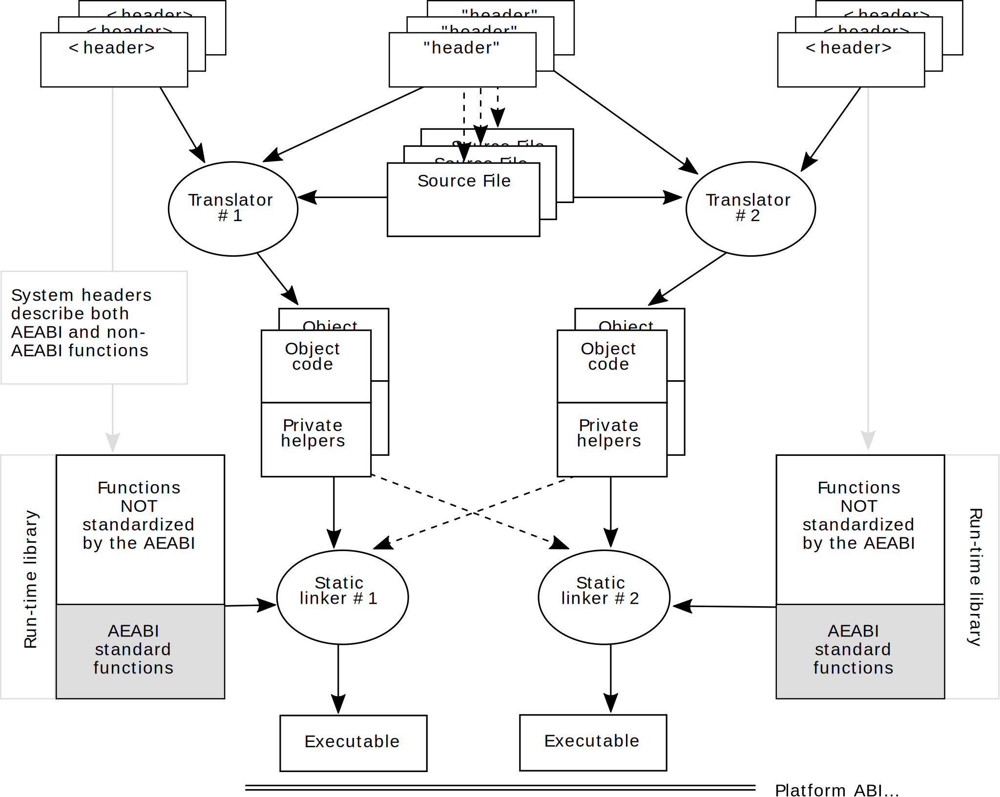

..
   Copyright (c) 2003, 2005-2007, 2009, 2012, 2015, 2018, 2020-2022, Arm Limited and its affiliates.  All rights reserved.
   CC-BY-SA-4.0 AND Apache-Patent-License
   See LICENSE file for details

.. |release| replace:: 2022Q3
.. |date-of-issue| replace:: 20\ :sup:`th` October 2022
.. |copyright-date| replace:: 2003, 2005-2007, 2009, 2012, 2015, 2018, 2020-2022
.. |footer| replace:: Copyright © |copyright-date|, Arm Limited and its
                      affiliates. All rights reserved.

.. _AAELF32: https://github.com/ARM-software/abi-aa/releases
.. _AAPCS32: https://github.com/ARM-software/abi-aa/releases
.. _BSABI32: https://github.com/ARM-software/abi-aa/releases
.. _CLIBABI32: https://github.com/ARM-software/abi-aa/releases
.. _CPPABI32: https://github.com/ARM-software/abi-aa/releases
.. _RTABI32: https://github.com/ARM-software/abi-aa/releases

.. role:: c(code)
   :language: c

.. role:: cpp(code)
   :language: cpp

C Library ABI for the Arm® Architecture
************************************************

.. class:: version

|release|

.. class:: issued

Date of Issue: |date-of-issue|

.. class:: logo

.. image:: Arm_logo_blue_RGB.svg
   :scale: 30%

.. section-numbering::

.. raw:: pdf

   PageBreak oneColumn

Preamble
========

Abstract
--------

This document defines an ANSI C (C89) run-time library ABI for programs written
in Arm and Thumb assembly language, C, and stand alone C++.

Keywords
--------

C library ABI, run-time library

Latest release and defects report
---------------------------------

Please check `Application Binary Interface for the Arm® Architecture
<https://github.com/ARM-software/abi-aa>`_ for the latest
release of this document.

Please report defects in this specification to the `issue tracker page
on GitHub
<https://github.com/ARM-software/abi-aa/issues>`_.

.. raw:: pdf

   PageBreak

Licence
-------

This work is licensed under the Creative Commons
Attribution-ShareAlike 4.0 International License. To view a copy of
this license, visit http://creativecommons.org/licenses/by-sa/4.0/ or
send a letter to Creative Commons, PO Box 1866, Mountain View, CA
94042, USA.

Grant of Patent License. Subject to the terms and conditions of this
license (both the Public License and this Patent License), each
Licensor hereby grants to You a perpetual, worldwide, non-exclusive,
no-charge, royalty-free, irrevocable (except as stated in this
section) patent license to make, have made, use, offer to sell, sell,
import, and otherwise transfer the Licensed Material, where such
license applies only to those patent claims licensable by such
Licensor that are necessarily infringed by their contribution(s) alone
or by combination of their contribution(s) with the Licensed Material
to which such contribution(s) was submitted. If You institute patent
litigation against any entity (including a cross-claim or counterclaim
in a lawsuit) alleging that the Licensed Material or a contribution
incorporated within the Licensed Material constitutes direct or
contributory patent infringement, then any licenses granted to You
under this license for that Licensed Material shall terminate as of
the date such litigation is filed.

About the license
-----------------

As identified more fully in the Licence_ section, this project
is licensed under CC-BY-SA-4.0 along with an additional patent
license.  The language in the additional patent license is largely
identical to that in Apache-2.0 (specifically, Section 3 of Apache-2.0
as reflected at https://www.apache.org/licenses/LICENSE-2.0) with two
exceptions.

First, several changes were made related to the defined terms so as to
reflect the fact that such defined terms need to align with the
terminology in CC-BY-SA-4.0 rather than Apache-2.0 (e.g., changing
“Work” to “Licensed Material”).

Second, the defensive termination clause was changed such that the
scope of defensive termination applies to “any licenses granted to
You” (rather than “any patent licenses granted to You”).  This change
is intended to help maintain a healthy ecosystem by providing
additional protection to the community against patent litigation
claims.

Contributions
-------------

Contributions to this project are licensed under an inbound=outbound
model such that any such contributions are licensed by the contributor
under the same terms as those in the `Licence`_ section.

Trademark notice
----------------

The text of and illustrations in this document are licensed by Arm
under a Creative Commons Attribution–Share Alike 4.0 International
license ("CC-BY-SA-4.0”), with an additional clause on patents.
The Arm trademarks featured here are registered trademarks or
trademarks of Arm Limited (or its subsidiaries) in the US and/or
elsewhere. All rights reserved. Please visit
https://www.arm.com/company/policies/trademarks for more information
about Arm’s trademarks.

Copyright
---------

Copyright (c) |copyright-date|, Arm Limited and its affiliates.  All rights
reserved.

.. raw:: pdf

   PageBreak

.. contents::
   :depth: 3

.. raw:: pdf

   PageBreak

About this document
===================

Change control
--------------

Current status and anticipated changes
^^^^^^^^^^^^^^^^^^^^^^^^^^^^^^^^^^^^^^

The following support level definitions are used by the Arm ABI specifications:

**Release**
   Arm considers this specification to have enough implementations, which have
   received sufficient testing, to verify that it is correct. The details of these
   criteria are dependent on the scale and complexity of the change over previous
   versions: small, simple changes might only require one implementation, but more
   complex changes require multiple independent implementations, which have been
   rigorously tested for cross-compatibility. Arm anticipates that future changes
   to this specification will be limited to typographical corrections,
   clarifications and compatible extensions.

**Beta**
   Arm considers this specification to be complete, but existing
   implementations do not meet the requirements for confidence in its release
   quality. Arm may need to make incompatible changes if issues emerge from its
   implementation.

**Alpha**
   The content of this specification is a draft, and Arm considers the
   likelihood of future incompatible changes to be significant.

All content in this document is at the **Release** quality level.

Change history
^^^^^^^^^^^^^^

If there is no entry in the change history table for a release, there are no
changes to the content of the document for that release.

.. class:: clibabi32-change-history

+-------------+-------------------------------+---------------------------------------------------------------------------------------------------------------------------------------------------------------------------------------------------------+
| Issue       | Date                          | Change                                                                                                                                                                                                  |
+=============+===============================+=========================================================================================================================================================================================================+
| 0.1         |                               | First public DRAFT.                                                                                                                                                                                     |
+-------------+-------------------------------+---------------------------------------------------------------------------------------------------------------------------------------------------------------------------------------------------------+
| 2.0         | 24\ :sup:`th` March 2005      | First public release.                                                                                                                                                                                   |
+-------------+-------------------------------+---------------------------------------------------------------------------------------------------------------------------------------------------------------------------------------------------------+
| 2.01        | 4\ :sup:`th` July 2005        | First batch of typographical corrections. Added stdbool.h.                                                                                                                                              |
+-------------+-------------------------------+---------------------------------------------------------------------------------------------------------------------------------------------------------------------------------------------------------+
| 2.02        | 5\ :sup:`th` October 2005     | Clarified the intention behind \_\_B and isblank() in `Encoding of ctype table entries and macros (\_AEABI\_PORTABILITY\_LEVEL != 0)`_. Fixed the clash with the C99 specification.                     |
+-------------+-------------------------------+---------------------------------------------------------------------------------------------------------------------------------------------------------------------------------------------------------+
| 2.03        | 5\ :sup:`th` May 2006         | Corrected misinformation in `signal.h`_ concerning (non-)atomic access to 8-byte types using ldrd/strd/ldm/stm.                                                                                         |
+-------------+-------------------------------+---------------------------------------------------------------------------------------------------------------------------------------------------------------------------------------------------------+
| 2.04 /      | 25\ :sup:`th` October 2007    | In `Private names for private and AEABI-specific helper functions`_, used the common table of registered vendor names                                                                                   |
| A           |                               | Document renumbered (formerly GENC-003539 v2.04).                                                                                                                                                       |
+-------------+-------------------------------+---------------------------------------------------------------------------------------------------------------------------------------------------------------------------------------------------------+
| B           | 4\ :sup:`th` November 2009    | Added `C++ names of C library functions`_ explaining why, in C++ generating portable binary, standard library functions should be used via extern “C” linkage.                                          |
+-------------+-------------------------------+---------------------------------------------------------------------------------------------------------------------------------------------------------------------------------------------------------+
| C r2.09     | 30\ :sup:`th` November 2012   | `assert.h`_ Clarified the intended method of customizing assert(). `setjmp.h`_ Corrected calculation of minimum jmp\_buf size (previously given as 24 double-words).                                    |
+-------------+-------------------------------+---------------------------------------------------------------------------------------------------------------------------------------------------------------------------------------------------------+
| D r2.10     | 24\ :sup:`th` November 2015   | `wchar.h`_ Permit wint\_t to be unsigned int.                                                                                                                                                           |
+-------------+-------------------------------+---------------------------------------------------------------------------------------------------------------------------------------------------------------------------------------------------------+
| 2018Q4      | 21\ :sup:`st` December 2018   | Minor typographical fixes, updated links.                                                                                                                                                               |
+-------------+-------------------------------+---------------------------------------------------------------------------------------------------------------------------------------------------------------------------------------------------------+
| 2020Q3      | 1\ :sup:`st` October 2020     | - document released on Github                                                                                                                                                                           |
|             |                               | - new Licence_: CC-BY-SA-4.0                                                                                                                                                                            |
|             |                               | - new sections on Contributions_, `Trademark notice`_, and Copyright_                                                                                                                                   |
+-------------+-------------------------------+---------------------------------------------------------------------------------------------------------------------------------------------------------------------------------------------------------+
| 2021Q1      | 12\ :sup:`th` April 2021      | Suggest placement of `BTI` after `setjmp` calls.                                                                                                                                                        |
+-------------+-------------------------------+---------------------------------------------------------------------------------------------------------------------------------------------------------------------------------------------------------+

This document refers to, and is referred to by, the following documents.

+----------------------------+--------------------------+-----------------------------------------------------+
| Ref                        | URL or other reference   | Title                                               |
+============================+==========================+=====================================================+
| AAELF32_                   |                          | ELF for the Arm Architecture.                       |
+----------------------------+--------------------------+-----------------------------------------------------+
| AAPCS32_                   |                          | Procedure Call Standard for the Arm Architecture.   |
+----------------------------+--------------------------+-----------------------------------------------------+
| BSABI32_                   |                          | ABI for the Arm Architecture (Base Standard).       |
+----------------------------+--------------------------+-----------------------------------------------------+
|         CLIBABI32_         | *This document*          | C Library ABI for the Arm Architecture              |
+----------------------------+--------------------------+-----------------------------------------------------+
| CPPABI32_                  |                          | C++ ABI for the Arm Architecture                    |
+----------------------------+--------------------------+-----------------------------------------------------+
| RTABI32_                   |                          | Run-time ABI for the Arm Architecture.              |
+----------------------------+--------------------------+-----------------------------------------------------+

Terms and abbreviations
-----------------------

The ABI for the Arm Architecture uses the following terms and abbreviations:

AAPCS
   Procedure Call Standard for the Arm Architecture

ABI
   Application Binary Interface:

   1. The specifications to which an executable must conform in order to
      execute in a specific execution environment. For example, the
      *Linux ABI for the Arm Architecture*.

   2. A particular aspect of the specifications to which independently produced
      relocatable files must conform in order to be statically linkable and
      executable.  For example, the `AAELF32`_, `RTABI32`_, ...

AEABI
   (Embedded) ABI for the Arm architecture (this ABI...)

Arm-based
   ... based on the Arm architecture ...

Branch Target Identification
   Security technique ensuring a degree of control flow integrity by marking
   valid targets of indirect branches.

core registers
   The general purpose registers visible in the Arm architecture’s
   programmer’s model, typically r0-r12, SP, LR, PC, and CPSR.

EABI
   An ABI suited to the needs of embedded, and deeply embedded (sometimes
   called *free standing*), applications.

Q-o-I
   Quality of Implementation – a quality, behavior, functionality, or
   mechanism not required by this standard, but which might be provided
   by systems conforming to it. Q-o-I is often used to describe the
   toolchain-specific means by which a standard requirement is met.

VFP
   The Arm architecture’s Floating Point architecture and instruction
   set. In this ABI, this abbreviation includes all floating point
   variants regardless of whether or not vector (V) mode is supported.

Acknowledgements
----------------

This specification has been developed with the active support of the
following organizations. In alphabetical order: Arm, CodeSourcery,
Intel, Metrowerks, Montavista, Nexus Electronics, PalmSource, Symbian,
Texas Instruments, and Wind River.

Scope
=====

Conformance to the *ABI for the Arm architecture* [BSABI32_] supports
inter-operation between:

-  Relocatable objects generated by different toolchains.

-  Executables and shared objects generated for the same execution
   environment by different toolchains.

This standard for C library functions allows a relocatable object built
by one conforming toolchain from Arm-Thumb assembly language, C, or
standalone C++ to be compatible with the static linking environment
provided by a different conforming toolchain.

.. _clibabi32-fig1:

  Inter-operation between relocatable objects

In this model of inter-working, the standard headers used to build a
relocatable object are those associated with the toolchain building it,
not those associated with the library with which the object will,
ultimately, be linked.

.. raw:: pdf

   PageBreak

Introduction
============

A number of principles of inter-operation are implicit in, or compatible
with, `clibabi32-fig1`_, above. This section describes these principles
precisely, as they apply to a C library, and gives a rationale for each
one. The corresponding section of [RTABI32_] discusses the same
principles as they apply to run-time helper functions.

Most C library functions have a standard ABI
--------------------------------------------

C library functions are declared explicitly in standard headers.

As shown in `The C library`_, below, it is possible to standardize the interface
to almost all the C library. However, it is very difficult to treat the C++
library the same way. Too much of the implementation of the C++ library is in
the standard headers. Standardizing a binary interface to the C++ library is
equivalent to standardizing its implementations.

Among C library functions we can distinguish the following categories.

-  Functions whose type signatures and argument ranges are precisely
   defined by a combination of the C standard and this ABI standard for
   data type size and alignment given in the [AAPCS32_]. These functions
   already have a standardized binary interface.

-  Functions that would fall in the above category if there were
   agreement about the layout of a structure that is only partly defined
   by the C standard, or agreement about the range and meaning of
   controlling values passed to the function for which the C standard
   gives only a macro name.

-  Functions that take as arguments pointers to structures whose fields
   are not defined by the standard (FILE, mbstate\_t, fpos\_t,
   jmp\_buf), that can be standardized by considering the structures to
   be opaque. (But beware FILE, which is also expected to be accessed
   non-opaquely).

-  Miscellanea such as errno, va\_arg, va\_start, and the ctype
   functions that are expected to be implemented by macros in ways that
   are unspecified by the standard. These must be examined case by case.

The C library declares few data objects, so standardization is concerned
almost exclusively with functions.

**Some standard functions may be inlined**

The C and C++ standards allows compilers to recognize standard library
functions and treat them specially, provided that such recognition does
not depend on the inclusion of header files. In practice, this allows a
compiler to inline any library function that neither reads nor writes
program state (such as the state of the heap or the locale) managed by
the library.

Already standardized C library functions
^^^^^^^^^^^^^^^^^^^^^^^^^^^^^^^^^^^^^^^^

Already standardized functions include those whose type signatures
include only primitive types, defined synonyms for primitive types (such
as ``size_t``), or obvious synonyms for primitive types (such as ``time_t``
and ``clock_t``). Whole sections of the C library (for example, that
described by string.h) fall into this category.

Each such function is already very precisely defined.

-  Its type signature is fixed.

-  Its name is fixed by the C language standard.

-  With some exceptions clearly identified by the C language standard
   (for example, whether malloc(0) ≠ NULL), Its behavior is fixed by the
   C language standard.

Nearly standardized C library functions
^^^^^^^^^^^^^^^^^^^^^^^^^^^^^^^^^^^^^^^

Functions that would already be standardized were it not for depending
on the layout of a structure or the value of a controlling constant are
prime candidates for standardizing. In many cases, there is already
general consensus about layout or values.

**Structure layout**

The C standard defines only the fields that *must* be present in the
structures it defines (lconv, tm, div\_t, ldiv\_t). It does not define
the order of fields, and it gives latitude to implementers to add
fields.

In practice, most implementations use only the defined fields in the
order listed in the C standard. In conjunction with the POD structure
layout rules given in the AAPCS this effectively standardizes the ABI to
functions that manipulate these structures.

.. note::

  fpos\_t, mbstate\_t, and FILE, which have no standard-defined fields,
  do not have this property.

**Controlling values**

For controlling values there are some universal agreements (for example,
about the values of NULL, SEEK\_\*, EXIT\_\*) and some disagreements
(about the values of LC\_\*, \_IO\*BF, etc).

C library functions operating on potentially opaque structures
^^^^^^^^^^^^^^^^^^^^^^^^^^^^^^^^^^^^^^^^^^^^^^^^^^^^^^^^^^^^^^

Functions that take as arguments pointers to structures whose fields are
not defined by the standard (FILE, mbstate\_t, fpos\_t, jmp\_buf) can be
standardized only if those structures are made opaque.

-  Unfortunately, we must be able to define objects of all of these
   types except FILE (a library client only ever allocates objects of
   type FILE \*), so the size of each object must be standardized even
   if the contents are not.

-  Functions that manipulate types opaquely cannot be implemented
   inline. Thus getc, putc, getchar, putchar, and so on must be out of
   line functions. This might be acceptable in a deeply embedded
   application, but is unlikely to be unconditionally acceptable in high
   performance platform ABIs where there is a history of these functions
   being implemented by macros that operate on the implementation of
   FILE.

In `The C library`_, below, these functions are considered case by case under
the library sub-sections that declare them.

Miscellanea
^^^^^^^^^^^

The implementations of macros such as errno, va\_arg, va\_start, and the
ctype functions are unspecified by the C standard. These must be
considered case by case.

-  The va\_\* macros essentially disappear. The type va\_list and the
   binary interface to variadic functions are standardized by the AAPCS.
   We simply require compilers to inline what remains.

-  There is probably no completely satisfactory cross platform
   definition of *errno*. `errno.h`_, below, proposes a definition well suited
   to deeply embedded use, and adequately efficient elsewhere.

-  For the ctype macros there is no escaping calling a function in the
   general case.

(Consider how to handle changing locale, as must be done by an
application that processes Chinese, Japanese, or Korean characters,
because the C library is defined to start in the “C” locale).

The ctype functions are discussed further in `ctype.h`_, below.

A C library is all or nothing
-----------------------------

In general, a function (for example, malloc) from vendor A's C library
will not work with a function (for example, free) from vendor B's C
library. Granted, large tracts of C library will be independent leaf (or
near leaf) functions, portable between toolchains (strlen, strcpy,
strstr, etc), and vendors will work hard to ensure that a statically
linked program will only include the functions it needs. Nonetheless,
tangled clumps of implementation might underlie many apparently
independent parts of a run-time library's public interface.

In some cases, there may be an element of conspiracy between the
run-time libraries, the static linker, and the ultimate execution
environment. For example, the way that a program acquires its startup
code (sometimes called crt0.o) may depend on the library and the static
linker, as well as the execution environment.

This leads us to a major conclusion for statically linked executables:

-  **The static linker and the language run-time libraries must be from
   the same toolchain**.

Accepting this constraint gives considerable scope for private arrangements (not
governed by this ABI) between these toolchain components, restricted only by
the requirement to provide a well defined binary interface (ABI) to the
functions described in `Most C library functions have a standard ABI`_, above.

Important corollaries of this C library standardization model
-------------------------------------------------------------

System headers *can* require compiler-specific functionality (e.g. for
handling va\_start, va\_arg, etc). The resulting binary code must
conform to the ABI.

As far as this ABI is concerned, a standard library header is processed
only by a matching compiler. A platform ABI can impose further
constraints that cause more compilers to match, but this ABI does not.

This ABI defines the full set of public helper functions required to
support portable access to a C library. Every ABI-conforming toolchain's
run-time library must implement these helper functions.

The header describing an ABI-conforming object must contain only
standard-conforming source language.

.. admonition:: Aside
   :class: note

   That does not preclude compiler-specific directives that are properly
   guarded in a standard conforming way. For example: #ifdef \_\_CC\_ARM...
   #pragma..., and so on. However, such directives must not change the ABI
   conformance of the generated binary.

Private names for private and AEABI-specific helper functions
-------------------------------------------------------------

External names used by private helper functions and private helper data
must be in the vendor-specific name space reserved by this ABI. All such
names use the format \_\_vendor\_name.

For example (from the C++ exception handling ABI):

\_\_\ **aeabi**\ \_unwind\_cpp\_pr0
\_\_\ **ARM**\ \_Unwind\_cpp\_prcommon

The *vendor* prefix must be registered with the maintainers of this ABI
specification. Prefixes must not contain underscore ('\_') or dollar
('$'). Prefixes beginning with *Anon* and *anon* are reserved to
unregistered use.

.. raw:: pdf

   PageBreak

.. include:: vendor-table.txt

To register a vendor prefix with Arm, please E-mail your request to
arm.eabi at arm.com.

.. raw:: pdf

   PageBreak

The C library
=============

C Library overview
------------------

The C Library ABI for the Arm architecture is associated with the headers listed
in `C library headers`_ below. Some are defined by the ANSI 1989 (ISO
1990) standard for C (called C89 in this document), some by addenda to
it, and some by the 1999 standard for C (called C99 in this document).
Most are in the set of headers considered by §17.4.1.2 of the ANSI 1998
C++ standard to provide *Headers for C Library Facilities*. These are
denoted in the table below by ‘C’.

.. _C library headers:

.. class:: clibabi32-c-library-headers

.. table:: C library headers

  +--------------+--------------+---------------------------------------------------------------------------------------------------------------+
  | Header       | Origin       | Comment                                                                                                       |
  +==============+==============+===============================================================================================================+
  | assert.h     | C            | See `assert.h`_. Standardize \_\_aeabi\_assert(const char\*, const char\*, int).                              |
  +--------------+--------------+---------------------------------------------------------------------------------------------------------------+
  | ctype.h      | C            | See `ctype.h`_. Inlined macros cause difficulties for standardization.                                        |
  +--------------+--------------+---------------------------------------------------------------------------------------------------------------+
  | errno.h      | C            | See `errno.h`_.                                                                                               |
  +--------------+--------------+---------------------------------------------------------------------------------------------------------------+
  | float.h      | C            | Defined by Arm’s choice of 32 and 64-bit IEEE 2’s complement format.                                          |
  +--------------+--------------+---------------------------------------------------------------------------------------------------------------+
  | inttypes.h   | C99          | Defined by the AAPCS and commonsense.                                                                         |
  +--------------+--------------+---------------------------------------------------------------------------------------------------------------+
  | iso646.h     | C            | Defined by entirely the C standard.                                                                           |
  +--------------+--------------+---------------------------------------------------------------------------------------------------------------+
  | limits.h     | C            | See `limits.h`_. Defined by the AAPCS (save for MB\_LEN\_MAX).                                                |
  +--------------+--------------+---------------------------------------------------------------------------------------------------------------+
  | locale.h     | C            | See `locale.h`_.                                                                                              |
  +--------------+--------------+---------------------------------------------------------------------------------------------------------------+
  | math.h       | C            | See `math.h`_. All fixed apart from HUGE\_VAL and related C99 definitions.                                    |
  +--------------+--------------+---------------------------------------------------------------------------------------------------------------+
  | setjmp.h     | C            | jmp\_buf must be defined, setjmp and longjmp must not be inlined.                                             |
  +--------------+--------------+---------------------------------------------------------------------------------------------------------------+
  | signal.h     | C            | See `signal.h`_. Definitions of SIG\_DFL, SIG\_IGN, SIG\_ERR, & signal #s are controversial.                  |
  +--------------+--------------+---------------------------------------------------------------------------------------------------------------+
  | stdarg.h     | C            | va\_list is defined by AAPCS. Other artifacts are inline (compiler-defined)                                   |
  +--------------+--------------+---------------------------------------------------------------------------------------------------------------+
  | stdbool.h    | C99          | Defined by entirely the C standard                                                                            |
  +--------------+--------------+---------------------------------------------------------------------------------------------------------------+
  | stddef.h     | C            | Defined by the AAPCS.                                                                                         |
  +--------------+--------------+---------------------------------------------------------------------------------------------------------------+
  | stdint.h     | C99          | Defined by the Arm architecture + AAPCS + C standard.                                                         |
  +--------------+--------------+---------------------------------------------------------------------------------------------------------------+
  | stdio.h      | C            | See `stdio.h`_. Inlined macros and properties of the environment cause difficulties.                          |
  +--------------+--------------+---------------------------------------------------------------------------------------------------------------+
  | stdlib.h     | C            | See `stdlib.h`_. All fixed apart from MB\_CUR\_MAX.                                                           |
  +--------------+--------------+---------------------------------------------------------------------------------------------------------------+
  | string.h     | C            | The interface is fixed by the AAPCS data type size rules.                                                     |
  +--------------+--------------+---------------------------------------------------------------------------------------------------------------+
  | time.h       | C            | See `time.h`_. CLOCKS\_PER\_SEC is a property of the execution environment.                                   |
  +--------------+--------------+---------------------------------------------------------------------------------------------------------------+
  | wchar.h      | C            | See `wchar.h`_. No issues apart from mbstate\_t.                                                              |
  +--------------+--------------+---------------------------------------------------------------------------------------------------------------+
  | wctype.h     | C            | See `wctype.h`_. Defined by the AAPCS and commonsense.                                                        |
  +--------------+--------------+---------------------------------------------------------------------------------------------------------------+

The C library standardization model
-----------------------------------

Purpose and principles
^^^^^^^^^^^^^^^^^^^^^^

The purpose of standardizing a binary interface to the ANSI C library is
to support creating portable binaries that can use that library. To this
end we want to categorize developments as being of one of two kinds:

-  Those that develop applications.

-  Those that develop portable binaries.

An application is built using a single toolchain. The executable may
include statically linkable binary code from a 3rd party, built using a
different toolchain. It may later be dynamically linked into an
execution environment based on, or built by, yet another toolchain.

A portable binary may be relocatable object code for static linking or
an executable for dynamic linking.

**Principles**

Whatever we do to support the creation of an ABI standard for the C
library must be compatible with the library sections of the C and C++
language standards, from the perspective of application code. It can
conflict with and overrule these language standards only if invited to
do so by portable code.

**Corollary**: Anything reducing the guarantees given by a language
standard must be guarded by:

  ``#if _AEABI_PORTABILITY_LEVEL != 0``

The ability to make portable binaries must impose no costs on
non-portable application code. Portable code may incur costs including
reduced performance and, or, loss of standard language guarantees.

The cost of supporting portable binaries must be moderate for run-time
libraries. Ideally, we should restrict the requirements to that which
existing run-time libraries can support via pure extension and
additional veneers.

Obstacles to creating a C library ABI
^^^^^^^^^^^^^^^^^^^^^^^^^^^^^^^^^^^^^

Within a C library header file there are several different sorts of
declaration that affect binary inter-working.

-  Function declarations. Most of these have no consequences for binary
   compatibility because:

  - For non-variadic functions the C standard guarantees that a function
    with that name will exist (because the user is entitled to
    declare it without including any library header).

  - The meaning of the function is specified by the standard.

  - The type signature involves only primitive types, and these are
    tightly specified by the AAPCS.

  An ABI standardization issue arises where an argument is not a primitive
  type.

-  Macro definitions. Many expand to constants, a few to implementation
   functions.

  - Many of the constant values follow from the C standard, the IEEE 754
    FP standard, and the AAPCS. There is no choice of value for
    Arm-Thumb.

  - Some constants such as EOF and NULL are uncontroversial and can be
    standardized.

  An ABI issue arises if a constant does not have a consensus value and if
  a function is inlined.

-  Structure and type definitions.

  - Most C library typedefs name primitive types fully defined by the
    AAPCS.

  - Structure declarations affect binary inter-working only if there is
    variation in the size, alignment, or order of fields.

  An ABI issue arises if the content and field order of a structure is not
  fully specified by the standard.

Compile-time constants that cannot be constant at compile time
~~~~~~~~~~~~~~~~~~~~~~~~~~~~~~~~~~~~~~~~~~~~~~~~~~~~~~~~~~~~~~

The C library binds many constants at compile time that are properties
of the target execution environment. Examples include \_IO\*BF, LC\_\*,
EDOM, ERANGE, EILSEQ, SIG\*, CLOCKS\_PER\_SEC, FILENAME\_MAX.

In some cases, there is consensus about the values of controlling
constants. For example, there is near universal consensus about the
values of NULL, SEEK\_\*, EXIT\_\*, EDOM, ERANGE (but not EILSEQ), most of
SIG\* (but not, universally, SIGABRT).

These constants simply cannot be bound at compile time (as required by
ANSI) if we want a portable binary. Instead, they must be bound at link
time, or queried at run-time.

Inadequately specified structures
~~~~~~~~~~~~~~~~~~~~~~~~~~~~~~~~~

The interface to the C library includes inadequately specified
structures such as lconv, tm, and \*div\_t.

In fact, lconv, tm, and \*div\_t are the only structures not defined
opaquely. For the others, we need to know at most the size and
alignment. Even FILE is unproblematic, because (save for access by
inline functions) it is always accessed opaquely via a FILE \*.

Inline functions that expose implementation details
~~~~~~~~~~~~~~~~~~~~~~~~~~~~~~~~~~~~~~~~~~~~~~~~~~~

The C Library permits and encourages certain functions to be implemented
inline via macros that expose otherwise hidden details of the
implementation.

The ctype functions provide a clear illustration, though getc, putc,
getchar, putchar, and sometimes feof and ferror, are equally difficult.

Of the ctype functions, isdigit and isxdigit can be inlined without
reference to the target environment, though in practice, only isdigit
can be efficiently inlined without helper functions or helper tables.

-  Isdigit can be inlined in 2 Arm or Thumb instructions.

-  Inline isxdigit takes 5 Arm or 8 Thumb instructions compared to 2-3
   using a 256 byte helper table.

Under-specified exported data
~~~~~~~~~~~~~~~~~~~~~~~~~~~~~

There are some under-specified data exported by the C library,
specifically errno, stdin, stdout, and stderr.

In the case of errno, the requirement is to expand to a modifiable
l-value. The most general form of modifiable l-value is something like
(\*\_\_aeabi\_errno()), and this can be layered efficiently on any
environment.

Stdin, stdout, and stderr must expand to expressions of type *pointer to
FILE*. In practice, execution environments either define stdin to have
type FILE \* or define stdin to be the address of a FILE object. The
former definition is slightly more general in that it can be trivially
layered on an underlying environment of either sort (either by being a
synonym for the underlying FILE \*, or a location statically initialized
to the address of the FILE).

Our approach to defining a C library ABI
^^^^^^^^^^^^^^^^^^^^^^^^^^^^^^^^^^^^^^^^

Compile time constants
~~~~~~~~~~~~~~~~~~~~~~

The first step is to deal with the controlling values C89 treats as
compile-time constants that cannot be constant at compile time. We can
categorize each group of such constants in one of three ways.

-  Everyone agrees all the values. Examples include NULL, SEEK\_\*,
   EXIT\_\*. These remain constants.

-  Different implementations disagree about the values. Examples include
   \_IO\*BF, LC\_\*. This is the *black* list.

-  Most implementations agree about most of the values. Examples include
   EDOM, ERANGE, and SIG\* excluding SIGABRT. This is the *grey* list.

Black list items must become link-time constants or run-time queries.
Link-time constants are more efficient for the client and no more
difficult for the execution environment. In both cases they can be
supported as a thin veneer on an existing execution environment.
Name-space pollution is the only serious standardization issue, but use
of names of the form \_\_aeabi\_xxx and \_AEABI\_XXX deals with that for
C.

Because this change violates the ANSI standard, it must be guarded by:

    ``#if _AEABI_PORTABILITY_LEVEL != 0.``

Grey list items are a little more difficult. There are two options.

-  Treat each group as *black* or *white* on a case by case basis.

-  Treat the consensus members as *white* and the remainder as *black*.

Consider , ERANGE, and EILSEQ from errno.h. This is a grey list category
because there is consensus that = 33 and ERANGE = 34, but no consensus
(even among Unix-like implementations) about EILSEQ.

In practice, these values will be rarely accessed by portable code, so
there is no associated performance or size issue, and they should all be
considered *black* to maximize portability.

A similar argument suggests all the SIG\* values should be considered
*black*. Portable code will rarely raise a signal, and there is no
overhead on the run-time environment to define the link-time constants,
so we might as well err on the side of portability.

Thus a clear principle emerges that seems to work robustly and satisfy all of
principles and goals stated in `Purpose and principles`_. Namely, if any member
of a related group of manifest constants does not have a consensus value, the
whole group become link-time constants when \_AEABI\_PORTABILITY\_LEVEL != 0.

A general template for managing this is:

.. code-block:: none

  #if _AEABI_PORTABILITY_LEVEL == 0
  #  define XXXX ....
  #else
     extern const int __aeabi_XXXX;
  #  define XXXX  (__aeabi_XXXX)
  #endif

In other words, the compile time constant XXXX becomes the constant
value \_\_aeabi\_XXXX (unless XXXX begins with an underscore, in which
case underscores are omitted until only one remains after \_\_aeabi)..

This much imposes no overheads on non-portable (application) code, only
trivial compliance overhead (provide a list of constant definitions) on
toolchains and execution environments, and only a small tax on portable
binaries.

Structures used in the C library interface
~~~~~~~~~~~~~~~~~~~~~~~~~~~~~~~~~~~~~~~~~~

**Opaque structures**

Some structures are used opaquely by library code. Examples include
fpos\_t, mbstate\_t, and jmp\_buf. The key issue for a portable client
using such a structure is to allocate sufficient space, properly
aligned. In most cases this involves a straightforward decision.

The trickiest case of these three is jmp\_buf, whose size is really a
feature of the execution environment. When \_AEABI\_PORTABILITY\_LEVEL
!= 0 the definition should be reduced to one that is adequate for
declaring parameters and extern data, but inadequate for reserving
space. A suitable definition is:

.. code-block:: c

   typedef long long jmp_buf[];

A portable binary must contrive to obtain any needed jmp\_buf structures
from its client environment, either via parameters or extern data, and
neither setjmp nor longjmp can be inlined.

.. admonition:: Aside
   :class: note

   A link-time value \_\_aeabi\_JMP\_BUF\_SIZE would support allocating a
   jmp\_buf using malloc.

The \*div\_t structures are formal requirements of the C standard. They
are unlikely to be used in the Arm world. We will define them consistent
with the Arm helper functions for division. When
\_AEABI\_PORTABILITY\_LEVEL != 0 the definitions should simply disappear
(in order to remove a marginal portability hazard).

Two structures – tm and lconv – are definitely not opaque, and we
discuss them further below.

**struct tm**

Most implementers agree that struct tm should be declared to be the
C89/C99 fields in the order listed in the standards. BSD systems add two
additional fields at the end relating to the time zone. It is a defect
in BSD that a call to strftime() with a struct tm in which the
additional fields have not been initialized properly can crash, even
when the format string has no need to access the fields. We have
reported this defect to the BSD maintainers.

This ABI defines struct tm to contain two extra, trailing words that
must not be used by ABI-conforming code.

**struct lconv**

Unfortunately, lconv has been extended between C89 and C99 (with 6
additional fields) and the C89 field order has changed in the C99
standard (though the new fields are listed last). Fortunately, lconv is
generated by a C library, but not consumed by a C library. It is output
only. That allows us to define the field order for portable objects,
provided a portable object never passes a struct lconv to a non-portable
object. In other words, when \_AEABI\_PORTABILITY\_LEVEL != 0, struct
lconv should be replaced by struct \_\_aeabi\_lconv, and localeconv by
\_\_aeabi\_localeconv. We define the field order to be the C89 order
followed by the new fields, so in many cases \_\_aeabi\_localeconv will
simply be a synonym for localeconv. At worst it will be a small veneer.

Inline functions
~~~~~~~~~~~~~~~~

Inline functions damage portability if they refer directly to details of
a hidden implementation. In C89, this problem is usually caused by the
ctype functions *is*\ xxxxx and *toyyyy*, and the stdio functions getc,
putc, getchar, putchar, and feof. (When new inline/macro functions are
added to a header, the inline/macro implementations must be hidden when
\_AEABI\_PORTABILITY\_LEVEL != 0).

In stdio, only feof generates a cogent case on performance grounds for
being inline (a case weakened by getc etc returning EOF). The get and
put functions are so complex – inevitably embedding a function call –
that being inline saves little other than the cost of the function call
itself. The C standard requires functions to exist in every case, so the
required header change when \_AEABI\_PORTABILITY\_LEVEL != 0 is simply
to hide some macro definitions

That leaves the ctype *is*\ xxxxx functions, excluding isdigit() which
can always be inlined most efficiently without helper functions or
tables. For these functions there is a choice when
\_AEABI\_PORTABILITY\_LEVEL != 0.

-  They can be out of line (isdigit excepted). This always works,
   imposes no overhead on the execution environment, and delivers the
   semantic guarantees of the standard to portable code.

-  There can be a defined tabular implementation that the execution
   environment must support.

The second option can be a near zero cost addition to an existing
execution environment provided a portable binary can bind statically to
its ctype locale. All that needs to be provided are tables with defined
names. No upheaval is required in the underlying ctype/locale system.

The choice available to a user building a portable binary is then
between the following.

-  All ctype functions are out of line (save isdigit and, perhaps,
   isxdigit).

  This is the appropriate choice when ctype performance does not matter,
  or the code must depend on the dynamic choice of ctype locale.

-  All ctype functions are inlined using a helper table appropriate to
   the statically chosen ctype locale.

  The implementation is sketched in `ctype.h`_, below. The binding is managed by
  defining \_AEABI\_LC\_CTYPE to be one of C, ISO8859\_1, or SJIS.

  This is the appropriate choice when the ctype locale is known statically
  and performance *does* matter.

Naming issues in C++ header files
^^^^^^^^^^^^^^^^^^^^^^^^^^^^^^^^^

Names introduced by this C library ABI into <c\ *yyy*\ > headers
~~~~~~~~~~~~~~~~~~~~~~~~~~~~~~~~~~~~~~~~~~~~~~~~~~~~~~~~~~~~~~~~

Identifiers introduced by the AEABI are of the form \_\_aeabi\_\ *xxxx*
or \_AEABI\_\ *XXX* (macros only).

Identifiers with linkage are all of the form \_\_aeabi\_\ *xxxx* and
must be declared with extern “C” linkage.

An \_\_aeabi\_\ *xxxx* identifier introduced into a <c\ *yyy*\ > header by
expanding a macro XXXX defined by the ANSI C standard for <\ *yyy*\ .h>
belongs to a C++ name-space chosen by the implementation. The C++
standard permits implementations to extend the global namespace and, or,
the *std* namespace with names that begin with an underscore. After
including <c\ *yyy*\ > the expansion of XXXX shall be usable directly by a
C++ program.

A small number of type names and function names are introduced into the
<c\ *yyy*\ > headers by this ABI other than by macro expansion. These are
all of the form \_\_aeabi\_\ *xxxx*. These shall be usable with std:: or
global (::) namespace qualification after including the <c\ *yyy*\ > headers
in which they are declared.

C++ names of C library functions
~~~~~~~~~~~~~~~~~~~~~~~~~~~~~~~~

In most C++ implementations an encoding of a function’s type signature
forms part of the *mangled name* [CPPABI32_] used to name binary functions.
If two sides of an interface (built using different toolchains) specify
different language types to map the same binary type, a naming
incompatibility will arise across the interface.

As a simple example consider ``void fn(int)`` binary compatible under this
ABI with ``void fn(long)``. The first will have the mangled name ``_Z2fni`` and
the second ``_Z2fnl`` [CPPABI32_]. A similar incompatibility occurs between
int and unsigned int (``i`` vs ``j``) describing values restricted to the range
0-MAXINT.

To avoid such difficulties, portable binary code built from C++ source
should refer to standard library functions using their (not mangled) C
names by declaring them to have ``extern`` "C" {...} linkage.

Library file organization
^^^^^^^^^^^^^^^^^^^^^^^^^

The file format for libraries of linkable files is the **ar** format
described in [BSABI32_].

Some factors that need to be considered when making a library file for
use by multiple ABI-conforming toolchains are discussed in [RTABI32_] (in
the *Library file organization* section).

Summary of the inter-toolchain compatibility model
---------------------------------------------------

When a C-library-using source file is compiled to a portable relocatable
file we assume to following.

The source file includes C-library header files associated with the
compiler, not header files associated with the C library binary with
which the object might ultimately be linked (which can be from a
different toolchain, not visible when the object is compiled).

The compiler conforms to the ANSI C standard. If it exercises its right
to recognize C library functions as being special, it will nonetheless
support a mode in which this is done without damaging inter-operation
between toolchains. Thus, for example, functions that read or write
program state managed by the library (heap state, locale state, etc)
must not be inlined in this operating mode.

How a user requests the AEABI-conforming mode from a toolchain is
implementation defined (Q-o-I).

A compiler generates references to 3 kinds of library entity.

-  Those declared in the standard interface to the C library. In many
   cases a user can legitimately declare these in a source program
   without including any library header file.

-  Those defined by the AEABI to be standard helper functions or data
   (this specification and [RTABI32_]).

-  Those provided with the relocatable file (as part of the relocatable
   file, or as a separate, freely distributable library provided with
   the relocatable file).

When generating a portable relocatable file, a compiler must not
generate a reference to any other library entity.

Note that a platform environment will often require all
platform-targeted toolchains to use the same header files (defined by
the platform). Such objects are not portable, but exportable only to a
single environment.

.. raw:: pdf

   PageBreak

The C library section by section
================================

Introduction and conventions
----------------------------

For each section of the C library we describe what must be specified
that is not precisely specified by the ANSI C standard in conjunction
with the data type size and alignment rules given in the [AAPCS32_].

Aspects not listed explicitly are either fully specified as a
consequence of the AAPCS data type size and alignment rules or (like
NULL and EOF) have obvious consensus definitions.

For all aspects mentioned explicitly in this section we tabulate either:

-  The required definition (independent of \_AEABI\_PORTABILITY\_LEVEL).

-  Or, the recommended definition when \_AEABI\_PORTABILITY\_LEVEL = 0
   (if there is one), and the required definition when
   \_AEABI\_PORTABILITY\_LEVEL != 0.

Detecting whether a header file honors an AEABI portability request
^^^^^^^^^^^^^^^^^^^^^^^^^^^^^^^^^^^^^^^^^^^^^^^^^^^^^^^^^^^^^^^^^^^

An application must be able to detect whether its request for AEABI
portability has been honored.

An application should #define \_AEABI\_PORTABILITY\_LEVEL and #undef
\_AEABI\_PORTABLE before including a C library header file that has
obligations under this standard (see `Summary of requirements on C Libraries`_ for a summary). The application
can test whether \_AEABI\_PORTABLE is defined after the inclusion, and
#error if not.

.. table:: Detecting when AEABI portability obligations have been met

  +-----------------------------------------------+----------------------------------------------+
  | Application                                   | Library header                               |
  +===============================================+==============================================+
  | .. code-block:: c                             | .. code-block:: c                            |
  |                                               |                                              |
  |   #define _AEABI_PORTABILITY_LEVEL 1          |                                              |
  |   #undef _AEABI_PORTABLE                      |   #if defined _AEABI_PORTABILITY_LEVEL &&    |
  |                                               |     !defined _AEABI_PORTABLE                 |
  |   #include <header.h>                         |   # define _AEABI_PORTABLE                   |
  |                                               |   #endif                                     |
  |   #ifndef _AEABI_PORTABLE                     |                                              |
  |   # error "AEABI not supported by header.h"   |                                              |
  |   #endif                                      |                                              |
  +-----------------------------------------------+----------------------------------------------+

assert.h
--------

Although the standard does not specify it, a failing *assert* macro must
eventually call a function of 3 arguments as shown in `Assert.h declarations`_,
below. As specified by the C standard, this function must print details of the
failing diagnostic then terminate by calling abort. A C library implementation
can fabricate a lighter weight, no arguments, non-printing, non-conformant
version of assert() by calling abort directly, so we define no variants of
\_\_aeabi\_assert().

.. _Assert.h declarations:

.. table:: Assert.h declarations

  +------------+-----------------------------------------------------------------------------------------------------+
  | Name       | Required definition (when generating a message)                                                     |
  +============+=====================================================================================================+
  | assert     | .. code-block:: c                                                                                   |
  |            |                                                                                                     |
  |            |    void __aeabi_assert(const char *expr, const char *file, int line);                               |
  |            |    #define assert(__e) ((__e) ? (void)0 : __aeabi_assert(#__e, __FILE__, __LINE__))                 |
  +------------+-----------------------------------------------------------------------------------------------------+

A conforming implementation must signal its conformance as described in
`Detecting whether a header file honors an AEABI portability request`_.

ctype.h
-------

The ctype *functions* are fully defined by the C standard and the
[AAPCS32_]. Each function takes an int parameter whose value is restricted
to the values {unsigned char, EOF}, and returns an int result.

The ctype functions are often implemented inline as macros that test
attributes encoded in a table indexed by the character’s value (from EOF
= -1 to UCHAR\_MAX = 255). Using a fixed data table does not sit
comfortably with being able to change locale in an execution environment
in which all tables are in ROM.

The functions isdigit and isxdigit have locale-independent definitions
so they can be inlined under the assumption that the encoding of common
characters will follow 7-bit ASCII in all locales. Under this
assumption, isdigit can be defined as an unsigned range test that takes
just two instructions.

.. code-block:: c

   #define isdigit(c) (((unsigned)(c) - '0') < 10)

The analogous implementation of isxdigit takes 12 Thumb or 7 Arm
instructions (24-28 bytes), which is usually unattractive to inline.
However, implementations can inline this without creating a portability
hazard.

.. code-block:: c

   #define isxdigit(c) (((unsigned)(c) & ~0x20) – 0x41) < 6 || isdigit(c))

When \_AEABI\_PORTABILITY\_LEVEL != 0 an implementation of ctype.h can
choose:

-  Not to inline the ctype functions (other than isdigit and, perhaps,
   isxdigit, as described above).

-  To implement these functions inline as described in the next
   subsection.

A conforming C library implementation must support *both* alternatives.
A conforming ctype.h must signal its conformance as described in
`Detecting whether a header file honors an AEABI portability request`_.

ctype.h when \_AEABI\_PORTABILITY\_LEVEL != 0 and isxxxxx inline
^^^^^^^^^^^^^^^^^^^^^^^^^^^^^^^^^^^^^^^^^^^^^^^^^^^^^^^^^^^^^^^^

The general form of the **is**\ xxxxx macros is:

.. code-block:: c

   #define isxxxxx(c) (expxxxxx(((__aeabi_ctype_table + 1)[c]))

Where **exp**\ xxxxx is an expression that evaluates it’s the argument
*c* only once and \_\_aeabi\_ctype\_table is a table of character
attributes indexed from 0 to 256 inclusive.

We define link-time selection of the attribute table in a
locale-dependent way using the following structure. The same character
translations and locale bindings should be used by the **to**\ *xxxx*
macros and functions.

.. code-block:: c

    /* Mandatory character attribute arrays indexed from 0 to 256 */
    extern unsigned char const __aeabi_ctype_table_C[257];      /* "C" locale */
    extern unsigned char const __aeabi_ctype_table_[257];       /* default locale */
                                      /* The default locale might be the C locale */
    /* Optional character attribute arrays indexed from 0 to 256.        */
    /* These do not have to be provided by every execution environment   */
    /* but, if provided, shall be provided with these names and meaning. */
    extern unsigned char const __aeabi_ctype_table_ISO8859_1[257];
    extern unsigned char const __aeabi_ctype_table_SJIS[257];
    extern unsigned char const __aeabi_ctype_table_BIG5[257];
    extern unsigned char const __aeabi_ctype_table_UTF8[257];

    #ifdef _AEABI_LC_CTYPE
    #  define _AEABI_CTYPE_TABLE(_X) __aeabi_ctype_table_ ## _X
    #  define _AEABI_CTYPE(_X) _AEABI_CTYPE_TABLE(_X)
    #  define __aeabi_ctype_table _AEABI_CTYPE(_AEABI_LC_CTYPE)
    #else
    #  define __aeabi_ctype_table __aeabi_ctype_table_
    #endif

To make a link-time selection of the ctype locale for this compilation
unit, define \_AEABI\_PORTABILITY\_LEVEL != 0 and \_AEABI\_LC\_CTYPE to
one of the values listed below before including ctype.h.

-  Leave \_AEABI\_LC\_CTYPE undefined or defined with no value
   (–D\_AEABI\_LC\_CTYPE= or
   #define \_AEABI\_LC\_CTYPE) to statically bind to the default
   locale.

-  Define \_AEABI\_LC\_CTYPE to be *C*, to statically bind to the C
   locale.

-  Define \_AEABI\_LC\_CTYPE to be one of the defined locale names
   *ISO8859\_1*, *SJIS*, *BIG5*, or *UTF8* to bind to the corresponding
   locale name.

.. admonition:: Aside
   :class: note

   A conforming environment shall support the C locale and a default locale for
   ctype. The default locale may be the C locale.  Relocatable files binding
   statically to any other ctype locale shall provide the ctype table encoded
   as described in `Encoding of ctype table entries and macros (\_AEABI\_PORTABILITY\_LEVEL != 0)`_, in a COMDAT section or in
   an adjunct library.

Encoding of ctype table entries and macros (\_AEABI\_PORTABILITY\_LEVEL != 0)
~~~~~~~~~~~~~~~~~~~~~~~~~~~~~~~~~~~~~~~~~~~~~~~~~~~~~~~~~~~~~~~~~~~~~~~~~~~~~

Each character in a locale belongs to one or more of the eight
categories enumerated below. Categories are carefully ordered so that
membership of multiple categories can be determined using a simple test.

.. code-block:: c

  #define __A    1       /* alphabetic        */  /* The names of these macros */
  #define __X    2       /* A-F, a-f and 0-9  */  /* are illustrative only and */
  #define __P    4       /* punctuation       */  /* are not mandated by this  */
  #define __B    8       /* printable blank   */  /* standard.                 */
  #define __S   16       /* white space       */
  #define __L   32       /* lower case letter */
  #define __U   64       /* upper case letter */
  #define __C  128       /* control chars     */

  isspace(x)  ((__aeabi_ctype_table+1)[x] & __S)
  isalpha(x)  ((__aeabi_ctype_table+1)[x] & __A)
  isalnum(x)  ((__aeabi_ctype_table+1)[x] << 30)  // test for __A and __X
  isprint(x)  ((__aeabi_ctype_table+1)[x] << 28)  // test for __A, __X, __P and __B
  isupper(x)  ((__aeabi_ctype_table+1)[x] & __U)
  islower(x)  ((__aeabi_ctype_table+1)[x] & __L)
  isxdigit(x) ((__aeabi_ctype_table+1)[x] & __X)
  isblank(x)  (isblank)(x)              /* C99 isblank() is not a simple macro */
  isgraph(x)  ((__aeabi_ctype_table+1)[x] << 29)  // test for __A, __X and __P
  iscntrl(x)  ((__aeabi_ctype_table+1)[x] & __C)
  ispunct(x)  ((__aeabi_ctype_table+1)[x] & __P)

In the "C" locale, the C99 function isblank() returns true for precisely
space and tab while the C89 function isprint() returns true for any
character that occupies *one printing position* (hence excluding tab).
isblank(x) can be simply implemented as ``(x == ‘\t’ ||
((__aeabi_ctype_table+1)[x] & __B))`` , but because ‘x’ is evaluated
twice in this expression, it is not a satisfactory (standard conforming)
macro. A compiler may, nonetheless, safely inline this implementation of
the isblank() function.

errno.h
-------

There are many reasons why accessing errno should call a function call.
We define it as shown in `errno.h definitions`_

.. _errno.h definitions:

.. class:: clibabi32-errno-defs

.. table:: errno.h definitions

  +--------------------------+--------------------------------+---------------------------------------------+
  | Name and signature       | Recommended value              | Required portable definition                |
  +==========================+================================+=============================================+
  | errno                    |  (\*\_\_aeabi\_errno\_addr())  | ``volatile int *__aeabi_errno_addr(void);`` |
  |                          |                                | ``(*__aeabi_errno_addr())``                 |
  +--------------------------+--------------------------------+---------------------------------------------+
  | EDOM                     |               33               | ``extern const int __aeabi_EDOM = 33;``     |
  |                          |                                | ``(__aeabi_EDOM)``                          |
  +--------------------------+--------------------------------+---------------------------------------------+
  | ERANGE                   |               34               | ``extern const int __aeabi_ERANGE = 34;``   |
  |                          |                                | ``(__aeabi_ERANGE)``                        |
  +--------------------------+--------------------------------+---------------------------------------------+
  | EILSEQ (C89 NA 1/ C99)   |         47 (42, or 84)         | ``extern const int __aeabi_EILSEQ = 47;``   |
  |                          |                                | ``(__aeabi_EILSEQ)``                        |
  +--------------------------+--------------------------------+---------------------------------------------+

.. admonition:: Aside
   :class: note

   There seems to be general agreement on 33 and 34, the long established Unix
   values of and ERANGE. There is little consensus about EILSEQ. 47 is claimed
   to be the IEEE 1003.1 POSIX value.

float.h
-------

The values in float.h follow from the choice of 32/64-bit 2s complement
IEEE format floating point arithmetic.

This header does not define \_AEABI\_PORTABLE (`Detecting whether a header file honors an AEABI portability request`_).

inttypes.h
----------

This C99 header file refers only to types and values standardized by the
AEABI. It declares only constants and real functions whose type
signatures involve only primitive types. Note that plain char is
unsigned [AAPCS32_].

This header does not define \_AEABI\_PORTABLE (`Detecting whether a header file honors an AEABI portability request`_).

iso646.h
--------

This header contains macros only. The definitions are standardized by a
C89 normative addendum (and by C++).

This header does not define \_AEABI\_PORTABLE (`Detecting whether a header file honors an AEABI portability request`_).

limits.h
--------

Other than MB\_LEN\_MAX, the values of the macros defined by limits.h
follow from the data type sizes given in the AAPCS and the use of 2’s
complement representations.

Conforming implementations must also define the C99 macros LLONG\_MIN,
LLONG\_MAX, and ULLONG\_MAX, and define \_AEABI\_PORTABLE when
\_AEABI\_PORTABILITY\_LEVEL != 0 (as specified in `Detecting whether a header file honors an AEABI portability request`_)

.. _The value of MB\_LEN\_MAX:

.. table:: The value of MB\_LEN\_MAX

  +----------------+---------------------+------------------------------------------------+
  | Name           | Recommended value   | Required portable definition                   |
  +================+=====================+================================================+
  | MB\_LEN\_MAX   | 6                   | .. code-block:: c                              |
  |                |                     |                                                |
  |                |                     |    extern const int __aeabi_MB_LEN_MAX = 6;    |
  |                |                     |    (__aeabi_MB_LEN_MAX)                        |
  +----------------+---------------------+------------------------------------------------+

locale.h
--------

Locale.h defines 6 macros for controlling constants (`LC\_\* macros`_) and struct
lconv. The setlocale and localeconv functions are otherwise tightly
specified by their type signatures, and AAPCS data type size and
alignment.

The C standard requires a minimum set of fields in struct lconv and
places no constraints on their order. The C99 standard mandates an
additional six fields, and lists them last. Unfortunately, it lists the
C89 fields in a different order to that given in the C89 standard. Prior
art generally defines the C89 fields in the same order as listed in the
C89 standard, or the C99 fields in the same order as in the C99
standard. No order is compatible with both.

The localeconv function returns a pointer to a struct lconv. This must
be correctly interpreted by clients using the C89 specification and
clients using the C99 specification. Consequently:

-  The structure must contain all the C99-specified fields.

-  The order of the C89-specified fields must be as listed in the C89
   standard.

To support layering on run-time libraries that do not implement the full
C99 definition of struct lconv, or that implement it with a different
field order, we define struct \_\_aeabi\_lconv and
\_\_aeabi\_localeconv.

In the C++ header <clocale> both must be declared in namespace std::.

When \_AEABI\_PORTABILITY\_LEVEL != 0, the declarations of struct lconv
and localeconv must be hidden, and \_AEABI\_PORTABLE should be defined
as specified in `Detecting whether a header file honors an AEABI portability request`_.

.. _\_\_aeabi_lconv:

.. code-block:: c

   struct __aeabi_lconv {
      char *decimal_point;
      char *thousands_sep;
      char *grouping;
      char *int_curr_symbol;
      char *currency_symbol;
      char *mon_decimal_point;
      char *mon_thousands_sep;
      char *mon_grouping;
      char *positive_sign;
      char *negative_sign;
      char int_frac_digits;
      char frac_digits;
      char p_cs_precedes;
      char p_sep_by_space;
      char n_cs_precedes;
      char n_sep_by_space;
      char p_sign_posn;
      char n_sign_posn;
     /* The following fields are added by C99 */
      char int_p_cs_precedes;
      char int_n_cs_precedes;
      char int_p_sep_by_space;
      char int_n_sep_by_space;
      char int_p_sign_posn;
      char int_n_sign_posn;
    };

.. _locale.h required portable definitions:

.. table:: locale.h required portable definitions

  +------------------------+----------------------------------------------------+
  | Name                   | Required portable definition                       |
  +========================+====================================================+
  | ``__aeabi_lconv``      | As above.                                          |
  +------------------------+----------------------------------------------------+
  | ``__aeabi_localeconv`` | ``struct __aeabi_lconv *__aeabi_localeconv(void)`` |
  +------------------------+----------------------------------------------------+

.. _LC\_\* macros:

.. class:: clibabi32-lc-macros

.. table:: LC\_\* macros

  +----------------+-------------------------------------------------+
  | Macro          | Required portable definition                    |
  +================+=================================================+
  | LC\_COLLATE    | ``extern const int __aeabi_LC_COLLATE = ...;``  |
  |                | ``(__aeabi_LC_COLLATE)``                        |
  +----------------+-------------------------------------------------+
  | LC\_CTYPE      | ``extern const int __aeabi_LC_CTYPE = ...;``    |
  |                | ``(__aeabi_LC_CTYPE)``                          |
  +----------------+-------------------------------------------------+
  | LC\_MONETARY   | ``extern const int __aeabi_LC_MONETARY = ...;`` |
  |                | ``(__aeabi_LC_MONETARY)``                       |
  +----------------+-------------------------------------------------+
  | LC\_NUMERIC    | ``extern const int __aeabi_LC_NUMERIC = ...;``  |
  |                | ``(__aeabi_LC_NUMERIC)``                        |
  +----------------+-------------------------------------------------+
  | LC\_TIME       | ``extern const int __aeabi_LC_TIME = ...;``     |
  |                | ``(__aeabi_LC_TIME)``                           |
  +----------------+-------------------------------------------------+
  | LC\_ALL        | ``extern const int __aeabi_LC_ALL = ...;``      |
  |                | ``(__aeabi_LC_ALL)``                            |
  +----------------+-------------------------------------------------+

math.h
------

Math.h functions are functions of primitive types only and raise no
standardization issues.

The definitions of HUGE\_VAL and its C99 counterparts HUGE\_VALF,
HUGE\_VALL, and INFINITY are slightly problematic in strict C89.
HUGE\_VAL must either expand to a constant specified by some non-C89
means (for example, as a C99 hexadecimal FP bit pattern), or it must
expand to a location in the C library initialized with the appropriate
value by some non-C89 means (for example, using assembly language).

Tool chains that define these macros as listed in the *required value*
column of `math.h definitions`_ can use the same definitions inline when
\_AEABI\_PORTABILITY\_LEVEL != 0. Otherwise, the alternative portable
definition must be used when \_AEABI\_PORTABILITY\_LEVEL != 0.

The macro \_AEABI\_PORTABLE should be defined as described in `Detecting whether a header file honors an AEABI portability request`_.

.. _math.h definitions:

.. class:: clibabi32-math-defs

.. table:: math.h definitions

  +--------------+------------------------+--------------------------------------------------+------------------------+
  | Name         | Required value         | Alternative portable definition                  | Comment                |
  +==============+========================+==================================================+========================+
  | HUGE\_VAL    | 0d\_7FF0000000000000   | extern const double \_\_aeabi\_HUGE\_VAL         | Double infinity        |
  +--------------+------------------------+--------------------------------------------------+------------------------+
  | HUGE\_VALL   | 0d\_7FF0000000000000   | extern const long double \_\_aeabi\_HUGE\_VALL   | Long double infinity   |
  +--------------+------------------------+--------------------------------------------------+------------------------+
  | HUGE\_VALF   | 0d\_7F800000           | extern const float \_\_aeabi\_HUGE\_VALF         | Float infinity         |
  +--------------+------------------------+--------------------------------------------------+------------------------+
  | INFINITY     | 0f\_7F800000           | extern const float \_\_aeabi\_INFINITY           | Float infinity         |
  +--------------+------------------------+--------------------------------------------------+------------------------+
  | NAN          | 0f\_7FC00000           | extern const float \_\_aeabi\_NAN                | Quiet                  |
  +--------------+------------------------+--------------------------------------------------+------------------------+

setjmp.h
--------

The type and size of jmp\_buf are defined by setjmp.h. Its contents are
opaque, so setjmp and longjmp must be from the same library, and called
out of line.

In deference to VFP, XScale Wireless MMX, and other co-processors
manipulating 8-byte aligned types, a jmp\_buf must be 8-byte aligned.

The minimum jmp\_buf size is calculated as follows:

SP, LR: 2x4; reserved to setjmp implementation: 4x4; Total 3x8 bytes

General purpose register save: 8x4; Total 4x8 bytes

Floating point register save: 8x8; Total 8x8 bytes

WMMX (if present): 5x8; Total 5x8 bytes

Total: 20x8 = 160 bytes = 20 8-byte double-words.

If WMMX can be guaranteed not to be present this can be reduced to 15x8
= 120 bytes.

If floating point hardware can be guaranteed not to be present this can
be further reduced to 7x8 = 56 bytes.

An implementation may define the size of a jmp\_buf to be larger than
the ABI-defined minimum size.

If code allocates a jmp\_buf statically using a compile-time constant
size smaller than the "maximum minimum" value of 160 bytes, the size of
the jmp\_buf becomes part of its interface contract. Portable code is
urged not to do this.

The link-time constant \_\_aeabi\_JMP\_BUF\_SIZE gives the actual size
of a target system jmp\_buf measured in 8-byte double-words.

When \_AEABI\_PORTABILITY\_LEVEL != 0, the required definition of
jmp\_buf cannot be used to create jmp\_buf objects. Instead, a jmp\_buf
must be passed as a parameter or allocated dynamically.

If the Branch Target Identification mechanism is enabled, longjmp may transfer
control using a BTI-setting instruction that requires a BTI-clearing instruction
at the destination.

.. _setjmp.h definitions:

.. table:: setjmp.h definitions

  +-----------------------------+---------------------------------------+--------------------------------------------------+
  | Name                        | Recommended definition                | Required portable definition                     |
  |                             | (\_AEABI\_PORTABILITY\_LEVEL = 0)     | (\_AEABI\_PORTABILITY\_LEVEL != 0)               |
  +=============================+=======================================+==================================================+
  | jmp\_buf                    | :c:`typedef __int64 jmp_buf[20]`      | :c:`typedef __int64 jmp_buf[];`                  |
  +-----------------------------+---------------------------------------+--------------------------------------------------+
  | \_\_aeabi\_JMP\_BUF\_SIZE   | A value not less than 20.             | extern const int \_\_aeabi\_JMP\_BUF\_SIZE = ... |
  +-----------------------------+---------------------------------------+--------------------------------------------------+

When \_AEABI\_PORTABILITY\_LEVEL != 0, conforming implementations should
define \_AEABI\_PORTABLE as specified in `Detecting whether a header file honors an AEABI portability request`_.

signal.h
--------

Signal.h declares the typedef sig\_atomic\_t which is unused in the
signal interface.

Arm processors from architecture v4 onwards support uni-processor atomic
access to 1, 2, and 4 byte data. Uni-processors that do not use low
latency mode *might* support atomic access to 8-byte data via LDM/STM
and/or LDRD/STRD. In architecture v6, LDREX/STREX gives
multi-processor-safe atomic access to 4-byte data, and from v7 onwards
the load/store exclusive instruction family gives MP-safe atomic access
to 1, 2, 4, and 8 byte data.

The only access size likely to work with *all* Arm CPUs, buses, and
memory systems is 4-bytes, so we strongly recommend sig\_atomic\_t to be
int (and require this definition when \_AEABI\_PORTABILITY\_LEVEL != 0).

Also declared are function pointer constants SIG\_DFL, SIG\_IGN, and
SIG\_ERR. Usually, these are defined to be suitably cast integer
constants such as 0, 1, and -1. Unfortunately, when facing an unknown
embedded system, there are no address values that can be safely
reserved, other than addresses in the program itself.

It is a quality of implementation whether at least one byte of program image
space will be allocated to each of \_\_aeabi\_SIG\_\* listed in `signal.h
standard handler definitions`_, or whether references to those values will be
relocated to distinct, target-dependent constants.

Signal.h defines six SIGXXX macros. We recommend the common Linux/Unix values
listed in `Standard signal names and values`_. All signal values are less
than 64. With the exception of SIGABRT, these are also the Windows SIGXXX
values.

When \_AEABI\_PORTABILITY\_LEVEL != 0, conforming implementations should
define \_AEABI\_PORTABLE as specified in `Detecting whether a header file honors an AEABI portability request`_.

.. _signal.h standard handler definitions:

.. table:: signal.h standard handler definitions

  +------------------+------------------------------------------+
  | Name             | Required portable definition             |
  +==================+==========================================+
  | ``sig_atomic_t`` | .. code-block:: c                        |
  |                  |                                          |
  |                  |    typedef int sig_atomic_t;             |
  +------------------+------------------------------------------+
  | ``SIG_DFL``      | .. code-block:: c                        |
  |                  |                                          |
  |                  |    extern void __aeabi_SIG_DFL(int);     |
  |                  |    #define SIG_DFL  (__aeabi_SIG_DFL)    |
  +------------------+------------------------------------------+
  | ``SIG_IGN``      | .. code-block:: c                        |
  |                  |                                          |
  |                  |    extern void __aeabi_SIG_IGN(int);     |
  |                  |    #define SIG_IGN  (__aeabi_SIG_IGN)    |
  +------------------+------------------------------------------+
  | ``SIG_ERR``      | .. code-block:: c                        |
  |                  |                                          |
  |                  |    extern void __aeabi_SIG_ERR(int);     |
  |                  |    #define SIG_ERR  (__aeabi_SIG_ERR)    |
  +------------------+------------------------------------------+

.. _Standard signal names and values:

.. table:: Standard signal names and values

  +-------------+-------------------+--------------------------------------------+
  | Name        | Recommended value | Required portable definition               |
  +=============+===================+============================================+
  | ``sigabrt`` |         6         | .. code-block:: c                          |
  |             |                   |                                            |
  |             |                   |    extern const int __aeabi_SIGABRT = ...  |
  |             |                   |    (__aeabi_SIGABRT)                       |
  +-------------+-------------------+--------------------------------------------+
  | ``SIGFPE``  |         8         | .. code-block:: c                          |
  |             |                   |                                            |
  |             |                   |    extern const int __aeabi_SIGFPE = ...   |
  |             |                   |    (__aeabi_SIGFPE)                        |
  +-------------+-------------------+--------------------------------------------+
  |    SIGILL   |         4         | .. code-block:: c                          |
  |             |                   |                                            |
  |             |                   |    extern const int __aeabi_SIGILL = ...   |
  |             |                   |    (__aeabi_SIGILL)                        |
  +-------------+-------------------+--------------------------------------------+
  |    SIGINT   |         2         | .. code-block:: c                          |
  |             |                   |                                            |
  |             |                   |    extern const int __aeabi_SIGINT = ...   |
  |             |                   |    (__aeabi_SIGINT)                        |
  +-------------+-------------------+--------------------------------------------+
  |    SIGSEGV  |         11        | .. code-block:: c                          |
  |             |                   |                                            |
  |             |                   |    extern const int __aeabi_SIGSEGV = ...  |
  |             |                   |    (__aeabi_SIGSEGV)                       |
  +-------------+-------------------+--------------------------------------------+
  |    SIGTERM  |         15        | .. code-block:: c                          |
  |             |                   |                                            |
  |             |                   |    extern const int __aeabi_SIGTERM = ...  |
  |             |                   |    (__aeabi_SIGTERM)                       |
  +-------------+-------------------+--------------------------------------------+

stdarg.h
--------

Stdarg.h declares the type va\_list defined by the [AAPCS32_] and three
macros, va\_start, va\_arg, and va\_end. Only va\_list appears in binary
interfaces.

This header does not define \_AEABI\_PORTABLE (`Detecting whether a header file honors an AEABI portability request`_).

stdbool.h
---------

Stdbool.h defines the type bool and the values true and false.

This header does not define \_AEABI\_PORTABLE (`Detecting whether a header file honors an AEABI portability request`_).

stddef.h
--------

The size and alignment of each typedef declared in stddef.h is specified
by the [AAPCS32_].

This header does not define \_AEABI\_PORTABLE (`Detecting whether a header file honors an AEABI portability request`_).

stdint.h
--------

The types declared in this C99 header are defined by the Arm
architecture and [AAPCS32_].

This header does not define \_AEABI\_PORTABLE (`Detecting whether a header file honors an AEABI portability request`_).

stdio.h
-------

Background discussion and rationale
^^^^^^^^^^^^^^^^^^^^^^^^^^^^^^^^^^^

Stream-oriented library functions can only be useful if the end user (of
a deeply embedded program), or the underlying operating environment, can
implement the stream object (that is, the FILE structure).

To standardize portably what can be standardized in binary form:

-  A FILE must be opaque.

-  Writing to a stream must reduce to a sequence of calls to a lowest
   common denominator stream operation such as fputc (sensible for
   fprintf, but less so for fwrite).

-  Similarly, reading from a stream must reduce to a sequence of calls
   to fgetc.

-  putc, putchar, getc, and getchar cannot be inlined in applications,
   but must expand to an out of line call to a function from the
   library.

-  We must take care with stdin, stdout, and stderr, as discussed in
   `Under-specified exported data`_.

Surprisingly, these constraints *can* be compatible with high
performance implementations of fread, fwrite, and fprintf. For example,
if \_\_flsbuf is included from the RVCT C library (effectively Arm’s
implementation of fputc), a faster fwrite, aware of the FILE
implementation, replaces use of the generic fputc-using fwrite.

In principle the same trick can be used with fprintf (probably not
worthwhile) and fread (definitely worthwhile).

The most contentious issue remaining is that of not being able to inline
getc and putc. However, the effect of such inlining on performance will
usually be much less dramatic than might be imagined.

-  The essential work of putc takes about 10 cycles (Arm9-class CPU) and
   uses four registers in almost any plausible implementation. Getc is
   similar, but needs only 3 registers.

-  Fputc and fgetc both embed a conditional tail continuation and use
   most of the AAPCS scratch registers, so the difference in effect on
   register allocation between putc inline and a call to fputc will
   often be small.

In essence, the inescapable *additional* cost of putc out of line (getc
is similar) is only:

-  The cost of the call and return, typically about 6 cycles.

-  A move of the stream handle to r1 (r0 for getc), costing 1 cycle.

Given some loop overhead and some, even trivial, processing of each
character, it is hard to see how moving putc (or getc) out of line could
add more than 25% to the directly visible per-character cycle count.
Given that buffer flushing and filling probably doubles the visible
per-character cycle count, the overall impact on performance is unlikely
to be more than 10-15%, even when almost no work is being done on each
character written or read.

When \_AEABI\_PORTABILITY\_LEVEL != 0, conforming implementations should
define \_AEABI\_PORTABLE as specified in `Detecting whether a header file honors an AEABI portability request`_.

Easy stdio.h definitions
^^^^^^^^^^^^^^^^^^^^^^^^

The definitions listed in this section are commonly accepted values, or
values easily distinguishable from legacy values. Together with the
definition of fpos\_t they make all the functions listed in stdio.h
precisely defined.

.. _Easy stdio.h definitions table:

.. class:: clibabi32-easy-stdio-defs

.. table:: Easy stdio.h definitions

  +-------------+---------------------------+-------------------------------------------------------------------------------------------------------------------------+
  | Name        | Required definition       | Comment                                                                                                                 |
  +=============+===========================+=========================================================================================================================+
  | fpos\_t     | .. code-block:: c         | Only ever passed and returned by reference, and really opaque, so 32-bit systems need use only the first word of pos.   |
  |             |                           |                                                                                                                         |
  |             |    struct {               | C99 virtually requires an mbstate\_t member in support of multi-byte stream I/O.                                        |
  |             |      long long pos;       |                                                                                                                         |
  |             |      mbstate_t mbstate;   |                                                                                                                         |
  |             |    }                      |                                                                                                                         |
  +-------------+---------------------------+-------------------------------------------------------------------------------------------------------------------------+
  | EOF         | (-1)                      | Not contentious. *Everybody* agrees!                                                                                    |
  +-------------+---------------------------+-------------------------------------------------------------------------------------------------------------------------+
  | SEEK\_SET   | 0                         | Not contentious. *Everybody* agrees!                                                                                    |
  +-------------+---------------------------+                                                                                                                         +
  | SEEK\_CUR   | 1                         |                                                                                                                         |
  +-------------+---------------------------+                                                                                                                         +
  | SEEK\_END   | 2                         |                                                                                                                         |
  +-------------+---------------------------+-------------------------------------------------------------------------------------------------------------------------+

Difficult stdio.h definitions
^^^^^^^^^^^^^^^^^^^^^^^^^^^^^

When \_AEABI\_PORTABILITY\_LEVEL !=0, getc, putc, getchar, and putchar
must expand to calls to out of line functions (or to other stdio
functions), and the standard streams must expand to references to FILE
\* variables (this is more general than expanding directly to the
addresses of the FILE objects themselves because it is compatible with
execution environments in which standard FILE objects do not have
link-time addresses).

.. _Difficult stdio.h definitions table:

.. class:: clibabi32-difficult-stdio-defs

.. table:: Difficult stdio.h definitions

  +--------------------+-------------------------+------------------------------------------------------------------------------------------------+
  | Name               | Recommended value       | Required portable definition                                                                   |
  +====================+=========================+================================================================================================+
  | getc, putc         |                         | Must be functions, must not be inlined (except as equivalent calls to other stdio functions)   |
  +--------------------+                         +                                                                                                +
  | getchar, putchar   |                         |                                                                                                |
  +--------------------+-------------------------+------------------------------------------------------------------------------------------------+
  | stdin              |                         | .. code-block:: c                                                                              |
  +--------------------+                         |                                                                                                |
  | stdout             |                         |    extern FILE * __aeabi_stdin;                                                                |
  +--------------------+                         |    extern FILE *__aeabi_stdout;                                                                |
  | stderr             |                         |    extern FILE *__aeabi_stderr;                                                                |
  +--------------------+-------------------------+------------------------------------------------------------------------------------------------+
  | \_IOFBF            | 0                       | .. code-block:: c                                                                              |
  +--------------------+-------------------------+                                                                                                |
  | \_IOLBF            | 1                       |    extern const int __aeabi_IOFBF = 0;                                                         |
  +--------------------+-------------------------+    (__aeabi_IOFBF)                                                                             |
  | \_IONBF            | 2                       |    extern const int __aeabi_IOLBF = 1;                                                         |
  |                    |                         |    (__aeabi_IOLBF)                                                                             |
  |                    |                         |    extern const int __aeabi_IONBF = 2;                                                         |
  |                    |                         |    (__aeabi_IONBF)                                                                             |
  +--------------------+-------------------------+------------------------------------------------------------------------------------------------+
  |                    |                         | .. code-block:: c                                                                              |
  |                    |                         |                                                                                                |
  | BUFSIZ             |     ≥ 256               |    extern const int __aeabi_BUFSIZ = 256;                                                      |
  |                    |                         |    (__aeabi_BUFSIZ)                                                                            |
  +--------------------+-------------------------+------------------------------------------------------------------------------------------------+
  |                    |                         | .. code-block:: c                                                                              |
  |                    |                         |                                                                                                |
  | FOPEN\_MAX         |      ≥ 8                |    extern const int __aeabi_FOPEN_MAX = 8;                                                     |
  |                    |                         |    (__aeabi_FOPEN_MAX)                                                                         |
  +--------------------+-------------------------+------------------------------------------------------------------------------------------------+
  |                    |                         | .. code-block:: c                                                                              |
  |                    |                         |                                                                                                |
  | TMP\_MAX           |     ≥ 256               |    extern const int __aeabi_TMP_MAX = 256;                                                     |
  |                    |                         |    (__aeabi_TMP_MAX)                                                                           |
  +--------------------+-------------------------+------------------------------------------------------------------------------------------------+
  |                    |                         | .. code-block:: c                                                                              |
  | FILENAME\_MAX      |                         |                                                                                                |
  +--------------------+     ≥ 256               |    extern const int __aeabi_FILENAME_MAX = 256;                                                |
  | L\_tmpnam          |                         |    (__aeabi_FILENAME_MAX)                                                                      |
  |                    |                         |    extern const int __aeabi_L_tmpnam = 256;                                                    |
  |                    |                         |    (__aeabi_L_tmpnam)                                                                          |
  +--------------------+-------------------------+------------------------------------------------------------------------------------------------+

.. note::

  - Among these difficult constants, BUFSIZ is least difficult. It is
    merely the default for a value that can be specified by calling
    setvbuf. A cautious application can use a more appropriate value.

  - FOPEN\_MAX is the *minimum* number of files the execution environment
    guarantees can be open simultaneously. Similarly, TMP\_MAX is the
    *minimum* number of distinct temporary file names generated by
    calling tmpnam.

.. admonition:: Aside
   :class: note

   In the 1.7M lines of source code in the Arm code size database –
   encompassing a broad spectrum of applications from deeply embedded to
   gcc\_cc1 and povray – L\_tmpnam is unused, FILENAME\_MAX is used just 5
   times [in 1 application], and there are no uses of TMP\_MAX save in one
   application that simulates a run-time environment.

stdlib.h
--------

Stdlib.h contains the following interface difficulties.

-  The div\_t and ldiv\_t structures and div and ldiv functions. We
   think these functions are little used, so we define the structures in
   the obvious way. Because the functions are pure, compilers are
   entitled to inline them.

-  The values of EXIT\_FAILURE and EXIT\_SUCCESS. There is near
   universal agreement that success is 0 and failure is non-0, usually
   1.

-  MB\_CUR\_MAX. This can only expand into a function call (to get the
   current maximum length of a locale-specific multi-byte sequence. This
   is a marginal issue for embedded applications, though not for
   platforms..

-  We do not standardize the sequence computed by rand(). If an
   application depends on pseudo-random numbers, we believe it will use
   its own generator.

-  Getenv and system are both questionable candidates for an embedded
   (rather than platform) ABI standard. We do not standardize either
   function.

When \_AEABI\_PORTABILITY\_LEVEL != 0, a conforming implementation must
define \_AEABI\_PORTABLE as specified in `Detecting whether a header file honors an AEABI portability request`_.

.. _stdlib.h definitions:

.. class:: clibabi32-stdlib-defs

.. table:: stdlib.h definitions

  +-----------------+---------------------------------------+------------------------------------------------+
  | Name            | Required definition                   | Comment / Required portable definition         |
  +=================+=======================================+================================================+
  | div\_t          | .. code-block:: c                     |                                                |
  +-----------------+                                       | *div and ldiv are pure and can be inlined.*    |
  | ldiv\_t         |    struct { int quot, rem; }          |                                                |
  +-----------------+    struct { long int quot, rem; }     | *lldiv\_t and lldiv are C99 extensions.*       |
  | lldiv\_t        |    struct { long long int quot, rem; }|                                                |
  +-----------------+---------------------------------------+------------------------------------------------+
  |  EXIT\_SUCCESS  | 0                                     | *Everyone agrees.*                             |
  +-----------------+---------------------------------------+                                                +
  |  EXIT\_FAILURE  | 1                                     |                                                |
  +-----------------+---------------------------------------+------------------------------------------------+
  | MB\_CUR\_MAX    | (\_\_aeabi\_MB\_CUR\_MAX())           | int \_\_aeabi\_MB\_CUR\_MAX(void);             |
  +-----------------+---------------------------------------+------------------------------------------------+

string.h
--------

String.h poses no interface problems. It contains only function
declarations using standard basic types.

With the exception of strtok (which has static state), and strcoll and
strxfrm (which depend on the locale setting), all functions are pure may
be inlined by a compiler.

This header does not define \_AEABI\_PORTABLE (`Detecting whether a header file honors an AEABI portability request`_).

time.h
------

The time.h header defines typedefs clock\_t and time\_t, struct tm, and
the constant CLOCKS\_PER\_SEC. The constant is properly a property of
the execution environment.

Portable code should not assume that time\_t or clock\_t are either
signed or unsigned, and should generate only positive values no larger
than INT\_MAX.

When \_AEABI\_PORTABILITY\_LEVEL != 0, a conforming implementation must
define \_AEABI\_PORTABLE as specified in `Detecting whether a header file honors an AEABI portability request`_.

.. _time.h definitions:

.. class:: clibabi32-time-defs:

.. table:: time.h definitions

  +--------------------+-----------------------------------------------------------------------------------------------------------------------------------------------------------------------------------------+
  | Name               | Required portable definition                                                                                                                                                            |
  +====================+=========================================================================================================================================================================================+
  | | time\_t;         | .. code-block:: c                                                                                                                                                                       |
  | | clock\_t;        |                                                                                                                                                                                         |
  |                    |    unsigned int;                                                                                                                                                                        |
  |                    |    unsigned int;                                                                                                                                                                        |
  +--------------------+-----------------------------------------------------------------------------------------------------------------------------------------------------------------------------------------+
  | struct tm {...}    | All and only the fields listed in the C89 standard, in the published order, together with 2 additional 4-byte trailing fields (as discussed in                                          |
  |                    | `Structures used in the C library interface`_, above).                                                                                                                                  |
  +--------------------+-----------------------------------------------------------------------------------------------------------------------------------------------------------------------------------------+
  |                    | .. code-block:: c                                                                                                                                                                       |
  |                    |                                                                                                                                                                                         |
  | CLOCKS\_PER\_SEC   |    extern const int __aeabi_CLOCKS_PER_SEC;                                                                                                                                             |
  |                    |    (__aeabi_CLOCKS_PER_SEC)                                                                                                                                                             |
  +--------------------+-----------------------------------------------------------------------------------------------------------------------------------------------------------------------------------------+

wchar.h
-------

The interface to entities declared in this header is largely defined by
the AAPCS. It must also define wint\_t, WEOF, and mbstate\_t. There is
little reason for WEOF to be anything other than -1.

For mbstate\_t we define a structure field big enough to hold the data
from an incomplete multi-byte character together with its shift state.
32-bits suffice for any CJK-specific encoding such as shift-JIS, Big-5,
UTF8, and UTF16. Because the structure is always addressed indirectly,
we also include some headroom.

When \_AEABI\_PORTABILITY\_LEVEL != 0, conforming implementations must
not inline functions read or write an mbstate\_t, and should define
\_AEABI\_PORTABLE as specified in `Detecting whether a header file honors an AEABI portability request`_.

.. _wchar.h definitions:

.. class:: clibabi32-wchar-defs

.. table:: wchar.h definitions

  +--------------+--------------------------------------+--------------------------------------------------------------------+
  | Name         | Required definition                  | Comment                                                            |
  +==============+======================================+====================================================================+
  | wint\_t      | int or unsigned int                  |                                                                    |
  +--------------+--------------------------------------+--------------------------------------------------------------------+
  | WEOF         | ((wint\_t)-1)                        |                                                                    |
  +--------------+--------------------------------------+--------------------------------------------------------------------+
  | mbstate\_t   | .. code-block:: c                    | Big enough for CJK-specifics, UTF8 and UTF16, and some headroom.   |
  |              |                                      |                                                                    |
  |              |    struct { unsigned state1, state2;}|                                                                    |
  +--------------+--------------------------------------+--------------------------------------------------------------------+

wctype.h
--------

This header is mostly defined by the AAPCS and wchar.h. The only
additional types defined are wctype\_t and wctrans\_t. Both are handles
passed to or produced by wide character functions.

When \_AEABI\_PORTABILITY\_LEVEL != 0, conforming implementations must
not inline functions that accept or produce these handles, and should
define \_AEABI\_PORTABLE as specified in `Detecting whether a header file honors an AEABI portability request`_.

.. _wctype.h definitions:

.. table:: wctype.h definitions

  +--------------+-----------------------+------------------+
  | Name         | Required definition   | Comment          |
  +==============+=======================+==================+
  | wctype\_t    | void \*               | Opaque handle.   |
  +--------------+-----------------------+------------------+
  | wctrans\_t   | void \*               | Opaque handle.   |
  +--------------+-----------------------+------------------+

.. raw:: pdf

   PageBreak

Summary of requirements on C Libraries
======================================

.. class:: clibabi32-summary

.. table:: Summary of conformance requirements when \_AEABI\_PORTABILITY\_LEVEL != 0

  +--------------+----------------+--------------------------------------------------------------------------------------------------------------------------------------------------------------------------------------------------------------------------------------------------------------------------------------------------------------------------------------+
  | Header       | Affected       | Summary of conformance requirements                                                                                                                                                                                                                                                                                                  |
  +==============+================+======================================================================================================================================================================================================================================================================================================================================+
  | assert.h     | Yes            | Must declare \_\_aeabi\_assert (`Assert.h declarations`_).                                                                                                                                                                                                                                                                           |
  +--------------+----------------+--------------------------------------------------------------------------------------------------------------------------------------------------------------------------------------------------------------------------------------------------------------------------------------------------------------------------------------+
  | ctype..h     | Yes            | Must define **is**\ xxxx(c) to be ((**is**\ xxxx)(c)) etc [no inline implementation] or implement the inline versions as described in `ctype.h when \_AEABI\_PORTABILITY\_LEVEL != 0 and isxxxxx inline`_.                                                                                                                           |
  +--------------+----------------+--------------------------------------------------------------------------------------------------------------------------------------------------------------------------------------------------------------------------------------------------------------------------------------------------------------------------------------+
  | errno.h      | Yes            | errno is (\*\_\_aeabi\_errno()); , ERANGE, etc are link-time constants (`errno.h definitions`_)                                                                                                                                                                                                                                      |
  +--------------+----------------+--------------------------------------------------------------------------------------------------------------------------------------------------------------------------------------------------------------------------------------------------------------------------------------------------------------------------------------+
  | float.h      | No             |                                                                                                                                                                                                                                                                                                                                      |
  +--------------+----------------+--------------------------------------------------------------------------------------------------------------------------------------------------------------------------------------------------------------------------------------------------------------------------------------------------------------------------------------+
  | inttypes.h   | No             |                                                                                                                                                                                                                                                                                                                                      |
  +--------------+----------------+--------------------------------------------------------------------------------------------------------------------------------------------------------------------------------------------------------------------------------------------------------------------------------------------------------------------------------------+
  | iso646.h     | No             |                                                                                                                                                                                                                                                                                                                                      |
  +--------------+----------------+--------------------------------------------------------------------------------------------------------------------------------------------------------------------------------------------------------------------------------------------------------------------------------------------------------------------------------------+
  | limits.h     | Yes            | MB\_LEN\_MAX is a link-time constant (`The value of MB\_LEN\_MAX`_).                                                                                                                                                                                                                                                                 |
  +--------------+----------------+--------------------------------------------------------------------------------------------------------------------------------------------------------------------------------------------------------------------------------------------------------------------------------------------------------------------------------------+
  | locale.h     | Yes            | Must hide struct lconv and localeconv and declare struct \_\_aeabi\_lconv and \_\_aeabi\_localeconv (`\_\_aeabi_lconv`_, `locale.h required portable definitions`_). LC\_\* are link-time constants (`LC\_\* macros`_).                                                                                                              |
  +--------------+----------------+--------------------------------------------------------------------------------------------------------------------------------------------------------------------------------------------------------------------------------------------------------------------------------------------------------------------------------------+
  | math.h       | Yes            | Must define HUGE\_VAL and similar using non-C89 means (e.g. C99 hex float notation) or provide suitably initialized const library members (`math.h definitions`_).                                                                                                                                                                   |
  +--------------+----------------+--------------------------------------------------------------------------------------------------------------------------------------------------------------------------------------------------------------------------------------------------------------------------------------------------------------------------------------+
  | setjmp.h     | Yes            | Must declare jmp\_buf[] to preclude creating such objects. \_\_aeabi\_JMP\_BUF\_SIZE is a link-time constant (`setjmp.h definitions`_).                                                                                                                                                                                              |
  +--------------+----------------+--------------------------------------------------------------------------------------------------------------------------------------------------------------------------------------------------------------------------------------------------------------------------------------------------------------------------------------+
  | signal.h     | Yes            | SIG\_\* are defined by the library (`signal.h standard handler definitions`_); SIG\* are link-time const (`Standard signal names and values`_).                                                                                                                                                                                      |
  +--------------+----------------+--------------------------------------------------------------------------------------------------------------------------------------------------------------------------------------------------------------------------------------------------------------------------------------------------------------------------------------+
  | stdarg.h     | No             |                                                                                                                                                                                                                                                                                                                                      |
  +--------------+----------------+--------------------------------------------------------------------------------------------------------------------------------------------------------------------------------------------------------------------------------------------------------------------------------------------------------------------------------------+
  | stdbool.h    | No             |                                                                                                                                                                                                                                                                                                                                      |
  +--------------+----------------+--------------------------------------------------------------------------------------------------------------------------------------------------------------------------------------------------------------------------------------------------------------------------------------------------------------------------------------+
  | stddef.h     | No             |                                                                                                                                                                                                                                                                                                                                      |
  +--------------+----------------+--------------------------------------------------------------------------------------------------------------------------------------------------------------------------------------------------------------------------------------------------------------------------------------------------------------------------------------+
  | stdint.h     | No             |                                                                                                                                                                                                                                                                                                                                      |
  +--------------+----------------+--------------------------------------------------------------------------------------------------------------------------------------------------------------------------------------------------------------------------------------------------------------------------------------------------------------------------------------+
  | stdio.h      | Yes            | Get/put macros must expand to function-calls; stdin, stdout, and stderr must expand to pointers, not addresses of FILE objects; FILE must be opaque. Some consensus constants must be defined as in `Easy stdio.h definitions table`_; other controlling values become link-time constants as defined in                             |
  |              |                |  `Difficult stdio.h definitions table`_                                                                                                                                                                                                                                                                                              |
  +--------------+----------------+--------------------------------------------------------------------------------------------------------------------------------------------------------------------------------------------------------------------------------------------------------------------------------------------------------------------------------------+
  | stdlib.h     | Yes            | MB\_CUR\_MAX must expand to the function call \_\_aeabi\_MB\_CUR\_MAX(); div\_t, ldiv\_t, EXIT\_\* must be declared as described in `stdlib.h definitions`_.                                                                                                                                                                         |
  +--------------+----------------+--------------------------------------------------------------------------------------------------------------------------------------------------------------------------------------------------------------------------------------------------------------------------------------------------------------------------------------+
  | string.h     | No             |                                                                                                                                                                                                                                                                                                                                      |
  +--------------+----------------+--------------------------------------------------------------------------------------------------------------------------------------------------------------------------------------------------------------------------------------------------------------------------------------------------------------------------------------+
  | time.h       | Yes            | time\_t ,clock\_t, and struct tm must be as specified in `time.h definitions`_. CLOCKS\_PER\_SEC must be a link-time constant.                                                                                                                                                                                                       |
  +--------------+----------------+--------------------------------------------------------------------------------------------------------------------------------------------------------------------------------------------------------------------------------------------------------------------------------------------------------------------------------------+
  | wchar.h      | Yes            | wint\_t, WEOF, and mbstate\_t must be declared as specified in `wchar.h definitions`_.                                                                                                                                                                                                                                               |
  +--------------+----------------+--------------------------------------------------------------------------------------------------------------------------------------------------------------------------------------------------------------------------------------------------------------------------------------------------------------------------------------+
  | wctype.h     | Yes            | wctype\_t and wctrans\_t must be opaque handles as specified in `wctype.h definitions`_.                                                                                                                                                                                                                                             |
  +--------------+----------------+--------------------------------------------------------------------------------------------------------------------------------------------------------------------------------------------------------------------------------------------------------------------------------------------------------------------------------------+

Affected headers (only) must #define \_AEABI\_PORTABLE if (and only if)
they honor their portability obligations and \_AEABI\_PORTABILITY\_LEVEL
has been defined by the user (`Detecting whether a header file honors an AEABI portability request`_).

.. table:: Summary of link-time constants (when \_AEABI\_PORTABILITY\_LEVEL != 0)

  +--------------+----------------------+-------------------------------------------------------+
  | Header       | ANSI C macro         | AEABI name                                            |
  |              |                      | (extern const int \_\_attribute\_\_(STV\_HIDDEN) …)   |
  +==============+======================+=======================================================+
  | errno.h      | ``EDOM``             | ``__aeabi_EDOM``                                      |
  |              +----------------------+-------------------------------------------------------+
  |              | ``ERANGE``           | ``__aeabi_ERANGE``                                    |
  |              +----------------------+-------------------------------------------------------+
  |              | ``EILSEQ``           | ``__aeabi_EILSEQ``                                    |
  +--------------+----------------------+-------------------------------------------------------+
  | limits.h     | ``MB_LEN_MAX``       | ``__aeabi_MB_LEN_MAX``                                |
  +--------------+----------------------+-------------------------------------------------------+
  | locale.h     | ``LC_COLLATE``       | ``__aeabi_LC_COLLATE``                                |
  |              +----------------------+-------------------------------------------------------+
  |              | ``LC_CTYPE``         | ``__aeabi_LC_CTYPE``                                  |
  |              +----------------------+-------------------------------------------------------+
  |              | ``LC_MONETARY``      | ``__aeabi_LC_MONETARY``                               |
  |              +----------------------+-------------------------------------------------------+
  |              | ``LC_NUMERIC``       | ``__aeabi_LC_NUMERIC``                                |
  |              +----------------------+-------------------------------------------------------+
  |              | ``LC_TIME``          | ``__aeabi_LC_TIME``                                   |
  |              +----------------------+-------------------------------------------------------+
  |              | ``LC_ALL``           | ``__aeabi_LC_ALL``                                    |
  +--------------+----------------------+-------------------------------------------------------+
  | setjmp.h     | None                 | ``__aeabi_JMP_BUF_SIZE`` (in 64-bit words)            |
  +--------------+----------------------+-------------------------------------------------------+
  | signal.h     | ``SIGABRT``          | ``__aeabi_SIGABRT``                                   |
  |              +----------------------+-------------------------------------------------------+
  |              | ``SIGFPE``           | ``__aeabi_SIGFPE``                                    |
  |              +----------------------+-------------------------------------------------------+
  |              | ``SIGILL``           | ``__aeabi_SIGILL``                                    |
  |              +----------------------+-------------------------------------------------------+
  |              | ``SIGINT``           | ``__aeabi_SIGINT``                                    |
  |              +----------------------+-------------------------------------------------------+
  |              | ``SIGSEGV``          | ``__aeabi_SIGSEGV``                                   |
  |              +----------------------+-------------------------------------------------------+
  |              | ``SIGTERM``          | ``__aeabi_SIGTERM``                                   |
  +--------------+----------------------+-------------------------------------------------------+
  | stdio.h      | ``_IOFBF``           | ``__aeabi_IOFBF``                                     |
  |              +----------------------+-------------------------------------------------------+
  |              | ``_IOLBF``           | ``__aeabi_IOLBF``                                     |
  |              +----------------------+-------------------------------------------------------+
  |              | ``_IONBF``           | ``__aeabi_IONBF``                                     |
  |              +----------------------+-------------------------------------------------------+
  |              | ``BUFSIZ``           | ``__aeabi_BUFSIZ``                                    |
  |              +----------------------+-------------------------------------------------------+
  |              | ``FOPEN_MAX``        | ``__aeabi_FOPEN_MAX``                                 |
  |              +----------------------+-------------------------------------------------------+
  |              | ``TMP_MAX``          | ``__aeabi_TMP_MAX``                                   |
  |              +----------------------+-------------------------------------------------------+
  |              | ``FILENAME_MAX``     | ``__aeabi_FILENAME_MAX``                              |
  |              +----------------------+-------------------------------------------------------+
  |              | ``L_tmpnam``         | ``__aeabi_L_tmpnam``                                  |
  +--------------+----------------------+-------------------------------------------------------+
  | time.h       | ``CLOCKS_PER_SEC``   | ``__aeabi_CLOCKS_PER_SEC``                            |
  +--------------+----------------------+-------------------------------------------------------+

If possible, link-time constants should be defined with visibility
STV\_HIDDEN [AAELF32_], and linked statically with client code. Dynamic
linking is possible, but will almost always be significantly less
efficient.

.. table:: Additional functions (when \_AEABI\_PORTABILITY\_LEVEL != 0)

  +--------------+--------------------+------------------------------------------------------+
  | Header       | ANSI C macro       | AEABI function                                       |
  +==============+====================+======================================================+
  | assert.h     | ``assert``         | ``void __aeabi_assert(``                             |
  |              |                    |   ``const char *expr, const char *file, int line);`` |
  +--------------+--------------------+------------------------------------------------------+
  | errno.h      | ``errno``          | ``volatile int *__aeabi_errno_addr(void);``          |
  |              |                    | ``(*__aeabi_errno_addr())``                          |
  +--------------+--------------------+------------------------------------------------------+
  | locale.h     | None               | ``struct __aeabi_lconv *__aeabi_localeconv(void);``  |
  +--------------+--------------------+------------------------------------------------------+
  | signal.h     | ``SIG_DFL``        | ``extern void __aeabi_SIG_DFL(int);``                |
  |              +--------------------+------------------------------------------------------+
  |              | ``SIG_IGN``        | ``extern void __aeabi_SIG_IGN(int);``                |
  |              +--------------------+------------------------------------------------------+
  |              | ``SIG_ERR``        | ``extern void __aeabi_SIG_ERR(int);``                |
  +--------------+--------------------+------------------------------------------------------+
  | stdlib.h     | ``MB_CUR_MAX``     | ``int __aeabi_MB_CUR_MAX(void);``                    |
  +--------------+--------------------+------------------------------------------------------+

It is an implementation choice whether \_\_aeabi\_SIG\_\* occupy space
in the run-time library, or whether they resolve to absolute symbols.

As with other link-time constants, these should be defined with
visibility STV\_HIDDEN [AAELF32_], and linked statically with client code.
Dynamic linking is possible, but will almost always be significantly
less efficient.
