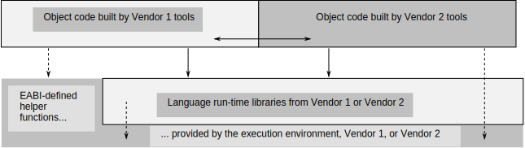

..
   Copyright (c) 2002, 2005-2007, 2015, 2018, 2020-2022, Arm Limited and its affiliates.  All rights reserved.
   CC-BY-SA-4.0 AND Apache-Patent-License
   See LICENSE file for details

.. |release| replace:: 2022Q3
.. |date-of-issue| replace:: 20\ :sup:`th` October 2022
.. |copyright-date| replace:: 2002, 2005-2007, 2015, 2018, 2020-2022
.. |footer| replace:: Copyright © |copyright-date|, Arm Limited and its
                      affiliates. All rights reserved.

.. _AAELF32: https://github.com/ARM-software/abi-aa/releases
.. _BSABI32: https://github.com/ARM-software/abi-aa/releases
.. _CPPABI32: https://github.com/ARM-software/abi-aa/releases
.. _EHABI32: https://github.com/ARM-software/abi-aa/releases
.. _RTABI32: https://github.com/ARM-software/abi-aa/releases
.. _ARMv5 Architecture Reference Manual: https://developer.arm.com/docs/ddi0100/latest/armv5-architecture-reference-manual
.. _ARM Architecture Reference Manual ARMv7-A and ARMv7-R edition:
.. _ARMARM: https://developer.arm.com/docs/ddi0406

Exception Handling ABI for the Arm® Architecture
************************************************

.. class:: version

|release|

.. class:: issued

Date of Issue: |date-of-issue|

.. class:: logo

.. image:: Arm_logo_blue_RGB.svg
   :scale: 30%

.. section-numbering::

.. raw:: pdf

   PageBreak oneColumn

Preamble
========

Abstract
--------

This document describes the exception handling component of the Application Binary Interface (ABI) for the Arm architecture. It covers the exception handling model, encoding in relocatable ELF files, language-independent unwinding, and C++-specific aspects.

Keywords
--------

Stack unwinding, exception handling

Latest release and defects report
---------------------------------

Please check `Application Binary Interface for the Arm® Architecture
<https://github.com/ARM-software/abi-aa>`_ for the latest
release of this document.

Please report defects in this specification to the `issue tracker page
on GitHub
<https://github.com/ARM-software/abi-aa/issues>`_.

.. raw:: pdf

   PageBreak

Licence
-------

This work is licensed under the Creative Commons
Attribution-ShareAlike 4.0 International License. To view a copy of
this license, visit http://creativecommons.org/licenses/by-sa/4.0/ or
send a letter to Creative Commons, PO Box 1866, Mountain View, CA
94042, USA.

Grant of Patent License. Subject to the terms and conditions of this
license (both the Public License and this Patent License), each
Licensor hereby grants to You a perpetual, worldwide, non-exclusive,
no-charge, royalty-free, irrevocable (except as stated in this
section) patent license to make, have made, use, offer to sell, sell,
import, and otherwise transfer the Licensed Material, where such
license applies only to those patent claims licensable by such
Licensor that are necessarily infringed by their contribution(s) alone
or by combination of their contribution(s) with the Licensed Material
to which such contribution(s) was submitted. If You institute patent
litigation against any entity (including a cross-claim or counterclaim
in a lawsuit) alleging that the Licensed Material or a contribution
incorporated within the Licensed Material constitutes direct or
contributory patent infringement, then any licenses granted to You
under this license for that Licensed Material shall terminate as of
the date such litigation is filed.

About the license
-----------------

As identified more fully in the Licence_ section, this project
is licensed under CC-BY-SA-4.0 along with an additional patent
license.  The language in the additional patent license is largely
identical to that in Apache-2.0 (specifically, Section 3 of Apache-2.0
as reflected at https://www.apache.org/licenses/LICENSE-2.0) with two
exceptions.

First, several changes were made related to the defined terms so as to
reflect the fact that such defined terms need to align with the
terminology in CC-BY-SA-4.0 rather than Apache-2.0 (e.g., changing
“Work” to “Licensed Material”).

Second, the defensive termination clause was changed such that the
scope of defensive termination applies to “any licenses granted to
You” (rather than “any patent licenses granted to You”).  This change
is intended to help maintain a healthy ecosystem by providing
additional protection to the community against patent litigation
claims.

Contributions
-------------

Contributions to this project are licensed under an inbound=outbound
model such that any such contributions are licensed by the contributor
under the same terms as those in the `Licence`_ section.

Trademark notice
----------------

The text of and illustrations in this document are licensed by Arm
under a Creative Commons Attribution–Share Alike 4.0 International
license ("CC-BY-SA-4.0”), with an additional clause on patents.
The Arm trademarks featured here are registered trademarks or
trademarks of Arm Limited (or its subsidiaries) in the US and/or
elsewhere. All rights reserved. Please visit
https://www.arm.com/company/policies/trademarks for more information
about Arm’s trademarks.

Copyright
---------

Copyright (c) |copyright-date|, Arm Limited and its affiliates.  All rights
reserved.

.. raw:: pdf

   PageBreak

.. contents::
   :depth: 3

.. raw:: pdf

   PageBreak

About this document
===================

Change control
--------------

Current status and anticipated changes
^^^^^^^^^^^^^^^^^^^^^^^^^^^^^^^^^^^^^^

The following support level definitions are used by the Arm ABI specifications:

**Release**
   Arm considers this specification to have enough implementations, which have
   received sufficient testing, to verify that it is correct. The details of these
   criteria are dependent on the scale and complexity of the change over previous
   versions: small, simple changes might only require one implementation, but more
   complex changes require multiple independent implementations, which have been
   rigorously tested for cross-compatibility. Arm anticipates that future changes
   to this specification will be limited to typographical corrections,
   clarifications and compatible extensions.

**Beta**
   Arm considers this specification to be complete, but existing
   implementations do not meet the requirements for confidence in its release
   quality. Arm may need to make incompatible changes if issues emerge from its
   implementation.

**Alpha**
   The content of this specification is a draft, and Arm considers the
   likelihood of future incompatible changes to be significant.

All content in this document is at the **Release** quality level.

Change history
^^^^^^^^^^^^^^

If there is no entry in the change history table for a release, there are no
changes to the content of the document for that release.

+-------------+-------------------------------+---------------------------------------------------+
| Issue       | Date                          | Change                                            |
+=============+===============================+===================================================+
| 1.0         |                               | First public release.                             |
+-------------+-------------------------------+---------------------------------------------------+
| 2.0         | 24\ :sup:`th` March 2005      | Second public release.                            |
+-------------+-------------------------------+---------------------------------------------------+
| 2.01        | 22\ :sup:`nd` August 2005     | Minor typographical corrections in                |
|             |                               | `Exception-handling table entries`_.              |
+-------------+-------------------------------+---------------------------------------------------+
| 2.02        | 5\ :sup:`th` October 2005     | Add \_\_cxa\_get\_exception\_ptr,                 |
|             |                               | \_Unwind\_DeleteException, and VFP v3 support.    |
|             |                               | Minor edits for clarity.                          |
+-------------+-------------------------------+---------------------------------------------------+
| 2.03        | 31\ :sup:`st` October 2006    | Minor edits for clarity, particularly regarding   |
|             |                               | use of the exception\_cleanup field. Change to    |
|             |                               | \_Unwind\_State type.                             |
+-------------+-------------------------------+---------------------------------------------------+
| 2.04        | 25\ :sup:`th` January 2007    | Tiny clarification at end of paragraph 5 in       |
|             |                               | `Phase 2 unwinding`_.                             |
+-------------+-------------------------------+---------------------------------------------------+
| A           | 25\ :sup:`th` October 2007    | Document renumbered (formerly GENC-003536 v2.04). |
+-------------+-------------------------------+---------------------------------------------------+
| B           | 24\ :sup:`th` November 2015   | Use UAL instruction mnemonics where possible.     |
+-------------+-------------------------------+---------------------------------------------------+
| 2018Q4      | 21\ :sup:`st` December 2018   | Minor typographical fixes, updated links.         |
+-------------+-------------------------------+---------------------------------------------------+
| 2020Q3      | 1\ :sup:`st` October 2020     | - document released on Github                     |
|             |                               | - new Licence_: CC-BY-SA-4.0                      |
|             |                               | - new sections on Contributions_, `Trademark      |
|             |                               |   notice`_, and Copyright_                        |
+-------------+-------------------------------+---------------------------------------------------+
| 2021Q1      | 12\ :sup:`th` April 2021      | Added PACBTI-M unwinding information.             |
+-------------+-------------------------------+---------------------------------------------------+
| 2022Q3      | 20\ :sup:`th` October 2022    | Add PACBTI-M unwinding rule for nested functions. |
+-------------+-------------------------------+---------------------------------------------------+

References
----------

This document refers to, or is referred to by, the following documents.

.. class:: ehabi32-refs

+--------------------------+-----------------------------------------------------------------------------------------------------+-------------------------------------------------------------------------------------------------------------------+
| Ref                      | URL or other external reference                                                                     | Title                                                                                                             |
+==========================+=====================================================================================================+===================================================================================================================+
| AAELF32_                 |                                                                                                     | ELF for the Arm Architecture.                                                                                     |
+--------------------------+-----------------------------------------------------------------------------------------------------+-------------------------------------------------------------------------------------------------------------------+
| BSABI32_                 |                                                                                                     | ABI for the Arm Architecture (Base Standard)                                                                      |
+--------------------------+-----------------------------------------------------------------------------------------------------+-------------------------------------------------------------------------------------------------------------------+
|        CPPABI32_         |                                                                                                     | C++ ABI for the Arm Architecture                                                                                  |
+--------------------------+-----------------------------------------------------------------------------------------------------+-------------------------------------------------------------------------------------------------------------------+
| EHABI32_                 |                                                                                                     | Exception Handling ABI for the Arm Architecture. (*This document*)                                                |
+--------------------------+-----------------------------------------------------------------------------------------------------+-------------------------------------------------------------------------------------------------------------------+
| ARMARM_                  | Arm DDI 0100E, ISBN 0 201 737191                                                                    | The Arm Architecture Reference Manual, 2\ :sup:`nd` edition, edited by David Seal, published by Addison-Wesley.   |
|                          | (Also from `ARMv5 Architecture Reference Manual`_)                                                  |                                                                                                                   |
+                          +-----------------------------------------------------------------------------------------------------+-------------------------------------------------------------------------------------------------------------------+
|                          | Arm DDI 0406                                                                                        | Arm Architecture Reference Manual Arm v7-A and Arm v7-R edition                                                   |
|                          | (`ARM Architecture Reference Manual ARMv7-A and ARMv7-R edition`_)                                  |                                                                                                                   |
+--------------------------+-----------------------------------------------------------------------------------------------------+-------------------------------------------------------------------------------------------------------------------+
| HPIA64                   | IEEE Concurrency, October-December 2000, pp72-79                                                    | *C++ Exception Handling*, by Christophe de Dinechin.                                                              |
+--------------------------+-----------------------------------------------------------------------------------------------------+-------------------------------------------------------------------------------------------------------------------+

Terms and abbreviations
-----------------------

The ABI for the Arm Architecture uses the following terms and abbreviations:

AAPCS
   Procedure Call Standard for the Arm Architecture.

ABI
   Application Binary Interface:

   1. The specifications to which an executable must conform in order to
      execute in a specific execution environment. For example, the
      *Linux ABI for the Arm Architecture*.

   2. A particular aspect of the specifications to which independently produced
      relocatable files must conform in order to be statically linkable and
      executable.  For example, the AAELF32_, RTABI32_, ...

AEABI
   (Embedded) ABI for the Arm architecture (this ABI...)

Arm-based
   ... based on the Arm architecture ...

Branch Target Identification
   Security technique ensuring a degree of control flow integrity by marking
   valid targets of indirect branches.

core registers
   The general purpose registers visible in the Arm architecture’s
   programmer’s model, typically r0-r12, SP, LR, PC, and CPSR.

EABI
   An ABI suited to the needs of embedded, and deeply embedded (sometimes
   called *free standing*), applications.

Q-o-I
   Quality of Implementation – a quality, behavior, functionality, or
   mechanism not required by this standard, but which might be provided
   by systems conforming to it. Q-o-I is often used to describe the
   tool-chain-specific means by which a standard requirement is met.

VFP
   The Arm architecture’s Floating Point architecture and instruction
   set. In this ABI, this abbreviation includes all floating point
   variants regardless of whether or not vector (V) mode is supported.

Acknowledgements
----------------

This specification has been developed with the active support of the
following organizations. In alphabetical order: Arm, CodeSourcery,
Intel, Metrowerks, Montavista, Nexus Electronics, PalmSource, Symbian,
Texas Instruments, and Wind River.

.. raw:: pdf

   PageBreak

Introduction And Scope
======================

*Catching an exception* at run-time in languages such as C++ depends on
run-time support code to:

-  Unwind the stack of procedure activation records (or call frames) and
   call any clean-up code associated with each activation record.

-  Check whether any handler associated with a frame matches the
   exception, and call it if it does.

There are several different implementation strategies for exception
handling offering a trade-off among:

-  The impact of the catching exceptions on the size and performance of
   non-exceptional execution paths.

   For example, the implementation of exception handling that uses ``setjmp``
   and ``longjmp`` adds to normal execution paths the cost of:

   - Registering object destructors in each function that creates objects
     that must be destroyed on passing or handling an exception.

   - Registering handlers in each function that catches exceptions.

-  The performance of handling a thrown exception.

   For example, interpreting separate unwinding tables is probably 1,000
   times slower than ``longjmp``.

-  The amount of auxiliary data that must be generated by an object
   producer, even for code that does not handle exceptions (which can be
   especially irksome for assembly language programmers).

   For example, producing separate unwinding tables is an overhead on all
   functions, whether they are intended to propagate exceptions or not. On
   the other hand, it may be possible to generate such tables from the
   debug (e.g. DWARF-2) call-frame description tables that object producers
   generate anyway.

In common with the IA-64 runtime architecture, the Arm Exception ABI
specifies separate, per-function unwinding tables indexed by program
counter. Each unwinding table entry specifies:

-  How to unwind the stack frame associated with the function the
   program counter is in.

-  How to perform language-specific actions associated with unwinding
   the stack frame such as destroying objects about to go out of scope.

-  How to locate and transfer control to handlers associated with this
   function.

Some useful characteristics of this architecture are:

-  Executables that promise not to throw exceptions (or for which
   throwing an exception is a catastrophic event) can discard their
   unwinding tables and any associated run-time support.

-  Save in functions containing try {…} catch {…} blocks where
   additional, implicit flow-graph arcs inhibit code improvement, there
   are few code-generation concessions to propagating exceptions. In
   particular, exception-propagating code can still be optimized
   effectively (see [HPIA64] for a discussion of the issues).

-  There is clean separation between local aspects of handling
   exceptions—managed by object producers—and the global aspects
   standardized by the EABI and the run-time system.

To minimize the impact on code generation, the scope of this
architecture is limited to exceptions thrown within a thread of
execution by calling the system-wide *throw* function, and caught within
the same thread. Consequently:

-  An exception can only appear to be thrown at the site of a function
   call, and leaf functions are exception-free.

-  Function prologues and epilogues are exception-free, which simplifies
   unwinding, and exceptions create no additional barriers to code
   motion (function calls are significant barriers to code motion
   anyway).

-  A hardware trap such as divide-by-zero or a floating-point exception
   cannot be caught directly. Rather, a function must wrap any operation
   likely to trap, catch the trap if it occurs, then throw an
   appropriate exception.

.. raw:: pdf

   PageBreak

Design principles
=================

Exception handling affects:

-  The interface between relocatable object producers (such as
   compilers) and static linkers.

-  The interface between object producers and run-time support code.

-  The interface between static linkers and execution environments.

The encoding of exception tables in relocatable objects need not be the
same as in executable files.

-  The ABI for the Arm architecture controls the representation of
   exception-handling data in relocatable files.

-  Separate supplements control the representation in executables for
   specific execution environments.

The execution-environment model
-------------------------------

The ABI for the Arm architecture ([BSABI32_]) specifies four generic
execution environments, one “bare metal” and three OS-based.

-  In each of the three OS-based environments, the encoding of exception
   tables in the execution environment is part of the program execution
   ABI for that environment.

-  In the bare metal, or no OS, environment, there is no run-time agent
   to care about the format of exception tables other than the run-time
   support code. In this generic environment, a private agreement
   between the run-time support code and the static linker can determine
   the execution-time format of exception tables.

Hitherto, the ABI for the Arm architecture has permitted private
agreement between a static linker and run-time support code. In
practice, it is difficult to define an open interface between arbitrary
run-time support functions. Realistically, there can only be one
run-time system in a program, as depicted in the figure below.

   Run-time calls governed by the ABI for the Arm architecture (EABI)

The interface between functions built with different tool chains is, by
definition, *exported*, so it is governed by the EABI. The interface to
a run-time library defined by a programming language standard is also
*exported*, and hence governed by the EABI. Solid arrows depict calls
across such interfaces in the figure above.

Some helper functions are specified by the EABI. *All* run-time
libraries must provide these (unless the execution environment provides
them) even though no programming language standard specifies them. Some,
such as, integer divide and software floating-point arithmetic
functions, are universally needed, while others—for example, the
functions described in `The generic C++ exception handling ABI`_ that implement generic C++
exception handling—allow code built by one tool chain to work with code built
by another. Dashed arrows depict calls to such helper functions in
the figure above.

Other helper functions are private to the language implementation. When
an object built with that implementation is distributed for possible
linking with objects built by other implementations, its private
(implementation-specific) helper functions must be distributed with it.

The linker must match the run-time support code
^^^^^^^^^^^^^^^^^^^^^^^^^^^^^^^^^^^^^^^^^^^^^^^

All this suggests the following principle, which we adopt in relation to
exception processing.

-  In a static link step involving relocatable objects generated by
   different producers, the static linker and the run-time support code
   must be from the same tool chain.

.. admonition:: Aside
   :class: note

   This allows a static linker for a standalone execution environment to encode
   fully linked exception tables in any way acceptable to the matching run-time
   system.

The ELF model
-------------

Relocatable ELF
^^^^^^^^^^^^^^^

A design principle underlying ELF [AAELF32_] can be caricatured
as *smart format, dumb linker*. That’s not to say that intelligent linking is
precluded, or that the linking process is trivial, but to emphasize that the
way a collection of relocatable objects should be processed should be explicit
in those objects, with no hidden contract between object producers and the
static linker.

Executable ELF
^^^^^^^^^^^^^^

The execution environment determines the format of an executable or
shared object. Historically, ELF as an execution format has been
associated with Unix System V-based execution environments (such as Arm
Linux).

Principles of usage
^^^^^^^^^^^^^^^^^^^

This suggests the following principles, which we adopt in relation to
exception processing.

-  At the interface between relocatable object producers and static
   linkers we give priority to ease of producing complete, precise
   exception table descriptions that can be processed straightforwardly
   by static linkers.

-  At the interface between a fully linked executable (or shared object)
   and its execution environment, a post-processor should be able to
   generate the environment-specific encoding of the exception table
   from the generic form.

.. admonition:: Aside
   :class: note

   In practice, we expect such post-processing to be integrated into
   platform-specific linkers.

.. raw:: pdf

   PageBreak

The top-level exception handling architecture
=============================================

Except where stated otherwise, this section describes the execution
architecture that would be created by a dumb linker. Object producers
must emit object conformant with these descriptions. A dumb linker can
take the objects and the matching runtime libraries and produce a
working implementation by performing only standard linking operations. A
smart linker might create a different execution architecture or simply a
minor variant (for example it might change table index encoding to
improve compaction), in which case compatible support code must be
available in the associated environment runtime libraries.

Overview for executables, shared objects, and DLLs
--------------------------------------------------

This architecture applies to each independently loaded executable
segment of a program. A program’s executable segments comprise those of
the root executable together with those from the shared objects or DLLs
it links to dynamically.

.. admonition:: Aside
   :class: note

   A static link unit containing multiple executable segments destined for
   memory at disjoint addresses nonetheless has a single independently loaded
   executable segment for this purpose because the address relationships among
   such segments are either fixed or subject to load-time relocation. In any
   case, in all mainstream execution environments, each static link unit has
   precisely one executable segment.

With each independent executable segment we associate data structures
that support unwinding:

-  Exception handling tables for functions contained within the segment.

-  A binary-searchable index table. Each entry associates a function
   with its exception-handling table.

The data structures are read-only at execution time and should be free
of dynamic relocations, so that they are genuinely RO. To this end,
references between them, and from them to code, are place-relative and
hence position independent. References from them to writable or imported
data are implemented in a platform-specific manner (possibly involving
indirection through a dynamically relocatable location) which avoids the
need to write into the structures at load-time.

The binary searched index table
-------------------------------

Exception-handling table entries have a variable size. A handling table
entry is found by searching a table of index entries. To support binary
search, the index table must consist of contiguous fixed-size entries,
each of which identifies a function start address, with the entries
ordered by increasing function start address.

The exception-handling table
----------------------------

The exception-handling table (EHT) contains one entry for each non-leaf
function that may need to be unwound. (By definition there are no
entries for leaf functions because an exception can only be thrown from
the site of a function call so a leaf function can never need
unwinding).

A table entry has a variable size. It encodes, in a vendor- and
language-specific way, the actions required to propagate an exception
through the function. For C++ functions, this information is:

-  How to unwind a stack frame associated with the function.

-  How to perform any cleanup actions associated with the unwinding.

-  How to locate handlers associated with the function.

-  A description of exception types not blocked by this function.

Not all functions have cleanup actions or handlers and most functions
simply pass all exceptions not handled.

In some usefully common cases, a handling table entry contains so little
information that it’s content can be packed directly into the index
table entry (see `Index table entries`_ and `Exception-handling table entries`_ for details).

There are two table entry formats (again see `Exception-handling table entries`_ for details).

-  **Generic**—a table entry consists of a place-relative offset to a
   function with an interface and run-time interaction protocol defined
   by this EHABI, followed by data in a format private to that function.

-  **Compact**—a small number of bits encode the identity of the
   required function, facilitating the aforementioned packing.

This EHABI defines a number of compact formats, suitable for C++, C, and
similar languages. We encourage language implementers to use these
specific formats where possible (see `Arm-defined personality routines and table formats for C and C++`_).

The object producer interface
-----------------------------

Sections
^^^^^^^^

An object producer must generate:

-  One fragment of index table for each code section.

-  One exception-handling table entry corresponding to each function
   that may need to be unwound.

Each fragment of index table (read-only data) must be generated in its
own ELF section. It must contain an index entry for each non-leaf
function in the associated code section, in the same order as that of
the functions in the code section. The index table section name must be
``.ARM.exidx`` optionally followed by further characters. The section type
must be SHT\_ARM\_EXIDX (see [AAELF32_]). It must have the SHF\_LINK\_ORDER
flag set in the sh\_flags field of its section header and be linked to
its associated code section via the sh\_link field of its section
header.

An object producer may generate exception-handling table entries
(read-only data) in one ELF section, or one section per function. The
name of a section containing an exception table fragment must be
``.ARM.extab`` optionally followed by further characters. The section type
must be SHT\_PROGBITS.

.. note::

   Tables are not required for ABI compliance at the C/Assembler level
   but are required for C++.

Relocations
^^^^^^^^^^^

A goal of the ABI is that it be possible to build object files that can
be used on any target platform via appropriate platform-specific
linking. This goal is supported by the provision of suitable
relocations, whose use is mandated for some purposes in conformant
object files. [AAELF32_] and platform-ABI documents contain further details
on this topic. This section describes the requirements placed on object
producers so that RO exception tables are portable in this manner.

As stated earlier, exception tables should be free of dynamic
relocations. A static relocation may be applied to an exception table
for the following purposes:

-  To reference an entity which, on all platforms, is within the same
   dynamic link unit as the exception table and is also RO. Such
   entities include exception tables and the code they are associated
   with.

-  To reference other entities (potentially RW, or imported data). Such
   entities include C++ RTTI objects.

-  To indicate a dependency, where this is not otherwise apparent to the
   linker. An example is a function that must be present in order to
   interpret a particular table format.

These uses are supported through the following means respectively (refer
to [AAELF32_] for additional details):

-  A reference to RO in the same dynamic link unit is via an
   R\_ARM\_PREL31 relocation. Bit 31 of the relocated word does not
   participate in the relocation and may be used as data. The relocated
   31 bits form a place-relative signed offset to the referenced entity.
   For brevity, this document will refer to the results of these
   relocations as “prel31 offsets”.

-  Reference to other entities is via an R\_ARM\_TARGET2 relocation.
   This is a 32 bit relocation which on bare metal is equivalent to
   R\_ABS32.

-  Dependencies are indicated via an R\_ARM\_NONE relocation.

Tool chain quality of implementation issues
-------------------------------------------

The collection of input objects passed to a static linker may be a
mixture of objects with exception tables and objects lacking them. It
must be possible to have the linker create an image from those objects.
It is the user's responsibility to ensure functions that may participate
in exception propagation have exception tables.

Smart linkers may support creation of exception tables under direction
of the user. The information contained in a DWARF-2 or DWARF-3 call
frame description can be translated into an unwinding description.

Some C compilers and assemblers may support creation of exception tables
but this is not mandatory. For objects hand-written in assembly language
it is more convenient where supported to rely on the assembler or linker
to generate unwinding tables from the supplied frame information. If the
tool chain cannot do this, any required tables must be defined
explicitly in the assembly source.

Functional encapsulation
------------------------

The exception propagation machinery is divided into:

-  A language-independent component responsible for unwinding, that
   comprehends:

   - Platform-specific information, including representation of and
     manipulation of the machine state.

   - The content of exception index table entries and the
     language-independent first word of exception-handling table
     entries.

-  Language-/implementation-specific components that implement the
   language-specific semantics of exception handling for each
   programming language in the image (one component per language).

-  “Personality routines” which communicate with both of the above and
   which comprehend:

   - The programming language-specific semantics of exception handling.

   - The content of exception-handling table entries.

The interfaces and protocols for these are defined in detail later.

Restriction on implementation
-----------------------------

It is mandatory that the machinery listed in `Functional encapsulation`_ is implemented using
only the core (integer) registers as workspace, aside from when
manipulating the real machine registers as part of a stack unwind. This
permits demand-saving of non-core registers. In other words, when
non-core registers need to be preserved over some operation (such as
while searching the stack, see `Language-independent unwinding library`_) they can be saved just before they
are used, at the point when a reference to them in some stack frame is
detected. They need not be saved on entry to the unwinder just in case
the unwinder itself corrupts them. The usage restriction and
demand-saving together confer two advantages that outweigh the costs:

-  By using demand-saving, no additional mechanism is required to
   determine which registers are present in the execution environment –
   the mention of a register by the unwinding description of a live
   frame is sufficient guarantee of the register’s existence. For
   example, on a platform without VFP there will be no attempt to use a
   VFP register at runtime and so no need to save or even consider
   saving the VFP registers.

-  A single implementation can be compiled to execute on all hardware
   platforms regardless of which registers are present on a particular
   platform. This is important when mixing unwinding components from
   different vendors. Nevertheless it remains possible (for code size
   reasons, perhaps) to implement a restricted unwinder that only copes
   with a subset of possible execution environments (such as those
   without floating point).

.. raw:: pdf

   PageBreak

Index table entries
===================

An index table entry consists of 2 words.

-  The first word contains a prel31 offset (see `Relocations`_) to the start of
   a function, with bit 31 clear.

-  The second word contains one of:

   - The prel31 offset of the start of the table entry for this function,
     with bit 31 clear.

   - The exception-handling table entry itself with bit 31 set, if it can
     be encoded in 31 bits (see `The Arm-defined compact model`_).

   - The special bit pattern EXIDX\_CANTUNWIND (0x1), indicating to
     run-time support code that associated frames cannot be unwound.
     On encountering this pattern the language-independent unwinding
     routines return a failure code to their caller, which should take
     an appropriate action such as calling terminate() or abort(). See
     `Phase 1 unwinding`_ and `Phase 2 unwinding`_.

.. note::

   - It is essential that link-time symbol vectoring (see [AAELF32_]) does
     not break the index table’s association between code and
     corresponding exception-handling tables. An index table entry first
     word must therefore not be constructed using a relocation (of 0)
     relative to *function symbol* since vectoring may attach *function
     symbol* to different code. A possible way for object producers to
     construct the first word is to use the section-relative offset of
     *function symbol*, or-d with 1 for a Thumb function, relocated by the
     place-relative offset to the *section symbol* for the section
     containing the function, since *section symbol* is not global and
     hence not vectorable.

   - A table entry offset to be stored in the second word can be generated
     as 0 relocated by the *table entry symbol*, or as the offset of the
     table entry in the table section relocated by the *table section
     symbol*.

   - EXIDX\_CANTUNWIND is language-independent, so a smart linker may be
     able to group such entries (for smaller runtime table size) without
     needing to understand language-specific table encodings.

.. raw:: pdf

   PageBreak

Exception-handling table entries
================================

Overview
--------

The unwinding of a function’s stack frame is performed by a *personality
routine* capable of interpreting the exception-handling table (EHT)
entry and unwinding the associated frame.

The language-independent unwinding library described in `Language-independent unwinding library`_ calls the
personality routine to unwind a single stack frame. The arguments passed
to the personality routine contain pointers to the function being
unwound and its exception-handling table entry (see `Language-independent unwinding types and functions`_).

The personality routine calls back to the language-independent unwinding
library for various services, and calls a language-semantics library to
maintain the particular language semantics.

**Conceptually**, an exception-handling table entry begins with the
address of the personality routine:

.. code-block:: c

  /* See `Language-independent unwinding types and functions`_ for details of the various _Unwind types */
  typedef _Unwind_Reason_Code (*PersonalityRoutine)(_Unwind_State,
                                                    _Unwind_Control_Block *,
                                                    _Unwind_Context *);
  struct _Unwind_EHT_Entry {
    PersonalityRoutine pr;
    /*  then other data understood only by the personality routine */
  };

**Concretely**, there are two possible encodings: the generic model, and
the Arm-defined compact model. Bit 31 of the first entry word
discriminates between them.

The generic model
-----------------

An exception-handling table entry for the generic model is laid out as
in the conceptual illustration above.

The address of the personality routine is encoded as a prel31 offset.

The Arm-defined compact model
-----------------------------

Arm run-time systems additionally support a simple, compact model.

An exception-handling table entry for the compact model looks like:

Bits 24-27 select one of 16 personality routines defined by the run-time
support code. Remaining bytes are data for that personality routine.

If the entire handling table entry fits in 4 bytes, the entry can be
emitted inline in the index table instead (as described in `Index table entries`_). Bit 31
then discriminates between such an inline entry and a prel31 offset to
an entry in the handling table (for which bit 31 is 0).

Arm has allocated index numbers 0, 1 and 2 for use by C and C++. `Arm-defined personality routines and table formats for C and C++`_
details the mapping from index numbers to personality routines and
explains how to use them. Index numbers 3-15 are reserved for future
use.

Object producers must emit an R\_ARM\_NONE relocation from an
exception-handling table section to the required personality routine to
indicate the dependency to the linker.

Language-independent unwinding library
======================================

Overview of operation
---------------------

The language-independent component responsible for unwinding
comprehends:

-  Platform-specific information, including representation of and
   manipulation of the machine state.

-  The content of exception index table entries (`Index table entries`_) and the
   language-independent first word of exception-handling table entries
   (`Exception-handling table entries`_).

This section describes the interfaces and behaviours of that
component, and the protocol by which it interfaces to personality
routines. The target environment runtime library must provide the
language-independent *unwind library* routines specified in this
section.

Terminology
^^^^^^^^^^^

When a function F calls some other function G, and G or one of its
callees initiates a throw, the *apparently throwing call* in F is the
call to G. The return address into F from G (ignoring any Thumb
instruction set indicator in bit 0) denotes the *apparently throwing
call site* in F.

From a language-independent unwinding viewpoint, a *propagation barrier*
is a point at which a particular stack unwinding must cease. The code
associated with a propagation barrier, a *handler*, retains control at
the end of an exception propagation (and, indeed, returns it to the
application).

A *cleanup* denotes some kind of frame-specific activity to be performed
on a frame during unwinding (and also denotes the code that performs the
activity) which on completion returns control to the unwinder. For
example, C++ cleanups may destroy objects of automatic storage class.

A block of code associated with a parent function and entered for some
purpose during exception propagation, such as to perform cleanup or to
catch a thrown object, is called a *landing pad*. Sometime this phrase
refers particularly to the initial part of such a code sequence.

A client language will implement handlers either as code reached via
landing pads (for handlers specific to a particular parent function) or
as independent functions (for handlers not tied to particular parent
functions – an example is the C++ std::terminate() function).

Language-independent exception propagation
^^^^^^^^^^^^^^^^^^^^^^^^^^^^^^^^^^^^^^^^^^

Stack unwinding happens in 2 phases:

-  In phase 1 the stack is searched for a propagation barrier that will
   stop the eventual real unwinding.

   Such a barrier could be (in C++) a catch clause that will accept the
   exception object, or a function exception specification that will not
   allow the exception type to pass. C++ uses the general term ‘handler’ to
   refer to both a barrier and the code entered as a result of it.

   Clearly, the recognition of a propagation barrier is
   language-/implementation-specific.

-  In phase 2, the stack is unwound to the designated propagation
   barrier, performing cleanups on the way.

   The appropriate action (enter landing pad, call special routine...) is
   performed when the barrier is reached.

   Clearly, the action performed is language-/implementation-specific.

From a language-independent unwinding viewpoint, an exception
propagation begins at the start of phase 1 and ends shortly after phase
2, when the handler notifies the unwinder that it has extracted any data
it needs from the exception object. Particular languages may have a
broader notion and may allow an exception object to be reused
(re-thrown) from an exception handler. This is treated as a new
exception propagation by the language-independent unwinder.

During phase 1, the language-independent unwinder calls the personality
routine of a frame to discover whether a barrier exists within the
frame. During phase 2 the personality routine is again called, this time
to initialize internal state so that real unwinding may be performed.
The language-independent unwinder transfers this internal state to the
real machine so that execution is transferred to the designated code.
After a cleanup, the personality routine will eventually be re-entered
to decide what to do next; it is allowed to go round several cleanup
cycles per frame. After dealing with all the cleanups it must use the
frame unwinding information to load the internal state in a way that
causes the frame to be removed from the stack. It then indicates this to
the language-independent unwinder, which will locate the personality
routine for the next frame and invoke it, and so on. This protocol is
described in detail in `Phase 1 unwinding`_ and `Phase 2 unwinding`_.

As stated, a cleanup should exit by returning control to the unwinder
(possibly via an intermediate language-specific routine). Throwing out
of a cleanup would violate this and is thus normally forbidden (C++
cleanups forbid exit by throw and the exception table covering their
range should enforce this). Languages (if any) which need to permit
throw out of a cleanup must take the necessary steps to explicitly
terminate the previously active exception propagation. Also their
cleanup may need its own cleanup. Infinite regression is avoided because
eventually there must be a simple cleanup that does not end by throwing.

Exception propagation state
^^^^^^^^^^^^^^^^^^^^^^^^^^^

When propagating an exception through a particular function during
unwinding phase 2, it is guaranteed that the first landing pad entered
is entered in the machine state prevailing at the point of the
apparently throwing call within that function, aside from any registers
used to pass arguments to the landing pad. If the landing pad is a
cleanup (so it returns control to the unwinder on exit) it is possible
that further pads may be entered for the same function. The entry state
for such pads is the exit state from the previous pad, again possibly
modified by any arguments passed to the pad.

In particular when a pad is entered, the stack pointer has the value it
had immediately before the call to the apparently throwing function
(assuming stack-moves-once). It follows that no unwinding function stack
frame can persist over a landing pad invocation. Therefore, all data
needed to track the exception propagation state must be held in the
thrown object itself, or be reachable from it, or be in thread-safe
global store.

State information may be categorized according to its ownership and its
duration. State may be conceptually owned by:

-  The application.

-  The language originating the propagation.

-  The language owning the handler frame located for the propagation.

-  The language owning a frame currently being unwound.

-  The language-independent unwinder.

The most long-lived state is valid (not necessarily constant) over the
lifetime of an object. Other state is valid for a shorter duration, such
as over a single exception propagation, or across a cleanup.

The thrown object is divided into three parts to hold the long-lived
state:

-  The state in the throwing application’s view.

   When a language initiates a throw, it throws a particular object that we
   call the *exception object* or EO. In C++, the EO is constructed from
   the object arising as the result of the *throw* expression.

-  The state in the throwing language’s view.

   The throwing language may need to maintain extra housekeeping
   information to ensure correct propagation semantics. It will hold this
   in the *language exception object* or LEO associated with the EO, and
   may also maintain some (thread-safe) language-specific global storage.

-  State which every object has.

   This includes an indication of the originating language and
   implementation. This is held in the *unwinding control block* or UCB.

The UCB is also used to hold ephemeral state required for all exception
propagations.

The contents of the LEO are specific to an implementation of the
semantics library for the throwing language; implementations need not
publish their details, and other languages and/or implementations will
only understand them by agreement beyond the scope of this
specification. The semantics library will update the contents of the LEO
in response to calls made to the library’s interface routines. The
contents of the EO are specific to an implementation of a language;
nonetheless, the language-specific components of the EO are governed by
the ABI for the language (in the case of C++, the ABI of which this
specification is a part). Provided the LEO and any
implementation-specific fields of the EO are constructed by calling a
library function, inter-working between independent ABI-conforming
implementations is guaranteed by the *one run-time library* rule of
`The execution-environment model`_.

The UCB is defined as part of this ABI - see `Language-independent unwinding types and functions`_.

Collectively the LEO, UCB and EO form an *exception control object* or
ECO. ECOs may therefore differ in length. Each ECO has its own
originating language, responsible for allocating store for the ECO and
for releasing it when it is no longer required.

A pseudo-declaration for the exception control object is:

.. code-block:: c

  typedef struct ECO {
    LEO leo;             // contents are language-/implementation-dependent
    UCB ucb;             // size and content defined by this specification - see
                         // `Language-independent unwinding types and functions`_
  // ... the application’s pointer to an exception points here...
    EO eo;               // contents and size may vary
  } ECO;

As the UCB (which has a specified size) immediately precedes the EO, it
is easy for any language implementation to recover the address of the
UCB given the address of the EO. The LEO and UCB themselves can be
opaque (indeed invisible) to the code of the application, which sees
only the EO.

Language-independent unwinding types and functions
--------------------------------------------------

The language-independent unwind library routines give access to
environment-specific functionality.

Unwinding the stack (whether a real unwinding affecting the actual machine
registers, or a virtual unwinding in which the machine-state is tracked through
successive frames) requires one or more buffer areas to hold copies of the real
machine registers or other relevant machine state. Such a buffer area is called
a *virtual register set* or VRS. Virtual register set access routines are
described separately in `Virtual register set manipulation`_; the runtime
representation is opaque to users of the unwind library and hence
implementation-defined.

The rest of this section describes the unwind control block and the
language-independent routines used to control exception propagation. The
following types and functions are used:

.. code-block:: c

  typedef enum {
    _URC_OK = 0,                /* operation completed successfully */
    _URC_FOREIGN_EXCEPTION_CAUGHT = 1,
    _URC_HANDLER_FOUND = 6,
    _URC_INSTALL_CONTEXT = 7,
    _URC_CONTINUE_UNWIND = 8,
    _URC_FAILURE = 9            /* unspecified failure of some kind */
  } _Unwind_Reason_Code;

  typedef uint32_t _Unwind_State;

  static const _Unwind_State _US_VIRTUAL_UNWIND_FRAME  = 0;
  static const _Unwind_State _US_UNWIND_FRAME_STARTING = 1;
  static const _Unwind_State _US_UNWIND_FRAME_RESUME   = 2;

  typedef struct _Unwind_Control_Block _Unwind_Control_Block;
  typedef struct _Unwind_Context _Unwind_Context;
  typedef uint32_t _Unwind_EHT_Header;

  typedef struct _Unwind_Control_Block {
    char exception_class[8];
    void (*exception_cleanup)(_Unwind_Reason_Code, _Unwind_Control_Block *);
    /* Unwinder cache, private fields for the unwinder's use */
    struct {
      uint32_t reserved1;     /* init reserved1 to 0, then don't touch */
      uint32_t reserved2;
      uint32_t reserved3;
      uint32_t reserved4;
      uint32_t reserved5;
    } unwinder_cache;
    /* Propagation barrier cache (valid after phase 1): */
    struct {
      uint32_t sp;
      uint32_t bitpattern[5];
    } barrier_cache;
    /* Cleanup cache (preserved over cleanup): */
    struct {
      uint32_t bitpattern[4];
    } cleanup_cache;
    /* Pr cache (for pr's benefit): */
    struct {
      uint32_t fnstart;             /* function start address */
      _Unwind_EHT_Header *ehtp;     /* pointer to EHT entry header word */
      uint32_t additional;          /* additional data */
      uint32_t reserved1;
    } pr_cache;
    long long int :0;               /* Force alignment of next item to 8-byte boundary */
  } _Unwind_Control_Block;

  /* Unwinding functions */
  _Unwind_Reason_Code _Unwind_RaiseException(_Unwind_Control_Block *ucbp);
  void _Unwind_Resume(_Unwind_Control_Block *ucbp);
  void _Unwind_Complete(_Unwind_Control_Block *ucbp);
  void _Unwind_DeleteException(_Unwind_Control_Block *ucbp);

**\_Unwind\_Reason\_Code** is a general return type used for several
purposes.

**\_Unwind\_State** values are passed to a personality routine by the
unwinder to indicate what the personality routine being asked to do:

-  \_US\_VIRTUAL\_UNWIND\_FRAME Used in phase 1. See `Phase 1 unwinding`_.

-  \_US\_UNWIND\_FRAME\_STARTING Used in phase 2. See `Phase 2 unwinding`_.

-  \_US\_UNWIND\_FRAME\_RESUME Used in phase 2. See `Phase 2 unwinding`_.

To support future or private extensions, it is recommended that
the personality routine exits with a failure code if it is passed an
unexpected value for its \_Unwind\_State argument.

**\_Unwind\_Context** is an opaque type used as a handle to access a
virtual register set. The unwinder passes an (\_Unwind\_Context \*) to
the personality routine. See `Virtual register set manipulation`_.

The **\_Unwind\_Control\_Block** contains members and substructures as
follows;

-  Exception\_class is an 8 character identifier recording the
   originating language and implementation. Personality routines can use
   this to determine whether their own language originated the exception
   (and, for known foreign languages whose exceptions this language can
   catch, how to extract the language-specific data). By convention the
   first 4 bytes indicate the implementation and the second 4 bytes
   indicate the language. The Arm C++ implementation uses ``ARM\0C++\0``.

-  Exception\_cleanup is used to support multi-language environments and
   to delete objects that are no longer required. See `Cross-language support, and object deletion`_.

-  Unwinder\_cache is reserved for use by the language-independent
   unwind library, with the proviso that users of the library must
   initialize the reserved1 field to zero before the
   language-independent unwind routines first see the object.

-  Barrier\_cache is reserved for use by the language semantics library
   and personality routine associated with the stack frame in which the
   propagation barrier is located. All use by the semantics library
   routines forms part of the documented interface to those routines
   (and consequently the personality routine is free to use any members
   not explicitly claimed by the semantics library routines). See `Phase 1 unwinding`_
   and `Phase 2 unwinding`_.

-  Cleanup\_cache is reserved for use by a personality routine to save
   internal state whilst a cleanup runs. When the cleanup has finished,
   the personality routine will eventually regain control and it can
   recover its state from the cleanup cache and resume processing of the
   frame. Typically the personality routine would save a representation
   of the current position within the exception handling table. See
   `Phase 2 unwinding`_.

-  Pr\_cache is reserved for use by the unwinder for passing data to the
   personality routine. The data passed includes:

   - fnstart, the start address of the function containing the apparently
     throwing call site.

   - ehtp, the start address of the exception-handling table entry.

   - additional, a word which may be used to pass additional information.
     Currently only the least significant bit is defined:

     Bit 0: single\_word\_EHT, a flag set if and only if the
     exception-handling table entry is known to occupy precisely one word.
     (Language-independent unwinding code only inspects the first word of
     the EHT entry and doesn’t comprehend anything beyond that.)

There are several routines concerned with unwinding:

\_Unwind\_RaiseException begins a new exception propagation. See `Phase 1 unwinding`_.

\_Unwind\_Resume resumes an existing exception propagation after
execution of a cleanup. See `Phase 2 unwinding`_.

\_Unwind\_Complete is called to indicate that the current propagation is
entirely finished, and that the unwinder may perform any appropriate
housekeeping. The details are implementation-defined, but see `unwinding library implications for implementations`_.

\_Unwind\_DeleteException is described in `Cross-language support, and object deletion`_.

Phase 1 unwinding
-----------------

In phase 1, the stack is virtually unwound looking for a propagation
barrier.

The language raising the exception will have allocated and initialized
an ECO, and will then (from C++ via \_\_cxa\_throw, see `ABI routines`_) call the
language-independent routine \_Unwind\_RaiseException with a pointer to
the UCB. This begins the propagation.

\_Unwind\_RaiseException captures the machine register-state on entry
and copies it to a VRS. It copies the return address from VRS[r14] to
VRS[r15] for the initial index table lookup. This saved state will be
used repeatedly later. \_Unwind\_RaiseException should also allocate any
resources required by the implementation to perform the propagation
(these can later be deallocated by \_Unwind\_Complete – see `unwinding library implications for implementations`_ for
further remarks).

\_Unwind\_RaiseException copies the VRS to a “temporary VRS” to preserve
it over the stack scan. Scanning then proceeds as follows:

1. The index table is searched for the entry E that matches the return
   address (in VRS[r15]). If no matching entry is found, or if the entry
   contains the special bitpattern EXIDX\_CANTUNWIND (see `Index table entries`_), the
   unwinder returns to its caller with \_URC\_FAILURE and the caller
   should take appropriate language-specific action (in C++, call
   terminate()). Otherwise the personality routine (PR) for the frame is
   obtained via E, and the unwinder initializes the UCB pr\_cache
   substructure. Finally it calls the PR, passing state
   \_US\_VIRTUAL\_UNWIND\_FRAME, the UCB pointer, and an
   \_Unwind\_Context pointer for VRS access.

2. The PR must discover whether this frame contains a propagation
   barrier to the exception object, by examining the EHT entry, pointed
   to from the UCB pr\_cache. It must also adjust the VRS as necessary
   by calling functions in the language-independent unwinding library.
   It returns to \_Unwind\_RaiseException with one of:

   - Barrier found (\_URC\_HANDLER\_FOUND)

   - No barrier (\_URC\_CONTINUE\_UNWIND)

   - Error (\_URC\_FAILURE)

3. \_URC\_FAILURE indicates that some error occurred that prevented
   further processing (this includes falling off the top of the stack,
   or any other detected error). \_Unwind\_RaiseException returns to its
   caller with \_URC\_FAILURE.

4. \_URC\_CONTINUE\_UNWIND indicates that no applicable propagation
   barrier was found in the function. Before returning, the PR is
   required to have done a virtual unwind by updating the VRS to reflect
   the machine state at the call to the current function. In particular
   the virtual unwind should set VRS[r15] to the return address into
   that previous function. The EHT entry must contain sufficient
   information about the function’s frame to support this (possibly in
   the form of a language-dependent, encoded unwind description).
   Scanning then continues with the next frame. **Go to** step 1.

5. In the \_URC\_HANDLER\_FOUND case, the PR is required to initialize
   the UCB barrier\_cache substructure before returning. It must save
   the SP value for the current frame and also anything mandated by the
   language semantics library of the language owning the frame.
   Typically it will also save such other information as it need to
   recognise the propagation barrier easily and unambiguously in phase
   2. Usually this will be the address of some point in the EHT entry,
   and it may cache additional information to avoid re-computing it.

When the PR returns \_URC\_HANDLER\_FOUND, \_Unwind\_RaiseException
copies its “temporary VRS” back to the primary VRS and calls a private
routine, for exposition named \_Unwind\_Next\_Frame, with the UCB
pointer to start phase 2 unwinding.

Phase 2 unwinding
-----------------

In phase 2, the stack is really unwound and cleanups are run.

The VRS content at the start of phase 2 is that which existed at the
start of the call to \_Unwind\_RaiseException. Unwinding will proceed
frame by frame until a personality routine indicates it should stop, or
an uncontinuable error is encountered.

.. note::

   Statically detectable errors should be found during phase 1, allowing
   the throwing language to make a language-dependent response.

The details are as follows:

1. At the start of each new frame, \_Unwind\_Next\_Frame is entered with
   a pointer to the UCB. It searches the index table for the entry E
   that matches the return address (in VRS[r15]). If no matching entry
   is found, or if the entry contains the special bitpattern
   EXIDX\_CANTUNWIND (see `Index table entries`_), the unwinder will call abort(). Otherwise
   the personality routine (PR) for the frame is obtained via E, and the
   unwinder initializes the UCB pr\_cache substructure. The unwinder
   must then preserve VRS[r15] by some means, as the value may be needed
   again after performing any cleanup initiated by the PR. Finally it
   calls the PR, passing state \_US\_UNWIND\_FRAME\_STARTING, the UCB
   pointer, and an \_Unwind\_Context pointer for VRS access.

   At this point:

   - The PR has just been entered for the first time for this frame.

   - The UCB pr\_cache and barrier\_cache substructures are valid.

2. The PR should now examine the EHT entry and the barrier\_cache to
   decide what to do. It should return one of:

   - \_URC\_FAILURE

   - \_URC\_CONTINUE\_UNWIND

   - \_URC\_INSTALL\_CONTEXT

3. \_URC\_FAILURE indicates that some error occurred that prevented
   further processing. The unwinder will call abort().

4. \_URC\_CONTINUE\_UNWIND indicates that the current frame has been
   fully dealt with, and that the PR has virtually unwound the frame.
   The PR does this by updating the VRS to reflect the machine state at
   the call to the current function, using the frame-specific unwind
   description. In particular the virtual unwind should set VRS[r15] to
   the return address into that previous function. The unwinder will
   (re)enter \_Unwind\_Next\_Frame to initiate unwinding of the parent
   frame. **Go to** step 1.

5. \_URC\_INSTALL\_CONTEXT instructs the unwinder to save any state it
   needs and then to upload the virtual register set to the real machine
   registers. This causes the unwinder frames to vanish and whatever
   routine the PR installed in VRS[r15] to be entered. The PR will make
   this return when it wants to run a cleanup or when it wants to enter
   the handler that was located during phase 1. The PR must have set up
   the VRS with the required register-state to enter the designated
   code, including any arguments it knows it must pass. If the PR
   expects to eventually get control back (after running a cleanup) it
   must also save in the UCB cleanup\_cache substructure whatever
   state-tracking information it requires so it can resume scanning the
   EHT entry at the correct place on re-entry.

   .. note::

    In general an unwinder must load *all* the machine registers listed in the VRS.

   If Branch Target Identification mechanism is enabled, the unwinder may
   transfer control to the routine installed in VRS[r15] using a BTI-setting
   instruction that requires a BTI-clearing instruction at the destination.

6. After a cleanup has finished, the unwind must be continued by passing
   the UCB pointer to \_Unwind\_Resume. A cleanup may exit via some
   language-specific ABI-defined routine (in C++, \_\_cxa\_end\_cleanup)
   to do this. The cleanup may have made changes to the machine register
   state which must not be lost, for example updating the value of a
   variable held in a register. Thus \_Unwind\_Resume must copy the
   registers to the VRS. It must set VRS[r15] to the value saved in step
   (1) as this may be required for further scanning of the EHT entry
   (and it must again preserve that value across the next PR call).
   \_Unwind\_Resume then calls the PR with state
   \_US\_UNWIND\_FRAME\_RESUME, the UCB pointer and an \_Unwind\_Context
   pointer. The PR should recover data that it saved in the UCB
   cleanup\_cache, so that it can continue scanning the EHT entry from
   where it left off. **Go to** step 2.

.. note::

   - The language-specific cleanup exit routine must not corrupt any
     significant registers before calling \_Unwind\_Resume, and may
     therefore require a small assembly wrapper if it additionally
     performs language-specific housekeeping. The intent of these register
     rules is that the compiler should not be unduly constrained when
     code-generating a cleanup fragment, and that the fragment’s register
     saving can be minimised.

   - It is expected that the unwinder will use the UCB unwinder\_cache to
     preserve the VRS[r15] value over a PR call and cleanup.

Virtual register set manipulation
---------------------------------

The Arm architecture defines a number of optional extensions such as
VFP. The registers associated with such extensions are not present on
all platforms; only the core (integer) registers are guaranteed present.

.. admonition:: Aside
   :class: note

   In this context a register is 'present' if instructions using it appear to
   work - the register (and instruction) could be physically present on the
   system or transparently emulated.

The in-memory representation of saved registers is not necessarily
identical to the bitpatterns notionally in the registers, and very
specific instruction sequences may be required to undo a register save.
For example, restoring VFP registers saved by an FSTMX instruction,
without using knowledge of the particular implementation, requires
execution of the precisely matching FLDMX instruction (however these
specific instructions are deprecated from Armv6 onwards – see [ARMARM]). In the
general case, the representation and target register together dictate the
machine instruction sequence to be used to restore the register - there may be
many suitable sequences, or use of a single particular machine instruction may
be necessary.

Frame unwind descriptions therefore describe not only which registers
were saved, they also encode information about the saved representation,
and thus the restore instruction sequence. A personality routine will
interpret the unwinding sequence and must update the virtual register
representation accordingly. To make this simpler, and to encapsulate the
platform-specific details of managing the registers, routines are
provided to carry out the necessary data movements. These must be passed
the \_Unwind\_Context handle that the language-independent unwinder
passed to the personality routine.

The interfaces support the data movements required on current systems,
allow for future extension, and permit particular implementations to
support only a subset of the possible registers if they so choose.

Control types
^^^^^^^^^^^^^

.. code-block:: c

  typedef enum {
  _UVRSC_CORE = 0,          /* integer register */
    _UVRSC_VFP = 1,         /* vfp */
    _UVRSC_WMMXD = 3,       /* Intel WMMX data register */
    _UVRSC_WMMXC = 4,       /* Intel WMMX control register */
    _UVRSC_PSEUDO = 5       /* Special purpose pseudo register */
  } _Unwind_VRS_RegClass;

  typedef enum {
    _UVRSD_UINT32 = 0,
    _UVRSD_VFPX = 1,
    _UVRSD_UINT64 = 3,
    _UVRSD_FLOAT = 4,
    _UVRSD_DOUBLE = 5
  } _Unwind_VRS_DataRepresentation;

  typedef enum {
    _UVRSR_OK = 0,
    _UVRSR_NOT_IMPLEMENTED = 1,
    _UVRSR_FAILED = 2
  } _Unwind_VRS_Result;

Assignment to VRS registers
^^^^^^^^^^^^^^^^^^^^^^^^^^^

.. code-block:: c

  _Unwind_VRS_Result _Unwind_VRS_Set(_Unwind_Context *context,
                                     _Unwind_VRS_RegClass regclass,
                                     uint32_t regno,
                                     _Unwind_VRS_DataRepresentation representation,
                                     void *valuep);

Valuep must be a pointer to suitably aligned memory. The return code
conveys a meaning as follows:

\_UVRSR\_OK: Operation succeeded.

\_UVRSR\_NOT\_IMPLEMENTED: Operation not implemented. The contents of
the VRS are guaranteed unchanged by the call.

\_UVRSR\_FAILED: Operation failed in some unspecified way. The contents
of the VRS are undefined (but registers of a class unrelated to the call
will have been preserved - thus a failed call to set a VFP register
would not corrupt any core register).

The behaviour is determined by examining the regclass and representation
and is explained in the table below.

.. class:: ehabi32-unwind-behaviour

.. table:: Behaviour of \_Unwind\_VRS\_Set

  +------------------+-------------------+---------+-----------------------------------------------------------------------------------------------------------------------------------------------------------------------------------------------------------+
  | Regclass         | Representation    | Regno   | Behaviour                                                                                                                                                                                                 |
  +==================+===================+=========+===========================================================================================================================================================================================================+
  | \_UVRSC\_CORE    | \_UVRSD\_UINT32   | 0-15    | Internally casts valuep to (uint32\_t \*) and sets the value of core register regno to the pointed-to value.                                                                                              |
  +------------------+-------------------+---------+-----------------------------------------------------------------------------------------------------------------------------------------------------------------------------------------------------------+
  | \_UVRSC\_VFP     | \_UVRSD\_VFPX     | 0-15    | Performs an FLDMX from the pointed-to memory to VFP register D<regno>.                                                                                                                                    |
  +------------------+-------------------+---------+-----------------------------------------------------------------------------------------------------------------------------------------------------------------------------------------------------------+
  | \_UVRSC\_VFP     | \_UVRSD\_FLOAT    | 0-31    | Internally casts valuep to (float \*) and sets the value of VFP register S<regno> to the pointed-to value as if by FMSR.                                                                                  |
  +------------------+-------------------+---------+-----------------------------------------------------------------------------------------------------------------------------------------------------------------------------------------------------------+
  | \_UVRSC\_VFP     | \_UVRSD\_UINT32   | 0-31    | Internally casts valuep to (uint32\_t \*) and sets the value of VFP register S<regno> to the pointed-to value as if by FMSR. (This operation has effects identical with (\_UVRSC\_VFP, \_UVRSD\_FLOAT))   |
  +------------------+-------------------+---------+-----------------------------------------------------------------------------------------------------------------------------------------------------------------------------------------------------------+
  | \_UVRSC\_VFP     | \_UVRSD\_DOUBLE   | 0-31    | Internally casts valuep to (double \*) and sets the value of VFP register D<regno> to the pointed-to value as if by FMDHR,FMDLR.                                                                          |
  +------------------+-------------------+---------+-----------------------------------------------------------------------------------------------------------------------------------------------------------------------------------------------------------+
  | \_UVRSC\_WMMXD   | \_UVRSD\_UINT64   | 0-15    | Internally casts valuep to (uint64\_t \*) and sets the value of WMMX data register regno to the pointed-to value.                                                                                         |
  +------------------+-------------------+---------+-----------------------------------------------------------------------------------------------------------------------------------------------------------------------------------------------------------+
  | \_UVRSC\_WMMXC   | \_UVRSD\_UINT32   | 0-3     | Internally casts valuep to (uint32\_t \*) and sets the value of WMMX control register regno to the pointed-to value.                                                                                      |
  +------------------+-------------------+---------+-----------------------------------------------------------------------------------------------------------------------------------------------------------------------------------------------------------+
  | \_UVRSC\_PSEUDO  | \_UVRSD\_UINT32   | 0       | Internally casts valuep to (uint32\_t \*) and sets the value of Return Address Authentication Code pseudo-register to the pointed-to value.                                                               |
  +------------------+-------------------+---------+-----------------------------------------------------------------------------------------------------------------------------------------------------------------------------------------------------------+

If a call is made with a (regclass, representation) pair not in the
above table, the behaviour and return code are undefined.

.. note::

   A given implementation is not required to implement all the above
   pairs. Calls featuring an unimplemented pair should yield return code
   \_UVRSR\_NOT\_IMPLEMENTED. The (\_UVRSC\_CORE, \_UVRSD\_UINT32) pair
   must always be implemented.

Reading from VRS registers
^^^^^^^^^^^^^^^^^^^^^^^^^^

Only a subset of the assignment representations are supported because
usually the content of floating point registers is unknown.

.. code-block:: c

  _Unwind_VRS_Result _Unwind_VRS_Get(_Unwind_Context *context,
                                     _Unwind_VRS_RegClass regclass,
                                     uint32_t regno,
                                     _Unwind_VRS_DataRepresentation representation,
                                     void *valuep);

Valuep must be a pointer to suitably aligned memory. The return code
conveys a meaning as follows:

\_UVRSR\_OK: Operation succeeded.

\_UVRSR\_NOT\_IMPLEMENTED: Operation not implemented.

\_UVRSR\_FAILED: Operation failed in some unspecified way.

The behaviour is determined by examining the regclass and representation
and is explained in the table below.

.. class:: ehabi32-unwind-behaviour

.. table:: Behaviour of \_Unwind\_VRS\_Get

  +------------------+-------------------+---------+---------------------------------------------------------------------------------------------------------------------------+
  | Regclass         | Representation    | Regno   | Behaviour                                                                                                                 |
  +==================+===================+=========+===========================================================================================================================+
  | \_UVRSC\_CORE    | \_UVRSD\_UINT32   | 0-15    | Internally casts valuep to (uint32\_t \*) and stores the value of core register regno to the pointed-to memory.           |
  +------------------+-------------------+---------+---------------------------------------------------------------------------------------------------------------------------+
  | \_UVRSC\_VFP     | \_UVRSD\_VFPX     | 0-15    | Performs an FSTMX to the pointed-to memory from VFP register D<regno>.                                                    |
  +------------------+-------------------+---------+---------------------------------------------------------------------------------------------------------------------------+
  | \_UVRSC\_VFP     | \_UVRSD\_DOUBLE   | 0-31    | Performs an VSTM to the pointed-to memory from VFP register D<regno>.                                                     |
  +------------------+-------------------+---------+---------------------------------------------------------------------------------------------------------------------------+
  | \_UVRSC\_WMMXD   | \_UVRSD\_UINT64   | 0-15    | Internally casts valuep to (uint64\_t \*) and stores the value of WMMX data register regno to the pointed-to memory.      |
  +------------------+-------------------+---------+---------------------------------------------------------------------------------------------------------------------------+
  | \_UVRSC\_WMMXC   | \_UVRSD\_UINT32   | 0-3     | Internally casts valuep to (uint32\_t \*) and stores the value of WMMX control register regno to the pointed-to memory.   |
  +------------------+-------------------+---------+---------------------------------------------------------------------------------------------------------------------------+
  | \_UVRSC\_PSEUDO  | \_UVRSD\_UINT32   | 0       | Internally casts valuep to (uint32\_t \*) and stores the value of Return Address Authentication Code pseudo-register      |
  |                  |                   |         | to the pointed-to memory.                                                                                                 |
  +------------------+-------------------+---------+---------------------------------------------------------------------------------------------------------------------------+

If a call is made with a (regclass, representation) pair not in the
above table, the behaviour and return code are undefined.

.. note::

   A given implementation is not required to implement all the above
   pairs. Calls featuring an unimplemented pair should yield return code
   \_UVRSR\_NOT\_IMPLEMENTED. The (\_UVRSC\_CORE, \_UVRSD\_UINT32) pair
   must always be implemented.

Moving from stack to VRS
^^^^^^^^^^^^^^^^^^^^^^^^

.. code-block:: c

  _Unwind_VRS_Result _Unwind_VRS_Pop(_Unwind_Context *context,
                                     _Unwind_VRS_RegClass regclass,
                                     uint32_t discriminator,
                                     _Unwind_VRS_DataRepresentation representation);

Let 'VRS[R\_SP]' denote the vrs stack pointer.

Commencing at the stack address contained in VRS[R\_SP], pop registers
from the stack to the VRS and (unless otherwise stated) afterwards
update VRS[R\_SP] to point to the next valid stack location. Return
codes have the following meanings:

\_UVRSR\_OK: Operation succeeded.

\_UVRSR\_NOT\_IMPLEMENTED: Operation not implemented. The contents of
the VRS are guaranteed unchanged by the call.

\_UVRSR\_FAILED: Operation failed in some unspecified way. The contents
of the VRS are undefined (but registers of a 'kind' unrelated to the
call will have been preserved - thus a failed call to pop VFP registers
would not corrupt any core register aside from VRS[R\_SP]).

The behaviour is determined by examining the regclass and representation
and is explained in the table below.

.. class:: ehabi32-unwind-vrs-pop-behaviour

.. table:: Behaviour of \_Unwind\_VRS\_Pop

  +------------------+-------------------+---------------------------------------------------------------------------------------------------------------------------------------------------------------------------------------------------------------------------------------------------------------------------------------------------------------------------------------------------------------------------------------------------------------------------------------------------+
  | Regclass         | Representation    | Behaviour                                                                                                                                                                                                                                                                                                                                                                                                                                         |
  +==================+===================+===================================================================================================================================================================================================================================================================================================================================================================================================================================================+
  | \_UVRSC\_CORE    | \_UVRSD\_UINT32   | Pop core registers, on the assumption the operation is undoing an STMFD. The discriminator is a mask specifying the registers to pop (register rn represented by or'ing in 2^n). If R\_SP appears in the mask, the value of VRS[R\_SP] after the operation will be that loaded from the stack, rather than the usual the writeback value computed based on the number of registers popped.                                                        |
  |                  |                   | [Example: 0x00000060 transfers r5 and r6]                                                                                                                                                                                                                                                                                                                                                                                                         |
  +------------------+-------------------+---------------------------------------------------------------------------------------------------------------------------------------------------------------------------------------------------------------------------------------------------------------------------------------------------------------------------------------------------------------------------------------------------------------------------------------------------+
  | \_UVRSC\_VFP     | \_UVRSD\_VFPX     | Pop VFP registers, on the assumption the operation is undoing an FSTMFDX. The discriminator specifies the registers to pop, starting from the base register specified in the most significant halfword and transferring N consecutive registers where N is specified in the least significant halfword.                                                                                                                                           |
  |                  |                   | [Example: 0x00040002 transfers D4 and D5]                                                                                                                                                                                                                                                                                                                                                                                                         |
  +------------------+-------------------+---------------------------------------------------------------------------------------------------------------------------------------------------------------------------------------------------------------------------------------------------------------------------------------------------------------------------------------------------------------------------------------------------------------------------------------------------+
  | \_UVRSC\_VFP     | \_UVRSD\_DOUBLE   | Pop VFP registers, on the assumption the operation is undoing one or more VPUSH instructions. The discriminator specifies the registers to pop, starting from the base register specified in the most significant halfword and transferring N consecutive registers where N is specified in the least significant halfword.                                                                                                                       |
  |                  |                   | [Example: 0x00040002 transfers D4 and D5]                                                                                                                                                                                                                                                                                                                                                                                                         |
  +------------------+-------------------+---------------------------------------------------------------------------------------------------------------------------------------------------------------------------------------------------------------------------------------------------------------------------------------------------------------------------------------------------------------------------------------------------------------------------------------------------+
  | \_UVRSC\_WMMXD   | \_UVRSD\_UINT64   | Pop Intel WMMX data registers, on the assumption the operation is undoing a sequence of WSTRD instructions which saved a contiguous register range with the lowest numbered register at the lowest stack address. The discriminator specifies the registers to pop, starting from the base register specified in the most significant halfword and transferring N consecutive registers where N is specified in the least significant halfword.   |
  |                  |                   | [Example: 0x00040002 transfers wR4 and wR5]                                                                                                                                                                                                                                                                                                                                                                                                       |
  +------------------+-------------------+---------------------------------------------------------------------------------------------------------------------------------------------------------------------------------------------------------------------------------------------------------------------------------------------------------------------------------------------------------------------------------------------------------------------------------------------------+
  | \_UVRSC\_WMMXC   | \_UVRSD\_UINT32   | Pop Intel WMMX control registers, on the assumption the operation is undoing a sequence of WSTRW instructions which saved registers with the lowest numbered register at the lowest stack address. The discriminator is a mask specifying the registers to pop (register wCGRn represented by or'ing in 2^n).                                                                                                                                     |
  |                  |                   | [Example: 0x0000000e transfers wCGR1, wCGR2 and wCGR3]                                                                                                                                                                                                                                                                                                                                                                                            |
  +------------------+-------------------+---------------------------------------------------------------------------------------------------------------------------------------------------------------------------------------------------------------------------------------------------------------------------------------------------------------------------------------------------------------------------------------------------------------------------------------------------+
  | \_UVRSC\_PSEUDO  | \_UVRSD\_UINT32   | Pop a special-purpose pseudo-register, on the assumption the operation is undoing an STMFD. The discriminator specifies the register to pop. The Return Address Authentication Code pseudo-register is denoted by discriminator 0.                                                                                                                                                                                                                |
  +------------------+-------------------+---------------------------------------------------------------------------------------------------------------------------------------------------------------------------------------------------------------------------------------------------------------------------------------------------------------------------------------------------------------------------------------------------------------------------------------------------+

If a call is made with a (regclass, representation) pair not in the
above table, the behaviour and return code are undefined.

.. note::

   A given implementation is not required to implement all the above
   pairs. Calls featuring an unimplemented pair should yield return code
   \_UVRSR\_NOT\_IMPLEMENTED. The (\_UVRSC\_CORE, \_UVRSD\_UINT32) pair
   must always be implemented.

Cross-language support, and object deletion
-------------------------------------------

Language implementations must specify the circumstances under which they
will catch exceptions thrown by other language implementations.

So-called ‘foreign exceptions’ can be caught by a catch-all propagation
barrier (in C++: ``catch (...)``), or by cooperation between the languages
involving examination of the UCB exception\_class field for a known
language or implementation, and knowledge of type matching against that
language/implementation.

After handling a foreign exception, if the handler is exited other than
by re-throwing the exception, the language owning the exception object’s
memory must be notified. The UCB contains an exception\_cleanup member
to receive this notification:

.. code-block:: c

  void (*exception_cleanup)(_Unwind_Reason_Code, struct _Unwind_Control_Block *);

The language that allocates the exception object should initialize this.

At the point where the exception object is no longer required by the
handling language (e.g. when a handler is being exited), the handling
language must make an indirect call through the exception\_cleanup
pointer (if non-NULL) with an \_Unwind\_Reason\_Code and a pointer to
the UCB. Permitted \_Unwind\_Reason\_Codes are
\_URC\_FOREIGN\_EXCEPTION\_CAUGHT and \_URC\_FAILURE. The
exception\_cleanup function will perform whatever language-dependent
operation is appropriate, normally deletion of the object if it is no
longer required.

The function \_Unwind\_DeleteException may be invoked to call the
exception\_cleanup function (if non-NULL) with
\_URC\_FOREIGN\_EXCEPTION\_CAUGHT:

.. code-block:: c

  void _Unwind_DeleteException(_Unwind_Control_Block *ucbp);

A language is permitted to call its own exception\_cleanup function
under other circumstances.

.. note::

   For legacy reasons the exception\_cleanup pointer is allowed to be
   NULL, though this is not recommended.

unwinding library implications for implementations
--------------------------------------------------

Before the first propagation of an ECO, the semantics library which
allocated the object is required to initialize the UCB
unwinder\_cache.reserved1 field to 0; the unwinder can subsequently use
this field to co-ordinate its operations.

Some languages support the possibility of an ECO participating in more
than one propagation at once. This can happen if a cleanup is able to
obtain the exception object and re-throw it. In such cases state
recorded in the ECO by the first propagation must not be destroyed by
the second propagation.

Whether such a second propagation is permitted at all is in part a
quality of implementation issue; at any point for any propagation the
semantics library or unwinder might fail to obtain some resource they
need and then refuse to continue. Nevertheless some languages are
expected to permit such propagations even though they are likely to be
very uncommon. Supporting them carries some code overhead so some
implementations may elect to be smaller but non-compliant.

The decision of whether to permit a second propagation is initially made
by the language semantics library. It must arrange that the second
propagation does not destroy state held in the LEO, before passing
control to the unwinder.

From the unwinder perspective, a given propagation begins when
\_Unwind\_RaiseException is called and ends when \_Unwind\_Complete is
called. The unwinder can allocate and release resources at these points
and can also arrange to preserve and restore the UCB state over a second
propagation.

\_Unwind\_Complete is therefore permitted to modify UCB fields whose
contents are specific to a particular propagation, such as the
barrier\_cache. It must not modify fields that are independent of a
particular propagation, such as the exception\_class and
exception\_cleanup.

In C++, exception propagations must be strictly nested (the C++ Standard
phrases this by saying that if a destructor called during stack
unwinding exits with an exception, terminate() is called). Consider a
hypothetical language L in which exception propagations aren't required
to nest, but can overlap. Presumably in such a case, where one
propagation 'overtakes another', the 'overtaken' propagation must be
disposed of. Some slightly delicate analysis suggests that it would
suffice to add one further \_Unwind function that did this. The function
would be called (from a semantics library routine for L) only when an
exception object participated in more than propagation, and it would
tidy up (discard) state saved for the previous (i.e. second-most-recent)
propagation, thus disposing of that propagation. Support for this
possibility will be deferred until demand for it arises.

.. raw:: pdf

   PageBreak

The generic C++ exception handling ABI
======================================

Section overview
----------------

The C++ language exception semantics are implemented via calls to
Standard Library routines and a set of ABI routines. The routines may be
collected together into a single "C++ exception semantics library”.

All compliant C++ exception semantics libraries should implement the
functionality described in this section and will therefore be
interchangeable aside from their interactions with the exception support
of other languages. Recall that the exception\_class member of every
exception object identifies both the originating language and library
vendor - implementations may differ in the support they provide for
dealing with particular foreign exceptions.

Correct runtime behavior is achieved through co-operation between the
application code, personality routines and handling tables. Where there
is flexibility, personality routine authors should document the
circumstances under which they call the semantics library routines and
it is the responsibility of the compiler writer to ensure that
application code, including landing pads, interacts with the personality
routine’s behavior to produce the correct runtime semantics.

C++ landing pads divide into two categories:

-  Entry points to code fragments which eventually exit by resuming the
   current unwind, and therefore purely perform cleanups such as
   destroying automatic variables. We call these *cleanup landing pads*.

-  Entry points to code fragments which eventually re-enter application
   code (such as catch handlers). The code fragment may optionally
   perform cleanups before control enters the handler. We call these
   *handler landing pads*.

The C++ Standard uses the general term ‘handler’ to refer to both a
propagation barrier and the code entered as a result of it. Two special
functions defined by the Standard – std::terminate() and
std::unexpected() – should also be regarded as handlers when entered as
a consequence of throwing an exception (see `Appendix A – C++ Uncaught Exception Semantics`_ for a further discussion
of this). Programs are also allowed to call these functions directly,
outside of an exceptions context.

Conceptually there is a stack of exception objects which are being
handled (i.e. which have resulted in entry to a handler which has not
yet exited). The item at the top of this stack is the *currently handled
exception object*.

Data structures
---------------

A complete C++ exception control object consists of the C++ object being
thrown (the EO), local housekeeping state (the LEO) and the
language-independent unwinding control block (the UCB) as described in
`Exception propagation state`_. The size and content of the LEO are private to the semantics
library implementation.

The semantics library mandates the following usage of the UCB
barrier\_cache. All C++ personality routines must respect this:

-  On entry to a catch handler, ucbp->barrier\_cache.bitpattern[0] must
   be the address of the type-matched object.

-  \_\_cxa\_call\_unexpected must be able to traverse the set of types
   associated with the violated function exception specification. The
   traversal is made possible via data passed in
   ucbp->barrier\_cache.bitpattern[1] through [4] as follows:

-  [1] A count N of type\_info object references.

-  [2] Unused (should be 0). [This member was used in earlier versions
   of the EHABI]

-  [3] The stride S (in bytes) between successive type\_info object
   references.

-  [4] A pointer P to the first 4-byte type\_info object reference.

-  This asserts there are N type\_info object references available, at
   addresses P, P+S, …, P+S\*(N-1). This representation permits a
   variety of exception-handling table implementations at little cost.
   Each reference must be the platform-specific result of resolving an
   R\_ARM\_TARGET2 relocation to the required type\_info object (see
   `Relocations`_). \_\_cxa\_call\_unexpected will know how to follow these to
   the type\_info objects.

Routines from the C++ Standard Library
--------------------------------------

The C++ exception semantics library must define the following routines
which are part of the C++ Standard Library but which require knowledge
of the implementation:

.. code-block:: none

  bool std::uncaught_exception(void)
  void std::terminate(void)
  std::terminate_handler std::set_terminate(std::terminate_handler h)
  void std::unexpected(void)
  std::unexpected_handler std::set_unexpected(std::unexpected_handler h)

ABI routines
------------

All routines are declared ``extern`` “C”.

Compiler helper functions
^^^^^^^^^^^^^^^^^^^^^^^^^

Compiled C++ application code calls the following generic routines to
implement C++ exception handling semantics.

.. code-block:: none

  void *__cxa_allocate_exception(size_t size);
  void __cxa_free_exception(void *p);
  void __cxa_throw(void *, const std::type_info *, void (*dtor)(void *));
  void __cxa_rethrow(void);
  void *__cxa_begin_catch(_Unwind_Control_Block *);
  void *__cxa_get_exception_ptr(_Unwind_Control_Block *);
  void __cxa_end_catch(void);
  void __cxa_end_cleanup(void);

The routines are described below.

``void *__cxa_allocate_exception(size_t size)``

*Size* is the size (in bytes) of the EO type to be thrown. The routine
allocates an area of thread-safe persistent store for the exception
control object (the LEO + UCB + EO). If it fails to allocate the
required memory it must call terminate(). It may initialize UCB fields,
and may initialize some of the LEO. It returns a pointer to the
(suitably aligned) EO for initialization by the caller.

.. note::

   As the language is C++, the final 4 bytes of exception\_class should
   be initialized to ``C++\0``.

``void __cxa_free_exception(void *p)``

Releases the object into which p points. P must be the result of a call
to \_\_cxa\_allocate\_exception. The application should not call this
explicitly in a handler (see \_\_cxa\_end\_catch). It should call it
only if the object has never been thrown via \_\_cxa\_throw.

``void __cxa_throw(void *p, const std::type_info *t, void (*d)(void))``

Initiate a throw. P must be the result of a call to
\_\_cxa\_allocate\_exception, and this routine must be used at most once
per EO. T is a pointer to the type\_info object for the EO type, and d
is the address of the destructor for this type, or NULL if the type has
no destructor. The destructor will be run automatically on the EO when
the EO eventually requires destruction. \_\_cxa\_throw must complete
initialization of the UCB and LEO begun by \_\_cxa\_allocate\_exception
(specifically, between them they must initialize the exception\_class,
exception\_cleanup and unwinder\_cache.reserved1 fields), perform
housekeeping as required to indicate that a propagation has started,
then call \_Unwind\_RaiseException to begin unwinding. \_\_cxa\_throw
does not return to its caller.

``void __cxa_rethrow(void)``

The currently handled exception object may be rethrown (``throw;``) at any
time. \_\_cxa\_rethrow calls terminate() if there is no currently
handled exception. Otherwise it performs whatever housekeeping is
required and re-throws the exception by calling
\_Unwind\_RaiseException. This routine does not return.

Do not use this routine to resume unwinding at the end of a cleanup
fragment – use \_\_cxa\_end\_cleanup.

.. note::

   Collaboration between \_\_cxa\_rethrow and \_\_cxa\_end\_catch is
   required so that the latter never destroys an EO which is being
   re-thrown. See `Handlers and landing pads`_.

``void *__cxa_begin_catch(_Unwind_Control_Block *)``

On entry, a handler is passed a pointer to the UCB. It must call
\_\_cxa\_begin\_catch with this pointer. \_\_cxa\_begin\_catch must do
the housekeeping required by C++ exception handling semantics and then
return the contents of the UCB barrier\_cache.bitpattern[0] field which,
in the context of a catch handler, must have been set by the personality
routine. If \_\_cxa\_begin\_catch is called from a non-catch handler
(see later notes on \_\_cxa\_call\_terminate and
\_\_cxa\_call\_unexpected) the return value is undefined.

Immediately before returning, \_\_cxa\_begin\_catch must call
\_Unwind\_Complete.

See `Handlers and landing pads`_ for remarks on use of this routine.

.. note::

   \_Unwind\_Complete may overwrite certain UCB fields whose contents
   are specific to the exception propagation that has just completed,
   including the barrier\_cache, so any required values must be
   extracted before making that call. See `unwinding library implications for implementations`_ for more details.

``void *__cxa_get_exception_ptr(_Unwind_Control_Block *);``

Return the contents of the UCB barrier\_cache.bitpattern[0] field which,
in the context of a catch handler, must have been set by the personality
routine. If \_\_cxa\_get\_exception\_ptr is called from a non-catch
handler the return value is undefined. See `Handlers and landing pads`_ for remarks on use of
this routine.

``void __cxa_end_catch(void)``

During exit from a handler for any reason, even by re-throwing,
\_\_cxa\_end\_catch must be called to do the housekeeping on the
currently handled exception. If the ECO belongs to C++, and it is no
longer required (if it is not currently caught in any other handler and
is not being re-thrown), \_\_cxa\_end\_catch must cause a call of the EO
destructor if it has one, and then a call to \_\_cxa\_free\_exception to
free its memory. If the ECO belongs to some other language,
\_\_cxa\_end\_catch must call the ECO’s exception\_cleanup function if
it is non-NULL, and the recommended way of doing that is by calling
\_Unwind\_DeleteException. See `Cross-language support, and object deletion`_ and `Catching foreign exceptions`_.

.. note::

   Earlier versions of this specification stated that
   ‘\_\_cxa\_end\_catch must call’ the destructor and
   \_\_cxa\_free\_exception, implying direct calls were mandatory. The
   calls need not be direct, and in particular languages may choose to
   move the calls into the exception\_cleanup function and call that.

``void __cxa_end_cleanup(void)``

A cleanup must return control to the unwinding code by tail calling
\_\_cxa\_end\_cleanup. The routine performs whatever housekeeping is
required and resumes the exception propagation by calling
\_Unwind\_Resume. This routine does not return.

.. note::

   The cleanup may have made changes to the machine register state which
   must not be lost, for example updating the value of a variable held
   in a register. \_\_cxa\_end\_cleanup must not corrupt any significant
   registers before calling \_Unwind\_Resume, and may therefore require
   a small assembly wrapper.

Personality routine helper functions
^^^^^^^^^^^^^^^^^^^^^^^^^^^^^^^^^^^^

There are additional functions primarily intended for use by personality
routines, but also callable from compiler-generated code should the
compiler so choose:

.. code-block:: c

  bool __cxa_begin_cleanup(_Unwind_Control_Block *ucbp)
  __cxa_type_match_result __cxa_type_match(_Unwind_Control_Block *ucbp,
                                           const std::type_info *rttip,
                                           bool is_reference_type,
                                           void **matched_object)
  void __cxa_call_terminate(_Unwind_Control_Block *ucbp)
  void __cxa_call_unexpected(_Unwind_Control_Block *ucbp)

They are described below.

``bool __cxa_begin_cleanup(_Unwind_Control_Block *ucbp)``

This routine must be called before entry to or early on during a
cleanup, to allow the semantics library to perform any required
housekeeping and to arrange that a later call to \_\_cxa\_end\_cleanup
can recover the UCB to resume unwinding. The routine returns false if
any error occurs, else true.

.. note::

   The Arm-defined personality routines call this routine before
   entering a cleanup landing pad, so the landing pad itself must not
   call it if using these personality routines.

.. code-block:: c

  typedef enum {
       ctm_failed = 0,
       ctm_succeeded = 1,
       ctm_succeeded_with_ptr_to_base = 2
  } __cxa_type_match_result;
  __cxa_type_match_result __cxa_type_match(_Unwind_Control_Block *ucbp,
                                           const std::type_info *rttip,
                                           bool is_reference_type,
                                           void **matched_object)

Check a C++ type, described by rttip and is\_reference\_type, for
exceptions type-compatibility with the type of the exception object
associated with ucbp. If the check fails, return ctm\_failed. On a
successful match of a pointer-to-base-class against a thrown
pointer-to-derived-class, set \*matched\_objectpp to the address of the
matched base class object and return
ctm\_succeeded\_with\_ptr\_to\_base. For other successful matches, set
\*matched\_objectpp to the address of what matched (the exception object
itself or a base class of the exception object) and return
ctm\_succeeded.

.. note::

   The rules for matching are specified by section 15.3 of the C++
   Standard. The C++ Standards Committee Defect Report 126 states that
   the rules for matching types in function exception specifications are
   intended to be the same as those for catch. Hence
   \_\_cxa\_type\_match may be used for both purposes.

``void __cxa_call_terminate(_Unwind_Control_Block *ucbp)``

If ucbp is non-NULL and the exception object is not foreign, call
terminate() in a manner which invokes the terminate handler that was in
force when the exception object was created. Otherwise call terminate()
in a manner which invokes the current global terminate handler. This
routine never returns.

\_\_cxa\_call\_terminate should not be called directly by a personality
routine. Rather the personality routine should load the virtual register
set to invoke it and then return \_URC\_INSTALL\_CONTEXT to its caller.
Alternatively the compiler may elect to call this routine from a landing
pad.

.. note::

   Entry to terminate() as a consequence of an exception constitutes
   "handling" the exception. \_\_cxa\_call\_terminate() must carry out
   the handler obligations of terminate() by calling
   \_\_cxa\_begin\_catch (or otherwise implementing the same effects)
   unless ucbp is NULL. If \_\_cxa\_call\_terminate() is called from a
   landing pad, the pad must not itself make a call to
   \_\_cxa\_begin\_catch.

``void __cxa_call_unexpected(_Unwind_Control_Block *ucbp)``

Call unexpected() in a manner which invokes the unexpected handler that
was in force when the exception object was created, or the global
handler in the case of a foreign object. This routine never returns
normally. If unexpected() exits via a throw, the routine must check the
thrown type against the permitted types and act in accordance with the
C++ semantics, either rethrowing the new object, throwing
std::bad\_exception, or calling terminate(). On entry the UCB
barrier\_cache.bitpattern fields must contain data as described in `Data structures`_
to support this type checking.

\_\_cxa\_call\_unexpected should not be called directly by a personality
routine. Rather the personality routine should load the virtual register
set to invoke it and then return \_URC\_INSTALL\_CONTEXT to its caller.
Alternatively the compiler may elect to call this routine from a landing
pad.

.. note::

   Entry to unexpected() as a consequence of an exception constitutes
   "handling" the exception. \_\_cxa\_call\_unexpected() must carry out
   the handler obligations of unexpected() by calling
   \_\_cxa\_begin\_catch (or otherwise implementing the same effects)
   and calling \_\_cxa\_end\_catch (or otherwise implementing the same
   effects) when it exits. If \_\_cxa\_call\_unexpected() is called from
   a landing pad, the pad must not itself make calls to
   \_\_cxa\_begin\_catch and \_\_cxa\_end\_catch.

Auxiliary functions
^^^^^^^^^^^^^^^^^^^

There are a number of additional routines that interface to the library,
and which may be called from generated code, from other library
functions, or explicitly from user code:

.. code-block:: c++

   void __cxa_bad_cast(void)
   void __cxa_bad_typeid(void)
   struct __cxa_eh_globals *__cxa_get_globals(void)
   const std::type_info *__cxa_current_exception_type(void)

They are described below.

``void __cxa_bad_cast(void)``

Raise a bad\_cast exception (see C++ Standard, section 18.5.2). The
routine does not return to its caller.

``void __cxa_bad_typeid(void)``

Raise a bad\_typeid exception (see C++ Standard, section 18.5.3). The
routine does not return to its caller.

``struct __cxa_eh_globals *__cxa_get_globals(void)``

Returns a pointer to the implementation-defined exception ‘globals’,
which are per-thread. The first time this function called, it arranges
that the structure is properly allocated and initialized. In some
implementations the function may reserve additional memory for
exceptions use, so calling it early increases the likelihood of being
able to throw a std::bad\_alloc exception when the heap is exhausted.
The return value should be ignored when the function is called for this
purpose. The function will never return an invalid pointer (such as
NULL); the action it takes on any failure (such as failure to allocate
the memory) is implementation-defined.

``const std::type_info *__cxa_current_exception_type(void)``

Returns the type of the exception currently being handled, or NULL if
there are no handled exceptions or a foreign (non-C++) exception object
is involved.

C++ exception handling implications for implementations
-------------------------------------------------------

Expected implementations of \_\_cxa\_allocate\_exception and \_\_cxa\_throw
^^^^^^^^^^^^^^^^^^^^^^^^^^^^^^^^^^^^^^^^^^^^^^^^^^^^^^^^^^^^^^^^^^^^^^^^^^^

The C++ semantics require that if the implementation ever calls
terminate() as a consequence of propagating an exception, the terminate
handler called must be the one in force immediately after evaluating the
throw expression. Similar remarks apply to unexpected(). Compiler
writers should assume behavior as if \_\_cxa\_allocate\_exception caches
the current global handlers.

\_\_cxa\_throw calls \_Unwind\_RaiseException. If the latter cannot find
a matching handler or other propagation barrier, it will return and
\_\_cxa\_throw should call terminate().

Order of events during throwing
^^^^^^^^^^^^^^^^^^^^^^^^^^^^^^^

A possible order of events while throwing is:

-  Evaluate the throw expression (which might itself throw).

-  Obtain store for the EO via \_\_cxa\_allocate\_exception.

-  Copy the throw expression result to the EO, possibly by
   copy-construction.

-  Call \_\_cxa\_throw().

-  Different sequences may be used so long as the semantics are correct;
   for example if the throw expression cannot throw, evaluating it may
   be deferred until after the \_\_cxa\_allocate\_exception call.

-  If the copy construction throws, terminate() must be called. A
   possible implementation is to describe the copy construction call
   site suitably in the exception-handling table.

Violation of function exception specifications
^^^^^^^^^^^^^^^^^^^^^^^^^^^^^^^^^^^^^^^^^^^^^^

In the case of a throw terminating because it violates a function
exception specification, the runtime must arrange that automatics in the
function body are destroyed and that eventually
\_\_cxa\_call\_unexpected is entered. Possible implementation strategies
include:

-  The personality routine runs cleanups, virtually unwinds the frame,
   updates the virtual register set to call \_\_cxa\_call\_unexpected,
   and then returns \_URC\_INSTALL\_CONTEXT. In this mode of operation,
   function exception specifications probably have a table encoding
   distinct from that of catch descriptions.

-  The function exception specification is implemented as if by catch
   and rethrow of permitted types, with a default catch-all whose
   landing pad calls \_\_cxa\_call\_unexpected. In this mode of
   operation, function exception specifications may have an encoding
   similar to that of catch descriptions.

-  Whichever strategy is used, any permitted throw out of unexpected()
   must behave as if unwinding resumes at the call site to the function
   whose exception specification was violated.

Handlers and landing pads
^^^^^^^^^^^^^^^^^^^^^^^^^

A handler must call \_\_cxa\_begin\_catch with a pointer to the UCB of
the caught ECO. As \_\_cxa\_call\_terminate and
\_\_cxa\_call\_unexpected are ATEPCS-compliant functions, they will
expect the UCB pointer in r0. A handler landing pad must receive the UCB
pointer in some register, and the personality routine specification will
state which register (expected to be r0), so the compiler knows what
code to generate.

When called in a catch context, \_\_cxa\_begin\_catch and
\_\_cxa\_get\_exception\_ptr will return a pointer to the object that
matched the catch parameter type (the pointer is to either the EO itself
or a non-leftmost base class of it, as placed in the barrier\_cache by
the personality routine). This pointer should be used to initialize the
catch parameter if there is one. The C++ Standard mandates that object
initialization is as if by copy construction and that any throw out of
the copy construction must result in a call to terminate(). The copy
construction region must be protected against throws accordingly.

Calling \_\_cxa\_begin\_catch completes entry to a handler, and so the
housekeeping it performs will include updating the result to be returned
by std::uncaught\_exception. The C++ Standard requires that any catch
parameter is constructed as if the construction takes place before
handler entry completes. Therefore a construction operation whose
behavior might depend on whether an exception propagation is in progress
– a non-trivial copy construction that might call
std::uncaught\_exception – must be performed *before* the call to
\_\_cxa\_begin\_catch, and the handler code will then be of the form:

.. code-block:: none

  Save UCB pointer somewhere (and move it to r0 if not already there)
  BL __cxa_get_exception_ptr
  Initialize catch parameter
  Recover UCB pointer to r0
  BL __cxa_begin_catch

Constructions whose behavior is independent of whether an exception
propagation is in progress can use the shorter sequence:

.. code-block:: none

  Move UCB pointer to r0 if it is not already there
  BL __cxa_begin_catch
  Initialize catch parameter if there is one

Any exit from a handler requires a call to \_\_cxa\_end\_catch. Exit
from the handler by a means other than throwing should include an
explicit call to \_\_cxa\_end\_catch. Exit by throw requires
interrupting propagation to call \_\_cxa\_end\_catch, probably by
creating a cleanup which does this. When exiting a catch handler, the
C++ Standard semantics imply \_\_cxa\_end\_catch should be invoked after
destroying body automatics and the catch parameter.

Collaboration between \_\_cxa\_rethrow and \_\_cxa\_end\_catch is
required so that the latter never destroys an EO which is being
re-thrown. This may be managed by having the LEO track both active
propagations and active handlers of the EO.

Catching foreign exceptions
---------------------------

The aspects of this facility common to all languages are described in
`Cross-language support, and object deletion`_.

For C++ as the originating language, the exception\_cleanup function
must adjust the C++ data structures as appropriate so that the exception
is no longer active and, if required, must cause the destructor to be
called and the memory released.

For C++ to support catching foreign exceptions, \_\_cxa\_begin\_catch()
and \_\_cxa\_end\_catch() must correctly cope with catching them and
\_\_cxa\_rethrow() must be able to re-throw them.

.. raw:: pdf

   PageBreak

Arm-defined personality routines and table formats for C and C++
================================================================

Constraints on use
------------------

The language-independent run-time support code for this scheme can be
distributed freely in binary form, so 3\ :sup:`rd` parties are
encouraged to generate tables compatible with it.

.. admonition:: Aside
   :class: note

   Every language-specific run-time library must provide this
   language-independent functionality.

This model is intended to be suitable for Arm's C and C++
implementations as they stand now and as they are expected to develop in
the foreseeable future, and also for third party implementations which
adopt a similar, but not necessarily identical code generation strategy.

The operations required to unwind a stack frame are encoded as a
sequence of bytes:

-  Unwinding operations that occur [statically] frequently are encoded
   relatively compactly.

-  Unwinding operations that occur [statically] infrequently are catered
   for, but less compactly.

-  Some operation codes are left unallocated, for future expansion.

A single unwind description applies to the whole function. Thus it is
required that the object code implementing a function can be partitioned
into:

-  An entry sequence, in which all register saving occurs and which
   cannot throw.

-  One or more exit sequences, which restore registers and which cannot
   throw.

-  Fragments which might throw.

The encoding requires that at all points within a function body from
which unwinding can start (that is, from each function call site), the
addresses of saved registers are compile-time offsets from a fixed
register chosen by the compiler. Often this will be sp, but it may be an
alternative frame pointer register. In other words, compilers have two
choices.

-  Do not adjust the stack pointer in the function body (only during
   entry and exit).

-  Allocate a frame pointer register whose value is not changed in the
   function body.

The choice can be made on a per-function basis.

Personality routine exception-handling table entries
----------------------------------------------------

An exception-handling table entry is a sequence of words and halfwords,
beginning on a word boundary.

The first word is as described in `The Arm-defined compact model`_. The most significant byte
encodes the index of the personality routine (PR) used to interpret what
follows.

**0** Su16—Short frame unwinding description followed by descriptors
with 16-bit scope.

**1** Lu16—Long frame unwinding description followed by descriptors with
16-bit scope.

**2** Lu32— Long frame unwinding description followed by descriptors
with 32-bit scope.

The corresponding personality routines are declared as:

.. code-block:: c++

  extern "C" {
    _Unwind_Reason_Code __aeabi_unwind_cpp_pr0(_Unwind_State state,
                                               _Unwind_Control_Block *ucbp,
                                               _Unwind_Context *context);
    _Unwind_Reason_Code __aeabi_unwind_cpp_pr1(_Unwind_State state,
                                               _Unwind_Control_Block *ucbp,
                                               _Unwind_Context *context);
    _Unwind_Reason_Code __aeabi_unwind_cpp_pr2(_Unwind_State state,
                                               _Unwind_Control_Block *ucbp,
                                               _Unwind_Context *context);
  }

.. admonition:: Aside
   :class: note

   As stated in `The Arm-defined compact model`_, object producers must emit an
   R\_ARM\_NONE relocation from an exception-handling table section to the
   required personality routine to indicate the dependency to the linker.

A frame unwinding description is a sequence of unwinding instructions
(described in `Frame unwinding instructions`_) that can be interpreted byte by byte. There are two
formats.

**Short** 3 unwinding instructions in bits 16-23, 8-15, and 0-7 of the
first word. Any of the instructions can be *Finish*.

**Long** Bits 16-23 contain a count N of the number of additional 4-byte
words that contain unwinding instructions. The sequence of unwinding
instructions is packed into bits 8-15, 0-7, and the following N words.
Spare trailing bytes in the last word should be filled with *Finish*
instructions.

Unwinding instruction bytes are executed in order of significance within
their containing word (most significant byte first) and in increasing
word address order. An implicit *Finish* instruction is assumed to be
positioned after all the explicitly present instructions.

Descriptors describe regions of interest within the function. There are
three kinds of descriptor, each of which consists of a scope entry
followed by some other data that depends on the kind of descriptor. The
list of descriptors is terminated by a zero word (the first word of a
valid descriptor entry can never be zero).

A scope encoding consists of the length of the scope (in bytes) followed
by the offset within the function at which the scope starts.
Consequently, the start S and length L map to the half-open address
interval [S, S+L).

.. admonition:: Aside
   :class: note

   For example, in a table for an Arm-code function, a length of 4 specifies a
   range containing just one Arm instruction.

The length and offset can be short (16 bits) or long (32 bits) dependent
on the personality routine used.

Both length and offset must be multiples of 2 and length must be non-0.

The least significant bits of length and offset encode the kind of
descriptor as follows:

**0,0** A cleanup descriptor—The scope is followed by a prel31 offset
(see `Relocations`_) to a landing pad, with bit 31 clear.

**1,0** A catch descriptor—The scope is followed by a landing pad word
and a word describing the type to be caught. The landing pad word
contains a prel31 offset to a landing pad, with bit 31 set if the catch
handler catches a reference type and bit 31 clear otherwise. The type
description word should be one of:

-  A reference to a type\_info object (the type of the handler),
       resulting from an R\_ARM\_TARGET2 relocation.

-  The special encoding 0xffffffff (-1), denoting the *any* type in
       ``catch(...)``.

-  The special encoding 0xfffffffe (-2) denoting the *any* type in
       ``catch(...)`` and requiring the personality routine to immediately
       return \_URC\_FAILURE; in this case the landing pad offset should
       be set to 0. This idiom may be used to prevent exception
       propagation out of the code covered by the associated scope.

   **0,1** A function exception specification descriptor—The scope is
   followed by a sequence of words

   | N type\_info\ :sup:`1` ... type\_info\ :sup:`N`

   or

   | N\|0x80000000 type\_info\ :sup:`1` ... type\_info\ :sup:`N` landing\_pad\_offset

   where N is an unsigned integer count (up to 31 bits) and
   type\_info\ :sup:`i` is a reference to a type\_info object for a type
   which may be passed and which results from an R\_ARM\_TARGET2
   relocation. The N==0 case represents the situation in which no types
   may be passed, corresponding to the source syntax 'throw()'. If the
   high bit is set in the word containing N, then the type\_info list is
   followed by a prel31 landing pad offset (with bit 31 clear) to be
   entered in the event that no type matches the thrown type. High bit
   clear in the N word signifies that implicitly the no match case should
   result in a call to \_\_cxa\_call\_unexpected. When the high bit clear
   format is used, object producers must emit an R\_ARM\_NONE relocation
   to \_\_cxa\_call\_unexpected to indicate the dependency to the linker.

Descriptors are listed in depth first block order so that all applicable
descriptors can be processed in a single linear scan of the handling
table entry. `Interpreting the tables`_ explains how the personality routine processes
a table.

.. note::

   Recall that when the personality routine returns \_URC\_FAILURE, the
   language-independent unwinder will (in phase 1) return to its caller
   for a language-dependent response or (in phase 2) will call abort
   immediately. If the caller is C++, the language-dependent response in
   phase 1 is to call terminate(). See `Phase 1 unwinding`_ and `Phase 2 unwinding`_ for more details.

Frame unwinding instructions
----------------------------

The encoding makes only general assumptions about compiler
implementations. For example, we assume that: code generators will
prefer to:

-  Use a compact subset of the callee-saved registers starting with
   r4—{r4}, {r4, r5}, {r4-r6}, … {r4-r11}—rather than an arbitrary
   subset.

-  Maintain 8-byte stack alignment by saving {r4-r11, ip, lr} when
   {r4-r11, lr} must be saved.

`ehabi32-table4`_, below, describes the Arm-defined frame-unwinding instructions
used by personality routines 0, 1, and 2. Each instruction modifies a
virtual stack pointer (vsp).

The implicit value of vsp at the start of a sequence of unwinding
instructions is the value of sp that identifies the frame being unwound.

Upon completion of the unwinding instructions, the return address into
the previous function must be in VRS[r15].

The encoding has been designed to meet the following criteria.

-  It should be possible to unwind almost all frames using 3 or fewer
   unwinding instructions (short format).

-  The frame unwinding instructions should (in principle) be
   straightforward to generate from DWARF .debug\_frame descriptions.

-  The following remarks clarify the table:

  a) Code 0x80 0x00, *Refuse to unwind*, causes the PR to return
     \_URC\_FAILURE and hence prevents throwing out of the current
     function. Its behaviour is thus similar to EXIDX\_CANTUNWIND (see
     `Index table entries`_) but it permits descriptors in the function body.

  b) ‘Pop’ generally denotes removal from the stack commencing at current
     vsp, with subsequent increment of vsp to beyond the removed
     quantities. The sole exception to this rule is popping r13, when
     the writeback of the loaded value to vsp is delayed until after
     the whole instruction has completed. When multiple registers are
     popped by a single instruction they are taken as lowest numbered
     register at lowest stack address.

  c) Code 0xb0, *Finish*, conditionally copies VRS[r14] to VRS[r15] and
     also indicates that no further instructions are to be processed
     for this frame. The copy is performed only if the personality
     routine has not already updated VRS[r15] while unwinding the
     frame.

  d) When popping N VFP registers saved (as if) by FSTMX, vsp is incremented by
     8N + 4 and valid registers are D0-D15. When popping N VFP
     registers saved (as if) by VSTM/VPUSH, vsp is incremented by 8N,
     valid registers are D0-D31, and more than 16 registers may be
     specified in a single unwind instruction.

  e) Some instructions can encode a register range that would appear to
     specify registers that are not present in any defined Arm
     architecture; such encodings are Reserved.

  f) If a Reserved or Spare code is encountered, the PR will return
     \_URC\_FAILURE.

  g) Functions, compiled with Return Address Authentication, will need to keep a
     pointer authentication code used to validate integrity of the return
     address upon function exit. The Return Address Authentication Code is an
     unsigned integer with the same size as a general-purpose register. Upon
     completion of the unwinding instructions, the Return Address Authentication
     Code can be used to validate the content of VRS[r15] and if code 0xb5 is
     encountered before completion of the unwinding, the effective VSP value at
     code 0xb5 will be used as modifier, otherwise the CFA is used as the
     modifier.

  h) In a very small number of cases (for example, nested functions when a
     closure pointer is passed as an additional argument), the inter-procedural
     scratch register (IP) may be live on entry to the function. In this
     situation the return address cannot be signed until IP has been copied
     somewhere else (for example, by saving it onto the stack). When Return
     Address Authentication is needed in this situation, code 0xb5 indicates
     the effective VSP value to use for the authentication as modifier instead
     of the CFA.

.. _ehabi32-table4:

.. class:: ehabi32-frame-unwinding

.. table:: Arm-defined frame-unwinding instructions

  +---------------------------+--------------------------------------------------------------------------------------------------------------+
  | Instruction               | Explanation                                                                                                  |
  +===========================+==============================================================================================================+
  | ``00xxxxxx``              | vsp = vsp + (xxxxxx << 2) + 4. Covers range 0x04-0x100 inclusive                                             |
  +---------------------------+--------------------------------------------------------------------------------------------------------------+
  | ``01xxxxxx``              | vsp = vsp – (xxxxxx << 2) - 4. Covers range 0x04-0x100 inclusive                                             |
  +---------------------------+--------------------------------------------------------------------------------------------------------------+
  | ``10000000 00000000``     | Refuse to unwind (for example, out of a cleanup) (see **remark a**)                                          |
  +---------------------------+--------------------------------------------------------------------------------------------------------------+
  | ``1000iiii iiiiiiii``     | Pop up to 12 integer registers under masks {r15-r12}, {r11-r4} (see **remark b**)                            |
  |                           |                                                                                                              |
  | ``(i not all 0)``         |                                                                                                              |
  +---------------------------+--------------------------------------------------------------------------------------------------------------+
  | ``1001nnnn``              | Set vsp = r[nnnn]                                                                                            |
  |                           |                                                                                                              |
  | ``(nnnn != 13,15)``       |                                                                                                              |
  +---------------------------+--------------------------------------------------------------------------------------------------------------+
  | ``10011101``              | Reserved as prefix for Arm register to register moves                                                        |
  +---------------------------+--------------------------------------------------------------------------------------------------------------+
  | ``10011111``              | Reserved as prefix for Intel Wireless MMX register to register moves                                         |
  +---------------------------+--------------------------------------------------------------------------------------------------------------+
  | ``10100nnn``              | Pop r4-r[4+nnn]                                                                                              |
  +---------------------------+--------------------------------------------------------------------------------------------------------------+
  | ``10101nnn``              | Pop r4-r[4+nnn], r14                                                                                         |
  +---------------------------+--------------------------------------------------------------------------------------------------------------+
  | ``10110000``              | Finish (see **remark c**)                                                                                    |
  +---------------------------+--------------------------------------------------------------------------------------------------------------+
  | ``10110001 00000000``     | Spare (see **remark f**)                                                                                     |
  +---------------------------+--------------------------------------------------------------------------------------------------------------+
  | ``10110001 0000iiii``     | Pop integer registers under mask {r3, r2, r1, r0}                                                            |
  |                           |                                                                                                              |
  | ``(i not all 0)``         |                                                                                                              |
  +---------------------------+--------------------------------------------------------------------------------------------------------------+
  | ``10110001 xxxxyyyy``     | Spare (xxxx != 0000)                                                                                         |
  +---------------------------+--------------------------------------------------------------------------------------------------------------+
  | ``10110010 uleb128``      | vsp = vsp + 0x204+ (uleb128 << 2)                                                                            |
  |                           | (for vsp increments of 0x104-0x200, use 00xxxxxx twice)                                                      |
  +---------------------------+--------------------------------------------------------------------------------------------------------------+
  | ``10110011 sssscccc``     | Pop VFP double-precision registers D[ssss]-D[ssss+cccc] saved (as if) by FSTMFDX (see **remark d**)          |
  +---------------------------+--------------------------------------------------------------------------------------------------------------+
  | ``10110100``              | Pop Return Address Authentication Code pseudo-register (see **remark g**)                                    |
  +---------------------------+--------------------------------------------------------------------------------------------------------------+
  | ``10110101``              | Use current vsp as modifier in Return Addresss Authentication (see **remark h**)                             |
  +---------------------------+--------------------------------------------------------------------------------------------------------------+
  | ``1011011n``              | Spare (was Pop FPA)                                                                                          |
  +---------------------------+--------------------------------------------------------------------------------------------------------------+
  | ``10111nnn``              | Pop VFP double-precision registers D[8]-D[8+nnn] saved (as if) by FSTMFDX (see **remark d**)                 |
  +---------------------------+--------------------------------------------------------------------------------------------------------------+
  | ``11000nnn (nnn != 6,7)`` | Intel Wireless MMX pop wR[10]-wR[10+nnn]                                                                     |
  +---------------------------+--------------------------------------------------------------------------------------------------------------+
  | ``11000110 sssscccc``     | Intel Wireless MMX pop wR[ssss]-wR[ssss+cccc] (see **remark e**)                                             |
  +---------------------------+--------------------------------------------------------------------------------------------------------------+
  | ``11000111 00000000``     | Spare                                                                                                        |
  +---------------------------+--------------------------------------------------------------------------------------------------------------+
  | ``11000111 0000iiii``     | Intel Wireless MMX pop wCGR registers under mask {wCGR3,2,1,0}                                               |
  +---------------------------+--------------------------------------------------------------------------------------------------------------+
  | ``11000111 xxxxyyyy``     | Spare (xxxx != 0000)                                                                                         |
  +---------------------------+--------------------------------------------------------------------------------------------------------------+
  | ``11001000 sssscccc``     | Pop VFP double precision registers D[16+ssss]-D[16+ssss+cccc] saved (as if) by VPUSH (see **remarks d,e**)   |
  +---------------------------+--------------------------------------------------------------------------------------------------------------+
  | ``11001001 sssscccc``     | Pop VFP double precision registers D[ssss]-D[ssss+cccc] saved (as if) by VPUSH (see **remark d**)            |
  +---------------------------+--------------------------------------------------------------------------------------------------------------+
  | ``11001yyy``              | Spare (yyy != 000, 001)                                                                                      |
  +---------------------------+--------------------------------------------------------------------------------------------------------------+
  | ``11010nnn``              | Pop VFP double-precision registers D[8]-D[8+nnn] saved (as if) by VPUSH (see **remark d**)                   |
  +---------------------------+--------------------------------------------------------------------------------------------------------------+
  | ``11xxxyyy``              | Spare (xxx != 000, 001, 010)                                                                                 |
  +---------------------------+--------------------------------------------------------------------------------------------------------------+

It may be possible for application code to save registers in a variety
of data representations. When restoring registers the personality
routine will assume that the application saved the registers using the
following representations:

-  An integer register is assumed to be on the stack as if transferred
   by a STR instruction.

-  A sequence of VFP registers encoded in a single unwind instruction
   are assumed to have been saved as if by FSTMFDX or VPUSH, depending
   on the unwind instruction used.

-  A WMMX data register is assumed to have been saved as if by WSTRD.

-  A WMMX control register is assumed to have been saved as if by WSTRW.

Interpreting the tables
-----------------------

Recall that the return address into the current function is in VRS[r15]
on entry to the personality routine. The personality routines interpret
an exception-handling table entry as follows:

The descriptors are traversed linearly.

Cleanup descriptors are ignored in phase 1. In phase 2, if the return
address is within the specified range, the PR must update the virtual
register set for entry to the landing pad, call \_\_cxa\_begin\_cleanup
(see `ABI routines`_), save whatever it needs in the UCB cleanup\_cache (see `Language-independent unwinding types and functions`_)
then return \_URC\_INSTALL\_CONTEXT.

Catch descriptors are examined in phase 1. If the return address is
within the specified range, the type of the thrown exception is checked
for a match against the catch type. \_\_cxa\_type\_match (see `ABI routines`_) may
be used when offset encodes a type\_info object. A match denotes a
propagation barrier and the PR should fill in the barrier\_cache and
return \_URC\_HANDLER\_FOUND. On re-encountering the barrier in phase 2,
the PR should set the VRS for landing pad entry (passing the UCB address
in r0) and return \_URC\_INSTALL\_CONTEXT.

Function exception specification descriptors are examined in phase 1. If
the return address is within the specified range, the type of the thrown
exception is checked for a match against the specified types.
\_\_cxa\_type\_match (see `ABI routines`_) may be used. No match against any of the
types denotes a propagation barrier and the PR should fill in the
barrier\_cache and return \_URC\_HANDLER\_FOUND. On re-encountering the
barrier in phase 2, the behaviour depends on whether the descriptor has
an explicitly specified landing pad (signified by high bit set in the
type count word) or not:

-  If it does, the PR should set the VRS for entry to that pad (passing
   the UCB address in r0), ensure the data required for
   \_\_cxa\_call\_unexpected is in the barrier\_cache (see `Data structures`_), and
   then return \_URC\_INSTALL\_CONTEXT. The pad will call
   \_\_cxa\_call\_unexpected.

-  If it does not, the PR should execute the unwind description to
   virtually unwind the frame, set the VRS for entry to
   \_\_cxa\_call\_unexpected (see `ABI routines`_), ensure the data required for
   \_\_cxa\_call\_unexpected is in the barrier\_cache (see `Data structures`_), then
   return \_URC\_INSTALL\_CONTEXT.

If the PR has retained control after processing the final descriptor, it
must execute the unwind description to virtually unwind the frame. It
must then return \_URC\_CONTINUE\_UNWIND, causing the unwinder to locate
and initiate processing of the next frame.

The PR is not allowed to change its mind about a barrier between phase 1
and phase 2.

In summary, the Arm personality routines always pass a pointer to the
UCB in r0 when entering a handler or a handler landing pad.

Arm personality routines implications for implementations
---------------------------------------------------------

The Arm personality routines call \_\_cxa\_begin\_cleanup (see `ABI routines`_)
before entering a cleanup landing pad, so the landing pad itself should
not do so.

When a function exception specification has been violated on a function
F called from function G, the C++ Standard requires that F's automatics
are cleaned up before unexpected() is entered. If a successful rethrow
out of unexpected() occurs, these automatics must not be destroyed a
second time and more generally any table descriptors previously
encountered while processing F must be ignored on this occasion; the
behaviour must be as if unwinding resumes in G at the call site to F.
Thus if F contains such descriptors, it is essential to change the
apparently throwing call site from its current location in F before
\_\_cxa\_call\_unexpected is entered. There are 2 supported ways of
doing this:

(a) Entering a landing pad in G which then explicitly calls
    \_\_cxa\_call\_unexpected.

(b) Removing F's entire frame and then causing a call to
    \_\_cxa\_call\_unexpected as if the call to F in G instead calls
    \_\_cxa\_call\_unexpected.

Case (a) has a user-code overhead but allows F to be inlined in G.
\_\_cxa\_call\_unexpected must be entered by branch-and-link (or
equivalent) so that the apparently throwing call site and corresponding
return address in r14 change. Case (b) avoids the code overhead but has
the consequence that the function exception specification descriptor for
F must be the outermost descriptor for the apparently throwing call site
within F. This usually means the associated scope will cover the whole
of F. Also it is likely to prevent inlining of F (but not necessarily; F
may be still be inlined into G provided the constraint that the
descriptor is outermost for the call site is maintained. Thus if G has
no descriptors whose scopes contain the call to F, F may be inlined and
the frame for G will be removed when F's exception specification is
violated. This may lead to a reduction in debuggability). It falls to
the compiler to select the most appropriate implementation strategy in
any particular case.

.. raw:: pdf

   PageBreak

Implementation details
======================

Thread safety
-------------

The implementation described here is thread safe provided that new() and
delete() are thread safe.

Environments that do not care about thread safety may replace the
function that finds the working space by one that owns an equivalent
amount of static storage.

Stack unwinding
---------------

The runtime environment must ensure a stack unwind cannot proceed beyond
the valid stack region, possibly by marking the caller of main() as
EXIDX\_CANTUNWIND.

.. raw:: pdf

   PageBreak

Appendix A – C++ Uncaught Exception Semantics
=============================================

The C++ standard is unclear about whether uncaught\_exception() can ever
be true even when all exceptions have been *caught*. This is very
complicated, in part because the Standard is poorly phrased.

C++ DR208
(`http://www.open-std.org/jtc1/sc22/wg21/docs/cwg\_defects.html -
208 <http://www.open-std.org/jtc1/sc22/wg21/docs/cwg_defects.html#208>`__)
is an attempt to deal with some of the defects that arises in the
Standard in the context of nested throws (specifically the behavior of
*throw*). The status of *DR* assigned to this item means it is expected
to be in the next Technical Corrigendum (though it appears not to be in
the unofficial list of revisions published 1 September 2002). Nonetheless, we
conclude that we should expect it to make the Standard, and so should pay
attention to it (especially if it makes possible an implementation that was not
previously possible).

Ignoring DR208 for now, the Standard lists the circumstances under which
terminate() is called.

15.5.1 The terminate() function [except.terminate]

1. In the following situations exception handling must be abandoned for less subtle error handling techniques:

  - When the exception handling mechanism, after completing evaluation of
    the expression to be thrown but before the exception is caught
    (15.1), calls a user function that exits via an uncaught
    exception, [**Footnote.** For example, if the object being thrown
    is of a class with a copy constructor, terminate() will be called
    if that copy constructor exits with an exception during a throw.
    **End footnote**]

  - When the exception handling mechanism cannot find a handler for a
    thrown exception (15.3), or

  - When construction or destruction of a non-local object with static
    storage duration exits using an exception (3.6.2), or

  - When execution of a function registered with atexit exits using an
    exception (18.3), or

  - When a throw-expression with no operand attempts to rethrow an
    exception and no exception is being handled (15.1), or

  - When unexpected throws an exception which is not allowed by the
    previously violated exception-specification, and
    std::bad\_exception is not included in that
    exception-specification (15.5.2), or

  - When the implementation’s default unexpected\_handler is called
    (18.6.2.2)

2. In such cases, void terminate() is called (18.6.3). In the situation where no
   matching handler is found, it is implementation-defined whether or not the
   stack is unwound before terminate() is called.  In all other situations, the
   stack shall not be unwound before terminate() is called. An implementation is
   not permitted to finish stack unwinding prematurely based on a determination
   that the unwind process will eventually cause a call to terminate().

In summary, terminate() is called by the implementation under several
circumstances while a throw is in progress (where *in progress* means
from the end of throw expression evaluation (before end of
copy-construction, if such is required), until the exception is
*caught*).

There is also this section:

  18.6.3.3 terminate [lib.terminate]

  void terminate();

  1. Called by the implementation when exception handling must be
     abandoned for any of several reasons (15.5.1). May also be called
     directly by the program.

  2. Effects: Calls the terminate\_handler function in effect immediately
     after evaluating the throw-expression (18.6.3.1), if called by
     the implementation, or calls the current terminate\_handler
     function, if called by the program.

So terminate() can also be called by the user, and needs to discover
which terminate\_handler to call. The terminate\_handler to call depends
on who called terminate(), not on whether an exception is/was in
progress.

The above extracts use the terms *handler* and *caught* in a technical
sense (indicated by italics in the Standard). In the Standard’s syntax
diagram at the start of chapter 15, a <handler> is a catch statement.
However, that section goes on to say:

  15.1/1 Code that executes a throw-expression is said to *throw an
  exception*; code that subsequently gets control is called a *handler*.

And *handled* is defined as:

  15.3/(8) An exception is considered handled upon entry to a handler.
  [Note: the stack will have been unwound at that point.]

  15.3/(9) If no matching handler is found in a program, the function
  terminate() is called; ....

By this definition, terminate() may or may not be a *handler*, but the
intention seems to be that it isn’t.

*Caught* is defined in 15.1/7:

  7 [...] An exception is considered *caught* when initialization is
  complete for the formal parameter of the corresponding catch clause, or
  when terminate() or unexpected() is entered due to a throw. An exception
  is considered finished when the corresponding catch clause exits or when
  unexpected() exits after being entered due to a throw.

This states clearly an exception is *caught* once terminate() is called
by the implementation due to a throw.

Now, the function uncaught\_exception() is supposed to give a hint as to
whether it might be safe to throw. One might well think that
uncaught\_exception() would be true while there is an live exception
which is not *caught*, and that consequently uncaught\_exception() would
be false after terminate() is entered due to a throw.

What the Standard actually says is:

  15.5.3 The uncaught\_exception() function [except.uncaught]

  1. The function bool uncaught\_exception() returns true after completing
     evaluation of the object to be thrown until completing the
     initialization of the exception-declaration in the matching
     handler (18.6.4). This includes stack unwinding. If the exception
     is rethrown (15.1), uncaught\_exception() returns true from the
     point of rethrow until the rethrown exception is caught again.

This does not mention *caught* or terminate() at all. There is a second
definition:

  18.6.4 uncaught\_exception [lib.uncaught]

  bool uncaught\_exception();

  1. Returns: true after completing evaluation of a throw-expression until
     either completing initialization of the exception-declaration in
     the matching handler or entering unexpected() due to the throw;
     or after entering terminate() for any reason other than an
     explicit call to terminate().

     .. note::

      This includes stack unwinding (15.2).

  2. Notes: When uncaught\_exception() is true, throwing an exception can
     result in a call of terminate() (15.5.1).

18.6.4/1 does not parse well. There are 2 possible parses for the
involvement of terminate():

1. Uncaught\_exception() is true after the implementation calls
   terminate().

2. Uncaught\_exception() is true from evaluation of a throw-expression
   until after the implementation calls terminate() [and is false in
   terminate()].

EDG accept interpretation 1, and after reading it a lot of times we
think we also prefer it to 2.

But 15.1/7 says an exception is *caught* once terminate() is called by
the implementation, so we are forced to either reject interpretation 1
or to assume that *caught* and uncaught\_exception() cover related but
different concepts.

Now as a further complication we have to consider DR208. Actually this
turns out to clarify some of the ambiguities. The DR makes changes as
follows (here we ignore parts of the DR not relevant to this issue):

3. Delete 15.1 except.throw paragraph 7.

4. Add the following before 15.1 except.throw paragraph 6:

    An exception is considered caught when a handler for that exception
    becomes active (15.3 except.handle).

    .. note::
      An exception can have active handlers and still be considered uncaught if it is rethrown.

5. Change 15.3 except.handle paragraph 8 from

    An exception is considered handled upon entry to a handler.

    .. note::

      The stack will have been unwound at that point.

   to

    A handler is considered active when initialization is complete for the
    formal parameter (if any) of the catch clause. [Note: the stack will
    have been unwound at that point.] Also, an implicit handler is
    considered active when std::terminate() or std::unexpected() is entered
    due to a throw. A handler is no longer considered active when the catch
    clause exits or when std::unexpected() exits after being entered due to
    a throw.

    The exception with the most recently activated handler that is still
    active is called the currently handled exception.

So in the revised wording, by 15.3/8 terminate() is a handler. If we
categorize handlers as *normal* (catch) and *implicit* (terminate,
unexpected) then an implicit handler is *active* as soon as it is
entered, and a normal handler is *active* once it’s parameter is
constructed. By 15.1/6 a propagating exception transitions from
*uncaught* to *caught* once it gets an active handler.

This clarifies that an exception is *caught* if/when it causes
terminate() to be entered [and is also *caught* under other
circumstances].

So we arrive at the conclusions:

-  If terminate() has not been called by the implementation,
   uncaught\_exception() is true if and only if there is a propagating
   exception which has not been *caught*.

-  If terminate() has been called by the implementation,
   uncaught\_exception() is true. Presumably this is to discourage
   throwing after entry to terminate() [which may result in a recursive
   call to terminate()].

-  uncaught\_exception() can be true even if all live exceptions have
   been *caught*.

.. raw:: pdf

   PageBreak

APPENDIX B: Example C++ language implementation
===============================================

This section is for illustration only and the actual Arm implementation
may deviate without notice from the details presented here.

Exception Control Object
------------------------

At the time of writing, the following structure is used by the Arm C++
implementation.

.. code-block:: c++

  struct __cxa_exception {
    const std::type_info *exceptionType;  // RTTI object describing the type of the exception
    void (*exceptionDestructor)(void *);  // Destructor for the exception object (may be NULL)
    unexpected_handler unexpectedHandler; // Handler in force after evaluating throw expr
    terminate_handler terminateHandler;   // Handler in force after evaluating throw expr
    __cxa_exception *nextCaughtException; // Chain of "currently caught" c++ exception objects
    uint32_t handlerCount;                // Count of how many handlers this EO is "caught" in
    __cxa_exception *nextPropagatingException; // Chain of objects saved over cleanup
    uint32_t propagationCount;            // Count of live propagations(throws) of this EO
    _Unwind_Control_Block ucb;            // Forces alignment of next item to 8-byte boundary
  };

A complete C++ exception object consists of a \_\_cxa\_exception
followed by the C++ exception object (EO) itself. Type
\_\_cxa\_exception includes the LEO members required for housekeeping by
the C++ implementation, and the unwinding control block (UCB—see `Language-independent unwinding types and functions`_).

Per-thread global memory
------------------------

The \_\_cxa\_eh\_globals structure records the per-thread handlers set
by std::set\_terminate() and std::set\_unexpected(), and contains other
fields needed by the implementation.

.. code-block:: c++

  typedef void (*handler)(void);
  typedef void (*terminate_handler)(void);
  typedef void (*unexpected_handler)(void);
  struct __cxa_eh_globals {
    uint32_t uncaughtExceptions;               // counter
    unexpected_handler unexpectedHandler;      // per-thread handler
    terminate_handler terminateHandler;        // per-thread handler
    bool implementation_ever_called_terminate; // true if it ever did
    handler call_hook;                    // transient field for terminate/unexpected call hook
    __cxa_exception *caughtExceptions;         // chain of "caught" exceptions
    __cxa_exception *propagatingExceptions;    // chain of "propagating"(in cleanup) exceptions
    void *emergency_buffer;                    // for when rest of heap full
  };

\_\_cxa\_eh\_globals contains the following fields:

-  *uncaughtExceptions* is a count of C++ exceptions which are active
   but not in the *caught* state (in the technical meaning of the C++
   Standard).

-  *UnexpectedHandler* and *terminateHandler* are the current
   (per-thread) handlers set by std::set\_unexpected() and
   std::set\_terminate() respectively.

-  *implementation\_ever\_called\_terminate* is true if the unwind
   mechanism ever called terminate(). We believe this is required for
   correct implementation of std::uncaught\_exception(). See `Appendix A – C++ Uncaught Exception Semantics`_ for a
   lengthy discussion).

-  *call\_hook* is set by the implementation to the handler it wants
   std::terminate() or std::unexpected() to call.

If std::terminate() or std::unexpected() are entered and find this field
non-NULL, they should set the field to NULL and call the provided
function (it will be the hook which existed at the time the throw was
initiated, if the throw was initiated by C++). Otherwise they should
call the \_\_cxa\_eh\_globals terminate or unexpected handler as
appropriate. This machinery is required because std::terminate() and
std::unexpected() have behavior that depends on whether they were called
directly by the application, or by the implementation.

-  *caughtExceptions* is required by re-throwing using *throw* with no
   argument. See immediately below for a brief explanation and
   `Appendix A – C++ Uncaught Exception Semantics`_ for a lengthy discussion.

-  *propagatingExceptions* allows the current exception object to be
   recovered by \_\_cxa\_end\_cleanup.

-  *emergency\_buffer* is a pointer to reserved memory which can be used
   when attempting to throw an exception when the heap is exhausted.

A C++ exception object (EO) can be caught in more than 1 catch clause,
if re-throwing has occurred. C++ DR 208 has an example, and here is
another.

.. code-block:: c++

  void f() { try { throw 1; } catch(...) { A a; flag=1; throw; } }
  A::~A() { try { if (flag) throw; } catch(...) { /* 1 */ } }

At the point /\* 1 \*/, the EO for the thrown integer 1 is live in 2
handlers.

So, we need to determine the number of handlers an EO is active in, and
an EO should only be destroyed when this count falls to 0. A uint32\_t
counter in the LEO suffices.

Also, it is necessary that *throw;* can retrieve the *currently handled
exception* object in order to re-throw it. This requires the C++
run-time support to maintain, at least, a chain of currently handled
exception objects, of which *throw* re-throws the top one. Thus a next
exception pointer is required in the LEO. Foreign (not C++) exceptions
can be put into the chain using a special marker block to indirect
through.

.. raw:: pdf

   PageBreak

Appendix C: Unwinding instruction encoding costs
================================================

In this analysis we assume the proportion of functions containing > 64KB
of code is negligible. Such functions require 32 bit offsets in the
handling table and use long unwinding descriptions.

.. admonition:: Aside
   :class: note

   We could introduce a fourth personality routine to handle the rare case of >
   64KB functions that are nonetheless easy to unwind, but today this does not
   seem to be good use of the encoding space.

We are principally concerned with the cost of unwinding C functions,
where the cost is pure overhead. In C++, additional functionality
justifies the cost. Treating the Arm code-size database as C gives the
following table.

.. table:: Cost of unwinding only (C-style)

  +---------------------------------------------+-----------------------+---------------------------------+------------------------------------+
  | Arm code-size database build option         | RO size (bytes)       | Index table size                | Extra cost of long unwinding       |
  |                                             |                       | (including short unwinding)     |                                    |
  +=============================================+=======================+=================================+====================================+
  | Arm-state, software floating-point, -O1     | 9,327,956             | 30033 \* 8                      | 210 \* 8                           |
  |                                             |                       | (2.6%)                          | (0.02%)                            |
  +---------------------------------------------+-----------------------+---------------------------------+------------------------------------+
  | Thumb-state, software floating-point, -O1   | 6,275,440             | 30208 \* 8                      | 218 \* 8                           |
  |                                             |                       | (3.9%)                          | (.03%)                             |
  +---------------------------------------------+-----------------------+---------------------------------+------------------------------------+
  | Arm-state, VFP, -O1                         | 8,776,180             | 30035 \* 8                      | 268 \* 8                           |
  |                                             |                       | (2.7%)                          | (0.02%)                            |
  +---------------------------------------------+-----------------------+---------------------------------+------------------------------------+

Overheads –O2 are very similar (for example, 4% instead of 3.9% in
Thumb-state).

In particular:

-  Only about 200 frames of more than 30,000 need more than 3 unwinding
   instructions, whether the code is built to use software floating
   point (no floating-point unwinding) or built to use VFP.

-  No frame requires more than 7 unwinding instructions (so the long
   format consumes at most 1 extra word).
