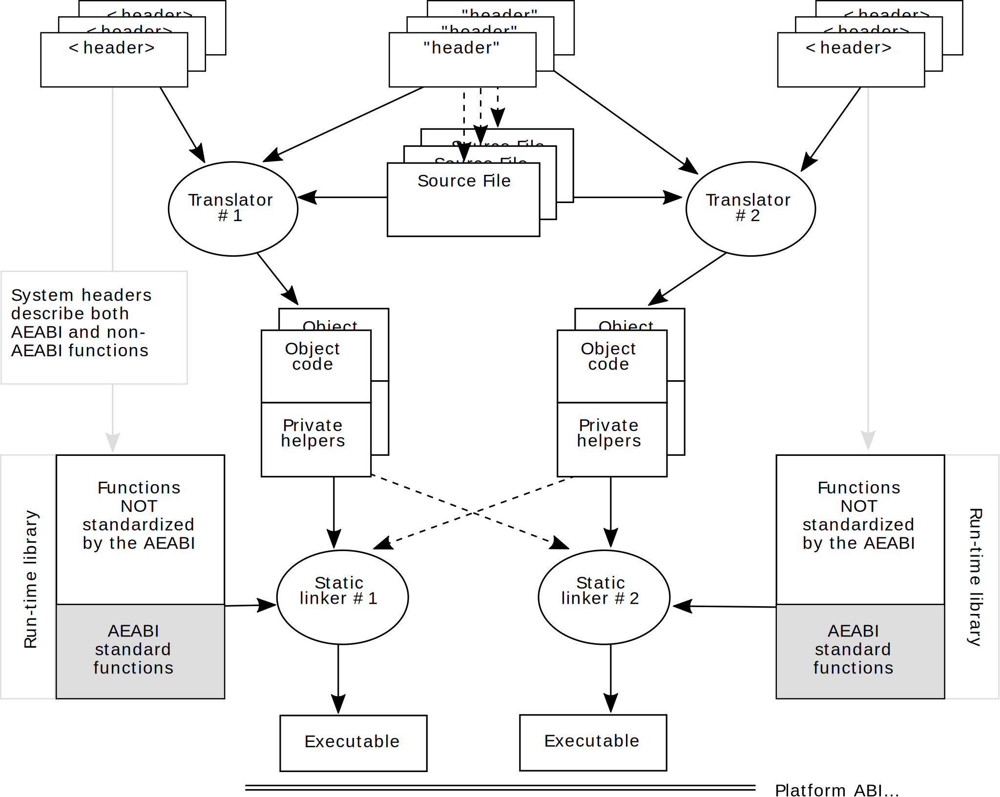

..
   Copyright (c) 2003, 2007-2009, 2012, 2015, 2018, 2020-2023, Arm Limited and its affiliates. All rights
   reserved. CC-BY-SA-4.0 AND Apache-Patent-License See LICENSE file
   for details

.. |release| replace:: 2023Q1
.. |date-of-issue| replace:: 06\ :sup:`th` April 2023
.. |copyright-date| replace:: 2003, 2007-2009, 2012, 2015, 2018, 2020-2023
.. |footer| replace:: Copyright © |copyright-date|, Arm Limited and its
                      affiliates. All rights reserved.
.. |armarmv5_link| replace:: https://developer.arm.com/docs/ddi0100/latest/armv5-architecture-reference-manual
.. |armarmv7ar_link| replace:: https://developer.arm.com/docs/ddi0406/c/arm-architecture-reference-manual-armv7-a-and-armv7-r-edition
.. |armarmv7m_link| replace:: https://developer.arm.com/products/architecture/m-profile/docs/ddi0403/e/armv7-m-architecture-reference-manual


.. _AAPCS32: https://github.com/ARM-software/abi-aa/releases
.. _AAELF32: https://github.com/ARM-software/abi-aa/releases
.. _Addenda32: https://github.com/ARM-software/abi-aa/releases
.. _ARMARM: https://developer.arm.com/docs/ddi0406/c/arm-architecture-reference-manual-armv7-a-and-armv7-r-edition
.. _ARMv7MARM: https://developer.arm.com/products/architecture/m-profile/docs/ddi0403/e/armv7-m-architecture-reference-manual
.. _ARMv5ARM: https://developer.arm.com/docs/ddi0100/latest/armv5-architecture-reference-manual
.. _BSABI32: https://github.com/ARM-software/abi-aa/releases
.. _CLIBABI32: https://github.com/ARM-software/abi-aa/releases
.. _CPPABI32: https://github.com/ARM-software/abi-aa/releases
.. _DBGOVL32: https://github.com/ARM-software/abi-aa/releases
.. _EHABI32: https://github.com/ARM-software/abi-aa/releases
.. _FDPIC: https://github.com/mickael-guene/fdpic_doc
.. _GCPPABI: http://itanium-cxx-abi.github.io/cxx-abi/abi.html
.. _GDWARF: http://dwarfstd.org/Dwarf3Std.php
.. _IEEE754: http://grouper.ieee.org/groups/754/
.. _LSB: http://www.linuxbase.org/
.. _RTABI32: https://github.com/ARM-software/abi-aa/releases
.. _SCO-ELF: http://www.sco.com/developers/gabi/
.. _SYM-VER: http://www.akkadia.org/drepper/symbol-versioning
.. _TLSDESC: http://www.fsfla.org/~lxoliva/writeups/TLS/paper-lk2006.pdf

***********************************************
Run-time ABI for the Arm\ :sup:`®` Architecture
***********************************************

.. class:: version

|release|

.. class:: issued

Date of Issue: |date-of-issue|

.. class:: logo

.. image:: Arm_logo_blue_RGB.svg
   :scale: 30%

.. section-numbering::

.. raw:: pdf

   PageBreak oneColumn


Preamble
========

Abstract
--------

This document defines a run-time helper-function ABI for programs
written in Arm-Thumb assembly language, C, and C++.

Keywords
--------

Run-time ABI, run-time library, helper functions

Latest release and defects report
---------------------------------

Please check `Application Binary Interface for the Arm® Architecture
<https://github.com/ARM-software/abi-aa>`_ for the latest
release of this document.

Please report defects in this specification to the `issue tracker page
on GitHub
<https://github.com/ARM-software/abi-aa/issues>`_.

.. raw:: pdf

   PageBreak

License
-------

This work is licensed under the Creative Commons
Attribution-ShareAlike 4.0 International License. To view a copy of
this license, visit http://creativecommons.org/licenses/by-sa/4.0/ or
send a letter to Creative Commons, PO Box 1866, Mountain View, CA
94042, USA.

Grant of Patent License. Subject to the terms and conditions of this
license (both the Public License and this Patent License), each
Licensor hereby grants to You a perpetual, worldwide, non-exclusive,
no-charge, royalty-free, irrevocable (except as stated in this
section) patent license to make, have made, use, offer to sell, sell,
import, and otherwise transfer the Licensed Material, where such
license applies only to those patent claims licensable by such
Licensor that are necessarily infringed by their contribution(s) alone
or by combination of their contribution(s) with the Licensed Material
to which such contribution(s) was submitted. If You institute patent
litigation against any entity (including a cross-claim or counterclaim
in a lawsuit) alleging that the Licensed Material or a contribution
incorporated within the Licensed Material constitutes direct or
contributory patent infringement, then any licenses granted to You
under this license for that Licensed Material shall terminate as of
the date such litigation is filed.

About the license
-----------------

As identified more fully in the License_ section, this project
is licensed under CC-BY-SA-4.0 along with an additional patent
license.  The language in the additional patent license is largely
identical to that in Apache-2.0 (specifically, Section 3 of Apache-2.0
as reflected at https://www.apache.org/licenses/LICENSE-2.0) with two
exceptions.

First, several changes were made related to the defined terms so as to
reflect the fact that such defined terms need to align with the
terminology in CC-BY-SA-4.0 rather than Apache-2.0 (e.g., changing
“Work” to “Licensed Material”).

Second, the defensive termination clause was changed such that the
scope of defensive termination applies to “any licenses granted to
You” (rather than “any patent licenses granted to You”).  This change
is intended to help maintain a healthy ecosystem by providing
additional protection to the community against patent litigation
claims.

Contributions
-------------

Contributions to this project are licensed under an inbound=outbound
model such that any such contributions are licensed by the contributor
under the same terms as those in the License_ section.

Trademark notice
----------------

The text of and illustrations in this document are licensed by Arm
under a Creative Commons Attribution–Share Alike 4.0 International
license ("CC-BY-SA-4.0”), with an additional clause on patents.
The Arm trademarks featured here are registered trademarks or
trademarks of Arm Limited (or its subsidiaries) in the US and/or
elsewhere. All rights reserved. Please visit
https://www.arm.com/company/policies/trademarks for more information
about Arm’s trademarks.

Copyright
---------

Copyright (c) |copyright-date|, Arm Limited and its affiliates.  All rights
reserved.

.. raw:: pdf

   PageBreak

.. contents::
   :depth: 3

.. raw:: pdf

   PageBreak

About this document
===================

Change control
--------------

Current status and anticipated changes
^^^^^^^^^^^^^^^^^^^^^^^^^^^^^^^^^^^^^^

The following support level definitions are used by the Arm ABI specifications:

**Release**
   Arm considers this specification to have enough implementations, which have
   received sufficient testing, to verify that it is correct. The details of these
   criteria are dependent on the scale and complexity of the change over previous
   versions: small, simple changes might only require one implementation, but more
   complex changes require multiple independent implementations, which have been
   rigorously tested for cross-compatibility. Arm anticipates that future changes
   to this specification will be limited to typographical corrections,
   clarifications and compatible extensions.

**Beta**
   Arm considers this specification to be complete, but existing
   implementations do not meet the requirements for confidence in its release
   quality. Arm may need to make incompatible changes if issues emerge from its
   implementation.

**Alpha**
   The content of this specification is a draft, and Arm considers the
   likelihood of future incompatible changes to be significant.

All content in this document is at the **Release** quality level.

Change history
^^^^^^^^^^^^^^

If there is no entry in the change history table for a release, there are no
changes to the content of the document for that release.

.. table::

  +------------+-------------------------------+---------------------------------------------------------+
  | Issue      | Date                          | Change                                                  |
  +============+===============================+=========================================================+
  | 1.0        | 30\ :sup:`th` October 2003    | First public release.                                   |
  +------------+-------------------------------+---------------------------------------------------------+
  | 2.0        | 24\ :sup:`th` March 2005      | Second public release.                                  |
  +------------+-------------------------------+---------------------------------------------------------+
  | 2.01       | 6\ :sup:`th` October 2005     | Added specifications of \_\_aeabi\_read\_tp()           |
  |            |                               | (`Thread-local storage (new in v2.01)`_) and            |
  |            |                               | \_\_cxa\_get\_exception\_ptr()                          |
  |            |                               | (`Exception-handling support`_).                        |
  +------------+-------------------------------+---------------------------------------------------------+
  | 2.02       | 23\ :sup:`rd` January 2007    | Deprecated fneg/dneg in `The floating-point helper      |
  |            |                               | functions`_.                                            |
  +------------+-------------------------------+---------------------------------------------------------+
  | 2.03       | 10\ :sup:`th` October 2007    | In `Private names for private and AEABI-specific helper |
  |            |                               | functions`_, replaced table by table                    |
  |            |                               | shared with AAELF. Clarified                            |
  |            |                               | `Integer (32/32 → 32) division functions`_, integer     |
  |            |                               | division. Updated the Arm ARM reference to include the  |
  |            |                               | version from `www.arm.com <http://www.arm.com>`__.      |
  +------------+-------------------------------+---------------------------------------------------------+
  | A, r2.06   | 25\ :sup:`th` October 2007    | Document renumbered (formerly GENC-003537 v2.03).       |
  +------------+-------------------------------+---------------------------------------------------------+
  | B, r2.07   | 10\ :sup:`th` October 2008    | Add return value comments to \_\_aeabi\_\* helper       |
  |            |                               | functions in `Helper functions defined by the C++ ABI   |
  |            |                               | for the Arm Architecture`_.                             |
  +------------+-------------------------------+---------------------------------------------------------+
  | C, r2.08   | 19\ :sup:`th` October 2009    | Added `\_\_hardfp\_ name mangling`_ to explain legacy,  |
  |            |                               | deprecated \_\_hardfp\_ name mangling; in `The          |
  |            |                               | floating-point helper functions`_, declared fneg/dneg   |
  |            |                               | *obsolete*; improved text specifying the registers      |
  |            |                               | maybe affected by a call to an FP helper; added         |
  |            |                               | conversion helpers between VFPv3 half-precision and     |
  |            |                               | float to `Standard conversions between                  |
  |            |                               | floating types`_.                                       |
  +------------+-------------------------------+---------------------------------------------------------+
  | D, r2.09   | 30\ :sup:`th` November 2012   | In `Base requirements on AEABI-complying FP helper      |
  |            |                               | functions`_, updated [ARM ARM] reference for signaling  |
  |            |                               | NaNs. In `The floating-point helper functions`_,        |
  |            |                               | removed \_\_aeabi\_dneg and \_\_aeabi\_fneg obsoleted   |
  |            |                               | in r2.08, and added conversion helpers from double to   |
  |            |                               | VFPv3 half-precision to `Standard                       |
  |            |                               | conversions between floating types`_.                   |
  +------------+-------------------------------+---------------------------------------------------------+
  | 2018Q4     | 21\ :sup:`st` December 2018   | In `Standard conversions between floating               |
  |            |                               | types`_, specified handling of infinity and NaN in      |
  |            |                               | f2h_alt and d2h_alt.                                    |
  +------------+-------------------------------+---------------------------------------------------------+
  | 2020Q4     | 21\ :sup:`st` December 2020   | - document released on Github                           |
  |            |                               | - new License_: CC-BY-SA-4.0                            |
  |            |                               | - new sections on Contributions_,                       |
  |            |                               |   `Trademark notice`_, and Copyright_                   |
  +------------+-------------------------------+---------------------------------------------------------+

References
----------

This document refers to, or is referred to by, the following.

.. class:: rtabi32-refs

.. table::

  +----------------------------+------------------------------------------------------------------------------------------------------+---------------------------------------------------------------------------------+
  | Ref                        | URL or other reference                                                                               | Title                                                                           |
  +============================+======================================================================================================+=================================================================================+
  | AAELF32_                   |                                                                                                      | ELF for the Arm Architecture.                                                   |
  +----------------------------+------------------------------------------------------------------------------------------------------+---------------------------------------------------------------------------------+
  | AAPCS32_                   |                                                                                                      | Procedure Call Standard for the Arm Architecture                                |
  +----------------------------+------------------------------------------------------------------------------------------------------+---------------------------------------------------------------------------------+
  | BSABI32_                   |                                                                                                      | ABI for the Arm Architecture (Base Standard)                                    |
  +----------------------------+------------------------------------------------------------------------------------------------------+---------------------------------------------------------------------------------+
  | CLIBABI32_                 |                                                                                                      | C Library ABI for the Arm Architecture                                          |
  +----------------------------+------------------------------------------------------------------------------------------------------+---------------------------------------------------------------------------------+
  | CPPABI32_                  |                                                                                                      | C++ ABI for the Arm Architecture                                                |
  +----------------------------+------------------------------------------------------------------------------------------------------+---------------------------------------------------------------------------------+
  | EHABI32_                   |                                                                                                      | Exception Handling ABI for the Arm Architecture                                 |
  +----------------------------+------------------------------------------------------------------------------------------------------+---------------------------------------------------------------------------------+
  | RTABI32_                   |                                                                                                      | Run-time ABI for the Arm Architecture (*This document*)                         |
  +----------------------------+------------------------------------------------------------------------------------------------------+---------------------------------------------------------------------------------+
  | Addenda32_                 |                                                                                                      | Addenda to, and Errata in, the ABI for the Arm Architecture                     |
  +----------------------------+------------------------------------------------------------------------------------------------------+---------------------------------------------------------------------------------+
  | ARMARM_                    | |armarmv7ar_link|                                                                                    | Arm DDI 0406: Arm Architecture Reference Manual Arm v7-A and Arm v7-R edition   |
  |                            +------------------------------------------------------------------------------------------------------+---------------------------------------------------------------------------------+
  | ARMv7MARM_                 | |armarmv7m_link|                                                                                     | Arm DDI 0403C: Armv7-M Architecture Reference Manual                            |
  +----------------------------+------------------------------------------------------------------------------------------------------+---------------------------------------------------------------------------------+
  | ARMV5ARM_                  | |armarmv5_link|                                                                                      | Arm DDI 0100I: Armv5 Architecture Reference Manual                              |
  +----------------------------+------------------------------------------------------------------------------------------------------+---------------------------------------------------------------------------------+
  | GCPPABI_                   | http://itanium-cxx-abi.github.io/cxx-abi/abi.html                                                    | Generic C++ ABI                                                                 |
  +----------------------------+------------------------------------------------------------------------------------------------------+---------------------------------------------------------------------------------+
  | IEEE754_                   | http://grouper.ieee.org/groups/754/                                                                  | IEEE P754 Standard for Floating-Point Arithmetic                                |
  +----------------------------+------------------------------------------------------------------------------------------------------+---------------------------------------------------------------------------------+

Terms and abbreviations
-----------------------

The *ABI for the Arm Architecture* uses the following terms and
abbreviations.

AAPCS
   Procedure Call Standard for the Arm Architecture.

ABI
   Application Binary Interface:

   1. The specifications to which an executable must conform in order to
      execute in a specific execution environment. For example, the
      :title-reference:`Linux ABI for the Arm Architecture`.

   2. A particular aspect of the specifications to which independently
      produced relocatable files must conform in order to be
      statically linkable and executable. For example, the CPPABI32_,
      the RTABI32_, the CLIBABI32_.

AEABI
   (Embedded) ABI for the Arm architecture (this ABI...)

Arm-based
   ... based on the Arm architecture ...

core registers
   The general purpose registers visible in the Arm architecture’s
   programmer’s model, typically r0-r12, SP, LR, PC, and CPSR.

EABI
   An ABI suited to the needs of embedded, and deeply embedded (sometimes
   called free standing), applications.

Q-o-I
   Quality of Implementation – a quality, behavior, functionality, or
   mechanism not required by this standard, but which might be provided
   by systems conforming to it.  Q-o-I is often used to describe the
   tool-chain-specific means by which a standard requirement is met.

VFP
   The Arm architecture’s Floating Point architecture and instruction
   set.  In this ABI, this abbreviation includes all floating point
   variants regardless of whether or not vector (V) mode is supported.

Acknowledgements
----------------

This specification has been developed with the active support of the
following organizations. In alphabetical order: Arm, CodeSourcery,
Intel, Metrowerks, Montavista, Nexus Electronics, PalmSource, Symbian,
Texas Instruments, and Wind River.

.. raw:: pdf

   PageBreak

Scope
=====

Conformance to the *ABI for the Arm architecture* is intended to support
inter-operation between:

-  Relocatable files generated by different tool chains.

-  Executable and shared object files generated for the same execution
   environment by different tool chains.

This *standard for run-time helper functions* allows a relocatable file
built by one conforming tool chain from Arm-Thumb assembly language, C,
or stand alone C++ to be compatible with the static linking environment
provided by a different conforming tool chain.

.. _Inter-operation between relocatable files:

.. rubric:: Inter-operation between relocatable files



In this model of inter-working, the standard headers used to build a
relocatable file are those associated with the tool chain building it,
not those associated with the library with which the relocatable fille
will, ultimately, be linked.

Introduction
============

A number of principles of inter-operation are implicit in, or
compatible with, `Inter-operation between relocatable files`_ above.
This section describes these principles as they apply to run-time
helper functions, and gives a rationale for each one. The
corresponding section of CLIBABI32_ discusses the same issues as they
apply to C library functions.

References between separately built relocatable files
-----------------------------------------------------

A relocatable file can refer to functions and data defined in other
relocatable files or libraries.

**Application headers describe application entities**

Entities defined in application relocatable files are declared in
application header files (*“header”* in `Inter-operation between
relocatable files`_).

-  An application header file must describe the same binary interface to
   declared data and functions, to every ABI-conforming compiler that
   reads it.

-  Tool-chain-specific information in such header files must affect only
   the quality of implementation of the relocatable files whose sources
   includes the headers, not their binary interfaces.

**Rationale**: A relocatable file or library is distributed with a set
of header files describing its interface. Different compilers must
interpret the underlying binary interface description identically.
Nevertheless, some compilers might comprehend pragmas or
pre-processor-guarded language extensions that cause better code to be
generated, or that trigger behavior that does not affect the binary
compatibility of interfaces.

**Standard (system) headers describe run-time libraries**

In general, entities defined in run-time libraries are declared in
standard (or system) header files (*<header>* in `Inter-operation
between relocatable files`_). A standard header need not be
intelligible to any tool chain other than the one that provides it.

**Rationale**: Some language-standardized behavior cannot be securely or
conveniently described in source-language terms that all compilers
implement identically (for example, va\_start and va\_arg from C’s
stdarg.h).

So, a relocatable file must be built using the standard headers
associated with the compiler building it.

Standardized compiler helper functions
--------------------------------------

Each static linking environment shall provide a set of standard *helper
functions* defined by this ABI. See `The Standard Compiler Helper Function Library`_, for a list of
standardized helper functions.

A helper function is one that a relocatable file might refer to even
though its source includes no standard headers (or, indeed, no headers
at all). A helper function usually implements some aspect of a
programming language not implemented by its standard library (for
example, from C, floating-point to integer conversions).

In some cases, a helper function might implement some aspect of standard
library behavior not implemented by any of its interface functions (for
example, from the C library, *errno*).

A helper function might also implement an operation not implemented by
the underlying hardware, for example, integer division, floating-point
arithmetic, or reading and writing misaligned data.

Examples of run-time helper functions include those to perform integer
division, and floating-point arithmetic by software, and those required
to support the processing of C++ exceptions.

Each such function has a defined type signature, a precise (often
simple) meaning, and a small set of standard names (there may be more
than one name for a helper function).

Rationale for standardizing helper functions
^^^^^^^^^^^^^^^^^^^^^^^^^^^^^^^^^^^^^^^^^^^^

There is a mixture of convenience, opportunism, and necessity.

-  Without standard helper functions, each relocatable file would have
   to carry all of its support functions with it, either in ELF COMDAT
   groups within the relocatable file itself or in an adjunct library.

-  Multiple tool chains (at least from Arm and GNU) implement
   essentially compatible floating-point arithmetic functions.
   (Corresponding functions have identical type signatures and
   semantics, but different names).

-  In C++, even if no system headers are included, inter-working is only
   possible if implementations agree on the helpers to use in
   construction, destruction, and throwing exceptions.

Private helper functions must be carried with the using file
------------------------------------------------------------

A needed helper function that is not available in all ABI-complying
environments—any helper not standardized by this ABI component—must be
supplied with the relocatable file that needs it. There are two ways to
do this.

-  Provide the required helpers in a separate library (see `Library file organization`_) and
   provide the library with any relocatable file that might refer to it.

-  Include the helpers in additional sections within the relocatable
   file in named ELF COMDAT groups. This is the standard way to
   distribute C++ constructors, destructors, out-of-line copies of
   inline functions, etc.

We encourage use of the second (COMDAT group) method, though the choice
of method is properly a quality of implementation concern for each tool
chain provider.

Some private functions might nonetheless be standardized 
--------------------------------------------------------

The first issue of this ABI defines no functions in this class. However,
new helper functions would first be added as standardized private helper
functions, until implementations of helper-function libraries caught up.

Many run-time functions do not have a standard ABI
--------------------------------------------------

In general, it is very hard to standardize the C++ library using the
approach to library standardization outlined here and in CLIBABI32_. The
C++ standard allows an implementation to inline any of the library
functions [17.4.4.3, 17.4.4.4] and to add private members to any C++
library class [17.3.2.3]. In general, implementations use this latitude,
and there is no ubiquitous standard implementation of the C++ library.

In effect, C++ library headers define an API, not an ABI. To
inter-work with a particular C++ library implementation requires that
the compiler read the matching header files, breaking the model
depicted in `Inter-operation between relocatable files`_, above.

A run-time library is all or nothing
------------------------------------

In general, we cannot expect a helper function from vendor A's library
to work with a different helper function from vendor B's library.
Although most helper functions will be independent leaf (or near leaf)
functions, tangled clumps of implementation could underlie apparently
independent parts of a run-time library's public interface.

In some cases, there may be inter-dependencies between run-time
libraries, the static linker, and the ultimate execution environment.
For example, the way that a program acquires its startup code (sometimes
called crt0.o) may depend on the run-time library and the static linker.

This leads to a major conclusion for statically linked executables:
**the static linker and the run-time libraries must be from the same
tool chain**.

Accepting this constraint gives considerable scope for private
arrangements (not governed by this ABI) between these tool chain
components, restricted only by the requirement to provide a well defined
binary interface (ABI) to the functions described in `The Standard Compiler Helper Function Library`_.

Important corollaries of this library standardization model
-----------------------------------------------------------

System headers *can* require compiler-specific functionality (e.g. for
handling va\_start, va\_arg, etc). The resulting binary code must
conform to this ABI.

As far as this ABI is concerned, a standard library header is processed
only by a matching compiler. A platform ABI can impose further
constraints that cause more compilers to match, but this ABI does not.

This ABI defines the full set of public helper functions available in
every conforming execution environment.

Every tool chain's run-time library must implement the full set of
public helper functions defined by this ABI.

Private helper functions can call other private helper functions, public
helper functions, and language-standard-defined library functions. A
private helper function must not call any function that requires a
specific implementation of a language run-time library or helper
library.

The implementation of a private helper function (and that of each
private helper function it calls) must be offered in a COMDAT group
within the ELF [AAELF32_] relocatable file that needs it, or in a *freely
re-distributable* library (`Library file organization`_) provided by the tool chain as an
adjunct to the relocatable file.

(*Freely re-distributable* means: Distributable on terms no more
restrictive than those applying to any generated relocatable file).

Private names for private and AEABI-specific helper functions
-------------------------------------------------------------

External names used in the implementation of private helper functions
and private helper data must be in the vendor-specific name space
reserved by this ABI. All such names have the form
\_\_\ *vendor-prefix\_name*.

The vendor prefix must be registered with the maintainers of this ABI
specification. Prefixes must not contain underscore ('\_') or dollar
('$'). Prefixes starting with *Anon* and *anon* are reserved for
unregistered private use.

For example (from the C++ exception handling ABI):

  \_\_\ **aeabi**\ \_unwind\_cpp\_pr0
  \_\_\ **ARM**\ \_Unwind\_cpp\_prcommon

The current list of registered vendor, and pseudo vendor, prefixes is
given in the following table.

.. table:: Registered Vendors

  +-------------------+---------------------------------------------------------------------+
  | Name              | Vendor                                                              |
  +===================+=====================================================================+
  | ``ADI``           | Analog Devices                                                      |
  +-------------------+---------------------------------------------------------------------+
  | ``acle``          | Reserved for use by Arm C Language Extensions.                      |
  +-------------------+---------------------------------------------------------------------+
  | ``aeabi``         | Reserved to the ABI for the Arm Architecture (EABI pseudo-vendor)   |
  +-------------------+---------------------------------------------------------------------+
  | | ``Anon``\ *Xyz* | Reserved to private experiments by the Xyz vendor.                  |
  | | ``anon``\ *Xyz* | Guaranteed not to clash with any registered vendor name.            |
  +-------------------+---------------------------------------------------------------------+
  | ``ARM``           | Arm Ltd (Note: the company, not the processor).                     |
  +-------------------+---------------------------------------------------------------------+
  | ``cxa``           | C++ ABI pseudo-vendor                                               |
  +-------------------+---------------------------------------------------------------------+
  | ``FSL``           | Freescale Semiconductor Inc.                                        |
  +-------------------+---------------------------------------------------------------------+
  | ``GHS``           | Green Hills Systems                                                 |
  +-------------------+---------------------------------------------------------------------+
  | ``gnu``           | GNU compilers and tools (Free Software Foundation)                  |
  +-------------------+---------------------------------------------------------------------+
  | ``iar``           | IAR Systems                                                         |
  +-------------------+---------------------------------------------------------------------+
  | ``icc``           | ImageCraft Creations Inc (*ImageCraft C Compiler*)                  |
  +-------------------+---------------------------------------------------------------------+
  | ``intel``         | Intel Corporation                                                   |
  +-------------------+---------------------------------------------------------------------+
  | ``ixs``           | Intel Xscale                                                        |
  +-------------------+---------------------------------------------------------------------+
  | ``llvm``          | The LLVM/Clang projects                                             |
  +-------------------+---------------------------------------------------------------------+
  | ``PSI``           | PalmSource Inc.                                                     |
  +-------------------+---------------------------------------------------------------------+
  | ``RAL``           | Rowley Associates Ltd                                               |
  +-------------------+---------------------------------------------------------------------+
  | ``SEGGER``        | SEGGER Microcontroller GmbH                                         |
  +-------------------+---------------------------------------------------------------------+
  | ``somn``          | SOMNIUM Technologies Limited.                                       |
  +-------------------+---------------------------------------------------------------------+
  | ``TASKING``       | Altium Ltd.                                                         |
  +-------------------+---------------------------------------------------------------------+
  | ``TI``            | TI Inc.                                                             |
  +-------------------+---------------------------------------------------------------------+
  | ``tls``           | Reserved for use in thread-local storage routines.                  |
  +-------------------+---------------------------------------------------------------------+
  | ``WRS``           | Wind River Systems.                                                 |
  +-------------------+---------------------------------------------------------------------+

To register a vendor prefix with Arm, please E-mail your request to
arm.eabi at arm.com.

Library file organization
-------------------------

Libraries that must be portable between complying tool chains – such as
adjunct libraries of private helper functions (`Private helper functions must be carried with the using file`_), and libraries of
run-time helper functions that comply with this specification (`The Standard Compiler Helper Function Library`_) and
are intended to be used with other tool chains’ linkers – must satisfy
the following conditions.

-  The library file format is the **ar** format described in BSABI32_.

-  It must not matter whether libraries are searched once or repeatedly
   (this is Q-o-I).

-  Multiple adjunct libraries can appear in any order in the list of
   libraries given to the linker provided that they precede all
   libraries contributing to the run-time environment.

In general, this requires accepting the following organizational
constraints.

-  No member of an adjunct library can refer to a member of any other
   library other than to an entity specified by this ABI that
   contributes to the run-time environment.

-  The names of adjunct members must be in a vendor-private name space
   (`Private names for private and AEABI-specific helper functions`_).

-  If run-time environment support functions are provided in multiple
   libraries, and these are intended to be usable by other
   ABI-conforming linkers, it must be possible to list the libraries in
   at least one order in which each reference between them is from a
   library to one later in the order. This order must be documented.

\_\_hardfp\_ name mangling
--------------------------

This section describes a name-mangling convention adopted by armcc (Arm
Limited’s commercial compiler) six years before this ABI was published
and three years before ABI development began. The name mangling is
unnecessary under this ABI so we now deprecate it. Obviously, compilers
in service will continue to generate the names for some time.

A goal of this ABI is to support the development of portable binary code
but the lack of ubiquity of the floating-point (FP) instruction set
causes a problem if the code uses FP values in its interface functions.

-  Code that makes no use of FP values can be built to the *Base
   Procedure Call Standard* [AAPCS32_] and will be compatible with an
   application built to the base standard or the VFP procedure call
   standard [AAPCS32_, section 'The Standard Variants'].

-  Portable binary code that makes heavy use of FP will surely be
   offered in two variants: base-standard for environments that lack FP
   hardware and VFP-standard otherwise.

-  Portable binary code that makes only light use of floating point
   might reasonably be offered in the base standard only with its
   FP-using functions declared in its supporting header files as
   base-standard interfaces using some Q-o-I means such as decoration
   with ``__softfp``` or ``__ATTRIBUTE((softfp))__``.

The third use case causes a potential problem.

-  Both the portable code and the application that uses it might refer
   to the same standard library function (such as ``strtod()`` or ``sin()``).

-  The portable code will expect a base-standard interface and the
   application will expect a VFP-standard interface. The variants are
   not call-compatible.

The scope of this problem is precisely: all non-variadic standard
library functions taking floating-point parameters or delivering
floating-point results.

Implicit calls to conversion functions that arise from expressions such
as ``double d = (double) int_val`` can also cause difficulties. A call is
either to a floating-point (FP) helper function (such as ``__aeabi_i2d``,
`Standard integer to floating-point conversions`_, below]) defined by this ABI (`The floating-point helper functions`_) or to a private helper
function. The FP helpers defined by this ABI cause no difficulties
because they always use a base-standard interface but a private helper
function would suffer the same problem as ``strtod()`` or ``sin()`` if the same
tool chain were used to build the application and the portable binary
and the helper function were not forced to have a base-standard
interface.

The 1999 (pre-ABI) solution to this problem (first adopted by ADS 1.0)
was as follows.

-  Identify those functions that would be expected to have VFP-standard
   interfaces when used in a VFP-standard application (such as ``strtod``
   and ``sin``).

-  Mangle the name of the VFP-standard variant of each of these
   functions using the prefix ``__hardfp``.

In 1999, VFP was not widely deployed in Arm-based products so it was
reasonable to load these inter-operation costs on users of the VFP
calling standard.

Today, this ABI defines a clean way for tool chains to support this
functionality without resorting to encoding the interface standard in a
function’s name. The ``Tag_ABI_VFP_args`` build attribute in Addenda32_
records the interface intentions of a producer. In principle, this tag
gives enough information to a tool chain to allow it to solve, using its
own Q-o-I means, the problem described in this section that arises from
the third use case.

The problem described in this section arises in the most marginal of the
three portable-code use cases described in the bullet points at the
beginning of this section so we now recommend that tool chains should
*not* mangle the affected names (essentially the functions described by
the C library’s ``<math.h>`` and some from ``<stdlib.h>``).

The Standard Compiler Helper Function Library
=============================================

Floating-point library
----------------------

The floating point model
^^^^^^^^^^^^^^^^^^^^^^^^

The floating point model is based on [IEEE754_] floating-point number
representations and arithmetic. Base requirements on helper functions
and restrictions on usage by client code are listed below.

ABI-complying helper function libraries may provide more functionality
than is specified here, perhaps a full implementation of the IEEE 754
specification, but ABI-complying application code must not require more
than the specified subset (save by private contract with the execution
environments).

The set of helper functions has been designed so that:

-  A full IEEE implementation is a natural super-set.

-  A producer can ensure that, by carefully choosing the correct helper
   function for the purpose, the intended application behavior does not
   change inappropriately if the helper-function implementations support
   more than the ABI-required, IEEE 754-specified behavior.

Base requirements on AEABI-complying FP helper functions
~~~~~~~~~~~~~~~~~~~~~~~~~~~~~~~~~~~~~~~~~~~~~~~~~~~~~~~~

Helper functions must correctly process all IEEE 754 single- and
double-precision numbers, including -0 and ±infinity, using the *round
to nearest* rounding mode.

Floating-point exceptions are untrapped, so invalid operations must
generate a default result.

If the implementation supports NaNs, the following requirements hold in
addition to those imposed on processing by IEEE 754.

-  All IEEE NaN bit patterns with the most significant bit of the
   significand set are quiet, and all with the most significant bit
   clear are signaling (as defined by [ARM ARM], chapter A2, Application
   Level Programmers’ Model).

-  When not otherwise specified by IEEE 754, the result on an invalid
   operation should be the quiet bit pattern with only the most
   significant bit of the significand set, and all other significand
   bits zero.

**Dispensation – de-normal numbers**

De-normal numbers may be flushed to zero in an implementation-defined
way.

We permit de-normal flushing in deference to hardware implementations of
floating-point, where correct IEEE 754 behavior might require supporting
code that would be an unwelcome burden to an embedded system.

Implementations that flush to zero will violate the Java numerical
model, but we recognize that:

-  Often, higher performance and smaller code size legitimately outweigh
   floating-point accuracy concerns.

-  High quality floating-point behavior inevitably requires application
   code to be aware of the floating-point properties of its execution
   environment. Floating-point code that has onerous requirements (rare
   in embedded applications) must advertise this.

Software-only implementations should correctly support de-normal
numbers.

**Dispensations relating to NaNs**

An implementation need not process or generate NaNs. In this case, the
result of each invalid operation is implementation defined (and could,
for example, simply be ±zero).

If NaNs are supported, it is only required to recognize, process, and
convert those values with at least one bit set in the 20 most
significant bits of the mantissa. Remaining bits should be zero and can
be ignored. When a quiet NaN of one precision is converted to a quiet of
the other precision, the most significant 20 bits of the mantissa must
be preserved. Consequently:

-  A NaN can be recognized by processing the most significant or only word
   of the representation. The least significant word of a double can be
   ignored (it should be zero).

-  Each ABI-complying value has a single-precision representation, and a
   corresponding double-precision representation in which the least
   significant word is zero.

-  Each ABI-complying NaN value is converted between single- and
   double-precision in the same way that Arm VFP VCVT instructions
   convert the values.

Restrictions on FP usage by ABI-complying programs
~~~~~~~~~~~~~~~~~~~~~~~~~~~~~~~~~~~~~~~~~~~~~~~~~~

The rounding mode is fixed as round to nearest. This is the IEEE 754
default when a program starts and the state required by the Java
numerical model. A conforming client must not change the rounding mode.

Conforming clients must not fabricate bit patterns that correspond to
de-normal numbers. A de-normal number must only be generated as a result
of operating on normal numbers (for example, subtracting two very close
values). A de-normal number may be flushed to zero on input to, or on
output from, a helper function.

There are no floating-point exceptions. This is the IEEE 754 default
when a program starts. A conforming client must not change the exception
trap state or attempt to trap IEEE exceptions.

Conforming clients must not directly fabricate bit patterns that
correspond to NaNs. A NaN can only be generated as a result of an operation
on normal numbers (for example, subtracting +infinity from +infinity or
multiplying ±infinity by ±zero).

A conforming client must not rely on generating a NaN by operating on
normal numbers as described above.

A NaN-using client must use only those values having at least one bit
set in the 20 most significant mantissa bits, and all other mantissa
bits zero.

The floating-point helper functions
^^^^^^^^^^^^^^^^^^^^^^^^^^^^^^^^^^^

The functions defined in this section use software floating-point (*Base
Procedure Call Standard* [AAPCS32_]) calling and result-returning
conventions, even when they are implemented using floating-point
hardware. That is, parameters to and results from them are passed in
*integer* *core registers*.

The functions defined in `Standard double precision floating-point
arithmetic helper functions`_, `Standard double precision
floating-point comparison helper functions`_, `Standard single
precision floating-point arithmetic helper functions`_, and `Standard
single precision floating-point comparison helper functions`_ together
implement the floating-point (FP) arithmetic operations from the FP
instruction set. The functions defined in `Standard floating-point to
integer conversions`_, `Standard conversions between floating types`_,
and `Standard integer to floating-point conversions`_ implement the
floating-point (FP) conversion operations from the FP instruction set,
the conversions between FP values and {unsigned} long long, and the
conversions between the VFPv3 half-precision storage-only binary
format and IEEE 754 binary32 (single precision) binary format.

Implementations of these helper functions are allowed to corrupt the
integer core registers permitted to be corrupted by the AAPCS32_ (r0-r3,
ip, lr, and CPSR).

If the FP instruction set is available, implementations of these
functions may use it. Consequently, FP hardware-using code that calls
one of these helper functions directly, *or indirectly by calling a
function with a base-standard interface*, must assume that the FP
parameter, result, scratch, and status registers might be altered by a
call to it.

Binary functions take their arguments in source order where the order
matters. For example, ``__aeabi_op(x, y)`` computes x *op* y, not y *op*
x. The exceptions are **r**\ sub, and **r**\ cmple whose very purpose is
to operate the other way round.

.. _Standard double precision floating-point arithmetic helper functions:

.. table:: Standard double precision floating-point arithmetic helper functions

  +-----------------------------------------------+-----------------------------------------------+
  | Name and type signature                       | Description                                   |
  +===============================================+===============================================+
  | ``double __aeabi_dadd(double, double)``       | double-precision addition                     |
  +-----------------------------------------------+-----------------------------------------------+
  | ``double __aeabi_ddiv(double n, double d)``   | double-precision division, n / d              |
  +-----------------------------------------------+-----------------------------------------------+
  | ``double __aeabi_dmul(double, double)``       | double-precision multiplication               |
  +-----------------------------------------------+-----------------------------------------------+
  | ``double __aeabi_drsub(double x, double y)``  | double-precision reverse subtraction, y – x   |
  +-----------------------------------------------+-----------------------------------------------+
  | ``double __aeabi_dsub(double x, double y)``   | double-precision subtraction, x – y           |
  +-----------------------------------------------+-----------------------------------------------+

.. _Standard double precision floating-point comparison helper functions:

.. class:: rtabi32-float-comparisons

.. table:: Standard double precision floating-point comparison helper functions

  +--------------------------------------------+-------------------------------------------------------------------+
  | Name and type signature                    | Description                                                       |
  +============================================+===================================================================+
  | ``void __aeabi_cdcmpeq(double, double)``   | non-excepting equality comparison [1], result in PSR ZC flags     |
  +--------------------------------------------+-------------------------------------------------------------------+
  | ``void __aeabi_cdcmple(double, double)``   | 3-way (<, =, ?>) compare [1], result in PSR ZC flags              |
  +--------------------------------------------+-------------------------------------------------------------------+
  | ``void __aeabi_cdrcmple(double, double)``  | reversed 3-way (<, =, ?>) compare [1], result in PSR ZC flags     |
  +--------------------------------------------+-------------------------------------------------------------------+
  | ``int __aeabi_dcmpeq(double, double)``     | result (1, 0) denotes (=, ?<>) [2], use for C == and !=           |
  +--------------------------------------------+-------------------------------------------------------------------+
  | ``int __aeabi_dcmplt(double, double)``     | result (1, 0) denotes (<, ?>=) [2], use for C <                   |
  +--------------------------------------------+-------------------------------------------------------------------+
  | ``int __aeabi_dcmple(double, double)``     | result (1, 0) denotes (<=, ?>) [2], use for C <=                  |
  +--------------------------------------------+-------------------------------------------------------------------+
  | ``int __aeabi_dcmpge(double, double)``     | result (1, 0) denotes (>=, ?<) [2], use for C >=                  |
  +--------------------------------------------+-------------------------------------------------------------------+
  | ``int __aeabi_dcmpgt(double, double)``     | result (1, 0) denotes (>, ?<=) [2], use for C >                   |
  +--------------------------------------------+-------------------------------------------------------------------+
  | ``int __aeabi_dcmpun(double, double)``     | result (1, 0) denotes (?, <=>) [2], use for C99 ``isunordered()`` |
  +--------------------------------------------+-------------------------------------------------------------------+

.. note::

  Notes on `Standard double precision floating-point comparison helper
  functions`_, above, and `Standard single precision floating-point
  comparison helper functions`_, below
  
  1. The 3-way comparison functions ``c*cmple``, ``c*cmpeq`` and ``c*rcmple``
     return their results in the CPSR Z and C flags. C is clear only if
     the operands are ordered and the first operand is less than the
     second. Z is set only when the operands are ordered and equal.
  
     This means that ``c*cmple`` is the appropriate helper to use for C language
     < and ≤ comparisons.
  
     For > and ≥ comparisons, the order of operands to the comparator and the
     sense of the following branch condition must both be reversed. For
     example, to implement ``if (a > b) {...} else L1``, use:
  
       | ``__aeabi_cdcmple(b, a); BHS L1``; or
       | ``__aeabi_cdrcmple(a, b); BHS L1``.
  
     The ``*rcmple`` functions may be implemented as operand swapping veneers
     that tail-call the corresponding versions of ``cmple``.
  
     When implemented to the full IEEE specification, ``*le`` helpers
     potentially throw exceptions when comparing with quiet NaNs. The ``*eq``
     helpers do not. Of course, all comparisons will potentially throw
     exceptions when comparing with signaling NaNs.
  
     Minimal implementations never throw exceptions. In the absence of NaNs,
     ``c*cmpeq`` can be an alias for ``c*cmple``.
  
     The 3-way, status-returning comparison functions preserve all core
     registers except ip, lr, and the CPSR.
  
  2. The six Boolean versions ``*cmp*`` return 1 or 0 in r0 to denote the
     truth or falsity of the IEEE predicate they test. As in note1, all
     except ``*cmpeq`` and ``*cmpun`` can throw an exception when comparing a
     quiet.

.. _Standard single precision floating-point arithmetic helper functions:

.. table:: Standard single precision floating-point arithmetic helper functions

  +--------------------------------------------+-----------------------------------------------+
  | Name and type signature                    | Description                                   |
  +============================================+===============================================+
  | ``float __aeabi_fadd(float, float)``       | single-precision addition                     |
  +--------------------------------------------+-----------------------------------------------+
  | ``float __aeabi_fdiv(float n, float d)``   | single-precision division, n / d              |
  +--------------------------------------------+-----------------------------------------------+
  | ``float __aeabi_fmul(float, float)``       | single-precision multiplication               |
  +--------------------------------------------+-----------------------------------------------+
  | ``float __aeabi_frsub(float x, float y)``  | single-precision reverse subtraction, y – x   |
  +--------------------------------------------+-----------------------------------------------+
  | ``float __aeabi_fsub(float x, float y)``   | single-precision subtraction, x – y           |
  +--------------------------------------------+-----------------------------------------------+

.. _Standard single precision floating-point comparison helper functions:

.. class:: rtabi32-float-comparisons

.. table:: Standard single precision floating-point comparison helper functions

  +------------------------------------------+-------------------------------------------------------------------+
  | Name and type signature                  | Description                                                       |
  +==========================================+===================================================================+
  | ``void __aeabi_cfcmpeq(float, float)``   | non-excepting equality comparison [1], result in PSR ZC flags     |
  +------------------------------------------+-------------------------------------------------------------------+
  | ``void __aeabi_cfcmple(float, float)``   | 3-way (<, =, ?>) compare [1], result in PSR ZC flags              |
  +------------------------------------------+-------------------------------------------------------------------+
  | ``void __aeabi_cfrcmple(float, float)``  | reversed 3-way (<, =, ?>) compare [1], result in PSR ZC flags     |
  +------------------------------------------+-------------------------------------------------------------------+
  | ``int __aeabi_fcmpeq(float, float)``     | result (1, 0) denotes (=, ?<>) [2], use for C == and !=           |
  +------------------------------------------+-------------------------------------------------------------------+
  | ``int __aeabi_fcmplt(float, float)``     | result (1, 0) denotes (<, ?>=) [2], use for C <                   |
  +------------------------------------------+-------------------------------------------------------------------+
  | ``int __aeabi_fcmple(float, float)``     | result (1, 0) denotes (<=, ?>) [2], use for C <=                  |
  +------------------------------------------+-------------------------------------------------------------------+
  | ``int __aeabi_fcmpge(float, float)``     | result (1, 0) denotes (>=, ?<) [2], use for C >=                  |
  +------------------------------------------+-------------------------------------------------------------------+
  | ``int __aeabi_fcmpgt(float, float)``     | result (1, 0) denotes (>, ?<=) [2], use for C >                   |
  +------------------------------------------+-------------------------------------------------------------------+
  | ``int __aeabi_fcmpun(float, float)``     | result (1, 0) denotes (?, <=>) [2], use for C99 ``isunordered()`` |
  +------------------------------------------+-------------------------------------------------------------------+

.. _Standard floating-point to integer conversions:

.. class:: rtabi32-float-int-conversions

.. table:: Standard floating-point to integer conversions

  +-----------------------------------------------+----------------------------------------------------------------+
  | Name and type signature                       | Description                                                    |
  +===============================================+================================================================+
  | ``int __aeabi_d2iz(double)``                  | double to integer C-style conversion [3]                       |
  +-----------------------------------------------+----------------------------------------------------------------+
  | ``unsigned __aeabi_d2uiz(double)``            | double to unsigned C-style conversion [3]                      |
  +-----------------------------------------------+----------------------------------------------------------------+
  | ``long long __aeabi_d2lz(double)``            | double to long long C-style conversion [3]                     |
  +-----------------------------------------------+----------------------------------------------------------------+
  | ``unsigned long long __aeabi_d2ulz(double)``  | double to unsigned long long C-style conversion [3]            |
  +-----------------------------------------------+----------------------------------------------------------------+
  | ``int __aeabi_f2iz(float)``                   | float (single precision) to integer C-style conversion [3]     |
  +-----------------------------------------------+----------------------------------------------------------------+
  | ``unsigned __aeabi_f2uiz(float)``             | float (single precision) to unsigned C-style conversion [3]    |
  +-----------------------------------------------+----------------------------------------------------------------+
  | ``long long __aeabi_f2lz(float)``             | float (single precision) to long long C-style conversion [3]   |
  +-----------------------------------------------+----------------------------------------------------------------+
  | ``unsigned long long __aeabi_f2ulz(float)``   | float to unsigned long long C-style conversion [3]             |
  +-----------------------------------------------+----------------------------------------------------------------+

.. note::

  3. The conversion-to-integer functions whose names end in *z* always
     round towards zero, rather than going with the current or default
     rounding mode. This makes them the appropriate ones to use for C
     casts-to-integer, which are required by the C standard to round
     towards zero.

.. _Standard conversions between floating types:

.. class:: rtabi32-float-float-conversions

.. table:: Standard conversions between floating types

  +---------------------------------------+------------------------------------------------------------------------------------------------------------------------------------------------------------------+
  | Name and type signature               | Description                                                                                                                                                      |
  +=======================================+==================================================================================================================================================================+
  | ``float __aeabi_d2f(double)``         | double to float (single precision) conversion                                                                                                                    |
  +---------------------------------------+------------------------------------------------------------------------------------------------------------------------------------------------------------------+
  | ``double __aeabi_f2d(float)``         | float (single precision) to double conversion                                                                                                                    |
  +---------------------------------------+------------------------------------------------------------------------------------------------------------------------------------------------------------------+
  | | ``float __aeabi_h2f(short hf)``     | IEEE 754 binary16 storage format (*VFP half precision*) to binary32 (float) conversion [4, 5]; ``__aeabi_h2f_alt`` converts from VFP *alternative format* [7].   |
  | | ``float __aeabi_h2f_alt(short hf)`` |                                                                                                                                                                  |
  +---------------------------------------+------------------------------------------------------------------------------------------------------------------------------------------------------------------+
  | | ``short __aeabi_f2h(float f)``      | IEEE 754 binary32 (float) to binary16 storage format (*VFP half precision*) conversion [4, 6]; ``__aeabi_f2h_alt`` converts to VFP *alternative format* [8].     |
  | | ``short __aeabi_f2h_alt(float f)``  |                                                                                                                                                                  |
  +---------------------------------------+------------------------------------------------------------------------------------------------------------------------------------------------------------------+
  | | ``short __aeabi_d2h(double)``       | IEEE 754 binary64 (double) to binary16 storage format (*VFP half precision*) conversion [4, 9]; ``__aeabi_d2h_alt`` converts to VFP *alternative format* [10].   |
  | | ``short __aeabi_d2h_alt(double)``   |                                                                                                                                                                  |
  +---------------------------------------+------------------------------------------------------------------------------------------------------------------------------------------------------------------+

.. note::

  4. IEEE P754 binary16 format is a *storage-only* format on which no
     floating-point operations are defined. Loading and storing such
     values is supported through the integer instruction set rather than
     the floating-point instruction set. Hence these functions convert
     between 16-bit short and 32-bit or 64-bit float. In the *VFPv3
     alternative format* there are no NaNs or infinities and encodings
     with maximum exponent value encode numbers.
  
  5. h2f converts a 16-bit binary floating point bit pattern to the 32-bit
     binary floating point bit pattern representing the same number,
     infinity, zero, or NaN. A is converted by appending 13 0-bits to its
     representation.
  
  6. f2h converts a 32-bit binary floating point bit pattern to the 16-bit
     binary floating point bit pattern representing the same number,
     infinity, zero, or NaN. The least significant 13 bits of the
     representation of a are lost in conversion. Unless altered by Q-o-I
     means, rounding is RN, underflow flushes to zero, and overflow
     generates infinity.
  
  7. h2f\_alt converts a VFPv3 alternative-format 16-bit binary floating
     point bit pattern to the IEEE-format 32-bit binary floating point bit
     pattern that represents the same number.
  
  8. f2h\_alt converts an IEEE-format 32-bit binary floating point bit
     pattern to the VFPv3 alternative-format 16-bit binary floating point
     bit pattern that represents the same number. Unless altered by Q-o-I
     means, rounding is RN, underflow flushes to zero, overflows and
     infinite inputs generate the largest representable number with the
     input sign, and NaN inputs generate a zero with the input sign.
  
  9. d2h converts a 64-bit binary floating point bit pattern to the 16-bit
     binary floating point bit pattern representing the same number,
     infinity, zero, or NaN. The least significant 42 bits of the
     representation of a NaN are lost in conversion. Unless altered by
     Q-o-I means, rounding is RN, underflow flushes to zero, and overflow
     generates infinity.
  
  10. d2h\_alt converts an IEEE-format 64-bit binary floating point bit
      pattern to the VFPv3 alternative-format 16-bit binary floating point
      bit pattern that represents the same number. Unless altered by Q-o-I
      means, rounding is RN, underflow flushes to zero, overflows and
      infinite inputs generate the largest representable number with the
      input sign, and NaN inputs generate a zero with the input sign.

.. _Standard integer to floating-point conversions:

.. class:: rtabi32-float-int-conversions

.. table:: Standard integer to floating-point conversions

  +----------------------------------------------+-------------------------------------------------------------+
  | Name and type signature                      | Description                                                 |
  +==============================================+=============================================================+
  | ``double __aeabi_i2d(int)``                  | integer to double conversion                                |
  +----------------------------------------------+-------------------------------------------------------------+
  | ``double __aeabi_ui2d(unsigned)``            | unsigned to double conversion                               |
  +----------------------------------------------+-------------------------------------------------------------+
  | ``double __aeabi_l2d(long long)``            | long long to double conversion                              |
  +----------------------------------------------+-------------------------------------------------------------+
  | ``double __aeabi_ul2d(unsigned long long)``  | unsigned long long to double conversion                     |
  +----------------------------------------------+-------------------------------------------------------------+
  | ``float __aeabi_i2f(int)``                   | integer to float (single precision) conversion              |
  +----------------------------------------------+-------------------------------------------------------------+
  | ``float __aeabi_ui2f(unsigned)``             | unsigned to float (single precision) conversion             |
  +----------------------------------------------+-------------------------------------------------------------+
  | ``float __aeabi_l2f(long long)``             | long long to float (single precision) conversion            |
  +----------------------------------------------+-------------------------------------------------------------+
  | ``float __aeabi_ul2f(unsigned long long)``   | unsigned long long to float (single precision) conversion   |
  +----------------------------------------------+-------------------------------------------------------------+

The long long helper functions
------------------------------

The long long helper functions support 64-bit integer arithmetic. They
are listed in the following table.

Most long operations can be inlined in fewer instructions than it takes
to marshal arguments to, and a result from, a function call. The
difficult functions that usually need to be implemented out of line are
listed in the table below.

As in `The floating-point helper functions`_, binary functions operate
between the operands given in source text order (div(a, b) = a/b).

The division functions produce both the quotient and the remainder, an
important optimization opportunity, because the function is large and
slow.

The shift functions only need to work for shift counts in 0..63.
Compilers can efficiently inline constant shifts.

.. _Long long functions:

.. class:: rtabi32-long-long

.. table:: Long long functions

  +----------------------------------------------------------------+---------------------------------------------------------------+
  | Name and type signature                                        | Description                                                   |
  +================================================================+===============================================================+
  | ``long long __aeabi_lmul(``                                    | multiplication [1]                                            |
  |   ``long long, long long)``                                    |                                                               |
  +----------------------------------------------------------------+---------------------------------------------------------------+
  | ``__value_in_regs lldiv_t __aeabi_ldivmod(``                   | signed long long division and remainder, {q, r} = n / d [2]   |
  |   ``long long n, long long d)``                                |                                                               |
  +----------------------------------------------------------------+---------------------------------------------------------------+
  | ``__value_in_regs ulldiv_t __aeabi_uldivmod(``                 | unsigned long long division and remainder, {q, r} = n / d [2] |
  |   ``unsigned long long n,``                                    |                                                               |
  |   ``unsigned long long d)``                                    |                                                               |
  +----------------------------------------------------------------+---------------------------------------------------------------+
  | ``long long __aeabi_llsl(long long, int)``                     | logical shift left [1]                                        |
  +----------------------------------------------------------------+---------------------------------------------------------------+
  | ``long long __aeabi_llsr(long long, int)``                     | logical shift right [1]                                       |
  +----------------------------------------------------------------+---------------------------------------------------------------+
  | ``long long __aeabi_lasr(long long, int)``                     | arithmetic shift right [1]                                    |
  +----------------------------------------------------------------+---------------------------------------------------------------+
  | ``int __aeabi_lcmp(long long, long long)``                     | signed long long comparison [3]                               |
  +----------------------------------------------------------------+---------------------------------------------------------------+
  | ``int __aeabi_ulcmp(unsigned long long,``                      | unsigned long long comparison [3]                             |
  |   ``unsigned long long)``                                      |                                                               |
  +----------------------------------------------------------------+---------------------------------------------------------------+

.. note::

  1. Because of 2’s complement number representation, these functions work
     identically with long long replaced uniformly by unsigned long long.
     Each returns its result in {r0, r1}, as specified by the AAPCS32_.
  
  2. A pair of (unsigned) long longs is returned in {{r0, r1}, {r2, r3}},
     the quotient in {r0, r1}, and the remainder in {r2, r3}. The
     description above is written using Arm-specific function prototype
     notation, though no prototype need be read by any compiler. (In the
     table above, think of \_\_value\_in\_regs as a *structured comment*).
  
  3. The comparison functions return negative, zero, or a positive integer
     according to whether the comparison result is <, ==, or >,
     respectively (like strcmp). In practice, compilers can inline all
     comparisons using SUBS, SBCS (the test for equality needs 3 Thumb
     instructions).

Implementations of ldivmod and uldivmod have full AAPCS32_ privileges and
may corrupt any register permitted to be corrupted by an
AAPCS-conforming call. Thus, for example, an implementation may use a
co-processor that has a division, or division-step, operation. The
effect that such use has on the co-processor state is documented in a
co-processor supplement.

Otherwise, implementations of the long long helper functions are allowed
to corrupt only the integer core registers permitted to be corrupted by
the AAPCS (r0-r3, ip, lr, and CPSR).

Other C and assembly language helper functions
----------------------------------------------

Other helper functions include 32-bit (32/32 → 32) integer division
(`Integer (32/32 → 32) division functions`_), unaligned data access
functions (`Unaligned memory access`_) and functions to copy, move,
clear, and set memory (`Memory copying, clearing, and setting`_).

Integer (32/32 → 32) division functions
^^^^^^^^^^^^^^^^^^^^^^^^^^^^^^^^^^^^^^^

The 32-bit integer division functions return the quotient in r0 or both
quotient and remainder in {r0, r1}. Below the 2-value-returning
functions are described using Arm-specific prototype notation, though it
is clear that no prototype need be read by any compiler (think of
\_\_value\_in\_regs as a *structured comment*).

.. code-block:: c

  int __aeabi_idiv(int numerator, int denominator);
  unsigned __aeabi_uidiv(unsigned numerator, unsigned denominator);
  
  typedef struct { int quot; int rem; } idiv_return;
  typedef struct { unsigned quot; unsigned rem; } uidiv_return;
  
  __value_in_regs idiv_return __aeabi_idivmod(int numerator, int denominator);
  __value_in_regs uidiv_return __aeabi_uidivmod(unsigned numerator, unsigned denominator);

.. admonition:: Aside
   :class: note

   Separate modulo functions would have little value because modulo on its own
   is rare. Division by a constant and constant modulo can be inlined
   efficiently using (64-bit) multiplication. For implementations in C,
   \_\_value\_in\_regs can be emulated by tail-calling an assembler function
   that receives the values to be returned as arguments and, itself, returns
   immediately.

Implementations of idiv, uidiv, idivmod, and uidivmod have full AAPCS32_
privileges and may corrupt any register an AAPCS-conforming call may
corrupt. Thus, for example, an implementation may use a co-processor
that has a division, or division-step, operation. The effect that such
use has on co-processor state is documented in a separate co-processor
supplement.

The division functions take the numerator and denominator in that order,
and produce the quotient in r0 or the quotient and the remainder in {r0,
r1} respectively.

Integer division truncates towards zero and the following identities
hold if the quotient can be represented.

.. code-block::

  (numerator / denominator) = –(numerator / -denominator)
  (numerator / denominator) * denominator + (numerator % denominator) = numerator

The quotient can be represented for all input values except the
following.

-  ``denominator = 0`` (discussed in `Division by zero`_).

-  ``numerator = -2147483648`` (bit pattern ``0x80000000``), ``denominator = -1``.
   (the number ``2147483648`` has no representation as a signed ``int``).

In the second case an implementation may return any convenient value,
possibly the original numerator.

Division by zero
^^^^^^^^^^^^^^^^

If an integer or long long division helper function is called upon to
divide by 0, it should return as quotient the value returned by a call
to \_\_aeabi\_idiv0 or \_\_aeabi\_ldiv0, respectively. A \*divmod helper
should return as remainder either 0 or the original numerator.

.. admonition:: Aside
   :class: note

   Ideally, a \*divmod function should return {infinity, 0} or {0, numerator},
   where *infinity* is an approximation.

The \*div0 functions:

-  Return the value passed to them as a parameter.

-  Or, return a fixed value defined by the execution environment (such
   as 0).

-  Or, raise a signal (often SIGFPE) or throw an exception, and do not
   return.

  .. code-block:: c
  
    int __aeabi_idiv0(int return_value);
    long long __aeabi_ldiv0(long long return_value);

An application may provide its own implementations of the \*div0
functions to force a particular behavior from \*div and \*divmod
functions called out of line. Implementations of \*div0 have full
AAPCS32_ privileges just like the \*div and \*divmod functions.

The \*div and \*divmod functions may be inlined by a tool chain. It is
Q-o-I whether an inlined version calls \*div0 out of line or returns the
values that would have been returned by a particular value-returning
version of \*div0.

Out of line implementations of the \*div and \*divmod functions call
\*div0 with the following parameter values.

-  0 if the numerator is 0.

-  The largest value of the type manipulated by the calling division
   function if the numerator is positive.

-  The least value of the type manipulated by the calling division
   function if the numerator is negative.

Unaligned memory access
^^^^^^^^^^^^^^^^^^^^^^^

These functions read and write 4-byte and 8-byte values at arbitrarily
aligned addresses. An unaligned 2-byte value can always be read or
written more efficiently using inline code.

.. code-block:: c

  int __aeabi_uread4(void *address);
  int __aeabi_uwrite4(int value, void *address);
  long long __aeabi_uread8(void *address);
  long long __aeabi_uwrite8(long long value, void *address);

We expect unaligned floating-point values to be read and written as
integer bit patterns (if at all).

Write functions return the value written, read functions the value read.

Implementations of these functions are allowed to corrupt only the
integer core registers permitted to be corrupted by the AAPCS32_ (r0-r3,
ip, lr, and CPSR).

Memory copying, clearing, and setting
^^^^^^^^^^^^^^^^^^^^^^^^^^^^^^^^^^^^^

**Memory copying**

Memcpy-like helper functions are needed to implement structure
assignment. We define three functions providing various levels of
service, in addition to the normal ANSI C memcpy, and three variants of
memmove.

.. code-block:: c

  void __aeabi_memcpy8(void *dest, const void *src, size_t n);
  void __aeabi_memcpy4(void *dest, const void *src, size_t n);
  void __aeabi_memcpy(void *dest, const void *src, size_t n);
  void __aeabi_memmove8(void *dest, const void *src, size_t n);
  void __aeabi_memmove4(void *dest, const void *src, size_t n);
  void __aeabi_memmove(void *dest, const void *src, size_t n);

These functions work like the ANSI C memcpy and memmove functions.
However, \_\_aeabi\_memcpy8 may assume that both of its arguments are
8-byte aligned, \_\_aeabi\_memcpy4 that both of its arguments are 4-byte
aligned. None of the three functions is required to return anything in
r0.

Each of these functions can be smaller or faster than the general memcpy
or each can be an alias for memcpy itself, similarly for memmove.

Compilers can replace calls to memcpy with calls to one of these
functions if they can deduce that the constraints are satisfied. For
example, any memcpy whose return value is ignored can be replaced with
\_\_aeabi\_memcpy. If the copy is between 4-byte-aligned pointers it can
be replaced with \_\_aeabi\_memcpy4, and so on.

The size\_t argument does not need to be a multiple of 4 for the
4/8-byte aligned versions, which allows copies with a non-constant size
to be specialized according to source and destination alignment.

Small aligned copies are likely to be inlined by compilers, so these
functions should be optimized for larger copies.

**Memory clearing and setting**

In similar deference to run-time efficiency we define reduced forms of
memset and memclr.

.. code-block:: c

  void __aeabi_memset8(void *dest, size_t n, int c);
  void __aeabi_memset4(void *dest, size_t n, int c);
  void __aeabi_memset(void *dest, size_t n, int c);
  void __aeabi_memclr8(void *dest, size_t n);
  void __aeabi_memclr4(void *dest, size_t n);
  void __aeabi_memclr(void *dest, size_t n);

Note that relative to ANSI memset, \_\_aeabi\_memset has the order of
its second and third arguments reversed. This allows \_\_aeabi\_memclr
to tail-call \_\_aeabi\_memset.

The memclr functions simplify a very common special case of memset,
namely the one in which c = 0 and the memory is being cleared to all
zeroes.

The size\_t argument does not need to be a multiple of 4 for the
4/8-byte aligned versions, which allows clears and sets with a
non-constant size to be specialized according to the destination
alignment.

In general, implementations of these functions are allowed to corrupt
only the integer core registers permitted to be corrupted by the AAPCS32_
(r0-r3, ip, lr, and CPSR).

If there is an attached device with efficient memory copying or clearing
operations (such as a DMA engine), its device supplement specifies
whether it may be used in implementations of these functions and what
effect such use has on the device’s state.

Thread-local storage (new in v2.01)
^^^^^^^^^^^^^^^^^^^^^^^^^^^^^^^^^^^

In Addenda32_ (section 'Linux for Arm static (initial exec) model'),
the description of thread-local storage addressing refers to the thread
pointer denoted by **$tp** but does not specify how to obtain its value.

.. code-block:: c

    void *__aeabi_read_tp(void);  /* return the value of $tp */

Implementations of this function should corrupt only the result register
(r0) and the non-parameter integer core registers allowed to be
corrupted by the AAPCS32_ (ip, lr, and CPSR). Registers r1-r3 must be
preserved.

C++ helper functions
--------------------

The C++ helper functions defined by this ABI closely follow those
defined by the *Generic C++ ABI* (see [GCPPABI_]). In this section, we
list the required helper functions with references to their generic
definitions and explain where the Arm C++ ABI diverges from the generic
one.

Pure virtual function calls
^^^^^^^^^^^^^^^^^^^^^^^^^^^

See GC++ABI, §3.2.6, `Pure Virtual Function
API <http://itanium-cxx-abi.github.io/cxx-abi/abi.html#vcall>`__. This
ABI specification follows the generic ABI exactly.

The v-table entry for a pure virtual function must be initialized to
\_\_cxa\_pure\_virtual. The effect of calling a pure virtual function is
not defined by the C++ standard. This ABI requires that the pure virtual
helper function shall be called which takes an abnormal termination
action defined by, and appropriate to, the execution environment.

.. table:: The pure virtual helper function

  +-------------------------------------+---------------------------------------------------------------+
  | Name and type signature             | Description                                                   |
  +=====================================+===============================================================+
  | ``void __cxa_pure_virtual(void)``   | The initial value of a pure virtual function.                 |
  |                                     | Called if a not overridden pure virtual function is called.   |
  +-------------------------------------+---------------------------------------------------------------+

One-time construction API for (function-local) static objects
^^^^^^^^^^^^^^^^^^^^^^^^^^^^^^^^^^^^^^^^^^^^^^^^^^^^^^^^^^^^^

See GC++ABI, §3.3.2, `One-time Construction
API <http://itanium-cxx-abi.github.io/cxx-abi/abi.html#once-ctor>`__,
and CPPABI32_, section 'Guard variables and the one-time construction API'.

This ABI specification diverges from the Itanium ABI by using 32-bit
guard variables and specifying the use of the least significant two bits
of a guard variable rather than first byte of it.

A static object must be guarded against being constructed more than
once. In a threaded environment, the guard variable must also act as a
semaphore or a handle for a semaphore. Typically, only the construction
of function-local static objects needs to be guarded this way.

A guard variable is a 32-bit, 4-byte aligned, static data value
(described in the following table, as int). The least significant 2 bits
must be statically initialized to zero. The least significant bit
(2\ :sup:`0`) is set to 1 when the guarded object has been successfully
constructed. The next most significant bit (2\ :sup:`1`) may be used by
the guard acquisition and release helper functions. The value and
meaning of other bits is unspecified.

.. class:: rtabi32-cxa-guard

.. table:: One-time construction API

  +------------------------------------------+-----------------------------------------------------------------------------------------------------------------------------+
  | Name and type signature                  | Description                                                                                                                 |
  +==========================================+=============================================================================================================================+
  | Guard variable                           | A 32-bit, 4-byte-aligned static data value. The least significant 2 bits must be statically initialized to 0.               |
  +------------------------------------------+-----------------------------------------------------------------------------------------------------------------------------+
  | ``int __cxa_guard_acquire(int *gv)``     | If \*gv guards an object under construction, wait for construction to complete (guard released) or abort (guard aborted).   |
  |                                          | Then, if \*gv guards a not-yet-constructed object, acquire the guard and return non-0.                                      |
  |                                          | Otherwise, if \*gv guards a constructed object, return 0.                                                                   |
  +------------------------------------------+-----------------------------------------------------------------------------------------------------------------------------+
  | ``void __cxa_guard_release(int *gv)``    | | **Pre-condition**: \*gv acquired, guarded object constructed.                                                             |
  |                                          | | **Post-condition**: ((\*gv & 1) = 1), \*gv released.                                                                      |
  +------------------------------------------+-----------------------------------------------------------------------------------------------------------------------------+
  | ``void __cxa_guard_abort(int *gv)``      | | **Pre-condition**: \*gv acquired, guarded object not constructed.                                                         |
  |                                          | | **Post-condition**: ((\*gv & 3) = 0), \*gv released.                                                                      |
  +------------------------------------------+-----------------------------------------------------------------------------------------------------------------------------+

The one-time construction API functions may corrupt only the integer
core registers permitted to be corrupted by the AAPCS32_ (r0-r3, ip, lr,
and CPSR).

The one-time construction API is expected to be used in the following
way.

.. code-block:: c

  if ((obj_guard & 1) == 0) {
      if ( __cxa_guard_acquire(&obj_guard) ) {
          ... initialize the object ...;
          ... queue object destructor with __cxa_atexit(); // See §4.4.5.
          __cxa_guard_release(&obj_guard);
          // Assert: (obj_guard & 1) == 1
      }
  }


If the object constructor throws an exception, cleanup code can call
\_\_cxa\_guard\_abort to release the guard and reset its state to the
initial state.

Construction and destruction of arrays
^^^^^^^^^^^^^^^^^^^^^^^^^^^^^^^^^^^^^^

See GC++ABI, §3.3.3, `Array Construction and Destruction
API <http://itanium-cxx-abi.github.io/cxx-abi/abi.html#array-ctor>`__,
and CPPABI32_, section 'Array construction and destruction'.

Helper functions defined by the generic C++ ABI
~~~~~~~~~~~~~~~~~~~~~~~~~~~~~~~~~~~~~~~~~~~~~~~

This ABI follows the generic ABI closely. Differences from the generic
ABI are as follows.

-  This ABI gives \_\_cxa\_vec\_ctor and \_\_cxa\_vec\_cctor a void \*
   return type instead of void. The value returned is the same as the first
   parameter – a pointer to the array being constructed

-  This ABI specifies the same array cookie format whenever an array
   cookie is needed. The cookie occupies 8 bytes, 8-byte aligned. It
   contains two 4-byte fields, the element size followed by the element
   count.

Below we list the functions and their arguments. For details see the
references cited at the start of `Construction and destruction of arrays`_.

.. code-block:: c

  void *__cxa_vec_new(
      size_t count, size_t element_size, size_t cookie_size,
      void (*ctor)(void *), void (dtor)(void *));
  void *__cxa_vec_new2(
      size_t count, size_t element_size, size_t cookie_size,
      void (*ctor)(void *this), void (*dtor)(void *this),
      void *(*alloc)(size_t size), void (*dealloc)(void *object));
  void *__cxa_vec_new3(		
      size_t count, size_t element_size, size_t cookie_size,
      void (*ctor)(void *this), void (*dtor)(void *this),
      void *(*alloc)(size_t size), void (*dealloc)(void *object, size_t size));
  void *__cxa_vec_ctor(
      void *vector, size_t count, size_t element_size,
      void (*ctor)(void *this),  void (*dtor)(void *this));
  void __cxa_vec_dtor(
      void *vector, size_t count, size_t element_size,
      void (*dtor)(void *this));
  void __cxa_vec_cleanup(
      void *vector, size_t count, size_t element_size,
      void (*dtor)(void *this));
  void __cxa_vec_delete(
      void *vector, size_t element_size, size_t cookie_size,
      void (*dtor)(void *this));
  void __cxa_vec_delete2(
      void *vector, size_t element_size, size_t cookie_size,
      void (*dtor)(void *this),
      void (*dealloc)(void *object));
  void __cxa_vec_delete3(
      void *vector, size_t element_size, size_t cookie_size,
      void (*dtor)(void *this),
      void (*dealloc)(void *object, size_t size));
  void *__cxa_vec_cctor(
      void *destination, void *source, size_t count, size_t element_size, 
      void (*copy_ctor)(void *this, void *source),
      void (*dtor)(void *this));

Helper functions defined by the C++ ABI for the Arm Architecture
~~~~~~~~~~~~~~~~~~~~~~~~~~~~~~~~~~~~~~~~~~~~~~~~~~~~~~~~~~~~~~~~

This ABI define the following new helpers which can be called more
efficiently.

.. code-block::

      __aeabi_vec_ctor_nocookie_nodtor
      __aeabi_vec_ctor_cookie_nodtor
      __aeabi_vec_cctor_nocookie_nodtor
      __aeabi_vec_new_cookie_noctor
      __aeabi_vec_new_nocookie
      __aeabi_vec_new_cookie_nodtor
      __aeabi_vec_new_cookie
      __aeabi_vec_dtor
      __aeabi_vec_dtor_cookie
      __aeabi_vec_delete
      __aeabi_vec_delete3
      __aeabi_vec_delete3_nodtor
      __aeabi_atexit

Compilers are not required to use these functions but runtime
libraries complying with this ABI must supply them. Below we list the
functions and their arguments. For details see CPPABI32_ section
'Array construction and destruction'. Each function is declared extern
“C”.

.. code-block:: c

  void *__aeabi_vec_ctor_nocookie_nodtor(
      void *user_array, void *(*constructor)(void *),
      size_t element_size, size_t element_count);         // Returns: user_array
  void *__aeabi_vec_ctor_cookie_nodtor(                   // Returns:
      array_cookie *cookie, void *(*constructor)(void *), //   (cookie==NULL) ? NULL :
      size_t element_size, size_t element_count);         //   array associated with cookie
  void *__aeabi_vec_cctor_nocookie_nodtor(                // Returns: user_array_dest
      void *user_array_dest, void *user_array_src,
      size_t element_size, size_t element_count, void *(*copy_constructor)(void *, void *));
  void *__aeabi_vec_new_cookie_noctor(
      size_t element_size, size_t element_count);         // Returns: new array
  void *__aeabi_vec_new_nocookie(                         // Returns: new array
      size_t  element_size, size_t  element_count, void *(*constructor)(void *));
  void *__aeabi_vec_new_cookie_nodtor(                    // Returns: new array
      size_t  element_size, size_t  element_count, void *(*constructor)(void *));
  void *__aeabi_vec_new_cookie(                           // Returns: new array
      size_t  element_size, size_t  element_count,
      void *(*constructor)(void *), void *(*destructor)(void *));
  void *__aeabi_vec_dtor(                                 // Returns:
      void *user_array, void *(*destructor)(void *),      //   cookie associated with user_array
      size_t element_size, size_t element_count);         //   (if there is one)
  void *__aeabi_vec_dtor_cookie(                          // Returns:
      void *user_array, void *(*destructor)(void *));     //   cookie associated with user_array
  void __aeabi_vec_delete(
      void *user_array, void *(*destructor)(void *));
  void __aeabi_vec_delete3(
      void *user_array, void *(*destructor)(void *), void (*dealloc)(void *, size_t));
  void __aeabi_vec_delete3_nodtor(
      void *user_array, void (*dealloc)(void *, size_t));
  int  __aeabi_atexit(                                   // Returns: 0 => OK; non-0 => failed
      void *object, void (*destroyer)(void *), void *dso_handle);

Controlling object construction order
^^^^^^^^^^^^^^^^^^^^^^^^^^^^^^^^^^^^^

See GC++ABI, §3.3.4, `Controlling Object Construction
Order <http://itanium-cxx-abi.github.io/cxx-abi/abi.html#ctor-order>`__.

This ABI currently defines no helper functions to control object
construction order.

Static object finalization
^^^^^^^^^^^^^^^^^^^^^^^^^^

See GC++ABI, §3.3.5, `DSO Object Destruction
API <http://itanium-cxx-abi.github.io/cxx-abi/abi.html#dso-dtor>`__,
and CPPABI32_, section 'Static object construction and destruction'.

The generic C++ ABI and this ABI both define the destruction protocol
for static objects created by dynamically linked shared objects in
separate platform supplements. Here we define only the interface used to
destroy static objects in the correct order.

When a static object is created that will require destruction on program
exit, its destructor and a pointer to the object must be registered with
the run-time system by calling \_\_aeabi\_atexit (which calls
\_\_cxa\_atexit).

.. code-block:: c

  int __aeabi_atexit(void *object, void (*dtor)(void *this), void *handle);
  int __cxa_atexit(void (*dtor)(void *this), void *object, void *handle);

(It is slightly more efficient for the caller to call \_\_aeabi\_exit,
and calling this function supports static allocation of memory for the
list of destructions – see CPPABI32_ section 'Static object destruction').

The handle argument should be NULL unless the object was created by a
dynamically loaded shared library (DSO or DLL). On exit, dtor(object) is
called in the correct order relative to other static object destructors.

When a user function F is registered by calling the C/C++ library
function atexit, it must be registered by calling \_\_aeabi\_exit(NULL,
F, NULL) or \_\_cxa\_atexit(F, NULL, NULL).

The handle argument and the dynamically loaded shared object (DSOor DLL
) finalization function \_\_cxa\_finalize (listed below) are relevant
only in the presence of DSOs or DLLs. The handle is the value passed to
\_\_cxa\_finalize. See the relevant platform supplement or the generic
C++ ABI for further information.

.. code-block:: c

   void __cxa_finalize(void *handle);  // Not used in the absence of DLLs/DSOs

When a DSO is involved, *handle* must be an address that uniquely
identifies the DSO. Conventionally, handle = &\_\_dso\_handle, where
\_\_dso\_handle is a label defined while statically linking the DSO.

Name demangling
^^^^^^^^^^^^^^^

See GC++ABI, §3.4, `Demangler
API <http://itanium-cxx-abi.github.io/cxx-abi/abi.html#demangler>`__.
This API is not supported by this ABI.

In particular, it is likely that bare metal environments neither need,
nor want the overhead of, this functionality.

Separate (virtual) platform supplements may require support for name
demangling, and where they do, this ABI follows the generic C++ ABI
precisely.

Exception-handling support
^^^^^^^^^^^^^^^^^^^^^^^^^^

For details see EHABI32_, section 'ABI routines'. Here we merely list the
required helper functions and their type signatures (each function is
declared extern “C”).

Compiler helper functions
~~~~~~~~~~~~~~~~~~~~~~~~~

.. code-block:: c

  void *__cxa_allocate_exception(size_t size);
  void __cxa_free_exception(void *p);
  void __cxa_throw(void *, const std::type_info *, void (*dtor)(void *));
  void __cxa_rethrow(void);
  void *__cxa_begin_catch(void *);
  void *__cxa_get_exception_ptr(_Unwind_Control_Block *);
   		/* new in EHABI v2.02, ABI r2.02 */
  void __cxa_end_catch(void);
  void __cxa_end_cleanup(void);
  bool __cxa_begin_cleanup(_Unwind_Control_Block *ucbp)
  void __cxa_call_unexpected(_Unwind_Control_Block *ucbp)

For details see EHABI32_, section 'ABI routines'.

Personality routine helper functions
~~~~~~~~~~~~~~~~~~~~~~~~~~~~~~~~~~~~

.. code-block:: c

  bool __cxa_begin_cleanup(_Unwind_Control_Block *ucbp)
  __cxa_type_match_result __cxa_type_match(
          _Unwind_Control_Block *ucbp,
          const std::type_info *rttip, bool is_ref_type, void **matched_object)
  void __cxa_call_terminate(_Unwind_Control_Block *ucbp)
  void __cxa_call_unexpected(_Unwind_Control_Block *ucbp)

For details see EHABI32_, section 'ABI routines'.

Auxiliary functions related to exception processing
~~~~~~~~~~~~~~~~~~~~~~~~~~~~~~~~~~~~~~~~~~~~~~~~~~~

.. code-block:: c

  void __cxa_bad_cast();      // Throw a bad cast exception
  void __cxa_bad_typeid();    // Throw a bad typeid exception
  struct __cxa_eh_globals *__cxa_get_globals(void);
   			// Get a pointer to the implementation-defined, per-thread EH state
  const std::type_info *__cxa_current_exception_type(void);

For details see EHABI32_, section 'ABI routines'.
