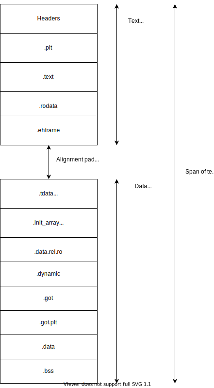

..
   Copyright (c) 2021-2025, Arm Limited and its affiliates.  All rights reserved.
   CC-BY-SA-4.0 AND Apache-Patent-License
   See LICENSE file for details

.. |release| replace:: 2025Q1
.. |date-of-issue| replace:: 07\ :sup:`th` April 2025
.. |copyright-date| replace:: 2021-2025
.. |footer| replace:: Copyright © |copyright-date|, Arm Limited and its
                      affiliates. All rights reserved.

.. _ARMARM: https://developer.arm.com/documentation/ddi0487/latest
.. _AAPCS64: https://github.com/ARM-software/abi-aa/releases
.. _AAELF64: https://github.com/ARM-software/abi-aa/releases
.. _CPPABI64: https://developer.arm.com/docs/ihi0059/latest
.. _GCABI: https://itanium-cxx-abi.github.io/cxx-abi/abi.html
.. _LINUX_ABI: https://github.com/hjl-tools/linux-abi/wiki
.. _MemTagABIELF64: https://github.com/ARM-software/abi-aa/releases
.. _PAuthABIELF64: https://github.com/ARM-software/abi-aa/releases
.. _HWCAP: https://www.kernel.org/doc/html/latest/arm64/elf_hwcaps.html
.. _LSB: https://refspecs.linuxfoundation.org/LSB_5.0.0/LSB-Core-generic/LSB-Core-generic/book1.html
.. _SCO-ELF: http://www.sco.com/developers/gabi
.. _SYM-VER: http://www.akkadia.org/drepper/symbol-versioning
.. _SYSVABI: https://github.com/ARM-software/abi-aa/releases
.. _TLSDESC: http://www.fsfla.org/~lxoliva/writeups/TLS/paper-lk2006.pdf

System V ABI for the Arm® 64-bit Architecture (AArch64)
*******************************************************

.. class:: version

|release|

.. class:: issued

Date of Issue: |date-of-issue|

.. class:: logo

.. image::  Arm_logo_blue_RGB.svg
   :scale: 30%

.. section-numbering::

.. raw:: pdf

   PageBreak oneColumn

Preface
=======

Abstract
--------

This document describes the System V Application Binary Interface
(ABI) for the Arm 64-bit architecture.

Keywords
--------

Code Model

Latest release and defects report
---------------------------------

Please check `Application Binary Interface for the Arm® Architecture
<https://github.com/ARM-software/abi-aa>`_ for the latest
release of this document.

Please report defects in this specification to the `issue tracker page
on GitHub
<https://github.com/ARM-software/abi-aa/issues>`_.

Licence
-------

This work is licensed under the Creative Commons
Attribution-ShareAlike 4.0 International License. To view a copy of
this license, visit http://creativecommons.org/licenses/by-sa/4.0/ or
send a letter to Creative Commons, PO Box 1866, Mountain View, CA
94042, USA.

Grant of Patent License. Subject to the terms and conditions of this
license (both the Public License and this Patent License), each
Licensor hereby grants to You a perpetual, worldwide, non-exclusive,
no-charge, royalty-free, irrevocable (except as stated in this
section) patent license to make, have made, use, offer to sell, sell,
import, and otherwise transfer the Licensed Material, where such
license applies only to those patent claims licensable by such
Licensor that are necessarily infringed by their contribution(s) alone
or by combination of their contribution(s) with the Licensed Material
to which such contribution(s) was submitted. If You institute patent
litigation against any entity (including a cross-claim or counterclaim
in a lawsuit) alleging that the Licensed Material or a contribution
incorporated within the Licensed Material constitutes direct or
contributory patent infringement, then any licenses granted to You
under this license for that Licensed Material shall terminate as of
the date such litigation is filed.

About the license
-----------------

As identified more fully in the Licence_ section, this project
is licensed under CC-BY-SA-4.0 along with an additional patent
license.  The language in the additional patent license is largely
identical to that in Apache-2.0 (specifically, Section 3 of Apache-2.0
as reflected at https://www.apache.org/licenses/LICENSE-2.0) with two
exceptions.

First, several changes were made related to the defined terms so as to
reflect the fact that such defined terms need to align with the
terminology in CC-BY-SA-4.0 rather than Apache-2.0 (e.g., changing
“Work” to “Licensed Material”).

Second, the defensive termination clause was changed such that the
scope of defensive termination applies to “any licenses granted to
You” (rather than “any patent licenses granted to You”).  This change
is intended to help maintain a healthy ecosystem by providing
additional protection to the community against patent litigation
claims.

Contributions
-------------

Contributions to this project are licensed under an inbound=outbound
model such that any such contributions are licensed by the contributor
under the same terms as those in the `Licence`_ section.

Trademark notice
----------------

The text of and illustrations in this document are licensed by Arm
under a Creative Commons Attribution–Share Alike 4.0 International
license ("CC-BY-SA-4.0”), with an additional clause on patents.
The Arm trademarks featured here are registered trademarks or
trademarks of Arm Limited (or its subsidiaries) in the US and/or
elsewhere. All rights reserved. Please visit
https://www.arm.com/company/policies/trademarks for more information
about Arm’s trademarks.

Copyright
---------

Copyright (c) |copyright-date|, Arm Limited and its affiliates.  All rights reserved.

.. raw:: pdf

   PageBreak

.. contents::
   :depth: 3

.. raw:: pdf

   PageBreak

About this document
===================

Change Control
--------------

Current Status and Anticipated Changes
^^^^^^^^^^^^^^^^^^^^^^^^^^^^^^^^^^^^^^

The following support level definitions are used by the Arm ABI specifications:

**Release**
   Arm considers this specification to have enough implementations, which have
   received sufficient testing, to verify that it is correct. The details of these
   criteria are dependent on the scale and complexity of the change over previous
   versions: small, simple changes might only require one implementation, but more
   complex changes require multiple independent implementations, which have been
   rigorously tested for cross-compatibility. Arm anticipates that future changes
   to this specification will be limited to typographical corrections,
   clarifications and compatible extensions.

**Beta**
   Arm considers this specification to be complete, but existing
   implementations do not meet the requirements for confidence in its release
   quality. Arm may need to make incompatible changes if issues emerge from its
   implementation.

**Alpha**
   The content of this specification is a draft, and Arm considers the
   likelihood of future incompatible changes to be significant.

This document is at **Alpha** release quality.

Change History
^^^^^^^^^^^^^^

.. table::

 +------------+------------------------------+-------------------------------------------------------+
 | Issue      | Date                         | Change                                                |
 +============+==============================+=======================================================+
 | 00Alpha    | 1\ :sup:`st` November 2021   | Alpha release containing Code Model only              |
 +------------+------------------------------+-------------------------------------------------------+
 | 01Alpha    | 20\ :sup:`th` October 2022   | Add Program Loading and Dynamic Linking section.      |
 +------------+------------------------------+-------------------------------------------------------+
 | 02Alpha    | 6\ :sup:`th` April 2023      | Define the processor specific interpretation for      |
 |            |                              | DT_PLTGOT                                             |
 +------------+------------------------------+-------------------------------------------------------+
 | 2024Q3     | 5\ :sup:`th` September 2024  | - Added Program Property, Program Loading and         |
 |            |                              |   Dynamic Linking contents from `AAELF64`_.           |
 |            |                              | - Added Dynamic linking content for GCS including     |
 |            |                              |   GNU_PROPERTY_AARCH64_FEATURE_1_GCS Feature Bit.     |
 |            |                              | - In `Dynamic Section Tags`_, reserve tags            |
 |            |                              |   used by `PAuthABIELF64`_ and                        |
 |            |                              |   `MemTagABIELF64`_.                                  |
 +------------+------------------------------+-------------------------------------------------------+
 | 2025Q1     | 7\ :sup:`th` April 2025      | - Require hard-float ABI for sysvabi platforms.       |
 |            |                              | - Document requirements for tools wrt BTI.            |
 +------------+------------------------------+-------------------------------------------------------+

References
----------

This document refers to, or is referred to by, the following documents.

.. table::

  +-----------------+--------------------------------------------------------------+-----------------------------------------------------------------------------+
  | Ref             | External reference or URL                                    | Title                                                                       |
  +=================+==============================================================+=============================================================================+
  | SYSVABI_        | Source for this document                                     | System V Application Binary Interface (ABI) for the Arm 64-bit architecture |
  +-----------------+--------------------------------------------------------------+-----------------------------------------------------------------------------+
  | ARMARM_         | DDI 0487                                                     | Arm Architecture Reference Manual Armv8 for Armv8-A architecture profile    |
  +-----------------+--------------------------------------------------------------+-----------------------------------------------------------------------------+
  | AAPCS64_        | IHI 0055                                                     | Procedure Call Standard for the Arm 64-bit Architecture                     |
  +-----------------+--------------------------------------------------------------+-----------------------------------------------------------------------------+
  | AAELF64_        | IHI 0056                                                     | ELF for the Arm 64-bit Architecture (AArch64).                              |
  +-----------------+--------------------------------------------------------------+-----------------------------------------------------------------------------+
  | CPPABI64_       | IHI 0059                                                     | C++ ABI for the Arm 64-bit Architecture                                     |
  +-----------------+--------------------------------------------------------------+-----------------------------------------------------------------------------+
  | GCABI_          | https://itanium-cxx-abi.github.io/cxx-abi/abi.html           | Generic C++ ABI                                                             |
  +-----------------+--------------------------------------------------------------+-----------------------------------------------------------------------------+
  | HWCAP_          | https://www.kernel.org/doc/html/latest/arm64/elf_hwcaps.html | Linux Kernel HWCAPs interface                                               |
  +-----------------+--------------------------------------------------------------+-----------------------------------------------------------------------------+
  | LINUX_ABI_      | https://github.com/hjl-tools/linux-abi/wiki                  | Linux Extensions to gABI                                                    |
  +-----------------+--------------------------------------------------------------+-----------------------------------------------------------------------------+
  | LSB_            | https://refspecs.linuxbase.org/lsb.shtml                     | Linux Standards Base Core Functional Area                                   |
  +-----------------+--------------------------------------------------------------+-----------------------------------------------------------------------------+
  | MemTagABIELF64_ | memtagabielf64                                               | MemTag Extension to ELF for the Arm 64-bit Architecture                     |
  +-----------------+--------------------------------------------------------------+-----------------------------------------------------------------------------+
  | PAuthABIELF64_  | pauthabielf64                                                | PAuth Extension to ELF for the Arm 64-bit Architecture                      |
  +-----------------+--------------------------------------------------------------+-----------------------------------------------------------------------------+
  | SCO-ELF_        | http://www.sco.com/developers/gabi/                          | System V Application Binary Interface – DRAFT                               |
  +-----------------+--------------------------------------------------------------+-----------------------------------------------------------------------------+
  | SYM-VER_        | http://people.redhat.com/drepper/symbol-versioning           | GNU Symbol Versioning                                                       |
  +-----------------+--------------------------------------------------------------+-----------------------------------------------------------------------------+

Terms and Abbreviations
-----------------------

The ABI for the Arm 64-bit Architecture uses the following terms and abbreviations.
^^^^^^^^^^^^^^^^^^^^^^^^^^^^^^^^^^^^^^^^^^^^^^^^^^^^^^^^^^^^^^^^^^^^^^^^^^^^^^^^^^^

A32
   The instruction set named Arm in the Armv7 architecture; A32 uses 32-bit
   fixed-length instructions.

A64
   The instruction set available when in AArch64 state.

AAPCS64
   Procedure Call Standard for the Arm 64-bit Architecture (AArch64)

AArch32
   The 32-bit general-purpose register width state of the Armv8 architecture,
   broadly compatible with the Armv7-A architecture.

AArch64
   The 64-bit general-purpose register width state of the Armv8 architecture.

ABI
   Application Binary Interface:

   1. The specifications to which an executable must conform in order to
      execute in a specific execution environment. For example, the
      *Linux ABI for the Arm Architecture*.

   2. A particular aspect of the specifications to which independently
      produced relocatable files must conform in order to be
      statically linkable and executable.  For example, the CPPABI64

Arm-based
   ... based on the Arm architecture ...

Floating point
   Depending on context floating point means or qualifies: (a) floating-point
   arithmetic conforming to IEEE 754 2008; (b) the Armv8 floating point
   instruction set; (c) the register set shared by (b) and the Armv8 SIMD
   instruction set.

Q-o-I
   Quality of Implementation – a quality, behavior, functionality, or
   mechanism not required by this standard, but which might be provided
   by systems conforming to it.  Q-o-I is often used to describe the
   toolchain-specific means by which a standard requirement is met.

SIMD
   Single Instruction Multiple Data – A term denoting or qualifying:
   (a) processing several data items in parallel under the control of one
   instruction; (b) the Arm v8 SIMD instruction set: (c) the register set
   shared by (b) and the Armv8 floating point instruction set.

SIMD and floating point
   The Arm architecture’s SIMD and Floating Point architecture comprising
   the floating point instruction set, the SIMD instruction set and the
   register set shared by them.

SVE
   The Arm architecture's Scalable Vector Extension.

T32
   The instruction set named Thumb in the Armv7 architecture; T32 uses
   16-bit and 32-bit instructions.

VG
   The number of 64-bit “vector granules” in an SVE vector; in other words,
   the number of bits in an SVE vector register divided by 64.

ILP32
   SysV-like data model where int, long int and pointer are 32-bit

LP64
   SysV-like data model where int is 32-bit, but long int and pointer are 64-bit.

LLP64
   Windows-like data model where int and long int are 32-bit, but long long int and pointer are 64-bit.

This document uses the following terms and abbreviations.
^^^^^^^^^^^^^^^^^^^^^^^^^^^^^^^^^^^^^^^^^^^^^^^^^^^^^^^^^

SysV
   Unix System V. A variant of the Unix Operating System. Although
   this specification refers to SysV, many other operating systems,
   such as Linux or BSD use similar conventions.

Platform
   A program execution environment such as that defined by an
   operating system or run- time environment. A platform defines the
   specific variant of the ABI and may impose additional
   constraints. Linux is a platform in this sense.

More specific terminology is defined when it is first used.

.. raw:: pdf

   PageBreak

Scope
=====

Except where otherwise stated the AArch64 System V ABI follows the
base ABI documents in `ABI for the Arm 64 bit architecture <https://github.com/ARM-software/abi-aa#abi-for-the-arm-64-bit-architecture>`_. The AArch64 System V ABI
documents the places where divergence exists with respect to the base
ABI and attempts to act as a unifying document to cover information in
a variety of places that is of relevance to a System V implementation.

.. raw:: pdf

   PageBreak oneColumn

Software Installation
=====================

This document does not describe the software installation on an
AArch64 system.

.. raw:: pdf

   PageBreak oneColumn

Low Level Information
=====================

Hardware Requirements
---------------------

The AArch64 System V ABI requires the presence of SIMD and FP registers.

Procedure call standard requirements
------------------------------------

The AArch64 System V ABI uses The Base Procedure Call Standard from (AAPCS64_).

Not available for this Alpha release.

.. raw:: pdf

   PageBreak oneColumn

Programming / Coding Examples
=============================

Architectural Considerations
----------------------------

The AArch64 architecture does not allow for instructions to encode
arbitrary 64 bit constants in a single instructions. Immediates or
constants need to be constructed by a sequence of instructions that
are defined in the Arm Architecture Reference Manual Armv8, for
Armv8-A architecture profile [`ARMARM`_]. Most instructions accept
restricted immediate forms, the details of which are beyond the scope
of this document. Given the range of immediates and offsets accepted
by various instructions, programming on this architecture lends itself
to a set of code models that define a set of constraints to allow an
efficient mapping of a program to a set of machine instructions. In
the following section we document the code sequences for memory
addressing; and in effect document the various memory models produced
for the architecture.

Absolute Addressing
-------------------

Absolute addressing means that the virtual addresses of instructions
and statically allocated data are known at static link time. To
execute properly the object must be loaded at the virtual address
specified by the static linker. Critically this means that the static
linker can embed these fixed, absolute addresses into the read-only,
shareable code, rather than requiring run-time relocation via a Global
Offset Table (GOT). Absolute addressing does not mean that PC-relative
addressing cannot be used, if that is the most efficient way to
generate an absolute address within the limits supported by the model.

Absolute addressing is suitable for most bare-metal code, including
the Linux kernel, as well as for normal GNU/Linux executables which –
while dynamically linked – are loaded at a fixed address.

Position-independent addressing
-------------------------------

In position-independent code (PIC) the virtual addresses of
instructions and static data are not known until dynamic link
time.

The PIC model depends on an offset, known at static link time between
a read-only dynamic relocation free executable segment and a
read-write segment containing dynamic relocations. Code in the
executable segment accesses data in the read-write segment via
PC-relative addressing modes. PIC is typically used when building
dynamic shared objects, where references to external variables must
use indirect references via a static linker created global offset
table (GOT).

A GOT generating relocation is used to inform the static
linker to create the GOT entry. The address of symbol definitions that
cannot be pre-empted at dynamic link time can have their address
taken so no GOT generating relocation is required.

PIC can also be used to build position-independent executables. A
variant of PIC called PIE (position-independent executable) can be
used to build an executable. PIE assumes that global symbols cannot be
pre-empted, which means that an indirection via the GOT is not needed.

Assembler language addressing mode conventions
----------------------------------------------

The assembler examples in this document make use of operators to
modify the addressing mode used to form the immediate value of the
instruction.

The tables below describe the assembler operators that can be used to
alter the relocation directive emitted by the assembler. The typical
syntax is of the form ``#:<operator>:<symbol name>``

.. table:: Absolute operators

  +-----------------------+-------------+----------------------------+
  | Operator              | Instruction | Relocation                 |
  +=======================+=============+============================+
  | ``lo12``              | ``add``     | R_AARCH64_ADD_ABS_LO12_NC  |
  +-----------------------+-------------+----------------------------+
  | ``lo12``              | ``ldr,str`` | R_AARCH64_LDST_ABS_LO12_NC |
  +-----------------------+-------------+----------------------------+
  | ``abs_g0``            | ``mov[nz]`` | R_AARCH64_MOVW_UABS_G0     |
  +-----------------------+-------------+----------------------------+
  | ``abs_g0_s``          | ``mov[nz]`` | R_AARCH64_MOVW_SABS_G0     |
  +-----------------------+-------------+----------------------------+
  | ``abs_g0_nc``         | ``movk``    | R_AARCH64_MOVW_UABS_G0_NC  |
  +-----------------------+-------------+----------------------------+
  | ``abs_g1``            | ``mov[nz]`` | R_AARCH64_MOVW_UABS_G1     |
  +-----------------------+-------------+----------------------------+
  | ``abs_g1_s``          | ``mov[nz]`` | R_AARCH64_MOVW_SABS_G1     |
  +-----------------------+-------------+----------------------------+
  | ``abs_g1_nc``         | ``movk``    | R_AARCH64_MOVW_UABS_G1_NC  |
  +-----------------------+-------------+----------------------------+
  | ``abs_g2``            | ``mov[nz]`` | R_AARCH64_MOVW_UABS_G2     |
  +-----------------------+-------------+----------------------------+
  | ``abs_g2_s``          | ``mov[nz]`` | R_AARCH64_MOVW_SABS_G2     |
  +-----------------------+-------------+----------------------------+
  | ``abs_g2_nc``         | ``movk``    | R_AARCH64_MOVW_UABS_G2_NC  |
  +-----------------------+-------------+----------------------------+
  | ``abs_g3``            | ``mov[nz]`` | R_AARCH64_MOVW_UABS_G3     |
  +-----------------------+-------------+----------------------------+

.. table:: Position-independent operators

  +-----------------------+-------------+-------------------------------+
  | Operator              | Instruction | Relocation                    |
  +=======================+=============+===============================+
  | (no operator)         | ``adrp``    | R_AARCH64_ADR_PREL_PG_HI21    |
  +-----------------------+-------------+-------------------------------+
  | ``pg_hi21``           | ``adrp``    | R_AARCH64_ADR_PREL_PG_HI21    |
  +-----------------------+-------------+-------------------------------+
  | ``pg_hi21_nc``        | ``adrp``    | R_AARCH64_ADR_PREL_PG_HI21_NC |
  +-----------------------+-------------+-------------------------------+
  | (no operator)         | ``adr``     | R_AARCH64_ADR_PREL_LO21       |
  +-----------------------+-------------+-------------------------------+
  | ``prel_g0``           | ``mov[nz]`` | R_AARCH64_MOVW_PREL_G0        |
  +-----------------------+-------------+-------------------------------+
  | ``prel_g0_nc``        | ``movk``    | R_AARCH64_MOVW_PREL_G0_NC     |
  +-----------------------+-------------+-------------------------------+
  | ``prel_g1``           | ``mov[nz]`` | R_AARCH64_MOVW_PREL_G1        |
  +-----------------------+-------------+-------------------------------+
  | ``prel_g1_nc``        | ``movk``    | R_AARCH64_MOVW_PREL_G1_NC     |
  +-----------------------+-------------+-------------------------------+
  | ``prel_g2``           | ``mov[nz]`` | R_AARCH64_MOVW_PREL_G2        |
  +-----------------------+-------------+-------------------------------+
  | ``prel_g2_nc``        | ``movk``    | R_AARCH64_MOVW_PREL_G2_NC     |
  +-----------------------+-------------+-------------------------------+
  | ``prel_g3``           | ``mov[nz]`` | R_AARCH64_MOVW_PREL_G3        |
  +-----------------------+-------------+-------------------------------+

.. table:: GOT operators

  +-----------------------+-------------+-------------------------------+
  | Operator              | Instruction | Relocation                    |
  +=======================+=============+===============================+
  | ``got``               | ``adrp``    | R_AARCH64_ADR_GOT_PAGE        |
  +-----------------------+-------------+-------------------------------+
  | ``got_lo12``          | ``ldr``     | R_AARCH64_LD64_GOT_LO12_NC    |
  +-----------------------+-------------+-------------------------------+
  | ``gotoff_g0_nc``      | ``movk``    | R_AARCH64_MOVW_GOTOFF_G0_NC   |
  +-----------------------+-------------+-------------------------------+
  | ``gotoff_g1``         | ``mov[nz]`` | R_AARCH64_MOVW_GOTOFF_G1      |
  +-----------------------+-------------+-------------------------------+
  | ``gotoff_lo15``       | ``ldr``     | R_AARCH64_LD64_GOTOFF_LO15    |
  +-----------------------+-------------+-------------------------------+
  | ``gotpage_lo15``      | ``ldr``     | R_AARCH64_LD64_GOTPAGE_LO15   |
  +-----------------------+-------------+-------------------------------+

.. note::

   ``#:got:src`` refers to the GOT slot for the symbol ``src``

   ``#:got_lo12:src`` refers to the lower 12 bits of the
   address of the GOT slot for the symbol ``src``.

   The assembler instruction ``adrp xn, __GLOBAL_OFFSET_TABLE__``
   finds the address of the 4KiB page containing the start of the
   ``.got`` section. More details can be found in Global Offset Table
   (GOT).

   ``#:gotpage_lo15:src`` is a 15-bit offset into the page containing
   the GOT entry for ``src``.

   ``#:gotoff_lo15:src`` - This refers to the 15 bit offset from the
   start of the GOT.

.. table:: TLS operators

  +-----------------------+-------------+---------------------------------------+
  | Operator              | Instruction | Relocation                            |
  +=======================+=============+=======================================+
  | ``gottprel_g0_nc``    | ``movk``    | R_AARCH64_TLSIE_MOVW_GOTTPREL_G0_NC   |
  +-----------------------+-------------+---------------------------------------+
  | ``gottprel_g1``       | ``mov[nz]`` | R_AARCH64_TLSIE_MOVW_GOTTPREL_G1      |
  +-----------------------+-------------+---------------------------------------+
  | ``tlsgd``             | ``adrp``    | R_AARCH64_TLSGD_ADR_PAGE21            |
  +-----------------------+-------------+---------------------------------------+
  | ``tlsgd``             | ``adr``     | R_AARCH64_TLSGD_ADR_PREL21            |
  +-----------------------+-------------+---------------------------------------+
  | ``tlsgd_lo12``        | ``add``     | R_AARCH64_TLSGD_ADD_LO12_NC           |
  +-----------------------+-------------+---------------------------------------+
  | ``tlsgd_g0_nc``       | ``movk``    | R_AARCH64_TLSGD_MOVW_G0_NC            |
  +-----------------------+-------------+---------------------------------------+
  | ``tlsgd_g1``          | ``mov[nz]`` | R_AARCH64_TLSGD_MOVW_G1               |
  +-----------------------+-------------+---------------------------------------+
  | ``tlsdesc``           | ``adrp``    | R_AARCH64_TLSDESC_ADR_PAGE21          |
  +-----------------------+-------------+---------------------------------------+
  | ``tlsdesc``           | ``adr``     | R_AARCH64_TLSDESC_ADR_PREL21          |
  +-----------------------+-------------+---------------------------------------+
  | ``tlsdesc_lo12``      | ``ldr``     | R_AARCH64_TLSDESC_LD64_LO12           |
  +-----------------------+-------------+---------------------------------------+
  | ``tlsldm``            | ``adrp``    | R_AARCH64_TLSLD_ADR_PAGE21            |
  +-----------------------+-------------+---------------------------------------+
  | ``tlsldm``            | ``adr``     | R_AARCH64_TLSLD_ADR_PREL21            |
  +-----------------------+-------------+---------------------------------------+
  | ``tlsldm_lo12_nc``    | ``add``     | R_AARCH64_TLSLD_ADD_LO12_NC           |
  +-----------------------+-------------+---------------------------------------+
  | ``dtprel_lo12``       | ``add``     | R_AARCH64_TLSLD_ADD_DTPREL_LO12       |
  +-----------------------+-------------+---------------------------------------+
  | ``dtprel_lo12``       | ``ldr``     | R_AARCH64_TLSLD_LDST64_DTPREL_LO12    |
  +-----------------------+-------------+---------------------------------------+
  | ``dtprel_lo12_nc``    | ``add``     | R_AARCH64_TLSLD_ADD_DTPREL_LO12_NC    |
  +-----------------------+-------------+---------------------------------------+
  | ``dtprel_lo12_nc``    | ``ldr``     | R_AARCH64_TLSLD_LDST64_DTPREL_LO12_NC |
  +-----------------------+-------------+---------------------------------------+
  | ``dtprel_g0``         | ``mov[nz]`` | R_AARCH64_TLSLD_MOVW_DTPREL_G0        |
  +-----------------------+-------------+---------------------------------------+
  | ``dtprel_g0_nc``      | ``movk``    | R_AARCH64_TLSLD_MOVW_DTPREL_G0_NC     |
  +-----------------------+-------------+---------------------------------------+
  | ``dtprel_g1``         | ``mov[nz]`` | R_AARCH64_TLSLD_MOVW_DTPREL_G1        |
  +-----------------------+-------------+---------------------------------------+
  | ``dtprel_g1_nc``      | ``movk``    | R_AARCH64_TLSLD_MOVW_DTPREL_G1_NC     |
  +-----------------------+-------------+---------------------------------------+
  | ``dtprel_g2``         | ``mov[nz]`` | R_AARCH64_TLSLD_MOVW_DTPREL_G2        |
  +-----------------------+-------------+---------------------------------------+
  | ``tlsdesc_off_g0_nc`` | ``movk``    | R_AARCH64_TLSDESC_OFF_G0_NC           |
  +-----------------------+-------------+---------------------------------------+
  | ``tlsdesc_off_g1``    | ``mov[nz]`` | R_AARCH64_TLSDESC_OFF_G1              |
  +-----------------------+-------------+---------------------------------------+
  | ``gottprel``          | ``adrp``    | R_AARCH64_TLSIE_ADR_GOTTPREL_PAGE21   |
  +-----------------------+-------------+---------------------------------------+
  | ``gottprel_lo12``     | ``ldr``     | R_AARCH64_TLSIE_LD64_GOTTPREL_LO12_NC |
  +-----------------------+-------------+---------------------------------------+
  | ``tprel``             | ``add``     | R_AARCH64_TLSLE_ADD_TPREL_LO12        |
  +-----------------------+-------------+---------------------------------------+
  | ``tprel_lo12``        | ``add``     | R_AARCH64_TLSLE_ADD_TPREL_LO12        |
  +-----------------------+-------------+---------------------------------------+
  | ``tprel_lo12``        | ``ldr``     | R_AARCH64_TLSLE_LDST64_TPREL_LO12     |
  +-----------------------+-------------+---------------------------------------+
  | ``tprel_hi12``        | ``add``     | R_AARCH64_TLSLE_ADD_TPREL_HI12        |
  +-----------------------+-------------+---------------------------------------+
  | ``tprel_lo12_nc``     | ``add``     | R_AARCH64_TLSLE_ADD_TPREL_LO12_NC     |
  +-----------------------+-------------+---------------------------------------+
  | ``tprel_lo12_nc``     | ``ldr``     | R_AARCH64_TLSLE_LDST64_TPREL_LO12_NC  |
  +-----------------------+-------------+---------------------------------------+
  | ``tprel_g2``          | ``mov[nz]`` | R_AARCH64_TLSLE_MOVW_TPREL_G2         |
  +-----------------------+-------------+---------------------------------------+
  | ``tprel_g1``          | ``mov[nz]`` | R_AARCH64_TLSLE_MOVW_TPREL_G1         |
  +-----------------------+-------------+---------------------------------------+
  | ``tprel_g1_nc``       | ``movk``    | R_AARCH64_TLSLE_MOVW_TPREL_G1_NC      |
  +-----------------------+-------------+---------------------------------------+
  | ``tprel_g0``          | ``mov[nz]`` | R_AARCH64_TLSLE_MOVW_TPREL_G0         |
  +-----------------------+-------------+---------------------------------------+
  | ``tprel_g0_nc``       | ``movk``    | R_AARCH64_TLSLE_MOVW_TPREL_G0_NC      |
  +-----------------------+-------------+---------------------------------------+

.. note::

   Relocations are defined in AAELF64_.

.. raw:: pdf

   PageBreak oneColumn

Code Models
===========

The AArch64 A64 instruction set has a number of features and
constraints which make it desirable to use different code models for
different sizes of executable or dynamic shared object, to improve
performance and reduce static code size. The relevant constraints are:

* The LDR (literal) and ADR instructions generate a PC-relative address
  with a range of +/- 1MiB.

* The ADRP instruction generates a PC-relative, page aligned address
  with a range of +/- 4GiB (where page = 4KiB).

* The LDR and STR instructions accept a 12-bit unsigned immediate
  offset, scaled by the access size.

* The B and BL instructiond have a range of +/-128MiB. This is
  typically used for function / procedure calls.

* A series of MOVZ and up to 3 MOVK instructions can be used to
  construct a 64-bit value.

* Static linkers may insert a veneer (a sequence of instructions) to
  implement a relocated B or BL to a destination further away than the
  +/-128MiB range. The size of executable sections must be limited to
  127 MiB to leave space for veneers to be inserted after the section.

* The relative data relocations R_AARCH64_PLT32 and R_AARCH64_PREL32
  have a range of +/-2GiB.

The code models assume that an executable or shared library use an ELF
file layout similar to the diagram below.

.. _Illustrative ELF file layout:

.. rubric:: Illustrative ELF file layout

The table below identifies the code models that have been defined,
along with the assumptions that the code model may make.

.. table:: Code Models

  +--------+----------------+----------------+------------------------+
  | Code   | Max text       | Max combined   | Additional GOT         |
  | Model  | segment size   | span of text   | restrictions           |
  |        |                | and data       |                        |
  |        |                | segments       |                        |
  +========+================+================+========================+
  | tiny   | 1 MiB          | 1 Mib          | none                   |
  |        |                |                |                        |
  +--------+----------------+----------------+------------------------+
  | small  | 2GiB           | 4 GiB          | pic: got size < 32 KiB |
  |        |                |                +------------------------+
  |        |                |                | PIC: none              |
  +--------+----------------+----------------+------------------------+
  | medium | 2GiB           | no restriction | pic: got size < 32 KiB |
  |        |                |                +------------------------+
  |        |                |                | PIC: none              |
  +--------+----------------+----------------+------------------------+
  | large  | 2GiB           | no restriction | max distance from text |
  |        |                |                | to GOT < 4 GiB         |
  |        |                |                |                        |
  |        |                |                |                        |
  +--------+----------------+----------------+------------------------+

.. note::

  1. The max segment size columns describes the total span of the
  statically allocated content. It says nothing about the base address
  of the program or shared object, which may be located anywhere
  within the AArch64 virtual address space.

  2. The definition of the text segment includes the shareable PLT,
  code and read-only data sections. If the components of text segment
  are in separate consecutive ELF segments then the text segment is
  the maximum combined span of the ELF segments.

  3. The data segment contains the statically defined, writable,
  per-process data sections. In all models dynamically allocated data
  and stack can make use of the full virtual address space, dependent
  on operating system addressing limits. If the components are in
  separate ELF segments, the data segment is the maximum combined span
  of the ELF segments.

  4. The code models assume the text and data segments are consecutive
  in virtual memory with only padding for segment alignment between
  them. Programs that have significant separation between the code and
  data segments must take this extra distance into account in the max
  combined span of text and data segments.

  5. The text segment maximum size is limited to 2GiB by
  R_AARCH64_PLT32 relocations from ``.eh_frame`` sections.

  6. While designing the code models it was estimated that only 2.6%
  of load modules (executables and dynamic shared objects) have a max
  text segment size greater than 1MiB; the rest would all fit into the
  tiny model. However to avoid build option changes, it is recommended
  that the small model should be the default, with an explicit option
  to select the tiny model.

  7. Executables and shared objects may be linked dynamically with other
  shared objects which use a different code model.

  8. Linking of relocatable objects of different code models is possible
  as is linking of PIC/PIE and non-PIC relocatable objects. The result
  of the combination is always the most limited model. For example the
  combination of a tiny code model PIC object and small code model
  non-PIC object is a tiny non-PIC executable.

  9. The large code model is aimed at programs with large amounts of
  read-write data, not large amounts or sparsely placed code.

Implementation of code models
-----------------------------

The convention for command-line option to select code model is
``-mcmodel=<model>`` where code model is one of ``tiny``, ``small``,
``medium`` or ``large``.

The convention for command-line option to select position-independent
code is ``-fpic`` for pic ``-fPIC`` for PIC. When compiling for an
executable ``-fpie`` and ``-fPIE`` have the same GOT size limitations
as ``-fpic`` and ``-fPIC`` respectively.

Not all compilers will implement all of the code models. The table
below describes the implementation status of code models for two
open-source compilers.

.. table:: Code Model Support

  +--------+----------------+----------------+
  | Code   | GCC 11         | Clang 12.0     |
  | Model  |                |                |
  +========+================+================+
  | tiny   | yes            | yes            |
  |        |                |                |
  +--------+----------------+----------------+
  | small  | pic and PIC    | pic and PIC    |
  |        | implemented    | accepted but   |
  |        |                | PIC used       |
  +--------+----------------+----------------+
  | medium | pic and PIC    | pic and PIC    |
  |        | proposed       | proposed       |
  |        |                |                |
  +--------+----------------+----------------+
  | large  | no-pic support | no-pic support |
  |        |                |                |
  |        |                |                |
  |        |                |                |
  +--------+----------------+----------------+

Medium code model
-----------------

The medium code model is suitable for programs that do not have large amounts
of executable code, but do contain large static data objects. The medium code
model separates data into small data and large data. Small data is addressed
in the same way as the small code model, with the same maximum size
restrictions as the small code model. Large data is addressed via the GOT and
does not have a maximum size limit.

Data is defined as large data if any of the following are true:

- The data is >= 64 KiB in size.
- The data is of unknown size.
- The data will be represented by an unallocated common block, described by a
  ``SHN_COMMON`` symbol.

All other data is small data.

Large data is placed in sections with an ``l`` prefix, for example ``.lbss``,
``.ldata`` and ``.lrodata``. Both small and large RELRO data are placed in
``.data.rel.ro`` as many loaders only support one ``PT_GNU_RELRO`` program
header. At static link time the large data sections must be placed after all
small data sections. If it is the last small data section, the static linker
allocates storage for ``SHN_COMMON`` symbols at the end of the ``bss``
section. Otherwise they are allocated in ``lbss``.

Sample code sequences for code models
-------------------------------------

The following section provide some sample code sequences for
addressing static data. The samples are provided to illustrate the
effects on code-generation of the code-models.

Get the address of a symbol defined in the same ELF file
^^^^^^^^^^^^^^^^^^^^^^^^^^^^^^^^^^^^^^^^^^^^^^^^^^^^^^^^

Code that is not position-independent may use the absolute address of
the symbol. Code that is position-independent may use a pc-relative
offset to the symbol if the definition of the symbol is not
pre-emptible. If the symbol is pre-emptible the address must be loaded
from the GOT.

PC-relative offset of +/- 1 MiB. Suitable for tiny code model.

.. code-block:: asm

    adr x0, var

PC-relative offset of +/- 4 GiB. Suitable for small/medium code model.

.. code-block:: asm

    adrp x0, var
    add x0, x0, #:lo12: var

PC-relative offset not within +/- 4 GiB. Suitable for large symbols in
the medium code model.

.. code-block:: asm

    adrp x0, :got: var
    ldr x0, [x0, :got_lo12: var]

Absolute load of a literal, where the literal is within 1
MiB. Suitable for large code model if the literal is defined within
the same section as the code.

.. code-block:: asm

    ldr x0, .L0
  .L0
    .xword var

Absolute using a load of a literal where the literal is within 4
GiB. Suitable for the large code model.

.. code-block:: asm

    adrp x0, .L0
    ldr x0, [x0, #:lo12: .L0]
  .L0
    .xword var

Absolute using 4 instructions. Suitable for the large code model.

.. code-block:: asm

    movz    x0, # :abs_g0_nc: var
    movk    x1, # :abs_g1_nc: var
    movk    x2, # :abs_g2_nc: var
    movk    x3, # :abs_g3: var

Get the value of a symbol defined in the same ELF file
^^^^^^^^^^^^^^^^^^^^^^^^^^^^^^^^^^^^^^^^^^^^^^^^^^^^^^

In the general case one of the sequences above is used to get the
address. A load instruction can then be used to obtain the value. In
some cases the add can be folded into the load.

PC-relative offset of +/- 4 GiB. Suitable for the small/medium code model.

.. code-block:: asm

    adrp x0, var
    ldr x0, [x0, #:lo12:var]

Get the address of a symbol from the GOT
^^^^^^^^^^^^^^^^^^^^^^^^^^^^^^^^^^^^^^^^

All of GOT is within 1 MiB. Suitable for the tiny code model.

.. code-block:: asm

    ldr x0, :got: var

Base of GOT is within 4 GiB, GOT size is < 32 KiB. Suitable for pic.

.. code-block:: asm

    adrp x0, :got: __GLOBAL_OFFSET_TABLE__
    ldr x0, [x0, # :gotpage_lo15: var]

All of GOT is within 4 GiB, GOT size is >= 32 KiB. Suitable for PIC.

.. code-block:: asm

    adrp x0, :got: var
    ldr x0, [x0, # :got_lo12: var]

Get the address of a weak reference
^^^^^^^^^^^^^^^^^^^^^^^^^^^^^^^^^^^

An undefined weak reference resolves to 0. In the general case it is
not possible to give an offset that when added to the PC will result
in 0. To get the address of a weak reference the compiler can use a
load from literal or acccess the address via a GOT entry, which will
evaluate to 0 if the symbol is undefined.

.. raw:: pdf

   PageBreak oneColumn

Object Files
============

These follow the AAELF64_ base definition from Arm.

.. raw:: pdf

   PageBreak oneColumn

Program Loading and Dynamic Linking
===================================

The system works on creating a program/process image by logically
copying or mapping the program image from storage into a virtual
memory segment. In most systems with demand paging, when the actual
page is mapped into physical memory depends on the execution behaviour
of the program and the working set that it requires for its correct
execution. To minimize the number of such reads from the physical
medium containing the program, executables and shared objects must
have loadable program segments whose file offsets and virtual
addresses are congruent modulo the page size.

Since the architecture supports a maximum page size of 64KiB the page
size should be set to 64KiB for compatibility with systems that use
64KiB pages. There are a number of optimizations that can be
applied to save space.

 * The first page of text contains the ELF header, program header
   information and other information from the ELF file.

 * The last page of text contains parts of the first page of data.

 * The first data page has a copy of the last page of text.

 * The last data page may contain file information not relevant to the
   current process.

The underlying operating system typically adjusts access permissions
to these regions *as if* each segment were complete and
separate. Typically the regions of the file holding the last page of
the text segment and the first page of the data segment will be mapped
twice at two different virtual addresses, one for mapping as code and
the other for mapping as data.

Shared objects are always built with a base virtual address of 0,
while executables with an ELF ``e_type`` of ``ET_EXEC`` are built with
a fixed virtual address. The underlying operating system maps shared
objects at different virtual addresses, utilizing the fact that the
code and data addressing within such a shared object is
position-independent. The position independence relies on the
principle that the offset between loadable program segments is fixed
at static link time. This permits code to access data in another
loadable program segment using a pc-relative offset that will not
change at run time.

Program segments for executables built with a fixed virtual address
have to be mapped identically to the virtual addresses used to create
the executable file.

Position-independent executables are mapped in the same way as shared
objects. They have an ELF ``e_type`` of ``ET_DYN``.

Dynamic Section
---------------

The dynamic section entries allow information to be passed between the
static linker and the dynamic linker. There are a number of entries
that help locate various dynamic relocation tables and other aspects
that are architecture independent.

The generic dynamic tags are defined in SCO-ELF_ Dynamic Section.

The AArch64 specific dynamic tags are defined in AAELF64_ Dynamic
Section.

The generic tag ``DT_PLTGOT`` has a processor specific
implementation. On AArch64 it is defined to be the address of the
``.got.plt`` section.

Global Offset Table (GOT)
-------------------------

Position-independent code cannot, in general, contain absolute (fixed)
virtual addresses. Global offset tables hold absolute addresses in
private data, thus making the addresses available without compromising
the position-independence and shareability of a program's text
segment. A program references its global offset table using
position-independent addressing and extracts the absolute values from
it, thereby redirecting position-independent references to their
actual locations.

The global offset table (GOT) is created by the static linker in
response to GOT generating relocations. See AAELF64_ Relocation
operations for more information.

AArch64 splits the global offset table (GOT) into two sections:

 * ``.got.plt`` for code addresses accessed only from the Procedure Linkage
   Table (PLT).

 * ``.got`` all other addresses and offsets.

Both the ``.got`` and ``.got.plt`` sections are aligned to a minimum
of 8 bytes. They both contain 8-byte sized entries.

If a position-independent program requires direct access to the
absolute address of a symbol, that symbol will have a GOT
entry. Because the executable and shared objects have their own
independent GOTs, a symbol's address may appear in several tables. The
dynamic linker processes all of the relocations in the ``.got``
section before giving control to any code in the process image, thus
ensuring the absolute addresses are available during execution. Code
in the process that runs as part of a GNU indirect function resolver
is an exception to this rule. See `GNU Indirect Functions`_ for the
restrictions on what addresses can be accessed from a resolver
function.

In some dynamic linkers the ``.got`` section's first entry (number
zero) is reserved to hold the address of the dynamic structure,
referenced with the linker defined symbol ``_DYNAMIC``. The dynamic
linker in versions of glibc prior to version 2.35 use this address to
find its own dynamic structure without having yet processed their own
relocation entries. Static linkers wishing to build versions of glibc
older than 2.35 will need to define ``_DYNAMIC``.

AArch64 entries one and two in the ``.got.plt`` are reserved for the
dynamic linker.

For AArch64 the linker defined ``_GLOBAL_OFFSET_TABLE_`` symbol should
be the address of the first global offset table entry in the ``.got``
section.

See `Sample code sequences for code models`_ for code model for
examples of how to access the ``.got``.

Function Addresses
^^^^^^^^^^^^^^^^^^

Direct function calls are those where the name of the called function
is known at compile time. The PC-relative direct branch instructions
may be used for all direct function calls, whether absolute or
position-independent.

Indirect function calls are those where the address of the function is
in a pointer. Appropriate code is used to load the value of the
pointer into a register, as for other data, and then an indirect
branch instruction is used with the register as an operand to the
instruction.

In statically linked code the address of a function is always its real
address. However in dynamically linked environments references to the
address of a function from an executable file and its shared objects
might not resolve to the same value.

References from within shared objects to a function address will
normally be resolved by the dynamic linker to the virtual address of
the function itself.

References from within a non-position-independent executable file to a
function address defined in a shared object will normally be resolved
by the static linker to the address of the `Procedure Linkage Table`_
(PLT) entry for that function within the executable file. If the
address is in a writable location the linker may use a dynamic
relocation instead.

When both shared objects and a non-position-independent executable use
the address of a function both the shared library and the application
must use the same address for the functions in order for address
comparisons to work as expected. If the static linker uses a PLT entry
for a function as the address for a function then it must place the
address of the PLT for the function in the dynamic symbols table entry
for the function. This will result in a dynamic symbol table entry
with a section index of ``SHN_UNDEF``, a type ``STT_FUNC`` and a
non-zero ``st_value``. A reference to this symbol will be resolved by
the dynamic linker to the address PLT for the function in the
executable.

The ``R_<CLS>_JUMP_SLOT`` relocations defined in AAELF64_ are
associated with PLT entries. These entries are used for direct
function calls rather than for references to function addresses. These
relocations do not use the special symbol value described
above. Otherwise a very tight endless loop would result.

In a position-independent executable all non-local function addresses
are accessed via the GOT so no indirection via the PLT entry is
necessary.

Shared objects may implement direct function calls to non-pre-emptable
symbols using a direct branch instruction. A static linker will
consider a symbol not pre-emptable if:

 * The symbol has ``STB_LOCAL`` binding.

 * The symbol has a symbol visibility that is not ``STV_DEFAULT``.

 * The symbol has been given the ``local`` symbol version, defined in
   SYM-VER_.

 * The static linker adds the dynamic tag ``DT_FLAGS`` with the
   ``DF_SYMBOLIC`` flag set. This makes all symbols non-pre-emptable.

 * Some other implementation defined linker feature such as
   ``--dynamic-list`` is used.

Shared objects must indirect all function calls to pre-emptable
symbols through the static linker created Procedure Linkage Table.

Procedure Linkage Table
-----------------------

Much as the global offset table (GOT) redirects position-independent
address calculations to absolute locations, the Procedure Linkage
Table (PLT) redirects position-independent function calls to absolute
locations. The static linker cannot resolve execution transfers (such
as function calls) from one executable or shared object to
another. Consequently, the static linker arranges to have the program
transfer control to entries in the PLT. In the AArch64 architecture,
PLTs reside in the shared text segment, but they in turn use addresses
in the per-process global offset table section ``.got.plt``. The
dynamic linker determines the destinations' absolute addresses and
modifies the global offset table entry accordingly. The dynamic linker
can thus redirect the entries without compromising the
position-independence and shareability of the program's
text. Executable files and shared objects have their own separate
procedure linkage tables. The same procedure linkage table format is
used for both executables and shared objects.

Following the steps below, the dynamic linker and the program
cooperate to resolve symbolic references to functions through the
procedure linkage table and the global offset table.

 * When first creating the memory image of the program, the dynamic
   linker sets the second and the third entries in the ``.got.plt``
   table to special values. The steps below explain more about these
   values.

 * Each shared object file in the process image has its own PLT, and
   control transfers to a PLT entry only from within the same ELF
   module.

 * For illustration, assume the program calls ``name1``, which
   transfers control to the Nth PLT entry in ``PLT[N]``. If the order
   of the non-reserved entries in the ``.got.plt`` match the order of
   the entries in the PLT then ``PLT[N]`` will be ``.got.plt[N + 3]``
   as there are 3 reserved entries.

 * The ``PLT[N]`` entry loads the address of the ``.got.plt`` entry for
   ``name1`` into register ``ip0``, and then loads
   and jumps to the address held in that table entry using a ``BR``
   instruction. Initially the ``.got.plt`` entry holds the address of the
   ``PLT[0] entry``, the first entry in the PLT, not the real address
   of ``name1``.

 * Now the ``PLT[0]`` entry pushes the ``ip0`` and ``lr`` registers
   onto the stack.  The dynamic linker will later use the stacked
   value of ``ip0`` to compute a relocation index by subtracting the
   base of the ``.got.plt`` The index will be used to select an entry
   from the table of relocation entries addressed by the ``DT_JMPREL``
   dynamic section entry. The designated relocation entry must have
   type ``R_AARCH64_JUMP_SLOT``, and its ``r_offset`` field will
   specify the ``.got.plt`` table entry used by the PLT entry in
   ``PLT[N]``, the ``r_info`` encodes a symbol table index that
   references the appropriate symbol, i.e. ``name1`` in this example.

 * The ``PLT[0]`` entry then loads the address of the third
   ``.got.plt`` entry into ``ip0``, and then loads and jumps to the
   address in the third table entry, which transfers control to the
   dynamic linker's lazy resolver function.

 * The value in ``ip0`` is used by the dynamic linker's entrypoint to
   load the second ``.got.plt`` entry using ``[ip0,#-8]``, which gives
   it one 64-bit word of private information with which to identify
   the calling module.

 * The dynamic linker unwinds the stack, looks at the designated
   relocation entry, finds the symbol's value, stores the actual
   address of ``name1`` in the ``.got.plt`` entry for ``name1``, then
   transfers control to the desired destination.  Subsequent
   executions of ``PLT[N]`` will transfer control directly to
   ``name1``, without calling the dynamic linker a second time. That
   is the ``BR`` instruction in ``PLT[N]`` will transfer to ``name1``,
   instead of ``PLT[0]``.

The steps above assume that the dynamic linker resolves
``R_AARCH64_JUMP_SLOT`` relocations in the ``.got.plt`` lazily. The
``DF_BIND_NOW`` flag in the ``DT_FLAGS`` dynamic tag can be used to
instruct the dynamic linker to resolve ``R_AARCH64_JUMP_SLOT`` for the
ELF file containing the tag prior to transferring control to the
program. When lazy loading is not required the static linker can make
the ``.got.plt`` relocation-read-only (RELRO).

At run-time the ``LD_BIND_NOW`` environment variable can change the
dynamic linking behavior. If its value is non-null, the dynamic linker
evaluates all procedure linkage table entries before transferring
control to the program. That is, the dynamic linker processes
relocation entries of type ``R_AARCH64_JUMP_SLOT`` during process
initialization. Otherwise, the dynamic linker evaluates procedure
linkage table entries lazily, delaying symbol resolution and
relocation until the first call to a table entry.

The ``PLT[0]`` entry calls the dynamic linker's entrypoint, stored in
``.got.plt[2]``, with the following calling convention:

+---------------+-----------------------------------------------------------------------------+
| Location      |    Contents                                                                 |
+===============+=============================================================================+
| ``ip0``       | address of DL Resolver entry point  ``&.got.plt[2]``                        |
+---------------+-----------------------------------------------------------------------------+
| ``ip1``       | DL Resolver Entry point                                                     |
+---------------+-----------------------------------------------------------------------------+
| ``[sp, #0]``  | address of ``.got.plt`` entry for ``PLT[N]`` typically ``&.got.plt[N + 3]`` |
+---------------+-----------------------------------------------------------------------------+
| ``[sp, #8]``  | ``lr``                                                                      |
+---------------+-----------------------------------------------------------------------------+

Sample PLT sequences
^^^^^^^^^^^^^^^^^^^^

The following section shows some examples of PLT sequences. The
sequences assume that the ``.got.plt`` section is within +- 4 GiB from
the ``.plt`` section.

In the code samples below we assume that the entries in the
``.got.plt`` are in the same order as the entries in the PLT so that
code in ``PLT[N]`` loads from ``.got.plt[N + 3]`` where the + 3
accounts for the 3 reserved entries.

Standard
~~~~~~~~

This can be used on all Arm platforms when there are no additional
security features enabled.

PLT header ``PLT[0]``

.. code-block:: asm

    stp    x16, x30, [sp,#-16]!
    adrp   x16, :page: &.got.plt[2]
    ldr    x17, [x16, :lo12: &.got.plt[2]]
    add    x16, x16, :lo12: &.got.plt[2]
    br     x17

Nth PLT entry ``PLT[N]``

.. code-block:: asm

    adrp x16, :page: &.got.plt[N + 3]
    ldr  x17, [x16, :lo12: &.got.plt[N + 3]]
    add  x16, x16, :lo12: &.got.plt[N + 3]]
    br   x17

BTI
~~~

An executable or shared library that supports BTI must have a ``bti
c`` instruction at the start of any entry that might be called
indirectly. This is always true for the lazy resolver in
``.got.plt[0]``.

The static linker must set the dynamic tag ``DT_AARCH64_BTI_PLT`` as
defined in AAELF64_ when a BTI compliant PLT has been generated.

PLT header ``PLT[0]``

.. code-block:: asm

    bti  c
    stp  x16, x30, [sp,#-16]!
    adrp   x16, :page: &.got.plt[2]
    ldr    x17, [x16, :lo12: &.got.plt[2]]
    add    x16, x16, :lo12: &.got.plt[2]
    br   x17

Nth PLT entry ``PLT[N]``

.. code-block:: asm

    bti  c
    adrp x16, :page: &.got.plt[N + 3]
    ldr  x17, [x16, :lo12: &.got.plt[N + 3]]
    add  x16, x16, :lo12: &.got.plt[N + 3]
    br   x17

PAC
~~~

The ``.got.plt`` entries can be signed by the dynamic linker and
authenticated by the code in the PLT entry. Note that when these PLT
sequences are used the dynamic linker must sign the non reserved
entries in ``.got.plt``. When lazy binding is disabled, on platforms
that support `Relocation Read Only (RELRO)`_ the ``.got.plt`` can be
made read-only after dynamic relocation, which already provides good
protection.

The static linker must set the dynamic tag ``DT_AARCH64_PAC_PLT`` as
defined in AAELF64_ when signed .got.plt[N] entries are required.

There is no change to the PLT header ``PLT[0]``

Nth PLT entry ``PLT[N]``

.. code-block:: asm

    adrp x16, :page: &.got.plt[N + 3]
    ldr  x17, [x16, :lo12: &.got.plt[N + 3]]
    add  x16, x16, :lo12: &.got.plt[N + 3]
    autia1716
    br   x17

The PAC PLT requires the dynamic linker to sign the entry for
``.got.plt[N]`` with the address of ``.got.plt[N]`` as the modifier.

PAC + BTI
~~~~~~~~~

This is a combination of the PAC and the BTI PLT entries. The static
linker must set both ``DT_AARCH64_BTI_PLT`` and ``DT_AARCH64_PAC_PLT``
when BTI compliant PLT entries requiring signed ``.got.plt``
entries are used.

PLT header ``PLT[0]``

.. code-block:: asm

    bti  c
    stp  x16, x30, [sp,#-16]!
    adrp   x16, :page: &.got.plt[2]
    ldr    x17, [x16, :lo12: &.got.plt[2]]
    add    x16, x16, :lo12: &.got.plt[2]
    br   x17

Nth PLT entry ``PLT[N]``

.. code-block:: asm

    bti  c
    adrp x16, :page: &.got.plt[N + 3]
    ldr  x17, [x16, :lo12: &.got.plt[N + 3]]
    add  x16, x16, :lo12: &.got.plt[N + 3]
    autia1716
    br   x17

GNU Indirect Functions
----------------------

A GNU Indirect Function (IFUNC) is a feature that permits a single
implementation of a function to be chosen from multiple candidates,
with the choice taken by an IFUNC resolver function.

GNU Indirect Functions require static and dynamic linker support. They
are known to be supported on GNU/Linux, Android, and many of the BSD
operating systems.

GNU Indirect Functions are called via a PLT entry that loads the
function address. The function address is chosen by an IFUNC resolver
function.

The source code interface to an IFUNC resolver is platform
dependent. The GNU/Linux interface via the GNU C Library is documented
below.

GNU C Library IFUNC interface
^^^^^^^^^^^^^^^^^^^^^^^^^^^^^

The prototype of a GNU indirect function resolver is:

.. code-block:: c

   ElfW(Addr) ifunc_resolver (uint64_t, const uint64_t *);

The resolver is passed at least one, and at most 2 parameters dependent
on the GNU C Library (glibc) IFUNC ABI version. The bits in the first parameter
will match the ``AT_HWCAP`` settings except for the ``_IFUNC_ARG_HWCAP`` bit
that has special meaning: if this bit is set, then the second parameter is
passed to the resolver function.

.. code-block:: c

   /* A second parameter is passed to the ifunc resolver.  */
   #define _IFUNC_ARG_HWCAP (1ULL << 62)

When the second parameter is passed, it will be a const pointer to a buffer
that allows to access all HWCAP elements. The buffer may contain the following
fields:

``_size``
   A ``uint64_t`` value at byte offset 0 containing the size of the buffer
   in bytes, this field is always present

``_hwcap``
   A ``uint64_t`` value at byte offset 8 matching the AT_HWCAP settings,
   this field is always present

``_hwcap2``
   A ``uint64_t`` value at byte offset 16 matching the AT_HWCAP2 settings,
   this field is always present

``_hwcap3``
   A ``uint64_t`` value at byte offset 24 matching the AT_HWCAP3 settings

``_hwcap4``
   A ``uint64_t`` value at byte offset 32 matching the AT_HWCAP4 settings

IFUNC resolver functions must use the value of the ``_size`` field to check
how many HWCAP fields are available.

The glibc header ``sys/ifunc.h`` provides the necessary type definitions
that may be used by IFUNC resolvers. Namely, the ``__ifunc_arg_t`` struct is
defined to match the buffer fields described above. When IFUNC resolvers rely
on the ``sys/ifunc.h`` header, they may use the following compatible prototype
of a GNU indirect function resolver:

.. code-block:: c

   ElfW(Addr) ifunc_resolver (uint64_t, const __ifunc_arg_t *);

IFUNC resolver functions must have a type of ``STT_GNU_IFUNC``. With
the GCC and Clang compilers an attribute can be used to achieve this.

.. code-block:: c

  /* Implementation alternative 1 */
  static int implementation1(void) { ... }

  /* Implementation alternative 2 */
  static int implementation2(void) { ... }

  /* Resolver function */
  static void* resolver(uint64_t, const uint64_t *) { ... }

  /* Make symbol ifunc type STT_GNU_IFUNC using resolver as the IFUNC resolver. */
  int ifunc(void) __attribute__((ifunc("resolver")));

The IFUNC resolver function returns the address of the function
implementation.

IFUNC resolvers may be run when the dynamic linker is resolving relocations.
additional restrictions on what they can contain.

 * IFUNC resolvers must not be compiled with security features like
   stack-protection, which requires a guard variable to be
   initialized. Or instrumentation like ASAN that requires a shadow
   map to be set up.

 * IFUNC resolvers must not have a symbol binding of ``STB_WEAK``.

The order of dynamic relocation resolution across an executable and
all its shared libraries is platform specific. The following
recommendations for writing IFUNC resolvers apply to the GNU glibc
dynamic loader. Other dynamic linkers may have fewer requirements.

 * An IFUNC resolver function must not call a function that may itself
   require IFUNC initialization. If the IFUNC initialization for the
   called function has not occurred then undefined behavior results.

 * In position-independent code an IFUNC resolver functions must not
   call a function that requires a PLT entry. If the IFUNC resolver
   runs as a result of a relocation in ``.rela.dyn`` then the
   relocations in ``.rela.plt`` will not have been resolved. This means
   that addresses in the ``.got.plt`` will be unchanged from their
   static link time value.

 * The IFUNC resolver function for a given function must be defined in
   the same translation unit as the implementations of the function.

 * IFUNC resolver functions must be idempotent. There can be
   relocations in both ``.rela.dyn`` and ``.rela.plt`` to the same
   IFUNC resolver function.

IFUNC requirements for static linkers
^^^^^^^^^^^^^^^^^^^^^^^^^^^^^^^^^^^^^

Relocations to pre-emptable symbols of type ``STT_GNU_IFUNC`` are
handled in the same way as symbols of type ``STT_FUNC``. The symbol
type ``STT_GNU_IFUNC`` is propagated into the dynamic symbol table.

Relocations to non-pre-empatable symbols of type ``STT_GNU_IFUNC`` are
resolved to a PLT entry that loads the value of:

 * A ``.got.plt`` entry for a non-branch relocation such as
   ``R_AARCH64_ABS64``. The entry has an ``R_AARCH64_IRELATIVE``
   dynamic relocation in ``.rela.dyn``.

 * A ``.got.plt`` entry for a branch relocation such as
   ``R_AARCH64_CALL``. A ``R_AARCH64_IRELATIVE`` dynamic relocation is
   added to ``.rela.dyn`` or ``rela.plt``.

Due to the ordering requirements on IFUNC resolvers the PLT entry and
associated ``.got.plt`` entry are often implemented in a separate
``.iplt`` and ``.iplt.got`` sections so that they are placed after the
``.plt`` and ``.got.plt`` sections respectively.

Like ``R_AARCH64_RELATIVE`` the ``R_AARCH64_IRELATIVE`` relocation
does not require a symbol and may be given a symbol index of 0. For
``RELA`` type relocations the addend of the ``R_AARCH64_IRELATIVE``
relocation contains the address of the IFUNC resolver function.

To make address equivalence of functions with IFUNC resolvers work, if
the address of a non-preemptable ``STT_GNU_IFUNC`` symbol is taken in
a non-position-independent executable. The static linker must use the
address of the corresponding PLT entry for the address of the
function. If the symbol is exported to the dynamic symbol table the
``st_value`` of the symbol must be set to the address of the PLT entry
and the dynamic symbol table type must be set to ``STT_FUNC``.

Relocations of type ``R_AARCH64_IRELATIVE`` relocation must be sorted
after all other relocation types. This means that for a given
executable or shared-library the following ordering can be relied on:

 * All non ``R_AARCH64_IRELATIVE`` relocations in ``.rela.dyn`` will
   be resolved before any ``R_AARCH64_IRELATIVE`` relocations.

 * ALL IFUNC resolvers with ``R_AARCH64_IRELATIVE`` relocations in
   ``.rela.dyn`` will be run before the ``.rela.plt`` relocations are
   resolved.

 * All ``R_AARCH64_JUMP_SLOT`` relocations in ``.rela.plt`` will be
   resolved before any ``R_AARCH64_IRELATIVE`` relocations in
   ``.rela.plt``. When lazy binding is in use resolution is limited to
   adjusting the address in the ``.got.plt`` for any load bias caused
   by position-independence.

 * All IFUNC resolvers with ``R_AARCH64_IRELATIVE`` relocations in
   ``.rela.plt`` will be run after all ``R_AARCH64_JUMP_SLOT``
   relocations have been resolved.

When static linking, the dynamic relocation section containing
``R_AARCH64_IRELATIVE`` relocations are output as if dynamic
linking. For non-position-independent executable the static linker
must define the symbols ``__rela_iplt_start`` and ``__rela_iplt_end``
at the start and end of the dynamic relocations so that startup code
can find and resolve the ``R_AARCH64_IRELATIVE`` relocations. These
linker defined symbols should not be defined if there are any dynamic
tags present. For static position-independent executables the startup
code finds the relocations via the dynamic section.

IFUNC requirements for dynamic linkers
^^^^^^^^^^^^^^^^^^^^^^^^^^^^^^^^^^^^^^

To resolve an ``R_AARCH64_IRELATIVE`` relocation the dynamic linker
performs the calculation described in AAELF64_ Dynamic Relocations.

Function Multi-versioning
-------------------------

Function Multi-versioning (FMV) is an Arm C Language Extension that
lets the compiler generate multiple function versions and auto-dispatch
between them. Each of the function versions is specialized for a set
of architecture extensions. The most suitable version is selected
at load time. This requires runtime information about the CPU features
available on the host. FMV is supported on GNU/Linux, Android, and
many of the BSD operating systems.

On System V platforms Function Multi-versioning is implemented using
GNU Indirect Functions (IFUNC). The compiler generated IFUNC resolver
may rely on the presence of a global variable ``__aarch64_cpu_features``
provided by the runtime library. It contains information about the
available CPU features. The runtime library must also provide a
function ``__init_cpu_features_resolver`` that the IFUNC resolver
can call to initialize ``__aarch64_cpu_features``.

.. code-block:: c

   uint64_t __aarch64_cpu_features = 0;

The variable may contain the following fields:

.. table:: CPU features detected

    +-------------------+----------+
    | Name              | Value    |
    +===================+==========+
    | FEAT_RNG          | 1U << 0  |
    +-------------------+----------+
    | FEAT_FLAGM        | 1U << 1  |
    +-------------------+----------+
    | FEAT_FLAGM2       | 1U << 2  |
    +-------------------+----------+
    | FEAT_FLAGM2       | 1U << 3  |
    +-------------------+----------+
    | FEAT_FP16FML      | 1U << 4  |
    +-------------------+----------+
    | FEAT_DOTPROD      | 1U << 5  |
    +-------------------+----------+
    | FEAT_SM4          | 1U << 6  |
    +-------------------+----------+
    | FEAT_RDM          | 1U << 7  |
    +-------------------+----------+
    | FEAT_LSE          | 1U << 8  |
    +-------------------+----------+
    | FEAT_FP           | 1U << 9  |
    +-------------------+----------+
    | FEAT_SIMD         | 1U << 10 |
    +-------------------+----------+
    | FEAT_CRC          | 1U << 11 |
    +-------------------+----------+
    | FEAT_CSSC         | 1U << 12 |
    +-------------------+----------+
    | FEAT_SHA2         | 1U << 13 |
    +-------------------+----------+
    | FEAT_SHA3         | 1U << 14 |
    +-------------------+----------+
    | FEAT_PMULL        | 1U << 16 |
    +-------------------+----------+
    | FEAT_FP16         | 1U << 17 |
    +-------------------+----------+
    | FEAT_DIT          | 1U << 18 |
    +-------------------+----------+
    | FEAT_DPB          | 1U << 19 |
    +-------------------+----------+
    | FEAT_DPB2         | 1U << 20 |
    +-------------------+----------+
    | FEAT_JSCVT        | 1U << 21 |
    +-------------------+----------+
    | FEAT_FCMA         | 1U << 22 |
    +-------------------+----------+
    | FEAT_RCPC         | 1U << 23 |
    +-------------------+----------+
    | FEAT_RCPC2        | 1U << 24 |
    +-------------------+----------+
    | FEAT_FRINTTS      | 1U << 25 |
    +-------------------+----------+
    | FEAT_I8MM         | 1U << 27 |
    +-------------------+----------+
    | FEAT_BF16         | 1U << 28 |
    +-------------------+----------+
    | FEAT_SVE          | 1U << 31 |
    +-------------------+----------+
    | FEAT_SVE_F32MM    | 1U << 35 |
    +-------------------+----------+
    | FEAT_SVE_F64MM    | 1U << 36 |
    +-------------------+----------+
    | FEAT_SVE2         | 1U << 37 |
    +-------------------+----------+
    | FEAT_SVE_PMULL128 | 1U << 39 |
    +-------------------+----------+
    | FEAT_SVE_BITPERM  | 1U << 40 |
    +-------------------+----------+
    | FEAT_SVE_SHA3     | 1U << 41 |
    +-------------------+----------+
    | FEAT_SVE_SM4      | 1U << 42 |
    +-------------------+----------+
    | FEAT_SME          | 1U << 43 |
    +-------------------+----------+
    | FEAT_MEMTAG2      | 1U << 45 |
    +-------------------+----------+
    | FEAT_SB           | 1U << 47 |
    +-------------------+----------+
    | FEAT_SSBS2        | 1U << 50 |
    +-------------------+----------+
    | FEAT_BTI          | 1U << 51 |
    +-------------------+----------+
    | FEAT_WFXT         | 1U << 55 |
    +-------------------+----------+
    | FEAT_SME_F64      | 1U << 56 |
    +-------------------+----------+
    | FEAT_SME_I64      | 1U << 57 |
    +-------------------+----------+
    | FEAT_SME2         | 1U << 58 |
    +-------------------+----------+
    | FEAT_RCPC3        | 1U << 59 |
    +-------------------+----------+
    | FEAT_MOPS         | 1U << 60 |
    +-------------------+----------+

Implementing FMV using ``__aarch64_cpu_features`` is not required.
Accessing this variable from outside a FMV resolver function is
not well defined. The variable may be placed in the
`Relocation Read Only (RELRO)`_ program segment to prevent it
from being modified after the FMV resolvers have run. The
variable must be defined as DSO-local with its symbol visibility
set to ``STV_HIDDEN``.

.. note::

Both the SME support routines (see AAPCS64_ for more information)
and the compiler built-in function ``__builtin_cpu_supports`` rely
on the ``__aarch64_cpu_features`` variable for detecting CPU features.
Therefore the runtime library must ensure that the variable is
initialized prior to their usage. FMV support is not required for
using the SME support routines or the ``__builtin_cpu_supports``
function. The ``__aarch64_cpu_features`` variable should not be
placed in ``RELRO`` if no FMV resolver has run.

The ``__init_cpu_features_resolver`` function has the following
prototype:

.. code-block:: c

   void __init_cpu_features_resolver (uint64_t, const uint64_t *);

The above interface expects the same parameters as a GNU Indirect
Function resolver. See `GNU C Library IFUNC interface`_. Other
platforms may use a different interface with the runtime library.
However, all implementations must provide a DSO-local definition
of the function by setting the symbol visibility to ``STV_HIDDEN``.

Initialization and Termination Functions
----------------------------------------

The implementation is responsible for executing the initialization
functions specified by ``DT_INIT`` , ``DT_INIT_ARRAY`` , and
``DT_PREINIT_ARRAY`` entries in the executable file and shared object
files for a process, and the termination (or finalization) functions
specified by ``DT_FINI`` and ``DT_FINI_ARRAY``.

Relocation Read Only (RELRO)
----------------------------

Several sections in an executable or shared-library are logically
read-only but they require dynamic relocation which forces them to be
writable. Relocation Read Only (RELRO) is a GNU extension to ELF that
permits a dynamic linker to remap the pages described by the RELRO
program segment as read-only after relocation.

The RELRO program segment is described by a program header with type
``PT_GNU_RELRO``, defined in LSB_. The number of supported RELRO
segments is a contract between the static and dynamic linker. The GNU
C library only supports one RELRO segment per ELF file.

RELRO sections in relocatable objects are identified by a combination
of section flags and naming convention. Platforms may extend the
definition given below.  RELRO sections must have at least the
``SHF_WRITE`` and ``SHF_ALLOC`` flags. If at least one of the
following conditions holds the section is considered RELRO:

 * The section has the ``SHF_TLS`` flag.

 * The section has type ``SHT_INIT_ARRAY``, ``SHT_FINI_ARRAY`` or
   ``SHT_PREINIT_ARRAY``.

 * The linker created ``.dynamic`` section.

 * The linker created ``.got`` section.

 * The linker created ``.got.plt`` section if the dynamic section
   ``DT_FLAGS`` table entry contains ``DF_BIND_NOW``.

 * The section in the output file has a name that matches one of
   ``.data.rel.ro``, ``.bss.rel.ro``, ``.ctors``, ``.dtors``,
   ``.jcr``, ``.eh_frame``, ``.fini_array``, ``.init_array``,
   ``.preinit_array``.

The size of the RELRO segment should be extended so that it is a
multiple of the page size.

Program Property
----------------

The following processor-specific program property types [LINUX_ABI_] are
defined:

.. table:: Program Property Type

    +-----------------------------------------+------------+
    | Name                                    | Value      |
    +=========================================+============+
    | GNU\_PROPERTY\_AARCH64\_FEATURE\_1\_AND | 0xc0000000 |
    +-----------------------------------------+------------+

``GNU_PROPERTY_AARCH64_FEATURE_1_AND`` describes a set of processor features
with which an ELF object or executable image is compatible, but does not
require in order to execute correctly.  It has a single 32-bit value for the
``pr_data`` field.  Each bit represents a separate feature.

Static linkers processing ELF relocatable objects must set the feature bit in
the output object or image only if all the input objects have the corresponding
feature bit set. For each feature bit set in an ELF executable or shared library,
a loader may enable the corresponding processor feature for that ELF file.

The following bits are defined for GNU_PROPERTY_AARCH64_FEATURE_1_AND:

.. table:: GNU_PROPERTY_AARCH64_FEATURE_1_AND Bit Flags

    +-----------------------------------------+------------+
    | Name                                    | Value      |
    +=========================================+============+
    | GNU\_PROPERTY\_AARCH64\_FEATURE\_1\_BTI | 1U << 0    |
    +-----------------------------------------+------------+
    | GNU\_PROPERTY\_AARCH64\_FEATURE\_1\_PAC | 1U << 1    |
    +-----------------------------------------+------------+
    | GNU\_PROPERTY\_AARCH64\_FEATURE\_1\_GCS | 1U << 2    |
    +-----------------------------------------+------------+

``GNU_PROPERTY_AARCH64_FEATURE_1_BTI`` This indicates that all executable
sections are compatible with Branch Target Identification mechanism. See
`Tool requirements for generating BTI instructions`_.

``GNU_PROPERTY_AARCH64_FEATURE_1_PAC`` This indicates that all
executable sections have been protected with Return Address Signing.
Its use is optional, meaning that an ELF file where this feature bit
is unset can still have Return Address signing enabled in some or all of
its executable sections.

``GNU_PROPERTY_AARCH64_FEATURE_1_GCS`` This indicates that all
executable sections are compatible with the Guarded control stack
(GCS) mechanism. Minimum requirements for setting this feature bit
include:

* Each function that is called using a BL instruction (or other
  instruction that is a GCS ``procedure return address push
  operation``) returns using a RET instruction (or other instruction
  that is a GCS ``procedure return address pop operation``). This
  means that RET instructions are only used for function returns, and
  never as an indirect branch.

* Any functions used by the program that manipulate the stack such as
  ``setjmp`` and ``longjmp``, must be aware of GCS.

Tool Requirements for generating BTI instructions
^^^^^^^^^^^^^^^^^^^^^^^^^^^^^^^^^^^^^^^^^^^^^^^^^

For an executable or shared library to set
``GNU_PROPERTY_AARCH64_FEATURE_1_BTI`` every indirect branch to a
location in a guarded page must target a BTI instruction that is
compatible with the PSTATE.BTYPE value. Indirect branches can come
from:

* Relocatable object producers, such as a compiler or assembler.

* Static linkers when generating PLT sequences or veneers.

* Other executables and shared libraries via call from a PLT or a
  function pointer.

It is desirable to minimize the number of BTI instructions to limit
the number of indirect branch destinations in the program. The
following tool requirements determine which tool has the
responsibility of inserting the BTI instruction, permitting a tool to
elide the BTI instruction when it can prove that there are no indirect
calls to that location.

* A relocatable object producer is required to add a BTI instruction
  to the destination of an indirect branch originating in the same
  relocatable object.

* A relocatable object producer is required to add a BTI instruction
  to a location when the address of the location is live, and it
  escapes to an entity that is permitted to generate an indirect
  branch that is opaque to the relocatable object producer. This
  includes the locations of all symbols that can be exported into the
  dynamic symbol table by a static linker.

* A static linker is required to generate `Custom PLTs`_ with BTI
  instructions.

* A static linker that uses indirect branches in veneers is required
  to generate a BTI compatible landing pad if the target of the
  indirect branch is defined within the same link unit and does not
  have a compatible BTI instruction at the destination of the
  veneer. A BTI compatible landing pad consists of a BTI instruction
  followed by a direct branch. For example:

.. code-block:: asm

  // Linker generated veneer using indirect branch
  adrp x16, fn
  add  x16, :lo12: fn
  br   x16
  ...
  // Linker generated BTI landing pad
  bti c
  b   fn
  ...
  // Destination of veneer without a BTI instruction.
  fn:
  // a non BTI instruction.

* A static linker is not required to insert BTI compatible landing
  pads for symbols with section index ``SHN_ABS``.

Program Loading
---------------

Process ``GNU_PROPERTY_AARCH64_FEATURE_1_BTI``
^^^^^^^^^^^^^^^^^^^^^^^^^^^^^^^^^^^^^^^^^^^^^^

If Branch Target Identification mechanism is enabled on a processor then
the Guard Page (GP) bit must be disabled on the memory image of loaded
executable segments of executables and shared objects that do not have
``GNU_PROPERTY_AARCH64_FEATURE_1_BTI`` set, before execution is transferred
to them.

Dynamic Linking
---------------

Process ``GNU_PROPERTY_AARCH64_FEATURE_1_GCS``
^^^^^^^^^^^^^^^^^^^^^^^^^^^^^^^^^^^^^^^^^^^^^^

For the Guarded control stack mechanism to be enabled for a process.
The feature bit ``GNU_PROPERTY_AARCH64_FEATURE_1_GCS`` must be set on
the executable and all shared libraries loaded by the program.

In a program that is running with the Guarded control stack mechanism enabled,
the action taken when ``dlopen`` is used to load a shared library without
the feature bit ``GNU_PROPERTY_AARCH64_FEATURE_1_GCS`` set is defined by the
platform.

Custom PLTs
^^^^^^^^^^^^

- To support Branch Target Identification mechanism, in the presence
  of a ``GNU_PROPERTY_AARCH64_FEATURE_1_BTI`` all PLT entries
  generated by the linker that can be called indirectly must have a
  BTI instruction as the first instruction. The linker must add the
  ``DT_AARCH64_BTI_PLT`` (`AArch64 specific dynamic array tags`_) tag
  to the dynamic section.

- To support Pointer Authentication, PLT entries generated
  by the linker can have an authenticating instruction as the final
  instruction before branching back. The linker must add the
  ``DT_AARCH64_PAC_PLT`` (`AArch64 specific dynamic array tags`_) tag to the dynamic section.

- If the linker generates custom PLT entries with both BTI and PAC
  instructions, it must add both ``DT_AARCH64_BTI_PLT`` and
  ``DT_AARCH64_PAC_PLT`` tags to the dynamic section.

Dynamic Section Tags
^^^^^^^^^^^^^^^^^^^^

AArch64 specifies the following processor-specific dynamic array tags.

.. _`AArch64 specific dynamic array tags`:

.. table:: AArch64 specific dynamic array tags

    +--------------------------------+------------+--------+-------------------+-------------------+
    | Name                           | Value      | d\_un  | Executable        | Shared Object     |
    +================================+============+========+===================+===================+
    | DT\_AARCH64\_BTI\_PLT          | 0x70000001 | d\_val | Platform specific | Platform Specific |
    +--------------------------------+------------+--------+-------------------+-------------------+
    | DT\_AARCH64\_PAC\_PLT          | 0x70000003 | d\_val | Platform specific | Platform Specific |
    +--------------------------------+------------+--------+-------------------+-------------------+
    | DT\_AARCH64\_VARIANT\_PCS      | 0x70000005 | d\_val | Platform specific | Platform Specific |
    +--------------------------------+------------+--------+-------------------+-------------------+
    | RESERVED for `MemTagABIELF64`_ | 0x70000009 | d\_val | Platform specific | Platform Specific |
    +--------------------------------+------------+--------+-------------------+-------------------+
    | RESERVED for `MemTagABIELF64`_ | 0x7000000b | d\_val | Platform specific | Platform Specific |
    +--------------------------------+------------+--------+-------------------+-------------------+
    | RESERVED for `MemTagABIELF64`_ | 0x7000000c | d\_ptr | Platform specific | Platform Specific |
    +--------------------------------+------------+--------+-------------------+-------------------+
    | RESERVED for `MemTagABIELF64`_ | 0x7000000d | d\_val | Platform specific | Platform Specific |
    +--------------------------------+------------+--------+-------------------+-------------------+
    | RESERVED for `MemTagABIELF64`_ | 0x7000000f | d\_val | Platform specific | Platform Specific |
    +--------------------------------+------------+--------+-------------------+-------------------+
    | RESERVED for `PAuthABIELF64`_  | 0x70000011 | d\_val | Platform specific | Platform Specific |
    +--------------------------------+------------+--------+-------------------+-------------------+
    | RESERVED for `PAuthABIELF64`_  | 0x70000012 | d\_ptr | Platform specific | Platform Specific |
    +--------------------------------+------------+--------+-------------------+-------------------+
    | RESERVED for `PAuthABIELF64`_  | 0x70000013 | d\_val | Platform specific | Platform Specific |
    +--------------------------------+------------+--------+-------------------+-------------------+

``DT_AARCH64_BTI_PLT`` indicates PLTs enabled with Branch Target Identification
mechanism.

``DT_AARCH64_PAC_PLT`` indicates PLTs enabled with Pointer Authentication.

The presence of both ``DT_AARCH64_BTI_PLT`` and ``DT_AARCH64_PAC_PLT``
indicates PLTs enabled with both Branch Target Identification mechanism and
Pointer Authentication.

``DT_AARCH64_VARIANT_PCS`` must be present if there are ``R_<CLS>_JUMP_SLOT``
relocations that reference symbols marked with the ``STO_AARCH64_VARIANT_PCS``
flag set in their ``st_other`` field.

See `MemTagABIELF64`_ and `PAuthABIELF64`_ for details of reserved tags.

.. raw:: pdf

   PageBreak oneColumn

Libraries
=========

Not applicable

.. raw:: pdf

   PageBreak oneColumn

Development Environment
=======================

Not applicable

.. raw:: pdf

   PageBreak oneColumn

Fortran
=======

Not applicable

.. raw:: pdf

   PageBreak oneColumn

C++
===

Refer to CPPABI64_

.. raw:: pdf

   PageBreak oneColumn

Linux Implementation Notes
==========================

Not available for this Alpha release.
